# ACE Architecture Overview

[Back to Project README](../../README.md)

## Table of Contents

- [Introduction](#introduction)
- [Core Concept](#core-concept)
- [System Model](#system-model)
- [Phased Approach](#phased-approach)
  - [Phase 1: Claude Code Integration](#phase-1-claude-code-integration)
  - [Phase 2: Direct API Integration](#phase-2-direct-api-integration)
  - [Phase 3: Authentication and Authorization](#phase-3-authentication-and-authorization)
- [Key Principles](#key-principles)
- [Document Navigation](#document-navigation)
- [Design Documents](#design-documents)

## Introduction

ACE (Agent Coordination Engine) is an orchestration layer built on top of Claude Code. It provides deterministic routing, dynamic patterns from Mnemonic, and flexible execution strategies while preserving the capabilities of Claude Code.

## Core Concept

ACE is **not a replacement** for Claude Code. Instead, it serves as an orchestration layer that provides:

- **Deterministic routing** via code-based logic (not LLM-driven)
- **Dynamic patterns** retrieved from Mnemonic's knowledge graph
- **Local execution** through Claude Code (Phase 1) or direct Anthropic API calls (Phase 2)

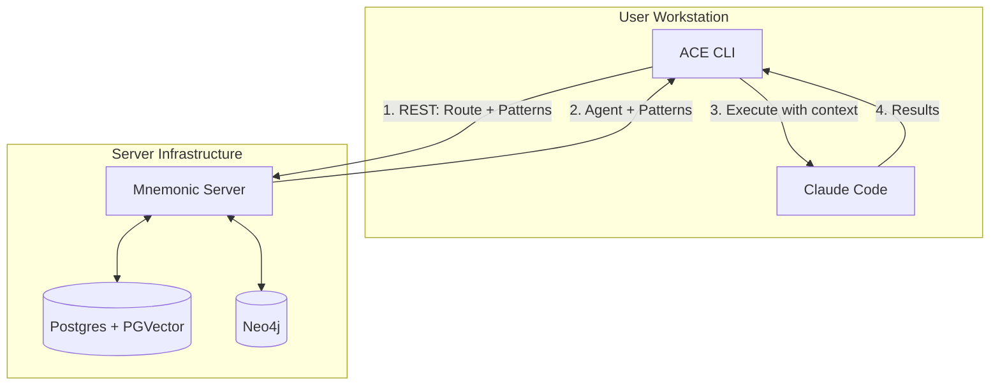

## Repository Structure

ACE is a monorepo containing two binaries built from a single Go module:

| Binary       | Purpose                                                             |
| ------------ | ------------------------------------------------------------------- |
| **mnemonic** | Backend server providing routing and pattern retrieval via REST API |
| **ace**      | CLI client that orchestrates routing decisions and execution        |

The monorepo structure enables atomic commits across CLI and server, shared tooling (linting, testing infrastructure), and simpler dependency management. GitHub Actions path filters enable independent CI/CD pipelines for each binary.

## System Model

The ACE architecture follows a CLI-centric model where:

1. **ACE CLI** runs on the user's workstation and serves as the primary interface
2. **Mnemonic** provides centralized routing logic and pattern retrieval via REST API
3. **Claude Code** (or Anthropic API) handles actual LLM interactions and tool execution

This separation keeps routing deterministic and server-side while execution remains local.

## Phased Approach

### Phase 1: Claude Code Integration

The initial implementation leverages Claude Code as the execution engine.

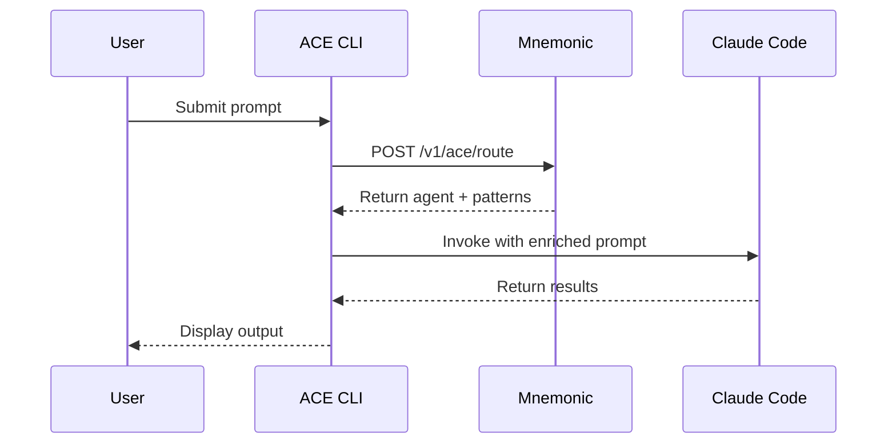

**Characteristics:**

- Claude Code installation required on workstation
- Routing rules centralized in Mnemonic
- Files written locally via Claude Code's native capabilities
- Benefits from Claude Code's existing tool ecosystem

### Phase 2: Direct API Integration

Future implementation removes Claude Code dependency by calling Anthropic API directly.

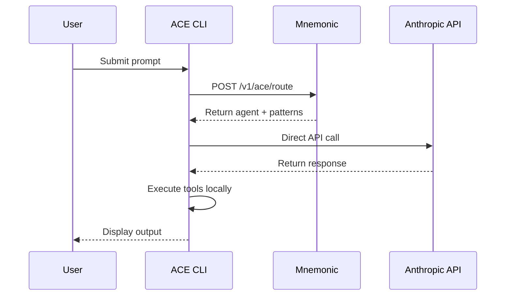

**Characteristics:**

- Only Anthropic account required (no Claude Code)
- ACE CLI handles tool execution locally
- Greater control over API interactions
- Reduced external dependencies

### Phase 3: Authentication and Authorization

Enterprise-grade security using infrastructure-layer components.

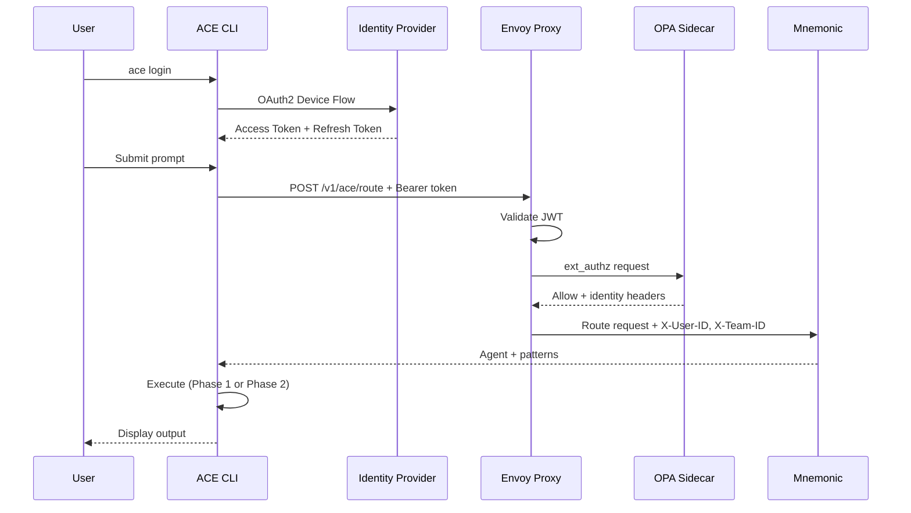

**Characteristics:**

- Authentication handled by Envoy at the edge (JWT validation, API keys)
- Authorization handled by OPA sidecar (fine-grained RBAC policies)
- Mnemonic receives pre-validated identity via headers (no security code in application)
- CLI manages token lifecycle (login, refresh, secure storage)
- Fail-closed design (deny by default when security services unavailable)
- Orthogonal to execution strategy (works with both Phase 1 and Phase 2)

## Key Principles

1. **Orchestration, not replacement**: ACE enhances Claude Code rather than replacing it
2. **Deterministic routing**: Routing decisions are code-based, predictable, and auditable
3. **Centralized patterns**: Team knowledge shared through a common memory service
4. **Local execution**: All file operations and tool execution happen on the user's machine
5. **Phased evolution**: Architecture supports gradual transition from Claude Code to direct API
6. **Infrastructure-layer security**: Authentication and authorization handled by dedicated components (Envoy, OPA), keeping application code security-agnostic

## Document Navigation

| Document                                                           | Description                            |
| ------------------------------------------------------------------ | -------------------------------------- |
| [01-requirements.md](01-requirements.md)                           | Problem statement and success criteria |
| [02-architectural-decisions.md](02-architectural-decisions.md)     | Key architectural decision records     |
| [03-system-architecture.md](03-system-architecture.md)             | Component breakdown and data flow      |
| [04-communication-patterns.md](04-communication-patterns.md)       | Protocol and integration patterns      |
| [05-deployment-architecture.md](05-deployment-architecture.md)     | Deployment topology and operations     |
| [06-security-architecture.md](06-security-architecture.md)         | Phase 3 authentication and authorization |
| [07-observability-architecture.md](07-observability-architecture.md) | Monitoring, logging, and tracing       |
| [project-structure.md](project-structure.md)                       | Repository layout and organization     |
| [mnemonic-integration-concept.md](mnemonic-integration-concept.md) | ACE + Mnemonic integration details     |

## Design Documents

Architecture documents describe **what** the system does and **why** decisions were made. Design documents (in `docs/design/`) contain **how** - the detailed specifications produced during implementation.

### Architecture vs Design

| Aspect   | Architecture Docs               | Design Docs            |
| -------- | ------------------------------- | ---------------------- |
| Focus    | Concepts, decisions, trade-offs | Implementation details |
| Audience | All stakeholders                | Implementers           |
| Timing   | Before implementation           | During implementation  |
| Location | `docs/architecture/`            | `docs/design/`         |

### Available Design Documents

The following design documents provide implementation details:

**ACE CLI:**

| Document                                                                    | Description             | Status   |
| --------------------------------------------------------------------------- | ----------------------- | -------- |
| [configuration.md](../design/ace_cli/configuration.md)                      | CLI configuration       | Complete |

**Mnemonic Service:**

| Document                                                                              | Description                            | Status   |
| ------------------------------------------------------------------------------------- | -------------------------------------- | -------- |
| [api-specification.md](../design/mnemonic_service/api-specification.md)               | OpenAPI spec for Mnemonic REST API     | Complete |
| [pattern-processing.md](../design/mnemonic_service/pattern-processing.md)             | Pattern enrichment and search pipeline | Complete |
| [routing-engine.md](../design/mnemonic_service/routing-engine.md)                     | Routing algorithm details              | Complete |
| [configuration.md](../design/mnemonic_service/configuration.md)                       | Server configuration                   | Complete |
| [observability-implementation.md](../design/mnemonic_service/observability-implementation.md) | Observability design           | Complete |

### Cross-References

Design documents should reference back to these architecture documents for context. When implementing a feature:

1. Review the relevant architecture document for context and constraints
2. Create or update the design document with implementation details
3. Link back to architecture docs to explain why decisions were made

**Next:** [Requirements](01-requirements.md)
# ACE Requirements

[Back to Overview](00-overview.md) | [Back to Project README](../../README.md)

## Table of Contents

- [Problem Statement](#problem-statement)
- [Goals](#goals)
- [Non-Goals](#non-goals)
- [Success Criteria](#success-criteria)
- [Constraints](#constraints)
- [Assumptions](#assumptions)

## Problem Statement

Teams using Claude Code face several challenges when working at scale:

1. **Inconsistent routing**: Without centralized logic, each team member makes ad-hoc decisions about which agent or approach to use for a given task
2. **Knowledge silos**: Patterns, prompts, and best practices remain isolated on individual workstations
3. **No shared memory**: Teams cannot leverage collective learnings or maintain organizational knowledge
4. **Manual orchestration**: Complex workflows require manual coordination between multiple Claude Code sessions

ACE addresses these challenges by providing an orchestration layer that centralizes routing decisions and enables shared access to patterns and knowledge.

## Goals

### Primary Goals

- **Centralized routing**: Provide deterministic, auditable routing logic that ensures consistent task handling across the team
- **Shared patterns**: Enable teams to store, retrieve, and evolve reusable patterns through a common service
- **Claude Code integration**: Leverage existing Claude Code capabilities without requiring users to change their workflow significantly
- **Team collaboration**: Allow routing rules and patterns to be managed centrally while execution remains local

### Secondary Goals

- **Gradual adoption**: Support incremental adoption where teams can start with basic routing and add complexity over time
- **Future flexibility**: Design for eventual transition to direct Anthropic API integration (Phase 2)
- **Minimal infrastructure**: Keep server-side components lightweight and easy to deploy

## Non-Goals

The following are explicitly out of scope:

- **Replacing Claude Code**: ACE orchestrates Claude Code; it does not replace its functionality
- **Running LLM inference on server**: All LLM interactions happen locally via Claude Code or direct API calls from the CLI
- **Managing user credentials**: ACE does not store or manage Anthropic API keys (the user's LLM credentials). Note: This non-goal refers specifically to external API keys. ACE does manage its own internal OAuth tokens for Mnemonic authentication (Phase 3), which are stored securely using platform-native mechanisms as described in the [Security Architecture](06-security-architecture.md#token-storage)
- **File synchronization**: ACE does not sync files between workstations; file operations are strictly local
- **Real-time collaboration**: ACE does not provide real-time collaborative editing or presence features

## Success Criteria

### Phase 1 (MVP)

| Criterion             | Measure                                                                   |
| --------------------- | ------------------------------------------------------------------------- |
| Routing functionality | CLI successfully routes requests through Mnemonic to appropriate handlers |
| Pattern retrieval     | Patterns stored in Mnemonic are accessible to all team members            |
| Claude Code execution | Local Claude Code invocation works seamlessly with enriched context       |
| Team adoption         | Multiple team members can use the same centralized routing configuration  |

### Phase 2 (Future)

| Criterion              | Measure                                                      |
| ---------------------- | ------------------------------------------------------------ |
| Direct API integration | CLI can call Anthropic API directly without Claude Code      |
| Local tool execution   | CLI handles tool calls and file operations natively          |
| Feature parity         | All Phase 1 capabilities work without Claude Code dependency |

### Quality Attributes

- **Reliability**: Routing decisions are deterministic and reproducible
- **Performance**: API overhead does not significantly impact response times
- **Maintainability**: Routing rules can be updated without client-side changes
- **Observability**: Routing decisions and pattern usage are logged for analysis

## Constraints

### Technical Constraints

- **Claude Code dependency (Phase 1)**: Initial implementation requires Claude Code installation on user workstations
- **Network connectivity**: CLI must reach Mnemonic for routing decisions

### Organizational Constraints

- **Existing workflows**: Must integrate with how teams currently use Claude Code
- **Security requirements**: Patterns and routing rules may contain sensitive information
- **Operational capacity**: Server infrastructure should be minimal and easy to maintain

## Assumptions

1. **Claude Code availability**: Team members have Claude Code installed and configured (Phase 1)
2. **Network access**: Workstations can reach the Mnemonic endpoint
3. **Anthropic accounts**: Users have valid Anthropic API access (via Claude Code or direct API key)
4. **Pattern quality**: Teams will maintain and curate patterns stored in Mnemonic
5. **Routing rule governance**: Someone owns the responsibility for maintaining routing logic

**Next:** [Architectural Decisions](02-architectural-decisions.md)
# Architectural Decisions

[Back to Overview](00-overview.md) | [Back to Project README](../../README.md)

## Table of Contents

- [Decision Record Format](#decision-record-format)
- [ADR-001: Orchestrator Model](#adr-001-orchestrator-model)
- [ADR-002: Routing Location](#adr-002-routing-location)
- [ADR-003: Claude Code Integration Strategy](#adr-003-claude-code-integration-strategy)
- [ADR-004: Unified Backend with REST API](#adr-004-unified-backend-with-rest-api)
- [ADR-005: Monorepo Structure](#adr-005-monorepo-structure)
- [ADR-006: Phased Evolution Path](#adr-006-phased-evolution-path)
- [Decision Summary](#decision-summary)

## Decision Record Format

Each architectural decision follows this structure:

- **Context**: The situation and forces at play
- **Decision**: What we decided to do
- **Consequences**: The results of the decision, both positive and negative

## ADR-001: Orchestrator Model

### Context

We needed to decide whether ACE should:

1. Replace Claude Code entirely with a custom implementation
2. Wrap Claude Code with additional functionality
3. Orchestrate Claude Code as an execution engine

Teams already use Claude Code effectively. The challenge is coordination and shared knowledge, not the underlying LLM capabilities.

### Decision

**ACE is an orchestration layer on top of Claude Code, not a replacement.**

ACE provides:

- Deterministic routing logic (code-based, not LLM-driven)
- Dynamic patterns from Mnemonic (the unified backend)
- Local execution via Claude Code (Phase 1) or direct Anthropic API (Phase 2)

### Consequences

**Positive:**

- Preserves existing Claude Code workflows and capabilities
- Teams can adopt ACE incrementally
- Reduces implementation complexity significantly
- Benefits from Claude Code's tool ecosystem and updates

**Negative:**

- Depends on Claude Code for Phase 1 (external dependency)
- Limited control over Claude Code's internal behavior
- Must design for eventual Phase 2 transition

## ADR-002: Routing Location

### Context

Routing logic could live in:

1. **Client-side (CLI)**: Each workstation has its own routing rules
2. **Server-side (API)**: Centralized routing service
3. **Hybrid**: Basic routing client-side, complex routing server-side

Key considerations:

- Team collaboration requires shared routing rules
- Routing updates should not require client deployments
- Routing decisions should be auditable

### Decision

**Routing logic lives server-side in Mnemonic.**

The CLI sends requests to Mnemonic, which determines the appropriate route and returns enriched context. The CLI then invokes Claude Code locally.

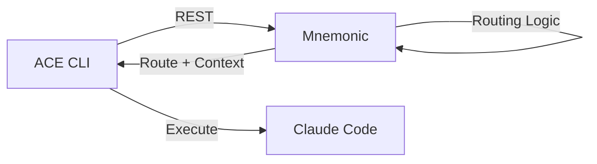

### Consequences

**Positive:**

- Centralized routing enables team-wide consistency
- Routing updates deploy once, affect all users immediately
- Routing decisions can be logged and analyzed centrally
- No client updates needed for routing changes

**Negative:**

- Requires network connectivity to Mnemonic
- Mnemonic becomes a dependency for all operations
- Must handle Mnemonic unavailability gracefully

## ADR-003: Claude Code Integration Strategy

### Context

Claude Code can be invoked in several ways:

1. **Direct CLI invocation**: ACE CLI spawns Claude Code as a subprocess
2. **API integration**: ACE CLI calls Claude Code's API (if available)
3. **Wrapper script**: ACE provides a script that wraps Claude Code commands

The integration must:

- Pass enriched context (routing + patterns) to Claude Code
- Capture and return results to the user
- Work with Claude Code's existing interface

### Decision

**ACE CLI invokes Claude Code directly as the execution engine.**

The CLI:

1. Receives routing decision and patterns from Mnemonic
2. Constructs an enriched prompt with context
3. Invokes Claude Code with the enriched prompt
4. Returns results to the user

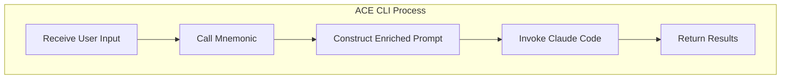

### Consequences

**Positive:**

- Leverages Claude Code's full capabilities
- Minimal wrapper complexity
- Users see familiar Claude Code behavior
- File operations handled natively by Claude Code

**Negative:**

- Claude Code must be installed and configured
- Limited control over Claude Code's internal processing
- Must handle Claude Code version differences

## ADR-004: Unified Backend with REST API

### Context

We needed to decide how to structure the backend services and what protocol to use for CLI-to-server communication.

Options considered:

1. **Separate services**: ACE API for routing + separate Shared Memory Service for patterns
2. **Unified backend**: Single service (Mnemonic) handling both routing and patterns
3. **Protocol options**: REST, gRPC, or MCP for external API

Key considerations:

- Simplicity of deployment and operations
- Developer experience for CLI integration
- Debugging and tooling support
- Future extensibility

### Decision

**Mnemonic is the unified backend providing both routing and pattern retrieval via REST API.**

For MVP, Mnemonic serves only ACE (not a general-purpose memory service). This keeps the scope focused while the architecture matures.

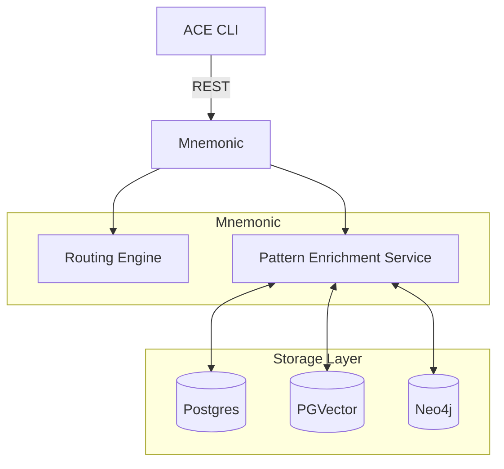

See [Communication Patterns](04-communication-patterns.md#rest-endpoints) for REST endpoint details.

### Consequences

**Positive:**

- Single backend simplifies deployment and operations
- REST is universally understood with excellent tooling
- Easy to debug with curl, Postman, browser dev tools
- No protocol translation between services
- MVP scope keeps complexity manageable

**Negative:**

- REST less efficient than gRPC for internal communication
- Single service means single point of failure
- MVP scope limits immediate reusability for other tools

### Future Extensibility

While MVP scope limits Mnemonic to serving ACE only, the architecture accommodates future expansion:

| Aspect | MVP (Current) | Future Possibility |
| ------ | ------------- | ------------------ |
| Clients | ACE CLI only | Multiple tools/services |
| Tenancy | Single-tenant | Multi-tenant capable |
| Authentication | Basic/none | Per-tenant auth, API keys |
| Data isolation | Shared | Tenant-separated storage |

**Privacy consideration:** Full prompts are sent to Mnemonic for routing but are not persisted. This design choice supports potential future multi-tenant scenarios where prompt data privacy becomes critical.

**Expansion requirements:** Moving beyond ACE-only would require additional design work:

- Authentication and authorization framework
- Tenant isolation in storage layers (Postgres, PGVector, Neo4j)
- Rate limiting and quota management per tenant
- Audit logging for compliance

The current architecture does not preclude these additions, but they are explicitly out of scope for MVP to keep initial complexity manageable.

## ADR-005: Monorepo Structure

### Context

We needed to decide how to organize the codebase for ACE CLI and Mnemonic backend.

Options considered:

1. **Monorepo**: Single repository containing both CLI and Mnemonic
2. **Separate repos**: Distinct repositories for CLI and backend

Key considerations:

- Atomic changes across CLI and server
- Shared tooling and infrastructure
- Dependency management simplicity
- CI/CD flexibility

### Decision

**ACE is a monorepo containing two binaries built from a single Go module.**

| Directory         | Purpose                                                                  |
| ----------------- | ------------------------------------------------------------------------ |
| **src/ace/**      | CLI client that orchestrates routing decisions and Claude Code execution |
| **src/mnemonic/** | Backend server providing routing and pattern retrieval via REST API      |

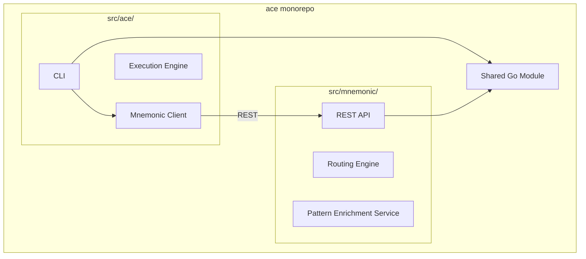

GitHub Actions path filters enable independent CI/CD pipelines while maintaining the benefits of a unified codebase.

### Consequences

**Positive:**

- Atomic commits across CLI and server ensure consistency
- Shared tooling (linting, testing infrastructure, build scripts)
- Simpler dependency management with single Go module
- Single versioning story for coordinated releases
- Path-filtered CI/CD allows independent builds when needed
- Easier refactoring when interfaces change

**Negative:**

- Repository size grows with both components
- CI/CD requires path filtering configuration
- All contributors have access to entire codebase

## ADR-006: Phased Evolution Path

### Context

The architecture must support:

- **Phase 1**: Claude Code as the execution engine (MVP)
- **Phase 2**: Direct Anthropic API calls (future)

This transition should be:

- Transparent to users
- Achievable without architectural rewrites
- Optional (teams can stay on Phase 1 if preferred)

### Decision

**Design for Phase 2 from the start, implement Phase 1 first.**

The CLI abstracts the execution layer:

- Phase 1: Execution layer calls Claude Code
- Phase 2: Execution layer calls Anthropic API directly

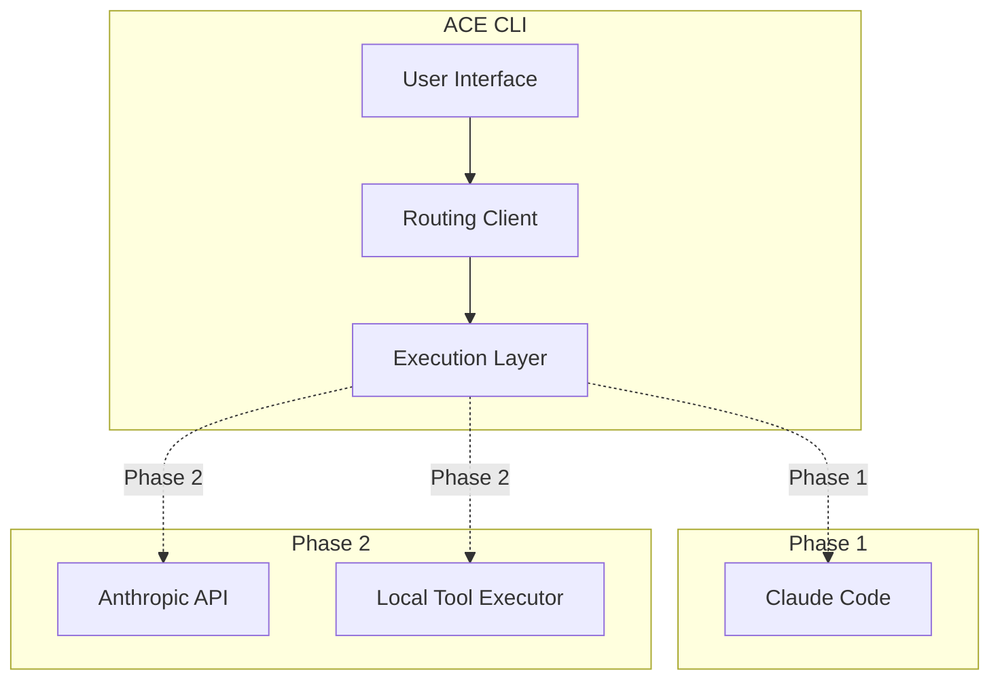

### Consequences

**Positive:**

- Clear evolution path reduces future rework
- Phase 1 delivers value quickly
- Phase 2 removes Claude Code dependency
- Teams can choose their preferred execution model

**Negative:**

- Phase 2 requires implementing tool execution locally
- Must maintain two execution paths (at least during transition)
- Phase 2 complexity is deferred, not eliminated

## Decision Summary

| Decision | Choice                    | Rationale                                            |
| -------- | ------------------------- | ---------------------------------------------------- |
| ADR-001  | Orchestrator model        | Leverage existing Claude Code capabilities           |
| ADR-002  | Server-side routing       | Enable team collaboration and central management     |
| ADR-003  | Direct CLI invocation     | Minimize wrapper complexity                          |
| ADR-004  | Unified backend with REST | Simplicity, excellent tooling, easy debugging        |
| ADR-005  | Monorepo structure        | Atomic changes, shared tooling, simpler dependencies |
| ADR-006  | Phased evolution          | Deliver value early, design for future               |

**Next:** [System Architecture](03-system-architecture.md)
# System Architecture

[Back to Overview](00-overview.md) | [Back to Project README](../../README.md)

## Table of Contents

- [Architecture Overview](#architecture-overview)
- [Component Breakdown](#component-breakdown)
  - [ACE CLI](#ace-cli)
  - [Mnemonic](#mnemonic)
- [Data Flow](#data-flow)
- [CLI-Centric Model](#cli-centric-model)
- [Component Interactions](#component-interactions)
- [Boundary Definitions](#boundary-definitions)

## Architecture Overview

ACE follows a distributed architecture with clear separation between client-side execution and server-side orchestration.

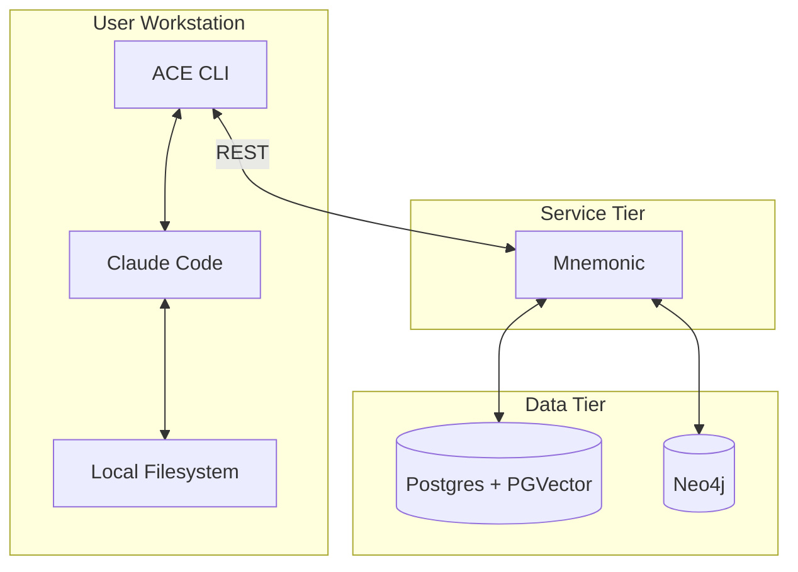

## Component Breakdown

### ACE CLI

The CLI is the primary user interface and orchestrates local execution.

**Responsibilities:**

- Accept user prompts and commands
- Request routing decisions from Mnemonic
- Construct enriched prompts with patterns and context
- Invoke Claude Code (Phase 1) or Anthropic API (Phase 2)
- Display results to the user

**Key Characteristics:**

- Runs on user workstation
- Stateless between invocations (state lives in Mnemonic)
- Handles authentication to external services
- Manages local execution environment

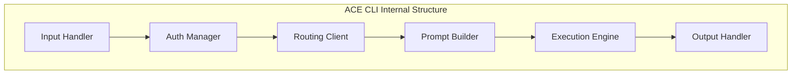

### Mnemonic

Mnemonic is the backend server that provides routing decisions and pattern retrieval via REST API. For MVP, Mnemonic serves only ACE (not a general-purpose memory service).

**Responsibilities:**

- Receive routing requests from CLI instances
- Apply deterministic routing logic to select the appropriate agent
- Retrieve relevant patterns for context enrichment
- Return routing decision and patterns to CLI

**Key Characteristics:**

- Lightweight service (no LLM calls)
- Deterministic routing (code-based logic)
- Stateless request handling
- REST API interface
- Full storage stack: Postgres + PGVector + Neo4j

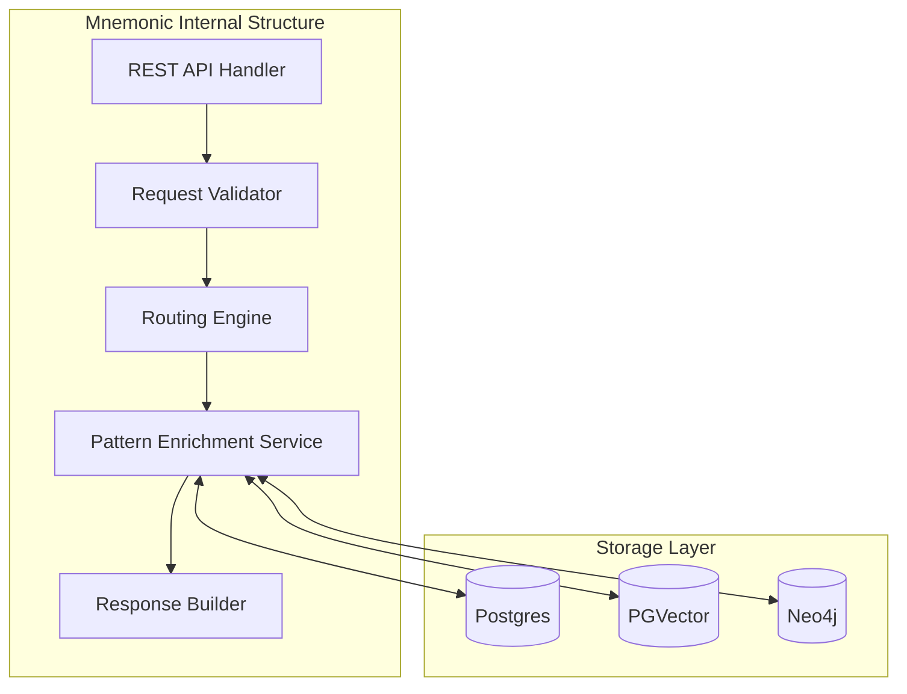

See [Communication Patterns](04-communication-patterns.md#rest-endpoints) for REST endpoint details.

**What Mnemonic Does NOT Do:**

- Make LLM API calls
- Store user credentials
- Execute tools or file operations
- Maintain session state

## Data Flow

The following diagram shows the complete data flow for a typical request.

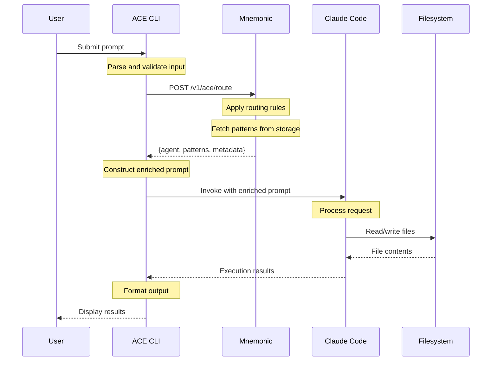

## CLI-Centric Model

ACE follows a CLI-centric model where:

1. **CLI is the orchestrator**: The CLI coordinates between user, Mnemonic, and execution engine
2. **Mnemonic is advisory**: Mnemonic provides routing decisions but does not execute
3. **Execution is local**: All LLM interactions and tool execution happen on the workstation

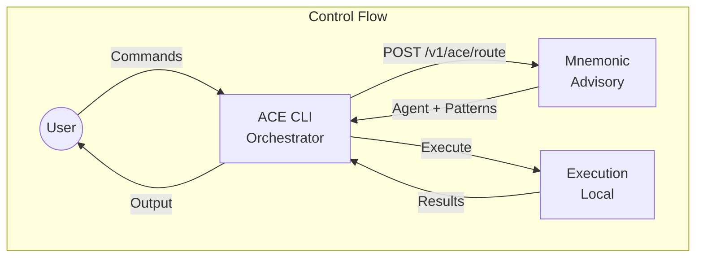

**Benefits of CLI-Centric Model:**

- No server-side LLM costs
- User data stays local
- Works offline after routing decision (with caching)
- Leverages existing Claude Code setup

## Component Interactions

### CLI to Mnemonic

| Aspect            | Detail                                       |
| ----------------- | -------------------------------------------- |
| Protocol          | REST (HTTP/HTTPS)                            |
| Authentication    | To be specified in design phase              |
| Request contains  | Full prompt, context hints, user preferences |
| Response contains | Agent identifier, patterns, execution hints  |

**Note:** Full prompts are sent to Mnemonic for routing but are not persisted. Mnemonic is organization-controlled infrastructure and requires the full prompt for accurate routing via keyword matching, regex, and semantic similarity.

See [Communication Patterns](04-communication-patterns.md#rest-endpoints) for REST endpoint details.

### CLI to Claude Code

| Aspect            | Detail                                                                 |
| ----------------- | ---------------------------------------------------------------------- |
| Invocation method | Direct subprocess invocation (see ADR-003 in Architectural Decisions) |
| Context passing   | Enriched prompt with routing decision and patterns from Mnemonic       |
| Result capture    | Standard output/error streams from Claude Code process                 |

See [ADR-003: Claude Code Integration Strategy](02-architectural-decisions.md#adr-003-claude-code-integration-strategy) for the full specification of the execution model.

## Boundary Definitions

Clear boundaries separate concerns between components.

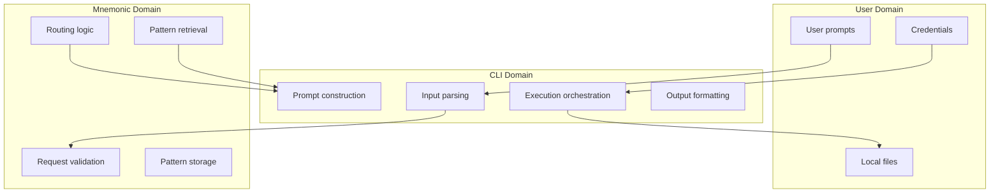

**Boundary Rules:**

- User credentials never leave the CLI
- Routing logic lives only in Mnemonic
- Pattern storage lives only in Mnemonic
- File operations happen only on the workstation

**Next:** [Communication Patterns](04-communication-patterns.md)
# Communication Patterns

[Back to Overview](00-overview.md) | [Back to Project README](../../README.md)

## Table of Contents

- [Overview](#overview)
- [CLI to Mnemonic Communication](#cli-to-mnemonic-communication)
  - [REST Endpoints](#rest-endpoints)
  - [Request Flow](#request-flow)
  - [Response Structure](#response-structure)
  - [Error Handling](#error-handling)
- [CLI to Claude Code Communication](#cli-to-claude-code-communication)
- [Resilience Patterns](#resilience-patterns)
- [Security Considerations](#security-considerations)

## Overview

ACE uses distinct communication patterns for each component boundary.

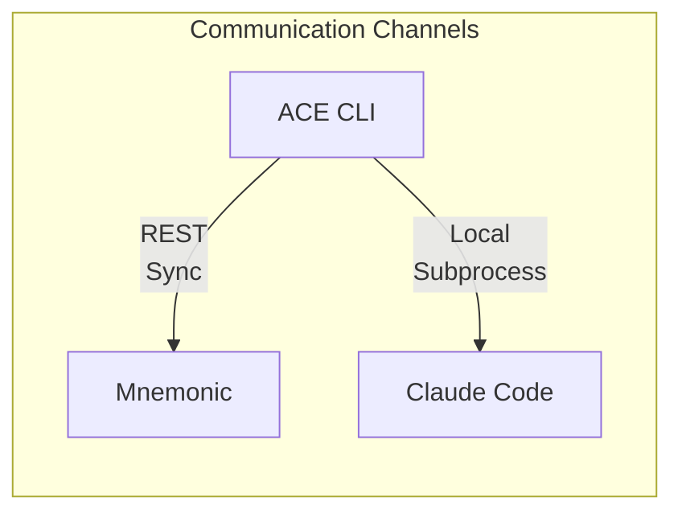

## CLI to Mnemonic Communication

The CLI communicates with Mnemonic via REST for routing decisions and pattern retrieval.

### REST Endpoints

Mnemonic exposes the following REST endpoints for ACE:

| Endpoint                | Method | Purpose                               |
| ----------------------- | ------ | ------------------------------------- |
| `/v1/ace/route`         | POST   | Deterministic routing based on prompt |
| `/v1/ace/patterns`      | GET    | Pattern retrieval for agent + context |
| `/v1/ace/agents`        | GET    | List available agents                 |
| `/v1/ace/agents/{name}` | GET    | Get agent details                     |

> **Note:** This table shows primary endpoints. See the [API Specification](../design/mnemonic_service/api-specification.md) for the complete endpoint reference including patterns and routing-rules CRUD operations.

### Request Flow

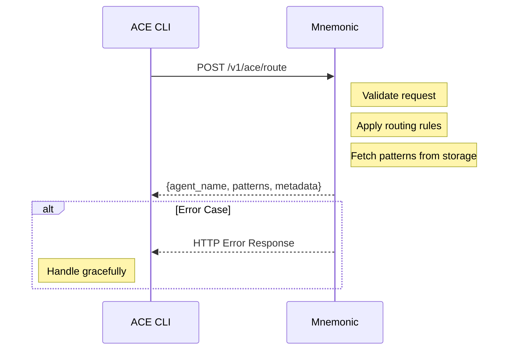

**Request Characteristics:**

- Synchronous request-response
- Contains full prompt for accurate routing decisions
- Includes context hints for better routing
- Authenticated per team/user

**Request Body for `/v1/ace/route`:**

| Field     | Purpose                          |
| --------- | -------------------------------- |
| `prompt`  | Full prompt for routing decision |
| `context` | Domain, task type, preferences   |
| `options` | Optional routing configuration   |

### Response Structure

The response provides everything the CLI needs for local execution.

**Response Fields:**

| Field        | Purpose                                   |
| ------------ | ----------------------------------------- |
| `agent_name` | Which agent to invoke                     |
| `patterns`   | Retrieved patterns for context enrichment |
| `hints`      | Suggested parameters for Claude Code      |
| `metadata`   | Routing rationale for logging/debugging   |

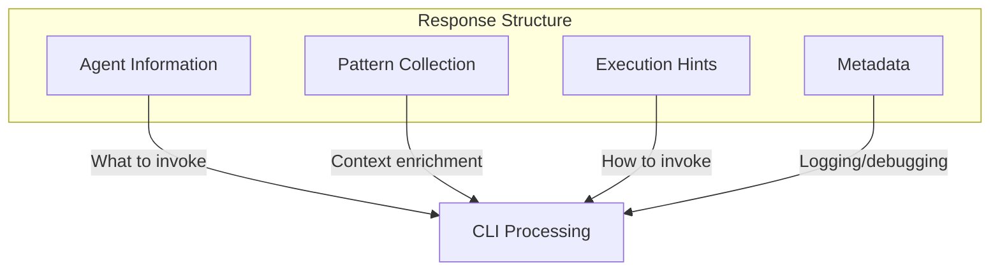

### Error Handling

The CLI must handle Mnemonic errors gracefully.

| HTTP Status   | Meaning      | CLI Behavior                               |
| ------------- | ------------ | ------------------------------------------ |
| 400           | Bad Request  | Display validation errors                  |
| 401           | Unauthorized | Prompt for re-authentication               |
| 404           | Not Found    | Agent or pattern not found                 |
| 500           | Server Error | Retry with backoff, then fail gracefully   |
| Network Error | Unreachable  | Post-MVP: Fallback behavior to be designed |

## CLI to Claude Code Communication

The CLI invokes Claude Code as a local subprocess for execution.

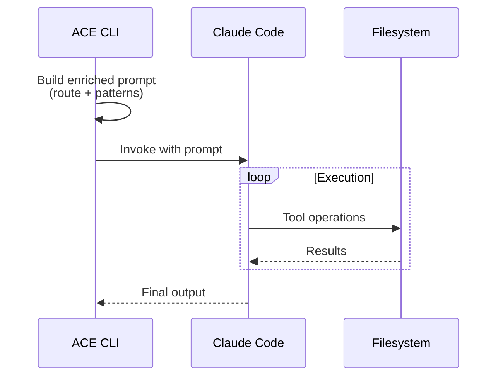

**Invocation Characteristics (per [ADR-003](02-architectural-decisions.md#adr-003-claude-code-integration-strategy)):**

| Aspect           | Detail                                                                 |
| ---------------- | ---------------------------------------------------------------------- |
| Method           | Subprocess spawn - CLI invokes Claude Code directly as execution engine |
| Prompt passing   | CLI constructs enriched prompt (route context + patterns), passes to Claude Code |
| Output capture   | Claude Code returns results to CLI, which presents them to user        |
| Timeout handling | Long timeout with progress indication (see [Timeout Handling](#timeout-handling)) |

**Context Enrichment:**

The CLI constructs an enriched prompt by combining:

1. Original user prompt
2. Routing context from Mnemonic
3. Retrieved patterns
4. Execution hints

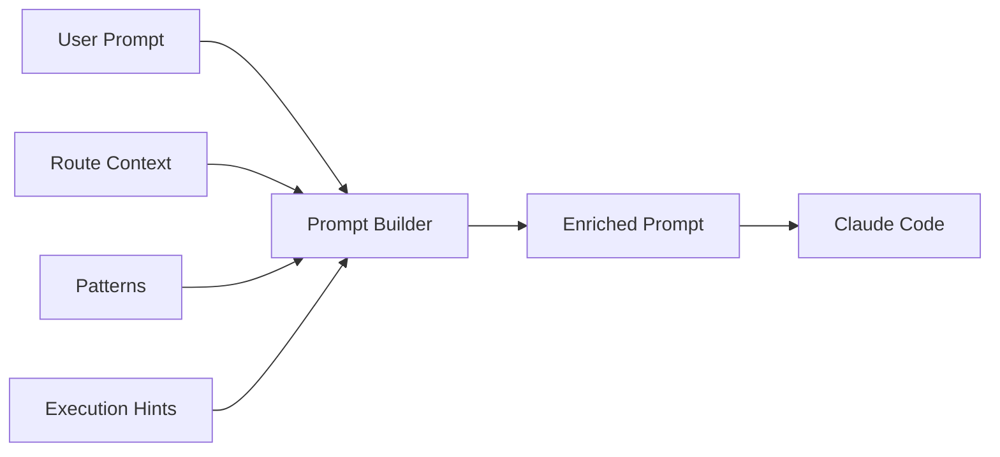

## Resilience Patterns

### Timeout Handling

Each communication channel has timeout considerations.

```mermaid
graph TB
    subgraph "Timeout Strategy"
        CLI_MN[CLI to Mnemonic<br/>5s timeout]
        CLI_CC[CLI to Claude Code<br/>300s timeout]
    end
```

| Channel            | Timeout Strategy                                                                 |
| ------------------ | -------------------------------------------------------------------------------- |
| CLI to Mnemonic    | **5s** - fail fast for routing decisions (configurable via `server.timeout`)     |
| CLI to Claude Code | **300s** (5 minutes) - long timeout for LLM execution with progress indication   |

### Retry Logic

```mermaid
graph TB
    REQUEST[Request] --> ATTEMPT[Attempt]
    ATTEMPT -->|Success| DONE[Done]
    ATTEMPT -->|Transient Failure| BACKOFF[Exponential Backoff]
    BACKOFF --> ATTEMPT
    ATTEMPT -->|Permanent Failure| FAIL[Fail Gracefully]
    BACKOFF -->|Max Retries| FAIL
```

**Retry Considerations:**

- Idempotent operations only
- Exponential backoff
- Maximum retry limits
- Clear failure messaging

### Fallback Behavior

When components are unavailable:

| Scenario             | Fallback                                   |
| -------------------- | ------------------------------------------ |
| Mnemonic unreachable | Post-MVP: Fallback behavior to be designed |
| Claude Code fails    | Display error, suggest retry               |

## Security Considerations

### Data in Transit

| Channel            | Security Requirement               |
| ------------------ | ---------------------------------- |
| CLI to Mnemonic    | TLS required; auth to be specified |
| CLI to Claude Code | Local only, no network             |

### Sensitive Data Handling

```mermaid
graph TB
    subgraph "Data Classification"
        PROMPT[User Prompts<br/>Sent for routing]
        PATTERNS[Patterns<br/>Team-shared]
        ROUTES[Routes<br/>Configuration]
        CREDS[Credentials<br/>CLI only]
    end

    PROMPT -->|"Sent for routing<br/>(not persisted)"| MN[Mnemonic]
    PATTERNS -->|"Stored in Mnemonic"| MN
    ROUTES -->|"Managed in Mnemonic"| MN
    CREDS -->|"Stays local"| CLI[ACE CLI]
```

**Key Principles:**

- Full prompts sent to Mnemonic for routing (not persisted)
- Mnemonic is organization-controlled infrastructure (not a third-party service)
- Routing accuracy requires full prompt for keyword matching, regex, and semantic similarity
- Patterns are team-shared (access controlled)
- Credentials never leave CLI
- Actual LLM calls go directly from CLI to Anthropic API (not through Mnemonic)

**Next:** [Deployment Architecture](05-deployment-architecture.md)
# Deployment Architecture

[Back to Overview](00-overview.md) | [Back to Project README](../../README.md)

## Table of Contents

- [Deployment Overview](#deployment-overview)
- [Deployment Topology](#deployment-topology)
- [Component Deployment](#component-deployment)
  - [ACE CLI](#ace-cli)
  - [Mnemonic](#mnemonic)
- [Infrastructure Requirements](#infrastructure-requirements)
- [Operational Considerations](#operational-considerations)
- [Scaling Considerations](#scaling-considerations)

## Deployment Overview

ACE uses a lightweight deployment model with minimal server-side infrastructure. The heavy lifting (LLM inference, tool execution) happens on user workstations.

```mermaid
graph TB
    subgraph "User Workstations"
        WS1[Workstation 1<br/>ACE CLI + Claude Code]
        WS2[Workstation 2<br/>ACE CLI + Claude Code]
        WS3[Workstation N<br/>ACE CLI + Claude Code]
    end

    subgraph "Server Infrastructure"
        MN[Mnemonic]
        PG[(Postgres + PGVector)]
        NEO[(Neo4j)]
    end

    WS1 -->|"REST"| MN
    WS2 -->|"REST"| MN
    WS3 -->|"REST"| MN
    MN --> PG
    MN --> NEO
```

## Deployment Topology

### Logical View

```mermaid
graph TB
    subgraph "Client Tier"
        CLI[ACE CLI instances]
    end

    subgraph "Service Tier"
        MN[Mnemonic<br/>Routing + Patterns]
    end

    subgraph "Data Tier"
        PG[(Postgres + PGVector)]
        NEO[(Neo4j)]
    end

    CLI -->|"REST"| MN
    MN --> PG
    MN --> NEO
```

### Physical View

The physical deployment is intentionally simple.

```mermaid
graph TB
    subgraph "Developer Machines"
        D1[Dev 1]
        D2[Dev 2]
        DN[Dev N]
    end

    subgraph "Server Environment"
        subgraph "Container Runtime"
            MN_C[Mnemonic Container]
        end
        PG[(Postgres + PGVector)]
        NEO[(Neo4j)]
    end

    D1 -->|"REST"| MN_C
    D2 -->|"REST"| MN_C
    DN -->|"REST"| MN_C
    MN_C --> PG
    MN_C --> NEO
```

## Component Deployment

### ACE CLI

**Deployment Location:** User workstations

**Characteristics:**

- Installed per-user or per-machine
- No persistent state (stateless between invocations)
- Requires network access to Mnemonic
- Requires Claude Code installation (Phase 1)

**Distribution:**

Post-MVP: Distribution mechanism to be designed after initial release.

| Aspect        | Detail                                         |
| ------------- | ---------------------------------------------- |
| Method        | Post-MVP: To be designed after initial release |
| Updates       | Post-MVP: To be designed after initial release |
| Configuration | Post-MVP: To be designed after initial release |

### Mnemonic

**Deployment Location:** Server infrastructure

**Characteristics:**

- Stateless service (routing rules and patterns from storage)
- Lightweight (no LLM inference)
- Horizontally scalable (if needed)
- Single point of contact for all CLI instances
- REST API for external communication

**Resource Requirements:**

| Resource | Expectation                                 |
| -------- | ------------------------------------------- |
| CPU      | Low to moderate (routing + pattern queries) |
| Memory   | Moderate (caching, pattern indexing)        |
| Storage  | Via external databases (Postgres, Neo4j)    |
| Network  | Moderate (all CLI traffic)                  |

**Storage Stack:**

- **Postgres** - Relational data (agents, routing rules, metadata)
- **PGVector** - Vector embeddings for semantic search
- **Neo4j** - Knowledge graph for pattern relationships

## Infrastructure Requirements

### Server Infrastructure

The server-side footprint is intentionally minimal.

```mermaid
graph TB
    subgraph "Minimal Deployment"
        SINGLE[Single Container<br/>Mnemonic]
        PG1[(Postgres + PGVector)]
        NEO1[(Neo4j)]
        SINGLE --> PG1
        SINGLE --> NEO1
    end

    subgraph "Scaled Deployment"
        LB[Load Balancer]
        MN1[Mnemonic 1]
        MN2[Mnemonic 2]
        PG2[(Postgres + PGVector)]
        NEO2[(Neo4j)]
    end

    LB --> MN1
    LB --> MN2
    MN1 --> PG2
    MN1 --> NEO2
    MN2 --> PG2
    MN2 --> NEO2
```

**Minimal Deployment:**

- Single Mnemonic container
- External Postgres and Neo4j databases
- Suitable for small teams

**Scaled Deployment:**

- Multiple Mnemonic instances behind load balancer
- Shared database backends
- Suitable for larger teams or high availability requirements

### Client Requirements

| Requirement       | Phase 1         | Phase 2                 |
| ----------------- | --------------- | ----------------------- |
| ACE CLI           | Required        | Required                |
| Claude Code       | Required        | Optional                |
| Anthropic API key | Via Claude Code | Direct                  |
| Network access    | To Mnemonic     | To Mnemonic + Anthropic |

## Operational Considerations

### Monitoring

Key metrics to monitor:

| Component        | Metrics                                            |
| ---------------- | -------------------------------------------------- |
| Mnemonic         | Request rate, latency, error rate, pattern queries |
| Postgres         | Connection count, query latency, storage usage     |
| Neo4j            | Query latency, memory usage, connection count      |
| CLI (aggregated) | Usage patterns, version distribution               |

### Logging

**MVP scope:** Mnemonic emits structured logs with trace correlation via OpenTelemetry (see [Observability Architecture](07-observability-architecture.md)). Log collection and storage infrastructure (Loki) is Post-MVP.

| Component | Log Focus                                                               |
| --------- | ----------------------------------------------------------------------- |
| Mnemonic  | Routing decisions, pattern queries, errors (instrumented in MVP)        |
| CLI       | Post-MVP: Aggregated usage telemetry and logging to be designed         |

**Note:** "Post-MVP" for CLI logging refers to the entire CLI telemetry design. For Mnemonic, MVP includes log instrumentation (emitting logs); Post-MVP includes log collection infrastructure (Loki aggregation, querying, retention).

### Backup and Recovery

| Component         | Strategy                                   |
| ----------------- | ------------------------------------------ |
| Routing rules     | Post-MVP: Backup procedures to be designed |
| Postgres data     | Post-MVP: Backup procedures to be designed |
| Neo4j data        | Post-MVP: Backup procedures to be designed |
| CLI configuration | Post-MVP: Backup procedures to be designed |

### Updates and Maintenance

```mermaid
graph TB
    subgraph "Update Strategy"
        MN_UP[Mnemonic Updates<br/>Rolling deployment]
        DB_UP[Database Updates<br/>Careful migration]
        CLI_UP[CLI Updates<br/>User-controlled]
    end
```

| Component | Update Approach                              |
| --------- | -------------------------------------------- |
| Mnemonic  | Rolling deployment, backward compatible      |
| Databases | Migration-aware, data preservation           |
| CLI       | User-initiated, version compatibility checks |

### Independent Deployment Pipelines

**CRITICAL PRINCIPLE:** Database migrations and application code are versioned and deployed independently.

```mermaid
graph TB
    subgraph "Code Changes"
        APP_CODE[internal/, cmd/**]
        DB_CODE[migrations/**]
    end

    subgraph "CI/CD Pipelines"
        APP_CI[mnemonic-app-ci.yaml<br/>Build, Test, Deploy Container]
        DB_CI[mnemonic-db-ci.yaml<br/>Validate, Test, Apply Migrations]
    end

    subgraph "Deployments"
        APP_DEPLOY[Application Container<br/>Version: v1.2.3]
        DB_DEPLOY[Database Schema<br/>Version: migration 005]
    end

    APP_CODE -->|triggers| APP_CI
    DB_CODE -->|triggers| DB_CI
    APP_CI --> APP_DEPLOY
    DB_CI --> DB_DEPLOY
```

**Why Separate Pipelines?**

| Scenario | Without Separation | With Separation |
| -------- | ------------------ | --------------- |
| Go logic bug fix | Rebuilds app AND runs migrations | App deploys only |
| Add new index | Rebuilds app container | Migrations run only |
| Add column + code | Single coupled deploy | Migration first, then app |

**Pipeline Triggers:**

| Pipeline | Triggers On | Does NOT Trigger On |
| -------- | ----------- | ------------------- |
| `mnemonic-app-ci.yaml` | `internal/**`, `cmd/**`, `go.mod` | `migrations/**` |
| `mnemonic-db-ci.yaml` | `migrations/**` | `internal/**`, `cmd/**` |

**Version Compatibility:**

- Application version: Git tag (e.g., `v1.2.3`)
- Database version: Highest applied migration (e.g., `005`)
- Compatibility matrix documented in release notes

**Deployment Order for Breaking Changes:**

```text
1. Deploy migration (forward-compatible: nullable/default values)
2. Verify migration succeeded in production
3. Deploy application (uses new schema)
4. (Optional) Deploy tightening migration (add NOT NULL, remove old columns)
```

This separation ensures:

- Faster deployments (only deploy what changed)
- Safer rollbacks (can rollback app without touching DB)
- Clear audit trail (which pipeline changed what)

## Scaling Considerations

### Horizontal Scaling

```mermaid
graph LR
    subgraph "Scaling Points"
        MN[Mnemonic<br/>Stateless, easy to scale]
        PG[Postgres<br/>Read replicas]
        NEO[Neo4j<br/>Query scaling]
    end
```

| Component | Scaling Approach                          |
| --------- | ----------------------------------------- |
| Mnemonic  | Add instances behind load balancer        |
| Postgres  | Read replicas, connection pooling         |
| Neo4j     | Post-MVP: Scaling approach to be designed |

### Performance Considerations

- Mnemonic latency should be minimal (routing is fast)
- Pattern queries should be cached where possible
- CLI-side caching can reduce Mnemonic calls
- Claude Code execution is the primary latency source (not ACE)

### Capacity Planning

| Factor         | Consideration                  |
| -------------- | ------------------------------ |
| Team size      | Number of concurrent CLI users |
| Request rate   | Queries per minute to Mnemonic |
| Pattern volume | Total patterns in storage      |
| Pattern size   | Average pattern complexity     |

**Next:** Return to [Architecture Overview](00-overview.md)
# Security Architecture

[Back to Overview](00-overview.md) | [Back to Project README](../../README.md)

## Table of Contents

- [Introduction](#introduction)
- [Security Model Overview](#security-model-overview)
- [Authentication](#authentication)
  - [JWT Tokens](#jwt-tokens-primary)
  - [API Keys](#api-keys-secondary)
  - [Supported Identity Providers](#supported-identity-providers)
- [Authorization](#authorization)
  - [RBAC Model](#rbac-model)
  - [OPA Policy Structure](#opa-policy-structure)
- [Component Architecture](#component-architecture)
- [CLI Authentication Flow](#cli-authentication-flow)
  - [Device Code Flow](#device-code-flow)
  - [Token Storage](#token-storage)
- [Identity Headers](#identity-headers)
- [Architectural Decisions](#architectural-decisions)
- [Deployment Considerations](#deployment-considerations)
- [Migration Path](#migration-path)
- [Trade-offs Summary](#trade-offs-summary)

## Introduction

Phase 3 adds enterprise-grade security to ACE using infrastructure-layer components. Authentication and authorization are handled outside Mnemonic's application code, keeping the service lightweight and focused on routing and pattern retrieval.

This approach follows the principle of separation of concerns: security infrastructure handles identity verification and access control, while Mnemonic remains focused on its core responsibilities.

## Security Model Overview

ACE security operates at the infrastructure layer rather than the application layer. This design choice provides several benefits:

- **Separation of concerns**: Security policies managed independently from application code
- **Policy updates without deployment**: Security rules can change without redeploying Mnemonic
- **Consistent enforcement**: All endpoints protected by the same security infrastructure
- **Fail-closed design**: Requests are denied by default unless explicitly allowed

The security stack consists of:

- **Envoy Proxy**: Handles authentication (JWT validation, API keys, TLS termination)
- **OPA Sidecar**: Handles authorization (fine-grained RBAC with Rego policies)
- **Mnemonic**: Receives pre-validated identity via trusted headers

```mermaid
graph TB
    subgraph "User Workstation"
        CLI[ACE CLI]
        STORE[(Token Store)]
    end

    subgraph "Server Infrastructure"
        subgraph "Edge Layer"
            ENV[Envoy Proxy]
        end

        subgraph "Policy Layer"
            OPA[OPA Sidecar]
            BUNDLE[(Policy Bundles)]
        end

        subgraph "Application Layer"
            MN[Mnemonic]
        end

        subgraph "External"
            IDP[Identity Provider]
        end
    end

    CLI -->|"1. Login"| IDP
    IDP -->|"Tokens"| CLI
    CLI -->|"Store"| STORE
    CLI -->|"2. REST + JWT"| ENV
    ENV -->|"3. ext_authz"| OPA
    OPA -->|"Load"| BUNDLE
    ENV -->|"4. Headers"| MN
```

## Authentication

Authentication verifies user identity before requests reach Mnemonic. Envoy handles all authentication at the edge layer.

### JWT Tokens (Primary)

JWT tokens are the primary authentication mechanism, providing rich claims for authorization decisions.

**Flow:**

1. User authenticates with identity provider via OAuth2/OIDC
2. CLI receives and stores access token and refresh token
3. CLI includes JWT in Authorization header for all requests
4. Envoy validates JWT signature using JWKS from identity provider
5. Envoy extracts claims: `user_id`, `team_id`, `roles`

**Token Characteristics:**

| Aspect     | Detail                                       |
| ---------- | -------------------------------------------- |
| Format     | JWT (JSON Web Token)                         |
| Signing    | RS256 or ES256                               |
| Validation | JWKS endpoint from identity provider         |
| Expiry     | Access token: 1 hour, Refresh token: 30 days |
| Claims     | user_id, team_id, roles, exp, iat            |

### API Keys (Secondary)

API keys provide authentication for service-to-service communication and automation scenarios where interactive login is not possible.

**Characteristics:**

- Hashed storage (never stored in plaintext)
- Rotation support with grace period
- Rate limited per key
- Scoped to specific operations

**Use Cases:**

| Scenario              | Authentication Method    |
| --------------------- | ------------------------ |
| Interactive CLI usage | JWT via Device Code Flow |
| CI/CD pipelines       | API Key                  |
| Service-to-service    | API Key                  |
| Automated scripts     | API Key                  |

### Supported Identity Providers

ACE supports standard OAuth2/OIDC identity providers. The choice depends on organizational requirements.

| Provider | Use Case                | Complexity | Notes                                   |
| -------- | ----------------------- | ---------- | --------------------------------------- |
| Auth0    | SaaS, quick setup       | Low        | Managed service, minimal configuration  |
| Keycloak | Self-hosted, enterprise | Medium     | Full control, requires infrastructure   |
| Azure AD | Microsoft ecosystem     | Medium     | Native integration with Microsoft tools |
| Okta     | Enterprise SSO          | Low        | Managed service, enterprise features    |

## Authorization

Authorization determines what authenticated users can do. OPA (Open Policy Agent) evaluates policies for every request.

### RBAC Model

ACE uses Role-Based Access Control with team-scoped resources.

**Scope Hierarchy:**

```mermaid
graph TB
    ORG[Organization]
    ORG --> TEAM1[Team A]
    ORG --> TEAM2[Team B]
    TEAM1 --> R1[Agents]
    TEAM1 --> R2[Patterns]
    TEAM1 --> R3[Routing Rules]
    TEAM2 --> R4[Agents]
    TEAM2 --> R5[Patterns]
    TEAM2 --> R6[Routing Rules]
```

**Roles:**

| Role      | Permissions                                        |
| --------- | -------------------------------------------------- |
| admin     | Full access to team resources, manage team members |
| developer | Create, update, delete agents and patterns         |
| viewer    | Read-only access to agents and patterns            |

**Resource Types:**

| Resource      | Description                            |
| ------------- | -------------------------------------- |
| agents        | Agent definitions and configurations   |
| patterns      | Context patterns for prompt enrichment |
| routing_rules | Rules that determine agent selection   |

### OPA Policy Structure

OPA policies are written in Rego and evaluated for each request. Policies are loaded from bundles that can be updated independently of deployments.

```rego
package ace.authz

import rego.v1

default allow := false

# Allow authenticated users to route requests
allow if {
    input.method == "POST"
    input.path == ["v1", "ace", "route"]
    input.user.team_id != ""
}

# Admin operations require admin role
allow if {
    input.method in ["PUT", "DELETE"]
    "admin" in input.user.roles
}

# Response headers to inject
headers["X-User-ID"] := input.user.user_id
headers["X-Team-ID"] := input.user.team_id
headers["X-User-Roles"] := concat(",", input.user.roles)
```

**Policy Evaluation Flow:**

```mermaid
sequenceDiagram
    participant ENV as Envoy
    participant OPA as OPA Sidecar
    participant BUNDLE as Policy Bundle

    ENV->>OPA: ext_authz request
    Note over OPA: Load policy from cache
    OPA->>OPA: Evaluate policy
    alt Allowed
        OPA-->>ENV: allow: true, headers
    else Denied
        OPA-->>ENV: allow: false, status: 403
    end
```

## Component Architecture

The security components integrate with the existing ACE architecture.

```mermaid
graph TB
    subgraph "User Workstation"
        CLI[ACE CLI]
        TS[(Token Store)]
    end

    subgraph "Server Infrastructure"
        subgraph "Security Layer"
            ENV[Envoy Proxy<br/>Authentication]
            OPA[OPA Sidecar<br/>Authorization]
        end

        subgraph "Application Layer"
            MN[Mnemonic]
        end

        subgraph "Data Layer"
            PG[(Postgres + PGVector)]
            NEO[(Neo4j)]
        end

        subgraph "External Services"
            IDP[Identity Provider]
            BUNDLES[(Policy Bundles)]
        end
    end

    CLI <--> TS
    CLI -->|"JWT/API Key"| ENV
    ENV <-->|"ext_authz"| OPA
    OPA <-->|"Load"| BUNDLES
    ENV <-->|"Validate JWT"| IDP
    ENV -->|"Headers"| MN
    MN <--> PG
    MN <--> NEO
```

**Component Responsibilities:**

| Component         | Responsibility                                                        |
| ----------------- | --------------------------------------------------------------------- |
| Envoy Proxy       | TLS termination, JWT validation, API key validation, header injection |
| OPA Sidecar       | Policy evaluation, RBAC enforcement, header generation                |
| Mnemonic          | Trust identity headers, apply business logic                          |
| Identity Provider | User authentication, token issuance, JWKS hosting                     |
| Policy Bundles    | Store and distribute Rego policies                                    |

## CLI Authentication Flow

### Device Code Flow

The Device Code Flow is recommended for CLI authentication. It allows users to authenticate via a web browser without exposing credentials to the terminal.

```mermaid
sequenceDiagram
    participant User
    participant CLI as ACE CLI
    participant Browser
    participant IDP as Identity Provider

    User->>CLI: ace login
    CLI->>IDP: POST /oauth/device/code
    IDP-->>CLI: device_code, user_code, verification_uri
    CLI-->>User: Visit {verification_uri}, Enter code: {user_code}

    User->>Browser: Open verification_uri
    Browser->>IDP: Enter user_code
    IDP->>Browser: Login prompt
    User->>Browser: Authenticate
    IDP-->>Browser: Authorization granted

    loop Poll for token
        CLI->>IDP: POST /oauth/token (grant_type=device_code)
        IDP-->>CLI: access_token, refresh_token
    end

    CLI->>CLI: Store tokens securely
    CLI-->>User: Login successful
```

**Flow Steps:**

1. User runs `ace login`
2. CLI requests device code from identity provider
3. CLI displays verification URL and user code
4. User opens browser, enters code, authenticates
5. CLI polls for token completion
6. CLI stores tokens in secure storage
7. User can now make authenticated requests

### Token Storage

Tokens are stored using platform-native secure storage mechanisms.

| Platform | Storage Mechanism              | Security                   |
| -------- | ------------------------------ | -------------------------- |
| macOS    | Keychain                       | Hardware-backed encryption |
| Linux    | Secret Service API (libsecret) | User session encryption    |
| Windows  | Credential Manager             | DPAPI encryption           |

**Token Lifecycle:**

```mermaid
stateDiagram-v2
    [*] --> NoToken: Initial state
    NoToken --> ValidToken: ace login
    ValidToken --> ExpiredToken: Token expires
    ExpiredToken --> ValidToken: Auto-refresh
    ExpiredToken --> NoToken: Refresh fails
    ValidToken --> NoToken: ace logout
```

## Identity Headers

After successful authentication and authorization, Envoy injects identity headers that Mnemonic trusts.

| Header       | Description                   | Example            |
| ------------ | ----------------------------- | ------------------ |
| X-User-ID    | Authenticated user identifier | `user_abc123`      |
| X-Team-ID    | User's team identifier        | `team_xyz789`      |
| X-User-Roles | Comma-separated roles         | `developer,viewer` |

**Trust Model:**

- Mnemonic only accepts traffic from Envoy (network isolation)
- Headers are set by Envoy, not forwarded from client
- Client-provided identity headers are stripped by Envoy

```mermaid
graph LR
    CLI[CLI] -->|"Authorization: Bearer ..."| ENV[Envoy]
    ENV -->|"X-User-ID, X-Team-ID, X-User-Roles"| MN[Mnemonic]

    style CLI fill:#f9f
    style ENV fill:#9f9
    style MN fill:#99f
```

## Architectural Decisions

### ADR-007: Infrastructure-Layer Security

**Context:** ACE needs authentication and authorization for multi-tenant operation.

**Decision:** Handle authentication and authorization at infrastructure layer using Envoy and OPA. Mnemonic receives only pre-validated identity headers.

**Rationale:**

- Mnemonic stays lightweight and focused on routing
- Security policies update without application deployment
- Consistent security across all endpoints
- Clear separation of concerns
- Standard, well-tested security components

**Trade-offs:**

- Additional infrastructure components to operate
- Network hop for authorization decisions
- Requires Rego expertise for policy management

### ADR-008: Authentication Strategy

**Context:** ACE needs to support both interactive users and automated systems.

**Decision:** Support both JWT tokens and API keys with JWT as primary authentication method.

**Rationale:**

- JWT provides rich claims for authorization decisions
- API keys enable CI/CD integration and automation
- Supports enterprise identity providers
- Industry-standard protocols

**Trade-offs:**

- Two authentication paths to maintain
- API key management adds operational complexity

### ADR-009: Authorization Model

**Context:** ACE needs fine-grained access control for team resources.

**Decision:** Use RBAC with team-scoped resources, extensible to ABAC if needed.

**Rationale:**

- Simple model covers most use cases
- OPA policies are straightforward to write and audit
- Clear audit trail for compliance
- Extensible to attribute-based access control

**Trade-offs:**

- Role explosion possible with complex permission requirements
- May need ABAC for advanced scenarios

## Deployment Considerations

### Minimal Deployment

For small teams or development environments.

```mermaid
graph TB
    subgraph "Single Host"
        ENV[Envoy]
        OPA[OPA]
        MN[Mnemonic]
    end

    subgraph "External"
        IDP[Identity Provider]
        PG[(Postgres)]
        NEO[(Neo4j)]
    end

    ENV --> OPA
    ENV --> MN
    MN --> PG
    MN --> NEO
    ENV <--> IDP
```

**Characteristics:**

- Single container host with all components
- External managed databases
- External identity provider (Auth0, Okta)
- Suitable for small teams (less than 20 users)

### Kubernetes Deployment

For production environments with high availability requirements.

```mermaid
graph TB
    subgraph "Kubernetes Cluster"
        subgraph "Ingress"
            ING[Ingress Controller]
        end

        subgraph "Pod"
            ENV[Envoy Sidecar]
            OPA[OPA Sidecar]
            MN[Mnemonic]
        end

        subgraph "Services"
            REDIS[(Redis<br/>Decision Cache)]
        end
    end

    subgraph "External"
        IDP[Identity Provider]
        PG[(Postgres)]
        NEO[(Neo4j)]
        S3[(S3/GCS<br/>Policy Bundles)]
    end

    ING --> ENV
    ENV --> OPA
    ENV --> MN
    OPA --> REDIS
    OPA --> S3
    MN --> PG
    MN --> NEO
    ENV <--> IDP
```

**Characteristics:**

- Envoy as sidecar or ingress
- OPA as sidecar per pod
- Redis for decision caching
- Policy bundles from S3/GCS
- Horizontal scaling with load balancing

### Failure Modes

| Failure                   | Impact                                             | Mitigation                                         |
| ------------------------- | -------------------------------------------------- | -------------------------------------------------- |
| Envoy unavailable         | All requests fail                                  | Expected behavior, load balancer health checks     |
| OPA unavailable           | All requests denied (fail-closed)                  | OPA sidecar per pod, decision caching              |
| IdP unavailable           | New logins fail, existing tokens work until expiry | Token refresh, offline validation with cached JWKS |
| Policy bundle unavailable | OPA uses cached policies                           | Bundle caching, multiple bundle sources            |

## Migration Path

Security can be added incrementally to an existing ACE deployment.

```mermaid
graph LR
    S1[Phase 1<br/>Add Envoy] --> S2[Phase 2<br/>Add JWT Auth]
    S2 --> S3[Phase 3<br/>Add OPA]
    S3 --> S4[Phase 4<br/>Enforce]
```

### Phase 1: Add Envoy as Reverse Proxy

- Deploy Envoy in front of Mnemonic
- No authentication, pass-through mode
- Verify traffic flows correctly
- Establish TLS termination

### Phase 2: Add JWT Authentication

- Configure identity provider
- Update CLI with `ace login` command
- Configure Envoy JWT validation
- Allow both authenticated and unauthenticated requests

### Phase 3: Add OPA Authorization

- Deploy OPA sidecar
- Start with permissive policies (allow all authenticated)
- Add logging for authorization decisions
- Refine policies based on access patterns

### Phase 4: Enforce Security

- Require authentication for all requests
- Remove direct Mnemonic access
- Enable fail-closed mode
- Monitor and alert on authorization failures

## Trade-offs Summary

| Aspect        | Trade-off                                                          |
| ------------- | ------------------------------------------------------------------ |
| Complexity    | +2 components (Envoy, OPA), but security isolated from application |
| Latency       | +1-5ms per request for authorization, mitigated by caching         |
| Operational   | Policy updates without deployment, but requires Rego expertise     |
| Failure modes | Fail-closed provides security, but requires high availability      |
| Flexibility   | Standard components enable customization, but more configuration   |
| Auditability  | Clear separation enables detailed audit trails                     |

**Next:** Return to [Architecture Overview](00-overview.md)

See also:

- [System Architecture](03-system-architecture.md) for component details
- [Deployment Architecture](05-deployment-architecture.md) for deployment patterns
# Observability Architecture

[Back to Overview](00-overview.md) | [Back to Project README](../../README.md)

## Table of Contents

- [Overview](#overview)
- [Implementation Phases](#implementation-phases)
- [Observability Stack](#observability-stack)
- [Metrics (Prometheus)](#metrics-prometheus)
- [Logs (Loki)](#logs-loki)
- [Distributed Tracing (Jaeger)](#distributed-tracing-jaeger)
- [Dashboards (Grafana)](#dashboards-grafana)
- [SLOs (Service Level Objectives)](#slos-service-level-objectives)
- [Runbooks](#runbooks)
- [Key Takeaways](#key-takeaways)

## Overview

Observability enables understanding system behavior through external outputs. For ACE, observability focuses on the server-side components (Mnemonic and its storage layer) since LLM execution happens locally on user workstations.

**Scope:**

| Component           | Observability Scope                                 |
| ------------------- | --------------------------------------------------- |
| Mnemonic            | Full observability (metrics, logs, traces)          |
| Postgres + PGVector | Database metrics and query logging                  |
| Neo4j               | Query metrics and performance                       |
| ACE CLI             | Post-MVP: Aggregated usage telemetry to be designed |

**Key Characteristic:** Mnemonic is a lightweight service (no LLM inference), so observability focuses on routing performance, pattern retrieval efficiency, and database health rather than compute-intensive operations.

## Implementation Phases

[Back to Table of Contents](#table-of-contents)

Observability is implemented in phases, starting with application instrumentation before building out the full observability stack.

### Phase 1: Application Instrumentation (MVP)

MVP focuses on instrumenting Mnemonic to emit telemetry data via OpenTelemetry. This establishes the foundation for observability without requiring external infrastructure.

**In scope:**

- OpenTelemetry SDK integration in Mnemonic
- Structured logging with trace correlation
- Metrics emission (counters, histograms, gauges)
- Distributed tracing with span creation
- OTLP export configuration (exporters can be disabled or pointed to stdout/file for development)

**Why this first:** Proper instrumentation is the foundation. Once the application emits telemetry correctly, the collection and visualization infrastructure can be added without code changes.

### Phase 2: Collection and Storage (Post-MVP)

After MVP, deploy the observability stack to collect and store telemetry data.

**In scope:**

- OpenTelemetry Collector deployment
- Prometheus for metrics storage
- Loki for log aggregation
- Jaeger for trace storage

### Phase 3: Visualization and Operations (Post-MVP)

With collection in place, build operational tooling for monitoring and incident response.

**In scope:**

- Grafana dashboards (System Health, Routing, Database)
- Alert rules and routing (PagerDuty, Slack)
- Runbooks for each alert type
- SLO monitoring and error budgets

## Observability Stack

[Back to Table of Contents](#table-of-contents)

**Note:** This section describes the target architecture. MVP (Phase 1) implements only the application instrumentation layer. Collection, storage, and visualization components are deployed in later phases.

The observability stack uses industry-standard open-source tools:

```mermaid
graph TB
    subgraph Apps["Applications"]
        MN[Mnemonic]
    end

    subgraph Collection["Collection"]
        OTel[OpenTelemetry<br/>Collector]
    end

    subgraph Storage["Storage"]
        Prom[Prometheus<br/>Metrics]
        Loki[Loki<br/>Logs]
        Jaeger[Jaeger<br/>Traces]
    end

    subgraph Viz["Visualization"]
        Grafana[Grafana<br/>Dashboards]
    end

    MN --> OTel
    OTel --> Prom
    OTel --> Loki
    OTel --> Jaeger
    Grafana --> Prom
    Grafana --> Loki
    Grafana --> Jaeger
```

**Stack Components:**

| Component     | Purpose              | Why This Choice                                  |
| ------------- | -------------------- | ------------------------------------------------ |
| OpenTelemetry | Telemetry collection | Vendor-neutral standard, Go native support       |
| Prometheus    | Metrics storage      | Pull-based, excellent for container environments |
| Loki          | Log aggregation      | Label-based, integrates with Grafana             |
| Jaeger        | Distributed tracing  | OpenTelemetry native, good UI                    |
| Grafana       | Visualization        | Unified dashboards across all signals            |

## Metrics (Prometheus)

[Back to Table of Contents](#table-of-contents)

**Phase 1 (MVP):** Mnemonic emits metrics via OpenTelemetry. **Phase 2+:** Prometheus scrapes and stores these metrics.

### Application Metrics

Mnemonic exposes metrics across several categories:

**Request metrics** - Track HTTP requests including:

- Request count by endpoint and status code
- Request duration histograms (for percentile calculations)
- In-flight request count

**Routing metrics** - Track routing engine activity:

- Routing decisions by agent
- Pattern matches by rule type (keyword, regex, semantic)
- Cache hit/miss ratios for routing rules

**Pattern metrics** - Track pattern retrieval:

- Pattern query latency (Postgres, PGVector, Neo4j)
- Patterns returned per request
- Pattern cache effectiveness

**Database metrics** - Track storage layer health:

- Connection pool utilization
- Query latency by type
- Error rates by database

For implementation details including specific metric names and labels, see operations documentation (TBD).

### Alerting Strategy (Phase 3)

**Note:** Alerting is implemented in Phase 3 after the observability stack is deployed.

We alert on conditions that require attention:

**Critical alerts** (immediate response required):

- Mnemonic unavailable (health check failing)
- High error rate (>5% of requests failing over 5 minutes)
- Database unreachable (Postgres or Neo4j connection failures)

**Warning alerts** (investigate soon):

- Elevated latency (P95 > 200ms for routing requests)
- Connection pool saturation (>80% utilization)
- High cache miss rate (routing efficiency degraded)

**Alert routing:**

- Critical alerts: PagerDuty for on-call response
- Warning alerts: Slack notification to team channel

For alert rule definitions, see operations documentation (TBD).

## Logs (Loki)

[Back to Table of Contents](#table-of-contents)

**Phase 1 (MVP):** Mnemonic emits structured logs with trace correlation. **Phase 2+:** Loki aggregates and indexes logs for querying.

### Structured Logging

All logs use structured JSON format for consistent parsing and querying. Every log entry includes:

**Standard fields:**

- Timestamp, log level, service name
- Trace and span IDs for correlation
- Human-readable message

**Context fields:**

- Request ID for request correlation
- Agent name (when routing decision made)
- Any relevant domain data

### What We Log

**Request events:**

- Request received (method, path, request ID)
- Routing decision made (agent selected, rule matched)
- Pattern query executed (patterns retrieved)
- Request completed (status, duration)

**System events:**

- Service started/stopped
- Configuration loaded
- Health check status changes
- Database connection events

**Error events:**

- Validation failures
- Database errors
- Unexpected exceptions

## Distributed Tracing (Jaeger)

[Back to Table of Contents](#table-of-contents)

**Phase 1 (MVP):** Mnemonic creates spans and propagates trace context. **Phase 2+:** Jaeger collects and visualizes traces.

### Trace Structure

A routing request trace shows the journey through Mnemonic:

```mermaid
flowchart TB
    subgraph Trace["Trace ID: abc123"]
        HTTP["POST /api/route<br/>45ms"]

        subgraph HTTPSpans[" "]
            Valid["Validate Request<br/>2ms"]
            Route["Apply Routing Rules<br/>8ms"]
            Pattern["Fetch Patterns<br/>30ms"]
            Resp["Build Response<br/>5ms"]
        end

        subgraph PatternSpans[" "]
            PG["Postgres Query<br/>10ms"]
            PGV["PGVector Search<br/>12ms"]
            Neo["Neo4j Query<br/>8ms"]
        end

        HTTP --> Valid --> Route --> Pattern --> Resp
        Pattern --> PG
        Pattern --> PGV
        Pattern --> Neo
    end
```

### Trace Propagation

Traces flow from CLI through Mnemonic:

```mermaid
sequenceDiagram
    participant CLI as ACE CLI
    participant MN as Mnemonic
    participant PG as Postgres
    participant NEO as Neo4j

    Note over CLI: Generate trace ID
    CLI->>MN: POST /v1/ace/route<br/>traceparent: 00-abc123-...
    MN->>PG: Query patterns<br/>(child span)
    PG-->>MN: Results
    MN->>NEO: Query relationships<br/>(child span)
    NEO-->>MN: Results
    MN-->>CLI: Response<br/>(trace complete)
```

**W3C Trace Context** headers propagate trace IDs across service boundaries.

### Sampling Strategy

For a lightweight service like Mnemonic, we can trace more aggressively:

**Always captured:**

- Errors - All failed requests for debugging
- Slow requests - Requests exceeding latency threshold (e.g., >100ms)

**Sampled:**

- Successful requests - 10-20% sampling for baseline understanding

This provides visibility without excessive storage costs.

For sampling configuration, see operations documentation (TBD).

## Dashboards (Grafana)

[Back to Table of Contents](#table-of-contents)

**Note:** Dashboards are implemented in Phase 3 after the observability stack is deployed.

Grafana provides unified visualization across all telemetry signals.

### System Health Dashboard

Answers: "Is the system healthy right now?"

**What it shows:**

- Request throughput over time
- Error rate percentage
- Latency percentiles (P50, P95, P99)
- Service availability (up/down status)
- Database connection health

This is the first dashboard to check during incidents.

### Routing Dashboard

Answers: "How is routing behaving?"

**What it shows:**

- Routing decisions by agent (which agents are selected)
- Rule match distribution (keyword vs. regex vs. semantic)
- Cache hit rates (are we efficiently caching?)
- Pattern query performance

This dashboard helps understand routing patterns and optimization opportunities.

### Database Dashboard

Answers: "How are the storage backends performing?"

**What it shows:**

- Query latency by database (Postgres, PGVector, Neo4j)
- Connection pool utilization
- Query volume by type
- Error rates by database

This dashboard helps identify database bottlenecks.

For dashboard configuration and queries, see operations documentation (TBD).

## SLOs (Service Level Objectives)

[Back to Table of Contents](#table-of-contents)

**Note:** SLO monitoring requires the observability stack (Phase 2+). The targets below define what we measure once infrastructure is in place.

### Mnemonic SLOs

For Mnemonic (a lightweight routing service):

**Availability SLO:** 99.9%

```text
successful requests / total requests >= 0.999
```

**Latency SLO:** 99% under 100ms

```text
requests completing < 100ms / total requests >= 0.99
```

Note: These are aggressive targets because Mnemonic does no LLM inference. Routing and pattern retrieval should be fast.

## Runbooks

[Back to Table of Contents](#table-of-contents)

**Note:** Runbooks are implemented in Phase 3 alongside alerting.

Every alert links to a runbook. ACE requires the following runbooks:

**Required runbooks:**

| Alert                | Runbook Focus                                  |
| -------------------- | ---------------------------------------------- |
| Mnemonic unavailable | Check container health, database connectivity  |
| High error rate      | Identify error types, check recent deployments |
| Elevated latency     | Check database performance, pattern cache      |
| Database unreachable | Connection strings, network, database health   |

Runbooks live in operations documentation and are linked directly from alert annotations.

For runbook templates and content, see operations documentation (TBD).

## Key Takeaways

[Back to Table of Contents](#table-of-contents)

- **Phased approach** - MVP instruments the application; observability stack and operational tooling come later
- **OpenTelemetry** - Standard collection layer for metrics, logs, and traces (MVP foundation)
- **Correlation** - Trace IDs connect signals for root cause analysis
- **Lightweight focus** - Mnemonic observability focuses on routing efficiency, not LLM costs
- **SLOs matter** - Track what users care about (availability, latency)
- **Runbooks** - Every alert has documented recovery steps (Phase 3)

**Next:** Return to [Architecture Overview](00-overview.md)

---

Copyright (c) 2025 Jeremy K. Johnson. All rights reserved.
