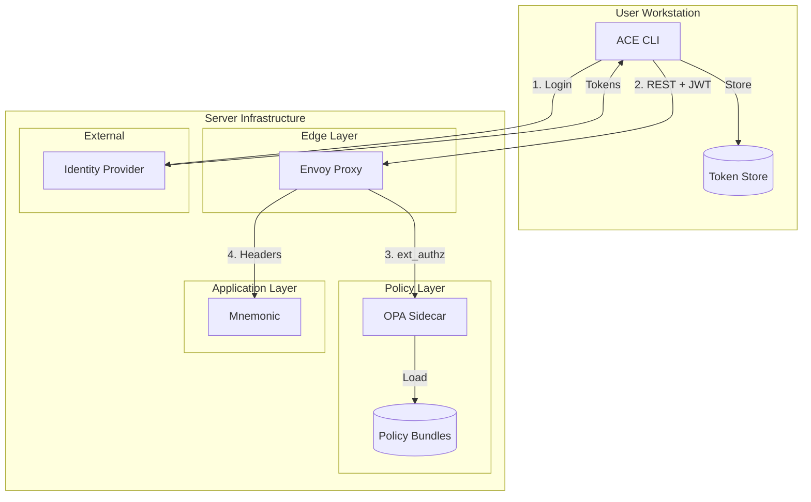
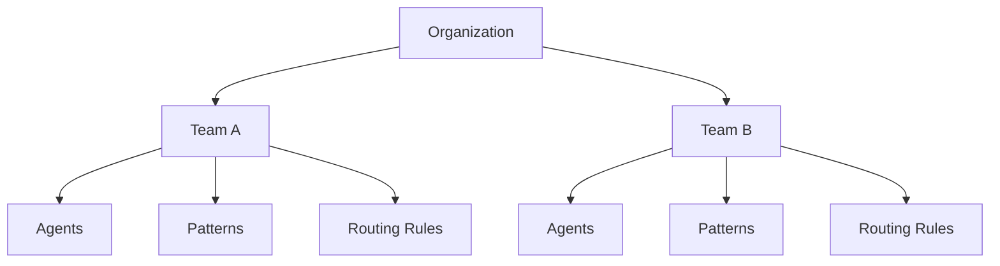
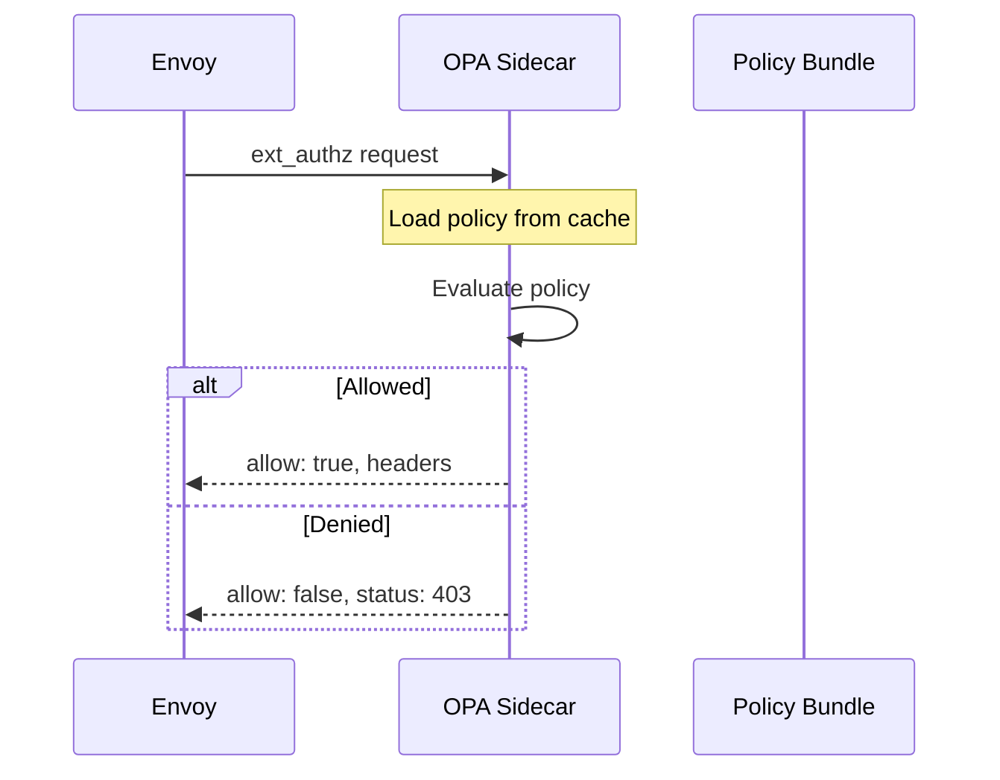
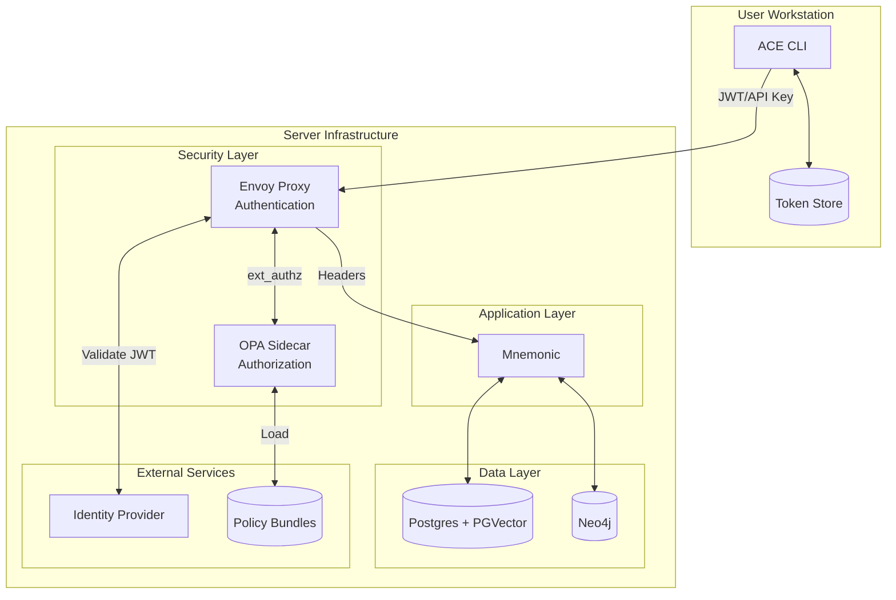
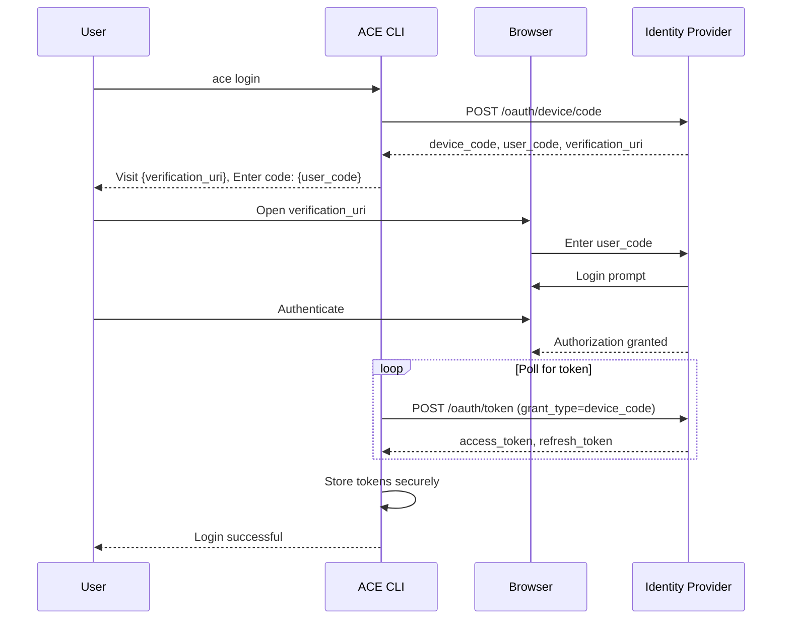
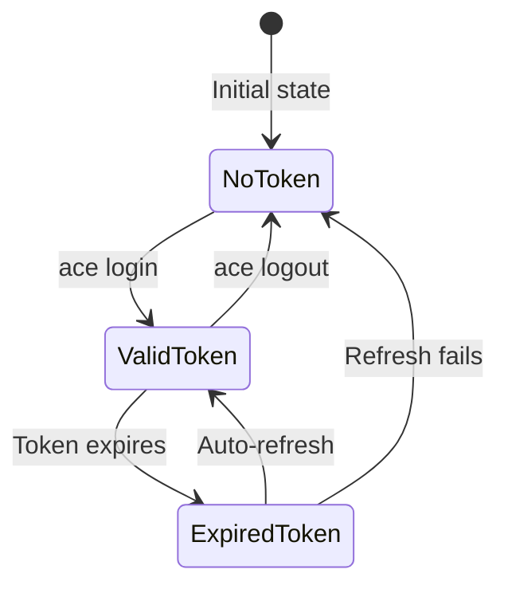
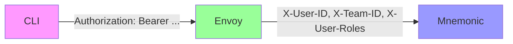
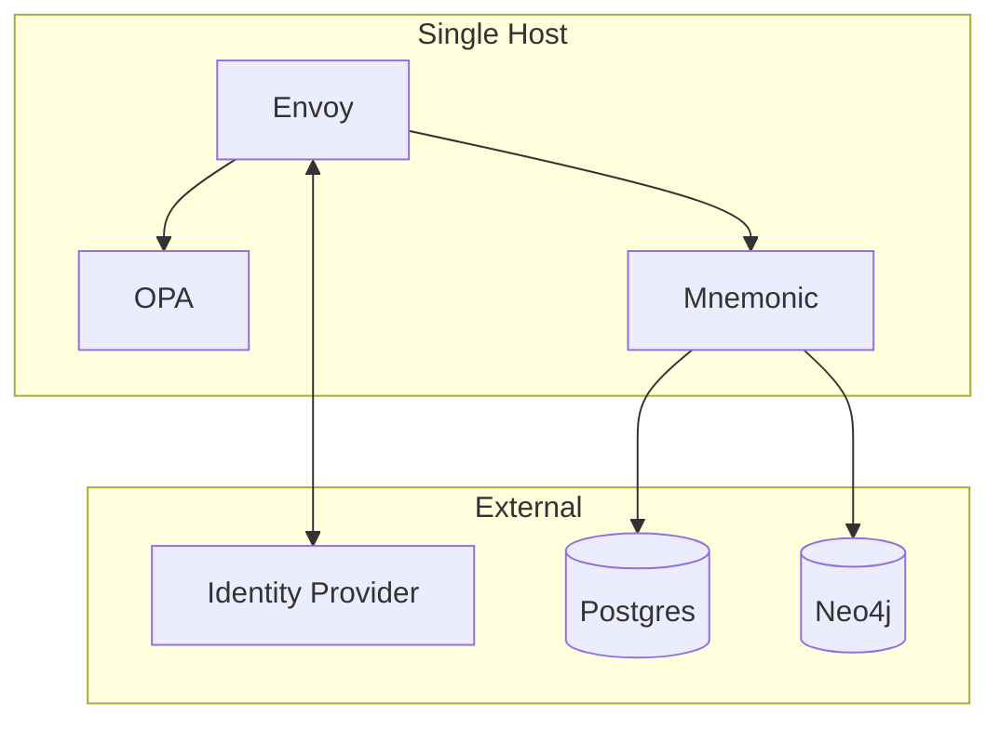
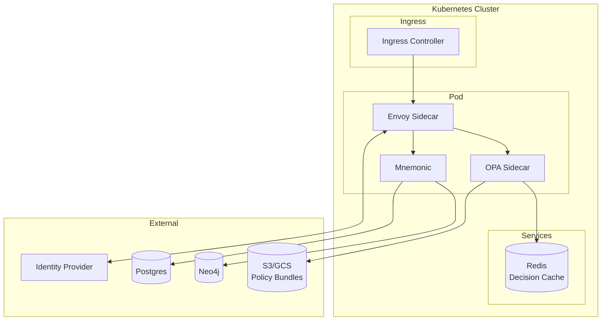
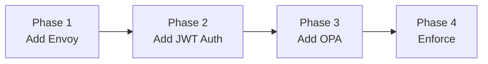

# Security Architecture

[Back to Overview](00-overview.md) | [Back to Project README](../../README.md)

## Table of Contents

- [Introduction](#introduction)
- [Security Model Overview](#security-model-overview)
- [Authentication](#authentication)
  - [JWT Tokens](#jwt-tokens-primary)
  - [API Keys](#api-keys-secondary)
  - [Supported Identity Providers](#supported-identity-providers)
- [Authorization](#authorization)
  - [RBAC Model](#rbac-model)
  - [OPA Policy Structure](#opa-policy-structure)
- [Component Architecture](#component-architecture)
- [CLI Authentication Flow](#cli-authentication-flow)
  - [Device Code Flow](#device-code-flow)
  - [Token Storage](#token-storage)
- [Identity Headers](#identity-headers)
- [Architectural Decisions](#architectural-decisions)
- [Deployment Considerations](#deployment-considerations)
- [Migration Path](#migration-path)
- [Trade-offs Summary](#trade-offs-summary)

## Introduction

Phase 3 adds enterprise-grade security to ACE using infrastructure-layer components. Authentication and authorization are handled outside Mnemonic's application code, keeping the service lightweight and focused on routing and pattern retrieval.

This approach follows the principle of separation of concerns: security infrastructure handles identity verification and access control, while Mnemonic remains focused on its core responsibilities.

## Security Model Overview

ACE security operates at the infrastructure layer rather than the application layer. This design choice provides several benefits:

- **Separation of concerns**: Security policies managed independently from application code
- **Policy updates without deployment**: Security rules can change without redeploying Mnemonic
- **Consistent enforcement**: All endpoints protected by the same security infrastructure
- **Fail-closed design**: Requests are denied by default unless explicitly allowed

The security stack consists of:

- **Envoy Proxy**: Handles authentication (JWT validation, API keys, TLS termination)
- **OPA Sidecar**: Handles authorization (fine-grained RBAC with Rego policies)
- **Mnemonic**: Receives pre-validated identity via trusted headers



## Authentication

Authentication verifies user identity before requests reach Mnemonic. Envoy handles all authentication at the edge layer.

### JWT Tokens (Primary)

JWT tokens are the primary authentication mechanism, providing rich claims for authorization decisions.

**Flow:**

1. User authenticates with identity provider via OAuth2/OIDC
2. CLI receives and stores access token and refresh token
3. CLI includes JWT in Authorization header for all requests
4. Envoy validates JWT signature using JWKS from identity provider
5. Envoy extracts claims: `user_id`, `team_id`, `roles`

**Token Characteristics:**

| Aspect     | Detail                                       |
| ---------- | -------------------------------------------- |
| Format     | JWT (JSON Web Token)                         |
| Signing    | RS256 or ES256                               |
| Validation | JWKS endpoint from identity provider         |
| Expiry     | Access token: 1 hour, Refresh token: 30 days |
| Claims     | user_id, team_id, roles, exp, iat            |

### API Keys (Secondary)

API keys provide authentication for service-to-service communication and automation scenarios where interactive login is not possible.

**Characteristics:**

- Hashed storage (never stored in plaintext)
- Rotation support with grace period
- Rate limited per key
- Scoped to specific operations

**Use Cases:**

| Scenario              | Authentication Method    |
| --------------------- | ------------------------ |
| Interactive CLI usage | JWT via Device Code Flow |
| CI/CD pipelines       | API Key                  |
| Service-to-service    | API Key                  |
| Automated scripts     | API Key                  |

### Supported Identity Providers

ACE supports standard OAuth2/OIDC identity providers. The choice depends on organizational requirements.

| Provider | Use Case                | Complexity | Notes                                   |
| -------- | ----------------------- | ---------- | --------------------------------------- |
| Auth0    | SaaS, quick setup       | Low        | Managed service, minimal configuration  |
| Keycloak | Self-hosted, enterprise | Medium     | Full control, requires infrastructure   |
| Azure AD | Microsoft ecosystem     | Medium     | Native integration with Microsoft tools |
| Okta     | Enterprise SSO          | Low        | Managed service, enterprise features    |

## Authorization

Authorization determines what authenticated users can do. OPA (Open Policy Agent) evaluates policies for every request.

### RBAC Model

ACE uses Role-Based Access Control with team-scoped resources.

**Scope Hierarchy:**



**Roles:**

| Role      | Permissions                                        |
| --------- | -------------------------------------------------- |
| admin     | Full access to team resources, manage team members |
| developer | Create, update, delete agents and patterns         |
| viewer    | Read-only access to agents and patterns            |

**Resource Types:**

| Resource      | Description                            |
| ------------- | -------------------------------------- |
| agents        | Agent definitions and configurations   |
| patterns      | Context patterns for prompt enrichment |
| routing_rules | Rules that determine agent selection   |

### OPA Policy Structure

OPA policies are written in Rego and evaluated for each request. Policies are loaded from bundles that can be updated independently of deployments.

```rego
package ace.authz

import rego.v1

default allow := false

# Allow authenticated users to route requests
allow if {
    input.method == "POST"
    input.path == ["v1", "ace", "route"]
    input.user.team_id != ""
}

# Admin operations require admin role
allow if {
    input.method in ["PUT", "DELETE"]
    "admin" in input.user.roles
}

# Response headers to inject
headers["X-User-ID"] := input.user.user_id
headers["X-Team-ID"] := input.user.team_id
headers["X-User-Roles"] := concat(",", input.user.roles)
```

**Policy Evaluation Flow:**



## Component Architecture

The security components integrate with the existing ACE architecture.



**Component Responsibilities:**

| Component         | Responsibility                                                        |
| ----------------- | --------------------------------------------------------------------- |
| Envoy Proxy       | TLS termination, JWT validation, API key validation, header injection |
| OPA Sidecar       | Policy evaluation, RBAC enforcement, header generation                |
| Mnemonic          | Trust identity headers, apply business logic                          |
| Identity Provider | User authentication, token issuance, JWKS hosting                     |
| Policy Bundles    | Store and distribute Rego policies                                    |

## CLI Authentication Flow

### Device Code Flow

The Device Code Flow is recommended for CLI authentication. It allows users to authenticate via a web browser without exposing credentials to the terminal.



**Flow Steps:**

1. User runs `ace login`
2. CLI requests device code from identity provider
3. CLI displays verification URL and user code
4. User opens browser, enters code, authenticates
5. CLI polls for token completion
6. CLI stores tokens in secure storage
7. User can now make authenticated requests

### Token Storage

Tokens are stored using platform-native secure storage mechanisms.

| Platform | Storage Mechanism              | Security                   |
| -------- | ------------------------------ | -------------------------- |
| macOS    | Keychain                       | Hardware-backed encryption |
| Linux    | Secret Service API (libsecret) | User session encryption    |
| Windows  | Credential Manager             | DPAPI encryption           |

**Token Lifecycle:**



## Identity Headers

After successful authentication and authorization, Envoy injects identity headers that Mnemonic trusts.

| Header       | Description                   | Example            |
| ------------ | ----------------------------- | ------------------ |
| X-User-ID    | Authenticated user identifier | `user_abc123`      |
| X-Team-ID    | User's team identifier        | `team_xyz789`      |
| X-User-Roles | Comma-separated roles         | `developer,viewer` |

**Trust Model:**

- Mnemonic only accepts traffic from Envoy (network isolation)
- Headers are set by Envoy, not forwarded from client
- Client-provided identity headers are stripped by Envoy



## Architectural Decisions

### ADR-007: Infrastructure-Layer Security

**Context:** ACE needs authentication and authorization for multi-tenant operation.

**Decision:** Handle authentication and authorization at infrastructure layer using Envoy and OPA. Mnemonic receives only pre-validated identity headers.

**Rationale:**

- Mnemonic stays lightweight and focused on routing
- Security policies update without application deployment
- Consistent security across all endpoints
- Clear separation of concerns
- Standard, well-tested security components

**Trade-offs:**

- Additional infrastructure components to operate
- Network hop for authorization decisions
- Requires Rego expertise for policy management

### ADR-008: Authentication Strategy

**Context:** ACE needs to support both interactive users and automated systems.

**Decision:** Support both JWT tokens and API keys with JWT as primary authentication method.

**Rationale:**

- JWT provides rich claims for authorization decisions
- API keys enable CI/CD integration and automation
- Supports enterprise identity providers
- Industry-standard protocols

**Trade-offs:**

- Two authentication paths to maintain
- API key management adds operational complexity

### ADR-009: Authorization Model

**Context:** ACE needs fine-grained access control for team resources.

**Decision:** Use RBAC with team-scoped resources, extensible to ABAC if needed.

**Rationale:**

- Simple model covers most use cases
- OPA policies are straightforward to write and audit
- Clear audit trail for compliance
- Extensible to attribute-based access control

**Trade-offs:**

- Role explosion possible with complex permission requirements
- May need ABAC for advanced scenarios

## Deployment Considerations

### Minimal Deployment

For small teams or development environments.



**Characteristics:**

- Single container host with all components
- External managed databases
- External identity provider (Auth0, Okta)
- Suitable for small teams (less than 20 users)

### Kubernetes Deployment

For production environments with high availability requirements.



**Characteristics:**

- Envoy as sidecar or ingress
- OPA as sidecar per pod
- Redis for decision caching
- Policy bundles from S3/GCS
- Horizontal scaling with load balancing

### Failure Modes

| Failure                   | Impact                                             | Mitigation                                         |
| ------------------------- | -------------------------------------------------- | -------------------------------------------------- |
| Envoy unavailable         | All requests fail                                  | Expected behavior, load balancer health checks     |
| OPA unavailable           | All requests denied (fail-closed)                  | OPA sidecar per pod, decision caching              |
| IdP unavailable           | New logins fail, existing tokens work until expiry | Token refresh, offline validation with cached JWKS |
| Policy bundle unavailable | OPA uses cached policies                           | Bundle caching, multiple bundle sources            |

## Migration Path

Security can be added incrementally to an existing ACE deployment.



### Phase 1: Add Envoy as Reverse Proxy

- Deploy Envoy in front of Mnemonic
- No authentication, pass-through mode
- Verify traffic flows correctly
- Establish TLS termination

### Phase 2: Add JWT Authentication

- Configure identity provider
- Update CLI with `ace login` command
- Configure Envoy JWT validation
- Allow both authenticated and unauthenticated requests

### Phase 3: Add OPA Authorization

- Deploy OPA sidecar
- Start with permissive policies (allow all authenticated)
- Add logging for authorization decisions
- Refine policies based on access patterns

### Phase 4: Enforce Security

- Require authentication for all requests
- Remove direct Mnemonic access
- Enable fail-closed mode
- Monitor and alert on authorization failures

## Trade-offs Summary

| Aspect        | Trade-off                                                          |
| ------------- | ------------------------------------------------------------------ |
| Complexity    | +2 components (Envoy, OPA), but security isolated from application |
| Latency       | +1-5ms per request for authorization, mitigated by caching         |
| Operational   | Policy updates without deployment, but requires Rego expertise     |
| Failure modes | Fail-closed provides security, but requires high availability      |
| Flexibility   | Standard components enable customization, but more configuration   |
| Auditability  | Clear separation enables detailed audit trails                     |

**Next:** Return to [Architecture Overview](00-overview.md)

See also:

- [System Architecture](03-system-architecture.md) for component details
- [Deployment Architecture](05-deployment-architecture.md) for deployment patterns
