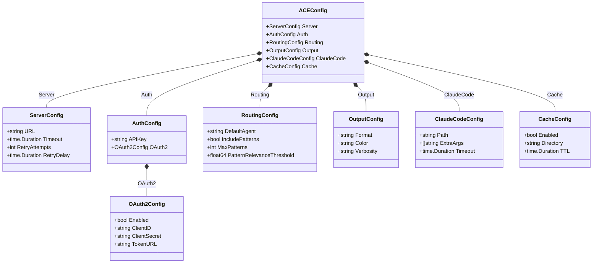

# ACE CLI Configuration

[Back to Architecture Overview](../../architecture/00-overview.md) | [Back to Project README](../../../README.md)

## Table of Contents

- [Overview](#overview)
- [Configuration Loading Order](#configuration-loading-order)
  - [Precedence Rules](#precedence-rules)
  - [Loading Behavior](#loading-behavior)
- [Configuration File](#configuration-file)
- [Environment Variables](#environment-variables)
- [Command-Line Flags](#command-line-flags)
- [Configuration Reference](#configuration-reference)
- [Environment Variable Naming Conventions](#environment-variable-naming-conventions)
- [YAML Configuration Format](#yaml-configuration-format)
  - [XDG Base Directory Paths](#xdg-base-directory-paths)
  - [File Discovery Order](#file-discovery-order)
  - [Platform-Specific Paths](#platform-specific-paths)
- [Security Considerations](#security-considerations)
  - [Secrets Handling](#secrets-handling)
  - [File Permissions](#file-permissions)
  - [Environment Variable Security](#environment-variable-security)
  - [Configuration Validation](#configuration-validation)
- [Configuration Model](#configuration-model)
- [References](#references)

## Overview

[Table of Contents](#table-of-contents)

> **Architecture Reference:** [System Architecture - Component Breakdown](../../architecture/03-system-architecture.md#component-breakdown) | [Deployment Architecture - Component Deployment](../../architecture/05-deployment-architecture.md#component-deployment)

The ACE CLI uses a layered configuration system that supports multiple sources with well-defined precedence. This design enables:

- **Sensible defaults**: Work out of the box with minimal configuration
- **File-based configuration**: Persistent settings in YAML format
- **Environment overrides**: Container and CI/CD friendly
- **Command-line flags**: Per-invocation overrides for debugging and scripting

| Component | Config Prefix | Config File                 | Primary Use Case          |
| --------- | ------------- | --------------------------- | ------------------------- |
| ACE CLI   | `ACE_`        | `~/.config/ace/config.yaml` | User workstation settings |

For Mnemonic server configuration, see [Mnemonic Configuration](../mnemonic_service/configuration.md).

## Configuration Loading Order

[Table of Contents](#table-of-contents)

### Precedence Rules

Configuration values are loaded in the following order, with later sources overriding earlier ones:

```text
1. Compiled defaults (lowest priority)
2. Configuration file
3. Environment variables
4. Command-line flags (highest priority)
```


### Loading Behavior

**Merge vs Replace**:

- Scalar values (strings, numbers, booleans): Later sources replace earlier values
- Arrays: Later sources replace entire array (no merging)
- Maps/Objects: Keys are merged; later sources override individual keys

**Example**:

```yaml
# Config file
routing:
  timeout: 30s
  default_agent: general-agent
```

```bash
# Environment variable overrides only timeout
export ACE_ROUTING_TIMEOUT=60s
```

```text
# Result
routing:
  timeout: 60s                   # From environment
  default_agent: general-agent   # From config file
```

## Configuration File

[Table of Contents](#table-of-contents)

> **Architecture Reference:** [System Architecture - ACE CLI](../../architecture/03-system-architecture.md#ace-cli) | [Deployment Architecture - ACE CLI](../../architecture/05-deployment-architecture.md#ace-cli)

The ACE CLI reads configuration from YAML files in XDG-compliant locations.

**Default location**: `~/.config/ace/config.yaml`

```yaml
# ACE CLI configuration file
# ~/.config/ace/config.yaml

# Mnemonic server connection
# Short timeout recommended for fail-fast routing decisions
server:
  url: https://mnemonic.example.com
  timeout: 5s
  retry_attempts: 3
  retry_delay: 1s

# Authentication
auth:
  # API key for Mnemonic authentication
  # Prefer ACE_AUTH_API_KEY environment variable for secrets
  api_key: ""

  # OAuth2 configuration (alternative to API key)
  # NOTE: Post-MVP feature - OAuth2 authentication will be available in a later phase
  oauth2:
    enabled: false
    client_id: ""
    # client_secret should be set via ACE_AUTH_OAUTH2_CLIENT_SECRET
    token_url: ""

# Routing preferences
# NOTE: These settings provide default values for pattern retrieval. They can be
# overridden per-request via RouteOptions in the routing API. See routing-engine.md
# for the RouteOptions interface definition.
routing:
  # Agent used when no routing rules match
  default_agent: general-agent

  # Include patterns in routing response (default, can be overridden per-request)
  include_patterns: true

  # Maximum patterns to retrieve (default, can be overridden per-request)
  max_patterns: 5

  # Minimum relevance score for patterns (0.0 to 1.0) (default, can be overridden per-request)
  pattern_relevance_threshold: 0.7

# Output formatting
output:
  # Output format: text, json, yaml
  format: text

  # Enable colored output (auto-detected if not set)
  color: auto

  # Verbosity level: quiet, normal, verbose, debug
  verbosity: normal

# Claude Code integration (Phase 1)
claude_code:
  # Path to Claude Code binary (auto-detected if not set)
  path: ""

  # Additional arguments to pass to Claude Code
  extra_args: []

  # Execution timeout for Claude Code subprocess (default: 300s / 5 minutes)
  # This is a long timeout to accommodate LLM processing time
  timeout: 300s

# Local cache settings
# NOTE: This is CLIENT-SIDE caching within the ACE CLI. It determines how long the
# CLI caches routing decisions locally before re-querying Mnemonic. This reduces
# network calls for repeated prompts and improves CLI responsiveness.
# Compare with Mnemonic's routing.cache.refresh_ttl (SERVER-SIDE), which controls
# how often Mnemonic refreshes its internal rule cache from the database.
cache:
  # Enable local caching of routing decisions
  enabled: true

  # Cache directory (uses XDG cache dir if not set)
  directory: ""

  # How long the CLI caches routing decisions locally before re-querying Mnemonic
  ttl: 5m
```

## Environment Variables

[Table of Contents](#table-of-contents)

All ACE CLI configuration options can be set via environment variables using the `ACE_` prefix.

```bash
# Server connection
export ACE_SERVER_URL="https://mnemonic.example.com"
export ACE_SERVER_TIMEOUT="30s"

# Authentication (recommended for secrets)
export ACE_AUTH_API_KEY="sk-..."

# Routing
export ACE_ROUTING_DEFAULT_AGENT="general-agent"
export ACE_ROUTING_INCLUDE_PATTERNS="true"

# Output
export ACE_OUTPUT_FORMAT="json"
export ACE_OUTPUT_VERBOSITY="debug"
```

## Command-Line Flags

[Table of Contents](#table-of-contents)

Common configuration options are available as command-line flags:

```bash
# Server connection
ace --server-url https://mnemonic.example.com
ace --timeout 60s

# Output control
ace --format json
ace --quiet
ace --verbose
ace --debug

# Routing overrides
ace --agent go-software-agent  # Force specific agent
ace --no-patterns              # Disable pattern retrieval

# Configuration file
ace --config /path/to/config.yaml
```

## Configuration Reference

[Table of Contents](#table-of-contents)

| Setting                               | Type     | Default                 | Environment Variable                      | CLI Flag                          | Description                      |
| ------------------------------------- | -------- | ----------------------- | ----------------------------------------- | --------------------------------- | -------------------------------- |
| `server.url`                          | string   | `http://localhost:8080` | `ACE_SERVER_URL`                          | `--server-url`                    | Mnemonic server URL              |
| `server.timeout`                      | duration | `5s`                    | `ACE_SERVER_TIMEOUT`                      | `--timeout`                       | Mnemonic request timeout (fail-fast) |
| `server.retry_attempts`               | int      | `3`                     | `ACE_SERVER_RETRY_ATTEMPTS`               | -                                 | Max retry attempts               |
| `server.retry_delay`                  | duration | `1s`                    | `ACE_SERVER_RETRY_DELAY`                  | -                                 | Delay between retries            |
| `auth.api_key`                        | string   | `""`                    | `ACE_AUTH_API_KEY`                        | -                                 | API key for authentication       |
| `auth.oauth2.enabled`                 | bool     | `false`                 | `ACE_AUTH_OAUTH2_ENABLED`                 | -                                 | Enable OAuth2 (Post-MVP)         |
| `auth.oauth2.client_id`               | string   | `""`                    | `ACE_AUTH_OAUTH2_CLIENT_ID`               | -                                 | OAuth2 client ID (Post-MVP)      |
| `auth.oauth2.client_secret`           | string   | `""`                    | `ACE_AUTH_OAUTH2_CLIENT_SECRET`           | -                                 | OAuth2 client secret (Post-MVP)  |
| `auth.oauth2.token_url`               | string   | `""`                    | `ACE_AUTH_OAUTH2_TOKEN_URL`               | -                                 | OAuth2 token endpoint (Post-MVP) |
| `routing.default_agent`               | string   | `general-agent`         | `ACE_ROUTING_DEFAULT_AGENT`               | `--default-agent`                 | Agent when no rules match        |
| `routing.include_patterns`            | bool     | `true`                  | `ACE_ROUTING_INCLUDE_PATTERNS`            | `--no-patterns`                   | Include patterns (default, overridable per-request) |
| `routing.max_patterns`                | int      | `5`                     | `ACE_ROUTING_MAX_PATTERNS`                | `--max-patterns`                  | Max patterns to retrieve (default, overridable per-request) |
| `routing.pattern_relevance_threshold` | float    | `0.7`                   | `ACE_ROUTING_PATTERN_RELEVANCE_THRESHOLD` | -                                 | Min relevance score (default, overridable per-request) |
| `output.format`                       | string   | `text`                  | `ACE_OUTPUT_FORMAT`                       | `--format`                        | Output format                    |
| `output.color`                        | string   | `auto`                  | `ACE_OUTPUT_COLOR`                        | `--color`, `--no-color`           | Color output                     |
| `output.verbosity`                    | string   | `normal`                | `ACE_OUTPUT_VERBOSITY`                    | `--quiet`, `--verbose`, `--debug` | Verbosity level                  |
| `claude_code.path`                    | string   | auto-detect             | `ACE_CLAUDE_CODE_PATH`                    | `--claude-code-path`              | Claude Code binary path          |
| `claude_code.extra_args`              | []string | `[]`                    | `ACE_CLAUDE_CODE_EXTRA_ARGS`              | -                                 | Extra Claude Code args           |
| `claude_code.timeout`                 | duration | `300s`                  | `ACE_CLAUDE_CODE_TIMEOUT`                 | `--claude-code-timeout`           | Claude Code execution timeout    |
| `cache.enabled`                       | bool     | `true`                  | `ACE_CACHE_ENABLED`                       | `--no-cache`                      | Enable local cache               |
| `cache.directory`                     | string   | XDG cache               | `ACE_CACHE_DIRECTORY`                     | -                                 | Cache directory                  |
| `cache.ttl`                           | duration | `5m`                    | `ACE_CACHE_TTL`                           | -                                 | Client-side cache TTL (how long CLI caches routing decisions before re-querying Mnemonic) |

## Environment Variable Naming Conventions

[Table of Contents](#table-of-contents)

All ACE CLI environment variables use the `ACE_` prefix with the following conventions:

| Convention   | Example                    |
| ------------ | -------------------------- |
| Prefix       | `ACE_`                     |
| Separator    | `_` (underscore)           |
| Case         | SCREAMING_SNAKE_CASE       |
| Nested paths | Flattened with underscores |

**Examples**:

| YAML Path               | Environment Variable        |
| ----------------------- | --------------------------- |
| `server.url`            | `ACE_SERVER_URL`            |
| `auth.oauth2.client_id` | `ACE_AUTH_OAUTH2_CLIENT_ID` |
| `routing.max_patterns`  | `ACE_ROUTING_MAX_PATTERNS`  |

**Special Cases**:

- Boolean values: `true`, `false`, `1`, `0`, `yes`, `no` (case-insensitive)
- Duration values: Go duration format (`30s`, `5m`, `1h`)
- Array values: Comma-separated (`ACE_CLAUDE_CODE_EXTRA_ARGS="--arg1,--arg2"`)

## YAML Configuration Format

[Table of Contents](#table-of-contents)

### XDG Base Directory Paths

ACE CLI follows the [XDG Base Directory Specification](https://specifications.freedesktop.org/basedir-spec/basedir-spec-latest.html) for configuration file locations.

| Directory | Environment Variable | Default (Linux/macOS) | Purpose             |
| --------- | -------------------- | --------------------- | ------------------- |
| Config    | `XDG_CONFIG_HOME`    | `~/.config`           | Configuration files |
| Data      | `XDG_DATA_HOME`      | `~/.local/share`      | Persistent data     |
| Cache     | `XDG_CACHE_HOME`     | `~/.cache`            | Non-essential cache |
| State     | `XDG_STATE_HOME`     | `~/.local/state`      | Persistent state    |

**ACE-specific paths**:

| Purpose         | Path                               |
| --------------- | ---------------------------------- |
| Config file     | `$XDG_CONFIG_HOME/ace/config.yaml` |
| Cache directory | `$XDG_CACHE_HOME/ace/`             |
| Log files       | `$XDG_STATE_HOME/ace/logs/`        |

### File Discovery Order

Configuration files are searched in the following order:

```text
1. --config flag (if provided)
2. $ACE_CONFIG_FILE (if set)
3. $XDG_CONFIG_HOME/ace/config.yaml
4. ~/.config/ace/config.yaml (fallback if XDG not set)
5. ~/.ace/config.yaml (legacy location)
```

### Platform-Specific Paths

| Platform | Config Home | Example Path                                      |
| -------- | ----------- | ------------------------------------------------- |
| Linux    | `~/.config` | `~/.config/ace/config.yaml`                       |
| macOS    | `~/.config` | `~/.config/ace/config.yaml`                       |
| Windows  | `%APPDATA%` | `C:\Users\<user>\AppData\Roaming\ace\config.yaml` |

**Note**: On macOS, `~/Library/Application Support` is also supported as an alternative to `~/.config` for better native integration:

```text
1. $XDG_CONFIG_HOME/ace/config.yaml
2. ~/.config/ace/config.yaml
3. ~/Library/Application Support/ace/config.yaml
```

## Security Considerations

[Table of Contents](#table-of-contents)

> **Architecture Reference:** [Security Architecture - Token Storage](../../architecture/06-security-architecture.md#token-storage) | [Communication Patterns - Security Considerations](../../architecture/04-communication-patterns.md#security-considerations)

### Secrets Handling

**Never store secrets in configuration files.** Use environment variables or secret management systems.

| Secret                | Storage Method                         |
| --------------------- | -------------------------------------- |
| API keys              | Environment variable                   |
| OAuth2 client secrets | Environment variable or secret manager |

**Recommended patterns**:

```yaml
# Bad: Secret in config file
auth:
  api_key: sk-1234567890abcdef

# Good: Reference environment variable
auth:
  api_key: ""  # Set via ACE_AUTH_API_KEY
```

```bash
# Set secrets via environment
export ACE_AUTH_API_KEY="sk-1234567890abcdef"
```

### File Permissions

Configuration files should have restricted permissions to prevent unauthorized access.

**Recommended permissions**:

| File             | Permissions           | Rationale                                  |
| ---------------- | --------------------- | ------------------------------------------ |
| Config file      | `0600` (`-rw-------`) | Contains non-secret but sensitive settings |
| Config directory | `0700` (`drwx------`) | Prevent listing of config files            |
| Cache directory  | `0700` (`drwx------`) | May contain cached tokens                  |

**Validation on startup**:

```go
// ACE CLI validates config file permissions
func validateConfigPermissions(path string) error {
    info, err := os.Stat(path)
    if err != nil {
        return err
    }

    mode := info.Mode().Perm()
    if mode&0077 != 0 {
        return fmt.Errorf(
            "config file %s has insecure permissions %o; expected 0600",
            path, mode,
        )
    }
    return nil
}
```

**Warning behavior**:

- ACE CLI warns if config file permissions are too open (e.g., `0644`)
- Use `--insecure-config` flag to suppress warning (not recommended)

### Environment Variable Security

**Best practices**:

1. **Avoid secrets in shell history**: Use `.env` files or secret managers

   ```bash
   # Bad: Secret visible in shell history
   export ACE_AUTH_API_KEY="sk-secret"

   # Better: Load from file
   export ACE_AUTH_API_KEY=$(cat ~/.secrets/ace-api-key)

   # Best: Use direnv or similar
   # .envrc (not committed to git)
   export ACE_AUTH_API_KEY="sk-secret"
   ```

2. **CI/CD pipelines**: Use pipeline secret variables, not hardcoded values

### Configuration Validation

ACE CLI validates configuration on startup:

**Validation checks**:

| Check                           | Description                  |
| ------------------------------- | ---------------------------- |
| Required fields present         | Essential fields must exist  |
| URL format valid                | Server URL must be valid     |
| Duration format valid           | Timeouts must be parseable   |
| File paths exist (if specified) | Referenced files must exist  |
| API key format valid            | Basic format validation      |

**Error behavior**:

- Invalid configuration: Exit with error, detailed message
- Missing required secrets: Exit with error listing missing values
- Warning-level issues: Log warning, continue startup

```text
# Example validation error
Error: configuration validation failed:
  - server.url: invalid URL format "not-a-url"
  - auth.api_key: required but not set (use ACE_AUTH_API_KEY)
  - routing.max_patterns: must be positive, got -1
```

## Configuration Model

[Table of Contents](#table-of-contents)

The following class diagram shows the configuration structure used by the ACE CLI. This model is loaded from YAML files, environment variables, and command-line flags using the precedence rules described above.



## References

[Table of Contents](#table-of-contents)

- [Architecture Overview](../../architecture/00-overview.md) - System context
- [System Architecture](../../architecture/03-system-architecture.md) - Component layout
- [Deployment Architecture](../../architecture/05-deployment-architecture.md) - Deployment environments
- [Mnemonic Configuration](../mnemonic_service/configuration.md) - Server-side configuration
- [XDG Base Directory Specification](https://specifications.freedesktop.org/basedir-spec/basedir-spec-latest.html)
- [Viper Configuration Library](https://github.com/spf13/viper) - Go configuration management
