# ACE CLI Configuration

[Back to Architecture Overview](../../architecture/00-overview.md) | [Back to Project README](../../../README.md)

## Table of Contents

- [Overview](#overview)
- [Configuration Loading Order](#configuration-loading-order)
  - [Precedence Rules](#precedence-rules)
  - [Loading Behavior](#loading-behavior)
- [Configuration File](#configuration-file)
- [Environment Variables](#environment-variables)
- [Command-Line Flags](#command-line-flags)
- [Configuration Reference](#configuration-reference)
- [Environment Variable Naming Conventions](#environment-variable-naming-conventions)
- [YAML Configuration Format](#yaml-configuration-format)
  - [XDG Base Directory Paths](#xdg-base-directory-paths)
  - [File Discovery Order](#file-discovery-order)
  - [Platform-Specific Paths](#platform-specific-paths)
- [Security Considerations](#security-considerations)
  - [Secrets Handling](#secrets-handling)
  - [File Permissions](#file-permissions)
  - [Environment Variable Security](#environment-variable-security)
  - [Configuration Validation](#configuration-validation)
- [Configuration Model](#configuration-model)
- [References](#references)

## Overview

[Table of Contents](#table-of-contents)

> **Architecture Reference:** [System Architecture - Component Breakdown](../../architecture/03-system-architecture.md#component-breakdown) | [Deployment Architecture - Component Deployment](../../architecture/05-deployment-architecture.md#component-deployment)

The ACE CLI uses a layered configuration system that supports multiple sources with well-defined precedence. This design enables:

- **Sensible defaults**: Work out of the box with minimal configuration
- **File-based configuration**: Persistent settings in YAML format
- **Environment overrides**: Container and CI/CD friendly
- **Command-line flags**: Per-invocation overrides for debugging and scripting

| Component | Config Prefix | Config File                 | Primary Use Case          |
| --------- | ------------- | --------------------------- | ------------------------- |
| ACE CLI   | `ACE_`        | `~/.config/ace/config.yaml` | User workstation settings |

For Mnemonic server configuration, see [Mnemonic Configuration](../mnemonic_service/configuration.md).

## Configuration Loading Order

[Table of Contents](#table-of-contents)

### Precedence Rules

Configuration values are loaded in the following order, with later sources overriding earlier ones:

```text
1. Compiled defaults (lowest priority)
2. Configuration file
3. Environment variables
4. Command-line flags (highest priority)
```


### Loading Behavior

**Merge vs Replace**:

- Scalar values (strings, numbers, booleans): Later sources replace earlier values
- Arrays: Later sources replace entire array (no merging)
- Maps/Objects: Keys are merged; later sources override individual keys

**Example**:

```yaml
# Config file
routing:
  timeout: 30s
  default_agent: general-agent
```

```bash
# Environment variable overrides only timeout
export ACE_ROUTING_TIMEOUT=60s
```

```text
# Result
routing:
  timeout: 60s                   # From environment
  default_agent: general-agent   # From config file
```

## Configuration File

[Table of Contents](#table-of-contents)

> **Architecture Reference:** [System Architecture - ACE CLI](../../architecture/03-system-architecture.md#ace-cli) | [Deployment Architecture - ACE CLI](../../architecture/05-deployment-architecture.md#ace-cli)

The ACE CLI reads configuration from YAML files in XDG-compliant locations.

**Default location**: `~/.config/ace/config.yaml`

```yaml
# ACE CLI configuration file
# ~/.config/ace/config.yaml

# Mnemonic server connection
# Short timeout recommended for fail-fast routing decisions
server:
  url: https://mnemonic.example.com
  timeout: 5s
  retry_attempts: 3
  retry_delay: 1s

# Authentication
auth:
  # API key for Mnemonic authentication
  # Prefer ACE_AUTH_API_KEY environment variable for secrets
  api_key: ""

  # OAuth2 configuration (alternative to API key)
  # NOTE: Post-MVP feature - OAuth2 authentication will be available in a later phase
  oauth2:
    enabled: false
    client_id: ""
    # client_secret should be set via ACE_AUTH_OAUTH2_CLIENT_SECRET
    token_url: ""

# Routing preferences
# NOTE: These settings provide default values for pattern retrieval. They can be
# overridden per-request via RouteOptions in the routing API. See routing-engine.md
# for the RouteOptions interface definition.
routing:
  # Agent used when no routing rules match
  default_agent: general-agent

  # Include patterns in routing response (default, can be overridden per-request)
  include_patterns: true

  # Maximum patterns to retrieve (default, can be overridden per-request)
  max_patterns: 5

  # Minimum relevance score for patterns (0.0 to 1.0) (default, can be overridden per-request)
  pattern_relevance_threshold: 0.7

# Output formatting
output:
  # Output format: text, json, yaml
  format: text

  # Enable colored output (auto-detected if not set)
  color: auto

  # Verbosity level: quiet, normal, verbose, debug
  verbosity: normal

# Claude Code integration (Phase 1)
claude_code:
  # Path to Claude Code binary (auto-detected if not set)
  path: ""

  # Additional arguments to pass to Claude Code
  extra_args: []

  # Execution timeout for Claude Code subprocess (default: 300s / 5 minutes)
  # This is a long timeout to accommodate LLM processing time
  timeout: 300s

# Local cache settings
# NOTE: This is CLIENT-SIDE caching within the ACE CLI. It determines how long the
# CLI caches routing decisions locally before re-querying Mnemonic. This reduces
# network calls for repeated prompts and improves CLI responsiveness.
# Compare with Mnemonic's routing.cache.refresh_ttl (SERVER-SIDE), which controls
# how often Mnemonic refreshes its internal rule cache from the database.
cache:
  # Enable local caching of routing decisions
  enabled: true

  # Cache directory (uses XDG cache dir if not set)
  directory: ""

  # How long the CLI caches routing decisions locally before re-querying Mnemonic
  ttl: 5m
```

## Environment Variables

[Table of Contents](#table-of-contents)

All ACE CLI configuration options can be set via environment variables using the `ACE_` prefix.

```bash
# Server connection
export ACE_SERVER_URL="https://mnemonic.example.com"
export ACE_SERVER_TIMEOUT="30s"

# Authentication (recommended for secrets)
export ACE_AUTH_API_KEY="sk-..."

# Routing
export ACE_ROUTING_DEFAULT_AGENT="general-agent"
export ACE_ROUTING_INCLUDE_PATTERNS="true"

# Output
export ACE_OUTPUT_FORMAT="json"
export ACE_OUTPUT_VERBOSITY="debug"
```

## Command-Line Flags

[Table of Contents](#table-of-contents)

Common configuration options are available as command-line flags:

```bash
# Server connection
ace --server-url https://mnemonic.example.com
ace --timeout 60s

# Output control
ace --format json
ace --quiet
ace --verbose
ace --debug

# Routing overrides
ace --agent go-software-agent  # Force specific agent
ace --no-patterns              # Disable pattern retrieval

# Configuration file
ace --config /path/to/config.yaml
```

## Configuration Reference

[Table of Contents](#table-of-contents)

| Setting                               | Type     | Default                 | Environment Variable                      | CLI Flag                          | Description                      |
| ------------------------------------- | -------- | ----------------------- | ----------------------------------------- | --------------------------------- | -------------------------------- |
| `server.url`                          | string   | `http://localhost:8080` | `ACE_SERVER_URL`                          | `--server-url`                    | Mnemonic server URL              |
| `server.timeout`                      | duration | `5s`                    | `ACE_SERVER_TIMEOUT`                      | `--timeout`                       | Mnemonic request timeout (fail-fast) |
| `server.retry_attempts`               | int      | `3`                     | `ACE_SERVER_RETRY_ATTEMPTS`               | -                                 | Max retry attempts               |
| `server.retry_delay`                  | duration | `1s`                    | `ACE_SERVER_RETRY_DELAY`                  | -                                 | Delay between retries            |
| `auth.api_key`                        | string   | `""`                    | `ACE_AUTH_API_KEY`                        | -                                 | API key for authentication       |
| `auth.oauth2.enabled`                 | bool     | `false`                 | `ACE_AUTH_OAUTH2_ENABLED`                 | -                                 | Enable OAuth2 (Post-MVP)         |
| `auth.oauth2.client_id`               | string   | `""`                    | `ACE_AUTH_OAUTH2_CLIENT_ID`               | -                                 | OAuth2 client ID (Post-MVP)      |
| `auth.oauth2.client_secret`           | string   | `""`                    | `ACE_AUTH_OAUTH2_CLIENT_SECRET`           | -                                 | OAuth2 client secret (Post-MVP)  |
| `auth.oauth2.token_url`               | string   | `""`                    | `ACE_AUTH_OAUTH2_TOKEN_URL`               | -                                 | OAuth2 token endpoint (Post-MVP) |
| `routing.default_agent`               | string   | `general-agent`         | `ACE_ROUTING_DEFAULT_AGENT`               | `--default-agent`                 | Agent when no rules match        |
| `routing.include_patterns`            | bool     | `true`                  | `ACE_ROUTING_INCLUDE_PATTERNS`            | `--no-patterns`                   | Include patterns (default, overridable per-request) |
| `routing.max_patterns`                | int      | `5`                     | `ACE_ROUTING_MAX_PATTERNS`                | `--max-patterns`                  | Max patterns to retrieve (default, overridable per-request) |
| `routing.pattern_relevance_threshold` | float    | `0.7`                   | `ACE_ROUTING_PATTERN_RELEVANCE_THRESHOLD` | -                                 | Min relevance score (default, overridable per-request) |
| `output.format`                       | string   | `text`                  | `ACE_OUTPUT_FORMAT`                       | `--format`                        | Output format                    |
| `output.color`                        | string   | `auto`                  | `ACE_OUTPUT_COLOR`                        | `--color`, `--no-color`           | Color output                     |
| `output.verbosity`                    | string   | `normal`                | `ACE_OUTPUT_VERBOSITY`                    | `--quiet`, `--verbose`, `--debug` | Verbosity level                  |
| `claude_code.path`                    | string   | auto-detect             | `ACE_CLAUDE_CODE_PATH`                    | `--claude-code-path`              | Claude Code binary path          |
| `claude_code.extra_args`              | []string | `[]`                    | `ACE_CLAUDE_CODE_EXTRA_ARGS`              | -                                 | Extra Claude Code args           |
| `claude_code.timeout`                 | duration | `300s`                  | `ACE_CLAUDE_CODE_TIMEOUT`                 | `--claude-code-timeout`           | Claude Code execution timeout    |
| `cache.enabled`                       | bool     | `true`                  | `ACE_CACHE_ENABLED`                       | `--no-cache`                      | Enable local cache               |
| `cache.directory`                     | string   | XDG cache               | `ACE_CACHE_DIRECTORY`                     | -                                 | Cache directory                  |
| `cache.ttl`                           | duration | `5m`                    | `ACE_CACHE_TTL`                           | -                                 | Client-side cache TTL (how long CLI caches routing decisions before re-querying Mnemonic) |

## Environment Variable Naming Conventions

[Table of Contents](#table-of-contents)

All ACE CLI environment variables use the `ACE_` prefix with the following conventions:

| Convention   | Example                    |
| ------------ | -------------------------- |
| Prefix       | `ACE_`                     |
| Separator    | `_` (underscore)           |
| Case         | SCREAMING_SNAKE_CASE       |
| Nested paths | Flattened with underscores |

**Examples**:

| YAML Path               | Environment Variable        |
| ----------------------- | --------------------------- |
| `server.url`            | `ACE_SERVER_URL`            |
| `auth.oauth2.client_id` | `ACE_AUTH_OAUTH2_CLIENT_ID` |
| `routing.max_patterns`  | `ACE_ROUTING_MAX_PATTERNS`  |

**Special Cases**:

- Boolean values: `true`, `false`, `1`, `0`, `yes`, `no` (case-insensitive)
- Duration values: Go duration format (`30s`, `5m`, `1h`)
- Array values: Comma-separated (`ACE_CLAUDE_CODE_EXTRA_ARGS="--arg1,--arg2"`)

## YAML Configuration Format

[Table of Contents](#table-of-contents)

### XDG Base Directory Paths

ACE CLI follows the [XDG Base Directory Specification](https://specifications.freedesktop.org/basedir-spec/basedir-spec-latest.html) for configuration file locations.

| Directory | Environment Variable | Default (Linux/macOS) | Purpose             |
| --------- | -------------------- | --------------------- | ------------------- |
| Config    | `XDG_CONFIG_HOME`    | `~/.config`           | Configuration files |
| Data      | `XDG_DATA_HOME`      | `~/.local/share`      | Persistent data     |
| Cache     | `XDG_CACHE_HOME`     | `~/.cache`            | Non-essential cache |
| State     | `XDG_STATE_HOME`     | `~/.local/state`      | Persistent state    |

**ACE-specific paths**:

| Purpose         | Path                               |
| --------------- | ---------------------------------- |
| Config file     | `$XDG_CONFIG_HOME/ace/config.yaml` |
| Cache directory | `$XDG_CACHE_HOME/ace/`             |
| Log files       | `$XDG_STATE_HOME/ace/logs/`        |

### File Discovery Order

Configuration files are searched in the following order:

```text
1. --config flag (if provided)
2. $ACE_CONFIG_FILE (if set)
3. $XDG_CONFIG_HOME/ace/config.yaml
4. ~/.config/ace/config.yaml (fallback if XDG not set)
5. ~/.ace/config.yaml (legacy location)
```

### Platform-Specific Paths

| Platform | Config Home | Example Path                                      |
| -------- | ----------- | ------------------------------------------------- |
| Linux    | `~/.config` | `~/.config/ace/config.yaml`                       |
| macOS    | `~/.config` | `~/.config/ace/config.yaml`                       |
| Windows  | `%APPDATA%` | `C:\Users\<user>\AppData\Roaming\ace\config.yaml` |

**Note**: On macOS, `~/Library/Application Support` is also supported as an alternative to `~/.config` for better native integration:

```text
1. $XDG_CONFIG_HOME/ace/config.yaml
2. ~/.config/ace/config.yaml
3. ~/Library/Application Support/ace/config.yaml
```

## Security Considerations

[Table of Contents](#table-of-contents)

> **Architecture Reference:** [Security Architecture - Token Storage](../../architecture/06-security-architecture.md#token-storage) | [Communication Patterns - Security Considerations](../../architecture/04-communication-patterns.md#security-considerations)

### Secrets Handling

**Never store secrets in configuration files.** Use environment variables or secret management systems.

| Secret                | Storage Method                         |
| --------------------- | -------------------------------------- |
| API keys              | Environment variable                   |
| OAuth2 client secrets | Environment variable or secret manager |

**Recommended patterns**:

```yaml
# Bad: Secret in config file
auth:
  api_key: sk-1234567890abcdef

# Good: Reference environment variable
auth:
  api_key: ""  # Set via ACE_AUTH_API_KEY
```

```bash
# Set secrets via environment
export ACE_AUTH_API_KEY="sk-1234567890abcdef"
```

### File Permissions

Configuration files should have restricted permissions to prevent unauthorized access.

**Recommended permissions**:

| File             | Permissions           | Rationale                                  |
| ---------------- | --------------------- | ------------------------------------------ |
| Config file      | `0600` (`-rw-------`) | Contains non-secret but sensitive settings |
| Config directory | `0700` (`drwx------`) | Prevent listing of config files            |
| Cache directory  | `0700` (`drwx------`) | May contain cached tokens                  |

**Validation on startup**:

```go
// ACE CLI validates config file permissions
func validateConfigPermissions(path string) error {
    info, err := os.Stat(path)
    if err != nil {
        return err
    }

    mode := info.Mode().Perm()
    if mode&0077 != 0 {
        return fmt.Errorf(
            "config file %s has insecure permissions %o; expected 0600",
            path, mode,
        )
    }
    return nil
}
```

**Warning behavior**:

- ACE CLI warns if config file permissions are too open (e.g., `0644`)
- Use `--insecure-config` flag to suppress warning (not recommended)

### Environment Variable Security

**Best practices**:

1. **Avoid secrets in shell history**: Use `.env` files or secret managers

   ```bash
   # Bad: Secret visible in shell history
   export ACE_AUTH_API_KEY="sk-secret"

   # Better: Load from file
   export ACE_AUTH_API_KEY=$(cat ~/.secrets/ace-api-key)

   # Best: Use direnv or similar
   # .envrc (not committed to git)
   export ACE_AUTH_API_KEY="sk-secret"
   ```

2. **CI/CD pipelines**: Use pipeline secret variables, not hardcoded values

### Configuration Validation

ACE CLI validates configuration on startup:

**Validation checks**:

| Check                           | Description                  |
| ------------------------------- | ---------------------------- |
| Required fields present         | Essential fields must exist  |
| URL format valid                | Server URL must be valid     |
| Duration format valid           | Timeouts must be parseable   |
| File paths exist (if specified) | Referenced files must exist  |
| API key format valid            | Basic format validation      |

**Error behavior**:

- Invalid configuration: Exit with error, detailed message
- Missing required secrets: Exit with error listing missing values
- Warning-level issues: Log warning, continue startup

```text
# Example validation error
Error: configuration validation failed:
  - server.url: invalid URL format "not-a-url"
  - auth.api_key: required but not set (use ACE_AUTH_API_KEY)
  - routing.max_patterns: must be positive, got -1
```

## Configuration Model

[Table of Contents](#table-of-contents)

The following class diagram shows the configuration structure used by the ACE CLI. This model is loaded from YAML files, environment variables, and command-line flags using the precedence rules described above.

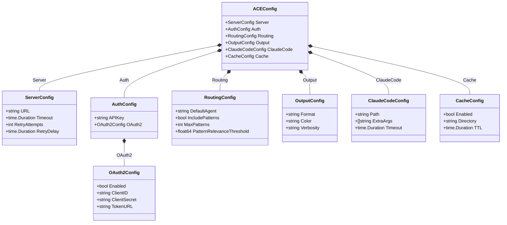

## References

[Table of Contents](#table-of-contents)

- [Architecture Overview](../../architecture/00-overview.md) - System context
- [System Architecture](../../architecture/03-system-architecture.md) - Component layout
- [Deployment Architecture](../../architecture/05-deployment-architecture.md) - Deployment environments
- [Mnemonic Configuration](../mnemonic_service/configuration.md) - Server-side configuration
- [XDG Base Directory Specification](https://specifications.freedesktop.org/basedir-spec/basedir-spec-latest.html)
- [Viper Configuration Library](https://github.com/spf13/viper) - Go configuration management
# Mnemonic REST API Design

[Back to Architecture Overview](../../architecture/00-overview.md) | [Back to Project README](../../../README.md)

## Table of Contents

- [API Specification](#api-specification)
- [Design Decisions](#design-decisions)
  - [POST vs GET for Routing](#post-vs-get-for-routing)
  - [Single Routing Endpoint](#single-routing-endpoint)
  - [Cursor-Based Pagination](#cursor-based-pagination)
  - [Large Payload Handling](#large-payload-handling)
- [Error Handling Philosophy](#error-handling-philosophy)
- [References](#references)

## API Specification

[Table of Contents](#table-of-contents)

The complete API specification is defined in OpenAPI 3.1 format:

**[api/openapi/mnemonic-v1.yaml](../../../api/openapi/mnemonic-v1.yaml)** (Authoritative Source)

This document describes the design rationale behind API decisions. For complete endpoint definitions, request/response schemas, and authentication requirements, consult the OpenAPI specification.

## Design Decisions

[Table of Contents](#table-of-contents)

> **Architecture Reference:** [Architectural Decisions](../../architecture/02-architectural-decisions.md) | [Communication Patterns - Request Flow](../../architecture/04-communication-patterns.md#request-flow)

### POST vs GET for Routing

**Decision**: Use POST for `/api/route` instead of GET.

**Rationale**:

1. Prompts can be large (up to 10KB) - exceeds practical URL length limits
2. Request body allows structured context and options
3. Semantically, routing performs processing rather than simple retrieval
4. Allows consistent JSON request/response pattern

### Single Routing Endpoint

**Decision**: Combine routing + agent + patterns in single response.

**Rationale** (per architecture requirement):

1. Minimizes round trips for primary flow
2. CLI can make single call instead of 3 sequential calls
3. Server can optimize internal queries
4. Reduces latency for the critical path

The `/api/route` endpoint returns:

- Routing decision (which agent was selected and why)
- Full agent definition (including system prompt)
- Relevant patterns (with relevance scores)
- Performance metadata (timing information)

### Cursor-Based Pagination

**Decision**: Use cursor-based pagination instead of offset.

**Rationale**:

1. More efficient for large datasets
2. Consistent results when data changes between pages
3. No risk of skipping/duplicating items with concurrent modifications

Cursors are opaque base64-encoded strings that expire after 24 hours.

### Large Payload Handling

**Considerations for large system_prompt and pattern content**:

1. List endpoints exclude large fields (`system_prompt`, `content`)
2. Detail endpoints include full content
3. Response compression (gzip) should be enabled at Envoy

## Error Handling Philosophy

[Table of Contents](#table-of-contents)

> **Architecture Reference:** [Communication Patterns - Error Handling](../../architecture/04-communication-patterns.md#error-handling)

Errors follow [RFC 7807 Problem Details](https://tools.ietf.org/html/rfc7807) format with content type `application/problem+json`.

**Why RFC 7807**:

1. Standard format across all endpoints
2. Machine-readable error codes for client handling
3. Human-readable messages for debugging
4. Extensible for field-level validation errors
5. `traceId` field enables log correlation

**Key principles**:

- Every error includes a correlation `traceId` for debugging
- Validation errors include field-level details in `errors` array
- Error `type` URIs are stable and can be used for client logic
- HTTP status codes follow standard semantics

**Post-MVP Features**:

- Rate limiting (429 responses): Server-side rate limiting will be available in a later phase. The OpenAPI spec defines the response format for forward compatibility, but rate limiting is not enforced in MVP.

See the OpenAPI spec for complete error schemas and example responses.

## References

[Table of Contents](#table-of-contents)

- [OpenAPI Specification](../../../api/openapi/mnemonic-v1.yaml) - Source of truth for API details
- [Pattern Processing](pattern-processing.md) - Enrichment pipeline details
- [Architectural Decisions](../../architecture/02-architectural-decisions.md)
# Mnemonic Server Configuration

[Back to Architecture Overview](../../architecture/00-overview.md) | [Back to Project README](../../../README.md)

## Table of Contents

- [Overview](#overview)
- [Configuration Loading Order](#configuration-loading-order)
  - [Precedence Rules](#precedence-rules)
  - [Loading Behavior](#loading-behavior)
- [Configuration File](#configuration-file)
- [Environment Variables](#environment-variables)
- [OpenTelemetry Standard Variables](#opentelemetry-standard-variables)
- [otelx Dependency](#otelx-dependency)
- [Configuration Reference](#configuration-reference)
- [Environment Variable Naming Conventions](#environment-variable-naming-conventions)
- [File Discovery Order](#file-discovery-order)
- [Security Considerations](#security-considerations)
  - [Secrets Handling](#secrets-handling)
  - [Environment Variable Security](#environment-variable-security)
  - [Configuration Validation](#configuration-validation)
  - [Embedding Dimension Validation](#embedding-dimension-validation)
- [Configuration Model](#configuration-model)
- [References](#references)

## Overview

[Table of Contents](#table-of-contents)

> **Architecture Reference:** [System Architecture - Component Breakdown](../../architecture/03-system-architecture.md#component-breakdown) | [Deployment Architecture - Component Deployment](../../architecture/05-deployment-architecture.md#component-deployment)

The Mnemonic server uses a layered configuration system that supports multiple sources with well-defined precedence. This design enables:

- **Sensible defaults**: Work out of the box with minimal configuration
- **File-based configuration**: Persistent settings in YAML format
- **Environment overrides**: Container and CI/CD friendly

| Component | Config Prefix | Config File                 | Primary Use Case           |
| --------- | ------------- | --------------------------- | -------------------------- |
| Mnemonic  | `MNEMONIC_`   | `/etc/mnemonic/config.yaml` | Server deployment settings |

For ACE CLI configuration, see [ACE CLI Configuration](../ace_cli/configuration.md).

## Configuration Loading Order

[Table of Contents](#table-of-contents)

### Precedence Rules

Configuration values are loaded in the following order, with later sources overriding earlier ones:

```text
1. Compiled defaults (lowest priority)
2. Configuration file
3. Environment variables (highest priority)
```


### Loading Behavior

**Merge vs Replace**:

- Scalar values (strings, numbers, booleans): Later sources replace earlier values
- Arrays: Later sources replace entire array (no merging)
- Maps/Objects: Keys are merged; later sources override individual keys

## Configuration File

[Table of Contents](#table-of-contents)

> **Architecture Reference:** [System Architecture - Mnemonic](../../architecture/03-system-architecture.md#mnemonic) | [Deployment Architecture - Mnemonic](../../architecture/05-deployment-architecture.md#mnemonic)

The Mnemonic server reads configuration from YAML files.

**Default location**: `/etc/mnemonic/config.yaml` (production) or `./config.yaml` (development)

```yaml
# Mnemonic server configuration file
# /etc/mnemonic/config.yaml

# HTTP server settings
server:
  host: 0.0.0.0
  port: 8080
  read_timeout: 30s
  write_timeout: 30s
  idle_timeout: 120s

  # TLS configuration (optional, typically handled by reverse proxy)
  tls:
    enabled: false
    cert_file: ""
    key_file: ""

# Database connections
database:
  postgres:
    host: localhost
    port: 5432
    database: mnemonic
    username: mnemonic
    # password should be set via MNEMONIC_DATABASE_POSTGRES_PASSWORD
    password: ""
    ssl_mode: prefer
    max_open_conns: 25
    max_idle_conns: 5
    conn_max_lifetime: 5m

  neo4j:
    uri: bolt://localhost:7687
    username: neo4j
    # password should be set via MNEMONIC_DATABASE_NEO4J_PASSWORD
    password: ""
    database: neo4j
    max_connection_pool_size: 50
    connection_acquisition_timeout: 60s

# External services
openai:
  # API key should be set via MNEMONIC_OPENAI_API_KEY
  api_key: ""
  embedding_model: text-embedding-3-small
  embedding_dimensions: 1536
  extraction_model: gpt-4o-mini
  max_requests_per_minute: 500
  retry_attempts: 3
  retry_delay: 1s

# Rate limiting
# NOTE: Post-MVP feature - Server-side rate limiting will be available in a later phase
rate_limit:
  enabled: true
  requests_per_second: 100
  burst_size: 200

  # Per-user rate limits
  per_user:
    requests_per_minute: 60
    burst_size: 10

# Routing engine
routing:
  cache:
    # NOTE: This is SERVER-SIDE caching within Mnemonic. It determines how often
    # Mnemonic refreshes its internal rule cache from the database. This is different
    # from ACE CLI's cache.ttl (CLIENT-SIDE), which controls how long the CLI caches
    # routing decisions before re-querying Mnemonic.
    #
    # Post-MVP: Background refresh settings (not used in MVP)
    # For MVP, rules are loaded once at startup. Restart the service to reload rules.
    refresh_ttl: 5m       # Post-MVP: How often Mnemonic refreshes rules from database
    startup_timeout: 30s  # Post-MVP: Timeout for initial cache load

  # Default agent when no rules match
  default_agent: general-agent

# Enrichment worker
enrichment:
  # Number of concurrent workers
  worker_count: 2

  # How often to poll for new jobs
  poll_interval: 5s

  # Maximum retry attempts for failed jobs
  max_attempts: 3

  # Delay between retry attempts
  retry_delay: 30s

  # Job timeout (stuck jobs are reclaimed after this duration)
  job_timeout: 5m

# Logging
logging:
  # Log level: debug, info, warn, error
  level: info

  # Log format: json, text
  format: json

  # Include caller information
  include_caller: false

# Observability
observability:
  metrics:
    enabled: true
    path: /metrics
    port: 9090

  health:
    enabled: true
    path: /health

  tracing:
    enabled: false
    endpoint: ""
    sample_rate: 0.1
    otlp_insecure: true
```

## Environment Variables

[Table of Contents](#table-of-contents)

All Mnemonic configuration options can be set via environment variables using the `MNEMONIC_` prefix.

```bash
# Server
export MNEMONIC_SERVER_HOST="0.0.0.0"
export MNEMONIC_SERVER_PORT="8080"

# Database credentials (recommended for secrets)
export MNEMONIC_DATABASE_POSTGRES_PASSWORD="secret"
export MNEMONIC_DATABASE_NEO4J_PASSWORD="secret"

# OpenAI (required)
export MNEMONIC_OPENAI_API_KEY="sk-..."

# Rate limiting
export MNEMONIC_RATE_LIMIT_ENABLED="true"
export MNEMONIC_RATE_LIMIT_REQUESTS_PER_SECOND="100"

# Logging
export MNEMONIC_LOGGING_LEVEL="debug"
```

## OpenTelemetry Standard Variables

[Table of Contents](#table-of-contents)

In addition to `MNEMONIC_` prefixed variables, Mnemonic respects standard OpenTelemetry environment variables for tracing configuration:

| Variable                      | Description                         | Example          |
| ----------------------------- | ----------------------------------- | ---------------- |
| `OTEL_EXPORTER_OTLP_ENDPOINT` | OTLP collector endpoint             | `localhost:4317` |
| `OTEL_EXPORTER_OTLP_INSECURE` | Use insecure connection             | `true`           |
| `OTEL_SERVICE_NAME`           | Service name (overridden by config) | `mnemonic`       |

These variables are used by the otelx library and take precedence when set.

## otelx Dependency

[Table of Contents](#table-of-contents)

Mnemonic uses the `github.com/twistingmercury/otelx` package (v1.0.0) to simplify OpenTelemetry integration. This library provides:

- **Unified initialization**: Single `Initialize()` call for logging, metrics, and tracing
- **Zerolog-based structured logging**: With automatic trace correlation (trace_id, span_id in log entries)
- **Prometheus metrics exporter**: Exposes metrics on a configurable port and path
- **OTLP gRPC trace exporter**: Sends traces to an OpenTelemetry collector
- **Gin middleware**: Request logging with automatic trace context propagation

The otelx package handles the complexity of OpenTelemetry SDK setup, allowing Mnemonic to focus on emitting telemetry rather than configuring exporters. For detailed implementation patterns using otelx, see [Observability Implementation Design](observability-implementation.md).

## Configuration Reference

[Table of Contents](#table-of-contents)

| Setting                                   | Type     | Default                  | Environment Variable                               | Description                                                                      |
| ----------------------------------------- | -------- | ------------------------ | -------------------------------------------------- | -------------------------------------------------------------------------------- |
| `server.host`                             | string   | `0.0.0.0`                | `MNEMONIC_SERVER_HOST`                             | Listen address                                                                   |
| `server.port`                             | int      | `8080`                   | `MNEMONIC_SERVER_PORT`                             | Listen port                                                                      |
| `server.read_timeout`                     | duration | `30s`                    | `MNEMONIC_SERVER_READ_TIMEOUT`                     | HTTP read timeout                                                                |
| `server.write_timeout`                    | duration | `30s`                    | `MNEMONIC_SERVER_WRITE_TIMEOUT`                    | HTTP write timeout                                                               |
| `server.idle_timeout`                     | duration | `120s`                   | `MNEMONIC_SERVER_IDLE_TIMEOUT`                     | HTTP idle timeout                                                                |
| `server.tls.enabled`                      | bool     | `false`                  | `MNEMONIC_SERVER_TLS_ENABLED`                      | Enable TLS                                                                       |
| `server.tls.cert_file`                    | string   | `""`                     | `MNEMONIC_SERVER_TLS_CERT_FILE`                    | TLS certificate path                                                             |
| `server.tls.key_file`                     | string   | `""`                     | `MNEMONIC_SERVER_TLS_KEY_FILE`                     | TLS key path                                                                     |
| `database.postgres.host`                  | string   | `localhost`              | `MNEMONIC_DATABASE_POSTGRES_HOST`                  | PostgreSQL host                                                                  |
| `database.postgres.port`                  | int      | `5432`                   | `MNEMONIC_DATABASE_POSTGRES_PORT`                  | PostgreSQL port                                                                  |
| `database.postgres.database`              | string   | `mnemonic`               | `MNEMONIC_DATABASE_POSTGRES_DATABASE`              | Database name                                                                    |
| `database.postgres.username`              | string   | `mnemonic`               | `MNEMONIC_DATABASE_POSTGRES_USERNAME`              | Database username                                                                |
| `database.postgres.password`              | string   | `""`                     | `MNEMONIC_DATABASE_POSTGRES_PASSWORD`              | Database password                                                                |
| `database.postgres.ssl_mode`              | string   | `prefer`                 | `MNEMONIC_DATABASE_POSTGRES_SSL_MODE`              | SSL mode                                                                         |
| `database.postgres.max_open_conns`        | int      | `25`                     | `MNEMONIC_DATABASE_POSTGRES_MAX_OPEN_CONNS`        | Max open connections                                                             |
| `database.postgres.max_idle_conns`        | int      | `5`                      | `MNEMONIC_DATABASE_POSTGRES_MAX_IDLE_CONNS`        | Max idle connections                                                             |
| `database.postgres.conn_max_lifetime`     | duration | `5m`                     | `MNEMONIC_DATABASE_POSTGRES_CONN_MAX_LIFETIME`     | Connection max lifetime                                                          |
| `database.neo4j.uri`                      | string   | `bolt://localhost:7687`  | `MNEMONIC_DATABASE_NEO4J_URI`                      | Neo4j URI                                                                        |
| `database.neo4j.username`                 | string   | `neo4j`                  | `MNEMONIC_DATABASE_NEO4J_USERNAME`                 | Neo4j username                                                                   |
| `database.neo4j.password`                 | string   | `""`                     | `MNEMONIC_DATABASE_NEO4J_PASSWORD`                 | Neo4j password                                                                   |
| `database.neo4j.database`                 | string   | `neo4j`                  | `MNEMONIC_DATABASE_NEO4J_DATABASE`                 | Neo4j database                                                                   |
| `openai.api_key`                          | string   | `""`                     | `MNEMONIC_OPENAI_API_KEY`                          | OpenAI API key                                                                   |
| `openai.embedding_model`                  | string   | `text-embedding-3-small` | `MNEMONIC_OPENAI_EMBEDDING_MODEL`                  | Embedding model                                                                  |
| `openai.embedding_dimensions`             | int      | `1536`                   | `MNEMONIC_OPENAI_EMBEDDING_DIMENSIONS`             | Embedding dimensions                                                             |
| `openai.extraction_model`                 | string   | `gpt-4o-mini`            | `MNEMONIC_OPENAI_EXTRACTION_MODEL`                 | Entity extraction model                                                          |
| `rate_limit.enabled`                      | bool     | `true`                   | `MNEMONIC_RATE_LIMIT_ENABLED`                      | Enable rate limiting (Post-MVP)                                                  |
| `rate_limit.requests_per_second`          | int      | `100`                    | `MNEMONIC_RATE_LIMIT_REQUESTS_PER_SECOND`          | Global RPS limit (Post-MVP)                                                      |
| `rate_limit.burst_size`                   | int      | `200`                    | `MNEMONIC_RATE_LIMIT_BURST_SIZE`                   | Burst size (Post-MVP)                                                            |
| `rate_limit.per_user.requests_per_minute` | int      | `60`                     | `MNEMONIC_RATE_LIMIT_PER_USER_REQUESTS_PER_MINUTE` | Per-user RPM (Post-MVP)                                                          |
| `routing.cache.refresh_ttl`               | duration | `5m`                     | `MNEMONIC_ROUTING_CACHE_REFRESH_TTL`               | Server-side cache TTL (how often Mnemonic refreshes rules from database; Post-MVP: not used in MVP; rules loaded once at startup) |
| `routing.default_agent`                   | string   | `general-agent`          | `MNEMONIC_ROUTING_DEFAULT_AGENT`                   | Default fallback agent                                                           |
| `enrichment.worker_count`                 | int      | `2`                      | `MNEMONIC_ENRICHMENT_WORKER_COUNT`                 | Concurrent workers                                                               |
| `enrichment.poll_interval`                | duration | `5s`                     | `MNEMONIC_ENRICHMENT_POLL_INTERVAL`                | Job poll interval                                                                |
| `enrichment.max_attempts`                 | int      | `3`                      | `MNEMONIC_ENRICHMENT_MAX_ATTEMPTS`                 | Max retry attempts                                                               |
| `logging.level`                           | string   | `info`                   | `MNEMONIC_LOGGING_LEVEL`                           | Log level                                                                        |
| `logging.format`                          | string   | `json`                   | `MNEMONIC_LOGGING_FORMAT`                          | Log format                                                                       |
| `observability.metrics.enabled`           | bool     | `true`                   | `MNEMONIC_OBSERVABILITY_METRICS_ENABLED`           | Enable metrics                                                                   |
| `observability.metrics.path`              | string   | `/metrics`               | `MNEMONIC_OBSERVABILITY_METRICS_PATH`              | Metrics endpoint path                                                            |
| `observability.metrics.port`              | int      | `9090`                   | `MNEMONIC_OBSERVABILITY_METRICS_PORT`              | Metrics server port                                                              |
| `observability.health.enabled`            | bool     | `true`                   | `MNEMONIC_OBSERVABILITY_HEALTH_ENABLED`            | Enable health check                                                              |
| `observability.health.path`               | string   | `/health`                | `MNEMONIC_OBSERVABILITY_HEALTH_PATH`               | Health check endpoint path                                                       |
| `observability.tracing.enabled`           | bool     | `false`                  | `MNEMONIC_OBSERVABILITY_TRACING_ENABLED`           | Enable distributed tracing                                                       |
| `observability.tracing.endpoint`          | string   | `""`                     | `MNEMONIC_OBSERVABILITY_TRACING_ENDPOINT`          | OTLP collector endpoint                                                          |
| `observability.tracing.otlp_insecure`     | bool     | `false`                  | `MNEMONIC_OBSERVABILITY_TRACING_OTLP_INSECURE`     | Use insecure OTLP connection (local development only; production should use TLS) |

## Environment Variable Naming Conventions

[Table of Contents](#table-of-contents)

All Mnemonic environment variables use the `MNEMONIC_` prefix with the following conventions:

| Convention   | Example                    |
| ------------ | -------------------------- |
| Prefix       | `MNEMONIC_`                |
| Separator    | `_` (underscore)           |
| Case         | SCREAMING_SNAKE_CASE       |
| Nested paths | Flattened with underscores |

**Examples**:

| YAML Path                    | Environment Variable                  |
| ---------------------------- | ------------------------------------- |
| `server.port`                | `MNEMONIC_SERVER_PORT`                |
| `database.postgres.password` | `MNEMONIC_DATABASE_POSTGRES_PASSWORD` |
| `openai.api_key`             | `MNEMONIC_OPENAI_API_KEY`             |

**Special Cases**:

- Boolean values: `true`, `false`, `1`, `0`, `yes`, `no` (case-insensitive)
- Duration values: Go duration format (`30s`, `5m`, `1h`)

## File Discovery Order

[Table of Contents](#table-of-contents)

Configuration files are searched in the following order:

```text
1. --config flag (if provided)
2. $MNEMONIC_CONFIG_FILE (if set)
3. /etc/mnemonic/config.yaml (production)
4. ./config.yaml (development)
```

## Security Considerations

[Table of Contents](#table-of-contents)

> **Architecture Reference:** [Security Architecture - Token Storage](../../architecture/06-security-architecture.md#token-storage) | [Communication Patterns - Security Considerations](../../architecture/04-communication-patterns.md#security-considerations)

### Secrets Handling

**Never store secrets in configuration files.** Use environment variables or secret management systems.

| Secret             | Storage Method                         |
| ------------------ | -------------------------------------- |
| Database passwords | Environment variable or secret manager |
| OpenAI API key     | Environment variable or secret manager |
| TLS private keys   | File with restricted permissions       |

**Recommended patterns**:

```yaml
# Bad: Secret in config file
database:
  postgres:
    password: my-secret-password

# Good: Reference environment variable
database:
  postgres:
    password: ""  # Set via MNEMONIC_DATABASE_POSTGRES_PASSWORD
```

```bash
# Set secrets via environment
export MNEMONIC_DATABASE_POSTGRES_PASSWORD="secure-password"
export MNEMONIC_OPENAI_API_KEY="sk-openai-key"
```

**Secret management integrations** (future):

- AWS Secrets Manager
- HashiCorp Vault
- Kubernetes Secrets

### Environment Variable Security

**Best practices**:

1. **Container deployments**: Use secrets management

   ```yaml
   # Kubernetes secret
   apiVersion: v1
   kind: Secret
   metadata:
     name: mnemonic-secrets
   type: Opaque
   stringData:
     postgres-password: "secure-password"
     openai-api-key: "sk-..."
   ```

   ```yaml
   # Pod environment from secret
   env:
     - name: MNEMONIC_DATABASE_POSTGRES_PASSWORD
       valueFrom:
         secretKeyRef:
           name: mnemonic-secrets
           key: postgres-password
   ```

2. **CI/CD pipelines**: Use pipeline secret variables, not hardcoded values

### Configuration Validation

Mnemonic validates configuration on startup:

**Validation checks**:

| Check                           | Description                     |
| ------------------------------- | ------------------------------- |
| Required fields present         | Essential fields must exist     |
| Port in valid range             | 1-65535                         |
| Duration format valid           | Timeouts must be parseable      |
| File paths exist (if specified) | TLS cert/key files must exist   |
| Database connection works       | Connection test at startup      |
| API key format valid            | Basic format validation         |

**Error behavior**:

- Invalid configuration: Exit with error, detailed message
- Missing required secrets: Exit with error listing missing values
- Warning-level issues: Log warning, continue startup

```text
# Example validation error
Error: configuration validation failed:
  - server.port: must be between 1 and 65535, got 0
  - database.postgres.password: required but not set (use MNEMONIC_DATABASE_POSTGRES_PASSWORD)
  - openai.api_key: required but not set (use MNEMONIC_OPENAI_API_KEY)
```

### Embedding Dimension Validation

**Warning**: The `openai.embedding_dimensions` configuration must match the PGVector column schema. Mismatched dimensions will cause runtime failures during pattern enrichment.

**Startup validation**: Mnemonic validates at startup that the configured `embedding_dimensions` matches the PGVector `embedding` column dimensions. If they do not match, Mnemonic logs a fatal error and refuses to start:

```text
# Example dimension mismatch error
FATAL: embedding dimension mismatch: config specifies 3072 dimensions but PGVector column is defined as vector(1536)
```

**Failure mode without validation**: If dimension validation were skipped, the system would fail at runtime with cryptic Postgres errors when attempting to store embeddings:

```text
ERROR: expected 1536 dimensions, not 3072 (SQLSTATE XX000)
```

This error occurs during pattern enrichment, making it difficult to diagnose as a configuration issue.

**Schema migration required**: Changing the `embedding_dimensions` setting (for example, when switching from `text-embedding-ada-002` with 1536 dimensions to `text-embedding-3-large` with 3072 dimensions) requires a database schema migration:

1. Update the PGVector column definition to match the new dimensions
2. Re-generate embeddings for all existing patterns
3. Rebuild vector indexes

See [Pattern Processing - PGVector Configuration](pattern-processing.md#pgvector-configuration) for the schema definition and index configuration details.

**Common embedding model dimensions**:

| Model                     | Dimensions |
| ------------------------- | ---------- |
| `text-embedding-ada-002`  | 1536       |
| `text-embedding-3-small`  | 1536       |
| `text-embedding-3-large`  | 3072       |

## Configuration Model

[Table of Contents](#table-of-contents)

The following class diagram shows the configuration structure used by the Mnemonic server. This model is loaded from YAML files and environment variables using the precedence rules described above.

```mermaid
classDiagram
    class MnemonicConfig {
        +MnemonicServerConfig Server
        +DatabaseConfig Database
        +OpenAIConfig OpenAI
        +RateLimitConfig RateLimit
        +MnemonicRoutingConfig Routing
        +EnrichmentConfig Enrichment
        +LoggingConfig Logging
        +ObservabilityConfig Observability
    }

    class MnemonicServerConfig {
        +string Host
        +int Port
        +time.Duration ReadTimeout
        +time.Duration WriteTimeout
        +time.Duration IdleTimeout
        +TLSConfig TLS
    }

    class TLSConfig {
        +bool Enabled
        +string CertFile
        +string KeyFile
    }

    class DatabaseConfig {
        +PostgresConfig Postgres
        +Neo4jConfig Neo4j
    }

    class PostgresConfig {
        +string Host
        +int Port
        +string Database
        +string Username
        +string Password
        +string SSLMode
        +int MaxOpenConns
        +int MaxIdleConns
        +time.Duration ConnMaxLifetime
    }

    class Neo4jConfig {
        +string URI
        +string Username
        +string Password
        +string Database
        +int MaxConnectionPoolSize
        +time.Duration ConnectionAcquisitionTimeout
    }

    class OpenAIConfig {
        +string APIKey
        +string EmbeddingModel
        +int EmbeddingDimensions
        +string ExtractionModel
        +int MaxRequestsPerMinute
        +int RetryAttempts
        +time.Duration RetryDelay
    }

    class RateLimitConfig {
        +bool Enabled
        +int RequestsPerSecond
        +int BurstSize
        +PerUserRateLimit PerUser
    }

    class PerUserRateLimit {
        +int RequestsPerMinute
        +int BurstSize
    }

    class MnemonicRoutingConfig {
        +RoutingCacheConfig Cache
        +string DefaultAgent
    }

    class RoutingCacheConfig {
        +time.Duration RefreshTTL
        +time.Duration StartupTimeout
    }

    class EnrichmentConfig {
        +int WorkerCount
        +time.Duration PollInterval
        +int MaxAttempts
        +time.Duration RetryDelay
        +time.Duration JobTimeout
    }

    class LoggingConfig {
        +string Level
        +string Format
        +bool IncludeCaller
    }

    class ObservabilityConfig {
        +MetricsConfig Metrics
        +HealthConfig Health
        +TracingConfig Tracing
    }

    class MetricsConfig {
        +bool Enabled
        +string Path
        +int Port
    }

    class HealthConfig {
        +bool Enabled
        +string Path
    }

    class TracingConfig {
        +bool Enabled
        +string Endpoint
        +float64 SampleRate
        +bool OTLPInsecure
    }

    MnemonicConfig *-- MnemonicServerConfig : Server
    MnemonicConfig *-- DatabaseConfig : Database
    MnemonicConfig *-- OpenAIConfig : OpenAI
    MnemonicConfig *-- RateLimitConfig : RateLimit
    MnemonicConfig *-- MnemonicRoutingConfig : Routing
    MnemonicConfig *-- EnrichmentConfig : Enrichment
    MnemonicConfig *-- LoggingConfig : Logging
    MnemonicConfig *-- ObservabilityConfig : Observability
    MnemonicServerConfig *-- TLSConfig : TLS
    DatabaseConfig *-- PostgresConfig : Postgres
    DatabaseConfig *-- Neo4jConfig : Neo4j
    RateLimitConfig *-- PerUserRateLimit : PerUser
    MnemonicRoutingConfig *-- RoutingCacheConfig : Cache
    ObservabilityConfig *-- MetricsConfig : Metrics
    ObservabilityConfig *-- HealthConfig : Health
    ObservabilityConfig *-- TracingConfig : Tracing
```

## References

[Table of Contents](#table-of-contents)

- [Architecture Overview](../../architecture/00-overview.md) - System context
- [System Architecture](../../architecture/03-system-architecture.md) - Component layout
- [Deployment Architecture](../../architecture/05-deployment-architecture.md) - Deployment environments
- [ACE CLI Configuration](../ace_cli/configuration.md) - Client-side configuration
- [Pattern Processing](pattern-processing.md) - OpenAI configuration for enrichment
- [Routing Engine](routing-engine.md) - Routing cache configuration
- [Observability Implementation](observability-implementation.md) - otelx integration details
# Observability Implementation Design

[Back to Architecture Overview](../../architecture/00-overview.md) | [Back to Project README](../../../README.md)

## Table of Contents

- [Overview](#overview)
- [otelx Package Integration](#otelx-package-integration)
- [Initialization and Configuration](#initialization-and-configuration)
- [Distributed Tracing Implementation](#distributed-tracing-implementation)
- [Metrics Implementation](#metrics-implementation)
- [Structured Logging Implementation](#structured-logging-implementation)
- [Handler Instrumentation Patterns](#handler-instrumentation-patterns)
- [Database Instrumentation](#database-instrumentation)
- [Gaps and Additional Implementation](#gaps-and-additional-implementation)
- [Testing Strategy](#testing-strategy)
- [Implementation Checklist](#implementation-checklist)

## Overview

> **Architecture Reference:** [Observability Architecture](../../architecture/07-observability-architecture.md) | [Requirements - Quality Attributes](../../architecture/01-requirements.md#quality-attributes)

This document provides the detailed Go implementation design for Phase 1 (MVP) observability in Mnemonic, as defined in the [Observability Architecture](../../architecture/07-observability-architecture.md).

**Phase 1 Scope:**

- OpenTelemetry SDK integration via `otelx`
- Structured logging with trace correlation
- Metrics emission (counters, histograms, gauges)
- Distributed tracing with span creation
- OTLP export configuration

**Primary Package:** `github.com/twistingmercury/otelx`

The otelx package provides unified OpenTelemetry initialization with:

- Zerolog-based structured logging with automatic trace correlation
- Prometheus metrics exporter
- OTLP gRPC trace exporter
- Gin middleware for HTTP request instrumentation

### Current Mnemonic Architecture

```text
src/mnemonic/
├── cmd/
│   ├── main/main.go           # Application entrypoint
│   └── version/version.go     # Version information
└── internal/
    ├── handlers/
    │   ├── agents/            # Agent CRUD endpoints
    │   ├── operations/        # Health and version endpoints
    │   ├── patterns/          # Pattern CRUD endpoints
    │   └── routes/
    │       ├── routes.go      # Routing endpoint
    │       └── rules/         # Routing rules CRUD
    └── server/server.go       # HTTP server setup
```

**Key Integration Points:**

1. `cmd/main/main.go` - Telemetry initialization and shutdown
2. `internal/server/server.go` - Middleware registration
3. All handler packages - Span creation and logging

## otelx Package Integration

> **Architecture Reference:** [Observability Architecture - Observability Stack](../../architecture/07-observability-architecture.md#observability-stack)

### Package Capabilities

The `otelx` package (v1.0.0) provides:

| Capability                 | otelx Support | Notes                              |
| -------------------------- | ------------- | ---------------------------------- |
| Unified initialization     | Yes           | Single `Initialize()` call         |
| Zerolog logging            | Yes           | With automatic trace correlation   |
| Prometheus metrics         | Yes           | Exposes `/metrics` endpoint        |
| OTLP tracing               | Yes           | gRPC exporter to collector         |
| Gin logging middleware     | Yes           | `middleware/gin.LoggingMiddleware` |
| Gin tracing middleware     | No            | Requires additional implementation |
| Request metrics middleware | No            | Requires additional implementation |
| Database instrumentation   | No            | Requires additional implementation |

### Required Dependencies

Add to `go.mod`:

```go
require (
    github.com/twistingmercury/otelx v1.0.0
    go.opentelemetry.io/otel v1.35.0
    go.opentelemetry.io/otel/metric v1.35.0
    go.opentelemetry.io/otel/trace v1.35.0
    go.opentelemetry.io/contrib/instrumentation/github.com/gin-gonic/gin/otelgin v0.60.0
)
```

The `otelgin` package provides the tracing middleware that otelx does not include.

## Initialization and Configuration

> **Architecture Reference:** [Observability Architecture - Implementation Phases](../../architecture/07-observability-architecture.md#implementation-phases) | [Deployment Architecture - Operational Considerations](../../architecture/05-deployment-architecture.md#operational-considerations)
>
> **Note:** This configuration aligns with the established patterns in [Configuration Design](configuration.md). Environment variables use the `MNEMONIC_OBSERVABILITY_*` prefix for observability settings.

### Configuration Package

Create `internal/config/config.go` to manage observability configuration:

```go
package config

import (
    "os"
    "strconv"

    "github.com/rs/zerolog"
)

// ObservabilityConfig holds all observability-related configuration.
type ObservabilityConfig struct {
    // Service identity
    ServiceName    string
    ServiceVersion string
    Environment    string

    // Logging
    LogLevel zerolog.Level

    // Metrics
    MetricsEnabled bool
    MetricsPort    int
    MetricsPath    string

    // Health
    HealthEnabled bool
    HealthPath    string

    // Tracing
    TracingEnabled  bool
    OTLPEndpoint    string
    OTLPInsecure    bool
    TraceSampleRate float64
}

// DefaultObservabilityConfig returns configuration with sensible defaults.
func DefaultObservabilityConfig() ObservabilityConfig {
    return ObservabilityConfig{
        ServiceName:     "mnemonic",
        ServiceVersion:  version.Version(),
        Environment:     getEnvOrDefault("MNEMONIC_ENV", "development"),
        LogLevel:        parseLogLevel(getEnvOrDefault("MNEMONIC_LOGGING_LEVEL", "info")),
        MetricsEnabled:  getEnvBool("MNEMONIC_OBSERVABILITY_METRICS_ENABLED", true),
        MetricsPort:     getEnvInt("MNEMONIC_OBSERVABILITY_METRICS_PORT", 9090),
        MetricsPath:     getEnvOrDefault("MNEMONIC_OBSERVABILITY_METRICS_PATH", "/metrics"),
        HealthEnabled:   getEnvBool("MNEMONIC_OBSERVABILITY_HEALTH_ENABLED", true),
        HealthPath:      getEnvOrDefault("MNEMONIC_OBSERVABILITY_HEALTH_PATH", "/health"),
        TracingEnabled:  getEnvBool("MNEMONIC_OBSERVABILITY_TRACING_ENABLED", false),
        OTLPEndpoint:    getEnvOrDefault("MNEMONIC_OBSERVABILITY_TRACING_ENDPOINT", ""),
        OTLPInsecure:    getEnvBool("MNEMONIC_OBSERVABILITY_TRACING_OTLP_INSECURE", true),
        TraceSampleRate: getEnvFloat("MNEMONIC_OBSERVABILITY_TRACING_SAMPLE_RATE", 0.1),
    }
}

func getEnvOrDefault(key, defaultVal string) string {
    if val := os.Getenv(key); val != "" {
        return val
    }
    return defaultVal
}

func getEnvBool(key string, defaultVal bool) bool {
    if val := os.Getenv(key); val != "" {
        b, err := strconv.ParseBool(val)
        if err == nil {
            return b
        }
    }
    return defaultVal
}

func getEnvInt(key string, defaultVal int) int {
    if val := os.Getenv(key); val != "" {
        i, err := strconv.Atoi(val)
        if err == nil {
            return i
        }
    }
    return defaultVal
}

func getEnvFloat(key string, defaultVal float64) float64 {
    if val := os.Getenv(key); val != "" {
        f, err := strconv.ParseFloat(val, 64)
        if err == nil {
            return f
        }
    }
    return defaultVal
}

func parseLogLevel(level string) zerolog.Level {
    l, err := zerolog.ParseLevel(level)
    if err != nil {
        return zerolog.InfoLevel
    }
    return l
}
```

### Telemetry Initialization

Create `internal/telemetry/telemetry.go`:

```go
package telemetry

import (
    "context"
    "fmt"

    "github.com/twistingmercury/otelx"
    "github.com/twistingmercury/mnemonic/internal/config"
)

// Telemetry wraps the otelx.Telemetry with application-specific helpers.
type Telemetry struct {
    *otelx.Telemetry
    cfg config.ObservabilityConfig
}

// Initialize creates and configures the telemetry system using otelx.
func Initialize(ctx context.Context, cfg config.ObservabilityConfig) (*Telemetry, error) {
    opts := buildOptions(cfg)

    tel, err := otelx.Initialize(ctx, opts...)
    if err != nil {
        return nil, fmt.Errorf("failed to initialize telemetry: %w", err)
    }

    return &Telemetry{
        Telemetry: tel,
        cfg:       cfg,
    }, nil
}

func buildOptions(cfg config.ObservabilityConfig) []otelx.Option {
    opts := []otelx.Option{
        otelx.WithService(cfg.ServiceName, cfg.ServiceVersion, cfg.Environment),
        otelx.WithLogLevel(cfg.LogLevel),
    }

    // Metrics configuration
    if cfg.MetricsEnabled {
        opts = append(opts, otelx.WithMetrics(cfg.MetricsPort))
        if cfg.MetricsPath != "/metrics" {
            opts = append(opts, otelx.WithMetricsPath(cfg.MetricsPath))
        }
    } else {
        opts = append(opts, otelx.WithoutMetrics())
    }

    // Tracing configuration
    if cfg.TracingEnabled {
        opts = append(opts, otelx.WithTracing())
        opts = append(opts, otelx.WithTraceSampleRate(cfg.TraceSampleRate))
        opts = append(opts, otelx.WithOTLPEndpoint(cfg.OTLPEndpoint))
        if cfg.OTLPInsecure {
            opts = append(opts, otelx.WithOTLPInsecure())
        }
    } else {
        opts = append(opts, otelx.WithoutTracing())
    }

    return opts
}

// Shutdown gracefully shuts down telemetry, flushing pending data.
func (t *Telemetry) Shutdown(ctx context.Context) error {
    return t.Telemetry.Shutdown(ctx)
}
```

### Main Function Updates

Update `cmd/main/main.go`:

```go
package main

import (
    "context"
    "log"
    "os"

    "github.com/spf13/pflag"
    "github.com/twistingmercury/mnemonic/cmd/version"
    "github.com/twistingmercury/mnemonic/internal/config"
    "github.com/twistingmercury/mnemonic/internal/server"
    "github.com/twistingmercury/mnemonic/internal/telemetry"
)

var verFlag = pflag.Bool("version", false, "Displays current version information for mnemonic")
var healthFlag = pflag.Bool("health", false, "Get the current health of the service")

func main() {
    pflag.Parse()

    if *verFlag {
        println(version.Print())
        os.Exit(0)
    }

    if *healthFlag {
        err := server.CheckHealth()
        if err != nil {
            log.Fatal(err)
        }
        os.Exit(0)
    }

    // Initialize telemetry
    ctx := context.Background()
    cfg := config.DefaultObservabilityConfig()

    tel, err := telemetry.Initialize(ctx, cfg)
    if err != nil {
        log.Fatalf("failed to initialize telemetry: %v", err)
    }
    defer func() {
        if err := tel.Shutdown(ctx); err != nil {
            log.Printf("telemetry shutdown error: %v", err)
        }
    }()

    tel.Logger.Info().
        Str("version", cfg.ServiceVersion).
        Str("environment", cfg.Environment).
        Msg("mnemonic starting")

    if err := server.ListenAndServe(tel); err != nil {
        tel.Logger.Error().Err(err).Msg("server exited with error")
    }

    tel.Logger.Info().Msg("mnemonic shutdown complete")
}
```

## Distributed Tracing Implementation

> **Architecture Reference:** [Observability Architecture - Distributed Tracing (Jaeger)](../../architecture/07-observability-architecture.md#distributed-tracing-jaeger)

### Trace Structure

Based on the architecture document, traces should capture:

```text
POST /api/route (45ms)
├── Validate Request (2ms)
├── Apply Routing Rules (8ms)
├── Fetch Patterns (30ms)
│   ├── Postgres Query (10ms)
│   ├── PGVector Search (12ms)
│   └── Neo4j Query (8ms)
└── Build Response (5ms)
```

### Tracing Middleware

Since otelx does not provide HTTP tracing middleware, use `otelgin` from the OpenTelemetry contrib packages:

Create `internal/middleware/tracing.go`:

```go
package middleware

import (
    "net/http"

    "github.com/gin-gonic/gin"
    "go.opentelemetry.io/contrib/instrumentation/github.com/gin-gonic/gin/otelgin"
)

// TracingMiddleware returns Gin middleware that creates spans for HTTP requests.
// It uses W3C Trace Context for trace propagation.
func TracingMiddleware(serviceName string) gin.HandlerFunc {
    return otelgin.Middleware(serviceName,
        otelgin.WithFilter(func(req *http.Request) bool {
            // Skip tracing for health checks to reduce noise
            return req.URL.Path != "/health"
        }),
    )
}
```

### Creating Child Spans in Handlers

Handlers create child spans for logical operations:

```go
package routes

import (
    "context"

    "github.com/gin-gonic/gin"
    "go.opentelemetry.io/otel"
    "go.opentelemetry.io/otel/attribute"
    "go.opentelemetry.io/otel/codes"
    "go.opentelemetry.io/otel/trace"
)

var tracer = otel.Tracer("mnemonic/handlers/routes")

func RoutePrompt(c *gin.Context) {
    ctx := c.Request.Context()

    // Validate request
    ctx, validateSpan := tracer.Start(ctx, "validate_request")
    req, err := validateRouteRequest(ctx, c)
    if err != nil {
        validateSpan.RecordError(err)
        validateSpan.SetStatus(codes.Error, err.Error())
        validateSpan.End()
        // Return error response...
        return
    }
    validateSpan.SetAttributes(
        attribute.String("prompt.preview", truncate(req.Prompt, 100)),
    )
    validateSpan.End()

    // Apply routing rules
    ctx, routeSpan := tracer.Start(ctx, "apply_routing_rules")
    agent, rule, err := applyRoutingRules(ctx, req)
    if err != nil {
        routeSpan.RecordError(err)
        routeSpan.SetStatus(codes.Error, err.Error())
        routeSpan.End()
        // Return error response...
        return
    }
    routeSpan.SetAttributes(
        attribute.String("routing.agent", agent.Name),
        attribute.String("routing.rule_type", rule.Type),
        attribute.Int("routing.rule_priority", rule.Priority),
    )
    routeSpan.End()

    // Fetch patterns
    ctx, patternSpan := tracer.Start(ctx, "fetch_patterns")
    patterns, err := fetchPatterns(ctx, agent, req)
    patternSpan.SetAttributes(
        attribute.Int("patterns.count", len(patterns)),
    )
    if err != nil {
        patternSpan.RecordError(err)
        patternSpan.SetStatus(codes.Error, err.Error())
    }
    patternSpan.End()

    // Build and return response...
}
```

### Span Naming Conventions

| Operation          | Span Name               | Attributes                           |
| ------------------ | ----------------------- | ------------------------------------ |
| HTTP request       | `HTTP {METHOD} {route}` | Auto by otelgin                      |
| Request validation | `validate_request`      | `prompt.preview`                     |
| Routing rules      | `apply_routing_rules`   | `routing.agent`, `routing.rule_type` |
| Pattern fetch      | `fetch_patterns`        | `patterns.count`                     |
| Postgres query     | `postgres.query`        | `db.statement`, `db.operation`       |
| PGVector search    | `pgvector.search`       | `db.statement`, `vector.dimensions`  |
| Neo4j query        | `neo4j.query`           | `db.statement`, `db.operation`       |

## Metrics Implementation

> **Architecture Reference:** [Observability Architecture - Metrics (Prometheus)](../../architecture/07-observability-architecture.md#metrics-prometheus)

### Metrics Categories

Based on the architecture document, implement these metric categories:

1. **Request metrics** - HTTP request counts, durations, in-flight
2. **Routing metrics** - Routing decisions, pattern matches, cache stats
3. **Pattern metrics** - Query latency, patterns returned
4. **Database metrics** - Connection pools, query latency, errors

### Request Metrics Middleware

Since otelx does not provide request metrics middleware, create custom middleware:

Create `internal/middleware/metrics.go`:

```go
package middleware

import (
    "strconv"
    "time"

    "github.com/gin-gonic/gin"
    "go.opentelemetry.io/otel/attribute"
    "go.opentelemetry.io/otel/metric"
)

// RequestMetrics holds the instruments for HTTP request metrics.
type RequestMetrics struct {
    requestCount    metric.Int64Counter
    requestDuration metric.Float64Histogram
    requestInFlight metric.Int64UpDownCounter
}

// NewRequestMetrics creates request metric instruments.
func NewRequestMetrics(meter metric.Meter) (*RequestMetrics, error) {
    requestCount, err := meter.Int64Counter(
        "mnemonic.http.request.count",
        metric.WithDescription("Total number of HTTP requests"),
        metric.WithUnit("{request}"),
    )
    if err != nil {
        return nil, err
    }

    requestDuration, err := meter.Float64Histogram(
        "mnemonic.http.request.duration",
        metric.WithDescription("HTTP request duration in milliseconds"),
        metric.WithUnit("ms"),
        metric.WithExplicitBucketBoundaries(1, 5, 10, 25, 50, 100, 250, 500, 1000),
    )
    if err != nil {
        return nil, err
    }

    requestInFlight, err := meter.Int64UpDownCounter(
        "mnemonic.http.request.in_flight",
        metric.WithDescription("Number of HTTP requests currently in flight"),
        metric.WithUnit("{request}"),
    )
    if err != nil {
        return nil, err
    }

    return &RequestMetrics{
        requestCount:    requestCount,
        requestDuration: requestDuration,
        requestInFlight: requestInFlight,
    }, nil
}

// Middleware returns Gin middleware that records request metrics.
func (m *RequestMetrics) Middleware() gin.HandlerFunc {
    return func(c *gin.Context) {
        start := time.Now()

        // Track in-flight requests
        m.requestInFlight.Add(c.Request.Context(), 1)
        defer m.requestInFlight.Add(c.Request.Context(), -1)

        // Process request
        c.Next()

        // Record metrics
        duration := float64(time.Since(start).Milliseconds())
        attrs := []attribute.KeyValue{
            attribute.String("http.method", c.Request.Method),
            attribute.String("http.route", c.FullPath()),
            attribute.String("http.status_code", strconv.Itoa(c.Writer.Status())),
        }

        m.requestCount.Add(c.Request.Context(), 1, metric.WithAttributes(attrs...))
        m.requestDuration.Record(c.Request.Context(), duration, metric.WithAttributes(attrs...))
    }
}
```

### Routing Metrics

Create `internal/metrics/routing.go`:

```go
package metrics

import (
    "context"

    "go.opentelemetry.io/otel/attribute"
    "go.opentelemetry.io/otel/metric"
)

// RoutingMetrics holds instruments for routing-related metrics.
type RoutingMetrics struct {
    routingDecisions metric.Int64Counter
    patternMatches   metric.Int64Counter
    cacheHits        metric.Int64Counter
    cacheMisses      metric.Int64Counter
}

// NewRoutingMetrics creates routing metric instruments.
func NewRoutingMetrics(meter metric.Meter) (*RoutingMetrics, error) {
    routingDecisions, err := meter.Int64Counter(
        "mnemonic.routing.decisions",
        metric.WithDescription("Number of routing decisions made"),
        metric.WithUnit("{decision}"),
    )
    if err != nil {
        return nil, err
    }

    patternMatches, err := meter.Int64Counter(
        "mnemonic.routing.pattern_matches",
        metric.WithDescription("Number of pattern matches by rule type"),
        metric.WithUnit("{match}"),
    )
    if err != nil {
        return nil, err
    }

    cacheHits, err := meter.Int64Counter(
        "mnemonic.routing.cache_hits",
        metric.WithDescription("Number of routing cache hits"),
        metric.WithUnit("{hit}"),
    )
    if err != nil {
        return nil, err
    }

    cacheMisses, err := meter.Int64Counter(
        "mnemonic.routing.cache_misses",
        metric.WithDescription("Number of routing cache misses"),
        metric.WithUnit("{miss}"),
    )
    if err != nil {
        return nil, err
    }

    return &RoutingMetrics{
        routingDecisions: routingDecisions,
        patternMatches:   patternMatches,
        cacheHits:        cacheHits,
        cacheMisses:      cacheMisses,
    }, nil
}

// RecordRoutingDecision records a routing decision was made.
func (m *RoutingMetrics) RecordRoutingDecision(ctx context.Context, agentName string) {
    m.routingDecisions.Add(ctx, 1, metric.WithAttributes(
        attribute.String("agent", agentName),
    ))
}

// RecordPatternMatch records a pattern match by rule type.
func (m *RoutingMetrics) RecordPatternMatch(ctx context.Context, ruleType string) {
    m.patternMatches.Add(ctx, 1, metric.WithAttributes(
        attribute.String("rule_type", ruleType),
    ))
}

// RecordCacheHit records a cache hit.
func (m *RoutingMetrics) RecordCacheHit(ctx context.Context) {
    m.cacheHits.Add(ctx, 1)
}

// RecordCacheMiss records a cache miss.
func (m *RoutingMetrics) RecordCacheMiss(ctx context.Context) {
    m.cacheMisses.Add(ctx, 1)
}
```

### Pattern Metrics

Create `internal/metrics/patterns.go`:

```go
package metrics

import (
    "context"
    "time"

    "go.opentelemetry.io/otel/attribute"
    "go.opentelemetry.io/otel/metric"
)

// PatternMetrics holds instruments for pattern retrieval metrics.
type PatternMetrics struct {
    queryLatency     metric.Float64Histogram
    patternsReturned metric.Int64Histogram
}

// NewPatternMetrics creates pattern metric instruments.
func NewPatternMetrics(meter metric.Meter) (*PatternMetrics, error) {
    queryLatency, err := meter.Float64Histogram(
        "mnemonic.patterns.query_latency",
        metric.WithDescription("Pattern query latency in milliseconds"),
        metric.WithUnit("ms"),
        metric.WithExplicitBucketBoundaries(1, 5, 10, 25, 50, 100, 250, 500),
    )
    if err != nil {
        return nil, err
    }

    patternsReturned, err := meter.Int64Histogram(
        "mnemonic.patterns.returned",
        metric.WithDescription("Number of patterns returned per query"),
        metric.WithUnit("{pattern}"),
        metric.WithExplicitBucketBoundaries(0, 1, 5, 10, 25, 50, 100),
    )
    if err != nil {
        return nil, err
    }

    return &PatternMetrics{
        queryLatency:     queryLatency,
        patternsReturned: patternsReturned,
    }, nil
}

// RecordQuery records a pattern query with its latency and result count.
func (m *PatternMetrics) RecordQuery(ctx context.Context, database string, duration time.Duration, count int) {
    attrs := metric.WithAttributes(attribute.String("database", database))
    m.queryLatency.Record(ctx, float64(duration.Milliseconds()), attrs)
    m.patternsReturned.Record(ctx, int64(count), attrs)
}
```

### Database Metrics

Create `internal/metrics/database.go`:

```go
package metrics

import (
    "context"
    "time"

    "go.opentelemetry.io/otel/attribute"
    "go.opentelemetry.io/otel/metric"
)

// DatabaseMetrics holds instruments for database-related metrics.
type DatabaseMetrics struct {
    connectionPoolSize   metric.Int64Gauge
    connectionPoolInUse  metric.Int64Gauge
    queryLatency         metric.Float64Histogram
    queryErrors          metric.Int64Counter
}

// NewDatabaseMetrics creates database metric instruments.
func NewDatabaseMetrics(meter metric.Meter) (*DatabaseMetrics, error) {
    connectionPoolSize, err := meter.Int64Gauge(
        "mnemonic.db.connection_pool.size",
        metric.WithDescription("Total size of the database connection pool"),
        metric.WithUnit("{connection}"),
    )
    if err != nil {
        return nil, err
    }

    connectionPoolInUse, err := meter.Int64Gauge(
        "mnemonic.db.connection_pool.in_use",
        metric.WithDescription("Number of connections currently in use"),
        metric.WithUnit("{connection}"),
    )
    if err != nil {
        return nil, err
    }

    queryLatency, err := meter.Float64Histogram(
        "mnemonic.db.query_latency",
        metric.WithDescription("Database query latency in milliseconds"),
        metric.WithUnit("ms"),
        metric.WithExplicitBucketBoundaries(1, 5, 10, 25, 50, 100, 250, 500, 1000),
    )
    if err != nil {
        return nil, err
    }

    queryErrors, err := meter.Int64Counter(
        "mnemonic.db.query_errors",
        metric.WithDescription("Number of database query errors"),
        metric.WithUnit("{error}"),
    )
    if err != nil {
        return nil, err
    }

    return &DatabaseMetrics{
        connectionPoolSize:  connectionPoolSize,
        connectionPoolInUse: connectionPoolInUse,
        queryLatency:        queryLatency,
        queryErrors:         queryErrors,
    }, nil
}

// RecordPoolStats records connection pool statistics.
func (m *DatabaseMetrics) RecordPoolStats(ctx context.Context, database string, size, inUse int64) {
    attrs := metric.WithAttributes(attribute.String("database", database))
    m.connectionPoolSize.Record(ctx, size, attrs)
    m.connectionPoolInUse.Record(ctx, inUse, attrs)
}

// RecordQuery records a database query with latency.
func (m *DatabaseMetrics) RecordQuery(ctx context.Context, database, operation string, duration time.Duration) {
    m.queryLatency.Record(ctx, float64(duration.Milliseconds()), metric.WithAttributes(
        attribute.String("database", database),
        attribute.String("operation", operation),
    ))
}

// RecordError records a database error.
func (m *DatabaseMetrics) RecordError(ctx context.Context, database, operation string) {
    m.queryErrors.Add(ctx, 1, metric.WithAttributes(
        attribute.String("database", database),
        attribute.String("operation", operation),
    ))
}
```

### Metrics Registry

Create `internal/metrics/registry.go` to centralize metric initialization:

```go
package metrics

import (
    "go.opentelemetry.io/otel/metric"
)

// Registry holds all metric instruments for the application.
type Registry struct {
    Routing  *RoutingMetrics
    Patterns *PatternMetrics
    Database *DatabaseMetrics
}

// NewRegistry creates all metric instruments.
func NewRegistry(meter metric.Meter) (*Registry, error) {
    routing, err := NewRoutingMetrics(meter)
    if err != nil {
        return nil, err
    }

    patterns, err := NewPatternMetrics(meter)
    if err != nil {
        return nil, err
    }

    database, err := NewDatabaseMetrics(meter)
    if err != nil {
        return nil, err
    }

    return &Registry{
        Routing:  routing,
        Patterns: patterns,
        Database: database,
    }, nil
}
```

## Structured Logging Implementation

> **Architecture Reference:** [Observability Architecture - Logs (Loki)](../../architecture/07-observability-architecture.md#logs-loki)

### Using otelx Gin Middleware

otelx provides `middleware/gin.LoggingMiddleware` for request logging with trace correlation:

Update `internal/server/server.go`:

```go
package server

import (
    "github.com/gin-gonic/gin"
    otelgin "github.com/twistingmercury/otelx/middleware/gin"
    "github.com/twistingmercury/mnemonic/internal/telemetry"
)

func setupRouter(tel *telemetry.Telemetry) *gin.Engine {
    router := gin.New() // Use gin.New() instead of gin.Default() to avoid duplicate logging

    // Recovery middleware (keep this)
    router.Use(gin.Recovery())

    // otelx logging middleware with trace correlation
    router.Use(otelgin.LoggingMiddleware(tel.Telemetry,
        otelgin.WithSkipPaths([]string{"/health"}),
        otelgin.WithRequestHeaders([]string{"X-Request-ID", "X-Correlation-ID"}),
    ))

    return router
}
```

### Handler Logging

Use the logger from context in handlers:

```go
package agents

import (
    "github.com/gin-gonic/gin"
    otelgin "github.com/twistingmercury/otelx/middleware/gin"
    "github.com/twistingmercury/mnemonic/internal/telemetry"
)

func ListAgents(c *gin.Context, tel *telemetry.Telemetry) {
    logger := otelgin.Logger(c, tel.Telemetry)

    logger.Info().Msg("listing agents")

    // Business logic...

    logger.Debug().
        Int("count", len(agents)).
        Msg("agents retrieved")
}
```

### Log Entry Structure

All log entries automatically include (via otelx):

```json
{
  "level": "info",
  "time": "2024-01-21T10:30:00Z",
  "service": "mnemonic",
  "trace_id": "abc123def456...",
  "span_id": "789xyz...",
  "message": "request completed",
  "http.method": "POST",
  "http.path": "/api/route",
  "http.status_code": 200,
  "latency_ms": 45
}
```

### Log Levels by Event Type

| Event Type              | Level | Example                     |
| ----------------------- | ----- | --------------------------- |
| Request received        | Debug | Start of request processing |
| Request completed (2xx) | Info  | Successful response         |
| Request completed (4xx) | Warn  | Client error                |
| Request completed (5xx) | Error | Server error                |
| Routing decision        | Info  | Agent selected              |
| Pattern query           | Debug | Database query executed     |
| Configuration loaded    | Info  | Startup configuration       |
| Service lifecycle       | Info  | Start/stop events           |
| Validation failure      | Warn  | Invalid input               |
| Database error          | Error | Connection/query failure    |

## Handler Instrumentation Patterns

> **Architecture Reference:** [System Architecture - Mnemonic](../../architecture/03-system-architecture.md#mnemonic) | [Observability Architecture - Key Takeaways](../../architecture/07-observability-architecture.md#key-takeaways)

### Handler Dependencies

Create a dependencies struct to inject telemetry into handlers:

Create `internal/handlers/deps.go`:

```go
package handlers

import (
    "github.com/twistingmercury/mnemonic/internal/metrics"
    "github.com/twistingmercury/mnemonic/internal/telemetry"
    "go.opentelemetry.io/otel/trace"
)

// Dependencies holds shared dependencies for all handlers.
type Dependencies struct {
    Tel     *telemetry.Telemetry
    Metrics *metrics.Registry
    Tracer  trace.Tracer
}

// NewDependencies creates handler dependencies.
func NewDependencies(tel *telemetry.Telemetry, metrics *metrics.Registry) *Dependencies {
    return &Dependencies{
        Tel:     tel,
        Metrics: metrics,
        Tracer:  tel.TracerProvider.Tracer("mnemonic/handlers"),
    }
}
```

### Instrumented Handler Pattern

Example of a fully instrumented handler:

```go
package routes

import (
    "net/http"
    "time"

    "github.com/gin-gonic/gin"
    otelgin "github.com/twistingmercury/otelx/middleware/gin"
    "go.opentelemetry.io/otel/attribute"
    "go.opentelemetry.io/otel/codes"

    "github.com/twistingmercury/mnemonic/internal/handlers"
)

// RoutePrompt handles POST /api/route with full observability.
func RoutePrompt(deps *handlers.Dependencies) gin.HandlerFunc {
    return func(c *gin.Context) {
        ctx := c.Request.Context()
        logger := otelgin.Logger(c, deps.Tel.Telemetry)

        // 1. Validate request with span
        ctx, validateSpan := deps.Tracer.Start(ctx, "validate_request")
        req, err := validateRequest(c)
        if err != nil {
            validateSpan.RecordError(err)
            validateSpan.SetStatus(codes.Error, "validation failed")
            validateSpan.End()

            logger.Warn().Err(err).Msg("request validation failed")
            c.JSON(http.StatusBadRequest, gin.H{"error": err.Error()})
            return
        }
        validateSpan.End()

        // 2. Apply routing rules with span and metrics
        ctx, routeSpan := deps.Tracer.Start(ctx, "apply_routing_rules")
        start := time.Now()

        agent, rule, cached, err := applyRoutingRules(ctx, req)
        if err != nil {
            routeSpan.RecordError(err)
            routeSpan.SetStatus(codes.Error, "routing failed")
            routeSpan.End()

            logger.Error().Err(err).Msg("routing rules failed")
            c.JSON(http.StatusInternalServerError, gin.H{"error": "routing failed"})
            return
        }

        routeSpan.SetAttributes(
            attribute.String("routing.agent", agent.Name),
            attribute.String("routing.rule_type", rule.Type),
            attribute.Bool("routing.cached", cached),
        )
        routeSpan.End()

        // Record routing metrics
        deps.Metrics.Routing.RecordRoutingDecision(ctx, agent.Name)
        deps.Metrics.Routing.RecordPatternMatch(ctx, rule.Type)
        if cached {
            deps.Metrics.Routing.RecordCacheHit(ctx)
        } else {
            deps.Metrics.Routing.RecordCacheMiss(ctx)
        }

        logger.Info().
            Str("agent", agent.Name).
            Str("rule_type", rule.Type).
            Dur("duration", time.Since(start)).
            Msg("routing decision made")

        // 3. Fetch patterns with span and metrics
        ctx, patternSpan := deps.Tracer.Start(ctx, "fetch_patterns")
        patternStart := time.Now()

        patterns, err := fetchPatterns(ctx, deps, agent, req)
        patternDuration := time.Since(patternStart)

        patternSpan.SetAttributes(attribute.Int("patterns.count", len(patterns)))
        if err != nil {
            patternSpan.RecordError(err)
            patternSpan.SetStatus(codes.Error, "pattern fetch failed")
        }
        patternSpan.End()

        deps.Metrics.Patterns.RecordQuery(ctx, "combined", patternDuration, len(patterns))

        // 4. Build and return response
        response := buildResponse(agent, patterns)

        logger.Debug().
            Int("pattern_count", len(patterns)).
            Msg("response built")

        c.JSON(http.StatusOK, response)
    }
}
```

### Handler Registration Update

Update handler registration to use dependencies:

```go
package routes

import (
    "github.com/gin-gonic/gin"
    "github.com/twistingmercury/mnemonic/internal/handlers"
)

// SetupHandlers registers route handlers with dependencies.
func SetupHandlers(r *gin.Engine, deps *handlers.Dependencies) {
    r.POST("/api/route", RoutePrompt(deps))
}
```

## Database Instrumentation

> **Architecture Reference:** [System Architecture - Mnemonic](../../architecture/03-system-architecture.md#mnemonic) | [Observability Architecture - Metrics (Prometheus)](../../architecture/07-observability-architecture.md#metrics-prometheus)

### Postgres/PGVector Instrumentation

Create `internal/repository/postgres/instrumented.go`:

```go
package postgres

import (
    "context"
    "time"

    "github.com/jackc/pgx/v5"
    "github.com/jackc/pgx/v5/pgconn"
    "github.com/jackc/pgx/v5/pgxpool"
    "go.opentelemetry.io/otel"
    "go.opentelemetry.io/otel/attribute"
    "go.opentelemetry.io/otel/codes"
    "go.opentelemetry.io/otel/trace"

    "github.com/twistingmercury/mnemonic/internal/metrics"
)

var tracer = otel.Tracer("mnemonic/repository/postgres")

// InstrumentedPool wraps pgxpool.Pool with observability.
type InstrumentedPool struct {
    pool    *pgxpool.Pool
    metrics *metrics.DatabaseMetrics
}

// NewInstrumentedPool creates an instrumented database pool.
func NewInstrumentedPool(pool *pgxpool.Pool, metrics *metrics.DatabaseMetrics) *InstrumentedPool {
    return &InstrumentedPool{
        pool:    pool,
        metrics: metrics,
    }
}

// Query executes a query with tracing and metrics.
func (p *InstrumentedPool) Query(ctx context.Context, sql string, args ...any) (pgx.Rows, error) {
    ctx, span := tracer.Start(ctx, "postgres.query",
        trace.WithAttributes(
            attribute.String("db.system", "postgresql"),
            attribute.String("db.statement", sql),
        ),
    )
    defer span.End()

    start := time.Now()
    rows, err := p.pool.Query(ctx, sql, args...)
    duration := time.Since(start)

    p.metrics.RecordQuery(ctx, "postgres", "query", duration)

    if err != nil {
        span.RecordError(err)
        span.SetStatus(codes.Error, err.Error())
        p.metrics.RecordError(ctx, "postgres", "query")
        return nil, err
    }

    return rows, nil
}

// QueryRow executes a query that returns a single row with tracing.
func (p *InstrumentedPool) QueryRow(ctx context.Context, sql string, args ...any) pgx.Row {
    ctx, span := tracer.Start(ctx, "postgres.query_row",
        trace.WithAttributes(
            attribute.String("db.system", "postgresql"),
            attribute.String("db.statement", sql),
        ),
    )

    start := time.Now()
    row := p.pool.QueryRow(ctx, sql, args...)
    duration := time.Since(start)

    p.metrics.RecordQuery(ctx, "postgres", "query_row", duration)
    span.End()

    return row
}

// Exec executes a command with tracing and metrics.
func (p *InstrumentedPool) Exec(ctx context.Context, sql string, args ...any) (pgconn.CommandTag, error) {
    ctx, span := tracer.Start(ctx, "postgres.exec",
        trace.WithAttributes(
            attribute.String("db.system", "postgresql"),
            attribute.String("db.statement", sql),
        ),
    )
    defer span.End()

    start := time.Now()
    tag, err := p.pool.Exec(ctx, sql, args...)
    duration := time.Since(start)

    p.metrics.RecordQuery(ctx, "postgres", "exec", duration)

    if err != nil {
        span.RecordError(err)
        span.SetStatus(codes.Error, err.Error())
        p.metrics.RecordError(ctx, "postgres", "exec")
        return tag, err
    }

    return tag, nil
}

// RecordPoolStats records connection pool statistics.
func (p *InstrumentedPool) RecordPoolStats(ctx context.Context) {
    stats := p.pool.Stat()
    p.metrics.RecordPoolStats(ctx, "postgres",
        int64(stats.MaxConns()),
        int64(stats.AcquiredConns()),
    )
}
```

### Neo4j Instrumentation

Create `internal/repository/neo4j/instrumented.go`:

```go
package neo4j

import (
    "context"
    "time"

    "github.com/neo4j/neo4j-go-driver/v5/neo4j"
    "go.opentelemetry.io/otel"
    "go.opentelemetry.io/otel/attribute"
    "go.opentelemetry.io/otel/codes"
    "go.opentelemetry.io/otel/trace"

    "github.com/twistingmercury/mnemonic/internal/metrics"
)

var tracer = otel.Tracer("mnemonic/repository/neo4j")

// InstrumentedSession wraps neo4j.SessionWithContext with observability.
type InstrumentedSession struct {
    session neo4j.SessionWithContext
    metrics *metrics.DatabaseMetrics
}

// NewInstrumentedSession creates an instrumented Neo4j session.
func NewInstrumentedSession(session neo4j.SessionWithContext, metrics *metrics.DatabaseMetrics) *InstrumentedSession {
    return &InstrumentedSession{
        session: session,
        metrics: metrics,
    }
}

// Run executes a Cypher query with tracing and metrics.
func (s *InstrumentedSession) Run(ctx context.Context, cypher string, params map[string]any) (neo4j.ResultWithContext, error) {
    ctx, span := tracer.Start(ctx, "neo4j.query",
        trace.WithAttributes(
            attribute.String("db.system", "neo4j"),
            attribute.String("db.statement", cypher),
        ),
    )
    defer span.End()

    start := time.Now()
    result, err := s.session.Run(ctx, cypher, params)
    duration := time.Since(start)

    s.metrics.RecordQuery(ctx, "neo4j", "query", duration)

    if err != nil {
        span.RecordError(err)
        span.SetStatus(codes.Error, err.Error())
        s.metrics.RecordError(ctx, "neo4j", "query")
        return nil, err
    }

    return result, nil
}

// Close closes the session.
func (s *InstrumentedSession) Close(ctx context.Context) error {
    return s.session.Close(ctx)
}
```

### Connection Pool Monitoring

Create a background goroutine to periodically record pool stats:

```go
package telemetry

import (
    "context"
    "time"
)

// StartPoolStatsRecorder starts a background routine to record pool stats.
func StartPoolStatsRecorder(ctx context.Context, pool *postgres.InstrumentedPool, interval time.Duration) {
    go func() {
        ticker := time.NewTicker(interval)
        defer ticker.Stop()

        for {
            select {
            case <-ctx.Done():
                return
            case <-ticker.C:
                pool.RecordPoolStats(ctx)
            }
        }
    }()
}
```

## Gaps and Additional Implementation

### What otelx Provides

| Capability                   | Status   | Notes                      |
| ---------------------------- | -------- | -------------------------- |
| Unified initialization       | Provided | Single `Initialize()` call |
| Structured logging (zerolog) | Provided | With trace correlation     |
| Prometheus metrics endpoint  | Provided | Configurable port/path     |
| OTLP trace export            | Provided | gRPC to collector          |
| Gin logging middleware       | Provided | Request completion logging |
| Gin correlation middleware   | Provided | Logger in context          |

### What Requires Additional Implementation

| Capability                   | Status | Implementation Needed          |
| ---------------------------- | ------ | ------------------------------ |
| Gin tracing middleware       | Gap    | Use `otelgin` from contrib     |
| Request metrics middleware   | Gap    | Custom `middleware/metrics.go` |
| Application-specific metrics | Gap    | Custom `metrics/*.go`          |
| Database instrumentation     | Gap    | Custom repository wrappers     |
| Connection pool monitoring   | Gap    | Background stat recorder       |
| Custom sampling logic        | Gap    | Configure via otelx options    |

### Recommended Package Structure

```text
src/mnemonic/internal/
├── config/
│   └── config.go              # Configuration including observability
├── telemetry/
│   └── telemetry.go           # otelx initialization wrapper
├── middleware/
│   ├── tracing.go             # otelgin tracing middleware
│   └── metrics.go             # Request metrics middleware
├── metrics/
│   ├── registry.go            # Centralized metric registry
│   ├── routing.go             # Routing-specific metrics
│   ├── patterns.go            # Pattern-specific metrics
│   └── database.go            # Database-specific metrics
├── handlers/
│   ├── deps.go                # Handler dependencies
│   └── ...                    # Existing handlers (updated)
└── repository/
    ├── postgres/
    │   └── instrumented.go    # Instrumented Postgres pool
    └── neo4j/
        └── instrumented.go    # Instrumented Neo4j session
```

## Testing Strategy

> **Architecture Reference:** [Requirements - Success Criteria](../../architecture/01-requirements.md#success-criteria)

### Unit Testing Observability

Test metric recording without external dependencies:

```go
package metrics_test

import (
    "context"
    "testing"

    "go.opentelemetry.io/otel/sdk/metric"
    "go.opentelemetry.io/otel/sdk/metric/metricdata"

    mmetrics "github.com/twistingmercury/mnemonic/internal/metrics"
)

func TestRoutingMetrics(t *testing.T) {
    // Create a test meter provider with in-memory reader
    reader := metric.NewManualReader()
    provider := metric.NewMeterProvider(metric.WithReader(reader))
    meter := provider.Meter("test")

    // Create metrics
    rm, err := mmetrics.NewRoutingMetrics(meter)
    if err != nil {
        t.Fatalf("failed to create routing metrics: %v", err)
    }

    // Record some metrics
    ctx := context.Background()
    rm.RecordRoutingDecision(ctx, "go-engineer")
    rm.RecordPatternMatch(ctx, "keyword")
    rm.RecordCacheHit(ctx)

    // Collect and verify
    var data metricdata.ResourceMetrics
    if err := reader.Collect(ctx, &data); err != nil {
        t.Fatalf("failed to collect metrics: %v", err)
    }

    // Assert expected metrics exist with correct values
    // ...
}
```

### Integration Testing

Test middleware integration with Gin:

```go
package middleware_test

import (
    "net/http"
    "net/http/httptest"
    "testing"

    "github.com/gin-gonic/gin"
    "github.com/twistingmercury/mnemonic/internal/middleware"
    "go.opentelemetry.io/otel/trace"
)

func TestTracingMiddleware(t *testing.T) {
    gin.SetMode(gin.TestMode)

    router := gin.New()
    router.Use(middleware.TracingMiddleware("test-service"))
    router.GET("/test", func(c *gin.Context) {
        // Verify span is in context
        span := trace.SpanFromContext(c.Request.Context())
        if !span.SpanContext().IsValid() {
            t.Error("expected valid span in context")
        }
        c.Status(http.StatusOK)
    })

    req := httptest.NewRequest(http.MethodGet, "/test", nil)
    w := httptest.NewRecorder()
    router.ServeHTTP(w, req)

    if w.Code != http.StatusOK {
        t.Errorf("expected status 200, got %d", w.Code)
    }
}
```

### E2E Observability Verification

Verify telemetry emission in E2E tests:

```go
func TestObservabilityEmission(t *testing.T) {
    // Start test server with telemetry
    // Make requests
    // Verify:
    // 1. Prometheus metrics endpoint returns expected metrics
    // 2. Logs contain trace IDs
    // 3. (With collector) Traces are exported
}
```

## Implementation Checklist

### Phase 1A: Foundation

- [ ] Create `internal/config/config.go` with observability configuration
- [ ] Create `internal/telemetry/telemetry.go` wrapping otelx
- [ ] Update `cmd/main/main.go` to initialize telemetry
- [ ] Add required dependencies to `go.mod`

### Phase 1B: Middleware

- [ ] Create `internal/middleware/tracing.go` using otelgin
- [ ] Create `internal/middleware/metrics.go` for request metrics
- [ ] Update `internal/server/server.go` to register middleware
- [ ] Configure otelx logging middleware with skip paths

### Phase 1C: Application Metrics

- [ ] Create `internal/metrics/registry.go`
- [ ] Create `internal/metrics/routing.go`
- [ ] Create `internal/metrics/patterns.go`
- [ ] Create `internal/metrics/database.go`

### Phase 1D: Handler Instrumentation

- [ ] Create `internal/handlers/deps.go` for dependency injection
- [ ] Update handler signatures to accept dependencies
- [ ] Add span creation in handlers for logical operations
- [ ] Add metric recording calls in handlers
- [ ] Use otelgin.Logger for trace-correlated logging

### Phase 1E: Database Instrumentation

- [ ] Create `internal/repository/postgres/instrumented.go`
- [ ] Create `internal/repository/neo4j/instrumented.go`
- [ ] Implement connection pool stat recording
- [ ] Wrap all database calls with instrumentation

### Phase 1F: Testing and Verification

- [ ] Unit tests for metric instruments
- [ ] Integration tests for middleware
- [ ] Verify log output contains trace IDs
- [ ] Verify Prometheus metrics endpoint works
- [ ] Document local development setup (disable/stdout exporters)

---

Copyright (c) 2025 Jeremy K. Johnson. All rights reserved.
# Pattern Enrichment

[Back to Architecture Overview](../../architecture/00-overview.md) | [Back to Project README](../../../README.md)

## Overview

> **Architecture Reference:** [System Architecture - Mnemonic](../../architecture/03-system-architecture.md#mnemonic) | [ADR-004: Unified Backend with REST API](../../architecture/02-architectural-decisions.md#adr-004-unified-backend-with-rest-api)

Pattern enrichment transforms raw pattern content into searchable, interconnected knowledge. When a pattern is created or updated, Mnemonic automatically enriches it to enable:

1. **Semantic search** - Find patterns by meaning, not just keywords
2. **Relationship discovery** - Connect related patterns and agents via knowledge graph

This design is inspired by Cognee's cognify pipeline (chunk, classify, extract, integrate, summarize) but adapted for Mnemonic's simpler use case: patterns are already curated documents, not raw data requiring extensive preprocessing.

## Enrichment Model

> **Architecture Reference:** [Communication Patterns - Response Structure](../../architecture/04-communication-patterns.md#response-structure)

Patterns include enrichment status fields to track processing state:

```yaml
Pattern:
  type: object
  properties:
    # ... existing fields (id, name, description, content, tags, etc.)

    # Enrichment status fields
    enrichment_status:
      type: string
      enum: [pending, enriched, failed]
      description: Current state of pattern enrichment
    enrichment_error:
      type: string
      description: Error message if enrichment_status is "failed"
    enriched_at:
      type: string
      format: date-time
      description: Timestamp of last successful enrichment
```

## Automatic Enrichment Flow

> **Architecture Reference:** [System Architecture - Data Flow](../../architecture/03-system-architecture.md#data-flow)

Enrichment is triggered automatically when a pattern is created or updated. The API responds immediately while enrichment processes asynchronously in the background.

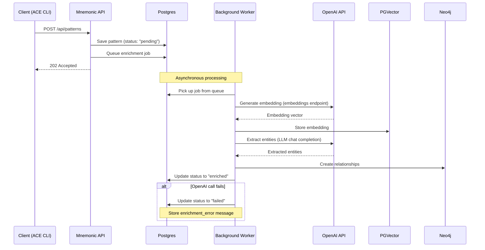

Key characteristics:

- **Automatic**: Users do not invoke enrichment separately; it triggers on create/update
- **Non-blocking**: API returns 202 Accepted immediately; enrichment happens asynchronously
- **Status tracking**: Pattern's `enrichment_status` field reflects current state
- **Idempotent**: Re-enrichment on update replaces previous enrichment data

**Why 202 Accepted instead of 201 Created?** The pattern resource is accepted for processing but not immediately usable. Patterns with `enrichment_status: 'pending'` are excluded from search results until enrichment completes. HTTP 202 accurately signals that the request was accepted but processing is not yet complete.

## Enrichment Pipeline

> **Architecture Reference:** [System Architecture - Mnemonic](../../architecture/03-system-architecture.md#mnemonic) | [Overview - Core Concept](../../architecture/00-overview.md#core-concept)

### Write-time Enrichment

When a pattern is created or updated via `POST/PUT /api/patterns`:

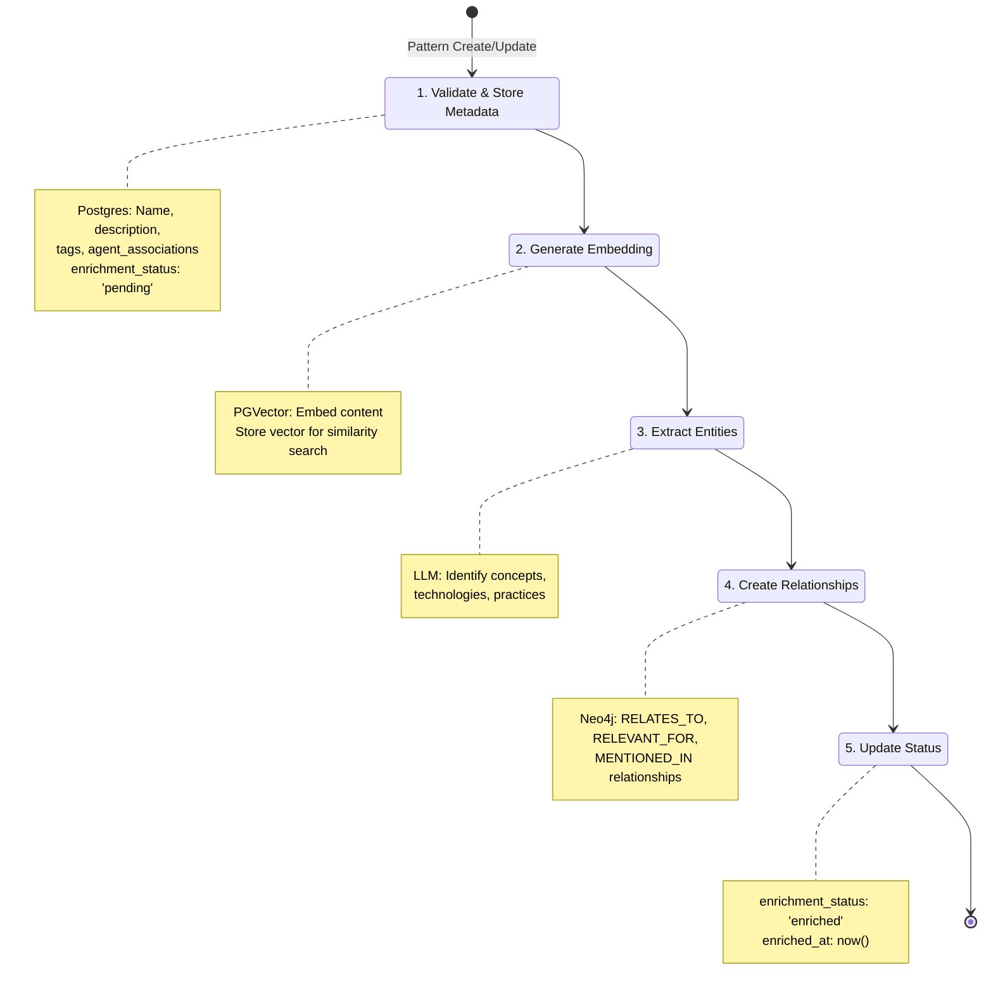

#### Step 1: Validate and Store Metadata

Store pattern metadata in Postgres:

- `id` (UUID, generated)
- `name`, `description`, `content`
- `tags` (array)
- `agent_associations` (JSON with agent_name + relevance)
- `enrichment_status` (initially "pending")
- `enrichment_error` (null initially)
- `enriched_at` (null initially)
- `created_at`, `updated_at`

#### Step 2: Generate Embedding

Generate a vector embedding from the pattern content:

```go
// Pseudocode
embedding := embeddingModel.Embed(pattern.Content)
pgvector.Store(pattern.ID, embedding)
```

The embedding captures semantic meaning, enabling similarity search.

#### Step 3: Extract Entities

Use an LLM to extract structured information from the pattern content:

```json
{
  "concepts": ["error handling", "retry logic", "exponential backoff"],
  "technologies": ["Go", "context package"],
  "practices": ["defensive programming", "graceful degradation"]
}
```

This LLM call adds 1-5 seconds of processing time per pattern, which is why enrichment runs asynchronously.

#### Step 4: Create Relationships

Store relationships in Neo4j:

```cypher
// Pattern to agent relationship
MERGE (p:Pattern {id: $patternId})
MERGE (a:Agent {name: $agentName})
MERGE (p)-[:RELEVANT_FOR {relevance: $relevance}]->(a)

// Pattern to concept relationship
MERGE (p:Pattern {id: $patternId})
MERGE (c:Concept {name: $conceptName})
MERGE (c)-[:MENTIONED_IN]->(p)

// Pattern to pattern relationship (based on shared entities)
MATCH (p1:Pattern)-[:MENTIONS]->(e:Entity)<-[:MENTIONS]-(p2:Pattern)
WHERE p1.id <> p2.id
MERGE (p1)-[:RELATES_TO]->(p2)
```

#### Step 5: Update Status

On successful completion:

```sql
UPDATE patterns
SET enrichment_status = 'enriched',
    enriched_at = NOW(),
    enrichment_error = NULL
WHERE id = $patternId;
```

On failure:

```sql
UPDATE patterns
SET enrichment_status = 'failed',
    enrichment_error = $errorMessage
WHERE id = $patternId;
```

### Query-time Processing

When patterns are retrieved via `POST /api/route`:

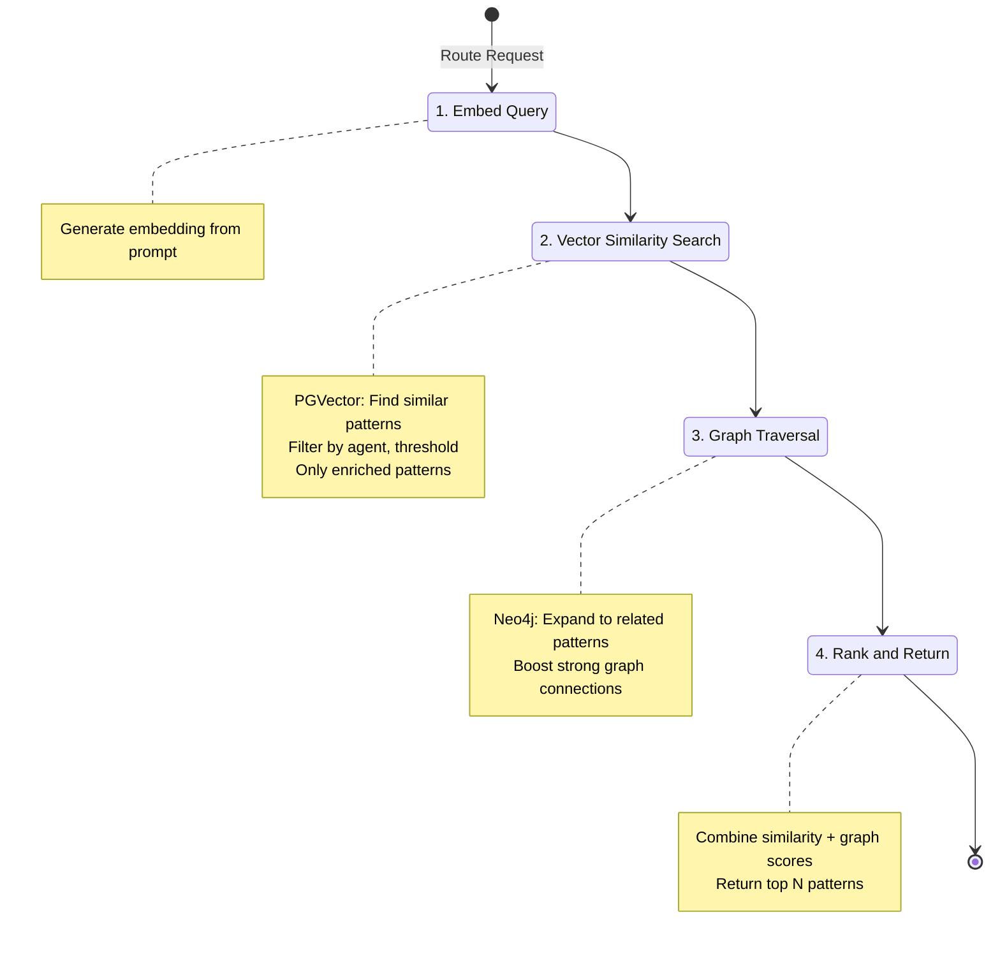

Note: Query-time search only considers patterns with `enrichment_status = 'enriched'`. Patterns still pending or failed enrichment are excluded from search results.

#### Relevance Scoring

```text
relevance = (0.7 * vector_similarity) + (0.3 * graph_score)
```

> **Note:** This combined formula is used for pattern search and retrieval, providing richer relevance scoring by incorporating graph context. For routing decisions, the Routing Engine uses simple cosine similarity for speed. See [Routing Engine - Scoring Logic by Match Type](routing-engine.md#scoring-logic-by-match-type) for details.

Where `graph_score` considers:

- Direct agent association relevance
- Number of hops from matched patterns
- Shared entity count

## Enrichment Worker Deployment

> **Architecture Reference:** [Deployment Architecture - Component Deployment](../../architecture/05-deployment-architecture.md#component-deployment) | [Deployment Architecture - Scaling Considerations](../../architecture/05-deployment-architecture.md#scaling-considerations)

### In-Process Background Worker

The enrichment worker runs as a background goroutine within the same Mnemonic process:

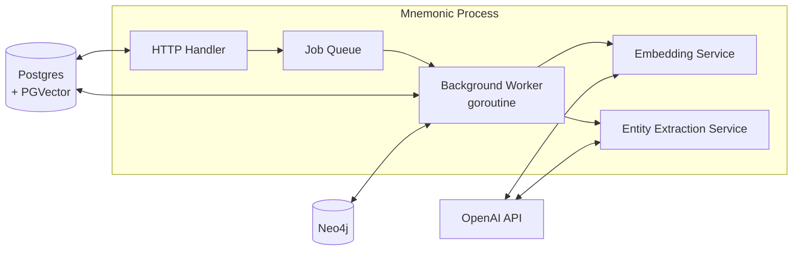

**Why in-process?**

- **Low volume expected**: Pattern creates/updates are infrequent (not hundreds per day)
- **Simpler deployment**: Single container, no external message broker
- **Postgres-backed queue**: Job queue persists in Postgres for reliability
- **Easy to migrate**: Can extract to separate service later if needed

### Job Queue Design

Use a Postgres-backed job queue (no external message broker required):

```sql
CREATE TABLE enrichment_jobs (
    id UUID PRIMARY KEY DEFAULT gen_random_uuid(),
    pattern_id UUID NOT NULL REFERENCES patterns(id) ON DELETE CASCADE,
    status VARCHAR(20) NOT NULL DEFAULT 'pending',  -- pending, processing, completed, failed
    attempts INTEGER NOT NULL DEFAULT 0,
    max_attempts INTEGER NOT NULL DEFAULT 3,
    last_error TEXT,
    created_at TIMESTAMP WITH TIME ZONE DEFAULT NOW(),
    updated_at TIMESTAMP WITH TIME ZONE DEFAULT NOW(),
    scheduled_for TIMESTAMP WITH TIME ZONE DEFAULT NOW(),
    started_at TIMESTAMP WITH TIME ZONE,
    completed_at TIMESTAMP WITH TIME ZONE
);

CREATE INDEX idx_enrichment_jobs_pending ON enrichment_jobs (scheduled_for)
    WHERE status = 'pending';
```

Worker polling:

```sql
-- Claim next available job (with row-level locking)
UPDATE enrichment_jobs
SET status = 'processing',
    started_at = NOW(),
    attempts = attempts + 1
WHERE id = (
    SELECT id FROM enrichment_jobs
    WHERE status = 'pending'
      AND scheduled_for <= NOW()
      AND attempts < max_attempts
    ORDER BY scheduled_for
    FOR UPDATE SKIP LOCKED
    LIMIT 1
)
RETURNING *;
```

### Scaling and Concurrency

When running multiple Mnemonic instances (pods), all instances can safely process enrichment jobs concurrently without duplicate processing. This is achieved through Postgres row-level locking.

#### How Multi-Pod Job Claiming Works

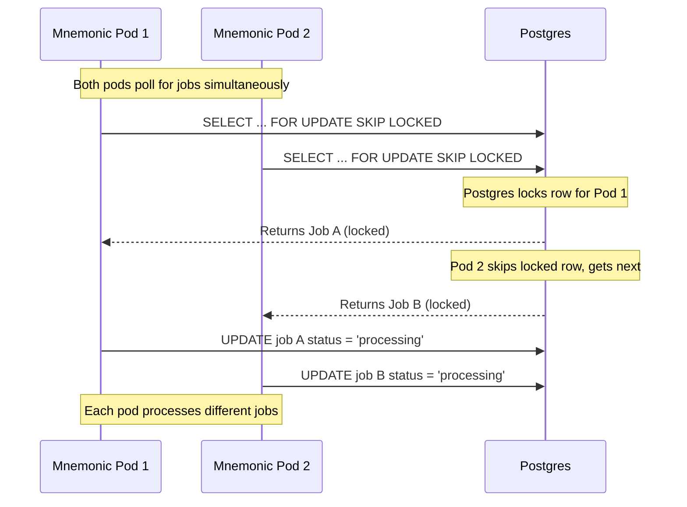

#### The FOR UPDATE SKIP LOCKED Guarantee

The key SQL construct that prevents duplicate processing:

```sql
SELECT id FROM enrichment_jobs
WHERE status = 'pending'
  AND scheduled_for <= NOW()
  AND attempts < max_attempts
ORDER BY scheduled_for
FOR UPDATE SKIP LOCKED  -- Critical: skips rows locked by other transactions
LIMIT 1
```

**What `FOR UPDATE SKIP LOCKED` does:**

| Behavior      | Description                                                              |
| ------------- | ------------------------------------------------------------------------ |
| `FOR UPDATE`  | Locks the selected row for the duration of the transaction               |
| `SKIP LOCKED` | If another transaction holds a lock on a row, skip it instead of waiting |

This means:

- **No duplicate processing**: Two pods cannot claim the same job
- **No blocking**: Pods don't wait on each other; they grab different jobs
- **No external coordination**: No distributed locks, Redis, or Zookeeper needed
- **Automatic failover**: If a pod crashes mid-processing, the job remains in "processing" state and can be reclaimed after timeout

#### Job Timeout and Recovery

To handle crashed workers, implement a job timeout mechanism:

```sql
-- Reclaim stale jobs (stuck in "processing" for too long)
UPDATE enrichment_jobs
SET status = 'pending',
    scheduled_for = NOW() + INTERVAL '30 seconds'
WHERE status = 'processing'
  AND started_at < NOW() - INTERVAL '5 minutes'
  AND attempts < max_attempts;
```

Run this query periodically (e.g., every minute) to recover jobs from crashed workers.

#### Horizontal Scaling Behavior

| Pods   | Behavior                                       |
| ------ | ---------------------------------------------- |
| 1 pod  | Single worker processes all jobs sequentially  |
| 2 pods | Jobs distributed automatically; ~2x throughput |
| N pods | Jobs distributed across N pods; ~Nx throughput |

**Note**: Throughput scales linearly until limited by:

- OpenAI API rate limits (shared across all pods)
- Postgres connection pool exhaustion
- Neo4j write capacity

### Future Scaling: Dedicated Enrichment Processor

For larger deployments or separation of concerns, the enrichment worker can be extracted to a dedicated service:

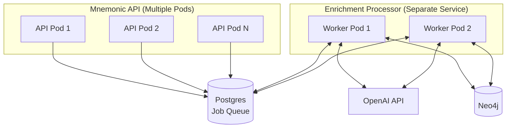

**Why consider a dedicated enrichment processor?**

| Benefit                    | Description                                                             |
| -------------------------- | ----------------------------------------------------------------------- |
| **Separation of concerns** | API handles requests; processor handles background work                 |
| **Independent scaling**    | Scale API pods for request volume; scale workers for enrichment backlog |
| **Resource isolation**     | LLM calls don't compete with API request handling                       |
| **Deployment flexibility** | Update enrichment logic without redeploying API                         |
| **Cost optimization**      | Run workers on cheaper/burstable instances                              |

**When to migrate to dedicated processor:**

- Enrichment backlog consistently grows (processing can't keep up)
- API latency affected by enrichment worker resource usage
- Need to scale enrichment independently from API
- Want to deploy enrichment changes without API downtime

**Migration path:**

1. Extract worker code to separate Go binary (same codebase, different main)
2. Deploy as separate container/service
3. Remove in-process worker from API pods
4. Scale worker pods based on queue depth
5. Consider Redis or SQS if Postgres queue becomes bottleneck

## External Service Dependencies

> **Architecture Reference:** [Requirements - Non-Goals](../../architecture/01-requirements.md#non-goals) | [System Architecture - Boundary Definitions](../../architecture/03-system-architecture.md#boundary-definitions)

Pattern enrichment requires external API calls for embedding generation and entity extraction.

### OpenAI API (Embeddings)

Embedding generation requires the OpenAI API:

| Requirement        | Details                                                   |
| ------------------ | --------------------------------------------------------- |
| **Service**        | OpenAI API                                                |
| **Endpoint**       | `https://api.openai.com/v1/embeddings`                    |
| **Model**          | `text-embedding-3-small`                                  |
| **Dimensions**     | 1536 (must match PGVector column configuration)           |
| **Authentication** | API key required                                          |
| **Cost**           | ~$0.0001 per pattern (~$0.00002 per 1K tokens)            |
| **Rate limits**    | 3,000 RPM / 1,000,000 TPM (tier 1), higher for paid tiers |

**Why OpenAI?**

- Industry-standard embedding quality
- Simple API integration
- Predictable costs at scale
- No infrastructure to maintain

Additional embedding providers (Azure OpenAI, self-hosted models) can be added post-MVP if needed.

### OpenAI API (Entity Extraction)

Entity extraction uses the OpenAI API:

| Requirement        | Details                                               |
| ------------------ | ----------------------------------------------------- |
| **Service**        | OpenAI API                                            |
| **Endpoint**       | `https://api.openai.com/v1/chat/completions`          |
| **Model**          | `gpt-4o-mini`                                         |
| **Authentication** | API key required (same key used for embeddings)       |
| **Cost**           | ~$0.01-0.05 per pattern                               |
| **Rate limits**    | 500 RPM / 200,000 TPM (tier 1), higher for paid tiers |

Additional LLM providers (Anthropic, Azure OpenAI) can be added post-MVP if needed.

## Configuration Requirements

> **Architecture Reference:** [Deployment Architecture - Operational Considerations](../../architecture/05-deployment-architecture.md#operational-considerations)

### Required Environment Variables

```bash
# Required for embedding generation and entity extraction
MNEMONIC_OPENAI_API_KEY=sk-...
```

### Application Configuration

Configuration follows the patterns established in [configuration.md](configuration.md).

```yaml
openai:
  # API key should be set via MNEMONIC_OPENAI_API_KEY
  api_key: ""

  # Embedding configuration
  embedding_model: text-embedding-3-small
  embedding_dimensions: 1536 # Must match PGVector column size

  # Entity extraction configuration
  extraction_model: gpt-4o-mini

  # Rate limiting (recommended)
  max_requests_per_minute: 500
  retry_attempts: 3
  retry_delay: 1s

# Enrichment worker configuration
enrichment:
  worker_count: 2 # Number of concurrent workers (goroutines)
  poll_interval: 5s # How often to check for new jobs
  max_attempts: 3 # Retry attempts before marking as failed
  retry_delay: 30s # Delay between retry attempts

# Neo4j configuration (required)
neo4j:
  uri: bolt://localhost:7687
  username: neo4j
  # password should be set via MNEMONIC_DATABASE_NEO4J_PASSWORD
  password: ""
  database: neo4j
```

Changing the embedding model requires re-embedding all existing patterns - the dimensions must match across all stored vectors. Additional embedding providers can be supported post-MVP if needed.

## Cost and Latency

### Per-Pattern Processing

| Operation             | Time      | Cost            |
| --------------------- | --------- | --------------- |
| Embedding generation  | 100-200ms | ~$0.0001        |
| Entity extraction     | 1-5s      | ~$0.01-0.05     |
| Neo4j writes          | 50-100ms  | N/A             |
| **Total per pattern** | **1-5s**  | **~$0.01-0.05** |

The 1-5 second processing time per pattern reinforces why enrichment runs asynchronously. Users should not wait for this during API calls.

### Projected Monthly Costs

| Patterns/month | Embedding Cost | LLM Cost | Total    |
| -------------- | -------------- | -------- | -------- |
| 100            | $0.01          | $1-5     | $1-5     |
| 1,000          | $0.10          | $10-50   | $10-50   |
| 10,000         | $1.00          | $100-500 | $100-500 |

Query embeddings also incur costs (~$0.0001 per query). For high-volume query scenarios, consider caching strategies.

### Rate Limit Considerations

OpenAI enforces rate limits that affect burst processing:

- **Tier 1 (default)**: 3,000 requests/minute, 1M tokens/minute
- **Tier 2+**: Higher limits available with usage history

For bulk pattern imports, implement:

- Request queuing with backoff
- Batch processing with delays
- Rate limit monitoring and alerting

## Deployment Requirements

> **Architecture Reference:** [Deployment Architecture - Infrastructure Requirements](../../architecture/05-deployment-architecture.md#infrastructure-requirements) | [Deployment Architecture - Deployment Topology](../../architecture/05-deployment-architecture.md#deployment-topology)

### Infrastructure Checklist

Before deploying pattern enrichment, verify:

- [ ] OpenAI API key provisioned and tested
- [ ] API key stored securely (secrets manager, not in code)
- [ ] Environment variables configured in deployment
- [ ] Rate limits appropriate for expected load
- [ ] Cost monitoring/alerting configured
- [ ] Network egress to `api.openai.com` allowed
- [ ] PGVector dimensions match configured embedding dimensions (1536)
- [ ] Enrichment job table created in Postgres
- [ ] Neo4j instance provisioned and accessible
- [ ] Neo4j credentials configured

### Failure Modes

| Failure                 | Impact                                 | Mitigation                        |
| ----------------------- | -------------------------------------- | --------------------------------- |
| Invalid/missing API key | All enrichment jobs fail               | Startup validation, health checks |
| Rate limit exceeded     | Temporary failures, 429 responses      | Exponential backoff, queuing      |
| OpenAI outage           | Embedding/extraction unavailable       | Circuit breaker, queue for retry  |
| Neo4j unavailable       | Relationship storage fails             | Circuit breaker, queue for retry  |
| Dimension mismatch      | Vectors unusable for similarity search | Validate config at startup        |
| Network blocked         | Cannot reach external APIs             | Verify egress rules               |
| Worker crash            | Jobs stuck in "processing"             | Job timeout, automatic requeuing  |

### Health Check Endpoint

The pattern service should expose a health check that validates enrichment capability:

```go
// Health check should verify:
// 1. OpenAI API key is configured
// 2. OpenAI API is reachable (optional: test calls)
// 3. PGVector is available with correct dimensions
// 4. Neo4j is available and accessible
// 5. Enrichment worker is running
// 6. Job queue is accessible
```

## Internal Dependencies

> **Architecture Reference:** [System Architecture - Mnemonic](../../architecture/03-system-architecture.md#mnemonic)

### PGVector Configuration

```sql
-- Recommended index for ~1000 patterns
CREATE INDEX ON patterns
USING ivfflat (embedding vector_cosine_ops)
WITH (lists = 100);

-- For larger collections (10K+), consider HNSW
CREATE INDEX ON patterns
USING hnsw (embedding vector_cosine_ops)
WITH (m = 16, ef_construction = 64);
```

The vector column must be configured for the same dimensions as the embedding model:

```sql
-- Must match embedding.dimensions in config (default: 1536)
ALTER TABLE patterns ADD COLUMN embedding vector(1536);

-- Enrichment status fields
ALTER TABLE patterns ADD COLUMN enrichment_status VARCHAR(20) DEFAULT 'pending';
ALTER TABLE patterns ADD COLUMN enrichment_error TEXT;
ALTER TABLE patterns ADD COLUMN enriched_at TIMESTAMP WITH TIME ZONE;
```

### Neo4j Schema

```cypher
// Create constraints for pattern nodes
CREATE CONSTRAINT pattern_id IF NOT EXISTS
FOR (p:Pattern) REQUIRE p.id IS UNIQUE;

// Create constraints for agent nodes
CREATE CONSTRAINT agent_name IF NOT EXISTS
FOR (a:Agent) REQUIRE a.name IS UNIQUE;

// Create constraints for concept nodes
CREATE CONSTRAINT concept_name IF NOT EXISTS
FOR (c:Concept) REQUIRE c.name IS UNIQUE;

// Create indexes for common queries
CREATE INDEX pattern_name IF NOT EXISTS
FOR (p:Pattern) ON (p.name);
```

### Entity Extraction Prompt

```text
Extract key concepts from this pattern document.

Return JSON with:
- concepts: General programming concepts
- technologies: Languages, frameworks, tools
- practices: Best practices, patterns, methodologies

Pattern content:
{content}
```

## References

- [Architecture Overview](../../architecture/00-overview.md)
- [System Architecture](../../architecture/03-system-architecture.md) - Storage stack details
- [API Specification](api-specification.md) - Pattern endpoints
- [Mnemonic OpenAPI Spec](../../../api/openapi/mnemonic-v1.yaml) - Full API definition
# Routing Engine

[Back to Architecture Overview](../../architecture/00-overview.md) | [Back to Project README](../../../README.md)

## Table of Contents

- [Overview](#overview)
- [Design Principles](#design-principles)
- [Interface Definitions](#interface-definitions)
  - [Router Interface](#router-interface)
  - [RuleMatcher Interface](#rulematcher-interface)
  - [RoutingDecision Type](#routingdecision-type)
  - [Supporting Types](#supporting-types)
  - [Complete Type Relationships](#complete-type-relationships)
- [Rule Loading and Caching](#rule-loading-and-caching)
  - [Cache Architecture](#cache-architecture)
  - [Startup Behavior](#startup-behavior)
  - [Rule Reloading (Post-MVP)](#rule-reloading-post-mvp)
- [Priority-Ordered Evaluation](#priority-ordered-evaluation)
  - [Evaluation Algorithm](#evaluation-algorithm)
  - [Short-Circuit Behavior](#short-circuit-behavior)
  - [Tie-Breaking Rules](#tie-breaking-rules)
- [Match Type Implementations](#match-type-implementations)
  - [Keyword Matcher](#keyword-matcher)
  - [Regex Matcher](#regex-matcher)
  - [Pattern Matcher (Semantic)](#pattern-matcher-semantic)
  - [Default Matcher](#default-matcher)
- [Confidence Scoring](#confidence-scoring)
  - [Scoring Logic by Match Type](#scoring-logic-by-match-type)
  - [Score Normalization](#score-normalization)
  - [Reasoning Generation](#reasoning-generation)
- [Performance Considerations](#performance-considerations)
  - [Latency Targets](#latency-targets)
  - [Optimization Strategies](#optimization-strategies)
  - [Benchmarking Guidelines](#benchmarking-guidelines)
- [Error Handling](#error-handling)
- [References](#references)

## Overview

[↑ Table of Contents](#table-of-contents)

> **Architecture Reference:** [ADR-002: Routing Location](../../architecture/02-architectural-decisions.md#adr-002-routing-location) | [System Architecture - Mnemonic](../../architecture/03-system-architecture.md#mnemonic) | [Overview - Key Principles](../../architecture/00-overview.md#key-principles)

The routing engine is the core component within Mnemonic that determines which agent should handle a given prompt. As defined in [ADR-002](../../architecture/02-architectural-decisions.md#adr-002-routing-location), routing logic lives server-side in Mnemonic, providing team-wide consistency and centralized management.

Key characteristics:

- **Deterministic**: Routing is code-based, not LLM-driven (per architecture requirements)
- **Priority-ordered**: Rules are evaluated in priority order (highest first)
- **Configurable**: Rules are stored in the database and managed via REST API
- **Fast**: Routing decisions must be made quickly (target: <50ms for deterministic rules; see [Latency Targets](#latency-targets) for tiered SLOs)

The routing engine implements the logic described in the [OpenAPI specification](../../../api/openapi/mnemonic-v1.yaml) for the `POST /api/route` endpoint.

## Design Principles

[↑ Table of Contents](#table-of-contents)

> **Architecture Reference:** [Overview - Key Principles](../../architecture/00-overview.md#key-principles) | [Architectural Decisions](../../architecture/02-architectural-decisions.md)

1. **Determinism over intelligence**: The routing engine uses explicit rules, not LLM inference. This ensures predictable, auditable, and fast routing decisions.

2. **Fail-safe defaults**: If no rules match, a default agent handles the request. The system never fails to route.

3. **Separation of concerns**: The router evaluates rules; matchers implement match logic; the repository handles persistence.

4. **Testability**: All components use interfaces for dependency injection and easy mocking.

5. **Observability**: Every routing decision includes reasoning and metadata for debugging.

## Interface Definitions

[↑ Table of Contents](#table-of-contents)

> **Architecture Reference:** [Communication Patterns - CLI to Mnemonic Communication](../../architecture/04-communication-patterns.md#cli-to-mnemonic-communication) | [Communication Patterns - Response Structure](../../architecture/04-communication-patterns.md#response-structure)

### Router Interface

The `Router` interface defines the primary routing contract. It evaluates the prompt against all enabled routing rules in priority order and returns the first match.

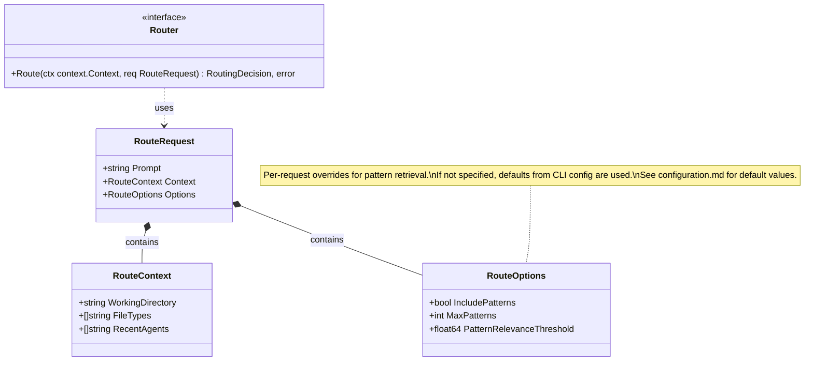

**RouteOptions precedence:** The `RouteOptions` fields (`IncludePatterns`, `MaxPatterns`, `PatternRelevanceThreshold`) allow per-request overrides of the default values configured in the ACE CLI configuration file. If these fields are not specified in a request, the CLI configuration defaults are used. See [Configuration - Routing Preferences](configuration.md#ace-cli-configuration) for default values.

**Router.Route behavior:**

- Evaluates rules in descending priority order
- Returns immediately when a rule matches (short-circuit evaluation)
- If no rules match, returns a default routing decision using the configured default agent

### RuleMatcher Interface

Each match type implements the `RuleMatcher` interface. Different implementations handle keyword, regex, pattern, and default matching.

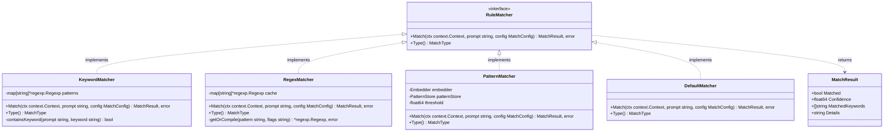

**MatchResult fields:**

| Field             | Type     | Description                                                           |
| ----------------- | -------- | --------------------------------------------------------------------- |
| `Matched`         | bool     | Whether the rule matched the prompt                                   |
| `Confidence`      | float64  | Score from 0.0 to 1.0 indicating match strength                       |
| `MatchedKeywords` | []string | Keywords that triggered a keyword match (empty for other match types) |
| `Details`         | string   | Additional match information for logging                              |

### RoutingDecision Type

The `RoutingDecision` struct contains the result of routing evaluation and maps to the RoutingDecision schema in the OpenAPI spec.

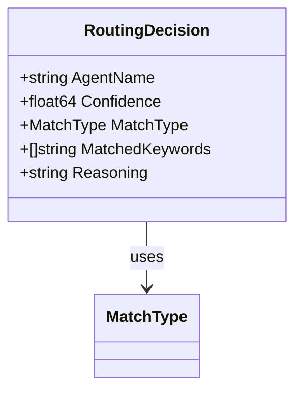

**RoutingDecision fields:**

| Field             | Type      | Description                                                     |
| ----------------- | --------- | --------------------------------------------------------------- |
| `AgentName`       | string    | Identifier of the selected agent                                |
| `Confidence`      | float64   | Routing confidence (0.0-1.0, where 1.0 = deterministic match)   |
| `MatchType`       | MatchType | Which type of matching triggered the route                      |
| `MatchedKeywords` | []string  | Keywords that triggered the route (only for MatchTypeKeyword)   |
| `Reasoning`       | string    | Human-readable explanation of why this agent was selected       |

### Supporting Types

The following types support the routing engine's rule evaluation system.

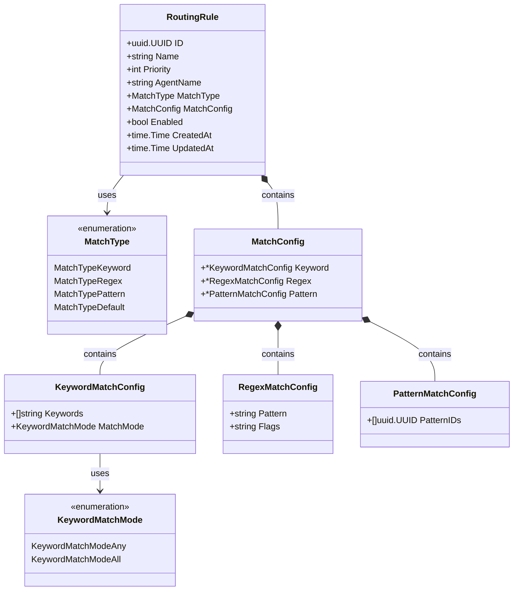

**MatchConfig union semantics:**

Only one field is populated based on the `MatchType`:

- `MatchType: keyword` -> `MatchConfig.Keyword` is populated
- `MatchType: regex` -> `MatchConfig.Regex` is populated
- `MatchType: pattern` -> `MatchConfig.Pattern` is populated
- `MatchType: default` -> No configuration needed (empty config)

### Complete Type Relationships

The following diagram shows the complete relationship between all routing engine types:

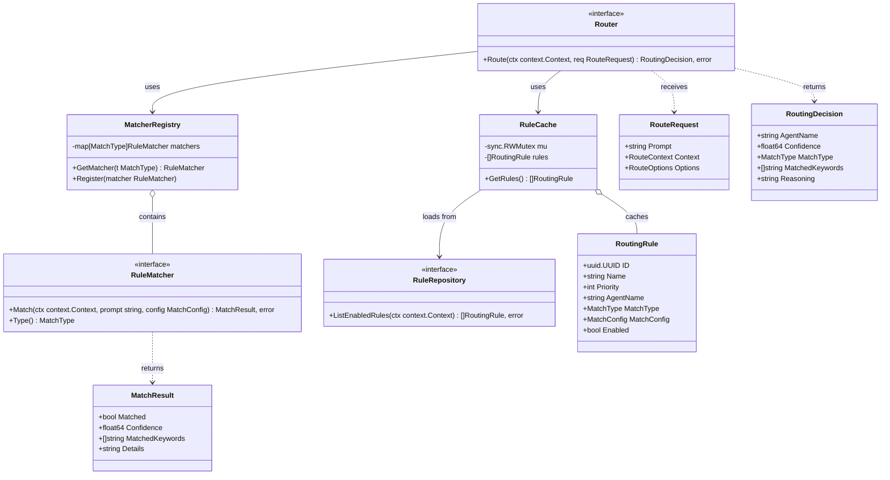

## Rule Loading and Caching

[↑ Table of Contents](#table-of-contents)

> **Architecture Reference:** [System Architecture - Mnemonic](../../architecture/03-system-architecture.md#mnemonic) | [Deployment Architecture - Operational Considerations](../../architecture/05-deployment-architecture.md#operational-considerations)

### Cache Architecture

The routing engine maintains an in-memory cache of enabled routing rules to minimize database queries during routing decisions.

> **MVP Note:** The MVP design uses a simplified cache that loads rules once at startup. Restart the service to reload rules if they change. Background refresh with automatic rule reloading is a Post-MVP feature for multi-user/cloud deployments.

```mermaid
flowchart TD
    subgraph "Routing Engine"
        ROUTER[Router]
        CACHE[Rule Cache<br/>sync.RWMutex protected]
        MATCHERS[Matcher Registry]
    end

    subgraph "Storage"
        PG[(Postgres)]
    end

    ROUTER --> CACHE
    ROUTER --> MATCHERS
    CACHE <--|"Load on startup"| PG
```

**RuleCache implementation (MVP):**

```go
type RuleCache struct {
    rules []Rule
    mu    sync.RWMutex
}

func NewRuleCache(loader RuleLoader) (*RuleCache, error) {
    rules, err := loader.Load(context.Background())
    if err != nil {
        return nil, fmt.Errorf("failed to load rules at startup: %w", err)
    }
    return &RuleCache{rules: rules}, nil
}

func (c *RuleCache) GetRules() []Rule {
    c.mu.RLock()
    defer c.mu.RUnlock()
    return c.rules
}
```

**GetRules behavior:**

- Returns cached rules (thread-safe via RWMutex read lock)
- Rules are pre-sorted by priority DESC, then by Rule ID ASC (lexicographic)
- The RWMutex ensures safe concurrent access from multiple routing requests

**Sorting implementation (performed at startup):**

```go
sort.Slice(rules, func(i, j int) bool {
    if rules[i].Priority != rules[j].Priority {
        return rules[i].Priority > rules[j].Priority
    }
    return rules[i].ID.String() < rules[j].ID.String()
})
```

### Startup Behavior

On startup, the routing engine must successfully load rules before accepting requests. The MVP uses a fail-fast approach.

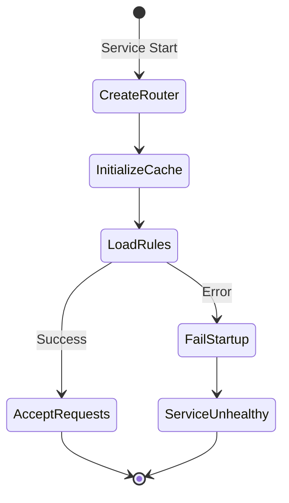

**Startup failure behavior (MVP):**

- If rules cannot be loaded, the service fails to start immediately (fail-fast)
- This prevents routing requests with missing rules
- Health checks report unhealthy until rules are loaded

**Reloading rules (MVP):**

- Restart the service to reload rules from the database
- There is no runtime rule refresh in the MVP

### Rule Reloading (Post-MVP)

> **Post-MVP Feature:** The following capabilities are planned for future releases to support multi-user and cloud deployments.

**Planned features:**

- Background refresh via ticker with configurable `refresh_interval`
- Explicit cache invalidation when rules are modified via admin API
- Graceful degradation for refresh failures (use stale cache)
- `Router.ReloadRules(ctx context.Context) error` method for on-demand refresh
- Configurable `startup_timeout` for initial rule load

**Planned configuration:**

| Setting           | Default | Description                            |
| ----------------- | ------- | -------------------------------------- |
| `refresh_interval`| 5m      | Background refresh interval            |
| `startup_timeout` | 30s     | Max time to wait for initial rule load |

These features enable rule changes to propagate without service restarts, which is important for:

- Multi-user environments where different teams manage rules
- Cloud deployments with automated rule updates
- High-availability scenarios where restarts are undesirable

## Priority-Ordered Evaluation

[↑ Table of Contents](#table-of-contents)

> **Architecture Reference:** [System Architecture - Data Flow](../../architecture/03-system-architecture.md#data-flow) | [Requirements - Goals](../../architecture/01-requirements.md#goals)

### Evaluation Algorithm

Rules are evaluated in a deterministic order: descending by priority, then ascending by Rule ID (lexicographic). The first rule that matches determines the routing decision.

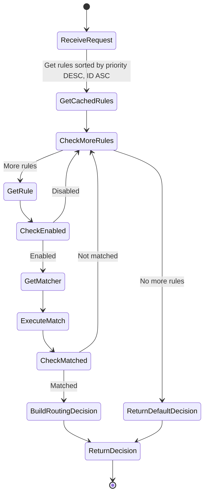

**Algorithm pseudocode:**

1. Retrieve pre-sorted rules from cache
2. Normalize the prompt (lowercase, trim whitespace)
3. For each rule in priority order:
   - Skip if rule is disabled
   - Get the appropriate matcher for the rule's match type
   - Execute the match operation
   - If match result is true, build and return RoutingDecision
4. If no rules matched, return default routing decision

### Short-Circuit Behavior

The router uses short-circuit evaluation for performance:

1. **First match wins**: Once a rule matches, evaluation stops immediately
2. **Priority ordering**: Higher priority rules are evaluated first
3. **Skip disabled**: Disabled rules are skipped without evaluation

This design ensures that high-priority rules are always considered first, and adding lower-priority fallback rules does not impact performance of primary routing paths.

### Tie-Breaking Rules

When multiple rules have the same priority, ties are broken deterministically using the Rule ID:

| Order | Criterion | Rationale                                   |
| ----- | --------- | ------------------------------------------- |
| 1     | Priority  | Explicit operator control                   |
| 2     | Rule ID   | Deterministic fallback (lexicographic sort) |

**Best Practice:** Assign unique priorities to rules whenever possible. This gives operators explicit control over evaluation order and makes rule behavior easier to understand and debug. Rule ID tie-breaking exists as a deterministic fallback, not as a primary ordering mechanism.

## Match Type Implementations

[↑ Table of Contents](#table-of-contents)

> **Architecture Reference:** [Communication Patterns - Request Flow](../../architecture/04-communication-patterns.md#request-flow)

### Keyword Matcher

The keyword matcher checks if configured keywords appear in the prompt.

**Matching behavior:**

- Case-insensitive matching
- Word boundary awareness (prevents "go" matching "mango")
- Supports single words and multi-word phrases
- Two modes: `any` (OR) and `all` (AND)

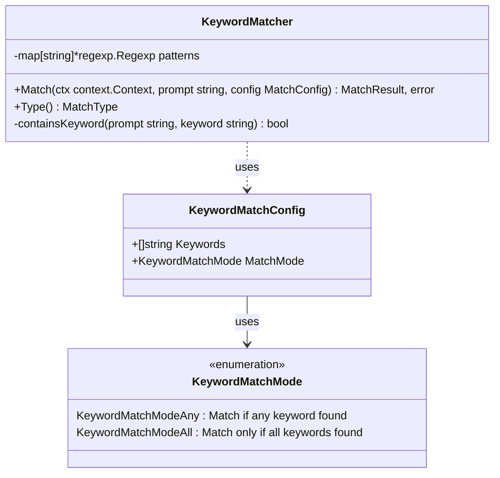

**Match algorithm:**

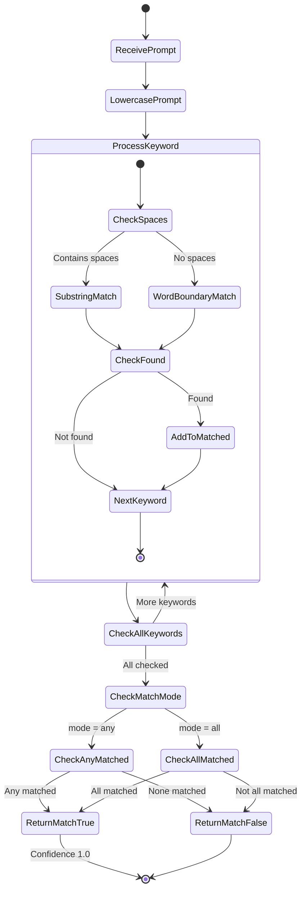

**Example rule:**

```json
{
  "name": "go-keyword-match",
  "priority": 100,
  "agent_name": "go-software-agent",
  "match_type": "keyword",
  "match_config": {
    "keywords": ["go", "golang", "go function", "go package"],
    "match_mode": "any"
  }
}
```

### Regex Matcher

The regex matcher evaluates prompts against a regular expression pattern.

**Matching behavior:**

- Compiled regex patterns are cached for performance
- Supports standard Go regex syntax
- Optional flags: `i` (case-insensitive)
- Matches anywhere in the prompt (not anchored)

```mermaid
classDiagram
    class RegexMatcher {
        -map[string]*regexp.Regexp cache
        +Match(ctx context.Context, prompt string, config MatchConfig) MatchResult, error
        +Type() MatchType
        -getOrCompile(pattern string, flags string) *regexp.Regexp, error
    }

    class RegexMatchConfig {
        +string Pattern
        +string Flags
    }

    RegexMatcher ..> RegexMatchConfig : uses
```

**Match algorithm:**

```mermaid
stateDiagram-v2
    [*] --> ReceivePrompt
    ReceivePrompt --> BuildCacheKey: flags:pattern
    BuildCacheKey --> CheckCache

    state CheckCache <<choice>>
    CheckCache --> GetCompiledRegex: In cache
    CheckCache --> ApplyFlags: Not in cache

    ApplyFlags --> CompileRegex: e.g., (?i) prefix
    CompileRegex --> CheckCompileError

    state CheckCompileError <<choice>>
    CheckCompileError --> ReturnError: Error
    CheckCompileError --> StoreInCache: Success

    StoreInCache --> GetCompiledRegex
    GetCompiledRegex --> CheckRegexMatch

    state CheckRegexMatch <<choice>>
    CheckRegexMatch --> ReturnMatchTrue: Matches
    CheckRegexMatch --> ReturnMatchFalse: No match

    ReturnMatchTrue --> [*]: Confidence 1.0
    ReturnMatchFalse --> [*]
    ReturnError --> [*]
```

**Example rule:**

```json
{
  "name": "go-function-regex",
  "priority": 90,
  "agent_name": "go-software-agent",
  "match_type": "regex",
  "match_config": {
    "pattern": "\\b(go|golang)\\b.*\\b(function|method|struct)\\b",
    "flags": "i"
  }
}
```

### Pattern Matcher (Semantic)

The pattern matcher uses semantic similarity to match prompts against stored patterns. This is the only non-deterministic match type, using vector embeddings for similarity.

**Matching behavior:**

- Generates an embedding for the prompt
- Compares against embeddings of configured patterns
- Returns a match if similarity exceeds threshold
- Confidence reflects the similarity score

```mermaid
classDiagram
    class PatternMatcher {
        -Embedder embedder
        -PatternStore patternStore
        -float64 threshold
        +Match(ctx context.Context, prompt string, config MatchConfig) MatchResult, error
        +Type() MatchType
    }

    class Embedder {
        <<interface>>
        +Embed(ctx context.Context, text string) []float64, error
    }

    class PatternStore {
        <<interface>>
        +GetEmbedding(ctx context.Context, patternID uuid.UUID) []float64, error
    }

    class PatternMatchConfig {
        +[]uuid.UUID PatternIDs
    }

    PatternMatcher --> Embedder : uses
    PatternMatcher --> PatternStore : uses
    PatternMatcher ..> PatternMatchConfig : uses
```

**Match algorithm:**

```mermaid
stateDiagram-v2
    [*] --> ReceivePrompt
    ReceivePrompt --> GenerateEmbedding
    GenerateEmbedding --> CheckEmbeddingError

    state CheckEmbeddingError <<choice>>
    CheckEmbeddingError --> ReturnError: Error
    CheckEmbeddingError --> InitializeBestScore: Success

    InitializeBestScore --> ProcessPattern: best = 0

    state ProcessPattern {
        [*] --> GetPatternEmbedding
        GetPatternEmbedding --> CheckPatternError

        state CheckPatternError <<choice>>
        CheckPatternError --> LogWarning: Error
        CheckPatternError --> CalculateSimilarity: Success

        LogWarning --> [*]: Continue
        CalculateSimilarity --> CheckScore

        state CheckScore <<choice>>
        CheckScore --> UpdateBestScore: score > best
        CheckScore --> [*]: score <= best

        UpdateBestScore --> [*]
    }

    ProcessPattern --> CheckAllPatterns

    state CheckAllPatterns <<choice>>
    CheckAllPatterns --> ProcessPattern: More patterns
    CheckAllPatterns --> CheckThreshold: All checked

    state CheckThreshold <<choice>>
    CheckThreshold --> ReturnMatchTrue: best >= threshold
    CheckThreshold --> ReturnMatchFalse: best < threshold

    ReturnMatchTrue --> [*]: Confidence = similarity
    ReturnMatchFalse --> [*]
    ReturnError --> [*]
```

**Example rule:**

```json
{
  "name": "error-handling-pattern",
  "priority": 50,
  "agent_name": "go-software-agent",
  "match_type": "pattern",
  "match_config": {
    "pattern_ids": [
      "550e8400-e29b-41d4-a716-446655440001",
      "550e8400-e29b-41d4-a716-446655440002"
    ]
  }
}
```

**Performance note:** Pattern matching requires embedding generation, which adds latency. Use pattern match rules at lower priorities than keyword/regex rules.

### Default Matcher

The default matcher always matches and serves as a fallback when no other rules match.

**Matching behavior:**

- Always returns `Matched: true`
- Confidence is set to a baseline value (0.5)
- Should have the lowest priority (typically 0)
- Only one default rule should be active

```mermaid
classDiagram
    class DefaultMatcher {
        +Match(ctx context.Context, prompt string, config MatchConfig) MatchResult, error
        +Type() MatchType
    }

    note for DefaultMatcher "Always returns:\nMatched: true\nConfidence: 0.5\nDetails: 'no specific rules matched'"
```

**Example rule:**

```json
{
  "name": "default-fallback",
  "priority": 0,
  "agent_name": "general-agent",
  "match_type": "default",
  "match_config": {}
}
```

## Confidence Scoring

[↑ Table of Contents](#table-of-contents)

> **Architecture Reference:** [Communication Patterns - Response Structure](../../architecture/04-communication-patterns.md#response-structure)

### Scoring Logic by Match Type

| Match Type | Confidence Score | Rationale               |
| ---------- | ---------------- | ----------------------- |
| keyword    | 1.0              | Explicit keyword match  |
| regex      | 1.0              | Explicit pattern match  |
| pattern    | 0.0 - 1.0        | Cosine similarity score |
| default    | 0.5              | Baseline for fallback   |

Deterministic match types (keyword, regex) always return 1.0 confidence because the match is binary - either the pattern matches or it does not.

Pattern matching returns the actual cosine similarity score, allowing downstream systems to understand match quality.

> **Note:** Routing uses simple cosine similarity for fast rule matching. For richer relevance scoring during pattern search and retrieval, the Pattern Processing system uses a combined formula that incorporates graph context. See [Pattern Processing - Relevance Scoring](pattern-processing.md#relevance-scoring) for details.

```mermaid
flowchart LR
    subgraph "Confidence Scores"
        K[Keyword<br/>1.0]
        R[Regex<br/>1.0]
        P[Pattern<br/>0.0 - 1.0]
        D[Default<br/>0.5]
    end
```

### Score Normalization

All confidence scores are normalized to the range [0.0, 1.0]:

```mermaid
stateDiagram-v2
    [*] --> CheckNegative: Raw Score

    state CheckNegative <<choice>>
    CheckNegative --> Return0: Score < 0
    CheckNegative --> CheckOverOne: Score >= 0

    state CheckOverOne <<choice>>
    CheckOverOne --> Return1: Score > 1
    CheckOverOne --> ReturnScore: Score <= 1

    Return0 --> [*]: 0.0
    Return1 --> [*]: 1.0
    ReturnScore --> [*]: Score
```

### Reasoning Generation

Every routing decision includes a human-readable reasoning string based on the match type:

| Match Type | Reasoning Format                                   |
| ---------- | -------------------------------------------------- |
| keyword    | `"Matched keywords: go, function"`                 |
| regex      | `"Matched regex pattern: \b(go\|golang)\b"`        |
| pattern    | `"Semantic match with confidence 87%"`             |
| default    | `"No specific rules matched; using default agent"` |

## Performance Considerations

[↑ Table of Contents](#table-of-contents)

> **Architecture Reference:** [Requirements - Quality Attributes](../../architecture/01-requirements.md#quality-attributes) | [Communication Patterns - Timeout Handling](../../architecture/04-communication-patterns.md#timeout-handling)

### Latency Targets

The routing engine uses a **tiered latency model** because different match types have fundamentally different computational costs:

- **Keyword/Regex matching** is deterministic and fast (string operations only)
- **Pattern matching** requires embedding generation and vector similarity search, which involves external API calls or model inference

This is why the Design Principles section references "<50ms" while pattern matching allows up to 2 seconds - these are separate tiers, not contradictory targets.

**Tiered SLO Table:**

| Match Type | P50 | P95 | P99 (Max) | Notes |
| --- | --- | --- | --- | --- |
| Keyword | <5ms | <20ms | <50ms | String matching only |
| Regex | <5ms | <20ms | <50ms | Compiled regex, cached |
| Pattern (semantic) | <300ms | <800ms | <2s | Embedding generation + vector search |
| Default | <1ms | <5ms | <10ms | No-op, always matches |

**Operation-Level Targets:**

| Operation                      | Target  | Maximum | Applies To |
| ------------------------------ | ------- | ------- | ---------- |
| Rule evaluation (cache hit)    | < 10ms  | 50ms    | Keyword, Regex, Default |
| Full route request (deterministic) | < 50ms  | 200ms   | When pattern rules not triggered |
| Full route request (with pattern fallback) | < 500ms | 2s      | When pattern matching required |

**Why Pattern Matching is Slower:**

1. **Embedding generation**: The prompt must be converted to a vector embedding, typically requiring an API call to an embedding service or local model inference
2. **Vector similarity search**: The prompt embedding is compared against stored pattern embeddings using cosine similarity
3. **Multiple pattern comparisons**: A single pattern rule may reference multiple pattern IDs, each requiring similarity calculation

**Priority Ordering Ensures Fast Paths First:**

The [Optimization Strategies](#optimization-strategies) section explains that keyword and regex rules should have higher priority than pattern rules. This ensures:

- Most requests are routed via fast deterministic rules (<50ms)
- Pattern matching only runs as a fallback when deterministic rules do not match
- Users experience fast routing for common cases while still having semantic flexibility for edge cases

The routing engine is on the critical path for every ACE request. Latency directly impacts user experience.

### Optimization Strategies

**1. Pre-sorted rule cache**

Rules are sorted by priority when loaded into the cache, not during each routing request:

```mermaid
flowchart LR
    subgraph "Good: Sort Once"
        A[Cache Refresh] --> B[Load Rules]
        B --> C[Sort by Priority]
        C --> D[Store in Cache]
    end

    subgraph "Bad: Sort Every Request"
        E[Route Request] --> F[Get Rules]
        F --> G[Sort by Priority]
        G --> H[Evaluate]
    end
```

**2. Compiled regex caching**

Regex patterns are compiled once and stored in a sync.Map to avoid recompilation overhead.

**3. Prompt normalization**

Prompts are normalized (lowercase, trim whitespace) once at the start of routing, not for each rule evaluation.

**4. Short-circuit evaluation**

Stop evaluating rules as soon as a match is found.

**5. Defer expensive operations**

Pattern matching (which requires embedding) should have lower priority than keyword/regex rules:

| Priority | Match Type | Rationale                          |
| -------- | ---------- | ---------------------------------- |
| 100+     | keyword    | Fast, explicit matches first       |
| 50-99    | regex      | Fast, pattern-based matches second |
| 1-49     | pattern    | Slow, semantic matches last        |
| 0        | default    | Fallback only                      |

### Benchmarking Guidelines

Benchmark targets for the routing engine:

| Scenario                        | Target Latency |
| ------------------------------- | -------------- |
| 100 rules, keyword match        | < 1ms          |
| 100 rules, no match (full scan) | < 5ms          |
| 100 rules, pattern match        | < 500ms        |

## Error Handling

[↑ Table of Contents](#table-of-contents)

> **Architecture Reference:** [Communication Patterns - Error Handling](../../architecture/04-communication-patterns.md#error-handling) | [Communication Patterns - Fallback Behavior](../../architecture/04-communication-patterns.md#fallback-behavior)

The routing engine handles errors gracefully to ensure requests are never dropped:

**MVP error handling:**

| Error Scenario          | Behavior                         |
| ----------------------- | -------------------------------- |
| Invalid regex pattern   | Skip rule, log warning, continue |
| Pattern embedding fails | Skip rule, log error, continue   |
| All rules fail          | Return default agent             |
| Unknown match type      | Skip rule, log warning           |
| Startup rule load fails | Service fails to start (fail-fast) |

**Post-MVP error handling:**

| Error Scenario          | Behavior                         |
| ----------------------- | -------------------------------- |
| Cache refresh fails     | Use stale cache, log error       |

```mermaid
stateDiagram-v2
    [*] --> EvaluateRule
    EvaluateRule --> CheckError

    state CheckError <<choice>>
    CheckError --> CheckMatched: No error
    CheckError --> LogError: Error

    state CheckMatched <<choice>>
    CheckMatched --> ReturnDecision: Matched
    CheckMatched --> NextRule: Not matched

    LogError --> NextRule
    NextRule --> CheckMoreRules

    state CheckMoreRules <<choice>>
    CheckMoreRules --> EvaluateRule: More rules
    CheckMoreRules --> ReturnDefaultDecision: No more rules

    ReturnDecision --> [*]
    ReturnDefaultDecision --> [*]
```

**Key principle:** The router should never fail to return a routing decision. If all rules fail or error, the default agent handles the request.

## References

[↑ Table of Contents](#table-of-contents)

- [OpenAPI Specification](../../../api/openapi/mnemonic-v1.yaml) - RoutingRule, MatchType, RoutingDecision schemas
- [System Architecture](../../architecture/03-system-architecture.md) - Mnemonic component overview
- [Communication Patterns](../../architecture/04-communication-patterns.md) - REST endpoint patterns
- [Architectural Decisions](../../architecture/02-architectural-decisions.md) - ADR-002: Routing Location
- [Pattern Processing](pattern-processing.md) - Pattern enrichment and embedding
- [Configuration](configuration.md) - Server configuration including routing settings
