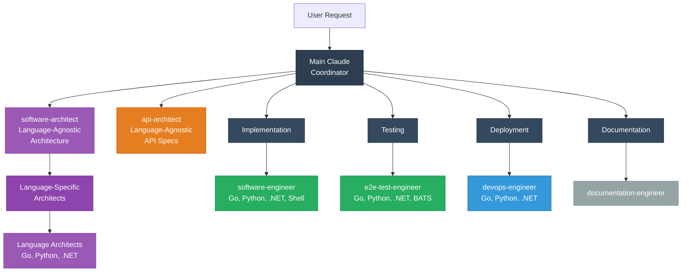
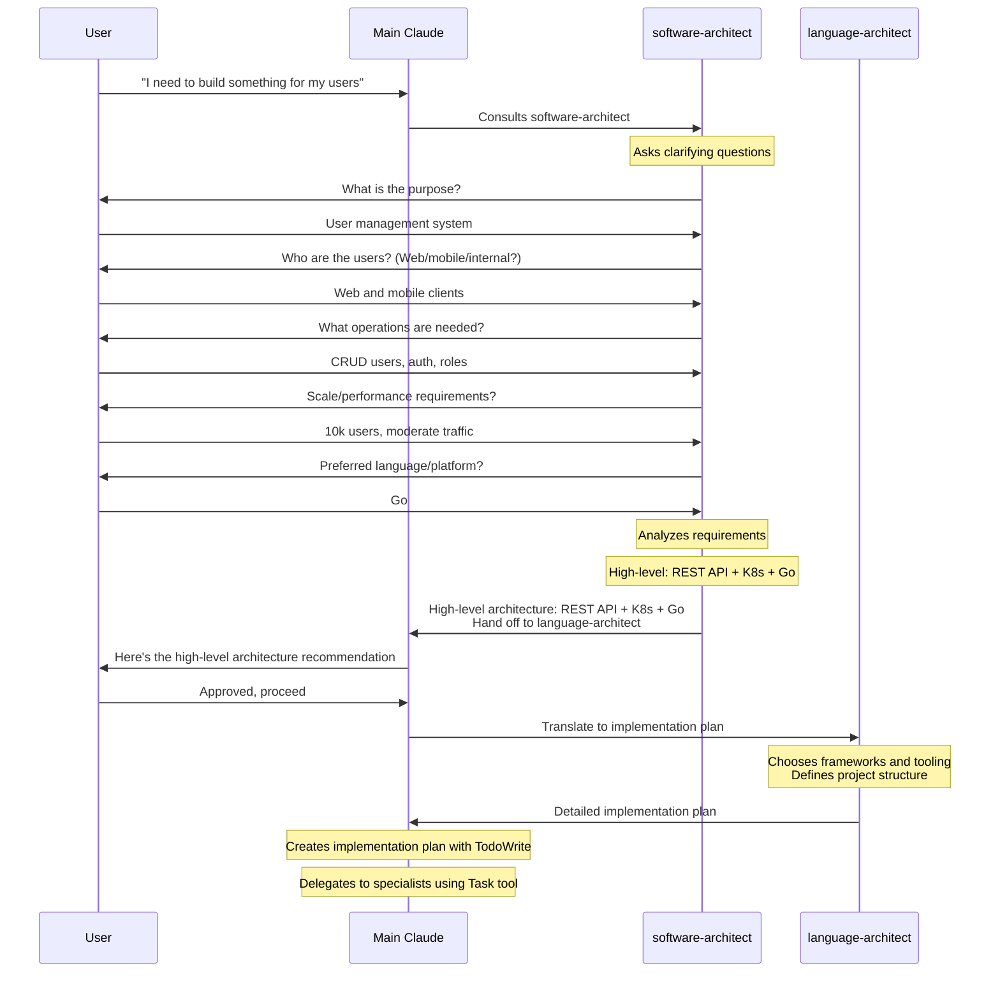
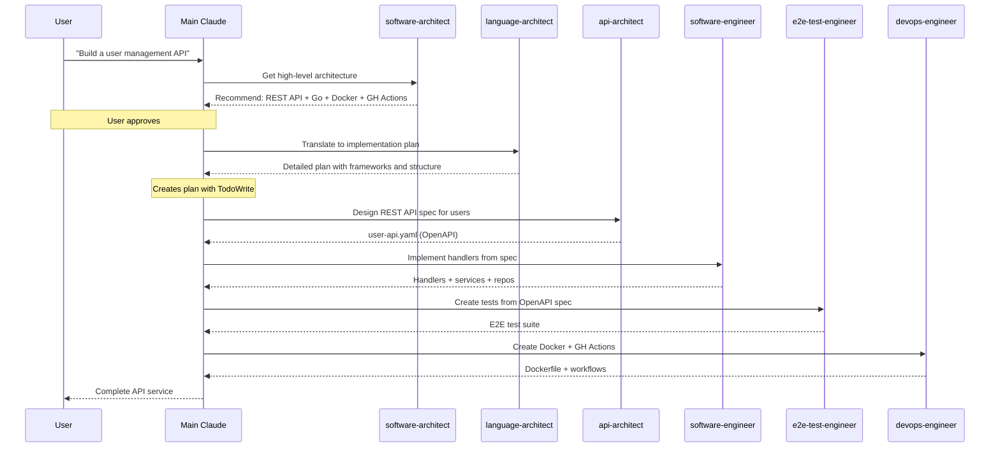
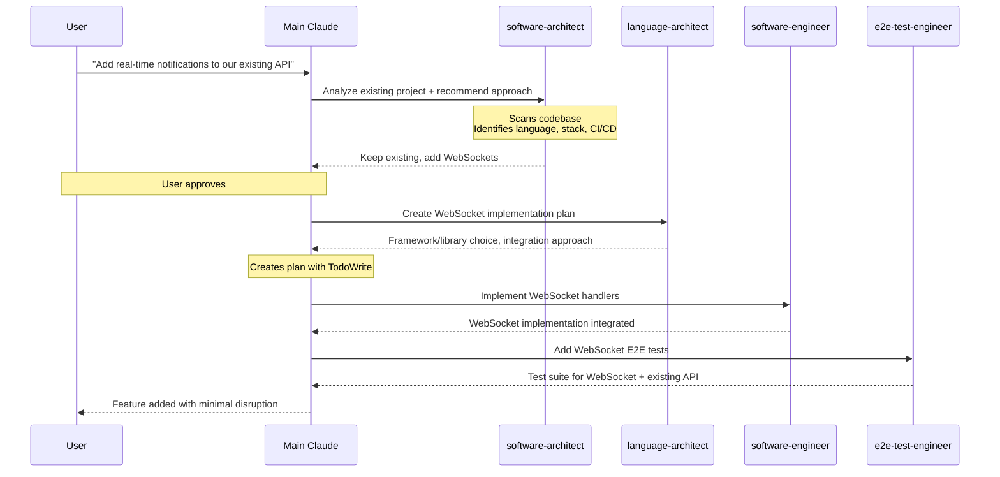
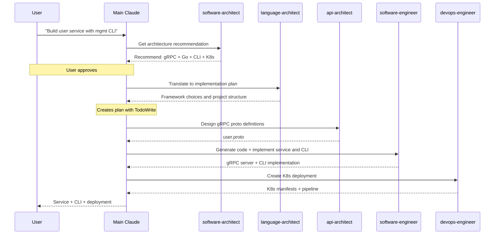
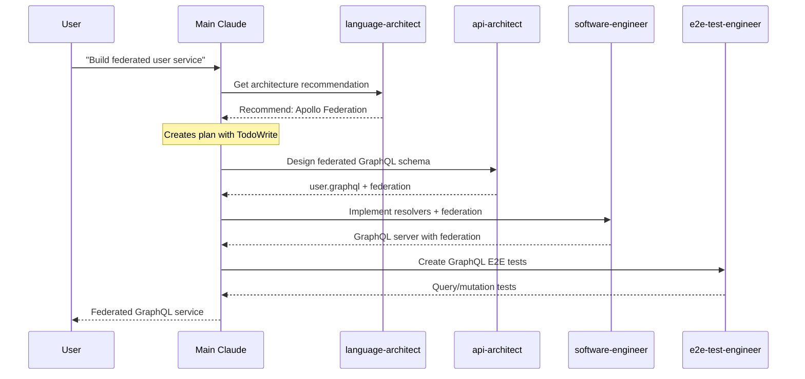
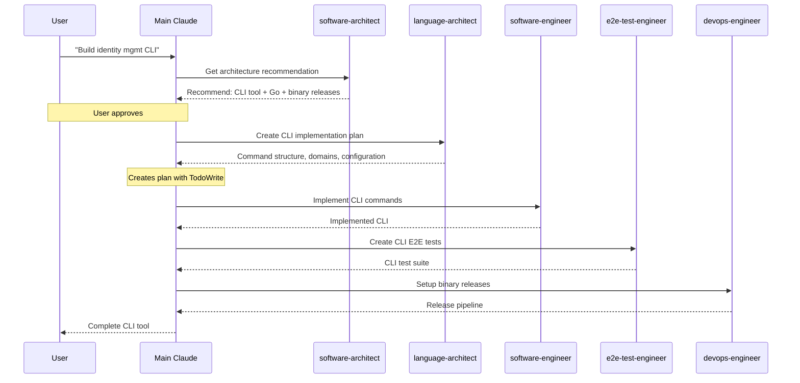
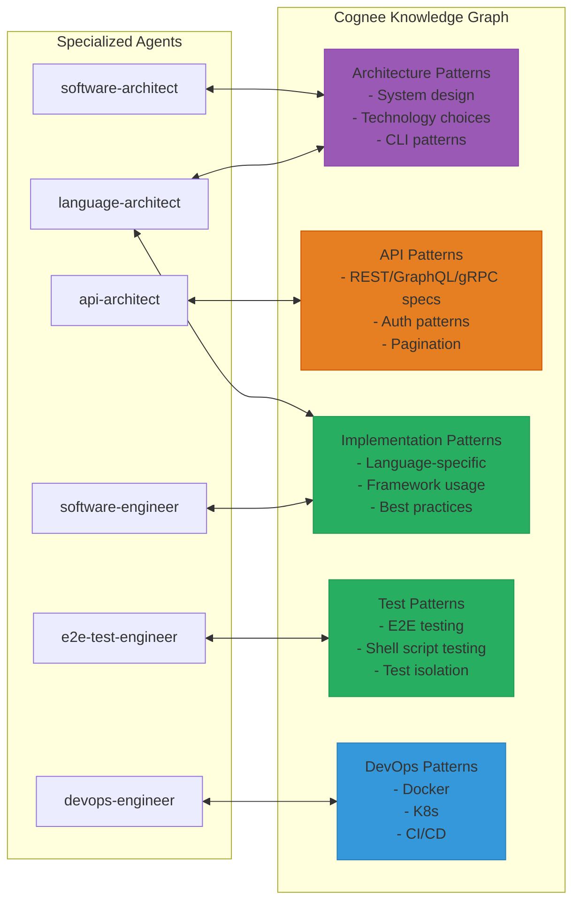
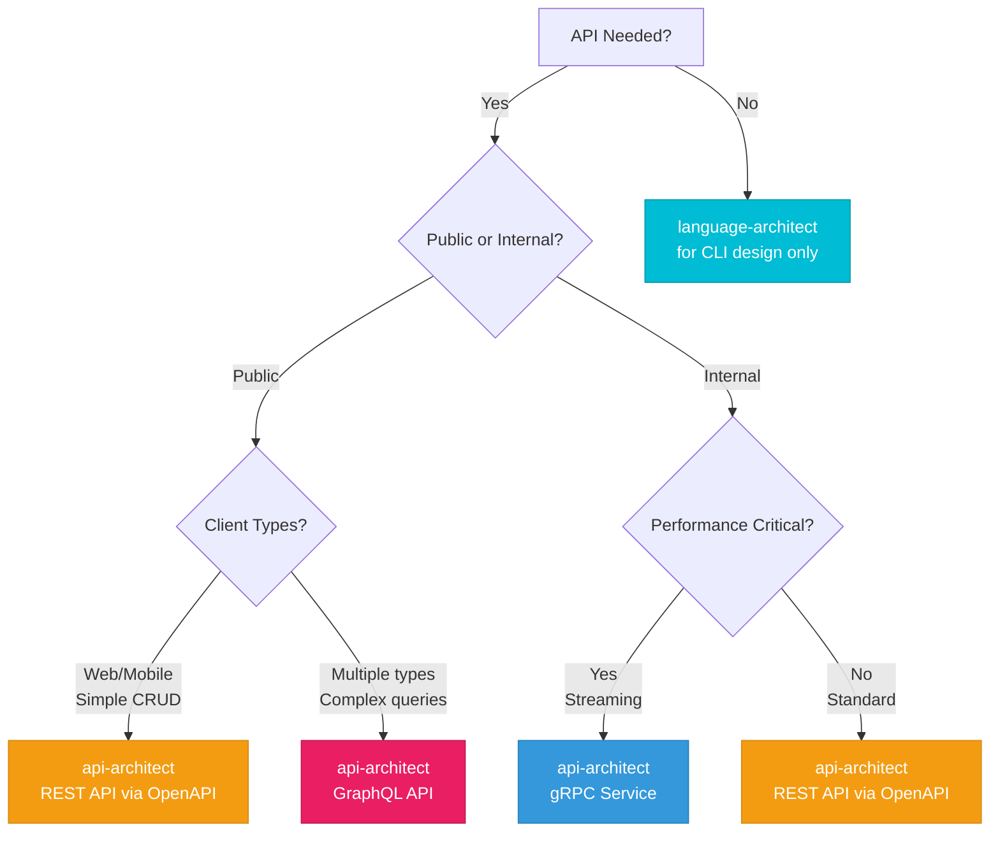
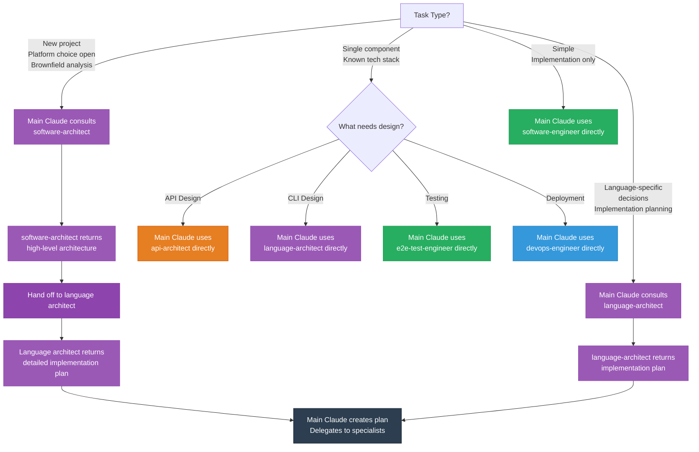

# Subagents for Claude Code

This document describes the specialized development agents and how they work together to deliver complete, production-ready projects across any language or platform.

## Overview

The agent ecosystem is organized with **Main Claude as the coordinator** that consults specialized agents. This architecture provides:

- **Main Claude coordinates**: Creates plans, delegates to specialists, tracks progress
- **Separation of concerns**: Each agent focuses on one specialized domain
- **Context efficiency**: Patterns stored in Cognee, not embedded in agents
- **Composability**: Agents can be used independently or orchestrated together
- **Maintainability**: Updates to one agent don't affect others

## Project Agents vs User Agents

This repository provides **project agents** - specialized development agents that work together as a coordinated ecosystem. You can also create your own **user agents** in `~/.claude/agents/` for personal workflows.

### Key Differences

**Project Agents**:

- Provided by this repository
- Designed to work together as a cohesive system
- Located in `claude-agents/definitions/`
- Include `project_agent: team-agentic-setup` in frontmatter
- Updated when you run `scripts/install-agents.sh`

**User Agents**:

- Created by you for personal workflows
- Stored in `~/.claude/agents/`
- Should NOT include `project_agent` field
- Preserved during project agent updates

### Safe Installation

The installation script (`scripts/install-agents.sh`) uses the `project_agent` metadata field to safely update project agents while preserving your personal agents:

1. **Scans existing agents** - Checks each agent's frontmatter for `project_agent: team-agentic-setup`
2. **Preserves user agents** - Keeps agents without the project marker
3. **Updates project agents** - Replaces only agents that match the project marker
4. **Reports changes** - Shows what was updated vs preserved

**Example output**:

```bash
Scanning existing agents...
  Removing project agent: api-architect.md
  Removing project agent: go-software-engineer.md
  Preserving user agent: my-custom-workflow.md
  Preserving user agent: personal-helper.md
Removed 2 project agent(s), preserved 2 user agent(s)
```

### Creating Personal Agents

You can create personal agents that won't be affected by project updates:

1. **Create agent file** in `~/.claude/agents/my-agent.md`
2. **Add frontmatter** without `project_agent` field:

```yaml
---
name: my-custom-agent
description: My personal workflow assistant
model: inherit
color: cyan
allowed_tools:
---

# My Custom Agent

Your agent instructions here...
```

3. **Run install script** - Your agent will be preserved:

```bash
./scripts/install-agents.sh
# Output: Preserving user agent: my-custom-agent.md
```

### Agent Metadata Structure

Every project agent includes these frontmatter fields:

```yaml
---
name: agent-name                          # Unique identifier
description: Brief description            # What the agent does
model: inherit                            # Use default model
color: orange                             # Visual identification color
project_agent: team-agentic-setup        # Project identifier (required for project agents)
allowed_tools:                            # Tool restrictions (optional)
---
```

**Important**: The `project_agent: team-agentic-setup` field is **required** for all project agents and **should not be used** in user-created agents. This field enables safe installation that preserves your personal agents.

## Agent Hierarchy



## Agent Roles

### Software-architect

**Role**: Language-agnostic architecture consultant (not coordinator)
**Color**: Purple
**Responsibilities**:

- **Gather and clarify requirements** - Ask clarifying questions to understand what needs to be built
- **Analyze existing projects** - Understand current language, infrastructure, CI/CD, tests, constraints
- **Design high-level architecture** - API styles (REST/GraphQL/gRPC), deployment strategies, platform recommendations
- **Explain tradeoffs** - Present options with pros/cons
- **Hand off to language architect** - Once approved, specify which language architect should translate to implementation plan

**When to use**: When you have a **business need or idea** that needs architectural guidance, especially for new projects or when language/platform choice is open.

**Input**: Natural language requirements, user stories, business needs, existing project context
**Output**: High-level architecture recommendations with language architect hand-off
**Next**: Language-specific architect (go-architect, python-architect, etc.) receives approved architecture

### Language Architects (go-architect, python-architect, dotnet-architect, etc.)

**Role**: Language-specific implementation architect (receives hand-offs from software-architect)
**Color**: Purple
**Responsibilities**:

- **Receive high-level architecture** - From software-architect or work directly on language-specific projects
- **Translate to language implementation plan** - Specific frameworks and libraries for the target language
- **Design project structure** - Package/module layout, domain organization
- **Design CLI architectures** - Command structure, configuration patterns, output formats (if applicable)
- **Choose language-specific patterns** - Interface design, dependency injection, testing approaches
- **Specify tooling** - Code generation, linting, build tools
- **Return detailed plan to Main Claude** - Ready for specialist delegation

**When to use**:

- After software-architect approves high-level architecture
- Directly for language-specific technical decisions in existing projects
- For CLI tool design

**Input**: High-level architecture from software-architect OR direct language-specific requirements
**Output**: Detailed implementation plan with frameworks, structure, patterns, CLI design
**Next**: Main Claude creates plan with TodoWrite, delegates to specialists

### API-Architect

**Role**: Language-agnostic API specification designer
**Color**: Orange
**Responsibilities**:

- **Choose appropriate API style** - REST, GraphQL, gRPC, or hybrid
- **Design OpenAPI 3.x specifications** - Complete REST API specs with auth, pagination
- **Design GraphQL schemas** - Queries, mutations, subscriptions, federation
- **Design Protocol Buffer services** - gRPC with unary and streaming RPCs
- **Create language-agnostic specifications** - Ready for any language's code generation

**When to use**: When you need API specifications (REST/GraphQL/gRPC). Designs the contract, language architects choose generators.

**Input**: Requirements from software-architect or go-architect
**Output**: Complete API specification (OpenAPI YAML, GraphQL schema, or .proto files)
**Next**: Language architects choose generators (oapi-codegen, gqlgen, buf), engineers implement

### Software-Engineer (go-software-engineer, python-software-engineer, dotnet-software-engineer, shell-script-engineer, etc.)

**Role**: Language-specific implementation specialist
**Color**: Green
**Responsibilities**:

- Implement business logic and service layers
- Create API handlers/resolvers from specs
- Implement repositories and data access
- Refactor and optimize code
- Design package/module structures
- Write unit and integration tests

**When to use**: After API/CLI specs are designed, for implementation work.

### E@E-Test-Engineer (go-e2e-test-engineer, python-e2e-test-engineer, dotnet-e2e-test-engineer, bats-test-engineer, etc.)

**Role**: End-to-end test specialist
**Color**: Green/Cyan
**Responsibilities**:

- Create black-box E2E tests for APIs and CLIs
- Validate APIs against OpenAPI/GraphQL/gRPC specs
- Test CLI commands from user perspective
- Test all documented behavior
- Validate success and error scenarios
- Test shell scripts with proper isolation (BATS)

**When to use**: After implementation, to validate user-facing behavior of applications and scripts.

### Documentation Layer

#### documentation-engineer

**Role**: Project documentation specialist
**Color**: Gray
**Responsibilities**:

- Create and maintain README files
- Write comprehensive CHANGELOG entries
- Create user guides and tutorials
- Document API endpoints and CLI commands
- Follow documentation best practices
- Ensure documentation consistency

**When to use**: For creating or updating project documentation.

### Deployment Layer

#### devops-engineer (go-devops-engineer, python-devops-engineer, dotnet-devops-engineer)

**Role**: Deployment and CI/CD specialist
**Color**: Blue
**Responsibilities**:

- Create Dockerfiles and multi-stage builds
- Design Kubernetes manifests and Helm charts
- Implement CI/CD pipelines (GitHub Actions, Azure DevOps)
- Configure health checks and monitoring
- Set up staging and production environments

**When to use**: For containerization, orchestration, and CI/CD setup.

## Requirements Gathering Phase

**When you have a business need**, Main Claude consults software-architect for architectural guidance:



**Key Point**: You don't need formal specs or technical documents upfront. Here's how it works:

1. **Main Claude consults software-architect** for high-level architecture recommendations
2. **software-architect asks questions** to understand business needs and constraints
3. **software-architect recommends high-level architecture** (API style, platform, deployment)
4. **User approves** the high-level architecture
5. **Main Claude delegates to language-specific architect** (go-architect, etc.)
6. **Language architect creates detailed implementation plan** (specific frameworks, structure, patterns)
7. **Main Claude creates plan** using TodoWrite
8. **Main Claude delegates** to specialists using Task tool

**Example Starting Points**:

- "I need an API for managing user accounts in my SaaS product"
- "Build a CLI tool for our ops team to manage cloud resources"
- "We need a real-time notification system for our mobile app"
- "Add real-time notifications to our existing Python API"
- NOT: "Implement the UserService as defined in spec-v2.3.pdf" (too specific, skip straight to language engineer)

## Common Workflows

### Workflow 1: New REST API Service (Greenfield)



### Workflow 2: Adding Feature to Existing Project (Brownfield)



### Workflow 3: New gRPC Microservice with CLI (Greenfield)



### Workflow 4: GraphQL API with Federation (Greenfield)



### Workflow 5: CLI Tool Only (Greenfield)



## Cognee Integration

Architecture and specialized agents query the Cognee knowledge graph for patterns before designing:



### Pattern Query Flow

1. **Agent receives task** from coordinator or user
2. **Agent searches Cognee** using `search()` with appropriate search_type
3. **Agent adapts patterns** to specific requirements
4. **Agent delivers artifacts** (specs, code, tests, configs)

### Why Cognee?

- **Context efficiency**: ~80% reduction in agent size
- **Pattern reuse**: Same patterns across multiple agents
- **Maintainability**: Update patterns once, all agents benefit
- **Separation of concerns**: Agents contain logic, not data

## Decision Trees

### Choosing the Right API Style



### Choosing Which Architect to Consult



## Best Practices

### 1. Choose the Right Architect

**For new projects or platform decisions**:

- Consult software-architect for high-level architecture
- software-architect analyzes existing projects (brownfield)
- software-architect hands off to language-specific architect

**For existing language-specific projects**:

- Consult language-architect directly for language-specific decisions
- language-architect translates high-level architecture to implementation plans
- language-architect recommends frameworks and patterns

### 2. Respect Existing Projects

When working with brownfield projects:

- software-architect scans codebase to understand what exists
- Preserve working CI/CD, infrastructure, and patterns
- Incremental improvements over rewrites
- Migration paths for necessary changes

### 3. Main Claude Coordinates Implementation

After architecture recommendations:

- Create implementation plan with TodoWrite
- Delegate to specialists using Task tool
- Track progress through each phase
- Ensure consistency across components

### 4. Use Specialized Agents for Design

Let each specialist design their domain:

- api-architect for all API specifications (OpenAPI/GraphQL/gRPC)
- Language architects for CLI command structures and patterns
- DevOps engineers for deployment

### 5. Generate Code from Specs

Never hand-write API types:

- OpenAPI → `oapi-codegen` (Go), or language-specific generators
- GraphQL → `gqlgen` (Go), or language-specific generators
- gRPC → `buf generate` (multi-language)

### 6. Test Against Specs

Use E2E tests to validate implementation:

- Tests should match API specifications exactly
- Black-box testing from user perspective
- Validate both success and error scenarios

### 7. Sequence Work Properly

Main Claude follows this order:

1. Consult software-architect (new projects/platform decisions) OR language-architect (language-specific)
2. Language-architect creates detailed implementation plan including CLI design if applicable
3. Design API specs (delegate to api-architect if API project)
4. Generate code from specs (language-architect chooses generators)
5. Implement business logic and CLI commands (delegate to software-engineer)
6. Wire handlers/resolvers/commands
7. Write E2E tests (delegate to e2e-test-engineer)
8. Create deployment artifacts (delegate to devops-engineer)

## Example: Complete Project Flow

Here's how to build a complete SaaS API project using the agent ecosystem:

```bash
# 1. User starts with a business need (no technical spec required)
User: "I need to build a SaaS application for managing teams and projects."

# 2. Main Claude consults software-architect
Main Claude: [Uses Task tool with software-architect]

# 3. software-architect asks clarifying questions
software-architect: "Let me understand your requirements:
  - Who are the users? (web, mobile, internal systems?)
  - What operations do you need? (CRUD, real-time updates?)
  - How many users/what scale?
  - Deployment preferences?"

User: "Web and mobile clients. Users and organizations with role-based access.
       Real-time notifications when projects update. Start with 1000 orgs,
       plan to scale. Deploy to Kubernetes on AWS."

# 4. software-architect returns recommendations and hands off
software-architect: "Architecture Recommendation:
  - GraphQL API (multiple clients, real-time subscriptions)
  - gRPC for internal microservices (high performance)
  - Ops CLI for management
  - Kubernetes deployment (K8s + Helm)
  - GitHub Actions CI/CD
  - Go as implementation language

  Next: Hand off to language-architect (go-architect) for detailed implementation plan"

# 5. Main Claude delegates to language-architect
Main Claude: [Uses Task tool with go-architect]

# 6. language-architect returns detailed plan
language-architect: "Implementation Plan:
  - gqlgen for GraphQL, buf for gRPC, Cobra for CLI
  - Project structure: cmd/, internal/, api/
  - Domain-based organization

  Next Steps for Main Claude:
  1. Delegate to api-architect for GraphQL schema and gRPC proto definitions
  2. Delegate to software-engineer for implementation (GraphQL, gRPC, CLI)
  3. Delegate to e2e-test-engineer for testing
  4. Delegate to devops-engineer for deployment"

# 7. Main Claude presents plan to user
User: "Looks good, proceed."

# 8. Main Claude creates implementation plan
Main Claude: [Uses TodoWrite to create phased plan]

# 9. Main Claude delegates to specialists (using Task tool)
# Phase 1: API Design
# → api-architect designs GraphQL schema and gRPC definitions
# Phase 2: Implementation
# → software-engineer implements GraphQL, gRPC, and CLI
# Phase 3: Testing
# → e2e-test-engineer creates test suite
# Phase 4: Deployment
# → devops-engineer creates K8s + CI/CD

# Result: Complete production-ready SaaS API
#   - User provided business needs in natural language
#   - software-architect created high-level architecture
#   - language-architect translated to detailed implementation plan
#   - Main Claude coordinated implementation
#   - Specialists designed and implemented each piece
#   - All components work together as a cohesive system
```

## Agent Color Coding

For quick visual identification in Claude Code:

- **Purple** - software-architect (language-agnostic), language-architect (language-specific implementation)
- **Orange** - api-architect (REST/GraphQL/gRPC specifications)
- **Green** - software-engineer (implementation for all languages), e2e-test-engineer (testing)
- **Blue** - devops-engineer (deployment and CI/CD)
- **Gray** - documentation-engineer (documentation)

## Summary

The agent ecosystem provides:

- **Main Claude coordinates** - Creates plans with TodoWrite, delegates with Task tool, tracks progress
- **software-architect consults** - Translates business needs to high-level architecture recommendations
- **language-architect plans** - Translates high-level architecture to detailed implementation plans
- **No formal specs required** - Start with natural language, architects ask clarifying questions
- **Multi-language support** - Same workflow for Go, Python, .NET, and shell scripts
- **Separation of concerns** - Each agent has one focused responsibility
- **Context efficiency** - Patterns in Cognee, not embedded in agents
- **Composability** - Use agents independently or orchestrated together
- **Maintainability** - Update one agent without affecting others
- **Scalability** - Add new languages without redesigning

**Getting Started**:

- **Complex projects**: Main Claude consults software-architect for high-level architecture, then language-architect for implementation plan, then coordinates specialists
- **Language-specific projects**: Main Claude consults language-architect directly, then coordinates specialists
- **Single component**: Main Claude delegates directly to specialist (api-architect, software-engineer, etc.)
- **Simple tasks**: Main Claude uses software-engineer directly for implementation
- **Don't have architecture?** Main Claude consults software-architect (language-agnostic) or language-architect (language-specific) to create it through conversation
