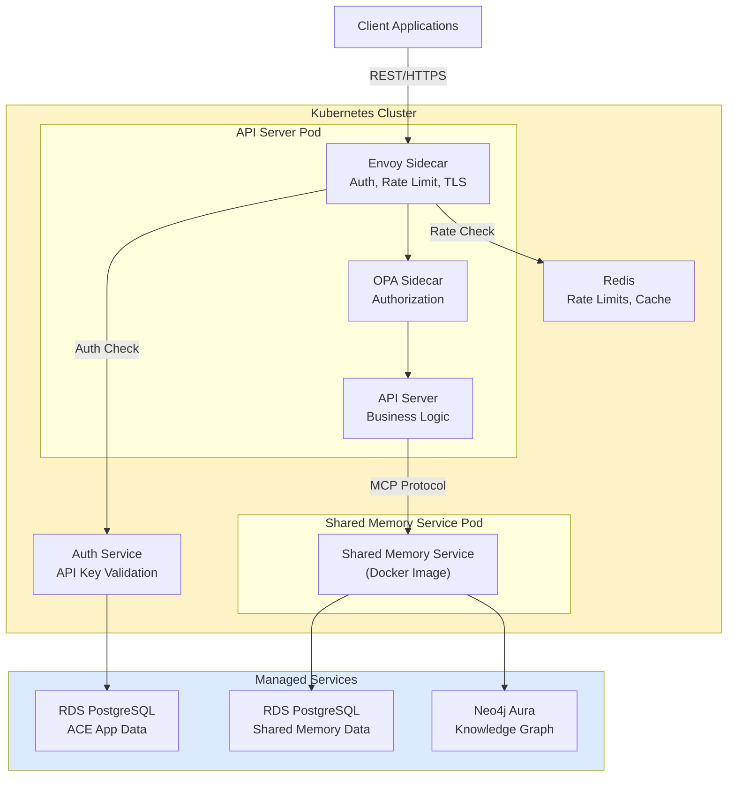

# ACE Architecture - The Big Picture

**Project:** ACE (Agentic Coding Engine)
**Version:** 1.0
**Last Updated:** December 22, 2025

## Table of Contents

- [What We're Building](#what-were-building)
- [Core Goals](#core-goals)
- [Design Philosophy](#design-philosophy)
- [High-Level Architecture](#high-level-architecture)
- [Key Architectural Decisions](#key-architectural-decisions)
- [What This Gets Us](#what-this-gets-us)
- [Document Structure](#document-structure)
- [Reading Guide](#reading-guide)
- [What's Next](#whats-next)
- [System Characteristics at a Glance](#system-characteristics-at-a-glance)

## What We're Building

[↑ Table of Contents](#table-of-contents)

ACE is a system for deterministic agent routing with dynamic pattern querying. It replaces LLM-based routing interpretation with code-based routing logic.

### The Problem We're Solving

Claude Code uses LLM interpretation for routing decisions, which results in:

- Non-deterministic routing (same prompt may route differently each time)
- No guaranteed workflow execution order
- Unpredictable behavior that prevents reliable automation

ACE addresses this with code-based routing (deterministic) and on-demand pattern querying. See [Requirements](01-requirements.md#2-context-efficiency) for the context reduction details.

## Core Goals

[↑ Table of Contents](#table-of-contents)

- **Deterministic routing** - Same input always routes to the same agent
- **Context efficiency** - Query patterns dynamically instead of pre-loading
- **Team collaboration** - Share patterns across teams via git
- **Independent scaling** - Scale components based on their workload

## Design Philosophy

[↑ Table of Contents](#table-of-contents)

We're following some key principles here:

### 1. Infrastructure vs Application Code

The infrastructure layer (Envoy, OPA) handles auth, rate limiting, and security. Our application code focuses purely on orchestration logic. No auth code in the app = cleaner, safer, easier to test.

### 2. REST for External, gRPC for Internal

External API uses REST because developers love it - easy debugging, familiar tools, works everywhere. Internal services use gRPC because performance matters when you're making lots of service-to-service calls.

### 3. Managed Infrastructure

We're using managed databases (RDS, Neo4j Aura) instead of running our own. The team should focus on building features, not babysitting PostgreSQL replicas.

### 4. Independent Scalability

The shared memory service (pattern search) is memory-heavy. The API server is CPU-bound. They scale differently, so we're deploying them as separate services from the start.

### 5. Service Mesh Patterns

Using Envoy sidecars for infrastructure concerns. We can adopt full Istio later if we need it, but starting simple with manual sidecar configs.

## High-Level Architecture

[↑ Table of Contents](#table-of-contents)

## Key Architectural Decisions

[↑ Table of Contents](#table-of-contents)

Here's what we decided and why:

| Decision                   | Rationale                                | Where to Read More                                             |
| -------------------------- | ---------------------------------------- | -------------------------------------------------------------- |
| REST for external API      | Developer experience, tooling, debugging | [04-communication-patterns.md](04-communication-patterns.md)   |
| gRPC for internal comms    | Performance, type safety, streaming      | [04-communication-patterns.md](04-communication-patterns.md)   |
| Shared memory as separate service | Independent scaling, resource isolation  | [03-system-architecture.md](03-system-architecture.md)         |
| Managed databases          | No ops overhead, built-in HA             | [05-data-architecture.md](05-data-architecture.md)             |
| Envoy + OPA sidecars       | Externalize infrastructure concerns      | [06-security-architecture.md](06-security-architecture.md)     |
| Service mesh patterns      | Uniform observability, zero-trust        | [08-deployment-architecture.md](08-deployment-architecture.md) |

## What This Gets Us

[↑ Table of Contents](#table-of-contents)

### For Development

**Parallel Work Streams**  
Clear service boundaries mean teams can work independently. Well-defined contracts (protobuf) let you mock dependencies. Nobody's blocked waiting for someone else.

**Better Testing**  
Business logic is testable without spinning up infrastructure. Infrastructure is testable without touching application code. Contract testing at service boundaries keeps everything honest.

### For Operations

**Independent Deployment**
Update auth policies without redeploying the app. Scale the shared memory service independently. Run database migrations without blocking releases. Canary deploy per service.

**Great Observability**  
Uniform telemetry across services via OpenTelemetry. Request tracing across boundaries. Centralized logging and metrics. Clear failure domains.

**Security by Default**  
Zero-trust architecture - nothing is implicitly trusted. Centralized auth/authz policies. Defense in depth. Built-in audit trail.

### For Product

**Feature Velocity**  
Add new agents without infrastructure changes. Update patterns without deployment. New rate limit tier? Config change. Fast experimentation.

**Reliability**  
Deterministic routing = predictable behavior. Automatic retries at infrastructure layer. Circuit breakers prevent cascading failures. Graceful degradation when things break.

**Cost Management**
Dynamic pattern querying dramatically reduces token usage. Independent scaling prevents over-provisioning. Managed services reduce ops overhead. Usage tracking for cost allocation. See [Cost Efficiency](#cost-efficiency) below for specific numbers.

## Document Structure

[↑ Table of Contents](#table-of-contents)

The architecture is documented across 10 focused docs:

1. **[Requirements](01-requirements.md)** - What we're solving and why
2. **[Architectural Decisions](02-architectural-decisions.md)** - Major decisions with justification (ADR format)
3. **[System Architecture](03-system-architecture.md)** - How components fit together
4. **[Communication Patterns](04-communication-patterns.md)** - Why REST external, gRPC internal
5. **[Data Architecture](05-data-architecture.md)** - Database strategy and why managed services
6. **[Security Architecture](06-security-architecture.md)** - Auth, authz, zero-trust approach
7. **[Observability Architecture](07-observability-architecture.md)** - Monitoring, logging, tracing
8. **[Deployment Architecture](08-deployment-architecture.md)** - Kubernetes, service mesh, GitOps
9. **[Scalability](09-scalability.md)** - How we scale and when
10. **[Trade-offs](10-trade-offs.md)** - Alternatives we considered and why we chose what we did

## Reading Guide

[↑ Table of Contents](#table-of-contents)

**If you're implementing this:**

1. Start with Requirements (01)
2. Read System Architecture (03)
3. Check Communication Patterns (04)
4. Review deployment strategy (08)

**If you're doing security review:**

1. Security Architecture (06)
2. Data Architecture (05)
3. Observability (07)

**If you're a stakeholder wanting the overview:**

1. This document (00)
2. Requirements (01)
3. Trade-offs (10)

**If you're planning operations:**

1. Deployment Architecture (08)
2. Scalability (09)
3. Observability Architecture (07)

## What's Next

[↑ Table of Contents](#table-of-contents)

After architecture approval, we'll:

1. **Phase 1:** Define contracts (protobuf, API schemas, DB schemas)
2. **Phase 2:** Implement core services (parallel development streams)
3. **Phase 3:** Add infrastructure services (sidecars, observability)
4. **Phase 4:** Integration and production readiness

See [Architectural Decisions](02-architectural-decisions.md) for the phased implementation approach and how teams can work in parallel.

## System Characteristics at a Glance

[↑ Table of Contents](#table-of-contents)

These are the key targets. For detailed analysis and scaling stages, see [Scalability](09-scalability.md).

### Performance Targets

- API response time: < 100ms (excluding agent execution)
- Agent execution: 10-30 seconds (Claude API bound)
- Pattern query: < 500ms
- Throughput: 100+ requests/second per API instance

### Availability Targets

- Uptime: 99.9% (3 nines)
- Recovery time: < 5 minutes
- Data durability: 99.999999999% (managed DB SLA)

### Cost Efficiency

- Token usage: ~75KB context (vs ~758KB pre-loading) - 78% reduction
- Cost per execution: ~$0.13 (Sonnet 4)
- Infrastructure: $500-2000/month depending on scale

See [Requirements](01-requirements.md#2-context-efficiency) for cost analysis details.

That's the big picture. Dive into individual docs for the details on specific areas.

Next: [Requirements](01-requirements.md)

---

Copyright © 2025 Jeremy K. Johnson. All rights reserved.
