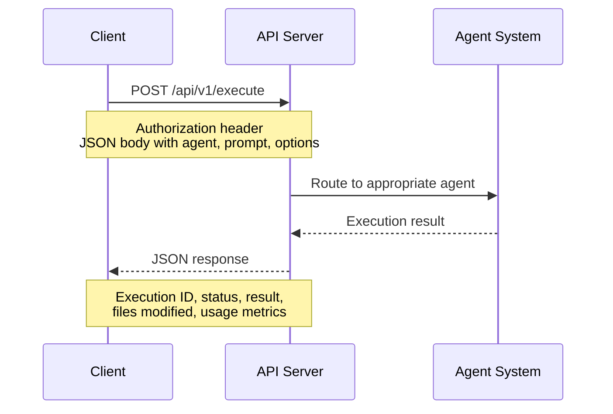
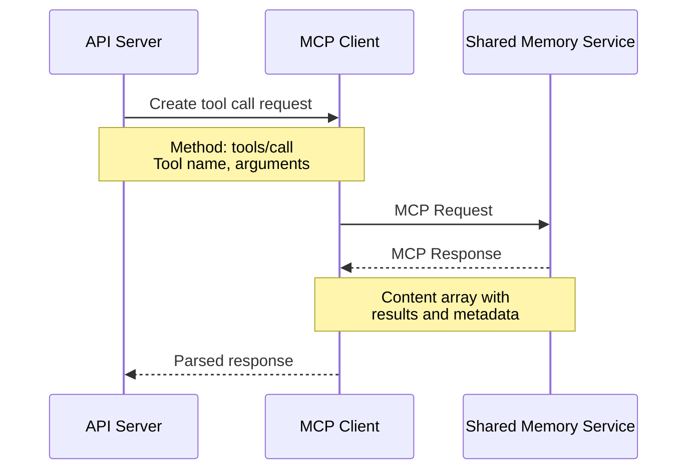
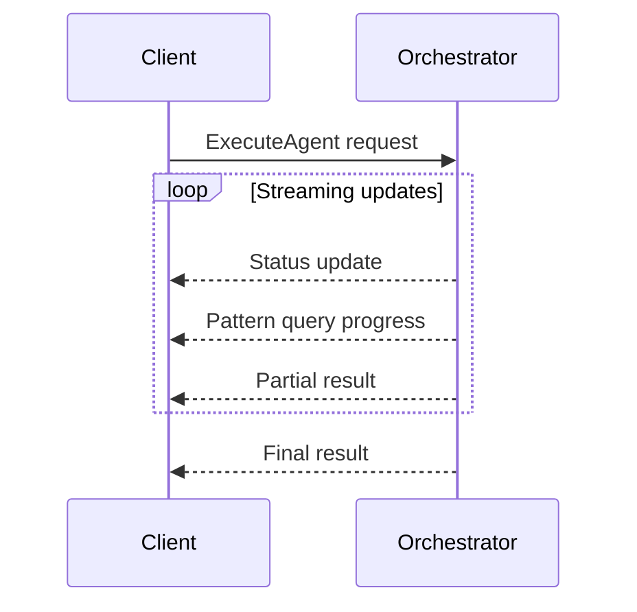
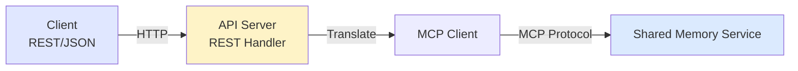
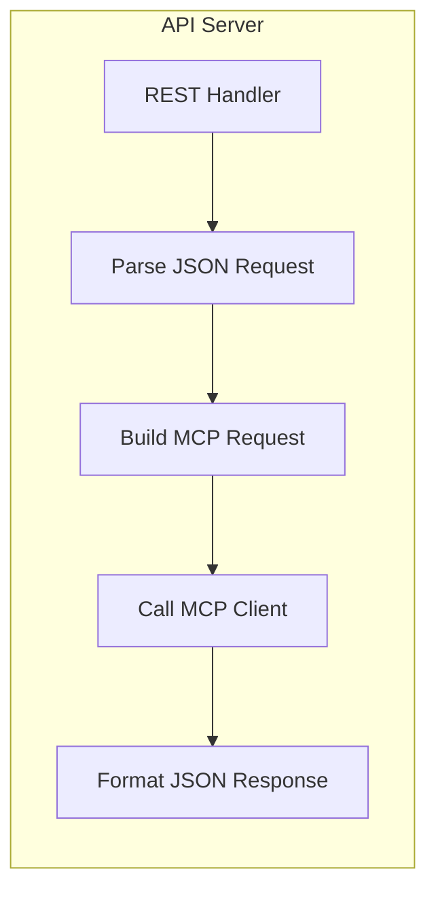
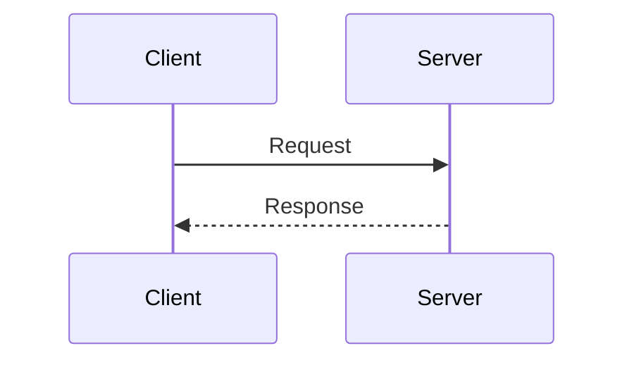
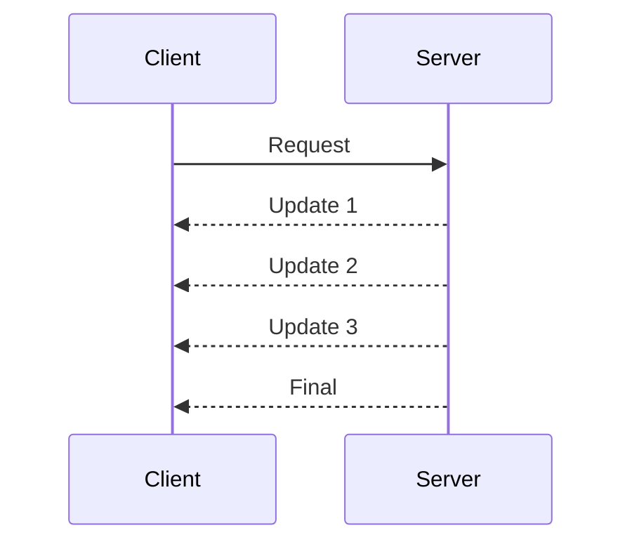
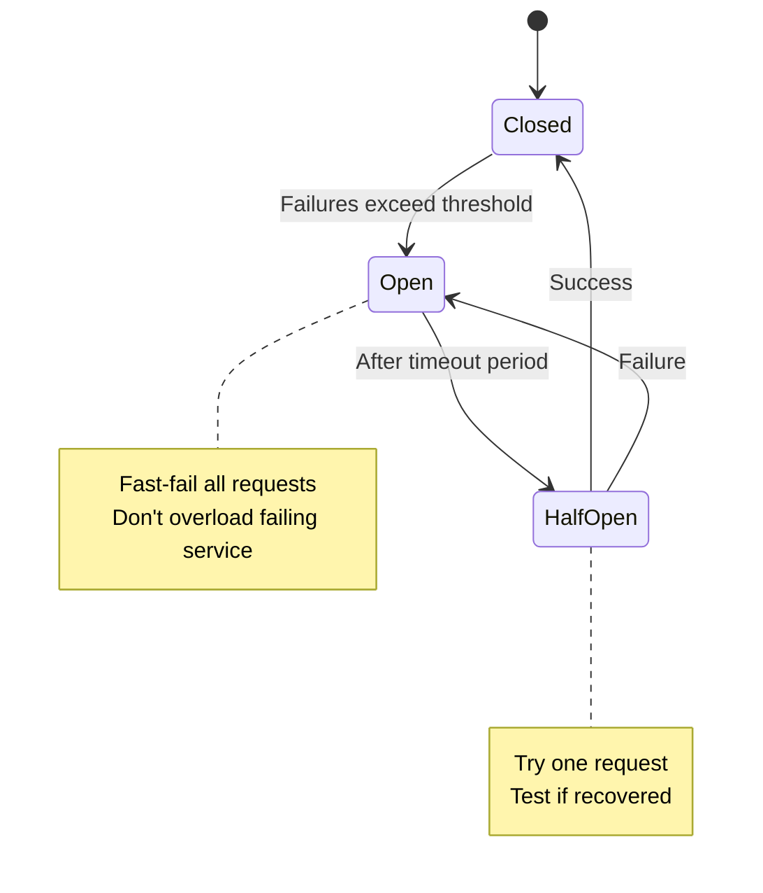
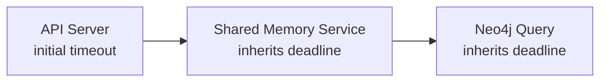

# Communication Patterns and Protocols

**Document:** Communication Patterns
**Version:** 1.0
**Last Updated:** December 22, 2025

Let's talk about how services talk to each other. We're using two different protocols for two different use cases, and that's intentional.

## Table of Contents

- [The Protocol Split](#the-protocol-split)
- [REST for External API](#rest-for-external-api)
- [gRPC for Internal Services](#grpc-for-internal-services)
- [Protocol Translation](#protocol-translation)
- [Communication Patterns](#communication-patterns)
- [Timeouts and Deadlines](#timeouts-and-deadlines)
- [Authentication in Communication](#authentication-in-communication)
- [Performance Optimization](#performance-optimization)
- [Error Handling Strategy](#error-handling-strategy)
- [Key Takeaways](#key-takeaways)

## The Protocol Split

[↑ Table of Contents](#table-of-contents)

We're using different protocols for external vs internal communication:

**External API:** REST/HTTP + JSON
**Internal Services:** gRPC + Protobuf (custom services), MCP (shared memory service)

The shared memory service uses the Model Context Protocol (MCP) - a standardized protocol for LLM tool integration. Other internal services use gRPC for performance and type safety.

Why the split? Because external and internal have totally different requirements.

## REST for External API

[↑ Table of Contents](#table-of-contents)

The external API is what developers interact with - it's REST/HTTP + JSON for the best developer experience. For the rationale behind choosing REST for external APIs and gRPC for internal services, see [ADR-002](02-architectural-decisions.md#adr-002-rest-external-grpc-internal).

### API Structure

The REST API follows standard conventions for agent execution:



Requests include the target agent, prompt, and execution options. Responses provide execution status, results, any files modified, and usage metrics for billing.

*For implementation details including request/response schemas, see TBD.*

### Error Handling

We use standard HTTP status codes:

- **200 OK** - Success
- **400 Bad Request** - Invalid input
- **401 Unauthorized** - Missing/invalid API key
- **403 Forbidden** - Plan doesn't allow this agent
- **404 Not Found** - Agent doesn't exist
- **429 Too Many Requests** - Rate limit exceeded
- **500 Internal Server Error** - Something broke on our end
- **503 Service Unavailable** - Dependency down

Error responses include structured information to help clients understand and recover from failures:

- **Error code** - Machine-readable identifier for programmatic handling
- **Message** - Human-readable explanation of what went wrong
- **Context** - Additional details relevant to the error type (rate limits include usage and reset time, validation errors include field-level details)

*For implementation details including error response schemas, see TBD.*

## gRPC for Internal Services

[↑ Table of Contents](#table-of-contents)

Internal service-to-service calls use gRPC for performance and type safety (binary protocol, streaming support, compile-time type checking). For the full rationale, see [ADR-002](02-architectural-decisions.md#adr-002-rest-external-grpc-internal).

### gRPC Service Definitions

Internal gRPC services define strongly-typed RPC methods for service-to-service communication. Services like the Orchestrator expose methods for routing agent requests and retrieving agent definitions.

The key benefit is compile-time type safety - both client and server share the same interface contract, catching integration errors before runtime. The shared memory service uses MCP protocol directly rather than gRPC.

*For implementation details including service definitions, see TBD.*

### Message Flow

**MCP Protocol (for Shared Memory Service):**

The API server communicates with the shared memory service using the Model Context Protocol (MCP), a standardized protocol for LLM tool integration:



MCP provides a standard request/response format for invoking tools and receiving structured results.

**gRPC (for other internal services):**

Other internal services communicate via gRPC for routing, orchestration, and coordination tasks.

### Streaming for Long Operations

For long-running operations like agent executions, gRPC server streaming provides real-time progress updates:



The streaming response can include different update types: status changes, pattern query progress, partial results, and the final result. Clients receive updates as they happen without polling.

*For implementation details including message definitions, see TBD.*

## Protocol Translation

[↑ Table of Contents](#table-of-contents)

We need to translate between REST and MCP at service boundaries:



**Translation process:**



The API server handles protocol translation in three steps:

1. **Inbound** - Parse the REST/JSON request from the client
2. **Translate** - Build the equivalent MCP tool call request with appropriate method and arguments
3. **Outbound** - Format the MCP response back to REST/JSON for the client

Translation happens at the boundary, keeping protocol concerns isolated from business logic.

*For implementation details, see TBD.*

## Communication Patterns

[↑ Table of Contents](#table-of-contents)

Different communication patterns for different needs:

### Request-Response (Synchronous)

Most API calls use simple request-response:



Good for: Quick operations, simple queries, most CRUD operations

### Server Streaming (Async Updates)

For long operations, stream updates:



Good for: Agent executions, long-running queries, progress updates

### Fire-and-Forget (Async)

For operations that don't need a response:


Good for: Usage tracking, analytics, logging

No timeout - if it fails, we retry from queue

### Circuit Breaker Pattern

Prevent cascading failures:



The circuit breaker is configured with:

- **Failure threshold** - Error rate percentage that triggers the breaker to open
- **Timeout period** - How long to wait before attempting recovery
- **Test requests** - Number of requests to allow through in half-open state

*For implementation details including specific threshold values, see TBD.*

## Timeouts and Deadlines

[↑ Table of Contents](#table-of-contents)

Everything has a timeout. Never wait forever.

### Timeout Strategy

Timeouts are configured based on operation characteristics:

| Operation Type | Timeout Strategy |
|---------------|------------------|
| Health checks | Very short - fail fast to detect problems |
| Auth checks | Short - security decisions need quick resolution |
| Pattern queries | Medium - balance between thoroughness and responsiveness |
| Agent executions | Longer - complex operations need time to complete |

External API timeouts are generally longer than internal timeouts since they encompass the full request lifecycle including multiple internal service calls.

*For implementation details including specific timeout values, see TBD.*

### Deadline Propagation

gRPC propagates deadlines automatically across service boundaries:



As time elapses at each service, downstream services inherit the remaining deadline. This prevents wasted work on requests that have already exceeded their time budget at the original caller.

## Authentication in Communication

[↑ Table of Contents](#table-of-contents)

Different authentication for different contexts:

### External API (Client -> API)

**API Key in Header:**

```http
Authorization: Bearer sk-ace-abc123...
```

Or:

```http
X-API-Key: sk-ace-abc123...
```

### Internal Services (Service -> Service)

**Mutual TLS (mTLS):**

- Both sides present certificates
- Verify peer identity
- Encrypted channel
- Service mesh integration

## Performance Optimization

[↑ Table of Contents](#table-of-contents)

### Connection Pooling

**HTTP Keep-Alive:**

- Reuse TCP connections
- Reduce handshake overhead
- Pool size: 100 connections per host

**gRPC Long-Lived Connections:**

- Single connection per service
- HTTP/2 multiplexing
- Connection pool size: 10 per target

### Compression

**REST API:**

- gzip compression for responses > 1KB
- Accept-Encoding: gzip
- Reduces bandwidth by ~70%

**gRPC:**

- Built-in compression (configurable)
- Per-message compression
- Automatic for large messages

### Caching

**HTTP Headers:**

```http
Cache-Control: public, max-age=300
ETag: "abc123"
```

**Application-Level:**

- User context: 5 minutes
- Pattern results: Session duration
- Agent definitions: 1 hour

## Error Handling Strategy

[↑ Table of Contents](#table-of-contents)

### Retries

**Idempotent operations** - Safe to retry:

- GET requests
- Pattern queries
- Health checks

**Non-idempotent operations** - Don't auto-retry:

- Agent executions (might charge twice)
- Usage tracking (would double-count)

**Retry Strategy:**

Retries use exponential backoff with jitter to avoid thundering herd problems:

1. Start with a short initial delay
2. Double the delay on each subsequent retry (up to a maximum)
3. Add random jitter to spread out retry attempts
4. Cap the total number of attempts to prevent indefinite retrying

*For implementation details including specific retry values, see TBD.*

### Fallbacks

When the shared memory service is down:

1. Return cached patterns (if available)
2. Execute agent without patterns
3. Fail fast with helpful error

When Auth service is down:

1. Check Envoy's short-term cache
2. Reject request if no cache hit
3. Don't allow unauthenticated access

## Key Takeaways

[↑ Table of Contents](#table-of-contents)

- **REST externally** - Developer experience matters most
- **gRPC for custom internal services** - Performance and type safety win
- **MCP for shared memory service** - Standard protocol for LLM tool integration
- **Right protocol for context** - Different needs, different tools
- **Timeouts everywhere** - Never wait forever
- **Circuit breakers** - Fail fast, prevent cascades
- **Authentication layers** - API keys external, mTLS internal

Next: [Data Architecture](05-data-architecture.md)

---

Copyright © 2025 Jeremy K. Johnson. All rights reserved.
