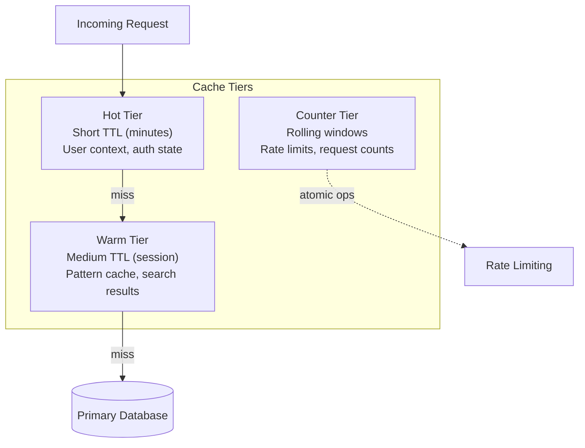
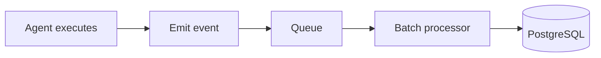
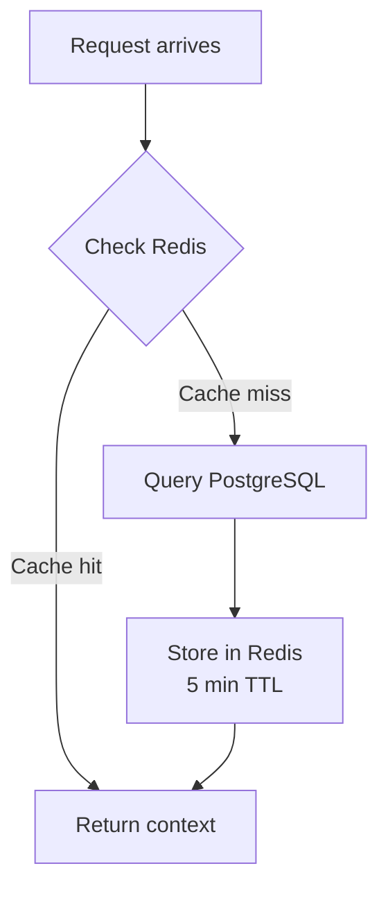
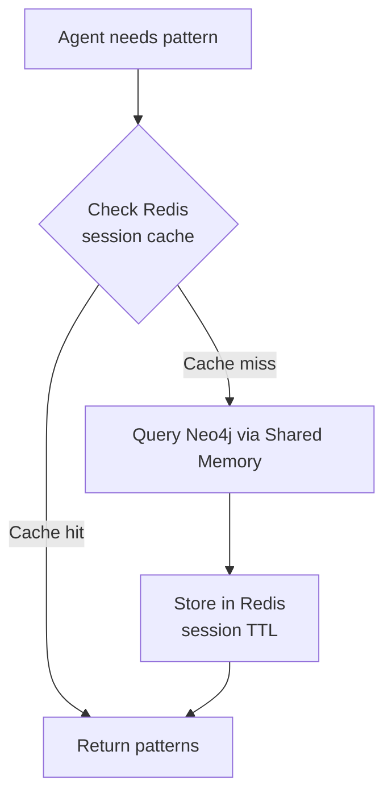
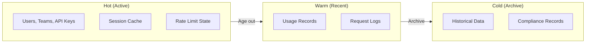
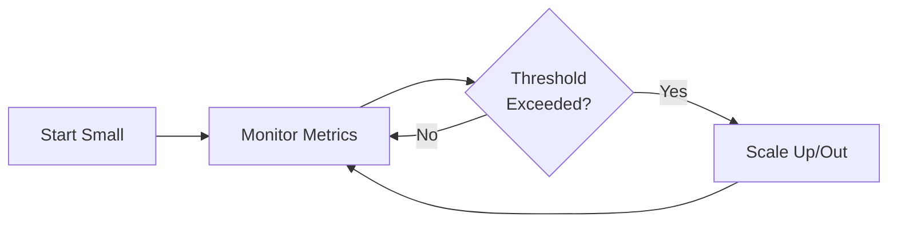

# Data Architecture

**Document:** Data Architecture
**Version:** 1.0
**Last Updated:** December 22, 2025

We're using three different data stores, each optimized for what it's good at. All are managed services - for the rationale behind this decision, see [ADR-004](02-architectural-decisions.md#adr-004). For scaling strategies, see [Scalability](09-scalability.md).

## Table of Contents

- [The Three Data Stores](#the-three-data-stores)
- [PostgreSQL: Relational Data](#postgresql-relational-data)
- [Redis: Cache and State](#redis-cache-and-state)
- [Data Flow Patterns](#data-flow-patterns)
- [Data Consistency](#data-consistency)
- [Backup and Recovery](#backup-and-recovery)
- [Data Retention](#data-retention)
- [Cost Optimization](#cost-optimization)
- [Key Takeaways](#key-takeaways)

## The Three Data Stores

[↑ Table of Contents](#table-of-contents)

**PostgreSQL + pgvector (RDS)** - Relational data and vectors
**Neo4j (Aura)** - Hosts the shared memory service's knowledge graph (_ACE does not directly use Neo4j; the shared memory service does_)
**Redis (ElastiCache)** - Cache and transient state

Why three? Because trying to make one database do everything means it does nothing well. Note that ACE only directly uses PostgreSQL and Redis. Neo4j is provisioned and managed for the shared memory service's use - ACE interacts with the shared memory service via MCP protocol, not with Neo4j directly.

## PostgreSQL: Relational Data

[↑ Table of Contents](#table-of-contents)

We're using managed RDS PostgreSQL for structured data. Here's what lives there:

**User & Team Management:**

- User accounts and profiles
- Team memberships
- API keys (hashed)
- Subscription plans

**Usage Tracking:**

- Execution records
- Token consumption
- Cost tracking
- Billing events

**Pattern Metadata:**

- Pattern descriptions
- Tags and categories
- Usage statistics

### Why PostgreSQL?

PostgreSQL gives us ACID transactions (user + API key creation in one atomic operation), mature tooling (pgAdmin, DataGrip), the pgvector extension for future vector search, and query flexibility for complex reports. For why we chose managed RDS over self-hosted, see [ADR-004](02-architectural-decisions.md#adr-004-managed-databases).

For detailed schema definitions, see TBD (Data Schema Design).

## Redis: Cache and State

[↑ Table of Contents](#table-of-contents)

Redis is our speed layer. Anything that needs to be fast lives here.

### Why Redis?

Redis gives us sub-millisecond reads (perfect for hot data), rich data structures (hashes, sets, sorted sets, streams), built-in TTL expiration, and atomic operations (essential for rate limiting). We use managed ElastiCache - see [ADR-004](02-architectural-decisions.md#adr-004-managed-databases) for why.

### What We Cache

Redis serves as a multi-tier cache with different TTL strategies based on data volatility and access patterns:

**User Context** - Cached for minutes. Contains user identity, team membership, and authorization context. Short TTL ensures permission changes propagate quickly.

**Rate Limit State** - Token bucket counters with rolling windows. Uses atomic operations to ensure accurate limiting under concurrent requests.

**Pattern Cache** - Session-scoped caching. Patterns retrieved from the shared memory service are cached for the duration of a user session to minimize repeated queries.

**Request Counters** - Daily rolling counters for analytics and monitoring. Automatically expire to prevent unbounded growth.

For implementation details including key naming conventions and TTL values, see TBD.

### Data Structures Used

**Hashes** - For objects with multiple fields (user context, rate limits)

**Strings** - For simple counters and flags

**Sets** - For team member lists, active sessions

**Sorted Sets** - For leaderboards, time-based indexes

## Data Flow Patterns

[↑ Table of Contents](#table-of-contents)

### Write Path: Usage Tracking

Asynchronous with batching:

We batch writes to PostgreSQL (every 10 seconds or 100 records). Better throughput, fewer transactions.

### Read Path: Authorization

Cache-first with fallback:

Subsequent requests for the same user hit Redis. Fast.

### Read Path: Pattern Search

Similar cache-first approach:

## Data Consistency

[↑ Table of Contents](#table-of-contents)

### Eventual Consistency

**Usage tracking** - It's okay if usage records are a few seconds behind. We batch writes for performance.

**Pattern cache** - TTL ensures freshness within acceptable window. Stale cache worst case: user sees old pattern for up to 30 minutes.

### Strong Consistency

**Authentication** - API key validation must be accurate. Short TTL (5 min) in Redis. Invalidate cache on key revocation.

**Rate limiting** - Must be accurate to prevent abuse. Redis atomic operations ensure correctness. Lua scripts for complex operations.

## Backup and Recovery

[↑ Table of Contents](#table-of-contents)

Each data store has different recovery characteristics based on its role and data criticality:

| Data Store | Recovery Time | Data Loss Tolerance | Strategy |
|------------|---------------|---------------------|----------|
| PostgreSQL | Minutes | Minutes | Point-in-time recovery with continuous archiving |
| Neo4j | Under an hour | Hours | Daily snapshots (pattern data is reconstructable) |
| Redis | Seconds | Minimal to none | AOF persistence with automatic failover |

### Recovery Strategies by Data Store

**PostgreSQL** - Critical transactional data requires aggressive backup strategy. Point-in-time recovery enables restoration to any moment within the retention window. Automated daily backups with multi-day retention.

**Neo4j** - Pattern and knowledge graph data can tolerate longer recovery windows since it is derived from source systems. Daily backups with standard retention.

**Redis** - Cache and state data uses append-only file persistence for durability. Automatic failover to replicas minimizes downtime. Cache data can be reconstructed from primary databases if needed.

For specific RTO/RPO targets and backup configuration, see TBD.

## Data Retention

[↑ Table of Contents](#table-of-contents)

Data is organized into temperature tiers based on access frequency and business requirements:

### Hot Data (Active Use)

Active data that must be immediately accessible:

- **Persistent entities** - Users, teams, API keys remain until explicitly deleted
- **Transient state** - Rate limits, caches expire based on their operational window (minutes to hours)

### Warm Data (Recent History)

Historical data retained for operational and billing purposes:

- **Usage records** - Retained for billing cycles plus buffer (typically over a year)
- **Pattern metadata** - Retained indefinitely as reference data
- **Request logs** - Retained for troubleshooting window (typically months)

### Cold Data (Archive)

Long-term storage for compliance and analytics:

- **Archived usage** - Moved to object storage for cost efficiency
- **Analytics data** - Aggregated and moved to data warehouse
- **Deleted user data** - Purged after compliance-mandated retention period

For specific retention periods, see TBD.

### Compliance

GDPR Right to Deletion:

1. User requests deletion
2. Anonymize usage records (keep for analytics)
3. Delete API keys
4. Remove from team memberships
5. Purge cache entries

For data store monitoring (PostgreSQL, Neo4j, Redis metrics), see [Observability Architecture](07-observability-architecture.md).

## Cost Optimization

[↑ Table of Contents](#table-of-contents)

### Right-Sizing Strategy

Start with minimal instances and scale based on observed metrics:

**Key metrics to monitor:**

- **PostgreSQL** - CPU utilization, memory pressure, connection count, query latency
- **Neo4j** - Query performance, memory usage, cache hit rates
- **Redis** - Memory utilization, eviction rate, connection count

Avoid over-provisioning. Cloud managed services make it straightforward to scale up when metrics indicate the need.

### Reserved Capacity

For stable production workloads, reserved instances or committed use discounts provide significant cost savings compared to on-demand pricing. Evaluate after usage patterns stabilize (typically after several months of production operation).

### Data Lifecycle

Archive old data to reduce storage costs. Database storage is significantly more expensive than object storage (S3, GCS). Implement time-based partitioning to enable efficient archival of historical data.

For specific sizing recommendations and cost projections, see TBD.

## Key Takeaways

[↑ Table of Contents](#table-of-contents)

- **Three databases for three purposes** - Right tool for each job
- **Managed services** - Focus on application, not database operations
- **Cache aggressively** - Redis makes everything faster
- **Consistency where needed** - Eventual for logs, strong for auth
- **Monitor everything** - Catch problems before they impact users

Next: [Security Architecture](06-security-architecture.md)

---

Copyright © 2025 Jeremy K. Johnson. All rights reserved.
