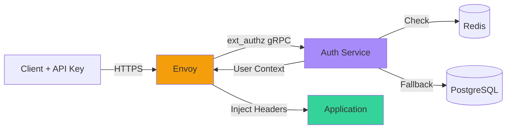
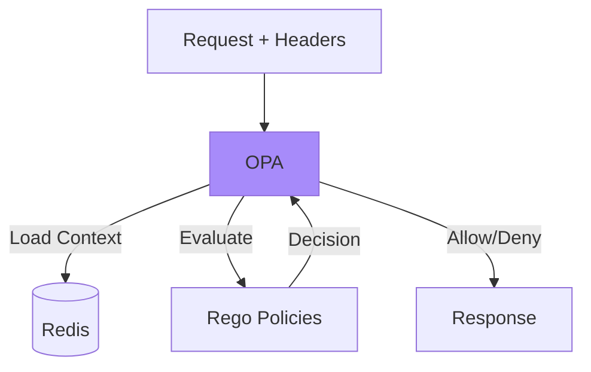
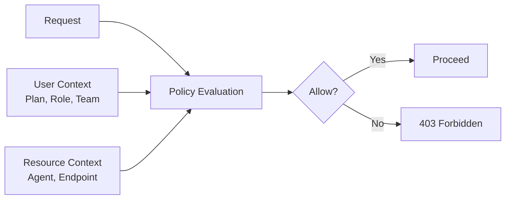
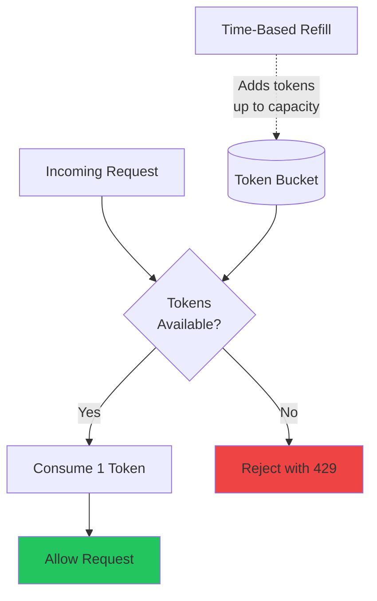
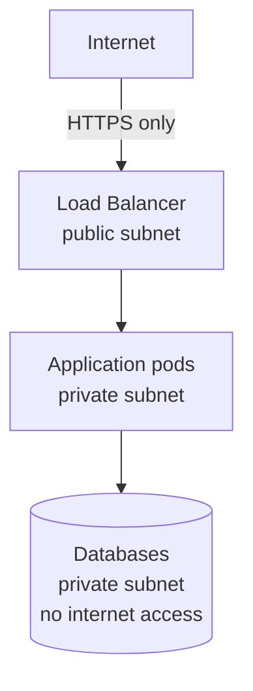
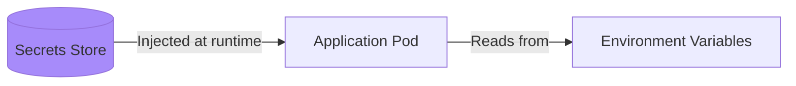

# Security Architecture

**Document:** Security Architecture
**Version:** 1.0
**Last Updated:** December 22, 2025

Security isn't an afterthought - it's baked into the architecture from day one. For the rationale behind infrastructure-layer authentication and OPA-based authorization, see [ADR-005](02-architectural-decisions.md#adr-005). This document covers implementation details.

## Table of Contents

- [Defense in Depth](#defense-in-depth)
- [Zero-Trust Architecture](#zero-trust-architecture)
- [Authentication: Who Are You?](#authentication-who-are-you)
- [Authorization: What Can You Do?](#authorization-what-can-you-do)
- [Rate Limiting](#rate-limiting)
- [Network Security](#network-security)
- [Secrets Management](#secrets-management)
- [Data Protection](#data-protection)
- [Audit Logging](#audit-logging)
- [Security Monitoring](#security-monitoring)
- [Incident Response](#incident-response)
- [Compliance](#compliance)
- [Security Best Practices](#security-best-practices)
- [Key Takeaways](#key-takeaways)

## Defense in Depth

[↑ Table of Contents](#table-of-contents)

We're using multiple layers of security. If one layer fails, others are still protecting us.

Think of it like a castle: moat, walls, guards, locked doors, and a vault. Each layer makes it harder to get to the treasure.

**Our layers:**

1. Network security (VPC, security groups)
2. Transport security (TLS everywhere)
3. Authentication (who are you?)
4. Authorization (what can you do?)
5. Application security (input validation, rate limiting)
6. Data security (encryption at rest)

## Zero-Trust Architecture

[↑ Table of Contents](#table-of-contents)

We don't trust anything by default. Every request must prove itself, even if it's coming from inside our network.

**The principle:** Verify explicitly, grant least privilege, assume breach.

**In practice:**

- Every service authenticates every request
- No "trusted internal network" assumption
- mTLS between all services
- Audit everything

## Authentication: Who Are You?

[↑ Table of Contents](#table-of-contents)

Authentication is handled at the infrastructure layer by Envoy, not in application code.

### How It Works

**The flow:**

1. Client sends request with `X-API-Key: sk-ace-abc123...`
2. Envoy intercepts and calls auth service
3. Auth service validates key (Redis cache first, PostgreSQL if miss)
4. Auth service returns user context (user_id, team_id, plan)
5. Envoy injects headers: `X-User-ID`, `X-Team-ID`, `X-Plan-ID`
6. Request forwarded to application
7. Application trusts the headers (they came from Envoy, not the user)

### API Key Format

`sk-ace-{random_32_chars}`

- `sk` = secret key (convention)
- `ace` = our product name
- Random part = cryptographically secure random bytes

**Storage:** Hashed with bcrypt in PostgreSQL. We never store plaintext keys.

**Rotation:** Users can generate new keys anytime. Old keys revoke immediately.

### Failure Mode

If auth service is down: **Deny all requests**

We fail closed, not open. Security over availability. Better to be down than compromised.

## Authorization: What Can You Do?

[↑ Table of Contents](#table-of-contents)

Authorization is handled by OPA (Open Policy Agent) sidecars. Policies are written in Rego.

### How It Works

### Policy Approach

Policies are declarative rules that determine access based on:

- **User context** - Plan tier, role, and team membership from authentication headers
- **Resource context** - Which agent or endpoint is being accessed
- **Action context** - What operation is being performed

**Policy types:**

- **Plan-based** - Feature access determined by subscription tier
- **Role-based** - Administrative actions require appropriate roles
- **Team-based** - Team resources accessible to team members

For implementation details, see TBD (OPA policy implementation guide).

**Benefits:**

- Policy as code (version controlled)
- Testable independently
- Update without deployment
- Clear audit trail

### Plan-Based Authorization

Plans define tiers of access with increasing capabilities:

- **Free tier** - Limited agent selection and request quotas for evaluation
- **Pro tier** - Full agent access with higher quotas and team features
- **Enterprise tier** - Unlimited access with custom agents and SLA guarantees

OPA enforces plan limits automatically by checking the user's plan tier against resource requirements before allowing access.

## Rate Limiting

[↑ Table of Contents](#table-of-contents)

We use token bucket algorithm with Redis for shared state.

### Token Bucket Algorithm

The token bucket algorithm provides smooth rate limiting while allowing short bursts of traffic:

**How it works:**

1. Each user/team has a bucket with a maximum capacity (e.g., 100 tokens)
2. Tokens refill at a steady rate (e.g., 100 tokens per hour)
3. Each request consumes one token
4. When the bucket is empty, requests are rejected until tokens refill
5. Redis provides atomic operations and shared state across instances

For implementation details, see TBD (rate limiting implementation guide).

**Multi-level limits:**

1. Global (protect infrastructure)
2. Per-team (enforce plans)
3. Per-user (prevent abuse)
4. Per-agent (specialized limits)

### Rate Limit Responses

When a request is rate limited, the response includes:

- **Current limit** - The user's request quota
- **Remaining quota** - How many requests are left in the current window
- **Reset time** - When the quota will reset (Unix timestamp)
- **Retry guidance** - How long to wait before retrying

This information enables clients to implement backoff strategies and display quota status to users. Responses also suggest plan upgrades when applicable.

## Network Security

[↑ Table of Contents](#table-of-contents)

### VPC Isolation

All infrastructure runs in a VPC (Virtual Private Cloud):

**Security groups** act like firewalls:

- Load balancer: Accept 443 from internet
- Application: Accept traffic from load balancer only
- Databases: Accept traffic from application only

### TLS Everywhere

All communication is encrypted:

**External traffic:**

- Client to load balancer uses current TLS standards (TLS 1.3 preferred)
- Load balancer to services uses TLS 1.2 or higher

**Internal traffic:**

- Service-to-service communication uses mutual TLS (mTLS)
- Service-to-database connections are encrypted

**TLS strategy:**

- Require modern TLS versions (1.2 minimum, 1.3 preferred)
- Use strong cipher suites with forward secrecy
- Disable deprecated protocols and weak ciphers
- Regular review of TLS configuration against current best practices

For implementation details, see TBD (TLS configuration guide).

### Certificate Management

Using cert-manager in Kubernetes:

- Automatic certificate issuance (Let's Encrypt)
- Automatic renewal (before expiry)
- Separate CA per environment
- 90-day rotation

## Secrets Management

[↑ Table of Contents](#table-of-contents)

### Secrets Storage

Sensitive values are stored separately from application code and configuration:

**Secrets storage approach:**

- Secrets stored in a dedicated secrets management system (Kubernetes Secrets, with path to external secret managers)
- Applications receive secrets as environment variables at runtime
- Secrets are never baked into container images
- Access to secrets is controlled by RBAC policies

For implementation details, see TBD (secrets management guide).

### What Never Goes in Code

Never hardcode:

- API keys
- Database passwords
- JWT secrets
- Any credentials

Always use:

- Environment variables
- Kubernetes secrets
- External secret managers (future)

### Secret Rotation

**Manual for now:**

1. Generate new secret
2. Update Kubernetes secret
3. Rolling restart pods
4. Verify
5. Revoke old secret

**Future: Automatic rotation** with AWS Secrets Manager or HashiCorp Vault.

## Data Protection

[↑ Table of Contents](#table-of-contents)

### Encryption at Rest

All data encrypted when stored:

**PostgreSQL (RDS):**

- Encryption enabled via AWS KMS
- Encrypted backups
- Encrypted snapshots

**Neo4j (Aura):**

- Encryption by default
- Encrypted backups

**Redis (ElastiCache):**

- Encryption enabled
- In-transit and at-rest

### Encryption in Transit

Already covered - TLS everywhere.

### Sensitive Data Handling

**API Keys:**

- Hashed with bcrypt (never plaintext)
- Only prefix shown to users
- Revocation supported

**User Data:**

- Email, name stored in PostgreSQL
- Access controlled by authorization
- Audit logged

**Pattern Content:**

- Not considered sensitive (team knowledge)
- Stored in Neo4j
- Shared across team

## Audit Logging

[↑ Table of Contents](#table-of-contents)

We log everything security-related:

**What we log:**

- Authentication attempts (success and failure)
- Authorization decisions
- API key creation/revocation
- Rate limit violations
- Configuration changes
- Administrative actions

**What audit logs capture:**

- **When** - Timestamp of the event
- **What** - Event type (authentication, authorization, key management, etc.)
- **Who** - User identifier or API key prefix (never full keys)
- **Where** - Source IP and client information
- **Outcome** - Success, failure, and reason for failures

Logs use structured format (JSON) for consistent parsing and analysis.

For implementation details, see TBD (audit logging implementation guide).

**Storage:**

- Centralized logging system
- Append-only (tamper-proof)
- Long retention (1 year minimum)
- Searchable and alertable

## Security Monitoring

[↑ Table of Contents](#table-of-contents)

### Real-Time Alerts

**Critical alerts** (PagerDuty):

- Multiple failed auth attempts (possible brute force)
- API key compromised indicators
- Unusual access patterns
- Configuration changes in production

**Warning alerts** (Slack):

- Rate limit exceeded repeatedly
- Failed authorization attempts
- Elevated error rates

### Metrics Tracked

- Failed auth attempts per minute
- Rate limit hits per user
- Unusual access patterns (ML in future)
- Certificate expiry warnings

## Incident Response

[↑ Table of Contents](#table-of-contents)

### When Something Bad Happens

**Process:**

1. **Detect** - Alert fires or user reports
2. **Contain** - Revoke compromised keys, block IPs
3. **Investigate** - Check audit logs, determine scope
4. **Eradicate** - Fix vulnerability, patch systems
5. **Recover** - Restore normal operations
6. **Learn** - Post-mortem, improve defenses

**Communication:**

- Security team notified immediately
- Engineering on-call paged for critical issues
- Users notified if their data affected
- Transparency in post-mortem

## Compliance

[↑ Table of Contents](#table-of-contents)

### GDPR Considerations

**Data minimization:**

- Only collect what we need
- Delete when no longer needed
- Clear purpose for each data point

**User rights:**

- Right to access (API endpoint)
- Right to deletion (automated)
- Right to portability (export endpoint)
- Right to rectification (update endpoints)

**Consent:**

- Clear terms of service
- Explicit consent for data usage
- Easy to withdraw

### SOC 2 Readiness

Not compliant yet, but architected to support it:

- Access controls (RBAC)
- Audit logging
- Encryption everywhere
- Incident response process
- Change management (GitOps)

## Security Best Practices

[↑ Table of Contents](#table-of-contents)

**We're doing:**

- Authentication at infrastructure layer
- Authorization as code (OPA)
- Zero-trust architecture
- Encryption everywhere
- Secrets management
- Audit logging
- Rate limiting
- Fail closed on errors

**Future enhancements:**

- WAF (Web Application Firewall)
- DDoS protection (Cloudflare)
- SIEM (Security Information and Event Management)
- Bug bounty program
- Regular penetration testing

## Key Takeaways

[↑ Table of Contents](#table-of-contents)

- **Defense in depth** - Multiple security layers
- **Zero-trust** - Verify everything, trust nothing
- **Infrastructure handles security** - Not application code
- **Fail closed** - Deny by default on errors
- **Audit everything** - Comprehensive logging
- **Encryption everywhere** - TLS for all communication

Next: [Observability Architecture](07-observability-architecture.md)

---

Copyright © 2025 Jeremy K. Johnson. All rights reserved.
