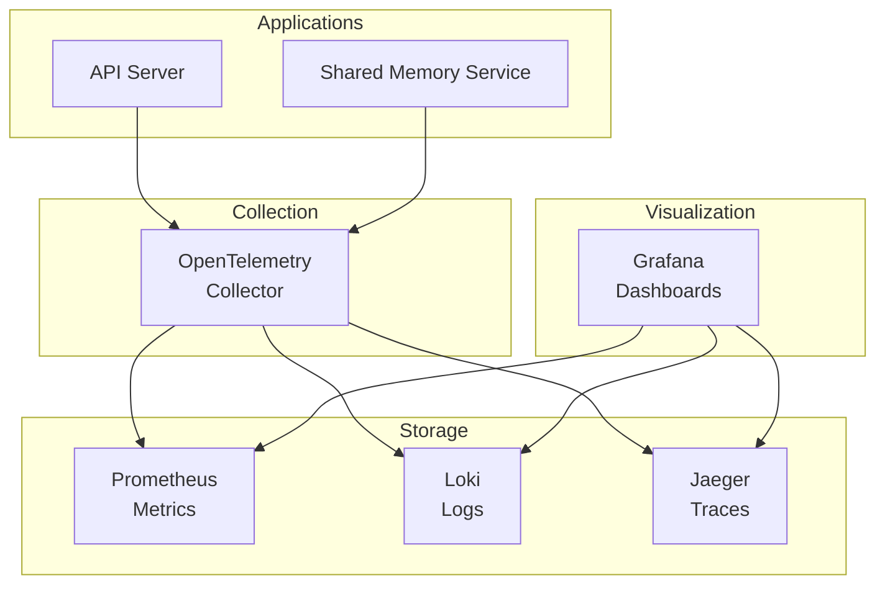
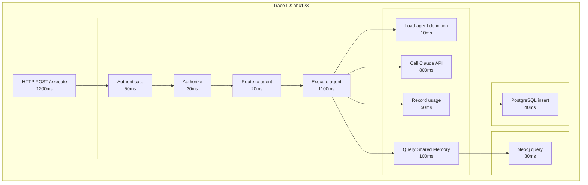

# Observability: See What's Happening

**Document:** Observability Architecture
**Version:** 1.0
**Last Updated:** December 22, 2025

You can't fix what you can't see. Let's talk about how we make the system observable.

## Table of Contents

- [The Three Pillars](#the-three-pillars)
- [Observability Stack](#observability-stack)
- [Metrics (Prometheus)](#metrics-prometheus)
- [Logs (Loki)](#logs-loki)
- [Distributed Tracing (Jaeger)](#distributed-tracing-jaeger)
- [Dashboards (Grafana)](#dashboards-grafana)
- [Correlation: Jumping Between Signals](#correlation-jumping-between-signals)
- [SLOs (Service Level Objectives)](#slos-service-level-objectives)
- [Performance Profiling](#performance-profiling)
- [Cost Monitoring](#cost-monitoring)
- [Runbooks](#runbooks)
- [Key Takeaways](#key-takeaways)

## The Three Pillars

[↑ Table of Contents](#table-of-contents)

Observability is built on three types of data:

**Metrics** - Numbers over time (request rate, error rate, latency)  
**Logs** - Individual events (request received, error occurred)  
**Traces** - Request journey across services (API -> Shared Memory -> Neo4j)

All three tied together with OpenTelemetry so you can jump between them.

## Observability Stack

[↑ Table of Contents](#table-of-contents)

Here's what we're using:



## Metrics (Prometheus)

[↑ Table of Contents](#table-of-contents)

Metrics are numbers that change over time. Think: requests per second, error rate, CPU usage.

### What We Measure

**RED Metrics** (for requests):

- **Rate:** How many requests per second?
- **Errors:** How many are failing?
- **Duration:** How long do they take?

**USE Metrics** (for resources):

- **Utilization:** CPU at 70%
- **Saturation:** Queue has 10 items waiting
- **Errors:** Disk read errors

### Application Metrics

We collect metrics across several categories:

**Request metrics** - Track HTTP and gRPC requests including counts by endpoint and status code, plus request duration histograms for latency percentile calculations.

**Business metrics** - Track agent-level activity including execution counts by agent and status, token usage (input vs output), and cost per agent.

**Pattern query metrics** - Track interactions with the shared memory service including query success/failure rates and cache hit/miss ratios.

For implementation details including specific metric names and labels, see operations documentation (TBD).

### Alerting Strategy

We alert on conditions that require human attention:

**Critical alerts** (immediate response required):

- Service availability - any core service becomes unreachable
- High error rate - error percentage exceeds acceptable threshold over a sustained period
- SLO breach - error budget consumption rate threatens our objectives

**Warning alerts** (investigate soon):

- Elevated latency - P95 response time exceeds targets
- Resource pressure - CPU, memory, or connection pools approaching limits
- Unusual patterns - traffic anomalies, elevated cache miss rates

**Alert routing:**

- Critical alerts route to on-call via PagerDuty
- Warning alerts notify the team via Slack

For alert rule definitions, see operations documentation (TBD).

## Logs (Loki)

[↑ Table of Contents](#table-of-contents)

Logs are individual events. They tell you what happened.

### Structured Logging

All logs use structured JSON format for consistent parsing and querying. Every log entry includes:

**Standard fields:**

- Timestamp, log level, and service name
- Trace and span IDs for correlation with distributed traces
- Human-readable message

**Context fields:**

- User and team identifiers for multi-tenant filtering
- Request-specific identifiers (execution ID, agent name, etc.)
- Any relevant domain data for the event

**Log levels:**

- DEBUG: Detailed debugging
- INFO: Normal operations
- WARN: Something's weird but not broken
- ERROR: Something failed
- FATAL: System is going down

### What We Log

**Application events:**

- Request received
- Agent routed
- Pattern queried
- Execution completed
- Error occurred

**Security events:**

- Auth attempts (success/failure)
- Authorization decisions
- Rate limit hits
- API key changes

**System events:**

- Service started
- Config loaded
- Health check failed
- Connection pool exhausted

### Querying Logs

Loki provides flexible log querying capabilities:

**Filter by attributes** - Query logs by service, log level, user, team, or any structured field. This enables quick isolation of relevant events during incidents.

**Text search** - Find logs containing specific messages or error patterns across all services or within a filtered subset.

**Metric extraction** - Calculate rates and aggregations from log data, such as error rates over time windows.

**Correlation** - Filter logs by trace ID to see all events related to a specific request flow.

For query syntax and examples, see operations documentation (TBD).

## Distributed Tracing (Jaeger)

[↑ Table of Contents](#table-of-contents)

Traces show how a request flows through the system.

### Trace Structure

A single agent execution might look like:



Each span has:

- Operation name
- Start time and duration
- Tags (metadata)
- Logs (events within the span)
- Trace ID (links all spans together)

### Sampling Strategy

Tracing every request would be prohibitively expensive. We use intelligent sampling:

**Always captured:**

- Errors - All failed requests are traced for debugging
- Slow requests - Requests exceeding latency thresholds are always captured
- Specific users/teams - On-demand tracing for debugging specific accounts

**Sampled:**

- Successful requests - A percentage of normal requests are traced to understand typical behavior

This approach ensures we have complete visibility into problems while keeping storage costs manageable.

For sampling configuration, see operations documentation (TBD).

## Dashboards (Grafana)

[↑ Table of Contents](#table-of-contents)

Grafana ties everything together with dashboards.

### System Health Dashboard

Answers the question: "Is the system healthy right now?"

**What it shows:**

- Request throughput over time - are we handling expected traffic?
- Error rate percentage - are requests failing?
- Latency percentiles (P50, P95, P99) - how fast are responses?
- Service availability - which services are up or down?
- Resource utilization - CPU, memory, and connection pool status

This is the first dashboard to check during incidents. It provides immediate visibility into overall system health.

### Business Dashboard

Answers the question: "How is the product being used?"

**What it shows:**

- Execution volume over time - how many agent runs per hour/day?
- Agent popularity - which agents are used most frequently?
- Token consumption trends - input vs output token usage patterns
- Cost metrics - spending per execution, per agent, per team
- Pattern cache effectiveness - are we efficiently reusing knowledge?

This dashboard helps understand product usage patterns and identify optimization opportunities.

For dashboard configuration and queries, see operations documentation (TBD).

## Correlation: Jumping Between Signals

[↑ Table of Contents](#table-of-contents)

The power is in connecting metrics, logs, and traces.

### From Metrics to Traces

See latency spike in metrics -> Click data point -> See trace IDs -> Jump to Jaeger

Prometheus supports exemplars (sample trace IDs attached to metrics):

```text
http_request_duration_seconds_bucket{le="1.0"} 42 # {trace_id="abc123"}
```

### From Logs to Traces

See error in logs -> Click trace_id -> Jump to full trace in Jaeger

All logs include trace_id and span_id:

```json
{
  "trace_id": "abc123",
  "span_id": "def456",
  "message": "Pattern query failed"
}
```

### From Traces to Logs

Looking at trace -> See slow span -> Click "View Logs" -> Filter logs for that span

## SLOs (Service Level Objectives)

[↑ Table of Contents](#table-of-contents)

We track SLOs to know if we're meeting user expectations.

### Defining SLOs

**Availability SLO:** 99.9%

```text
successful requests / total requests >= 0.999
```

**Latency SLO:** 95% under 1s

```text
requests completing < 1s / total requests >= 0.95
```

**Error Rate SLO:** < 1%

```text
error requests / total requests < 0.01
```

### Error Budget

SLO of 99.9% = 0.1% errors allowed

If we get 1M requests/month:

- Error budget: 1,000 errors
- Budget remaining: 1,000 - errors_so_far
- Burn rate: How fast we're consuming budget

**When budget is low:**

- Freeze features, focus on reliability
- No risky deploys
- Fix bugs

**When budget is healthy:**

- Ship features
- Experiment
- Take calculated risks

## Performance Profiling

[↑ Table of Contents](#table-of-contents)

For deep dives into performance:

**CPU profiling:**

- What's using CPU?
- Which functions are hot?
- Where to optimize?

**Memory profiling:**

- Where are allocations happening?
- Memory leaks?
- GC pressure?

**Tools:**

- pprof (Go built-in)
- Pyroscope (continuous profiling)

## Cost Monitoring

[↑ Table of Contents](#table-of-contents)

Cost visibility is essential for a system that consumes paid API resources.

**What we track:**

- Claude API costs - Token usage translates directly to spending
- Per-team spending - Multi-tenant cost attribution
- Cost trends - Daily, weekly, and monthly patterns
- Cost per execution - Understanding unit economics

**Alerting:**

- Unexpected cost spikes trigger warnings
- Budget threshold alerts for teams approaching limits

For cost monitoring queries and dashboards, see operations documentation (TBD).

## Runbooks

[↑ Table of Contents](#table-of-contents)

Every alert links to a runbook that guides the responder through investigation and resolution.

**Runbook structure:**

- Symptoms - What triggered the alert
- Investigation steps - How to diagnose the issue
- Common causes - Likely root causes to check first
- Resolution steps - How to fix common issues
- Escalation path - When and how to escalate

Runbooks live in operations documentation and are linked directly from alert annotations.

For runbook templates and content, see operations documentation (TBD).

## Key Takeaways

[↑ Table of Contents](#table-of-contents)

- **Three pillars** - Metrics, logs, traces all working together
- **OpenTelemetry** - Standard way to collect telemetry
- **Correlation** - Jump between signals with trace IDs
- **SLOs matter** - Track what users care about
- **Runbooks** - Every alert has recovery steps
- **Cost tracking** - Monitor spending in real-time

Next: [Deployment Architecture](08-deployment-architecture.md)

---

Copyright © 2025 Jeremy K. Johnson. All rights reserved.
