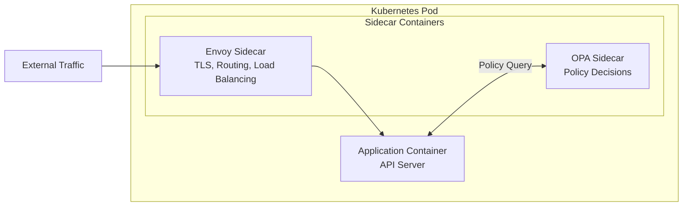
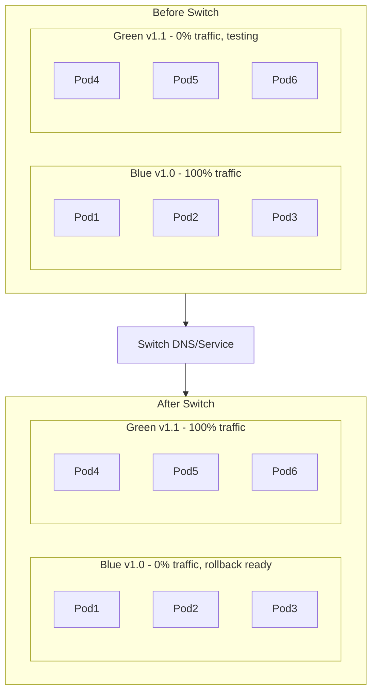
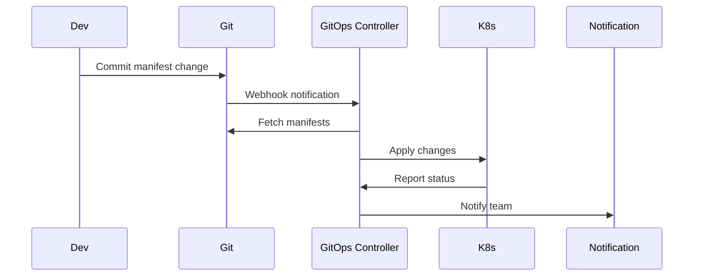

# Deployment on Kubernetes

**Document:** Deployment Architecture
**Version:** 1.0
**Last Updated:** December 22, 2025

We're deploying on Kubernetes with GitOps. Let's talk about how.

## Table of Contents

- [Why Kubernetes](#why-kubernetes)
- [Pod Structure](#pod-structure)
- [Auto-Scaling](#auto-scaling)
- [Health Checks](#health-checks)
- [Deployment Strategies](#deployment-strategies)
- [GitOps Workflow](#gitops-workflow)
- [Configuration Management](#configuration-management)
- [Service Discovery](#service-discovery)
- [Key Takeaways](#key-takeaways)

## Why Kubernetes

[↑ Table of Contents](#table-of-contents)

**Orchestration:** Automatically schedules containers, restarts failures, manages resources

**Scalability:** Add more pods when needed, remove when traffic drops

**Declarative:** Describe what you want, K8s makes it happen

**Standard:** Works on AWS, GCP, Azure, on-prem. Portable.

## Pod Structure

[↑ Table of Contents](#table-of-contents)

Each API server pod runs three containers working together in a sidecar pattern:

**Envoy Sidecar:** Handles all inbound traffic on the pod's external port. Envoy manages TLS termination, load balancing, and routing before forwarding requests to the application container. This keeps networking concerns out of the application code.

**OPA Sidecar:** The Open Policy Agent runs alongside the application to evaluate authorization policies. The application queries OPA for policy decisions, keeping policy logic decoupled from business logic.

**Application Container:** The core API server that handles business logic. It receives traffic from Envoy and queries OPA for authorization decisions.

### Resource Allocation

Each container specifies resource requests and limits:

- **Requests** define the minimum resources guaranteed to the container. The scheduler uses requests to place pods on nodes with sufficient capacity.
- **Limits** define the maximum resources a container can consume. Containers exceeding memory limits are terminated; those exceeding CPU limits are throttled.

The sidecars typically need modest resources (a few hundred millicores of CPU, a few hundred megabytes of memory), while the application container requires more substantial allocation depending on workload characteristics.

> For actual deployment manifests, see TBD.

## Auto-Scaling

[↑ Table of Contents](#table-of-contents)

### Horizontal Pod Autoscaler

The Horizontal Pod Autoscaler (HPA) automatically adjusts the number of pod replicas based on observed resource utilization. This allows the system to handle varying load without manual intervention.

**Scaling Metrics:** HPA can scale based on CPU utilization, memory utilization, or custom application metrics. CPU-based scaling is most common: when average CPU utilization across pods exceeds a target threshold (e.g., 70%), HPA adds replicas. When utilization drops below a lower threshold (e.g., 50%), it removes replicas.

**Replica Bounds:** HPA operates within configured minimum and maximum replica counts. The minimum ensures baseline availability even during low traffic. The maximum prevents runaway scaling that could exhaust cluster resources or budget.

**Scale-Up Behavior:** When metrics exceed the threshold, HPA scales up quickly to handle increased load. New pods are added incrementally, with the scheduler placing them on nodes with available capacity.

**Scale-Down Behavior:** Scale-down is more conservative to prevent flapping. HPA waits for a stabilization period (typically several minutes) before removing replicas. This prevents rapid scale-down during brief dips in traffic.

> For actual deployment manifests, see TBD.

## Health Checks

[↑ Table of Contents](#table-of-contents)

Kubernetes uses three types of probes to monitor container health and manage traffic routing:

**Liveness Probe:** Answers "Is the application running?" Kubernetes periodically checks a health endpoint. If the probe fails consecutively (e.g., three times), Kubernetes restarts the container. This recovers from situations where the application is running but deadlocked or otherwise unresponsive. The liveness endpoint should perform minimal checks to verify the process is alive.

**Readiness Probe:** Answers "Can this instance serve traffic?" Kubernetes checks a readiness endpoint to determine whether to route traffic to the pod. If the probe fails, the pod is removed from the service's load balancer until it passes again. This is useful during startup (before the application is ready) and during temporary issues (e.g., database connection problems). The readiness endpoint should verify that the application can actually handle requests.

**Startup Probe:** Answers "Has the application finished starting?" For applications with slow startup (loading large models, warming caches), the startup probe prevents liveness checks from killing the container before it's ready. The startup probe runs first; only after it succeeds do liveness and readiness probes begin. This allows for generous startup timeouts without affecting runtime health check responsiveness.

Each probe is configured with a check interval, failure threshold, and timeout. HTTP probes are most common, but TCP and command-based probes are also available.

> For actual deployment manifests, see TBD.

## Deployment Strategies

[↑ Table of Contents](#table-of-contents)

We use Blue-Green deployment for releasing new versions. This strategy deploys the new version completely before switching traffic, providing instant switchover and easy rollback capabilities.

The Blue environment runs the current production version while the Green environment hosts the new version for testing. Once validated, traffic switches entirely to Green. If issues arise, switching back to Blue provides immediate rollback without redeployment.

## GitOps Workflow

[↑ Table of Contents](#table-of-contents)

GitOps treats Git as the single source of truth for infrastructure and application configuration. A GitOps controller continuously monitors the Git repository and reconciles the cluster state to match the declared configuration.

**Benefits:**

- Git history = deployment history
- Rollback = `git revert`
- Audit trail built-in
- Declarative, reproducible

The GitOps controller handles the mechanics of synchronization, drift detection, and rollback. Popular implementations include ArgoCD, Flux, and similar tools, but the pattern remains consistent regardless of tooling choice.

## Configuration Management

[↑ Table of Contents](#table-of-contents)

Kubernetes provides two mechanisms for injecting configuration into containers:

### ConfigMaps

ConfigMaps store non-sensitive configuration data as key-value pairs. They hold settings like log levels, service URLs, feature flags, and other runtime configuration. Applications consume ConfigMaps either as environment variables or as files mounted into the container filesystem.

ConfigMaps are stored in plaintext within Kubernetes, making them suitable for configuration that doesn't require protection. Changes to ConfigMaps can be picked up by applications either through pod restarts or through file watches (when mounted as volumes).

### Secrets

Secrets store sensitive data such as API keys, database passwords, TLS certificates, and other credentials. While Secrets are base64-encoded (not encrypted) by default, Kubernetes provides additional protection: RBAC controls access, Secrets can be encrypted at rest, and they are only distributed to nodes running pods that need them.

Applications consume Secrets the same way as ConfigMaps: as environment variables or mounted files. For highly sensitive data, consider external secret management solutions that integrate with Kubernetes (e.g., HashiCorp Vault, AWS Secrets Manager).

> For actual deployment manifests, see TBD.

## Service Discovery

[↑ Table of Contents](#table-of-contents)

Kubernetes provides built-in service discovery through DNS. When you create a Service resource, Kubernetes automatically creates a DNS entry that other pods can use to find it.

**How It Works:** A Service defines a logical name (e.g., `api-server`) and a selector that identifies which pods should receive traffic. Kubernetes assigns the Service a stable cluster IP address and DNS name. Other pods connect using the DNS name rather than tracking individual pod IPs (which change as pods are created and destroyed).

**DNS Format:** Services are accessible at `<service-name>.<namespace>.svc.cluster.local`. Within the same namespace, pods can use just the service name (e.g., `api-server`).

**Load Balancing:** Kubernetes automatically load balances traffic across all healthy pods matching the Service's selector. Pods that fail their readiness probe are automatically removed from the load balancer until they recover.

This abstraction allows services to scale horizontally without clients needing to know about individual pod instances.

> For actual deployment manifests, see TBD.

## Key Takeaways

[↑ Table of Contents](#table-of-contents)

- **Kubernetes orchestrates** - Manages containers at scale
- **Sidecars for infrastructure** - Envoy, OPA keep app clean
- **Auto-scaling** - HPA adjusts to load
- **GitOps deployment** - Git as source of truth
- **Health checks** - Automatic recovery from failures
- **Blue-Green deployment** - Instant switchover with easy rollback

Next: [Scalability](09-scalability.md)

---

Copyright © 2025 Jeremy K. Johnson. All rights reserved.
