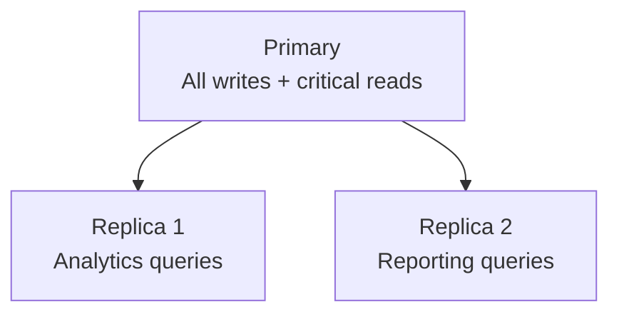
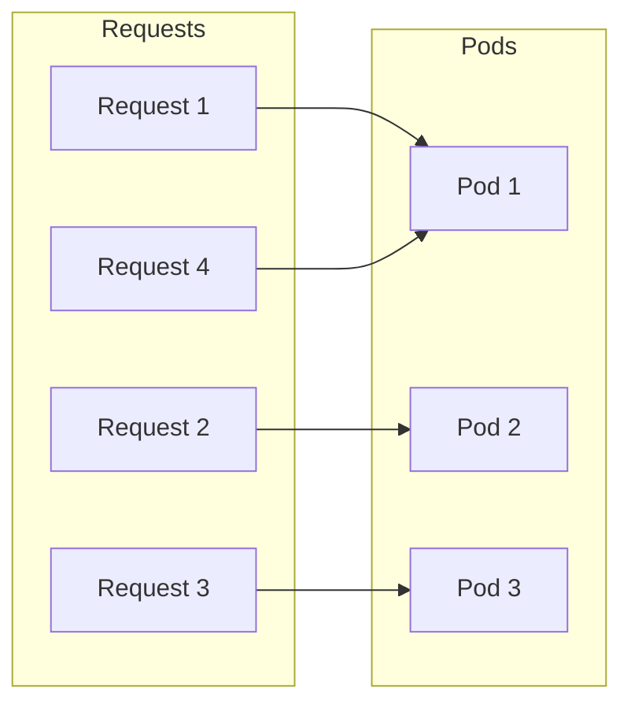
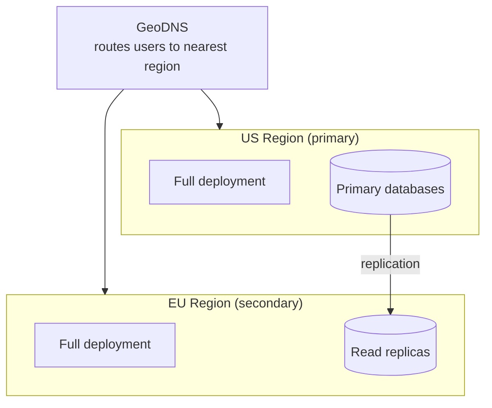

# How We Scale

**Document:** Scalability
**Version:** 1.0
**Last Updated:** December 22, 2025

Let's talk about how the system grows from 10 users to 100,000.

## Table of Contents

- [Component Scaling Profiles](#component-scaling-profiles)
- [Scaling Timeline](#scaling-timeline)
- [Caching Strategy](#caching-strategy)
- [Database Scaling](#database-scaling)
- [Connection Pooling](#connection-pooling)
- [Load Distribution](#load-distribution)
- [Bottleneck Identification](#bottleneck-identification)
- [Auto-Scaling Configuration](#auto-scaling-configuration)
- [Cost Optimization](#cost-optimization)
- [Regional Scaling](#regional-scaling)
- [Load Testing](#load-testing)
- [Key Takeaways](#key-takeaways)

## Component Scaling Profiles

[↑ Table of Contents](#table-of-contents)

Different components have different scaling characteristics and bottlenecks:

**API Server (CPU-bound):** The API server's primary bottleneck is request processing and JSON parsing. It scales horizontally based on CPU utilization thresholds.

**Shared Memory Service (Memory-bound):** The shared memory service's bottleneck is pattern embeddings and graph queries, which are memory-intensive. It scales based on memory utilization thresholds.

**Databases (Managed):** Database services use managed scaling approaches - PostgreSQL and Neo4j scale vertically first, then add read replicas for query distribution. Redis uses cluster mode sharding for horizontal scaling.

> For specific resource allocations and replica counts, see capacity planning documentation (TBD).

## Scaling Timeline

[↑ Table of Contents](#table-of-contents)

### Stage 1: MVP (0-100 users)

Minimal infrastructure with small, fixed resource allocations. Single database instances without replicas. Focus is on functionality over scale.

### Stage 2: Early Adoption (100-1K users)

Introduce auto-scaling for application pods. Add first database read replica to offload queries. Capacity grows by roughly 10x from MVP.

### Stage 3: Growth (1K-10K users)

Larger pod pools with wider auto-scaling ranges. Multiple database read replicas. Redis moves to cluster mode for horizontal scaling. Enterprise database tiers for better performance. Capacity grows another 10x.

### Stage 4: Scale (10K-100K users)

Maximum horizontal scaling for application layers. Full database cluster deployments with multiple read replicas. Consider multi-region deployment for latency and availability. Capacity reaches 100x MVP levels.

> For specific instance types, pod counts, and cost estimates at each stage, see capacity planning documentation (TBD).

## Caching Strategy

[↑ Table of Contents](#table-of-contents)

Multi-level cache reduces database load:

**L1 (In-Memory):** Per-pod cache, 100MB, 1-min TTL  
**L2 (Redis):** Shared cache, 5-min TTL  
**L3 (Database):** Source of truth

**Cache hit rates:**

- User context: 90% (Redis)
- Pattern content: 70% (Redis)
- Agent definitions: 95% (in-memory)

## Database Scaling

[↑ Table of Contents](#table-of-contents)

### PostgreSQL Strategy

**Phase 1:** Single instance (vertical scaling)

Scale up by increasing instance size (CPU, memory, storage) as load grows. This is the simplest approach until query distribution becomes necessary.

**Phase 2:** Add read replicas (horizontal)



**Phase 3:** Partition large tables

Time-based partitioning for tables with continuous data growth (e.g., usage records partitioned by month). Each partition covers a fixed time range, enabling efficient queries on recent data and simplified archival of old partitions.

Archive old partitions to cold storage for cost savings.

### Neo4j Strategy

**Phase 1:** Single instance (vertical)  
**Phase 2:** Add read replicas for queries  
**Phase 3:** Causal cluster for HA (3 core + N read replicas)

### Redis Strategy

**Phase 1:** Single node  
**Phase 2:** Primary + 1 replica (HA)  
**Phase 3:** Cluster mode (sharding)

## Connection Pooling

[↑ Table of Contents](#table-of-contents)

Connection pooling prevents database connection exhaustion by reusing connections across requests.

**Pool Configuration Strategy:**

- **Minimum idle connections:** Keep a baseline of warm connections ready for immediate use, avoiding connection setup latency for typical traffic
- **Maximum open connections:** Cap total connections per service to prevent overwhelming the database, leaving headroom for other services and administrative access
- **Connection lifetime:** Rotate connections periodically to prevent stale connections and rebalance across database replicas

Each service gets its own pool sized according to its query patterns. The total connections across all services should stay well under the database's connection limit.

> For specific connection pool sizes and configuration values, see capacity planning documentation (TBD).

## Load Distribution

[↑ Table of Contents](#table-of-contents)

### Round Robin (Default)

Traffic distributed evenly across pods:



Good for stateless workloads.

### Session Affinity

Session affinity routes requests from the same client to the same pod, typically based on client IP address. This improves cache hit rates since user-specific data stays in-memory on one pod.

The affinity has a configurable timeout - after a period of inactivity, the routing resets and the client may land on a different pod.

**Trade-off:** Session affinity improves per-user performance through cache warming, but makes horizontal scaling less effective since load distribution becomes uneven.

## Bottleneck Identification

[↑ Table of Contents](#table-of-contents)

When performance degrades, check:

**High CPU:**

- More request processing than capacity
- Solution: Horizontal scale (add pods)

**High Memory:**

- Large caches, memory leaks
- Solution: Optimize or vertical scale

**High Latency:**

- Slow database queries, external API delays
- Solution: Add caching, optimize queries

**High Error Rate:**

- Downstream service failures, resource exhaustion
- Solution: Fix root cause, add circuit breakers

## Auto-Scaling Configuration

[↑ Table of Contents](#table-of-contents)

Auto-scaling is handled by Kubernetes Horizontal Pod Autoscaler (HPA). See [Deployment Architecture - Auto-Scaling](08-deployment-architecture.md#auto-scaling) for the conceptual approach, including scaling metrics, replica bounds, and scale-up/scale-down behavior.

**Service-specific considerations:**

- **API Server:** Scales on CPU utilization since request processing is CPU-bound
- **Shared Memory Service:** Scales on memory utilization since pattern embeddings and graph queries are memory-intensive

> For specific replica counts and threshold values, see capacity planning documentation (TBD).

## Cost Optimization

[↑ Table of Contents](#table-of-contents)

**Right-size resources:**

- Monitor actual usage
- Adjust requests/limits based on data
- Don't over-provision

**Use reserved instances:**

- Commit to baseline capacity for significant savings
- Reserve predictable workloads, use on-demand for burst

**Auto-scale down:**

- Reduce pods during low-traffic periods
- Nighttime, weekends (depending on usage patterns)

**Archive old data:**

- Move old records to cold storage (significantly cheaper than primary database storage)

## Regional Scaling

[↑ Table of Contents](#table-of-contents)

### Single Region (Current)

All infrastructure in a single cloud region:

- Simple architecture
- Lower cost
- Sufficient for early scaling stages

### Multi-Region (Future)

Deploy in multiple regions:



**Benefits:**

- Lower latency globally
- Higher availability
- Disaster recovery

**Challenges:**

- Data consistency across regions
- 2x infrastructure cost
- Deployment complexity

## Load Testing

[↑ Table of Contents](#table-of-contents)

Before scaling up, load test to find limits:

**Test scenario:**

```text
1. Baseline: 100 concurrent users
2. Ramp: +50 users every 5 minutes
3. Peak: Hold at 500 users for 15 minutes
4. Spike: Sudden 2x increase
5. Ramp down
```

**Measure:**

- Response times (p50, p95, p99)
- Error rate
- Resource usage (CPU, memory)
- Database performance

**Find breaking points:**

- At what load do errors spike?
- What resource exhausts first?
- How does system degrade?

## Key Takeaways

[↑ Table of Contents](#table-of-contents)

- **Horizontal over vertical** - Add machines, not bigger machines
- **Different components scale differently** - API is CPU-bound, shared memory service is memory-bound
- **Cache aggressively** - Reduce database load with multi-level caching
- **Monitor and right-size** - Use actual data to guide scaling decisions
- **Cost optimize** - Reserved instances, auto-scale down, archive old data
- **Load test** - Know your limits before you hit them

Next: [Trade-offs](10-trade-offs.md)

---

Copyright © 2025 Jeremy K. Johnson. All rights reserved.
