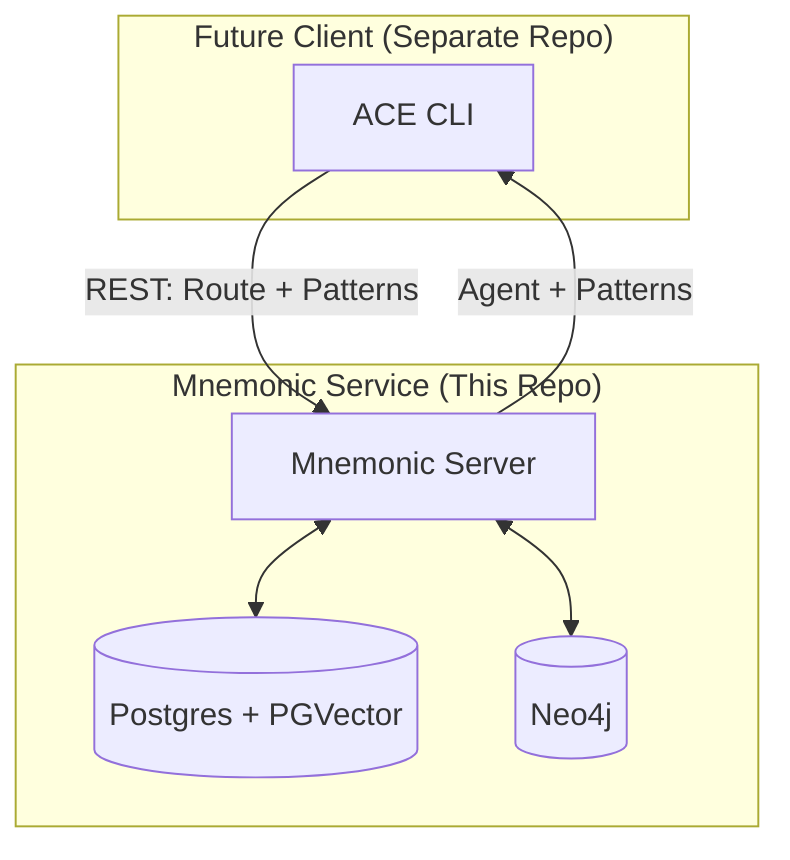
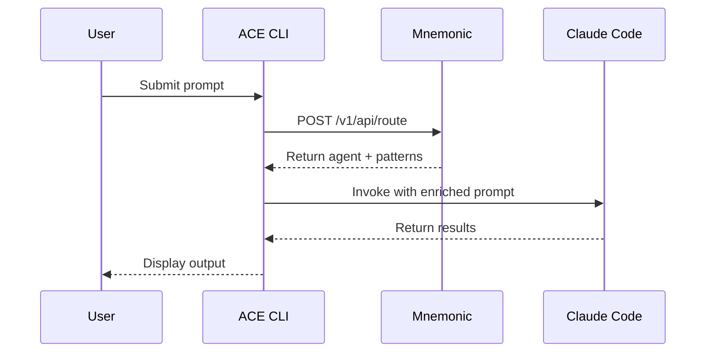
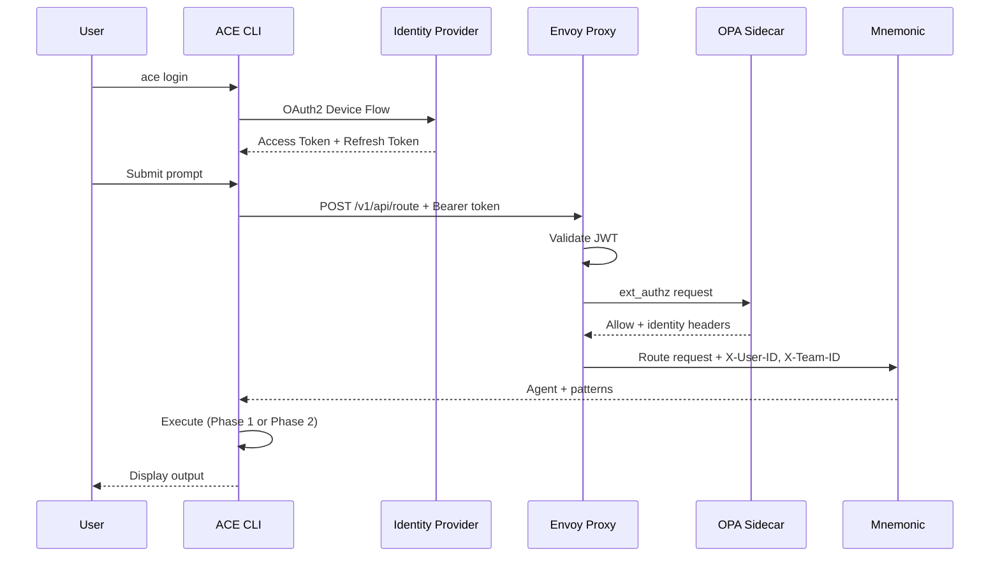

# ACE Architecture Overview

[Back to Project README](../../README.md)

## Table of Contents

- [Introduction](#introduction)
- [Core Concept](#core-concept)
- [System Model](#system-model)
- [Phased Approach](#phased-approach)
  - [Phase 1: Claude Code Integration](#phase-1-claude-code-integration)
  - [Phase 2: Direct API Integration](#phase-2-direct-api-integration)
  - [Phase 3: Authentication and Authorization](#phase-3-authentication-and-authorization)
- [Key Principles](#key-principles)
- [Document Navigation](#document-navigation)
- [Design Documents](#design-documents)

## Introduction

ACE (Agent Coordination Engine) is an orchestration layer built on top
of Claude Code. This repository contains Mnemonic, the backend service
that provides deterministic routing and dynamic pattern retrieval. The
ACE CLI will be developed in a separate repository.

## Core Concept

Mnemonic provides the backend capabilities for ACE orchestration:

- **Deterministic routing** via code-based logic (not LLM-driven)
- **Dynamic patterns** retrieved from Mnemonic's knowledge graph
- **REST API interface** for external clients to consume routing and
  pattern retrieval

## Repository Structure

This repository contains Mnemonic, the backend service for ACE:

| Component    | Purpose                                                             |
| ------------ | ------------------------------------------------------------------- |
| **mnemonic** | Backend server providing routing and pattern retrieval via REST API |

The ACE CLI will be developed in a separate repository once Mnemonic
reaches MVP status.

## System Model

The ACE architecture separates concerns:

1. **Mnemonic** (this repository) provides centralized routing logic and
   pattern retrieval via REST API
2. **ACE CLI** (future separate repository) will consume Mnemonic's API
   and handle execution orchestration
3. **Execution** will remain local on the user's workstation

This separation keeps routing deterministic and server-side while
execution remains local.

## Phased Approach

### Phase 1: Claude Code Integration

The initial implementation leverages Claude Code as the execution engine.

**Characteristics:**

- Claude Code installation required on workstation
- Routing rules centralized in Mnemonic
- Files written locally via Claude Code's native capabilities
- Benefits from Claude Code's existing tool ecosystem

### Phase 2: Direct API Integration

Future implementation removes Claude Code dependency by calling Anthropic API directly.

**Characteristics:**

- Only Anthropic account required (no Claude Code)
- ACE CLI handles tool execution locally
- Greater control over API interactions
- Reduced external dependencies

### Phase 3: Authentication and Authorization

Enterprise-grade security using infrastructure-layer components.

**Characteristics:**

- Authentication handled by Envoy at the edge (JWT validation, API keys)
- Authorization handled by OPA sidecar (fine-grained RBAC policies)
- Mnemonic receives pre-validated identity via headers (no security code in application)
- CLI manages token lifecycle (login, refresh, secure storage)
- Fail-closed design (deny by default when security services unavailable)
- Orthogonal to execution strategy (works with both Phase 1 and Phase 2)

## Key Principles

1. **Orchestration, not replacement**: ACE enhances Claude Code rather than replacing it
2. **Deterministic routing**: Routing decisions are code-based, predictable, and auditable
3. **Centralized patterns**: Team knowledge shared through a common memory service
4. **Local execution**: All file operations and tool execution happen on the user's machine
5. **Phased evolution**: Architecture supports gradual transition from Claude Code to direct API
6. **Infrastructure-layer security**: Authentication and authorization handled by dedicated components (Envoy, OPA), keeping application code security-agnostic

## Document Navigation

| Document                                                           | Description                            |
| ------------------------------------------------------------------ | -------------------------------------- |
| [01-requirements.md](01-requirements.md)                           | Problem statement and success criteria |
| [02-architectural-decisions.md](02-architectural-decisions.md)     | Key architectural decision records     |
| [03-system-architecture.md](03-system-architecture.md)             | Component breakdown and data flow      |
| [04-communication-patterns.md](04-communication-patterns.md)       | Protocol and integration patterns      |
| [05-deployment-architecture.md](05-deployment-architecture.md)     | Deployment topology and operations     |
| [06-security-architecture.md](06-security-architecture.md)         | Phase 3 authentication and authorization |
| [07-observability-architecture.md](07-observability-architecture.md) | Monitoring, logging, and tracing       |
| [08-data-architecture.md](08-data-architecture.md)                 | Database schemas and data management   |
| [mnemonic-integration-concept.md](../mnemonic-integration-concept.md) | ACE + Mnemonic integration details     |

## Design Documents

Architecture documents describe **what** the system does and **why** decisions were made. Design documents (in `docs/design/`) contain **how** - the detailed specifications produced during implementation.

### Architecture vs Design

| Aspect   | Architecture Docs               | Design Docs            |
| -------- | ------------------------------- | ---------------------- |
| Focus    | Concepts, decisions, trade-offs | Implementation details |
| Audience | All stakeholders                | Implementers           |
| Timing   | Before implementation           | During implementation  |
| Location | `docs/architecture/`            | `docs/design/`         |

### Available Design Documents

The following design documents provide implementation details:

**Mnemonic Service:**

| Document                                                                              | Description                            | Status   |
| ------------------------------------------------------------------------------------- | -------------------------------------- | -------- |
| [api-specification.md](../design/api-specification.md)               | OpenAPI spec for Mnemonic REST API     | Complete |
| [pattern-processing.md](../design/pattern-processing.md)             | Pattern enrichment and search pipeline | Complete |
| [routing-engine.md](../design/routing-engine.md)                     | Routing algorithm details              | Complete |
| [configuration.md](../design/configuration.md)                       | Server configuration                   | Complete |
| [observability-implementation.md](../design/observability-implementation.md) | Observability design           | Complete |

### Cross-References

Design documents should reference back to these architecture documents for context. When implementing a feature:

1. Review the relevant architecture document for context and constraints
2. Create or update the design document with implementation details
3. Link back to architecture docs to explain why decisions were made

**Next:** [Requirements](01-requirements.md)
