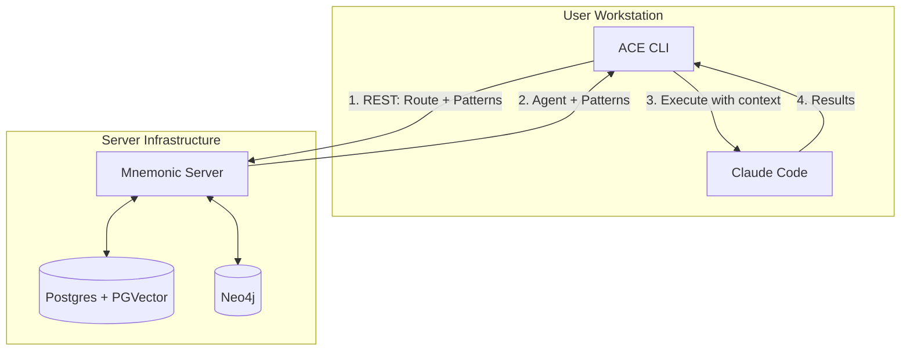
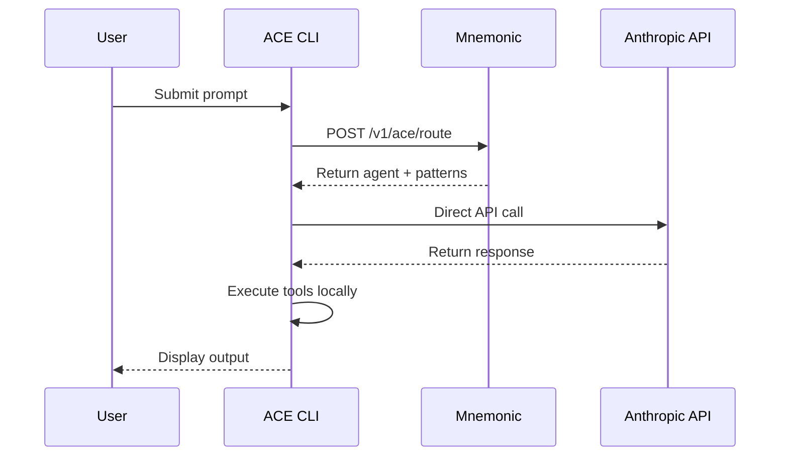

# ACE Architecture Overview

[Back to Project README](../../README.md)

## Table of Contents

- [Introduction](#introduction)
- [Core Concept](#core-concept)
- [System Model](#system-model)
- [Phased Approach](#phased-approach)
  - [Phase 1: Claude Code Integration](#phase-1-claude-code-integration)
  - [Phase 2: Direct API Integration](#phase-2-direct-api-integration)
- [Key Principles](#key-principles)
- [Document Navigation](#document-navigation)
- [Design Documents](#design-documents)

## Introduction

ACE (Agent Coordination Engine) is an orchestration layer built on top of Claude Code. It provides deterministic routing, dynamic patterns from Mnemonic, and flexible execution strategies while preserving the capabilities of Claude Code.

## Core Concept

ACE is **not a replacement** for Claude Code. Instead, it serves as an orchestration layer that provides:

- **Deterministic routing** via code-based logic (not LLM-driven)
- **Dynamic patterns** retrieved from Mnemonic's knowledge graph
- **Local execution** through Claude Code (Phase 1) or direct Anthropic API calls (Phase 2)

## Repository Structure

ACE is a monorepo containing two binaries built from a single Go module:

| Binary       | Purpose                                                             |
| ------------ | ------------------------------------------------------------------- |
| **mnemonic** | Backend server providing routing and pattern retrieval via REST API |
| **ace**      | CLI client that orchestrates routing decisions and execution        |

The monorepo structure enables atomic commits across CLI and server, shared tooling (linting, testing infrastructure), and simpler dependency management. GitHub Actions path filters enable independent CI/CD pipelines for each binary.

## System Model

The ACE architecture follows a CLI-centric model where:

1. **ACE CLI** runs on the user's workstation and serves as the primary interface
2. **Mnemonic** provides centralized routing logic and pattern retrieval via REST API
3. **Claude Code** (or Anthropic API) handles actual LLM interactions and tool execution

This separation keeps routing deterministic and server-side while execution remains local.

## Phased Approach

### Phase 1: Claude Code Integration

The initial implementation leverages Claude Code as the execution engine.

**Characteristics:**

- Claude Code installation required on workstation
- Routing rules centralized in Mnemonic
- Files written locally via Claude Code's native capabilities
- Benefits from Claude Code's existing tool ecosystem

### Phase 2: Direct API Integration

Future implementation removes Claude Code dependency by calling Anthropic API directly.

**Characteristics:**

- Only Anthropic account required (no Claude Code)
- ACE CLI handles tool execution locally
- Greater control over API interactions
- Reduced external dependencies

## Key Principles

1. **Orchestration, not replacement**: ACE enhances Claude Code rather than replacing it
2. **Deterministic routing**: Routing decisions are code-based, predictable, and auditable
3. **Centralized patterns**: Team knowledge shared through a common memory service
4. **Local execution**: All file operations and tool execution happen on the user's machine
5. **Phased evolution**: Architecture supports gradual transition from Claude Code to direct API

## Document Navigation

| Document                                                           | Description                            |
| ------------------------------------------------------------------ | -------------------------------------- |
| [01-requirements.md](01-requirements.md)                           | Problem statement and success criteria |
| [02-architectural-decisions.md](02-architectural-decisions.md)     | Key architectural decision records     |
| [03-system-architecture.md](03-system-architecture.md)             | Component breakdown and data flow      |
| [04-communication-patterns.md](04-communication-patterns.md)       | Protocol and integration patterns      |
| [05-deployment-architecture.md](05-deployment-architecture.md)     | Deployment topology and operations     |
| [project-structure.md](project-structure.md)                       | Repository layout and organization     |
| [mnemonic-integration-concept.md](mnemonic-integration-concept.md) | ACE + Mnemonic integration details     |

## Design Documents

Architecture documents describe **what** the system does and **why** decisions were made. Design documents (in `docs/design/`) contain **how** - the detailed specifications produced during implementation.

### Architecture vs Design

| Aspect   | Architecture Docs               | Design Docs            |
| -------- | ------------------------------- | ---------------------- |
| Focus    | Concepts, decisions, trade-offs | Implementation details |
| Audience | All stakeholders                | Implementers           |
| Timing   | Before implementation           | During implementation  |
| Location | `docs/architecture/`            | `docs/design/`         |

### Available Design Documents

The following design documents provide implementation details:

| Document                                                 | Description                            | Status   |
| -------------------------------------------------------- | -------------------------------------- | -------- |
| [api-specification.md](../design/api-specification.md)   | OpenAPI spec for Mnemonic REST API     | Complete |
| [pattern-processing.md](../design/pattern-processing.md) | Pattern enrichment and search pipeline | Complete |
| [data-models.md](../design/data-models.md)               | Entity schemas and relationships       | Complete |
| [routing-engine.md](../design/routing-engine.md)         | Routing algorithm details              | Complete |
| [configuration.md](../design/configuration.md)           | CLI configuration reference            | Complete |

### Cross-References

Design documents should reference back to these architecture documents for context. When implementing a feature:

1. Review the relevant architecture document for context and constraints
2. Create or update the design document with implementation details
3. Link back to architecture docs to explain why decisions were made

**Next:** [Requirements](01-requirements.md)
