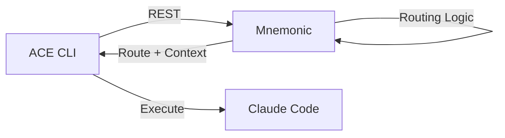
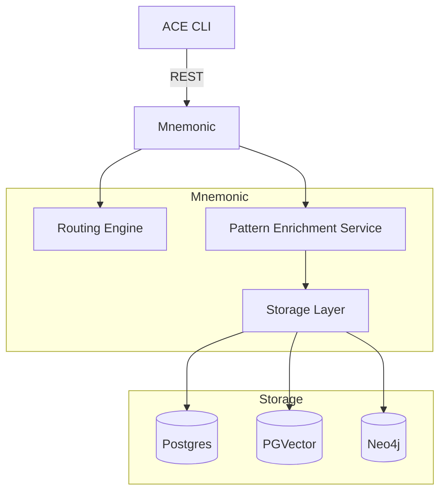
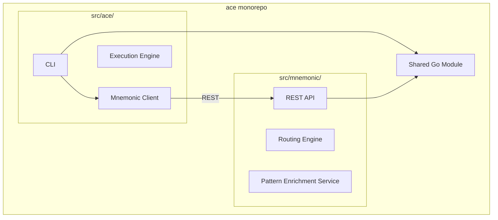
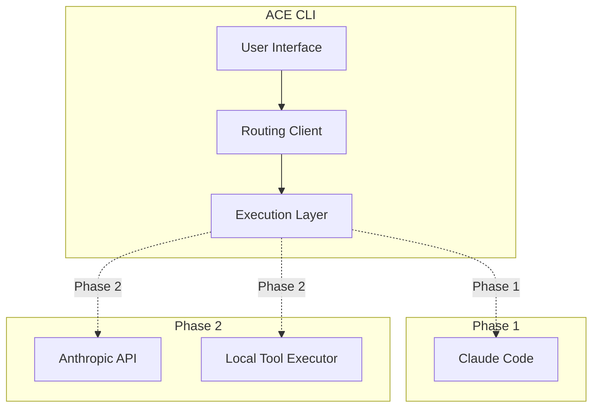

# Architectural Decisions

[Back to Overview](00-overview.md) | [Back to Project README](../../README.md)

## Table of Contents

- [Decision Record Format](#decision-record-format)
- [ADR-001: Orchestrator Model](#adr-001-orchestrator-model)
- [ADR-002: Routing Location](#adr-002-routing-location)
- [ADR-003: Claude Code Integration Strategy](#adr-003-claude-code-integration-strategy)
- [ADR-004: Unified Backend with REST API](#adr-004-unified-backend-with-rest-api)
- [ADR-005: Monorepo Structure](#adr-005-monorepo-structure)
- [ADR-006: Phased Evolution Path](#adr-006-phased-evolution-path)
- [Decision Summary](#decision-summary)

## Decision Record Format

Each architectural decision follows this structure:

- **Context**: The situation and forces at play
- **Decision**: What we decided to do
- **Consequences**: The results of the decision, both positive and negative

## ADR-001: Orchestrator Model

### Context

We needed to decide whether ACE should:

1. Replace Claude Code entirely with a custom implementation
2. Wrap Claude Code with additional functionality
3. Orchestrate Claude Code as an execution engine

Teams already use Claude Code effectively. The challenge is coordination and shared knowledge, not the underlying LLM capabilities.

### Decision

**ACE is an orchestration layer on top of Claude Code, not a replacement.**

ACE provides:

- Deterministic routing logic (code-based, not LLM-driven)
- Dynamic patterns from Mnemonic (the unified backend)
- Local execution via Claude Code (Phase 1) or direct Anthropic API (Phase 2)

### Consequences

**Positive:**

- Preserves existing Claude Code workflows and capabilities
- Teams can adopt ACE incrementally
- Reduces implementation complexity significantly
- Benefits from Claude Code's tool ecosystem and updates

**Negative:**

- Depends on Claude Code for Phase 1 (external dependency)
- Limited control over Claude Code's internal behavior
- Must design for eventual Phase 2 transition

## ADR-002: Routing Location

### Context

Routing logic could live in:

1. **Client-side (CLI)**: Each workstation has its own routing rules
2. **Server-side (API)**: Centralized routing service
3. **Hybrid**: Basic routing client-side, complex routing server-side

Key considerations:

- Team collaboration requires shared routing rules
- Routing updates should not require client deployments
- Routing decisions should be auditable

### Decision

**Routing logic lives server-side in Mnemonic.**

The CLI sends requests to Mnemonic, which determines the appropriate route and returns enriched context. The CLI then invokes Claude Code locally.

### Consequences

**Positive:**

- Centralized routing enables team-wide consistency
- Routing updates deploy once, affect all users immediately
- Routing decisions can be logged and analyzed centrally
- No client updates needed for routing changes

**Negative:**

- Requires network connectivity to Mnemonic
- Mnemonic becomes a dependency for all operations
- Must handle Mnemonic unavailability gracefully

## ADR-003: Claude Code Integration Strategy

### Context

Claude Code can be invoked in several ways:

1. **Direct CLI invocation**: ACE CLI spawns Claude Code as a subprocess
2. **API integration**: ACE CLI calls Claude Code's API (if available)
3. **Wrapper script**: ACE provides a script that wraps Claude Code commands

The integration must:

- Pass enriched context (routing + patterns) to Claude Code
- Capture and return results to the user
- Work with Claude Code's existing interface

### Decision

**ACE CLI invokes Claude Code directly as the execution engine.**

The CLI:

1. Receives routing decision and patterns from Mnemonic
2. Constructs an enriched prompt with context
3. Invokes Claude Code with the enriched prompt
4. Returns results to the user

### Consequences

**Positive:**

- Leverages Claude Code's full capabilities
- Minimal wrapper complexity
- Users see familiar Claude Code behavior
- File operations handled natively by Claude Code

**Negative:**

- Claude Code must be installed and configured
- Limited control over Claude Code's internal processing
- Must handle Claude Code version differences

## ADR-004: Unified Backend with REST API

### Context

We needed to decide how to structure the backend services and what protocol to use for CLI-to-server communication.

Options considered:

1. **Separate services**: ACE API for routing + separate Shared Memory Service for patterns
2. **Unified backend**: Single service (Mnemonic) handling both routing and patterns
3. **Protocol options**: REST, gRPC, or MCP for external API

Key considerations:

- Simplicity of deployment and operations
- Developer experience for CLI integration
- Debugging and tooling support
- Future extensibility

### Decision

**Mnemonic is the unified backend providing both routing and pattern retrieval via REST API.**

For MVP, Mnemonic serves only ACE (not a general-purpose memory service). This keeps the scope focused while the architecture matures.

See [Communication Patterns](04-communication-patterns.md#rest-endpoints) for REST endpoint details.

### Consequences

**Positive:**

- Single backend simplifies deployment and operations
- REST is universally understood with excellent tooling
- Easy to debug with curl, Postman, browser dev tools
- No protocol translation between services
- MVP scope keeps complexity manageable

**Negative:**

- REST less efficient than gRPC for internal communication
- Single service means single point of failure
- MVP scope limits immediate reusability for other tools

## ADR-005: Monorepo Structure

### Context

We needed to decide how to organize the codebase for ACE CLI and Mnemonic backend.

Options considered:

1. **Monorepo**: Single repository containing both CLI and Mnemonic
2. **Separate repos**: Distinct repositories for CLI and backend

Key considerations:

- Atomic changes across CLI and server
- Shared tooling and infrastructure
- Dependency management simplicity
- CI/CD flexibility

### Decision

**ACE is a monorepo containing two binaries built from a single Go module.**

| Directory | Purpose |
|-----------|---------|
| **src/ace/** | CLI client that orchestrates routing decisions and Claude Code execution |
| **src/mnemonic/** | Backend server providing routing and pattern retrieval via REST API |

GitHub Actions path filters enable independent CI/CD pipelines while maintaining the benefits of a unified codebase.

### Consequences

**Positive:**

- Atomic commits across CLI and server ensure consistency
- Shared tooling (linting, testing infrastructure, build scripts)
- Simpler dependency management with single Go module
- Single versioning story for coordinated releases
- Path-filtered CI/CD allows independent builds when needed
- Easier refactoring when interfaces change

**Negative:**

- Repository size grows with both components
- CI/CD requires path filtering configuration
- All contributors have access to entire codebase

## ADR-006: Phased Evolution Path

### Context

The architecture must support:

- **Phase 1**: Claude Code as the execution engine (MVP)
- **Phase 2**: Direct Anthropic API calls (future)

This transition should be:

- Transparent to users
- Achievable without architectural rewrites
- Optional (teams can stay on Phase 1 if preferred)

### Decision

**Design for Phase 2 from the start, implement Phase 1 first.**

The CLI abstracts the execution layer:

- Phase 1: Execution layer calls Claude Code
- Phase 2: Execution layer calls Anthropic API directly

### Consequences

**Positive:**

- Clear evolution path reduces future rework
- Phase 1 delivers value quickly
- Phase 2 removes Claude Code dependency
- Teams can choose their preferred execution model

**Negative:**

- Phase 2 requires implementing tool execution locally
- Must maintain two execution paths (at least during transition)
- Phase 2 complexity is deferred, not eliminated

## Decision Summary

| Decision | Choice | Rationale |
|----------|--------|-----------|
| ADR-001 | Orchestrator model | Leverage existing Claude Code capabilities |
| ADR-002 | Server-side routing | Enable team collaboration and central management |
| ADR-003 | Direct CLI invocation | Minimize wrapper complexity |
| ADR-004 | Unified backend with REST | Simplicity, excellent tooling, easy debugging |
| ADR-005 | Monorepo structure | Atomic changes, shared tooling, simpler dependencies |
| ADR-006 | Phased evolution | Deliver value early, design for future |

**Next:** [System Architecture](03-system-architecture.md)
