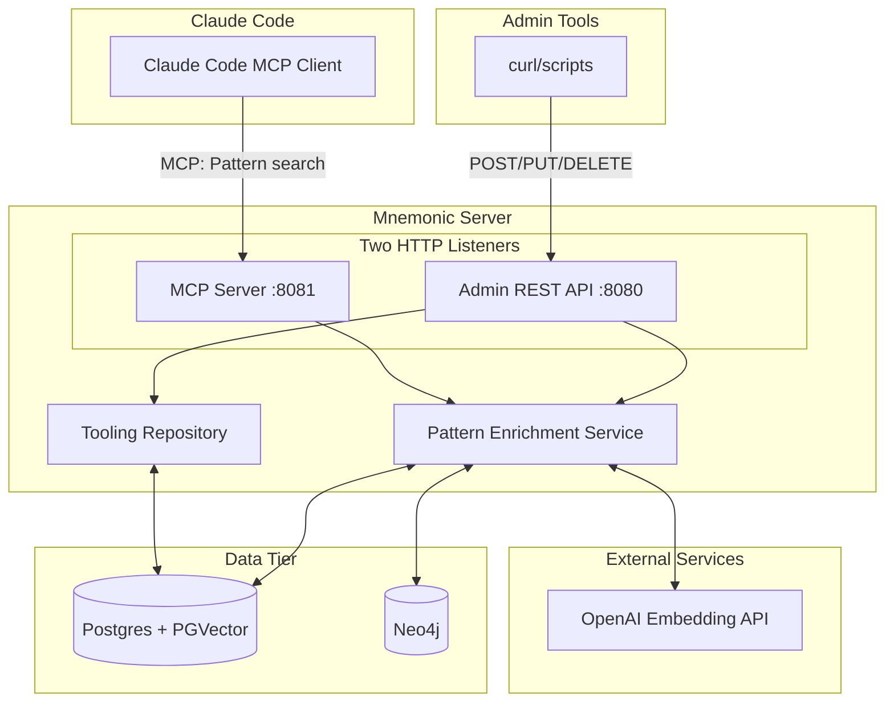
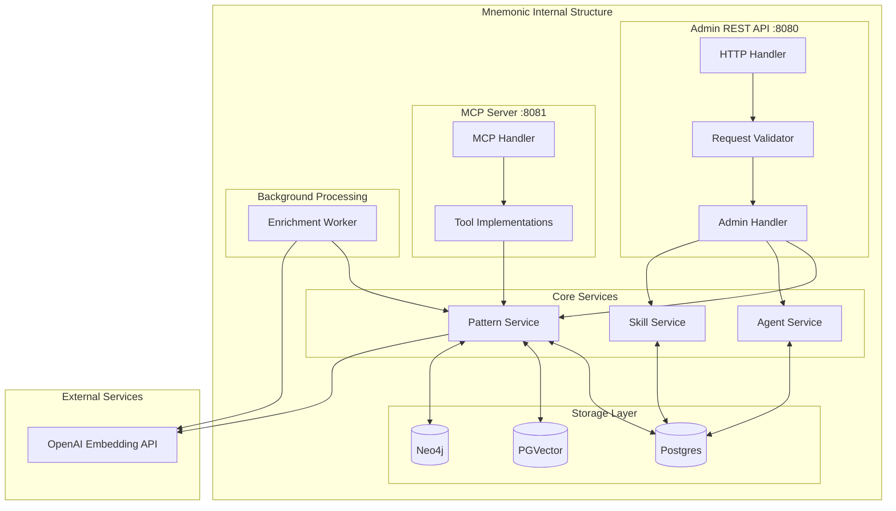
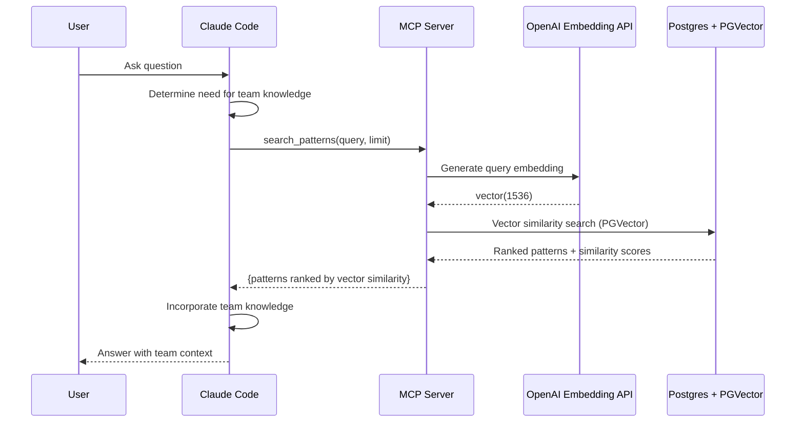
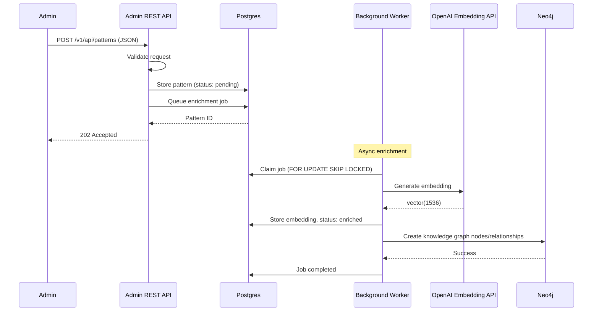
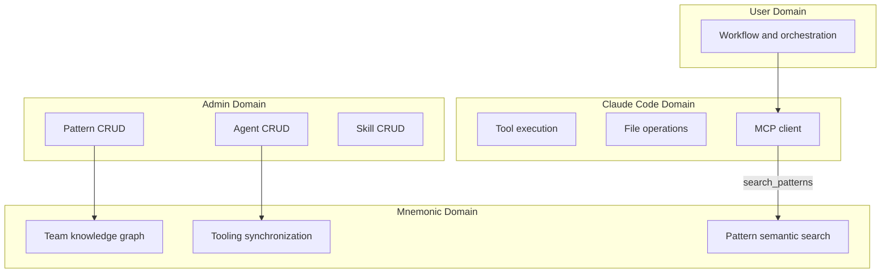
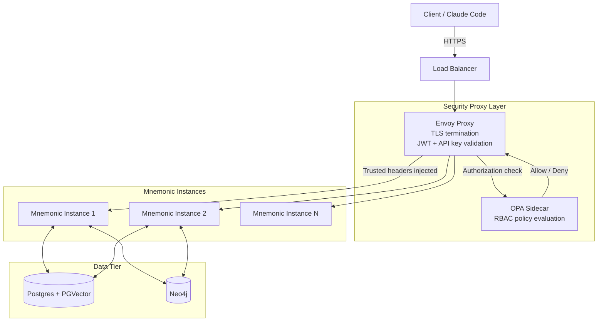

# System Architecture

[Back to Overview](README.md) | [Back to Project README](../../README.md)

## Table of Contents

- [Architecture Overview](#architecture-overview)
- [Component Breakdown](#component-breakdown)
  - [Mnemonic Server](#mnemonic-server)
  - [Claude Code Integration](#claude-code-integration)
- [Data Flow](#data-flow)
- [Component Interactions](#component-interactions)
- [Boundary Definitions](#boundary-definitions)
  - [Cross-Cutting Concerns](#cross-cutting-concerns)
- [Post-MVP](#post-mvp)
  - [Expanded Component Topology](#expanded-component-topology)
  - [Boundary Changes](#boundary-changes)
  - [Multiple Instances](#multiple-instances)

## Architecture Overview

Mnemonic follows a single-server architecture with dual protocol interfaces: REST for administration and MCP for Claude Code integration.

## Component Breakdown

### Mnemonic Server

Mnemonic is a single Go server with two HTTP listeners providing team knowledge graph and tooling synchronization.

**Responsibilities:**

- **Admin REST API** (`:8080`): CRUD operations for patterns, agents, and skills
- **MCP Server** (`:8081`): Read-only pattern search for Claude Code (3 tools)
- **Pattern enrichment**: Semantic search via PGVector, knowledge graph via Neo4j
- **Tooling synchronization**: Shared agent and skill definitions across team

**Key Characteristics:**

- Single server process, two HTTP listeners
- Lightweight service (calls embedding API only; no generative inference)
- Stateless request handling
- Dual protocol architecture (REST admin + MCP read-only)
- Full storage stack: Postgres + PGVector + Neo4j

**What Mnemonic Does NOT Do:**

- Perform LLM inference (Mnemonic calls an embedding API for pattern enrichment, but does not perform generative AI inference)
- Store user credentials
- Execute tools or file operations
- Maintain session state

### Claude Code Integration

Claude Code integrates with Mnemonic via the MCP (Model Context Protocol) interface.

**MCP Tools Provided (3 pattern search tools):**

| Tool                    | Purpose                                  |
| ----------------------- | ---------------------------------------- |
| `search_patterns`       | Semantic search over team knowledge graph |
| `find_related_patterns` | Find patterns related to a given pattern |
| `get_pattern`           | Retrieve specific pattern by ID          |

For full tool definitions and parameters, see [MCP Tools](08-mcp-tools.md).

**Integration Characteristics:**

- Read-only access via MCP
- Runs in trusted environment (local network)
- No authentication (MVP)
- Searches team knowledge for workflow patterns

## Data Flow

The following diagrams show data flow for the two primary use cases.

### Pattern Search via MCP

Post-MVP: search_patterns will incorporate Neo4j graph scores for blended ranking.

### Data Loading via Admin API

## Component Interactions

### Claude Code to MCP Server

| Aspect            | Detail                                         |
| ----------------- | ---------------------------------------------- |
| Protocol          | MCP over Streamable HTTP                       |
| Authentication    | None (MVP, local trusted environment)          |
| Request contains  | MCP tool name, parameters                      |
| Response contains | Search results, pattern details               |

### Admin Tools to REST API

| Aspect            | Detail                                                                            |
| ----------------- | --------------------------------------------------------------------------------- |
| Protocol          | REST (HTTP/HTTPS)                                                                 |
| Authentication    | None (MVP); see [Security Architecture](01-security-architecture.md) for Post-MVP |
| Request contains  | JSON payloads for CRUD operations                                                 |
| Response contains | Created/updated resources, success/error status                                   |

### Mnemonic to Storage Layer

| Aspect   | Detail                           |
| -------- | -------------------------------- |
| Postgres | Relational data, pattern storage |
| PGVector | Semantic search via embeddings   |
| Neo4j    | Knowledge graph relationships    |

## Boundary Definitions

Clear boundaries separate concerns between components.

**Boundary Rules:**

- The user drives all workflow and orchestration decisions
- Claude Code is the interface; Mnemonic is the memory
- Pattern storage and search live only in Mnemonic
- Tooling definitions (agents, skills) managed via admin API
- File operations happen only on the workstation
- Mnemonic never receives or stores user credentials

### Cross-Cutting Concerns

- **Observability**: Mnemonic emits structured logs, exposes a health check endpoint, and publishes metrics on both interfaces. See [Observability Architecture](07-observability-architecture.md).
- **Schema migration**: Migrations are applied externally by `golang-migrate` CLI as a deployment step. Mnemonic verifies schema compatibility at startup but does not run migrations. See [Data Architecture - Migration Strategy](04-data-architecture.md#migration-strategy).

## Post-MVP

This section covers system-level changes when moving from local MVP to cloud or production deployment. It does not repeat MVP content — refer to the sections above for the single-instance topology.

### Expanded Component Topology

In production, a security proxy layer sits in front of Mnemonic. Envoy handles TLS termination and identity validation; OPA evaluates authorization policy as a sidecar. Multiple Mnemonic instances run behind a load balancer.

The request path is: Client → Load Balancer → Envoy (TLS + identity validation) → OPA check → Mnemonic.

See [Security Architecture - Component Architecture](01-security-architecture.md#component-architecture) for a detailed view of the Envoy and OPA configuration, and [Deployment Architecture - Post-MVP](06-deployment-architecture.md#post-mvp) for the full production deployment topology.

### Boundary Changes

The [MVP Boundary Definitions](#boundary-definitions) assume a trusted local network — Mnemonic accepts all traffic without verifying caller identity. In production the trust model shifts:

- Mnemonic only accepts traffic from Envoy (network isolation enforces this)
- Client-provided identity headers are stripped by Envoy before requests reach Mnemonic
- Mnemonic trusts the identity headers that Envoy injects (`X-User-ID`, `X-Team-ID`, `X-User-Roles`), not raw request headers
- Admin API requests must pass through the same auth path before reaching Mnemonic

Mnemonic itself requires no changes to authentication logic — it reads injected headers and proceeds. The security boundary is enforced externally.

See [Security Architecture - Identity Headers](01-security-architecture.md#identity-headers) for the full header specification.

### Multiple Instances

Mnemonic is stateless — all state lives in Postgres and Neo4j — so multiple instances can run behind a load balancer without coordination between them. Each instance is identical.

Two areas to review when scaling out:

- **Connection pool sizing**: Each instance holds its own connection pool. With N instances, total connections to Postgres and Neo4j multiply by N. See [Data Architecture - Connection Pool Configuration](04-data-architecture.md#connection-pool-configuration) for pool sizing guidance.
- **Background enrichment workers**: The enrichment worker uses `FOR UPDATE SKIP LOCKED` when claiming jobs, which is already part of the MVP design. This ensures safe concurrent access across instances without duplicate processing.

**Next:** [Communication Patterns](03-communication-patterns.md)
