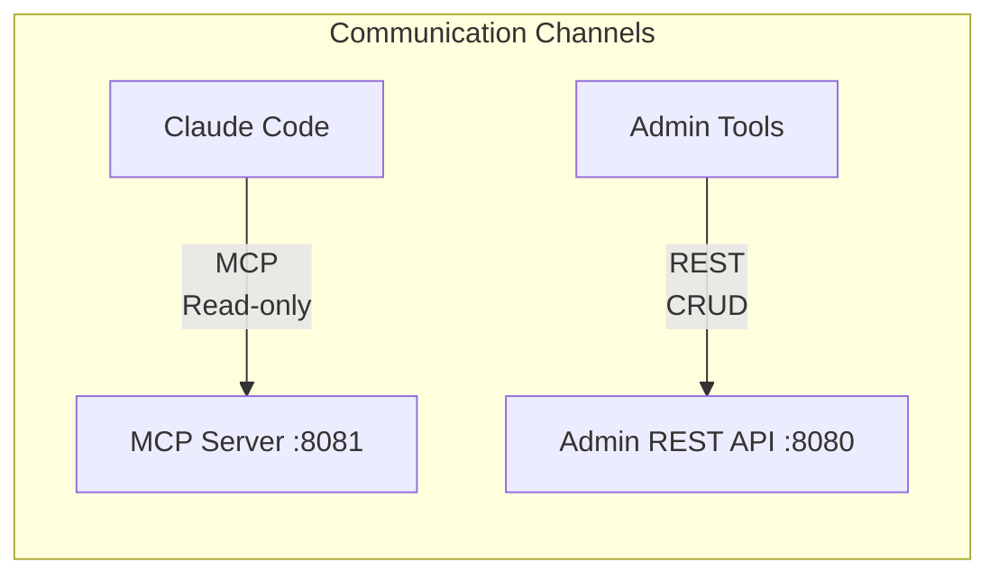
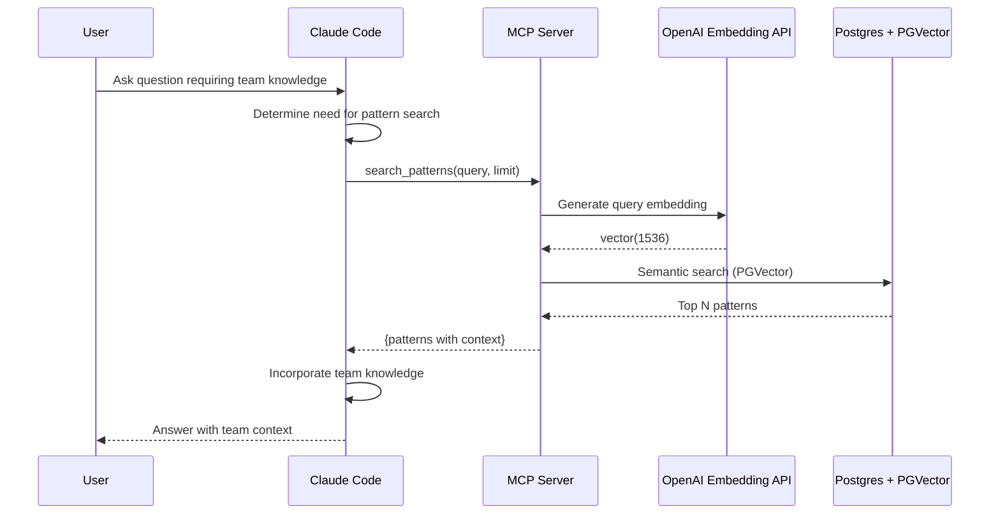
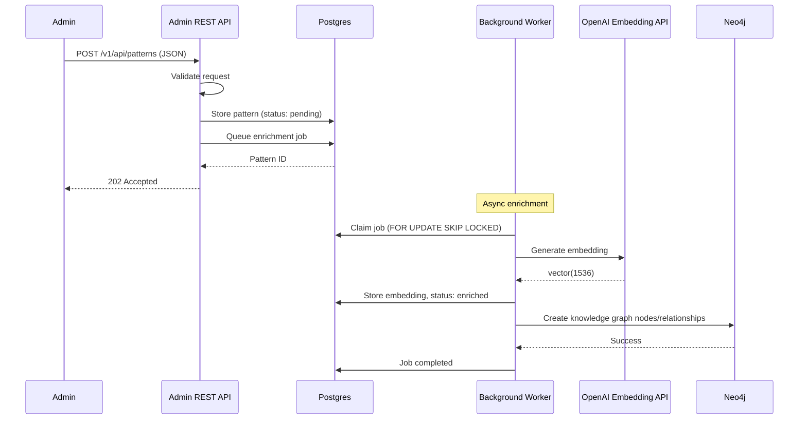
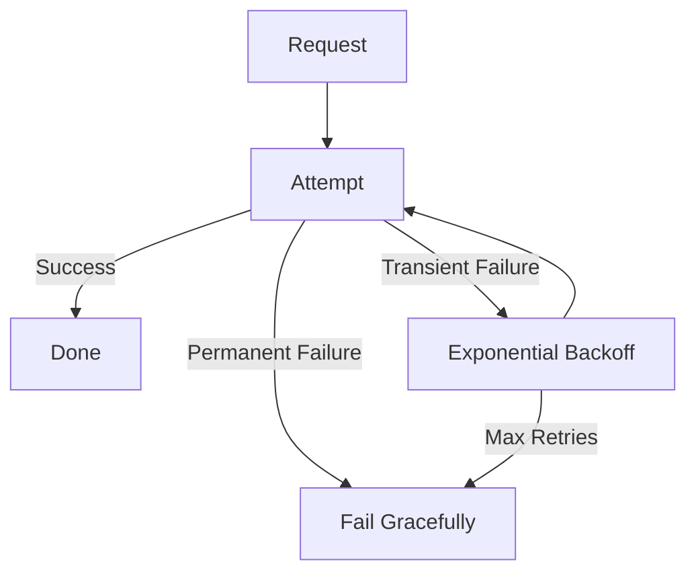
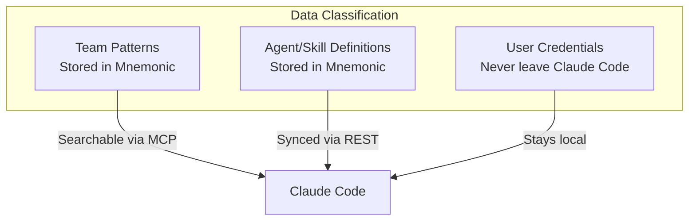

# Communication Patterns

[Back to Overview](README.md) | [Back to Project README](../../README.md)

## Table of Contents

- [Overview](#overview)
- [Claude Code to MCP Server Communication](#claude-code-to-mcp-server-communication)
  - [MCP Tools](#mcp-tools)
  - [Request Flow](#request-flow)
  - [Response Structure](#response-structure)
  - [Error Handling](#error-handling)
- [Admin to REST API Communication](#admin-to-rest-api-communication)
  - [Admin Operations](#admin-operations)
- [Resilience Patterns](#resilience-patterns)
- [Security Considerations](#security-considerations)

## Overview

Mnemonic uses a dual protocol architecture with distinct communication patterns for each use case.



## Claude Code to MCP Server Communication

Claude Code communicates with Mnemonic via MCP (Model Context Protocol) for read-only access to team knowledge and tooling.

### MCP Tools

Mnemonic exposes 3 read-only MCP tools for Claude Code:

**Pattern Search:**

| Tool                    | Parameters                                                                           | Purpose                                   |
| ----------------------- | ------------------------------------------------------------------------------------ | ----------------------------------------- |
| `search_patterns`       | `query: string, limit?: number, threshold?: number, tags?: string[], agent?: string` | Semantic search over team knowledge graph |
| `find_related_patterns` | `pattern_id: string, limit?: number`                                                 | Find patterns related to a given pattern  |
| `get_pattern`           | `id: string`                                                                         | Retrieve specific pattern by ID           |

For full tool definitions and parameters, see [MCP Tools](08-mcp-tools.md).

### Request Flow



> **Post-MVP enhancement:** A future version of `search_patterns` will blend PGVector similarity scores with Neo4j graph context for improved ranking. At that point, the sequence diagram above will include a Neo4j query step after the PGVector search.

**Request Characteristics:**

- Synchronous request-response via MCP protocol
- Read-only access (no mutations)
- Runs on localhost in a trusted environment
- No authentication (MVP, localhost only)

### Response Structure

MCP tool responses provide structured data for Claude Code integration.

**Pattern Search Response:**

MCP tool results are delivered as text content. Pattern search tools return markdown-formatted text with structured data (scores, metadata) embedded in the prose:

```json
{
  "content": [
    {
      "type": "text",
      "text": "Found 2 patterns matching 'error handling in Go' (filtered by agent: go-software-engineer):\n\n---\n\n## go-error-handling (92% match)\n\n**Tags:** go, errors, best-practices\n\n# Go Error Handling Pattern\n\nGo uses explicit error handling with the error interface...\n\n---\n\n## go-custom-error-types (85% match)\n\n**Tags:** go, errors, domain-driven\n\n# Custom Error Types\n\nFor domain errors, define types that implement the error interface..."
    }
  ]
}
```

### Error Handling

Claude Code must handle MCP server errors gracefully.

| Error Type         | Meaning               | Claude Code Behavior            |
| ------------------ | --------------------- | ------------------------------- |
| Tool not found     | Unknown MCP tool      | Fall back to local knowledge    |
| Invalid parameters | Malformed request     | Display error, suggest retry    |
| Server error       | Mnemonic unavailable  | Continue without team knowledge |
| Timeout            | Request took too long | Display timeout, suggest retry  |

## Admin to REST API Communication

Admin tools (curl, scripts) communicate with Mnemonic via REST API for CRUD operations on patterns and tooling. The REST API supports full CRUD for agents, skills, and patterns.

> **API Reference:** See the [Pivot API Specification](../design/2026-02-15-pivot-api-specification.md) and the OpenAPI spec (`mnemonic-v1.yaml`) for complete endpoint reference including request/response schemas.

### Admin Operations



**Request Characteristics:**

- Synchronous request-response
- JSON payloads for all operations
- No authentication (MVP, localhost only); see [Security Architecture](01-security-architecture.md) for Post-MVP
- Idempotent operations where possible

## Resilience Patterns

### Timeout Handling

Each communication channel has timeout considerations.

| Channel            | Timeout Strategy                               |
| ------------------ | ---------------------------------------------- |
| Claude Code to MCP | 30s - pattern search with embedding generation |
| Admin to REST API  | 30s - pattern creation returns 202 immediately |

### Retry Logic



**Retry Considerations:**

- Idempotent operations only
- Exponential backoff
- Maximum retry limits (3 attempts)
- Clear failure messaging

### Fallback Behavior

When components are unavailable:

| Scenario                 | Fallback                                     |
| ------------------------ | -------------------------------------------- |
| MCP server unreachable   | Claude Code continues without team knowledge |
| Admin API unavailable    | Display error, suggest retry later           |
| Database connection lost | Return 503 Service Unavailable               |

## Security Considerations

### Data in Transit

| Channel            | Security Requirement                                                                |
| ------------------ | ----------------------------------------------------------------------------------- |
| Claude Code to MCP | Local network (no TLS for MVP)                                                      |
| Admin to REST API  | No TLS (MVP); see [Security Architecture](01-security-architecture.md) for Post-MVP |

### Sensitive Data Handling



**Key Principles:**

- User credentials never leave Claude Code
- Patterns and tooling are team-shared (no user-specific secrets)
- MCP read-only access prevents accidental data modification
- No authentication in MVP. Post-MVP: authentication and authorization handled externally by Envoy and OPA.
- All LLM calls go directly from Claude Code to Anthropic API

**Next:** [Data Architecture](04-data-architecture.md)
