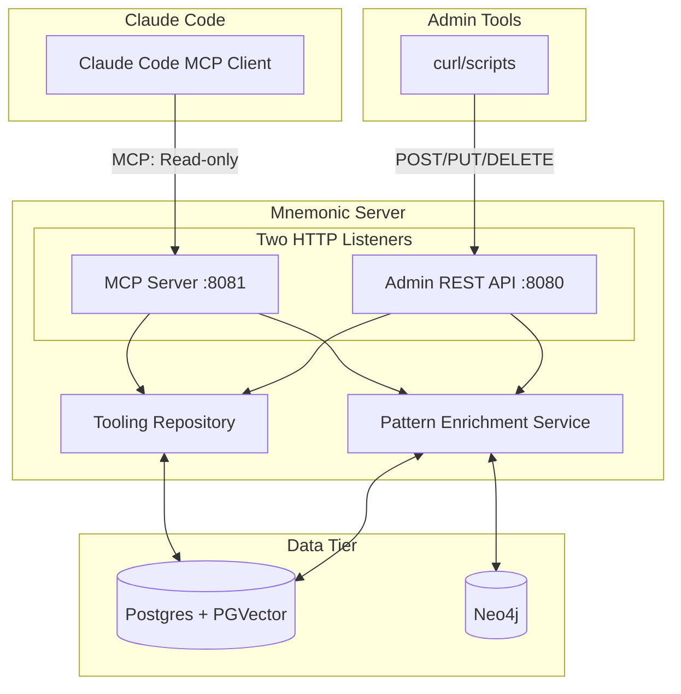
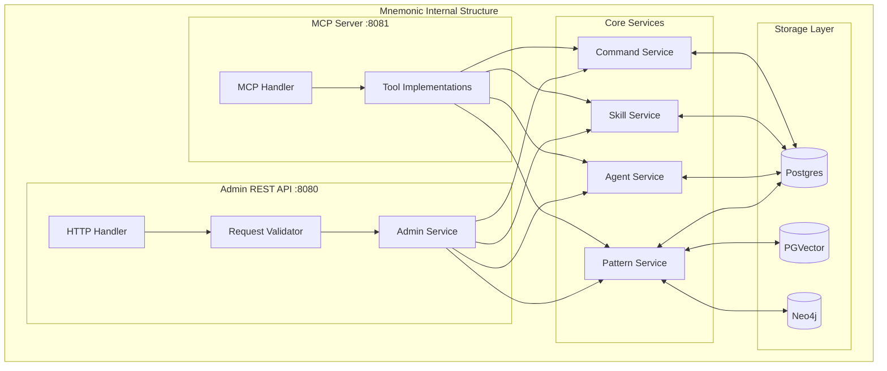
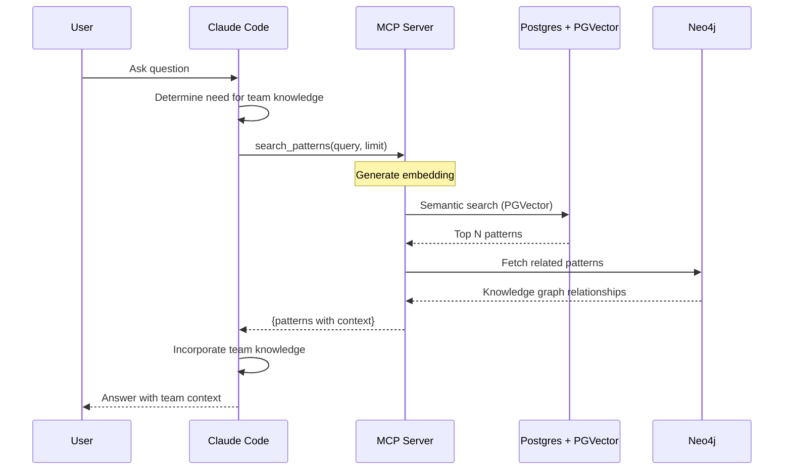
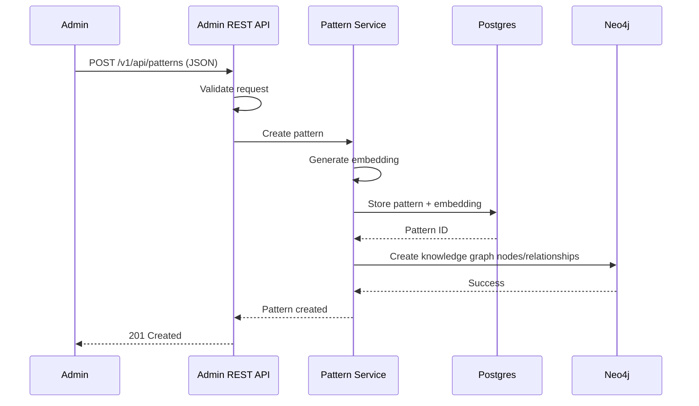
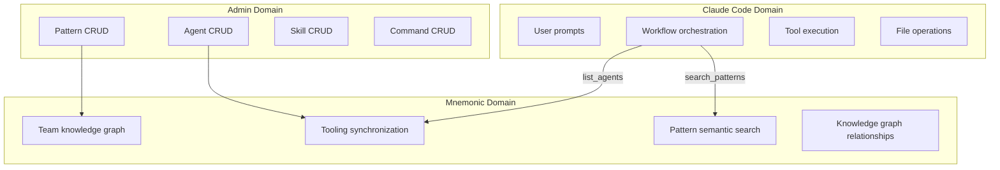

# System Architecture

[Back to Overview](00-overview.md) | [Back to Project README](../../README.md)

## Table of Contents

- [Architecture Overview](#architecture-overview)
- [Component Breakdown](#component-breakdown)
  - [Mnemonic Server](#mnemonic-server)
  - [Claude Code Integration](#claude-code-integration)
- [Data Flow](#data-flow)
- [Component Interactions](#component-interactions)
- [Boundary Definitions](#boundary-definitions)

## Architecture Overview

Mnemonic follows a single-server architecture with dual protocol interfaces: REST for administration and MCP for Claude Code integration.

## Component Breakdown

### Mnemonic Server

Mnemonic is a single Go server with two HTTP listeners providing team knowledge graph and tooling synchronization.

**Responsibilities:**

- **Admin REST API** (`:8080`): CRUD operations for patterns, agents, skills, commands
- **MCP Server** (`:8081`): Read-only access to knowledge graph and tooling for Claude Code
- **Pattern enrichment**: Semantic search via PGVector, knowledge graph via Neo4j
- **Tooling synchronization**: Shared agent, skill, command definitions across team

**Key Characteristics:**

- Single server process, two HTTP listeners
- Lightweight service (no LLM calls)
- Stateless request handling
- Dual protocol architecture (REST admin + MCP read-only)
- Full storage stack: Postgres + PGVector + Neo4j

**What Mnemonic Does NOT Do:**

- Make LLM API calls
- Store user credentials
- Route prompts to agents (user orchestrates)
- Execute tools or file operations
- Maintain session state

### Claude Code Integration

Claude Code integrates with Mnemonic via the MCP (Model Context Protocol) interface.

**MCP Tools Provided (11 total):**

| Tool | Purpose |
| ---- | ------- |
| `search_patterns` | Semantic search over team knowledge graph |
| `find_related_patterns` | Find patterns related to a given pattern |
| `get_pattern` | Retrieve specific pattern by ID |
| `list_agents` | List all available agents |
| `get_agent` | Get detailed agent information |
| `list_skills` | List all available skills |
| `get_skill` | Get detailed skill information |
| `get_skill_files` | Get skill child files (scripts, references, assets) |
| `list_commands` | List all available commands |
| `get_command` | Get detailed command information |
| `get_sync_manifest` | Get synchronization manifest for tooling |

**Integration Characteristics:**

- Read-only access via MCP
- Runs in trusted environment (local network)
- No authentication for MVP (Phase 1)
- Searches team knowledge for workflow patterns
- Discovers consistent tooling across team

## Data Flow

The following diagrams show data flow for the two primary use cases.

### Pattern Search via MCP

### Data Loading via Admin API

## Component Interactions

### Claude Code to MCP Server

| Aspect            | Detail                                       |
| ----------------- | -------------------------------------------- |
| Protocol          | MCP over Streamable HTTP                     |
| Authentication    | None (MVP, trusted environment)              |
| Request contains  | MCP tool name, parameters                    |
| Response contains | Search results, pattern details, tooling lists |

### Admin Tools to REST API

| Aspect            | Detail                                       |
| ----------------- | -------------------------------------------- |
| Protocol          | REST (HTTP/HTTPS)                            |
| Authentication    | None (MVP), Envoy + OPA (Phase 2)            |
| Request contains  | JSON payloads for CRUD operations            |
| Response contains | Created/updated resources, success/error status |

### Mnemonic to Storage Layer

| Aspect            | Detail                                       |
| ----------------- | -------------------------------------------- |
| Postgres          | Relational data, pattern storage             |
| PGVector          | Semantic search via embeddings               |
| Neo4j             | Knowledge graph relationships                |

## Boundary Definitions

Clear boundaries separate concerns between components.

**Boundary Rules:**

- User credentials never leave Claude Code
- Pattern storage and search live only in Mnemonic
- Tooling definitions (agents, skills, commands) managed via admin API
- File operations happen only on the workstation
- User orchestrates workflow; Mnemonic provides knowledge and consistent tooling

**Next:** [Communication Patterns](04-communication-patterns.md)
