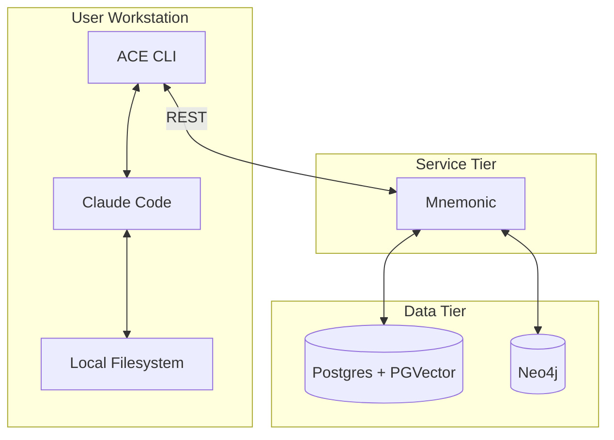
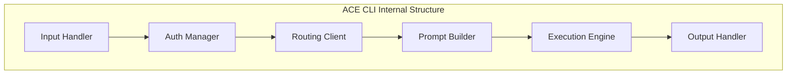
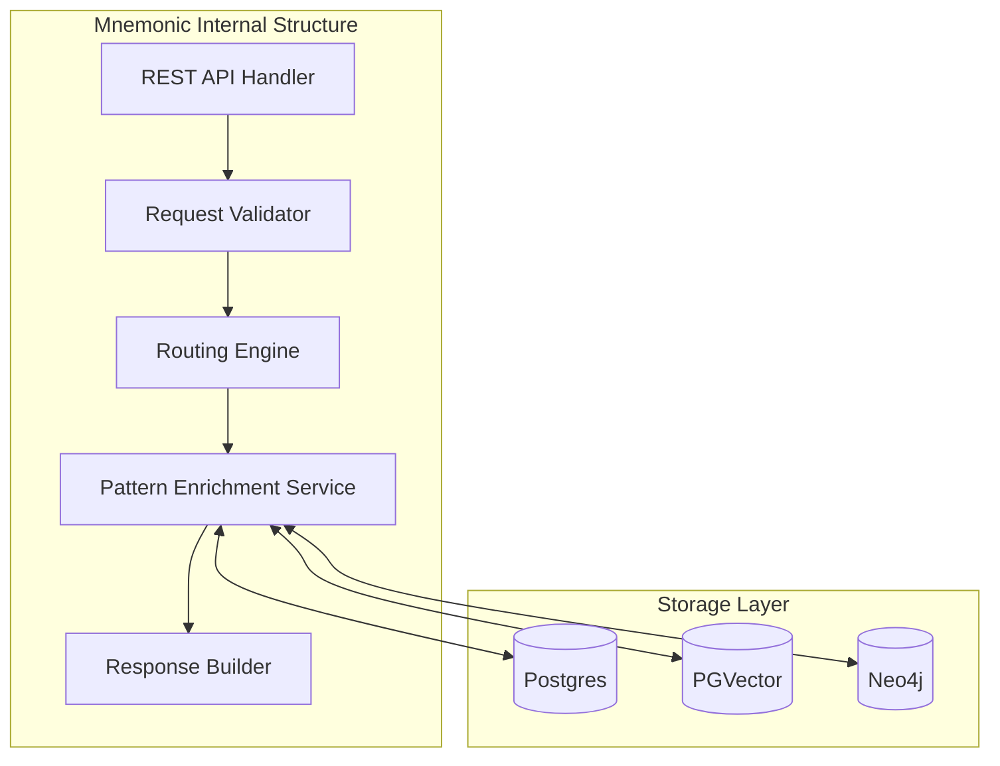
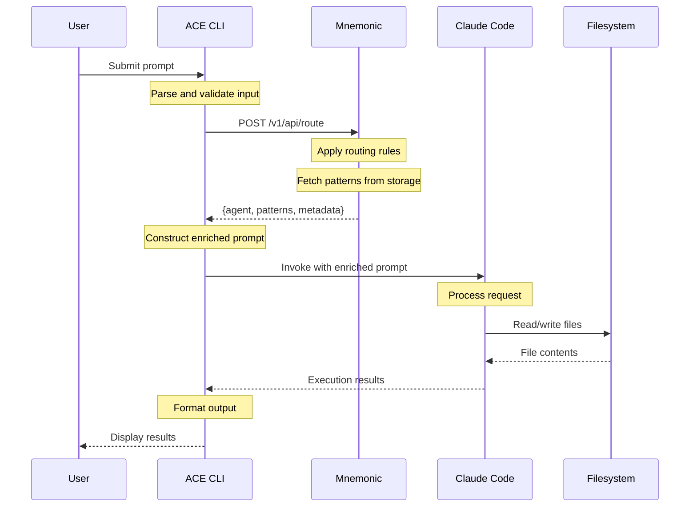
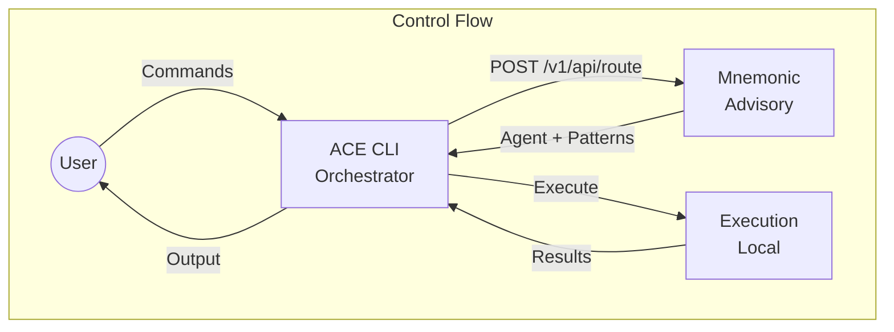
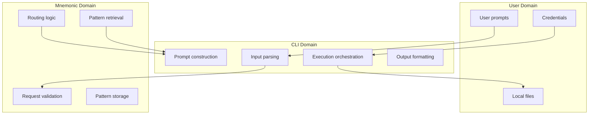

# System Architecture

[Back to Overview](00-overview.md) | [Back to Project README](../../README.md)

## Table of Contents

- [Architecture Overview](#architecture-overview)
- [Component Breakdown](#component-breakdown)
  - [ACE CLI](#ace-cli)
  - [Mnemonic](#mnemonic)
- [Data Flow](#data-flow)
- [CLI-Centric Model](#cli-centric-model)
- [Component Interactions](#component-interactions)
- [Boundary Definitions](#boundary-definitions)

## Architecture Overview

ACE follows a distributed architecture with clear separation between client-side execution and server-side orchestration.

## Component Breakdown

### ACE CLI

The CLI is the primary user interface and orchestrates local execution.

**Responsibilities:**

- Accept user prompts and commands
- Request routing decisions from Mnemonic
- Construct enriched prompts with patterns and context
- Invoke Claude Code (Phase 1) or Anthropic API (Phase 2)
- Display results to the user

**Key Characteristics:**

- Runs on user workstation
- Stateless between invocations (state lives in Mnemonic)
- Handles authentication to external services
- Manages local execution environment

### Mnemonic

Mnemonic is the backend server that provides routing decisions and pattern retrieval via REST API. For MVP, Mnemonic serves only ACE (not a general-purpose memory service).

**Responsibilities:**

- Receive routing requests from CLI instances
- Apply deterministic routing logic to select the appropriate agent
- Retrieve relevant patterns for context enrichment
- Return routing decision and patterns to CLI

**Key Characteristics:**

- Lightweight service (no LLM calls)
- Deterministic routing (code-based logic)
- Stateless request handling
- REST API interface
- Full storage stack: Postgres + PGVector + Neo4j

See [Communication Patterns](04-communication-patterns.md#rest-endpoints) for REST endpoint details.

**Routing Rule Cache (MVP):**

- Routing rules are loaded once at startup from the database
- Service restart is required to reload rules if they change
- Background refresh with configurable TTL is planned for Post-MVP

**What Mnemonic Does NOT Do:**

- Make LLM API calls
- Store user credentials
- Execute tools or file operations
- Maintain session state

## Data Flow

The following diagram shows the complete data flow for a typical request.

## CLI-Centric Model

ACE follows a CLI-centric model where:

1. **CLI is the orchestrator**: The CLI coordinates between user, Mnemonic, and execution engine
2. **Mnemonic is advisory**: Mnemonic provides routing decisions but does not execute
3. **Execution is local**: All LLM interactions and tool execution happen on the workstation

**Benefits of CLI-Centric Model:**

- No server-side LLM costs
- User data stays local
- Works offline after routing decision (with caching)
- Leverages existing Claude Code setup

## Component Interactions

### CLI to Mnemonic

| Aspect            | Detail                                       |
| ----------------- | -------------------------------------------- |
| Protocol          | REST (HTTP/HTTPS)                            |
| Authentication    | To be specified in design phase              |
| Request contains  | Full prompt, context hints, user preferences |
| Response contains | Agent identifier, patterns, execution hints  |

**Note:** Full prompts are sent to Mnemonic for routing but are not persisted. Mnemonic is organization-controlled infrastructure and requires the full prompt for accurate routing via keyword matching, regex, and semantic similarity.

See [Communication Patterns](04-communication-patterns.md#rest-endpoints) for REST endpoint details.

### CLI to Claude Code

| Aspect            | Detail                                                                 |
| ----------------- | ---------------------------------------------------------------------- |
| Invocation method | Direct subprocess invocation (see ADR-003 in Architectural Decisions) |
| Context passing   | Enriched prompt with routing decision and patterns from Mnemonic       |
| Result capture    | Standard output/error streams from Claude Code process                 |

See [ADR-003: Claude Code Integration Strategy](02-architectural-decisions.md#adr-003-claude-code-integration-strategy) for the full specification of the execution model.

## Boundary Definitions

Clear boundaries separate concerns between components.

**Boundary Rules:**

- User credentials never leave the CLI
- Routing logic lives only in Mnemonic
- Pattern storage lives only in Mnemonic
- File operations happen only on the workstation

**Next:** [Communication Patterns](04-communication-patterns.md)
