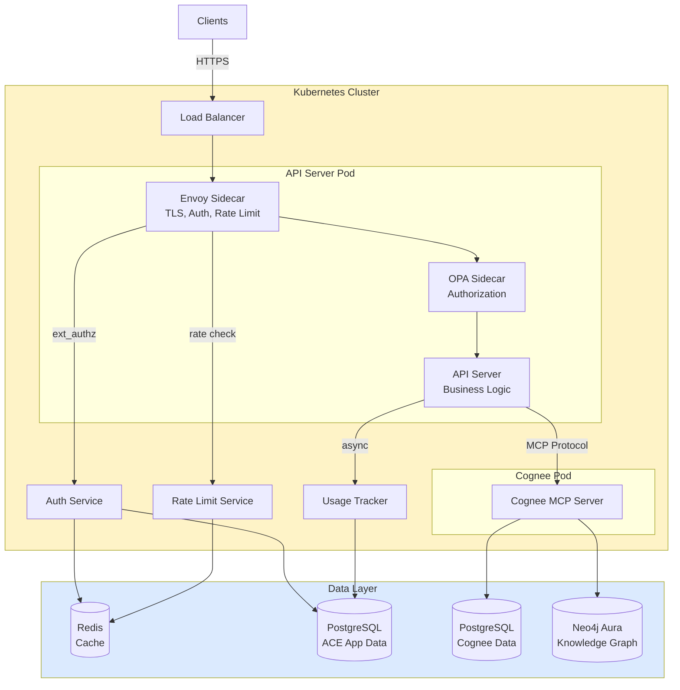
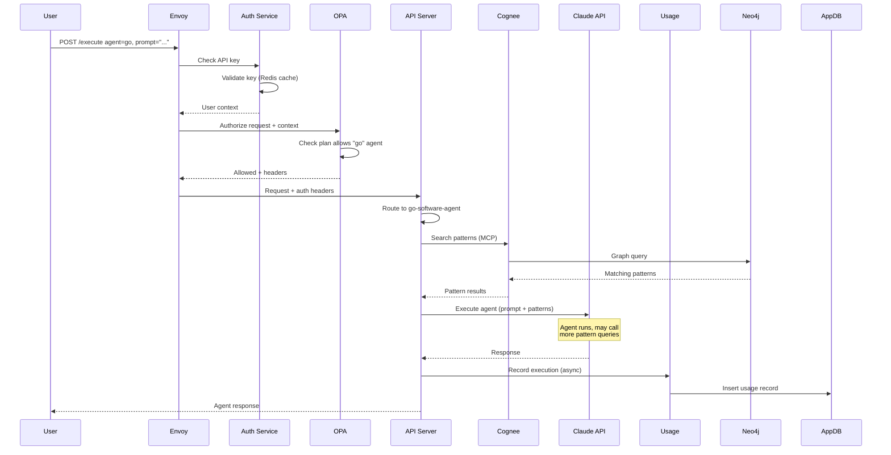
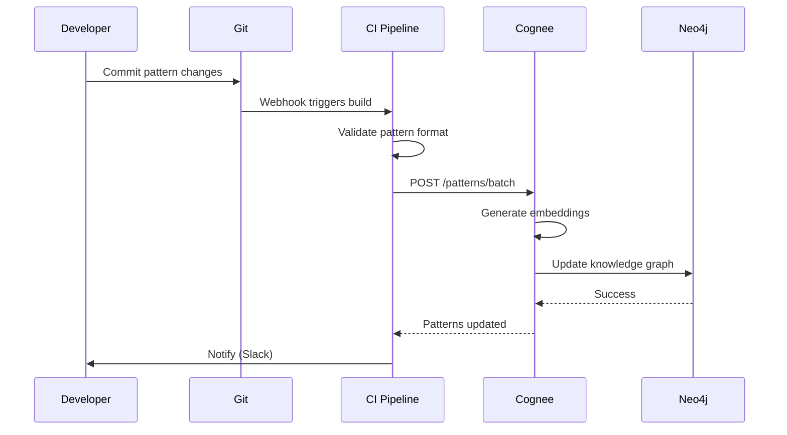

# How the System Fits Together

**Document:** System Architecture  
**Version:** 1.0  
**Last Updated:** December 22, 2025

Let's talk about how all the pieces work together. This is the "how" to complement the "why" from the ADRs.

## The Big Picture

Here's the full system architecture:

## Component Breakdown

Let's walk through each piece and what it does.

### API Server Pod

This is where the main application logic lives. It's actually three containers running together:

#### Envoy Sidecar (Infrastructure)

- Terminates TLS from the load balancer
- Checks API keys via external auth service
- Enforces rate limits (calls rate limit service)
- Adds authentication headers for the app
- Emits access logs and metrics
- Handles circuit breaking and retries

#### OPA Sidecar (Policy Engine)

- Evaluates authorization policies (written in Rego)
- Checks if user's plan allows the requested agent
- Verifies feature access
- Injects plan metadata into headers
- Updates policies without code deployment

#### API Server (Application)

- Handles the REST API endpoints
- Routes requests to appropriate agents
- Orchestrates agent execution
- Calls Cognee for pattern queries
- Records usage metrics
- Returns responses to clients

The application code doesn't do auth at all - it trusts the headers Envoy injects. This keeps the app code clean and focused on business logic.

### Cognee Service Pod

Pattern search and knowledge graph queries happen here:

#### Cognee MCP Server

- Official Cognee Docker image (MCP server)
- Provides pattern search via MCP protocol
- Manages knowledge graph queries
- Handles vector embeddings
- Stores patterns in Neo4j

We're using the existing Cognee MCP server directly via its native protocol. This keeps things simple and leverages the standard MCP interface.

### Supporting Services

#### Auth Service

- Validates API keys against PostgreSQL
- Returns user and team context
- Caches frequently accessed keys in Redis
- Issues JWT tokens for web UI
- Handles API key lifecycle

This is called by Envoy's ext_authz filter on every request. It's fast (< 50ms) because of Redis caching.

#### Usage Tracker

- Records agent executions
- Tracks token usage
- Calculates costs
- Emits billing events
- Updates counters

This runs asynchronously - the API doesn't wait for it. If it's down, we queue events and process them later.

#### Rate Limit Service

- Implements token bucket algorithm
- Tracks limits per user, team, and globally
- Uses Redis for shared state
- Returns allow/deny + remaining quota
- Configurable limits per plan

## Data Flow: Agent Execution

Here's what happens when a user executes an agent:

### Key Points

**Authentication happens at the edge** - By the time the request reaches our app, it's already been authenticated. The app trusts the headers.

**Pattern queries are on-demand** - Agent calls `search()` tool, we query Cognee, return just what's needed. This is the core efficiency gain.

**Usage tracking is async** - We don't block the response waiting for usage to be recorded. Fire and forget.

**Multiple pattern queries** - A single agent execution might query patterns 3-5 times. That's fine - each query is cheap and targeted.

## Data Flow: Pattern Updates

When someone updates patterns in git:

Patterns are version controlled in git. When you commit, CI validates and loads them into Cognee. Next query gets the updated patterns. Simple.

## Scaling Characteristics

Different components scale differently based on their resource profiles. For detailed scaling strategies, thresholds, and capacity planning, see [Scalability](09-scalability.md).

## Failure Modes

What breaks and how do we handle it?

### Component Failures

#### API Server Pod Dies

- Impact: That pod stops serving traffic
- Detection: Kubernetes health checks fail
- Recovery: K8s restarts pod, traffic routes to healthy pods
- User impact: None (other pods handle requests)
- Time to recover: 30 seconds

#### Cognee Service Dies

- Impact: Pattern queries fail
- Detection: gRPC health check fails
- Recovery: K8s restarts pod
- User impact: Agent executions fail with pattern query error
- Time to recover: 60 seconds
- Mitigation: Cache patterns temporarily, fall back to cached

#### Auth Service Dies

- Impact: New requests can't authenticate
- Detection: ext_authz fails
- Recovery: K8s restarts pod
- User impact: 503 errors on new requests
- Time to recover: 30 seconds
- Mitigation: Short-lived cache in Envoy

#### Redis Dies

- Impact: No caching, rate limiting breaks
- Detection: Connection failures
- Recovery: ElastiCache automatic failover
- User impact: Slower auth, degraded rate limiting
- Time to recover: < 60 seconds

#### App PostgreSQL Dies

- Impact: Can't read user data, can't record usage
- Detection: Connection failures
- Recovery: RDS automatic failover to standby
- User impact: 503 errors during failover
- Time to recover: < 5 minutes (RDS SLA)
- Mitigation: Read from replica if available

#### Cognee PostgreSQL Dies

- Impact: Cognee pattern queries may fail
- Detection: Connection failures
- Recovery: RDS automatic failover to standby
- User impact: Agent executions fail with pattern query error
- Time to recover: < 5 minutes (RDS SLA)
- Mitigation: Cognee manages its own data; failures isolated from ACE app

#### Neo4j Dies

- Impact: Pattern queries fail
- Detection: Connection errors
- Recovery: Neo4j Aura handles failover
- User impact: Agent executions fail
- Time to recover: Aura SLA dependent
- Mitigation: Cache patterns with longer TTL

### Cascading Failure Prevention

We prevent small failures from cascading using circuit breakers, timeouts, rate limiting, and bulkheads. For implementation details, see [Communication Patterns](04-communication-patterns.md#circuit-breaker-pattern).

## Security Boundaries

The system is organized into five trust zones (Internet, DMZ, Application, Internal, Data) with different security requirements. For details on network security, TLS configuration, and zone policies, see [Security Architecture](06-security-architecture.md#network-security).

## That's the Architecture

Key takeaways:

- **Sidecars handle infrastructure** - Envoy and OPA keep app code clean
- **Clear service boundaries** - Each service has a specific job
- **Independent scaling** - API and Cognee scale separately
- **Resilient by design** - Circuit breakers, timeouts, automatic failover
- **Zero-trust security** - Nothing is implicitly trusted

Next doc covers why we chose REST external and gRPC internal.

---

Copyright © 2025 Jeremy K. Johnson. All rights reserved.
