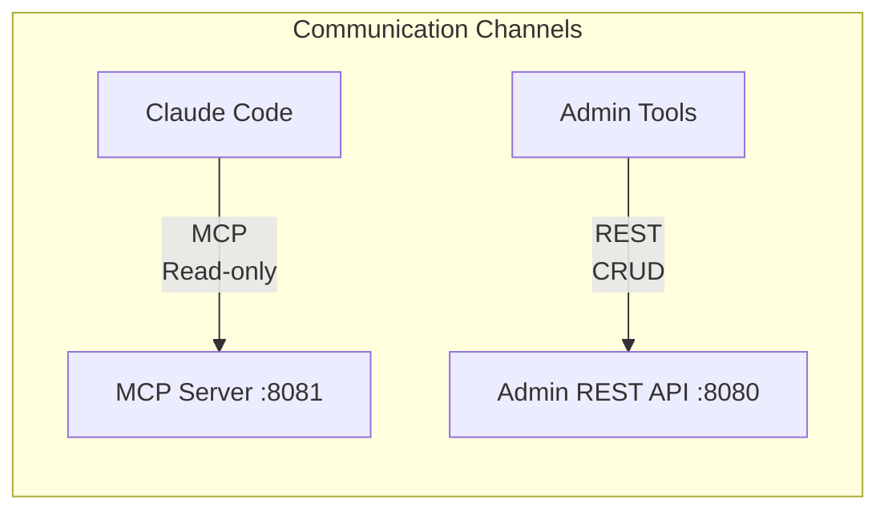
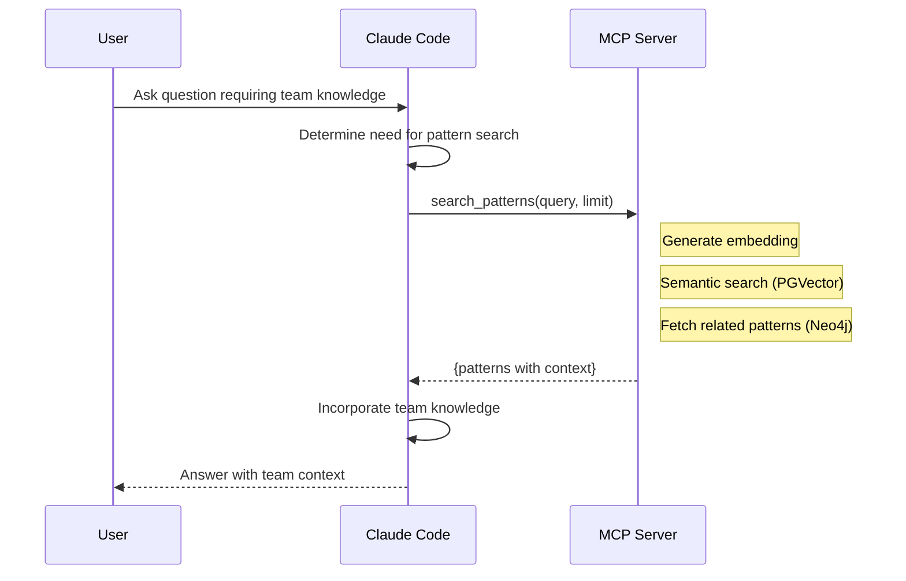
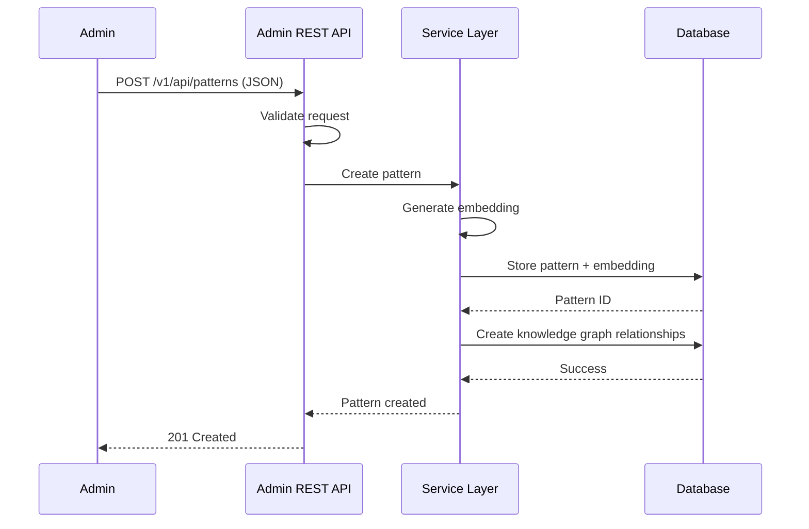
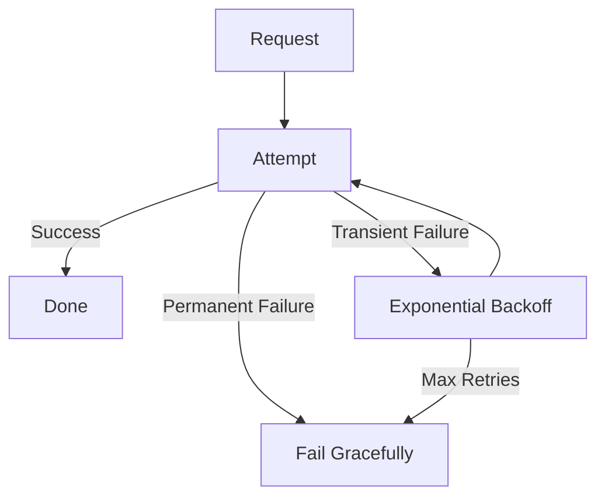
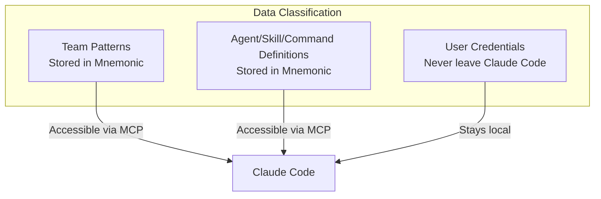

# Communication Patterns

[Back to Overview](00-overview.md) | [Back to Project README](../../README.md)

## Table of Contents

- [Overview](#overview)
- [Claude Code to MCP Server Communication](#claude-code-to-mcp-server-communication)
  - [MCP Tools](#mcp-tools)
  - [Request Flow](#request-flow)
  - [Response Structure](#response-structure)
  - [Error Handling](#error-handling)
- [Admin to REST API Communication](#admin-to-rest-api-communication)
  - [REST Endpoints](#rest-endpoints)
  - [Admin Operations](#admin-operations)
- [Resilience Patterns](#resilience-patterns)
- [Security Considerations](#security-considerations)

## Overview

Mnemonic uses a dual protocol architecture with distinct communication patterns for each use case.



## Claude Code to MCP Server Communication

Claude Code communicates with Mnemonic via MCP (Model Context Protocol) for read-only access to team knowledge and tooling.

### MCP Tools

Mnemonic exposes the following MCP tools for Claude Code (11 total):

**Pattern Search:**

| Tool | Parameters | Purpose |
| ---- | ---------- | ------- |
| `search_patterns` | `query: string, limit?: number` | Semantic search over team knowledge graph |
| `find_related_patterns` | `pattern_id: string, limit?: number` | Find patterns related to a given pattern |
| `get_pattern` | `id: string` | Retrieve specific pattern by ID |

**Tooling Synchronization:**

| Tool | Parameters | Purpose |
| ---- | ---------- | ------- |
| `list_agents` | `limit?: number, offset?: number` | List all available agents |
| `get_agent` | `name: string` | Get detailed agent information |
| `list_skills` | `limit?: number, offset?: number` | List all available skills |
| `get_skill` | `name: string` | Get detailed skill information |
| `get_skill_files` | `name: string` | Get skill child files (scripts, references, assets) |
| `list_commands` | `limit?: number, offset?: number` | List all available commands |
| `get_command` | `name: string` | Get detailed command information |
| `get_sync_manifest` | None | Get synchronization manifest for tooling |

### Request Flow



**Request Characteristics:**

- Synchronous request-response via MCP protocol
- Read-only access (no mutations)
- Runs in trusted environment (local network)
- No authentication for MVP (Phase 1)

### Response Structure

MCP tool responses provide structured data for Claude Code integration.

**Pattern Search Response:**

```json
{
  "patterns": [
    {
      "id": "uuid",
      "title": "Pattern title",
      "content": "Full pattern markdown",
      "category": "workflow|architecture|practice",
      "tags": ["tag1", "tag2"],
      "similarity_score": 0.95,
      "related_patterns": ["uuid1", "uuid2"]
    }
  ]
}
```

**Tooling List Response:**

```json
{
  "agents": [
    {
      "name": "agent-name",
      "version": "1.0.0",
      "description": "Agent description",
      "file_path": "/path/to/agent.yaml"
    }
  ]
}
```

### Error Handling

Claude Code must handle MCP server errors gracefully.

| Error Type | Meaning | Claude Code Behavior |
| ---------- | ------- | -------------------- |
| Tool not found | Unknown MCP tool | Fall back to local knowledge |
| Invalid parameters | Malformed request | Display error, suggest retry |
| Server error | Mnemonic unavailable | Continue without team knowledge |
| Timeout | Request took too long | Display timeout, suggest retry |

## Admin to REST API Communication

Admin tools (curl, scripts) communicate with Mnemonic via REST API for CRUD operations on patterns and tooling.

### REST Endpoints

Mnemonic exposes the following REST endpoints for administration:

**Pattern Management:**

| Endpoint | Method | Purpose |
| -------- | ------ | ------- |
| `/v1/api/patterns` | POST | Create new pattern |
| `/v1/api/patterns` | GET | List all patterns |
| `/v1/api/patterns/{id}` | GET | Get specific pattern |
| `/v1/api/patterns/{id}` | PUT | Update pattern |
| `/v1/api/patterns/{id}` | DELETE | Delete pattern |

**Agent Management:**

| Endpoint | Method | Purpose |
| -------- | ------ | ------- |
| `/v1/api/agents` | POST | Create new agent |
| `/v1/api/agents` | GET | List all agents |
| `/v1/api/agents/{name}` | GET | Get specific agent |
| `/v1/api/agents/{name}` | PUT | Update agent |
| `/v1/api/agents/{name}` | DELETE | Delete agent |

**Skill Management:**

| Endpoint | Method | Purpose |
| -------- | ------ | ------- |
| `/v1/api/skills` | POST | Create new skill |
| `/v1/api/skills` | GET | List all skills |
| `/v1/api/skills/{name}` | GET | Get specific skill |
| `/v1/api/skills/{name}` | PUT | Update skill |
| `/v1/api/skills/{name}` | DELETE | Delete skill |

**Command Management:**

| Endpoint | Method | Purpose |
| -------- | ------ | ------- |
| `/v1/api/commands` | POST | Create new command |
| `/v1/api/commands` | GET | List all commands |
| `/v1/api/commands/{name}` | GET | Get specific command |
| `/v1/api/commands/{name}` | PUT | Update command |
| `/v1/api/commands/{name}` | DELETE | Delete command |

> **Note:** See the [Pivot API Specification](../design/2026-02-15-pivot-api-specification.md) for complete endpoint reference including request/response schemas.

### Admin Operations



**Request Characteristics:**

- Synchronous request-response
- JSON payloads for all operations
- Authenticated via Envoy + OPA (Phase 2)
- Idempotent operations where possible

## Resilience Patterns

### Timeout Handling

Each communication channel has timeout considerations.

| Channel | Timeout Strategy |
| ------- | ---------------- |
| Claude Code to MCP | 30s - pattern search with embedding generation |
| Admin to REST API | 60s - allow for Neo4j relationship creation |

### Retry Logic



**Retry Considerations:**

- Idempotent operations only
- Exponential backoff
- Maximum retry limits (3 attempts)
- Clear failure messaging

### Fallback Behavior

When components are unavailable:

| Scenario | Fallback |
| -------- | -------- |
| MCP server unreachable | Claude Code continues without team knowledge |
| Admin API unavailable | Display error, suggest retry later |
| Database connection lost | Return 503 Service Unavailable |

## Security Considerations

### Data in Transit

| Channel | Security Requirement |
| ------- | -------------------- |
| Claude Code to MCP | Local network (no TLS for MVP) |
| Admin to REST API | TLS required (Phase 2 with Envoy) |

### Sensitive Data Handling



**Key Principles:**

- User credentials never leave Claude Code
- Patterns and tooling are team-shared (no user-specific secrets)
- MCP read-only access prevents accidental data modification
- Admin API write operations protected by OPA (Phase 2)
- All LLM calls go directly from Claude Code to Anthropic API

**Next:** [Deployment Architecture](05-deployment-architecture.md)
