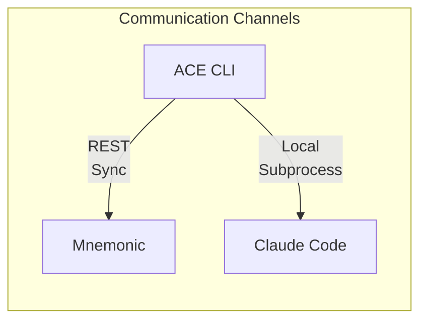
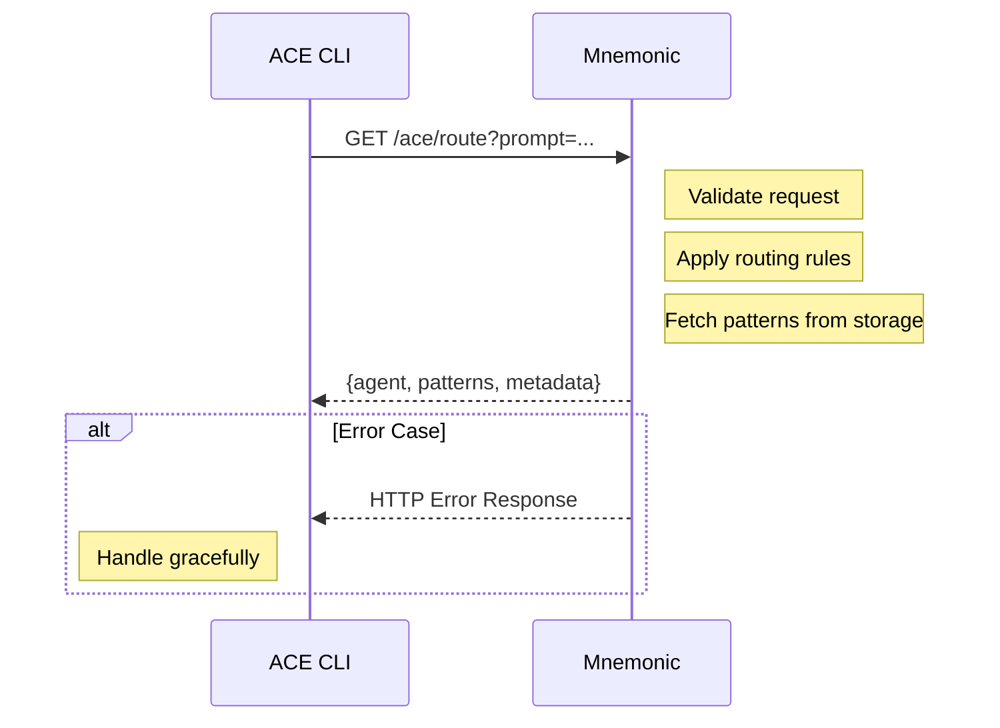
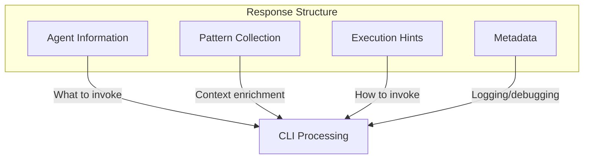
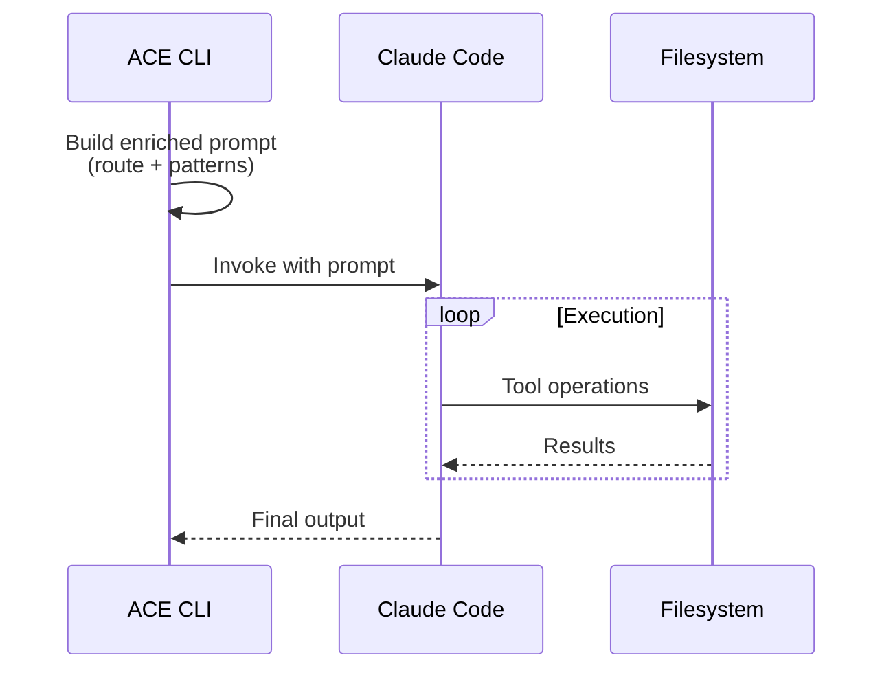
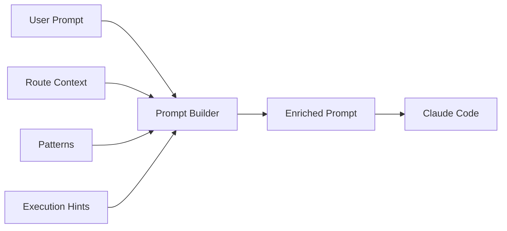
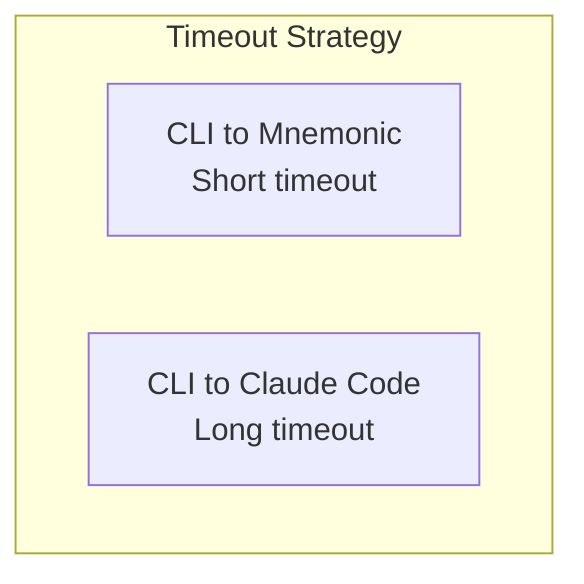
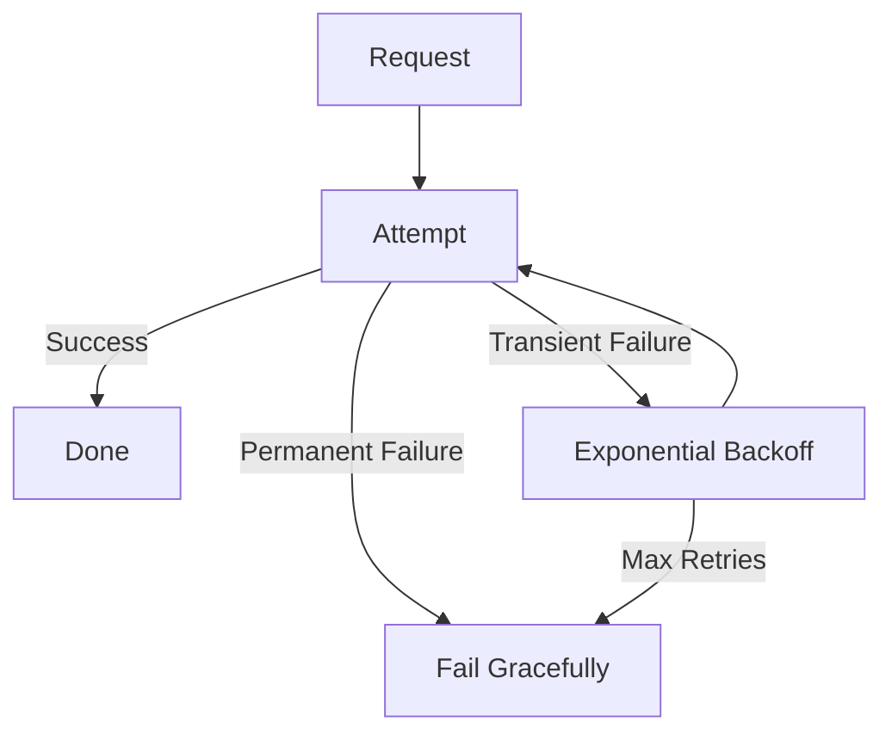
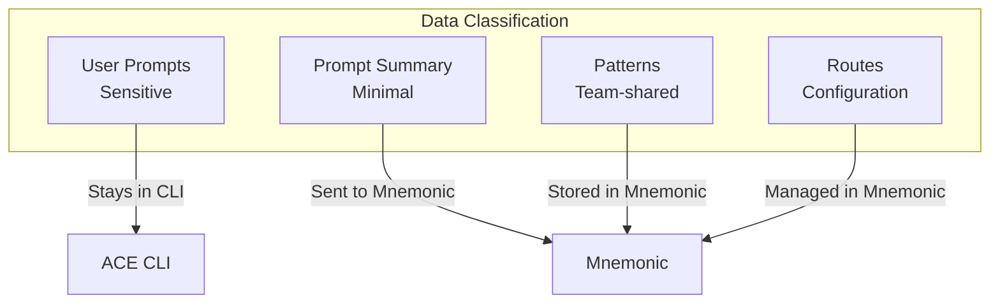

# Communication Patterns

[Back to Overview](00-overview.md) | [Back to Documentation Index](../README.md)

## Table of Contents

- [Overview](#overview)
- [CLI to Mnemonic Communication](#cli-to-mnemonic-communication)
  - [REST Endpoints](#rest-endpoints)
  - [Request Flow](#request-flow)
  - [Response Structure](#response-structure)
  - [Error Handling](#error-handling)
- [CLI to Claude Code Communication](#cli-to-claude-code-communication)
- [Resilience Patterns](#resilience-patterns)
- [Security Considerations](#security-considerations)

## Overview

ACE uses distinct communication patterns for each component boundary.

## CLI to Mnemonic Communication

The CLI communicates with Mnemonic via REST for routing decisions and pattern retrieval.

### REST Endpoints

Mnemonic exposes the following REST endpoints for ACE:

| Endpoint             | Method | Purpose                               |
| -------------------- | ------ | ------------------------------------- |
| `/ace/route`         | GET    | Deterministic routing based on prompt |
| `/ace/patterns`      | GET    | Pattern retrieval for agent + context |
| `/ace/agents`        | GET    | List available agents                 |
| `/ace/agents/{name}` | GET    | Get agent details                     |

### Request Flow

**Request Characteristics:**

- Synchronous request-response
- Contains prompt summary (not full prompt for privacy)
- Includes context hints for better routing
- Authenticated per team/user

**Query Parameters for `/ace/route`:**

| Parameter | Purpose                                 |
| --------- | --------------------------------------- |
| `prompt`  | Prompt summary for routing decision     |
| `context` | Domain, task type, preferences          |
| `user`    | User/team identifier for access control |

### Response Structure

The response provides everything the CLI needs for local execution.

**Response Fields:**

| Field      | Purpose                                   |
| ---------- | ----------------------------------------- |
| `agent`    | Which agent to invoke                     |
| `patterns` | Retrieved patterns for context enrichment |
| `hints`    | Suggested parameters for Claude Code      |
| `metadata` | Routing rationale for logging/debugging   |

### Error Handling

The CLI must handle Mnemonic errors gracefully.

| HTTP Status   | Meaning      | CLI Behavior                             |
| ------------- | ------------ | ---------------------------------------- |
| 400           | Bad Request  | Display validation errors                |
| 401           | Unauthorized | Prompt for re-authentication             |
| 404           | Not Found    | Agent or pattern not found               |
| 500           | Server Error | Retry with backoff, then fail gracefully |
| Network Error | Unreachable  | To be specified in design phase          |

## CLI to Claude Code Communication

The CLI invokes Claude Code as a local subprocess for execution.

**Invocation Characteristics:**

To be specified in [Configuration](../design/configuration.md).

| Aspect           | Detail                        |
| ---------------- | ----------------------------- |
| Method           | Subprocess spawn              |
| Prompt passing   | To be specified in design     |
| Output capture   | To be specified in design     |
| Timeout handling | To be specified in design     |

**Context Enrichment:**

The CLI constructs an enriched prompt by combining:

1. Original user prompt
2. Routing context from Mnemonic
3. Retrieved patterns
4. Execution hints

## Resilience Patterns

### Timeout Handling

Each communication channel has timeout considerations.

| Channel            | Timeout Strategy                  |
| ------------------ | --------------------------------- |
| CLI to Mnemonic    | Short timeout, fail fast          |
| CLI to Claude Code | Long timeout, progress indication |

### Retry Logic

**Retry Considerations:**

- Idempotent operations only
- Exponential backoff
- Maximum retry limits
- Clear failure messaging

### Fallback Behavior

When components are unavailable:

| Scenario             | Fallback                        |
| -------------------- | ------------------------------- |
| Mnemonic unreachable | To be specified in design phase |
| Claude Code fails    | Display error, suggest retry    |

## Security Considerations

### Data in Transit

| Channel            | Security Requirement               |
| ------------------ | ---------------------------------- |
| CLI to Mnemonic    | TLS required; auth to be specified |
| CLI to Claude Code | Local only, no network             |

### Sensitive Data Handling

**Key Principles:**

- Full prompts stay local (CLI only)
- Only summaries sent to Mnemonic for routing
- Patterns are team-shared (access controlled)
- Credentials never leave CLI

**Next:** [Deployment Architecture](05-deployment-architecture.md)
