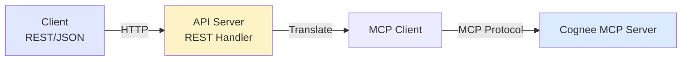
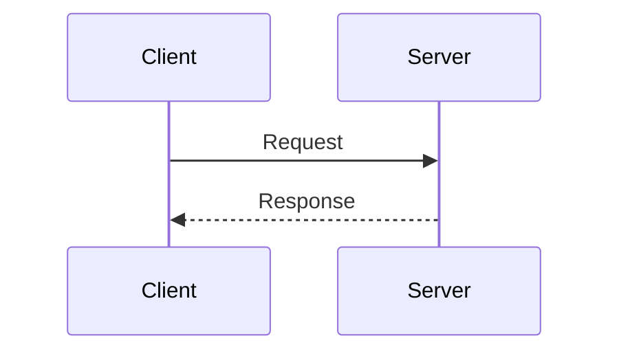
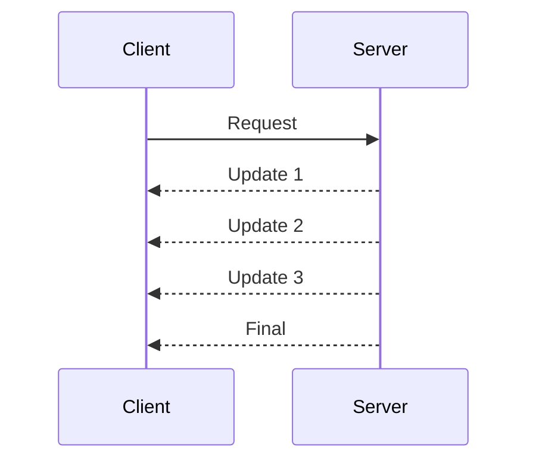
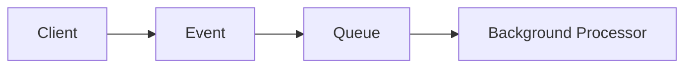
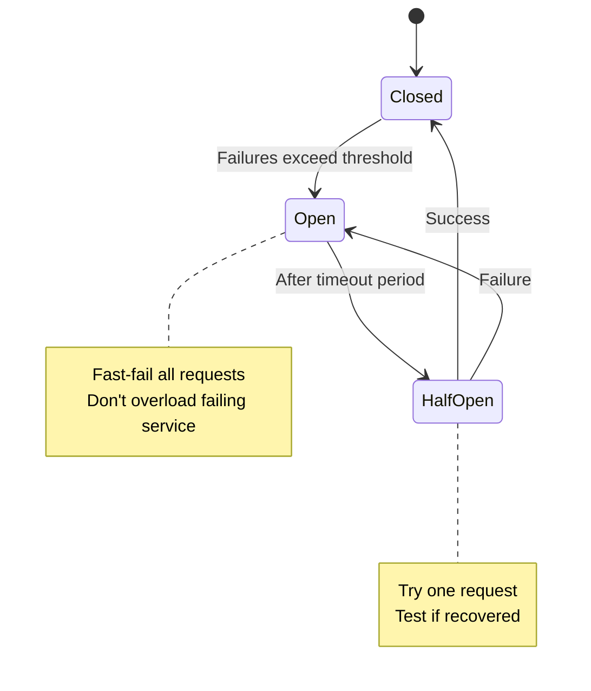
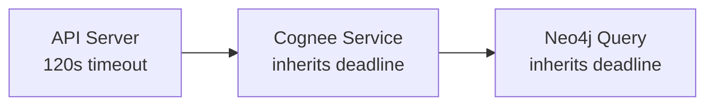

# Communication Patterns and Protocols

**Document:** Communication Patterns  
**Version:** 1.0  
**Last Updated:** December 22, 2025

Let's talk about how services talk to each other. We're using two different protocols for two different use cases, and that's intentional.

## The Protocol Split

We're using different protocols for external vs internal communication:

**External API:** REST/HTTP + JSON
**Internal Services:** gRPC + Protobuf (custom services), MCP (Cognee)

Cognee uses the Model Context Protocol (MCP) - a standardized protocol for LLM tool integration. Other internal services use gRPC for performance and type safety.

Why the split? Because external and internal have totally different requirements.

## REST for External API

The external API is what developers interact with. For the rationale behind choosing REST for external APIs, see [ADR-002](02-architectural-decisions.md#adr-002).

### API Structure

Here's what the REST API looks like:

```http
POST /api/v1/execute
Authorization: Bearer <api-key>
Content-Type: application/json

{
  "agent": "go-software-agent",
  "prompt": "Fix the bug in user.go",
  "auto_chain": true
}
```

**Response:**

```json
{
  "execution_id": "exec_abc123",
  "status": "completed",
  "result": {
    "output": "Fixed null pointer dereference...",
    "files_modified": ["user.go"],
    "chained_to": ["bats-test-agent"]
  },
  "usage": {
    "tokens": 1801,
    "cost_usd": 0.045
  }
}
```

Clean, predictable, easy to work with.

### Error Handling

We use standard HTTP status codes:

- **200 OK** - Success
- **400 Bad Request** - Invalid input
- **401 Unauthorized** - Missing/invalid API key
- **403 Forbidden** - Plan doesn't allow this agent
- **404 Not Found** - Agent doesn't exist
- **429 Too Many Requests** - Rate limit exceeded
- **500 Internal Server Error** - Something broke on our end
- **503 Service Unavailable** - Dependency down

Errors include helpful messages:

```json
{
  "error": {
    "code": "rate_limit_exceeded",
    "message": "You've exceeded your plan's hourly rate limit",
    "limits": {
      "requests_per_hour": 100,
      "used": 100,
      "reset_at": "2024-12-19T11:00:00Z"
    }
  }
}
```

## gRPC for Internal Services

Internal service-to-service calls use gRPC for performance and type safety. For the rationale, see [ADR-002](02-architectural-decisions.md#adr-002).

### gRPC Service Definitions

Here's what internal gRPC services look like (note: Cognee uses MCP protocol directly, not gRPC):

```protobuf
// Example internal service (not Cognee)
service OrchestratorService {
  rpc RouteAgent(RouteRequest) returns (RouteResponse);
  rpc GetAgentDefinition(AgentRequest) returns (AgentDefinition);
}
```

Clean, typed, easy to reason about.

### Message Flow

**MCP Protocol (for Cognee):**

API server communicates with Cognee MCP server using the standard MCP protocol:

```json
// API Server -> MCP Request -> Cognee MCP Server

{
  "method": "tools/call",
  "params": {
    "name": "search_patterns",
    "arguments": {
      "query": "golang error handling best practices",
      "max_results": 5,
      "domains": ["golang", "error-handling"]
    }
  }
}

// ← MCP Response
{
  "content": [
    {
      "type": "text",
      "text": "Found 5 patterns..."
    }
  ]
}
```

**gRPC (for other internal services):**

```text
Service A -> gRPC Call -> Service B

// Internal routing, orchestration, etc.
```

### Streaming for Long Operations

For long-running operations, we use server streaming:

```protobuf
service OrchestratorService {
  // Execute agent with streaming updates
  rpc ExecuteAgent(ExecuteRequest) returns (stream ExecutionUpdate);
}

message ExecutionUpdate {
  string execution_id = 1;
  oneof update {
    StatusUpdate status = 2;
    PatternQuery pattern_query = 3;
    PartialResult partial_result = 4;
    FinalResult final_result = 5;
  }
}
```

Client gets real-time updates as the agent executes. No polling required.

## Protocol Translation

We need to translate between REST and MCP at service boundaries:



**In the API server:**

```go
// REST handler receives JSON
func (h *Handler) ExecuteAgent(w http.ResponseWriter, r *http.Request) {
    var req ExecuteRequest
    json.Decode(r.Body, &req)

    // Translate to MCP protocol
    mcpReq := mcp.ToolCallRequest{
        Method: "tools/call",
        Params: mcp.CallParams{
            Name: "search_patterns",
            Arguments: map[string]interface{}{
                "query": req.Prompt,
                "max_results": 5,
            },
        },
    }

    // Call Cognee MCP server
    resp, err := h.mcpClient.Call(ctx, mcpReq)

    // Translate back to JSON
    json.Encode(w, resp)
}
```

Translation happens at the boundary. Clean separation.

## Communication Patterns

Different communication patterns for different needs:

### Request-Response (Synchronous)

Most API calls use simple request-response:



Good for: Quick operations, simple queries, most CRUD operations

Timeout: 60 seconds for external API, 30 seconds for internal

### Server Streaming (Async Updates)

For long operations, stream updates:



Good for: Agent executions, long-running queries, progress updates

Timeout: 120 seconds for complete execution

### Fire-and-Forget (Async)

For operations that don't need a response:



Good for: Usage tracking, analytics, logging

No timeout - if it fails, we retry from queue

### Circuit Breaker Pattern

Prevent cascading failures:



**Settings:**

- Failure threshold: 50% error rate
- Timeout: 60 seconds
- Half-open test requests: 1

## Timeouts and Deadlines

Everything has a timeout. Never wait forever.

### External API Timeouts

- Client timeout: 60 seconds
- Server processing: 120 seconds (agent executions take time)
- Pattern query: 10 seconds
- Health checks: 1 second

### Internal gRPC Timeouts

- Default: 30 seconds
- Pattern search: 10 seconds
- Auth check: 1 second
- Health check: 500ms

### Deadline Propagation

gRPC propagates deadlines automatically:



If 60 seconds have elapsed, remaining services only have 60 seconds. This prevents work on requests that already timed out.

## Authentication in Communication

Different authentication for different contexts:

### External API (Client -> API)

**API Key in Header:**

```http
Authorization: Bearer sk-ace-abc123...
```

Or:

```http
X-API-Key: sk-ace-abc123...
```

### Internal Services (Service -> Service)

**Mutual TLS (mTLS):**

- Both sides present certificates
- Verify peer identity
- Encrypted channel
- Service mesh integration

## Performance Optimization

### Connection Pooling

**HTTP Keep-Alive:**

- Reuse TCP connections
- Reduce handshake overhead
- Pool size: 100 connections per host

**gRPC Long-Lived Connections:**

- Single connection per service
- HTTP/2 multiplexing
- Connection pool size: 10 per target

### Compression

**REST API:**

- gzip compression for responses > 1KB
- Accept-Encoding: gzip
- Reduces bandwidth by ~70%

**gRPC:**

- Built-in compression (configurable)
- Per-message compression
- Automatic for large messages

### Caching

**HTTP Headers:**

```http
Cache-Control: public, max-age=300
ETag: "abc123"
```

**Application-Level:**

- User context: 5 minutes
- Pattern results: Session duration
- Agent definitions: 1 hour

## Error Handling Strategy

### Retries

**Idempotent operations** - Safe to retry:

- GET requests
- Pattern queries
- Health checks

**Non-idempotent operations** - Don't auto-retry:

- Agent executions (might charge twice)
- Usage tracking (would double-count)

**Retry Config:**

```yaml
max_attempts: 3
initial_backoff: 100ms
max_backoff: 5s
backoff_multiplier: 2
```

### Fallbacks

When Cognee is down:

1. Return cached patterns (if available)
2. Execute agent without patterns
3. Fail fast with helpful error

When Auth service is down:

1. Check Envoy's short-term cache
2. Reject request if no cache hit
3. Don't allow unauthenticated access

## Key Takeaways

- **REST externally** - Developer experience matters most
- **gRPC for custom internal services** - Performance and type safety win
- **MCP for Cognee** - Standard protocol for LLM tool integration
- **Right protocol for context** - Different needs, different tools
- **Timeouts everywhere** - Never wait forever
- **Circuit breakers** - Fail fast, prevent cascades
- **Authentication layers** - API keys external, mTLS internal

Next doc covers how we're using PostgreSQL, Neo4j, and Redis.

---

Copyright © 2025 Jeremy K. Johnson. All rights reserved.
