# Data Architecture

[Back to Overview](README.md) | [Back to Project README](../../README.md)

## Table of Contents

- [MVP](#mvp)
  - [Overview](#overview)
  - [Database Technology Stack](#database-technology-stack)
    - [PostgreSQL](#postgresql)
    - [PGVector](#pgvector)
    - [Neo4j](#neo4j)
  - [Data Model Design](#data-model-design)
    - [Entity Relationship Diagram](#entity-relationship-diagram)
    - [Agents](#agents)
    - [Patterns](#patterns)
    - [Skills](#skills)
    - [Enrichment Jobs](#enrichment-jobs)
  - [Storage Architecture](#storage-architecture)
    - [PostgreSQL Schema](#postgresql-schema)
    - [PGVector Configuration](#pgvector-configuration)
    - [Neo4j Graph Model](#neo4j-graph-model)
  - [Data Flow Patterns](#data-flow-patterns)
    - [Write Paths](#write-paths)
    - [Read Paths](#read-paths)
  - [Consistency and Integrity](#consistency-and-integrity)
    - [Transaction Handling](#transaction-handling)
    - [Cross-Database Consistency](#cross-database-consistency)
    - [Constraint Enforcement](#constraint-enforcement)
  - [Migration Strategy](#migration-strategy)
    - [Schema Versioning](#schema-versioning)
    - [Forward-Compatible Migrations](#forward-compatible-migrations)
    - [Rollback Procedures](#rollback-procedures)
  - [Performance Considerations](#performance-considerations)
    - [Index Strategies](#index-strategies)
    - [Query Optimization](#query-optimization)
    - [Connection Pool Configuration](#connection-pool-configuration)
  - [Key Takeaways](#key-takeaways)
- [Post-MVP](#post-mvp)
  - [Data Lifecycle Management](#data-lifecycle-management)
    - [Data Retention Policies](#data-retention-policies)
    - [Archival Strategies](#archival-strategies)
    - [Cleanup Procedures](#cleanup-procedures)
  - [Backup and Recovery](../operations/database-operations.md)
  - [Security Enhancements](#security-enhancements)
    - [Encryption at Rest](#encryption-at-rest)
    - [Access Patterns](#access-patterns)
    - [Audit Logging](#audit-logging)
  - [Advanced Consistency](#advanced-consistency)

## MVP

### Overview

[Back to Table of Contents](#table-of-contents)

> **Architecture Reference:** [System Architecture - Mnemonic](02-system-architecture.md#mnemonic) | [ADR-001: Team Knowledge Graph](00-architectural-decisions.md#adr-001) | [ADR-003: Entity Storage](00-architectural-decisions.md#adr-003) | [ADR-004: Pattern Storage](00-architectural-decisions.md#adr-004)

Mnemonic uses a polyglot persistence strategy where each database technology is chosen for its strengths:

- **PostgreSQL** for relational data and ACID transactions
- **PGVector** for vector embeddings and semantic search
- **Neo4j** for knowledge graph relationships

Mnemonic is stateless; all persistent state lives in these external databases. This separation enables horizontal scaling of Mnemonic instances while maintaining data consistency.

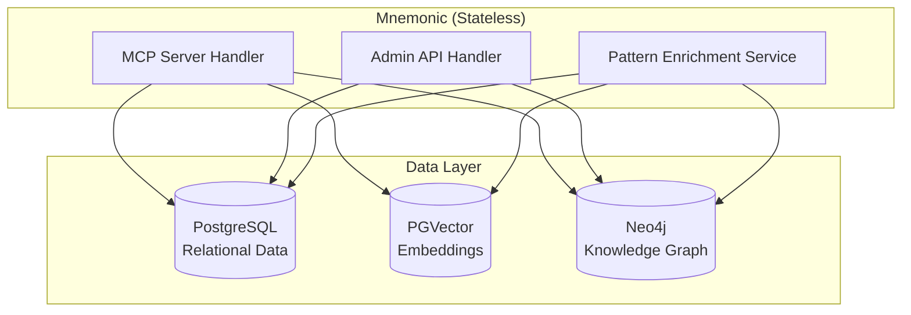

### Database Technology Stack

[Back to Table of Contents](#table-of-contents)

#### PostgreSQL

**Purpose:** Primary relational database for structured data with ACID guarantees.

**Stores:**

- Agents (JSONB document definitions)
- Skills (reusable Claude Code skills)
- Patterns (metadata, content, tags, associations)
- Enrichment jobs (background processing queue)

**Why PostgreSQL:**

| Criterion            | Rationale                                                         |
| -------------------- | ----------------------------------------------------------------- |
| ACID compliance      | Critical for maintaining data integrity across entities           |
| Mature ecosystem     | Excellent Go driver support (pgx), migrations tooling             |
| JSON support         | JSONB for entity definitions and flexible metadata                |
| Extensions           | PGVector extension enables vector search without separate service |
| Operational maturity | Well-understood backup, recovery, and scaling patterns            |

**Version Requirement:** PostgreSQL 15+ (for improved JSON path expressions and performance)

#### PGVector

**Purpose:** Vector embeddings for semantic similarity search.

**Stores:**

- Pattern chunk embeddings (one vector per H2 section, 1536 dimensions, OpenAI text-embedding-3-small)
- Prompt embeddings for semantic search (generated at query time)

**Why PGVector over Dedicated Vector DB:**

| Criterion                 | PGVector                                       | Pinecone/Milvus      |
| ------------------------- | ---------------------------------------------- | -------------------- |
| Operational complexity    | Single database                                | Additional service   |
| Cost                      | Included with Postgres                         | Separate billing     |
| Transactional consistency | Same transaction as metadata                   | Eventual consistency |
| Scale requirements        | Sufficient for expected pattern counts (<100K) | Better for millions+ |
| Query latency             | <50ms for <10K vectors                         | <10ms at scale       |

**Trade-off:** PGVector is simpler to operate but has higher latency at scale. This trade-off is acceptable for MVP pattern counts.

#### Neo4j

**Purpose:** Knowledge graph for entity relationships and pattern connections.

**Stores:**

- Pattern-to-agent relationships (with relevance scores)
- Pattern-to-concept relationships (extracted entities)
- Pattern-to-pattern relationships (shared entities)
- Agent nodes (mirrored from Postgres for graph traversal)
- Concept nodes (extracted from pattern content)

**Why Neo4j:**

| Criterion             | Rationale                                            |
| --------------------- | ---------------------------------------------------- |
| Native graph model    | Natural fit for relationship-heavy queries           |
| Cypher query language | Expressive path traversal and pattern matching       |
| Graph algorithms      | Built-in similarity, centrality, community detection |
| Visualization         | Neo4j Browser for debugging and exploration          |

**Version Requirement:** Neo4j 5.x Community Edition

### Data Model Design

[Back to Table of Contents](#table-of-contents)

#### Entity Relationship Diagram

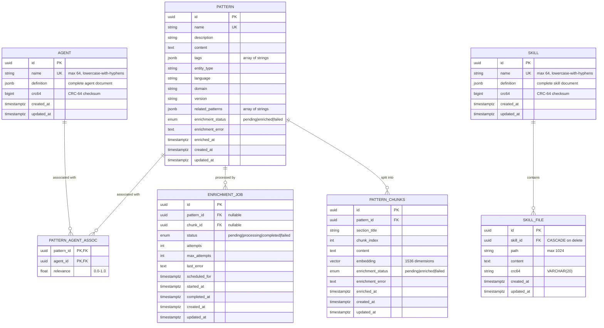

#### Agents

Agent definitions stored as JSONB documents. See [ADR-003](00-architectural-decisions.md#adr-003) for the JSONB document model design.

**Schema:** `(id UUID PK, name VARCHAR(64) UNIQUE, definition JSONB, crc64 BIGINT, created_at, updated_at)`

**Name constraint:** `^[a-z][a-z0-9-]*$` (max 64 chars, enforced by CHECK)

#### Patterns

Patterns use relational columns (not JSONB) for enrichment tracking and metadata filtering. See [ADR-004](00-architectural-decisions.md#adr-004) for the design rationale.

**Schema:** Columns include `id`, `name`, `description`, `content`, `tags` (JSONB), `entity_type`, `language`, `domain`, `version`, `related_patterns` (JSONB), `enrichment_status`, `enrichment_error`, `enriched_at`, `created_at`, `updated_at`. The `embedding` column was removed in migration 000009; vector embeddings now live in `pattern_chunks`.

**Pattern chunks:** Each pattern is split at H2 headings into one or more rows in `pattern_chunks`. Each chunk holds its own `embedding vector(1536)` for section-level semantic search. If a pattern has no H2 headings it is stored as a single chunk. The `enrichment_status` on the pattern reflects aggregate chunk status: a pattern is `enriched` when all its chunks are enriched.

**Enrichment States:**

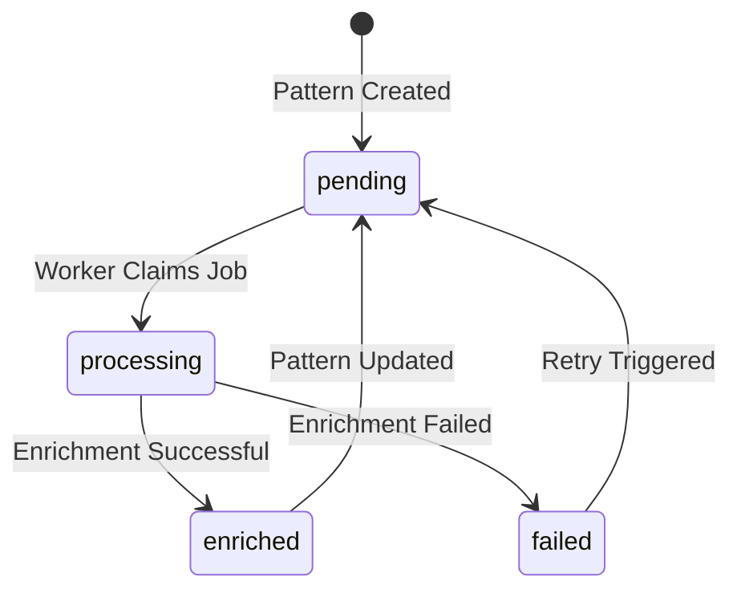

#### Skills

Skill definitions stored as JSONB documents. See [ADR-003](00-architectural-decisions.md#adr-003).

**Schema:** `(id UUID PK, name VARCHAR(64) UNIQUE, definition JSONB, crc64 BIGINT, created_at, updated_at)`

**Name constraint:** `^[a-z][a-z0-9-]*$` (max 64 chars, enforced by CHECK)

Skills may have child files (scripts, references, assets) stored in the `skill_files` table with CASCADE delete.

#### Enrichment Jobs

Background processing queue for pattern enrichment. See [ADR-004](00-architectural-decisions.md#adr-004) for the queue design.

**Schema:** Postgres-backed queue using `FOR UPDATE SKIP LOCKED` for safe concurrent processing. Retry with exponential backoff (max 3 attempts). `pattern_id` is nullable (was NOT NULL prior to migration 000009). `chunk_id` (FK to `pattern_chunks.id`, nullable) is set for chunk-level enrichment jobs; `pattern_id` is set for legacy jobs. CASCADE delete on parent pattern or chunk.

**Uniqueness:** A partial unique index prevents duplicate pending or processing jobs for the same pattern:

```sql
CREATE UNIQUE INDEX idx_enrichment_jobs_unique_pending
    ON enrichment_jobs(pattern_id)
    WHERE status IN ('pending', 'processing');
```

### Storage Architecture

[Back to Table of Contents](#table-of-contents)

#### PostgreSQL Schema

> **Full DDL:** See [Data Storage](../design/data-storage.md) for complete CREATE TABLE statements, constraints, and migration history.

**Note:** Application manages `updated_at` timestamps on write. No database triggers.

**Note:** For future JSONB schema validation, the pg_jsonschema extension can be used.

#### PGVector Configuration

**Index Selection by Pattern Count:**

| Pattern Count   | Index Type | Configuration            | Rationale                          |
| --------------- | ---------- | ------------------------ | ---------------------------------- |
| < 1,000         | None       | Exact search             | Overhead of index not worth it     |
| 1,000 - 100,000 | IVFFlat    | lists = sqrt(N)          | Good balance of speed and accuracy |
| > 100,000       | HNSW       | m=16, ef_construction=64 | Faster queries, higher memory      |

**Recommended Index (MVP scale):**

See [Index Strategies](#index-strategies) for the IVFFlat index definition. The index is now on `pattern_chunks.embedding`, not `patterns.embedding`.

**Similarity Search Query:**

```sql
-- search_patterns: chunk-level semantic search
-- Parameters:
--   $1 = query embedding vector
--   $2 = similarity threshold (default 0.7)
--   $3 = result limit (default 10, max 50)
--   $4 = tags filter (JSONB array or NULL)
--   $5 = language filter (text or NULL)
--   $6 = domain filter (text or NULL)
SELECT pc.id, pc.pattern_id, p.name AS pattern_name,
       p.entity_type, p.language, p.domain, p.tags,
       pc.section_title, pc.chunk_index, pc.content,
       1 - (pc.embedding <=> $1::vector) AS similarity
FROM pattern_chunks pc
JOIN patterns p ON p.id = pc.pattern_id
WHERE pc.enrichment_status = 'enriched'
  AND 1 - (pc.embedding <=> $1::vector) > $2
  AND ($4::jsonb IS NULL OR p.tags @> $4::jsonb)
  AND ($5::text IS NULL OR p.language = $5)
  AND ($6::text IS NULL OR p.domain = $6)
ORDER BY pc.embedding <=> $1::vector
LIMIT $3;
```

#### Neo4j Graph Model

**Node Labels:**

| Label   | Properties                                                         | Source                      |
| ------- | ------------------------------------------------------------------ | --------------------------- |
| Pattern | `id` (UUID), `name`, `description`                                 | Mirrored from Postgres      |
| Agent   | `name`                                                             | Mirrored from Postgres      |
| Concept | `name` (normalized lowercase), `type` (technology/practice/domain) | Extracted during enrichment |

**Relationship Types:**

| Type           | From    | To      | Properties                                          |
| -------------- | ------- | ------- | --------------------------------------------------- |
| `RELEVANT_FOR` | Pattern | Agent   | `relevance` (float, 0.0-1.0)                        |
| `MENTIONED_IN` | Concept | Pattern | --                                                  |
| `RELATED_TO`   | Pattern | Pattern | `similarity` (float, computed from shared concepts) |

The enrichment pipeline assigns one of three concept types to each extracted entity: `technology` (tools, languages, frameworks), `practice` (methodologies, patterns, approaches), or `domain` (problem areas, business contexts). Type assignment is performed by the LLM during the entity extraction step.

**Constraints and Indexes:**

| Constraint/Index           | Label   | Property              | Type       |
| -------------------------- | ------- | --------------------- | ---------- |
| `pattern_id_unique`        | Pattern | `id`                  | Uniqueness |
| `agent_name_unique`        | Agent   | `name`                | Uniqueness |
| `concept_name_unique`      | Concept | `name`                | Uniqueness |
| `pattern_name_index`       | Pattern | `name`                | Property   |
| `concept_type_index`       | Concept | `type`                | Property   |
| `pattern_content_fulltext` | Pattern | `name`, `description` | Full-text  |
| `concept_name_fulltext`    | Concept | `name`                | Full-text  |

> **Full Cypher DDL:** See [Data Storage](../design/data-storage.md) for constraint and index definitions.

**Graph Data Flow:**

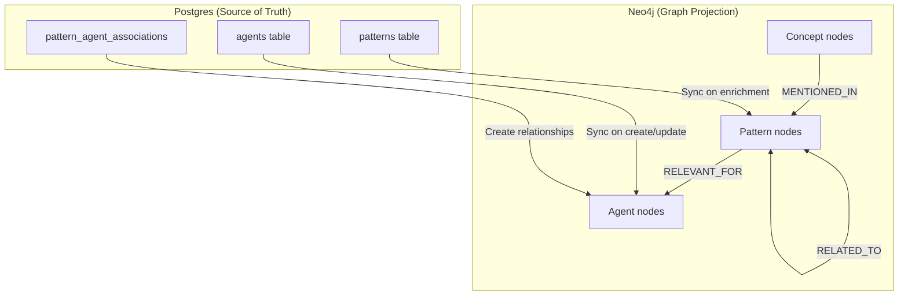

### Data Flow Patterns

[Back to Table of Contents](#table-of-contents)

#### Write Paths

##### Agent Create/Update

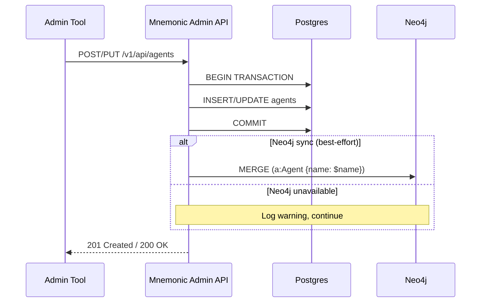

##### Pattern Delete (Admin API)

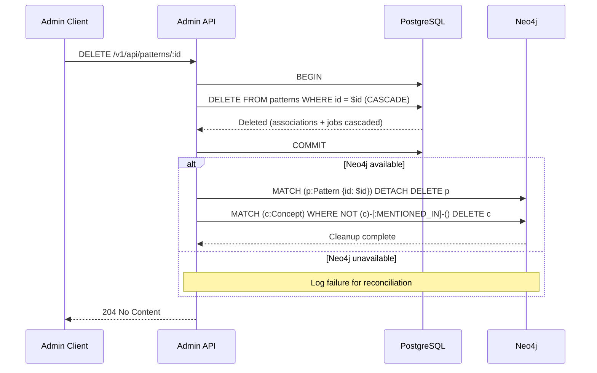

The Postgres CASCADE removes `pattern_agent_associations` and `enrichment_jobs` rows automatically. Neo4j cleanup is best-effort: orphaned Concept nodes (concepts with no remaining `MENTIONED_IN` edges after the Pattern node is removed) are also deleted.

##### Pattern Create with Enrichment

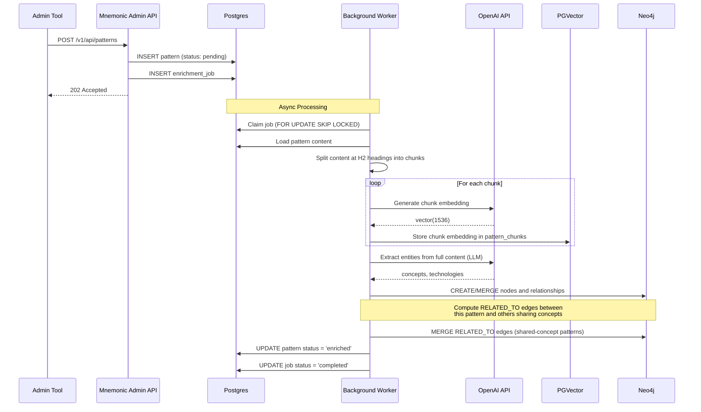

##### Skill Create

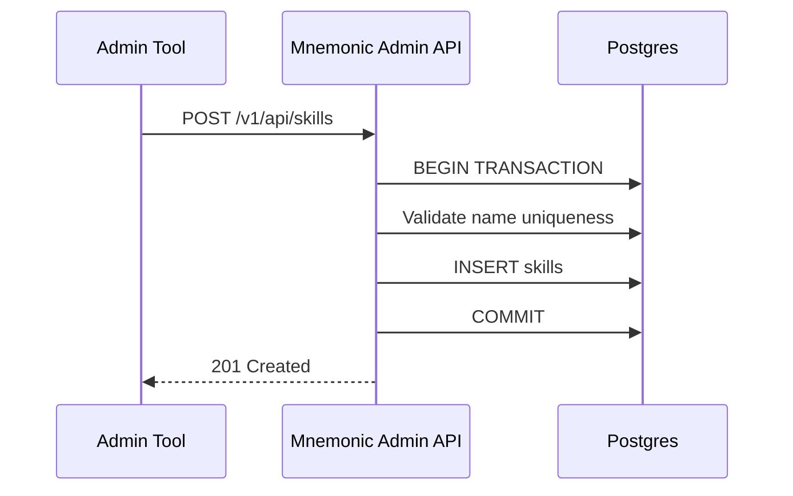

#### Read Paths

##### Pattern Search (MCP)

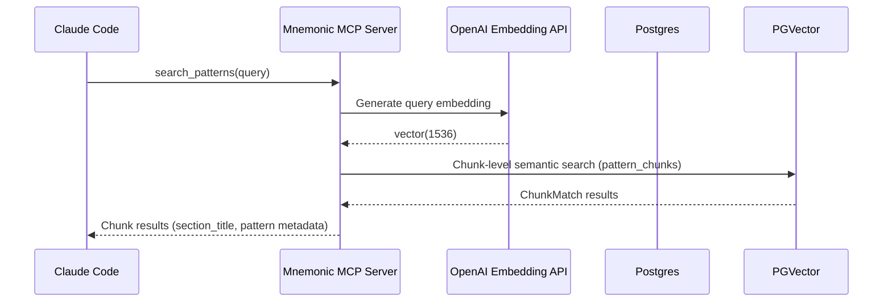

##### Find Related Patterns (MCP)

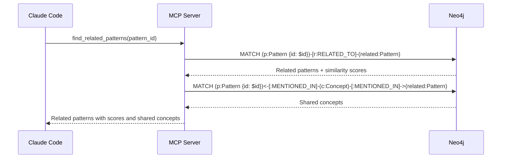

Pure graph traversal — no Postgres or OpenAI calls. Strength scores reflect concept overlap computed during enrichment.

##### Get Pattern (MCP)

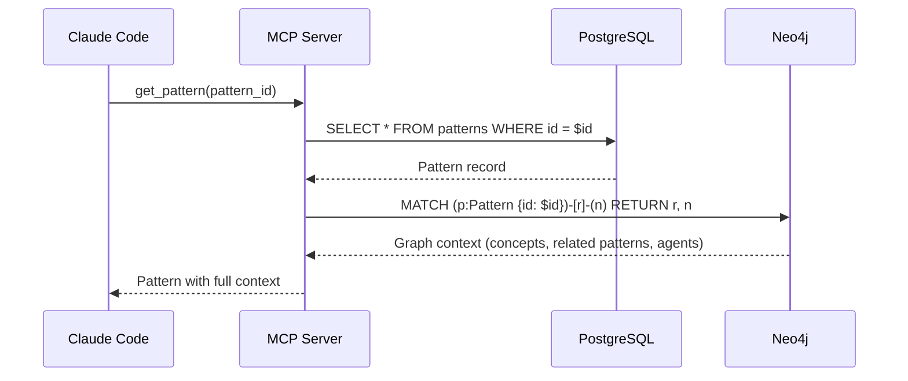

The Neo4j graph context section is omitted from the response when the pattern's enrichment is still pending.

##### Tooling Sync (Admin API)

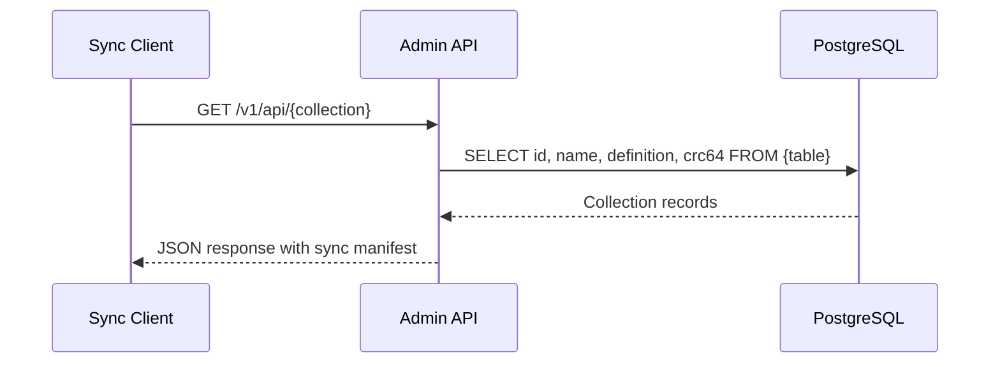

Sync reads are Postgres-only. Neo4j is used exclusively for pattern graph relationships and is not queried during tooling synchronization.

##### Pattern List with Search

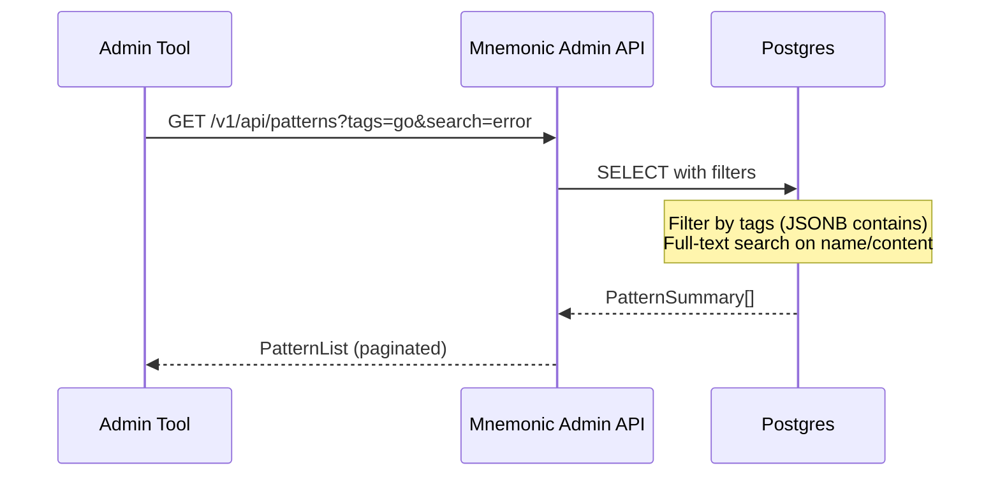

### Consistency and Integrity

[Back to Table of Contents](#table-of-contents)

#### Transaction Handling

**Postgres Transactions:**

All write operations use explicit transactions with appropriate isolation. The general pattern:

1. Begin transaction with appropriate isolation level
2. Execute Postgres write operations
3. Attempt Neo4j sync (best-effort, log failures)
4. Commit transaction

**Isolation Levels:**

| Operation            | Isolation Level | Rationale                                       |
| -------------------- | --------------- | ----------------------------------------------- |
| Read queries         | Read Committed  | Default, sufficient for reads                   |
| Write operations     | Read Committed  | Prevents dirty reads                            |
| Enrichment job claim | Read Committed  | FOR UPDATE SKIP LOCKED prevents race conditions |

#### Cross-Database Consistency

Postgres is the source of truth. Neo4j contains a projection of relevant data for graph queries.

**Consistency Model:**

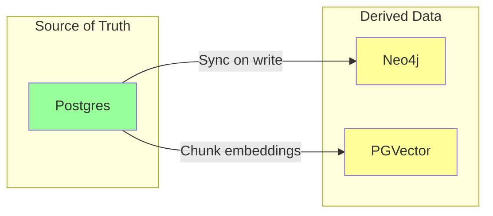

**Sync Failure Handling:**

1. Postgres write succeeds, Neo4j sync fails:
   - Log warning, continue
   - Pattern metadata still accessible via name lookup
   - Background reconciliation job deferred to [Post-MVP](#advanced-consistency)

2. Enrichment fails after Postgres write:
   - Pattern exists but not searchable
   - Enrichment job tracks failure
   - Manual retry via admin API

#### Constraint Enforcement

**Database-Level Constraints:**

Referential integrity is enforced via foreign keys with CASCADE delete. When a pattern is deleted, its `pattern_agent_associations` and `enrichment_jobs` rows are removed automatically. When an agent is deleted, its association rows are removed. See [Data Storage](../design/data-storage.md) for FK definitions.

**Application-Level Validation:**

For JSONB document tables (agents, skills, skill_files):

- Name pattern validation (enforced by CHECK constraints on name column)
- JSONB content validation (field presence, types, max lengths)
- Content size validation (application responsibility)

For relational tables (patterns):

- JSONB tags validated as arrays
- `language`, `domain` validated against allowed values; `entity_type` validated against kebab-case pattern

### Migration Strategy

[Back to Table of Contents](#table-of-contents)

> **Architecture Reference:** [Deployment Architecture - Independent Deployment Pipelines](06-deployment-architecture.md#independent-deployment-pipelines)

#### Schema Versioning

**Migration Tool:** golang-migrate CLI, run as a deployment pipeline step external to Mnemonic. Mnemonic does not embed or invoke golang-migrate; it never manages DDL or runs migrations directly.

**Directory Structure:**

```text
src/migrations/
└── postgres/
    ├── 000001_extensions.up.sql
    ├── 000001_extensions.down.sql
    ├── 000002_create_agents.up.sql
    ├── 000002_create_agents.down.sql
    ├── 000003_create_patterns.up.sql
    ├── 000003_create_patterns.down.sql
    ├── 000004_create_pattern_agent_associations.up.sql
    ├── 000004_create_pattern_agent_associations.down.sql
    ├── 000005_create_enrichment_jobs.up.sql
    ├── 000005_create_enrichment_jobs.down.sql
    ├── 000006_create_performance_indexes.up.sql
    ├── 000006_create_performance_indexes.down.sql
    ├── 000007_create_skills.up.sql
    ├── 000007_create_skills.down.sql
    ├── 000008_create_skill_files.up.sql
    ├── 000008_create_skill_files.down.sql
    ├── 000009_pattern_schema_chunks.up.sql
    └── 000009_pattern_schema_chunks.down.sql
```

**Version Tracking:**

Migration state is tracked by golang-migrate in a `schema_migrations` table.

#### Forward-Compatible Migrations

**Migration Safety Rules:**

1. **Add columns as nullable or with defaults**

   ```sql
   -- Good: New column is nullable
   ALTER TABLE agents ADD COLUMN metadata JSONB;

   -- Good: New column has default
   ALTER TABLE patterns ADD COLUMN version INTEGER DEFAULT 1;
   ```

2. **Never rename columns directly**

   ```sql
   -- Bad: Breaks running application
   ALTER TABLE agents RENAME COLUMN name TO agent_name;

   -- Good: Add new column, migrate data, deprecate old
   ALTER TABLE agents ADD COLUMN agent_name VARCHAR(64);
   UPDATE agents SET agent_name = name;
   -- Later migration: DROP old column
   ```

3. **Add indexes concurrently**

   ```sql
   -- Good: Non-blocking index creation
   CREATE INDEX CONCURRENTLY idx_patterns_name ON patterns(name);
   ```

#### Rollback Procedures

**Down Migration Example:**

```sql
-- 002_add_pattern_version.down.sql
ALTER TABLE patterns DROP COLUMN IF EXISTS version;
```

**Rollback Process:**

```bash
# Check current version
migrate -path src/migrations/postgres -database "$DB_URL" version

# Rollback one version
migrate -path src/migrations/postgres -database "$DB_URL" down 1

# Rollback to specific version
migrate -path src/migrations/postgres -database "$DB_URL" goto 5
```

**Rollback Safety:**

- Test rollback in staging before production
- Ensure down migrations are idempotent
- Data migrations may require manual intervention

### Performance Considerations

[Back to Table of Contents](#table-of-contents)

#### Index Strategies

**PostgreSQL Indexes:**

| Index                                | Table                      | Column(s)                              | Type                | Purpose                                               |
| ------------------------------------ | -------------------------- | -------------------------------------- | ------------------- | ----------------------------------------------------- |
| `idx_pattern_chunks_embedding`       | pattern_chunks             | `embedding`                            | IVFFlat (lists=100) | Chunk vector search                                   |
| `idx_patterns_language`              | patterns                   | `language`                             | btree               | Metadata filtering                                    |
| `idx_patterns_domain`                | patterns                   | `domain`                               | btree               | Metadata filtering                                    |
| `idx_patterns_entity_type`           | patterns                   | `entity_type`                          | btree               | Metadata filtering                                    |
| `idx_patterns_enriched`              | patterns                   | `id` WHERE status='enriched'           | btree (partial)     | Filter to searchable patterns                         |
| `idx_patterns_tags`                  | patterns                   | `tags`                                 | GIN                 | Tag containment queries                               |
| `idx_patterns_search`                | patterns                   | `to_tsvector(name \|\| description)`   | GIN                 | Full-text search                                      |
| `idx_pattern_agent_assoc_agent`      | pattern_agent_associations | `agent_id`                             | btree               | FK join performance                                   |
| `idx_pattern_agent_assoc_pattern`    | pattern_agent_associations | `pattern_id`                           | btree               | FK join performance                                   |
| `idx_enrichment_jobs_pattern`        | enrichment_jobs            | `pattern_id`                           | btree               | FK join performance                                   |
| `idx_enrichment_jobs_pending`        | enrichment_jobs            | `scheduled_for` WHERE status='pending' | btree (partial)     | Worker job polling                                    |
| `idx_enrichment_jobs_processing`     | enrichment_jobs            | `started_at` WHERE status='processing' | btree (partial)     | Timeout detection                                     |
| `idx_enrichment_jobs_unique_pending` | enrichment_jobs            | `pattern_id` WHERE status IN ('pending','processing') | unique (partial) | Prevent duplicate pending/processing jobs per pattern |
| `idx_agents_definition`              | agents                     | `definition`                           | GIN                 | JSONB queries                                         |
| `idx_skills_definition`              | skills                     | `definition`                           | GIN                 | JSONB queries                                         |
| `idx_skill_files_skill_id`           | skill_files                | `skill_id`                             | btree               | FK lookup                                             |

> **Full index DDL:** See [Data Storage](../design/data-storage.md) for CREATE INDEX statements.

#### Query Optimization

**Pattern Similarity Query:**

```sql
-- Use index for similarity search
SET ivfflat.probes = 10;  -- Increase for better recall

EXPLAIN ANALYZE
SELECT pc.id, pc.pattern_id, pc.section_title, pc.content,
       1 - (pc.embedding <=> $1::vector) AS similarity
FROM pattern_chunks pc
WHERE pc.enrichment_status = 'enriched'
ORDER BY pc.embedding <=> $1::vector
LIMIT 5;

-- Expected: Index Scan using idx_pattern_chunks_embedding
```

**Skills List Query:**

```sql
-- Optimized list query (name + definition JSONB)
EXPLAIN ANALYZE
SELECT id, name, definition
FROM skills
WHERE definition @> '{"tags": ["go"]}'::jsonb;

-- Expected: Sequential scan (small table) or GIN index on definition
```

#### Connection Pool Configuration

**PostgreSQL Connection Pool Settings:**

| Setting                 | Recommended Value | Description                                      |
| ----------------------- | ----------------- | ------------------------------------------------ |
| Max Connections         | 25                | Maximum pool size based on expected concurrency  |
| Min Connections         | 5                 | Keep-alive connections for baseline traffic      |
| Max Connection Lifetime | 1 hour            | Recycle connections to handle server-side limits |
| Max Idle Time           | 30 minutes        | Release idle connections to conserve resources   |
| Health Check Period     | 1 minute          | Verify connection liveness                       |

**Neo4j Connection Pool Settings:**

| Setting                 | Recommended Value | Description                                |
| ----------------------- | ----------------- | ------------------------------------------ |
| Max Pool Size           | 50                | Maximum concurrent connections             |
| Max Connection Lifetime | 1 hour            | Connection recycling period                |
| Acquisition Timeout     | 30 seconds        | Maximum wait time for available connection |

**Pool Sizing Guidelines:**

| Deployment    | Postgres Pool | Neo4j Pool | Rationale                    |
| ------------- | ------------- | ---------- | ---------------------------- |
| Development   | 5             | 10         | Minimal resources            |
| Single Pod    | 25            | 25         | Balanced for typical load    |
| Multi-Pod (3) | 15 per pod    | 15 per pod | Total 45, below database max |

### Key Takeaways

[Back to Table of Contents](#table-of-contents)

- **Polyglot persistence** - Each database chosen for specific strengths (Postgres for ACID, PGVector for vectors, Neo4j for graphs)
- **Postgres is source of truth** - All primary data lives in Postgres; other databases contain projections
- **Eventual consistency for graphs** - Neo4j sync is best-effort; failures logged and retried
- **Enrichment is asynchronous** - Pattern processing happens in background to avoid API latency
- **Stateless Mnemonic** - All state in external databases enables horizontal scaling
- **Forward-compatible migrations** - Schema changes designed for zero-downtime deployments
- **Defense in depth** - Constraints at database level, validation at application level

## Post-MVP

### Data Lifecycle Management

[Back to Table of Contents](#table-of-contents)

The retention policies below apply to the data model defined in [MVP: Data Model Design](#data-model-design).

#### Data Retention Policies

| Data Type                   | Retention  | Rationale                            |
| --------------------------- | ---------- | ------------------------------------ |
| Agents                      | Indefinite | Active configuration, rarely deleted |
| Patterns                    | Indefinite | Knowledge base grows over time       |
| Skills                      | Indefinite | Reusable tooling definitions         |
| Enrichment Jobs (completed) | 7 days     | Debugging, can be recreated          |
| Enrichment Jobs (failed)    | 30 days    | Root cause analysis                  |

#### Archival Strategies

**Enrichment Jobs Cleanup:**

```sql
-- Archive completed jobs older than 7 days
DELETE FROM enrichment_jobs
WHERE status = 'completed'
  AND completed_at < NOW() - INTERVAL '7 days';

-- Keep failed jobs for 30 days
DELETE FROM enrichment_jobs
WHERE status = 'failed'
  AND updated_at < NOW() - INTERVAL '30 days';
```

**Pattern Versioning:**

For audit requirements, implement a pattern_history table:

```sql
CREATE TABLE pattern_history (
    id UUID PRIMARY KEY DEFAULT gen_random_uuid(),
    pattern_id UUID NOT NULL,
    name VARCHAR(128) NOT NULL,
    content TEXT NOT NULL,
    changed_by VARCHAR(128),  -- X-User-ID header
    changed_at TIMESTAMPTZ NOT NULL DEFAULT NOW(),
    change_type VARCHAR(20) NOT NULL  -- 'create', 'update', 'delete'
);
```

#### Cleanup Procedures

**Orphaned Graph Nodes:**

```cypher
// Remove Concept nodes with no relationships
MATCH (c:Concept)
WHERE NOT (c)-[:MENTIONED_IN]->()
DELETE c;

// Remove stale Pattern nodes not in Postgres
MATCH (p:Pattern)
WHERE NOT EXISTS {
    CALL {
        WITH p
        RETURN 1 WHERE p.id IN $postgres_pattern_ids
    }
}
DELETE p;
```

**Stale Chunk Embeddings:**

```sql
-- Remove chunk data for failed enrichment (allow retry)
DELETE FROM pattern_chunks
WHERE pattern_id IN (
    SELECT id FROM patterns
    WHERE enrichment_status = 'failed'
      AND updated_at < NOW() - INTERVAL '24 hours'
);

UPDATE patterns
SET enrichment_status = 'pending',
    enrichment_error = NULL
WHERE enrichment_status = 'failed'
  AND updated_at < NOW() - INTERVAL '24 hours';
```

### Backup and Recovery

[Back to Table of Contents](#table-of-contents)

> **Backup and Recovery:** See [Database Operations](../operations/database-operations.md) for backup strategies and recovery procedures.

### Security Enhancements

[Back to Table of Contents](#table-of-contents)

> **Architecture Reference:** [Security Architecture](01-security-architecture.md)

These enhancements extend the basic connection security in place for MVP. The databases being secured are described in [MVP: Database Technology Stack](#database-technology-stack).

#### Encryption at Rest

| Database   | Encryption Method                 | Configuration                      |
| ---------- | --------------------------------- | ---------------------------------- |
| PostgreSQL | Transparent Data Encryption (TDE) | Cloud provider managed or pgcrypto |
| Neo4j      | Enterprise Edition encryption     | Or encrypted volume mounts         |

**Volume-Level Encryption (Kubernetes):**

```yaml
# StorageClass with encryption
apiVersion: storage.k8s.io/v1
kind: StorageClass
metadata:
  name: encrypted-fast
provisioner: ebs.csi.aws.com
parameters:
  type: gp3
  encrypted: "true"
  kmsKeyId: arn:aws:kms:...
```

#### Access Patterns

**Database Credentials:**

- Stored in Kubernetes Secrets or cloud secret managers
- Rotated on schedule (90 days recommended)
- Separate read/write users for principle of least privilege

**Connection Security:**

```yaml
# Mnemonic database configuration
database:
  postgres:
    sslmode: require
    sslrootcert: /etc/ssl/certs/rds-ca-cert.pem
  neo4j:
    encryption: true
    trust_strategy: TRUST_SYSTEM_CA_SIGNED_CERTIFICATES
```

#### Audit Logging

**Database-Level Audit (PostgreSQL):**

```sql
-- Enable pgaudit extension
CREATE EXTENSION IF NOT EXISTS pgaudit;

-- Configure audit logging
ALTER SYSTEM SET pgaudit.log = 'write, ddl';
ALTER SYSTEM SET pgaudit.log_catalog = off;
SELECT pg_reload_conf();
```

**Application-Level Audit:**

All write operations log:

- User ID (from X-User-ID header)
- Team ID (from X-Team-ID header)
- Operation (create, update, delete)
- Resource type and identifier
- Timestamp
- Request ID (for correlation)

### Advanced Consistency

[Back to Table of Contents](#table-of-contents)

This section extends the [MVP: Cross-Database Consistency](#cross-database-consistency) model with automated reconciliation.

**Background Reconciliation Job:**

When a Postgres write succeeds but the Neo4j sync fails (as described in [Cross-Database Consistency](#cross-database-consistency)), a background reconciliation job periodically detects and repairs drift between Postgres (source of truth) and Neo4j. The job:

1. Queries Postgres for agents and patterns modified since the last reconciliation run
2. Compares against corresponding Neo4j nodes
3. Re-applies any missing MERGE operations for out-of-sync entities
4. Logs a reconciliation report for observability

---

**Next:** [Database Integration Flow](05-database-integration-flow.md)

---

See also:

- [System Architecture](02-system-architecture.md) for component details
- [Pattern Processing](../design/pattern-processing.md) for enrichment pipeline
- [Deployment Architecture](06-deployment-architecture.md) for scaling patterns

Copyright (c) 2025
