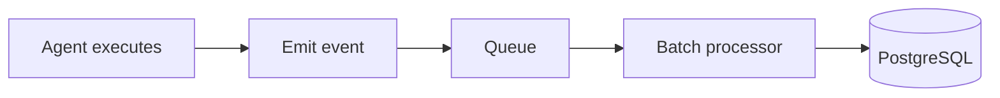
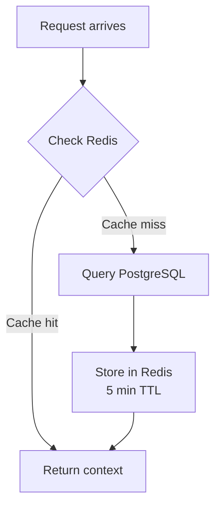
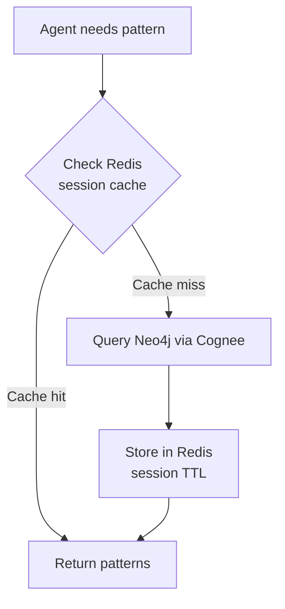

# Data Architecture

**Document:** Data Architecture  
**Version:** 1.0  
**Last Updated:** December 22, 2025

We're using three different data stores, each optimized for what it's good at. All are managed services - for the rationale behind this decision, see [ADR-004](02-architectural-decisions.md#adr-004). For scaling strategies, see [Scalability](09-scalability.md).

## The Three Data Stores

**PostgreSQL + pgvector (RDS)** - Relational data and vectors  
**Neo4j (Aura)** - Knowledge graph for patterns  
**Redis (ElastiCache)** - Cache and transient state

Why three? Because trying to make one database do everything means it does nothing well.

## PostgreSQL: Relational Data

We're using managed RDS PostgreSQL for structured data. Here's what lives there:

**User & Team Management:**

- User accounts and profiles
- Team memberships
- API keys (hashed)
- Subscription plans

**Usage Tracking:**

- Execution records
- Token consumption
- Cost tracking
- Billing events

**Pattern Metadata:**

- Pattern descriptions
- Tags and categories
- Usage statistics

### Why PostgreSQL?

PostgreSQL gives us ACID transactions (user + API key creation in one atomic operation), mature tooling (pgAdmin, DataGrip), the pgvector extension for future vector search, and query flexibility for complex reports. For why we chose managed RDS over self-hosted, see [ADR-004](02-architectural-decisions.md#adr-004-managed-databases).

### Schema Design

Here's the core schema:

```sql
-- Users and teams
CREATE TABLE users (
    id UUID PRIMARY KEY,
    email VARCHAR(255) UNIQUE NOT NULL,
    created_at TIMESTAMP DEFAULT NOW()
);

CREATE TABLE teams (
    id UUID PRIMARY KEY,
    name VARCHAR(255) NOT NULL,
    owner_id UUID REFERENCES users(id),
    created_at TIMESTAMP DEFAULT NOW()
);

CREATE TABLE team_members (
    team_id UUID REFERENCES teams(id),
    user_id UUID REFERENCES users(id),
    role VARCHAR(50),  -- owner, admin, member, viewer
    PRIMARY KEY (team_id, user_id)
);

-- Authentication
CREATE TABLE api_keys (
    id UUID PRIMARY KEY,
    key_hash VARCHAR(255) UNIQUE NOT NULL,  -- bcrypt hash
    user_id UUID REFERENCES users(id),
    team_id UUID REFERENCES teams(id),
    created_at TIMESTAMP DEFAULT NOW(),
    expires_at TIMESTAMP,
    last_used_at TIMESTAMP
);

-- Usage tracking (partitioned by month)
CREATE TABLE usage_records (
    id UUID PRIMARY KEY,
    execution_id VARCHAR(255) UNIQUE,
    user_id UUID REFERENCES users(id),
    team_id UUID REFERENCES teams(id),
    agent VARCHAR(100),
    tokens_input INTEGER,
    tokens_output INTEGER,
    cost_usd DECIMAL(10,4),
    created_at TIMESTAMP DEFAULT NOW()
) PARTITION BY RANGE (created_at);

-- Create monthly partitions
CREATE TABLE usage_records_2024_12 PARTITION OF usage_records
    FOR VALUES FROM ('2024-12-01') TO ('2025-01-01');
```

## Neo4j: Knowledge Graph

Patterns and their relationships live in Neo4j. This is where Cognee stores its knowledge graph.

**Note:** ACE provides the managed Neo4j infrastructure (via Neo4j Aura), but Cognee manages all internal data structures including the graph schema, embeddings, and relationships. ACE treats Cognee as a black box - we query it via MCP protocol and don't directly interact with its data stores.

### Why Neo4j?

Graph databases excel at relationship queries ("find patterns related to this pattern" is one line of Cypher), flexible schemas (no migrations for new fields), and built-in graph algorithms (PageRank, community detection). Most importantly, Cognee uses Neo4j for its knowledge graph - we just host the infrastructure via Neo4j Aura.

### Graph Structure

Here's what the graph looks like:

```cypher
// Pattern nodes
CREATE (p:Pattern {
    id: 'pattern_123',
    title: 'Error Wrapping Pattern',
    content: 'Use fmt.Errorf with %w...',
    domain: 'golang',
    tags: ['error-handling', 'best-practices'],
    created_at: datetime()
})

// Relationships
(:Pattern)-[:RELATES_TO]->(:Pattern)      // Similar patterns
(:Pattern)-[:APPLIES_TO]->(:Domain)       // golang, python, etc.
(:Pattern)-[:USES]->(:Technique)          // Specific techniques
(:Pattern)-[:DERIVES_FROM]->(:Pattern)    // Pattern evolution
```

**Query examples:**

Find related patterns:

```cypher
MATCH (p:Pattern {id: 'pattern_123'})-[:RELATES_TO*1..2]->(related)
RETURN related
ORDER BY related.relevance_score DESC
LIMIT 10
```

Find patterns by domain:

```cypher
MATCH (p:Pattern)-[:APPLIES_TO]->(d:Domain {name: 'golang'})
WHERE p.tags CONTAINS 'error-handling'
RETURN p
```

## Redis: Cache and State

Redis is our speed layer. Anything that needs to be fast lives here.

### Why Redis?

Redis gives us sub-millisecond reads (perfect for hot data), rich data structures (hashes, sets, sorted sets, streams), built-in TTL expiration, and atomic operations (essential for rate limiting). We use managed ElastiCache - see [ADR-004](02-architectural-decisions.md#adr-004-managed-databases) for why.

### What We Store

**User Context (5 min TTL):**

```redis
HSET user:context:user_123
    user_id "user_123"
    team_id "team_456"
    plan_id "pro"
    role "member"

EXPIRE user:context:user_123 300  # 5 minutes
```

**Rate Limit State (1 hour TTL):**

```redis
HSET ratelimit:team_456:hour
    tokens 95
    capacity 100
    refill_rate 100
    last_refill 1703001234

EXPIRE ratelimit:team_456:hour 3600
```

**Pattern Cache (session TTL):**

```redis
HSET pattern:cache:session_abc
    pattern_123 "{ ... full pattern json ... }"
    pattern_456 "{ ... }"

EXPIRE pattern:cache:session_abc 1800  # 30 minutes
```

**Request Counters:**

```redis
INCR requests:api:2024-12-19
EXPIRE requests:api:2024-12-19 86400  # 1 day
```

### Data Structures Used

**Hashes** - For objects with multiple fields (user context, rate limits)

**Strings** - For simple counters and flags

**Sets** - For team member lists, active sessions

**Sorted Sets** - For leaderboards, time-based indexes

## Data Flow Patterns

### Write Path: Usage Tracking

Asynchronous with batching:



We batch writes to PostgreSQL (every 10 seconds or 100 records). Better throughput, fewer transactions.

### Read Path: Authorization

Cache-first with fallback:



Subsequent requests for the same user hit Redis. Fast.

### Read Path: Pattern Search

Similar cache-first approach:



## Data Consistency

### Eventual Consistency

**Usage tracking** - It's okay if usage records are a few seconds behind. We batch writes for performance.

**Pattern cache** - TTL ensures freshness within acceptable window. Stale cache worst case: user sees old pattern for up to 30 minutes.

### Strong Consistency

**Authentication** - API key validation must be accurate. Short TTL (5 min) in Redis. Invalidate cache on key revocation.

**Rate limiting** - Must be accurate to prevent abuse. Redis atomic operations ensure correctness. Lua scripts for complex operations.

## Backup and Recovery

### PostgreSQL

- **Automated backups:** Daily, 7-day retention
- **Point-in-time recovery:** 5-minute granularity
- **RTO:** < 30 minutes
- **RPO:** < 5 minutes

### Neo4j

- **Automated backups:** Daily, 7-day retention
- **RTO:** < 1 hour
- **RPO:** < 24 hours (acceptable for pattern data)

### Redis

- **AOF persistence:** Append-only file, survives restarts
- **Hourly snapshots:** RDB files
- **Automatic failover:** Replica promoted to primary
- **RTO:** < 60 seconds
- **RPO:** ~0 (AOF) or up to 1 hour (snapshot)

## Data Retention

### Hot Data (Active Use)

- Users, teams, API keys: Forever (or until deletion)
- Rate limit state: 1 hour to 1 month depending on window
- User context cache: 5 minutes

### Warm Data (Recent History)

- Usage records: 13 months in PostgreSQL
- Pattern metadata: Forever
- Request logs: 90 days

### Cold Data (Archive)

- Old usage records: S3 Glacier (compliance)
- Long-term analytics: Data warehouse
- Deleted user data: Purged after 30 days

### Compliance

GDPR Right to Deletion:

1. User requests deletion
2. Anonymize usage records (keep for analytics)
3. Delete API keys
4. Remove from team memberships
5. Purge cache entries

## Monitoring

### PostgreSQL Metrics

- Connection pool utilization
- Query performance (slow query log)
- Replication lag
- Storage usage
- Transaction rate

### Neo4j Metrics

- Query latency
- Memory usage
- Connection count
- Cache hit rate

### Redis Metrics

- Memory usage
- Eviction rate (should be zero)
- Cache hit rate
- Replication lag

## Cost Optimization

### Right-Sizing

Start small, scale based on actual metrics:

```text
PostgreSQL: db.t3.medium -> Monitor CPU/Memory -> Upgrade if needed
Neo4j: Professional -> Monitor query performance -> Upgrade tier
Redis: cache.t3.medium -> Monitor memory -> Add replicas or upgrade
```

### Reserved Instances

For production, use 1-year reserved instances:

- PostgreSQL RDS: 40% savings
- ElastiCache: 40% savings
- Predictable costs

### Data Lifecycle

Archive old data to reduce storage costs:

- PostgreSQL: Partition old tables, archive to S3
- Costs drop from $0.115/GB-month (RDS) to $0.023/GB-month (S3)

## Key Takeaways

- **Three databases for three purposes** - Right tool for each job
- **Managed services** - Focus on application, not database operations
- **Cache aggressively** - Redis makes everything faster
- **Consistency where needed** - Eventual for logs, strong for auth
- **Monitor everything** - Catch problems before they impact users

Next doc covers security - zero-trust, Envoy, OPA, and defense in depth.

---

Copyright © 2025 Jeremy K. Johnson. All rights reserved.
