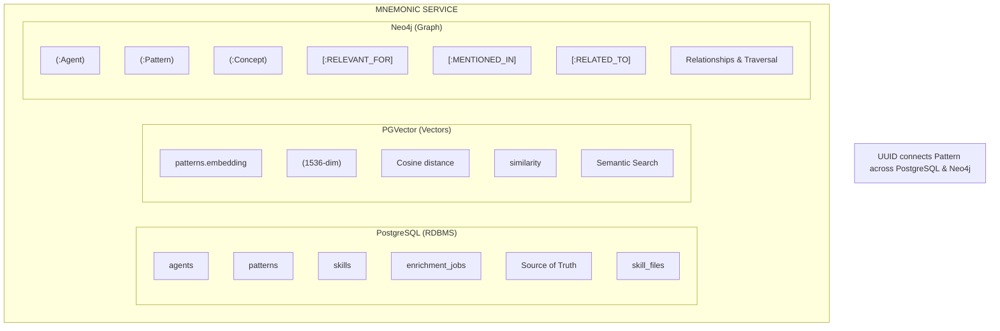
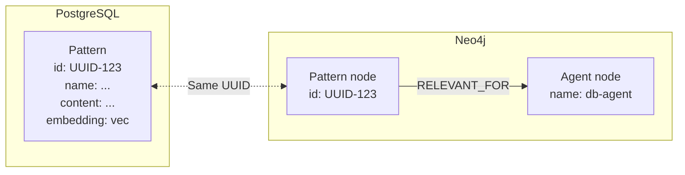
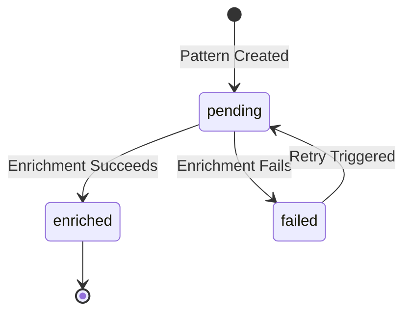
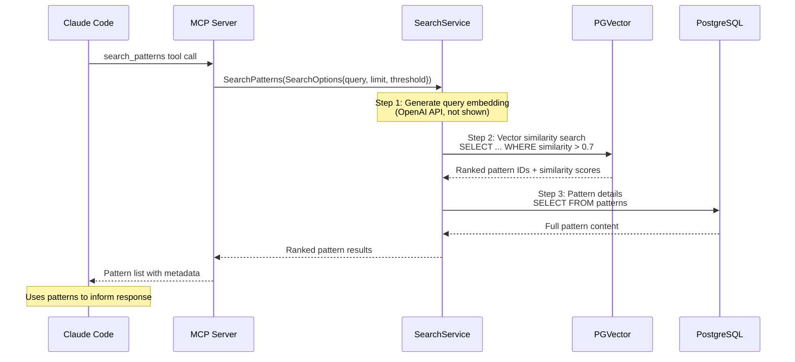

# Database Integration Flow

[Back to Overview](README.md) | [Back to Data Architecture](04-data-architecture.md)

## Table of Contents

- [Overview](#overview)
- [The Three Storage Layers](#the-three-storage-layers)
- [The Pattern UUID: The Universal Key](#the-pattern-uuid-the-universal-key)
- [Data Flow: Pattern Creation and Enrichment](#data-flow-pattern-creation-and-enrichment)
- [Query Flow: Pattern Search Pipeline](#query-flow-pattern-search-pipeline)
- [Sequence Diagram](#sequence-diagram)
- [Summary Table](#summary-table)
- [Post-MVP: Visualization](#post-mvp-visualization)
- [Post-MVP: Admin Tooling](#post-mvp-admin-tooling)
- [Key Takeaways](#key-takeaways)

## Overview

Mnemonic uses a polyglot persistence strategy where three complementary databases work together to provide team knowledge graph storage, semantic search, and relationship traversal. This document explains how data flows between PostgreSQL, PGVector, and Neo4j during pattern creation and query processing.

## The Three Storage Layers

Each database serves a distinct purpose in the Mnemonic architecture:

### PostgreSQL (RDBMS): Structured Data Storage

**Role:** Source of truth for all structured data with ACID transaction guarantees.

**Stores:**

- Agents (name, definition JSONB, crc64)
- Skills (name, definition JSONB, crc64)
- Skill files (skill_id, file_type, filename, document JSONB, crc64)
- Patterns (name, content, tags, enrichment_status)
- Enrichment jobs (background processing queue)
- Pattern associations

**Why PostgreSQL:** Mature ecosystem, excellent Go driver support, JSONB for flexible storage, and transactional consistency across entities.

### PGVector: Semantic Similarity Search

**Role:** Enable semantic search through vector embeddings.

**Stores:**

- Pattern content embeddings (1536 dimensions, OpenAI text-embedding-3-small)
- Vector similarity indexes (IVFFlat or HNSW based on scale)

**Why PGVector:** Single database deployment (no separate vector service), transactional consistency with metadata, and sufficient performance for expected pattern counts.

### Neo4j: Relationship Traversal

**Role:** Knowledge graph for entity relationships and pattern connections.

**Stores:**

- Pattern nodes (mirrored from PostgreSQL with id, name, description)
- Agent nodes (mirrored from PostgreSQL with name)
- Concept nodes (extracted during enrichment: technology, practice, domain)
- Relationships:
  - `(:Pattern)-[:RELEVANT_FOR {relevance: 0.95}]->(:Agent)`
  - `(:Concept)-[:MENTIONED_IN]->(:Pattern)`
  - `(:Pattern)-[:RELATED_TO {similarity: 0.85}]->(:Pattern)`

**Why Neo4j:** Native graph model for relationship-heavy queries, expressive Cypher query language, and built-in graph algorithms.

### Diagram: Three Storage Layers



## The Pattern UUID: The Universal Key

Every pattern has a UUID that serves as the universal identifier across both PostgreSQL and Neo4j. This UUID is the key that connects structured data, vector embeddings, and graph relationships.

### PostgreSQL Storage

```sql
-- patterns table
id: UUID (Primary Key)
name: VARCHAR(128)
description: VARCHAR(500)
content: TEXT (up to 10KB)
tags: JSONB
embedding: vector(1536)
enrichment_status: ENUM ('pending', 'enriched', 'failed')
enriched_at: TIMESTAMPTZ
```

**Example Row:**

```text
id: 550e8400-e29b-41d4-a716-446655440001
name: "sql-query-optimization"
content: "Use EXPLAIN ANALYZE to identify slow queries..."
embedding: vector(1536) [0.023, -0.145, ...]
enrichment_status: 'enriched'
```

### Neo4j Storage

```cypher
// Pattern node in Neo4j
(:Pattern {
  id: "550e8400-e29b-41d4-a716-446655440001",
  name: "sql-query-optimization",
  description: "Database query optimization techniques"
})
```

### Cross-Database Connections

The same UUID enables queries like:

1. Find patterns similar to query (PGVector search)
2. Use pattern UUIDs to look up graph relationships (Neo4j traversal)
3. Retrieve full pattern details (PostgreSQL lookup)



## Data Flow: Pattern Creation and Enrichment

Pattern enrichment is an asynchronous pipeline that transforms raw content into searchable, connected knowledge.

### Step-by-Step Flow

**Step 1: Pattern Created (PostgreSQL)**

```http
POST /v1/api/patterns
{
  "name": "sql-optimization",
  "content": "Use EXPLAIN ANALYZE to identify slow queries...",
  "tags": ["database", "performance"]
}
```

```sql
-- Postgres INSERT
INSERT INTO patterns (id, name, content, tags, enrichment_status)
VALUES (
  gen_random_uuid(),
  'sql-optimization',
  'Use EXPLAIN ANALYZE...',
  '["database", "performance"]'::jsonb,
  'pending'
);
-- id generated: 550e8400-e29b-41d4-a716-446655440001

-- Enrichment job created
INSERT INTO enrichment_jobs (pattern_id, status)
VALUES ('550e8400-e29b-41d4-a716-446655440001', 'pending');
```

**Step 2: Background Worker Claims Job**

```go
// Worker claims job atomically
SELECT id, pattern_id
FROM enrichment_jobs
WHERE status = 'pending'
  AND scheduled_for <= NOW()
ORDER BY scheduled_for
LIMIT 1
FOR UPDATE SKIP LOCKED;
```

**Step 3: Generate Embedding (OpenAI API)**

```go
// Call OpenAI embedding API
embedding := openai.CreateEmbedding(
  model: "text-embedding-3-small",
  input: pattern.Content,
)
// Returns: vector(1536) [0.023, -0.145, 0.087, ...]
```

**Step 4: Store Embedding (PGVector)**

```sql
UPDATE patterns
SET embedding = $1::vector,
    enrichment_status = 'enriched',
    enriched_at = NOW()
WHERE id = '550e8400-e29b-41d4-a716-446655440001';
```

**Step 5: Extract Concepts (LLM)**

```go
// LLM extracts entities and concepts from content
concepts := llm.ExtractConcepts(pattern.Content)
// Returns: [
//   {name: "sql", type: "technology"},
//   {name: "query-optimization", type: "practice"},
//   {name: "performance-tuning", type: "domain"}
// ]
```

**Step 6: Create Graph Nodes and Relationships (Neo4j)**

```cypher
// Create Pattern node
MERGE (p:Pattern {id: "550e8400-e29b-41d4-a716-446655440001"})
SET p.name = "sql-optimization",
    p.description = "Database query optimization"

// Create Concept nodes
MERGE (c1:Concept {name: "sql", type: "technology"})
MERGE (c2:Concept {name: "query-optimization", type: "practice"})

// Create relationships
MERGE (c1)-[:MENTIONED_IN]->(p)
MERGE (c2)-[:MENTIONED_IN]->(p)

// Link to relevant agents (if associations exist)
MATCH (a:Agent {name: "database-agent"})
MERGE (p)-[:RELEVANT_FOR {relevance: 0.95}]->(a)
```

After creating concept nodes and MENTIONED_IN edges, the enricher computes RELATED_TO edges between this pattern and other patterns that share one or more of the same concepts. This step populates the pattern-to-pattern similarity relationships used by `find_related_patterns`.

**Step 7: Complete Enrichment Job**

```sql
UPDATE enrichment_jobs
SET status = 'completed',
    completed_at = NOW()
WHERE pattern_id = '550e8400-e29b-41d4-a716-446655440001';
```

### Enrichment State Transitions



## Query Flow: Pattern Search Pipeline

This is the core operation: turning an MCP tool call into a knowledge graph query that returns ranked pattern results.

### MCP Tool Call

```json
{
  "method": "tools/call",
  "params": {
    "name": "search_patterns",
    "arguments": {
      "query": "How do I optimize SQL queries?",
      "max_results": 5
    }
  }
}
```

### Internal Processing Steps

**Step 1: Query Embedding (OpenAI)**

```go
// Generate embedding for search query
queryEmbedding := openai.CreateEmbedding(
  model: "text-embedding-3-small",
  input: "How do I optimize SQL queries?",
)
// Returns: vector(1536)
```

**Step 2: Semantic Search (PGVector Similarity Search)**

```sql
-- Find patterns semantically similar to query
SELECT
  id,
  name,
  content,
  1 - (embedding <=> $1::vector) AS similarity
FROM patterns
WHERE enrichment_status = 'enriched'
  AND 1 - (embedding <=> $1::vector) > 0.7  -- threshold
ORDER BY embedding <=> $1::vector
LIMIT 5;
```

**Results:**

```text
id: 550e8400-...001, name: sql-optimization, similarity: 0.94
id: 550e8400-...002, name: database-indexing, similarity: 0.82
id: 550e8400-...003, name: query-performance, similarity: 0.78
```

**Step 3: Response Assembly**

```json
{
  "patterns": [
    {
      "id": "550e8400-...001",
      "name": "sql-optimization",
      "content": "Use EXPLAIN ANALYZE to identify slow queries...",
      "similarity": 0.94,
      "concepts": ["sql", "query-optimization", "performance-tuning"],
      "related_patterns": ["550e8400-...004", "550e8400-...005"]
    },
    {
      "id": "550e8400-...002",
      "name": "database-indexing",
      "content": "B-tree indexes are optimal for equality and range queries...",
      "similarity": 0.82,
      "concepts": ["indexing", "database"],
      "related_patterns": ["550e8400-...001"]
    }
  ]
}
```

The MCP server returns these ranked patterns to Claude Code, which uses them to inform its responses.

Post-MVP: search_patterns will incorporate graph scores via `relevance = (0.7 × vector_similarity) + (0.3 × graph_score)`. See [Pattern Processing](../../docs/design/pattern-processing.md) for the planned algorithm.

## Sequence Diagram



## Summary Table

This table shows how each database contributes to pattern search:

| Step | Database   | Question Asked                 | Query Type        | Returns                        |
| ---- | ---------- | ------------------------------ | ----------------- | ------------------------------ |
| 1    | PGVector   | "What patterns match?"         | Vector similarity | Ranked pattern IDs + similarity scores |
| 2    | PostgreSQL | "Get full pattern details"     | Relational lookup | Pattern content and metadata   |

**Data Flow Pattern:**

1. PGVector finds and ranks candidate patterns via vector similarity (MVP)
2. PostgreSQL provides full pattern content and metadata

Post-MVP: search_patterns will incorporate Neo4j graph scores via `relevance = (0.7 × vector_similarity) + (0.3 × graph_score)`.

## Post-MVP: Visualization

While not part of the MVP, there's an interesting opportunity to visualize the embedding space and cluster structure.

**The Idea:**

Use dimensionality reduction techniques (t-SNE, UMAP) to project the 1536-dimensional embeddings down to 3D space for interactive visualization.

**What You Could See:**

- Centroids as large spheres showing cluster centers
- Patterns as smaller points colored by agent associations
- Distance between points representing semantic similarity
- Cluster boundaries showing how IVFFlat organizes knowledge

**Potential Benefits:**

- Debug search results (why did this pattern match?)
- Find knowledge gaps (sparse areas in the embedding space)
- Validate cluster configuration (are related patterns grouping together?)
- Visual exploration of the knowledge graph

**Tools:**

- TensorBoard Embedding Projector (3D visualization with metadata)
- Plotly (interactive 3D scatter plots)
- Three.js (custom WebGL visualizations)

This would be particularly useful for understanding and tuning the `lists` and `probes` parameters, or identifying when patterns are poorly distributed across clusters.

## Post-MVP: Admin Tooling

Managing the knowledge graph in production requires admin tools beyond the core MCP interface.

**Potential API endpoints:**

```text
DELETE /v1/patterns/{id}               - Remove single pattern
POST   /v1/patterns/prune              - Bulk cleanup (by age, tags, etc.)
GET    /v1/patterns/orphans            - Find patterns with no concept connections
POST   /v1/patterns/{id}/re-enrich    - Re-trigger failed enrichment

DELETE /v1/agents/{name}               - Remove agent definition
DELETE /v1/skills/{name}               - Remove skill definition
```

**Potential CLI commands:**

```bash
mnemonic admin patterns delete <id>
mnemonic admin patterns prune --older-than 90d
mnemonic admin patterns list --status failed
mnemonic admin patterns re-enrich <id>
```

**Potential admin UI features:**

- Browse patterns with search/filter
- View enrichment status and errors
- Delete/archive outdated patterns
- Re-trigger enrichment for failed patterns
- View the 3D embedding visualization (see [Post-MVP: Visualization](#post-mvp-visualization))
- Manage agent/skill definitions

This is a post-MVP feature. The database-level operations work; admin tooling adds a usability layer for operators.

## Key Takeaways

- **Three complementary databases** - Each chosen for specific strengths: PostgreSQL (ACID), PGVector (semantic search), Neo4j (relationships)
- **Pattern UUID is the universal key** - Same identifier connects data across PostgreSQL and Neo4j
- **Enrichment is asynchronous** - Pattern processing happens in background jobs to avoid API latency
- **Pattern search uses vector similarity (MVP-1)** - PGVector ranks results by cosine similarity; PostgreSQL provides full pattern details. Blended scoring with Neo4j graph context is planned post-MVP.
- **PostgreSQL is source of truth** - Other databases contain projections and derived data
- **Graph relationships add context** - Neo4j expands beyond similarity to include explicit knowledge connections

**Next Steps:**

- Review [Data Architecture](04-data-architecture.md) for detailed schemas and configurations
- Review [Pivot API Specification](../design/2026-02-15-pivot-api-specification.md) for API details
- Review [Data Storage](../design/data-storage.md) for storage implementation details

---

See also:

- [System Architecture](02-system-architecture.md) for component overview
- [Pivot API Specification](../design/2026-02-15-pivot-api-specification.md) for REST API details
- [Deployment Architecture](06-deployment-architecture.md) for scaling patterns

**Next:** [Deployment Architecture](06-deployment-architecture.md)
