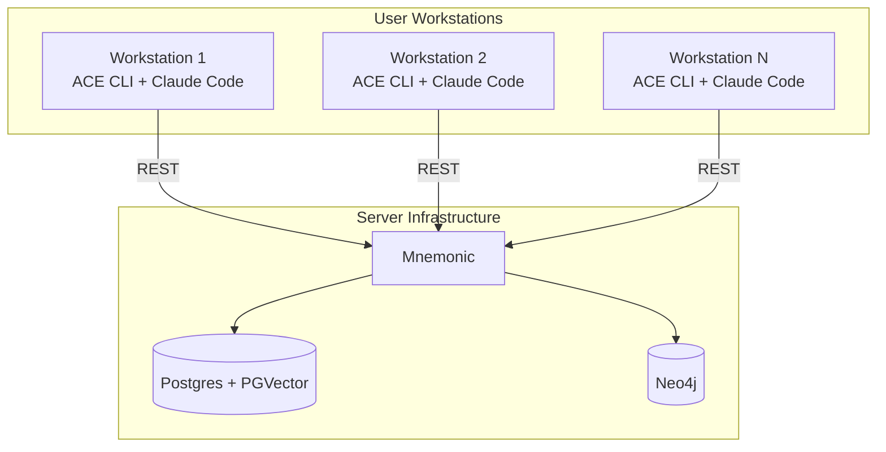
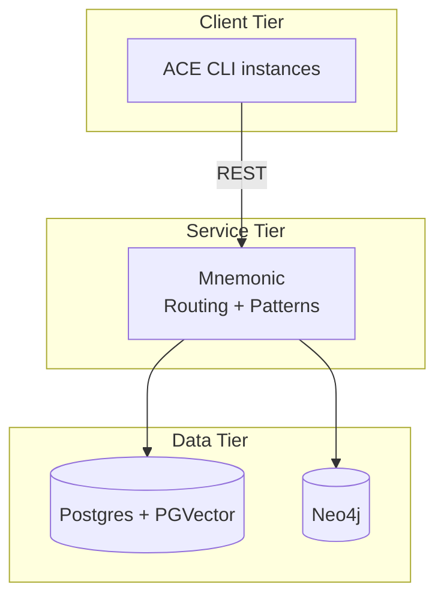
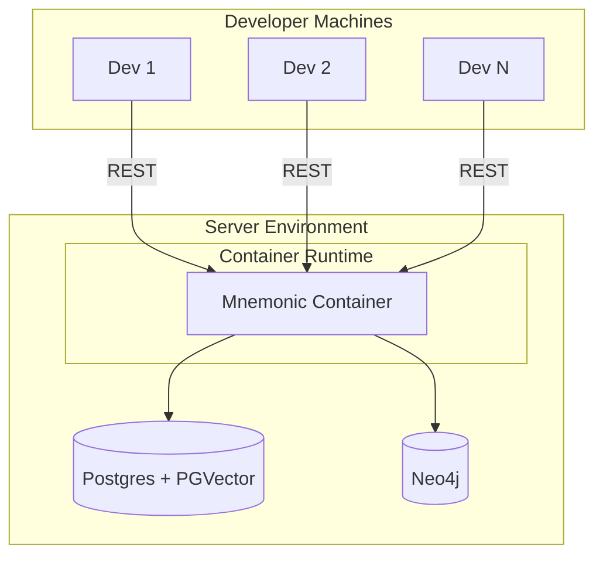
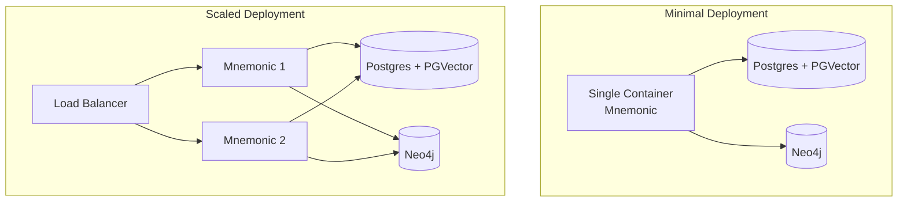
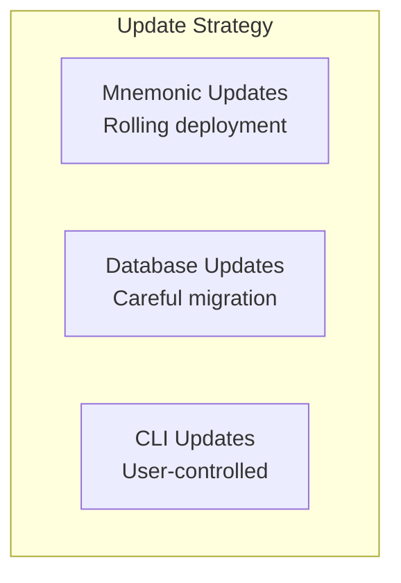
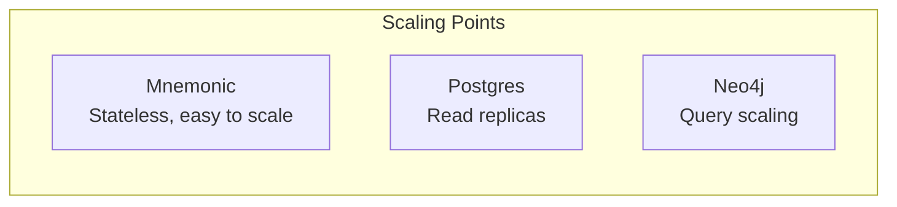

# Deployment Architecture

[Back to Overview](00-overview.md) | [Back to Project README](../../README.md)

## Table of Contents

- [Deployment Overview](#deployment-overview)
- [Deployment Topology](#deployment-topology)
- [Component Deployment](#component-deployment)
  - [ACE CLI](#ace-cli)
  - [Mnemonic](#mnemonic)
- [Infrastructure Requirements](#infrastructure-requirements)
- [Operational Considerations](#operational-considerations)
- [Scaling Considerations](#scaling-considerations)

## Deployment Overview

ACE uses a lightweight deployment model with minimal server-side infrastructure. The heavy lifting (LLM inference, tool execution) happens on user workstations.

## Deployment Topology

### Logical View

### Physical View

The physical deployment is intentionally simple.

## Component Deployment

### ACE CLI

**Deployment Location:** User workstations

**Characteristics:**

- Installed per-user or per-machine
- No persistent state (stateless between invocations)
- Requires network access to Mnemonic
- Requires Claude Code installation (Phase 1)

**Distribution:**

To be specified in design phase.

| Aspect        | Detail                            |
| ------------- | --------------------------------- |
| Method        | To be specified in design phase   |
| Updates       | To be specified in design phase   |
| Configuration | To be specified in design phase   |

### Mnemonic

**Deployment Location:** Server infrastructure

**Characteristics:**

- Stateless service (routing rules and patterns from storage)
- Lightweight (no LLM inference)
- Horizontally scalable (if needed)
- Single point of contact for all CLI instances
- REST API for external communication

**Resource Requirements:**

| Resource | Expectation |
|----------|-------------|
| CPU | Low to moderate (routing + pattern queries) |
| Memory | Moderate (caching, pattern indexing) |
| Storage | Via external databases (Postgres, Neo4j) |
| Network | Moderate (all CLI traffic) |

**Storage Stack:**

- **Postgres** - Relational data (agents, routing rules, metadata)
- **PGVector** - Vector embeddings for semantic search
- **Neo4j** - Knowledge graph for pattern relationships

## Infrastructure Requirements

### Server Infrastructure

The server-side footprint is intentionally minimal.

**Minimal Deployment:**

- Single Mnemonic container
- External Postgres and Neo4j databases
- Suitable for small teams

**Scaled Deployment:**

- Multiple Mnemonic instances behind load balancer
- Shared database backends
- Suitable for larger teams or high availability requirements

### Client Requirements

| Requirement | Phase 1 | Phase 2 |
|-------------|---------|---------|
| ACE CLI | Required | Required |
| Claude Code | Required | Optional |
| Anthropic API key | Via Claude Code | Direct |
| Network access | To Mnemonic | To Mnemonic + Anthropic |

## Operational Considerations

### Monitoring

Key metrics to monitor:

| Component | Metrics |
|-----------|---------|
| Mnemonic | Request rate, latency, error rate, pattern queries |
| Postgres | Connection count, query latency, storage usage |
| Neo4j | Query latency, memory usage, connection count |
| CLI (aggregated) | Usage patterns, version distribution |

### Logging

| Component | Log Focus                                   |
| --------- | ------------------------------------------- |
| Mnemonic  | Routing decisions, pattern queries, errors  |
| CLI       | To be specified in design phase             |

### Backup and Recovery

| Component         | Strategy                          |
| ----------------- | --------------------------------- |
| Routing rules     | To be specified in design phase   |
| Postgres data     | To be specified in design phase   |
| Neo4j data        | To be specified in design phase   |
| CLI configuration | To be specified in design phase   |

### Updates and Maintenance

| Component | Update Approach |
|-----------|----------------|
| Mnemonic | Rolling deployment, backward compatible |
| Databases | Migration-aware, data preservation |
| CLI | User-initiated, version compatibility checks |

## Scaling Considerations

### Horizontal Scaling

| Component | Scaling Approach                        |
| --------- | --------------------------------------- |
| Mnemonic  | Add instances behind load balancer      |
| Postgres  | Read replicas, connection pooling       |
| Neo4j     | To be specified in design phase         |

### Performance Considerations

- Mnemonic latency should be minimal (routing is fast)
- Pattern queries should be cached where possible
- CLI-side caching can reduce Mnemonic calls
- Claude Code execution is the primary latency source (not ACE)

### Capacity Planning

| Factor | Consideration |
|--------|---------------|
| Team size | Number of concurrent CLI users |
| Request rate | Queries per minute to Mnemonic |
| Pattern volume | Total patterns in storage |
| Pattern size | Average pattern complexity |

**Next:** Return to [Architecture Overview](00-overview.md)
