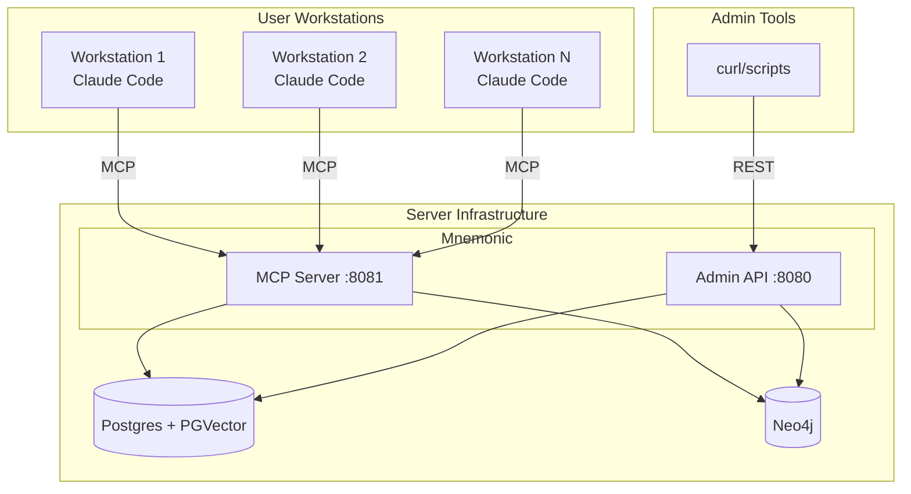
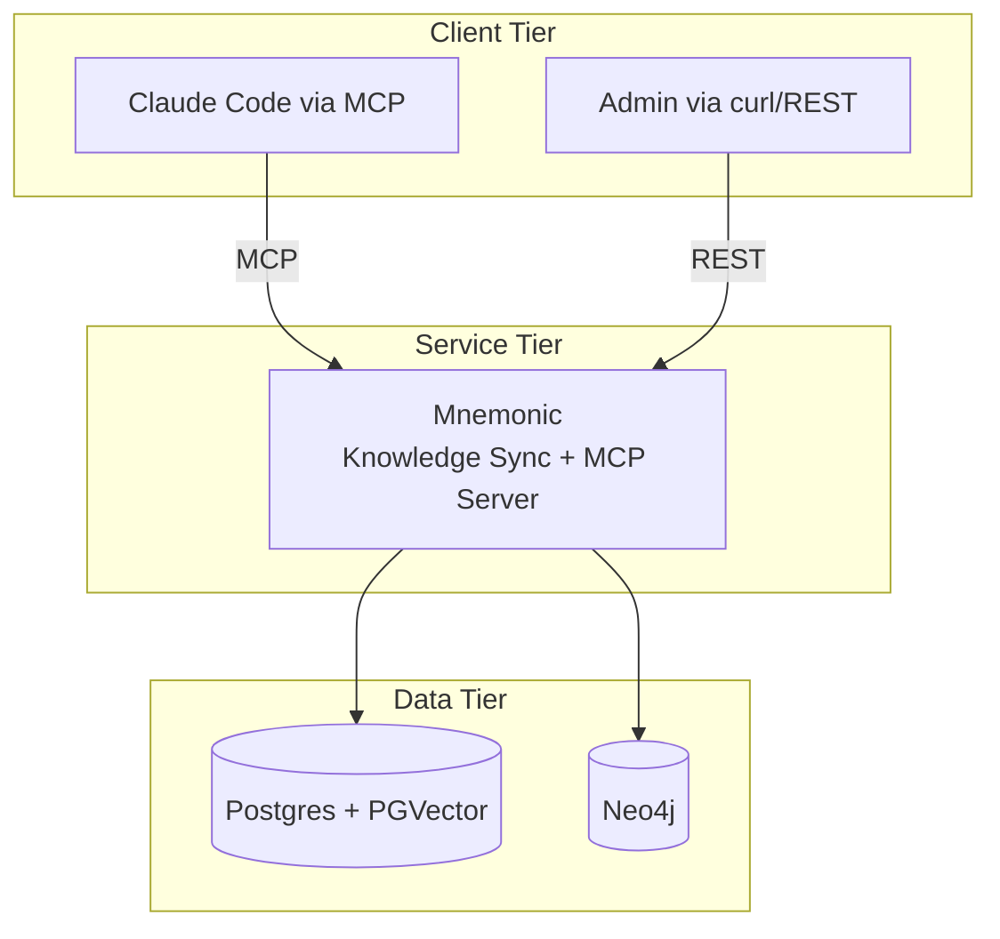
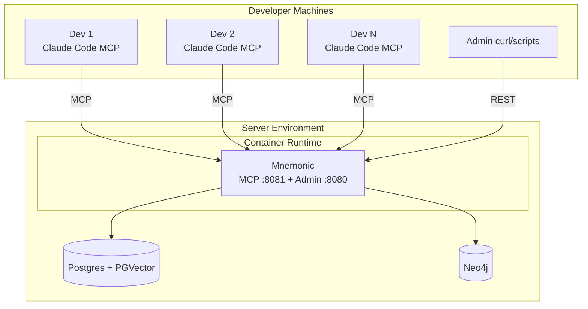
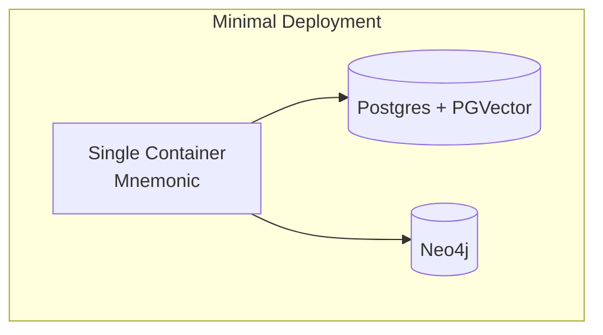
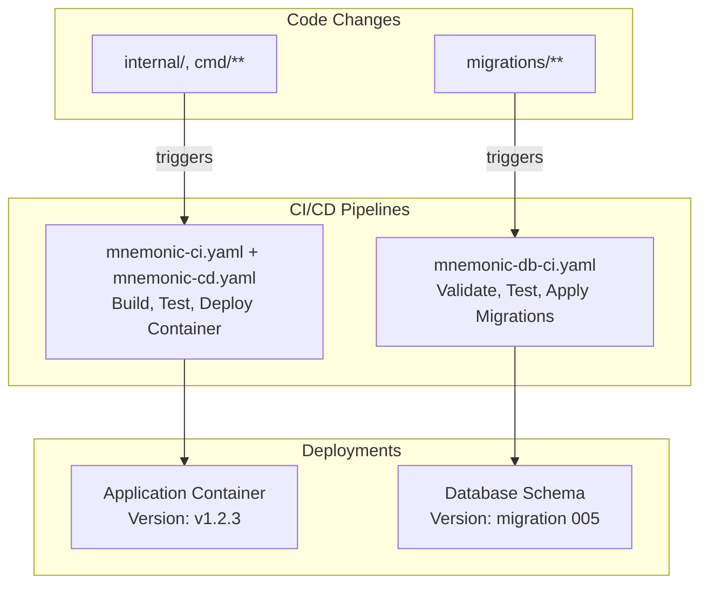
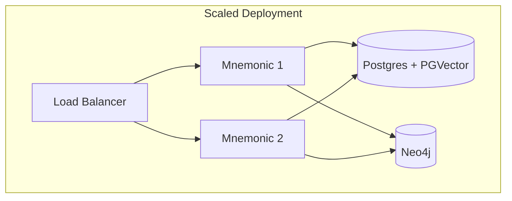
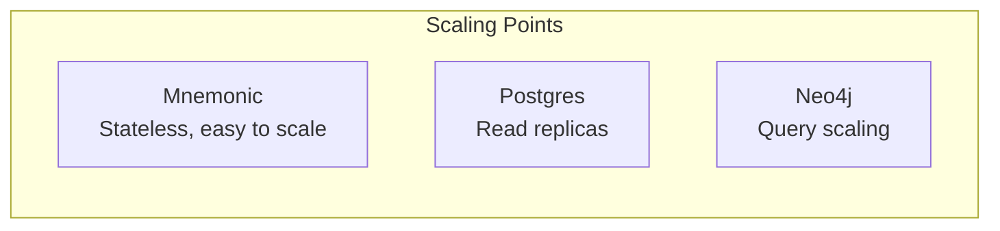
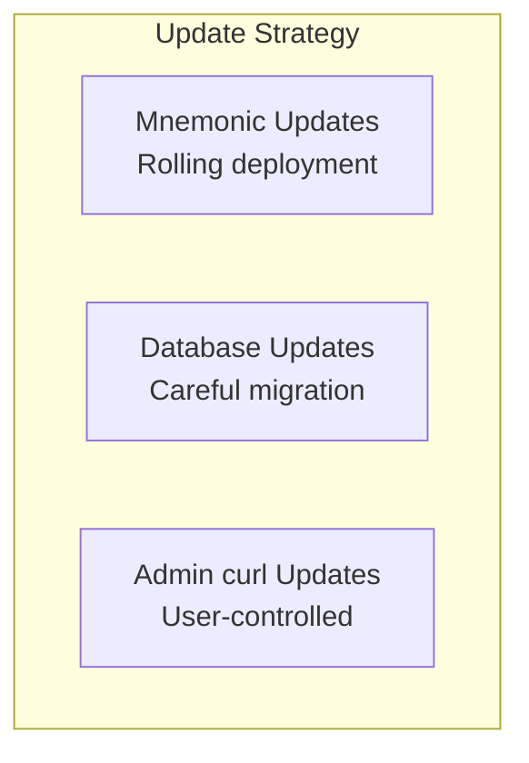

# Deployment Architecture

[Back to Overview](README.md) | [Back to Project README](../../README.md)

## Table of Contents

- [MVP](#mvp)
  - [Deployment Overview](#deployment-overview)
  - [Deployment Topology](#deployment-topology)
  - [Component Deployment](#component-deployment)
  - [Infrastructure Requirements](#infrastructure-requirements)
  - [Operational Considerations](#operational-considerations)
  - [Independent Deployment Pipelines](#independent-deployment-pipelines)
- [Post-MVP](#post-mvp)
  - [Production Deployment](#production-deployment)
  - [Backup and Recovery](#backup-and-recovery)
  - [Scaling Considerations](#scaling-considerations)
  - [Log Collection Infrastructure](#log-collection-infrastructure)
  - [Updates and Maintenance](#updates-and-maintenance)

## MVP

### Deployment Overview

Mnemonic uses a lightweight deployment model with minimal server-side infrastructure. The heavy lifting (LLM inference, tool execution) happens on user workstations via Claude Code.



### Deployment Topology

#### Logical View



#### Physical View

The physical deployment is intentionally simple.



### Component Deployment

#### Mnemonic

**Deployment Location:** Server infrastructure

**Characteristics:**

- Single server process with two HTTP listeners (Admin REST :8080, MCP :8081)
- Stateless service (patterns and tooling from storage)
- Lightweight (calls embedding API for pattern enrichment; no generative AI inference)
- Horizontally scalable (if needed)
- Dual protocol architecture (REST admin + MCP read-only)

**Resource Requirements:**

| Resource | Expectation                                    |
| -------- | ---------------------------------------------- |
| CPU      | Low to moderate (pattern queries, MCP serving) |
| Memory   | Moderate (caching, pattern indexing)           |
| Storage  | Via external databases (Postgres, Neo4j)       |
| Network  | Moderate (all MCP + admin traffic)             |

**Storage Stack:**

- **Postgres** - Relational data (patterns, agents, skills, metadata)
- **PGVector** - Vector embeddings for semantic search
- **Neo4j** - Knowledge graph for pattern relationships (required)

### Infrastructure Requirements

#### Server Infrastructure

The server-side footprint is intentionally minimal for MVP: a single Mnemonic container with external Postgres and Neo4j databases, suitable for small teams.



#### Client Requirements

| Requirement       | MVP Local Deployment  |
| ----------------- | --------------------- |
| Claude Code       | Required              |
| MCP Support       | Required              |
| Anthropic API key | Via Claude Code       |
| Network access    | To Mnemonic MCP :8081 |

#### Admin Requirements

| Requirement      | MVP Local Deployment |
| ---------------- | -------------------- |
| curl/HTTP client | Required             |
| Network access   | To Admin API :8080   |
| Authentication   | None (trusted)       |

### Operational Considerations

#### Monitoring

Key metrics to monitor:

| Component      | Metrics                                             |
| -------------- | --------------------------------------------------- |
| Mnemonic MCP   | Request rate, latency, error rate, pattern searches |
| Mnemonic Admin | Write operations, data loading, tooling updates     |
| Postgres       | Connection count, query latency, storage usage      |
| Neo4j          | Query latency, memory usage, connection count       |

#### Logging

Mnemonic emits structured logs with trace correlation via OpenTelemetry (see [Observability Architecture](07-observability-architecture.md)).

| Component      | Log Focus                                                        |
| -------------- | ---------------------------------------------------------------- |
| Mnemonic MCP   | Pattern searches, errors (instrumented in MVP)                   |
| Mnemonic Admin | Data loading, CRUD operations, errors (instrumented in MVP)      |

### Independent Deployment Pipelines

**CRITICAL PRINCIPLE:** Database migrations and application code are versioned and deployed independently.



**Implementation Status:**

The Mnemonic application CI/CD pipeline is now operational:

- **CI workflow** (`mnemonic-ci.yaml`) - Builds Docker image, runs unit and E2E tests, uploads artifact
- **CD workflow** (`mnemonic-cd.yaml`) - Downloads artifact from CI, pushes to registry
- **Database migrations pipeline** - Post-MVP

The CI/CD separation pattern ensures clean separation of concerns:

- CI focuses on validation (build, test, artifact creation)
- CD focuses on deployment (registry push)
- Database migrations will have dedicated pipeline to avoid coupling with application deployments

**Why Separate Pipelines?**

| Scenario          | Without Separation               | With Separation           |
| ----------------- | -------------------------------- | ------------------------- |
| Go logic bug fix  | Rebuilds app AND runs migrations | App deploys only          |
| Add new index     | Rebuilds app container           | Migrations run only       |
| Add column + code | Single coupled deploy            | Migration first, then app |

**Pipeline Triggers:**

| Pipeline                        | Triggers On                                | Does NOT Trigger On  |
| ------------------------------- | ------------------------------------------ | -------------------- |
| `mnemonic-ci.yaml`              | `src/mnemonic/**` (excludes `migrations/`) | `migrations/**`      |
| `mnemonic-cd.yaml`              | Triggered by successful `mnemonic-ci.yaml` | Manual triggers only |
| `mnemonic-db-ci.yaml` (Planned) | `migrations/**`                            | `src/mnemonic/**`    |

**Version Compatibility:**

- Application version: Git tag (e.g., `v1.2.3`)
- Database version: Highest applied migration (e.g., `005`)
- Compatibility matrix documented in release notes

**Deployment Order for Breaking Changes:**

```text
1. Deploy migration (forward-compatible: nullable/default values)
2. Verify migration succeeded in production
3. Deploy application (uses new schema)
4. (Optional) Deploy tightening migration (add NOT NULL, remove old columns)
```

This separation ensures:

- Faster deployments (only deploy what changed)
- Safer rollbacks (can rollback app without touching DB)
- Clear audit trail (which pipeline changed what)

## Post-MVP

### Production Deployment

Production deployment extends the [MVP topology](#deployment-topology) with an Envoy proxy for TLS termination, authentication enforcement, and routing, plus OPA for policy-based authorization.

The [MVP client and admin requirements](#infrastructure-requirements) remain in place; the following additions apply in production:

| Requirement    | Production Deployment                            |
| -------------- | ------------------------------------------------ |
| Client network | To Mnemonic MCP :8081 (via Envoy)                |
| Admin network  | To Admin API :8080 (via Envoy + OPA)             |
| Authentication | OAuth2 tokens via Envoy (admin); none for client |

The [MVP minimal deployment](#server-infrastructure) scales to multiple Mnemonic instances behind a load balancer when needed — see [Scaling Considerations](#scaling-considerations).

### Backup and Recovery

Backup procedures for all components are to be designed.

| Component                        | Strategy                         |
| -------------------------------- | -------------------------------- |
| Patterns                         | Backup procedures to be designed |
| Tooling (agents/skills)          | Backup procedures to be designed |
| Postgres data                    | Backup procedures to be designed |
| Neo4j data                       | Backup procedures to be designed |

### Scaling Considerations

Mnemonic is stateless and horizontally scalable. The [MVP single-container deployment](#server-infrastructure) scales to the following topology when load or availability requirements grow:



#### Horizontal Scaling



| Component | Scaling Approach                          |
| --------- | ----------------------------------------- |
| Mnemonic  | Add instances behind load balancer        |
| Postgres  | Read replicas, connection pooling         |
| Neo4j     | Scaling approach to be designed           |

#### Performance Considerations

- Mnemonic latency should be minimal (knowledge graph queries and MCP serving are fast)
- Pattern queries should be cached where possible
- Claude Code execution is the primary latency source (not Mnemonic)

#### Capacity Planning

| Factor         | Consideration                      |
| -------------- | ---------------------------------- |
| Team size      | Number of concurrent MCP/API users |
| Request rate   | Queries per minute to Mnemonic     |
| Pattern volume | Total patterns in storage          |
| Pattern size   | Average pattern complexity         |

### Log Collection Infrastructure

The [MVP logging](#logging) covers instrumentation (emitting structured logs with trace correlation). Log collection, aggregation, querying, and retention infrastructure (Loki) is Post-MVP.

### Updates and Maintenance



| Component | Update Approach                         |
| --------- | --------------------------------------- |
| Mnemonic  | Rolling deployment, backward compatible |
| Databases | Migration-aware, data preservation      |

**Next:** [Observability Architecture](07-observability-architecture.md)
