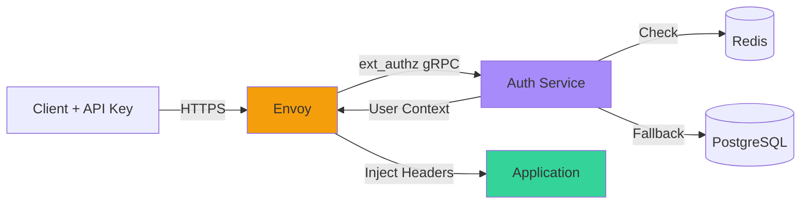
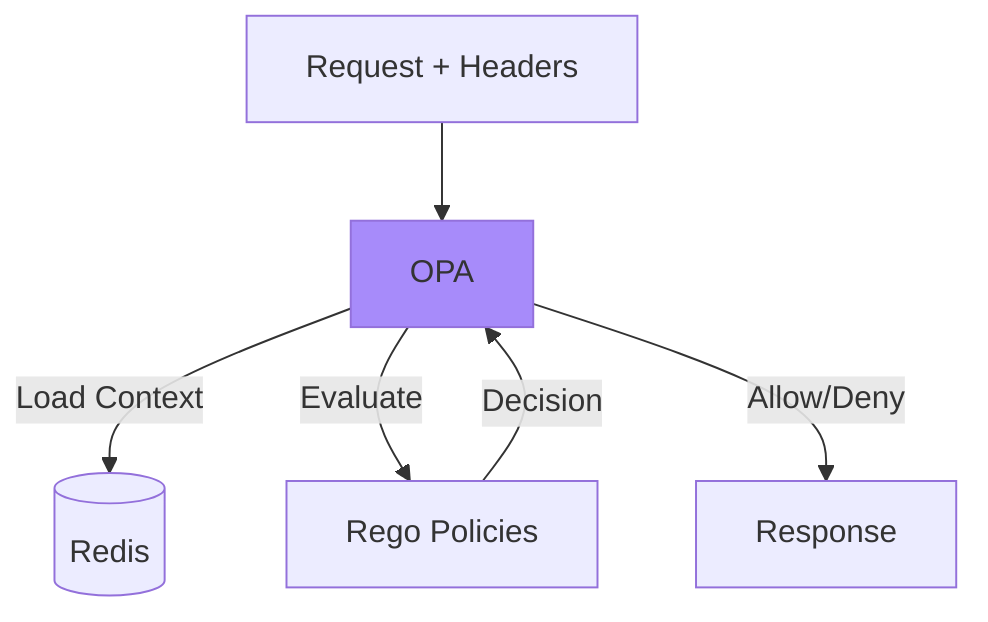
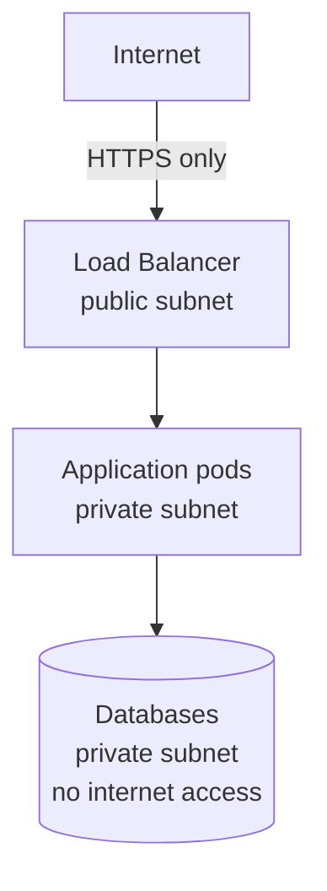

# Security Architecture

**Document:** Security Architecture  
**Version:** 1.0  
**Last Updated:** December 22, 2025

Security isn't an afterthought - it's baked into the architecture from day one. Let's talk about how we're protecting the system.

## Defense in Depth

We're using multiple layers of security. If one layer fails, others are still protecting us.

Think of it like a castle: moat, walls, guards, locked doors, and a vault. Each layer makes it harder to get to the treasure.

**Our layers:**

1. Network security (VPC, security groups)
2. Transport security (TLS everywhere)
3. Authentication (who are you?)
4. Authorization (what can you do?)
5. Application security (input validation, rate limiting)
6. Data security (encryption at rest)

## Zero-Trust Architecture

We don't trust anything by default. Every request must prove itself, even if it's coming from inside our network.

**The principle:** Verify explicitly, grant least privilege, assume breach.

**In practice:**

- Every service authenticates every request
- No "trusted internal network" assumption
- mTLS between all services
- Audit everything

## Authentication: Who Are You?

Authentication is handled at the infrastructure layer by Envoy, not in application code.

### How It Works



**The flow:**

1. Client sends request with `X-API-Key: sk-ace-abc123...`
2. Envoy intercepts and calls auth service
3. Auth service validates key (Redis cache first, PostgreSQL if miss)
4. Auth service returns user context (user_id, team_id, plan)
5. Envoy injects headers: `X-User-ID`, `X-Team-ID`, `X-Plan-ID`
6. Request forwarded to application
7. Application trusts the headers (they came from Envoy, not the user)

**Why this is better:**

- Zero auth code in application
- Can't bypass (Envoy is mandatory)
- Update auth logic without deploying app
- Language agnostic

### API Key Format

`sk-ace-{random_32_chars}`

- `sk` = secret key (convention)
- `ace` = our product name
- Random part = cryptographically secure random bytes

**Storage:** Hashed with bcrypt in PostgreSQL. We never store plaintext keys.

**Rotation:** Users can generate new keys anytime. Old keys revoke immediately.

### Failure Mode

If auth service is down: **Deny all requests**

We fail closed, not open. Security over availability. Better to be down than compromised.

## Authorization: What Can You Do?

Authorization is handled by OPA (Open Policy Agent) sidecars. Policies are written in Rego.

### How It Works



### Example Policy

```rego
package ace.authz

# Check if user's plan allows this agent
allow {
    input.headers["x-plan-id"] == "pro"
    input.request.agent == "go-software-agent"
}

# Admins can access everything
allow {
    input.headers["x-role"] == "admin"
}

# Team owners can manage team
allow_team_management {
    input.headers["x-role"] == "owner"
    input.request.path == "/api/v1/teams/manage"
}
```

**Benefits:**

- Policy as code (version controlled)
- Testable independently
- Update without deployment
- Clear audit trail

### Plan-Based Features

Different plans get different features:

| Plan       | Agents                          | Requests/Month | Team Sharing | Extras             |
| ---------- | ------------------------------- | -------------- | ------------ | ------------------ |
| Free       | 2 (shell-script, bats-test)     | 100            | No           | -                  |
| Pro        | All agents                      | 10,000         | Yes          | Priority support   |
| Enterprise | All agents + custom             | Unlimited      | Yes          | SLA guarantees     |

OPA enforces these limits automatically.

## Rate Limiting

We use token bucket algorithm with Redis for shared state.

### Token Bucket Explained

Imagine a bucket that holds tokens. Each request needs 1 token. Bucket refills over time.

```text
Bucket holds: 100 tokens
Refill rate: 100 tokens/hour
Request arrives: Take 1 token
Bucket empty: Reject request (429)
```

**Implementation in Redis:**

```lua
-- Atomic Lua script
local tokens = redis.call('HGET', KEYS[1], 'tokens') or capacity
local last_refill = redis.call('HGET', KEYS[1], 'last_refill') or now

-- Refill based on elapsed time
local elapsed = now - last_refill
local tokens_to_add = math.floor(elapsed * refill_rate / 3600)
tokens = math.min(capacity, tokens + tokens_to_add)

-- Check and consume
if tokens < 1 then
    return {0, tokens}  -- Denied
end

tokens = tokens - 1
redis.call('HMSET', KEYS[1], 'tokens', tokens, 'last_refill', now)
return {1, tokens}  -- Allowed
```

**Multi-level limits:**

1. Global (protect infrastructure)
2. Per-team (enforce plans)
3. Per-user (prevent abuse)
4. Per-agent (specialized limits)

### Response Headers

When rate limited:

```http
HTTP/1.1 429 Too Many Requests
X-RateLimit-Limit: 100
X-RateLimit-Remaining: 0
X-RateLimit-Reset: 1703005200
Retry-After: 3600

{
  "error": "rate_limit_exceeded",
  "message": "Upgrade to Pro for higher limits"
}
```

Users know exactly when they can retry.

## Network Security

### VPC Isolation

All infrastructure runs in a VPC (Virtual Private Cloud):



**Security groups** act like firewalls:

- Load balancer: Accept 443 from internet
- Application: Accept traffic from load balancer only
- Databases: Accept traffic from application only

### TLS Everywhere

All communication is encrypted:

**External:**

- Client -> Load Balancer: TLS 1.3
- Load Balancer -> Envoy: TLS 1.2+

**Internal:**

- Service -> Service: mTLS
- Service -> Database: TLS

**Configuration:**

```yaml
tls_minimum_version: TLSv1_2
cipher_suites:
  - ECDHE-RSA-AES256-GCM-SHA384
  - ECDHE-RSA-AES128-GCM-SHA256
```

### Certificate Management

Using cert-manager in Kubernetes:

- Automatic certificate issuance (Let's Encrypt)
- Automatic renewal (before expiry)
- Separate CA per environment
- 90-day rotation

## Secrets Management

### Kubernetes Secrets

Sensitive values stored as Kubernetes Secrets:

```yaml
apiVersion: v1
kind: Secret
metadata:
  name: api-credentials
type: Opaque
data:
  anthropic-api-key: <base64>
  database-password: <base64>
```

**Mounted as environment variables:**

```yaml
env:
- name: ANTHROPIC_API_KEY
  valueFrom:
    secretKeyRef:
      name: api-credentials
      key: anthropic-api-key
```

### What Never Goes in Code

Never hardcode:

- API keys
- Database passwords
- JWT secrets
- Any credentials

Always use:

- Environment variables
- Kubernetes secrets
- External secret managers (future)

### Secret Rotation

**Manual for now:**

1. Generate new secret
2. Update Kubernetes secret
3. Rolling restart pods
4. Verify
5. Revoke old secret

**Future: Automatic rotation** with AWS Secrets Manager or HashiCorp Vault.

## Data Protection

### Encryption at Rest

All data encrypted when stored:

**PostgreSQL (RDS):**

- Encryption enabled via AWS KMS
- Encrypted backups
- Encrypted snapshots

**Neo4j (Aura):**

- Encryption by default
- Encrypted backups

**Redis (ElastiCache):**

- Encryption enabled
- In-transit and at-rest

### Encryption in Transit

Already covered - TLS everywhere.

### Sensitive Data Handling

**API Keys:**

- Hashed with bcrypt (never plaintext)
- Only prefix shown to users
- Revocation supported

**User Data:**

- Email, name stored in PostgreSQL
- Access controlled by authorization
- Audit logged

**Pattern Content:**

- Not considered sensitive (team knowledge)
- Stored in Neo4j
- Shared across team

## Audit Logging

We log everything security-related:

**What we log:**

- Authentication attempts (success and failure)
- Authorization decisions
- API key creation/revocation
- Rate limit violations
- Configuration changes
- Administrative actions

**Log format:**

```json
{
  "timestamp": "2024-12-19T10:30:00Z",
  "event_type": "auth_failure",
  "user_id": null,
  "api_key_prefix": "sk-ace-abc",
  "source_ip": "203.0.113.1",
  "user_agent": "ace-cli/1.0",
  "reason": "invalid_key"
}
```

**Storage:**

- Centralized logging system
- Append-only (tamper-proof)
- Long retention (1 year minimum)
- Searchable and alertable

## Security Monitoring

### Real-Time Alerts

**Critical alerts** (PagerDuty):

- Multiple failed auth attempts (possible brute force)
- API key compromised indicators
- Unusual access patterns
- Configuration changes in production

**Warning alerts** (Slack):

- Rate limit exceeded repeatedly
- Failed authorization attempts
- Elevated error rates

### Metrics Tracked

- Failed auth attempts per minute
- Rate limit hits per user
- Unusual access patterns (ML in future)
- Certificate expiry warnings

## Incident Response

### When Something Bad Happens

**Process:**

1. **Detect** - Alert fires or user reports
2. **Contain** - Revoke compromised keys, block IPs
3. **Investigate** - Check audit logs, determine scope
4. **Eradicate** - Fix vulnerability, patch systems
5. **Recover** - Restore normal operations
6. **Learn** - Post-mortem, improve defenses

**Communication:**

- Security team notified immediately
- Engineering on-call paged for critical issues
- Users notified if their data affected
- Transparency in post-mortem

## Compliance

### GDPR Considerations

**Data minimization:**

- Only collect what we need
- Delete when no longer needed
- Clear purpose for each data point

**User rights:**

- Right to access (API endpoint)
- Right to deletion (automated)
- Right to portability (export endpoint)
- Right to rectification (update endpoints)

**Consent:**

- Clear terms of service
- Explicit consent for data usage
- Easy to withdraw

### SOC 2 Readiness

Not compliant yet, but architected to support it:

- Access controls (RBAC)
- Audit logging
- Encryption everywhere
- Incident response process
- Change management (GitOps)

## Security Best Practices

**We're doing:**

- Authentication at infrastructure layer
- Authorization as code (OPA)
- Zero-trust architecture
- Encryption everywhere
- Secrets management
- Audit logging
- Rate limiting
- Fail closed on errors

**Future enhancements:**

- WAF (Web Application Firewall)
- DDoS protection (Cloudflare)
- SIEM (Security Information and Event Management)
- Bug bounty program
- Regular penetration testing

## Key Takeaways

- **Defense in depth** - Multiple security layers
- **Zero-trust** - Verify everything, trust nothing
- **Infrastructure handles security** - Not application code
- **Fail closed** - Deny by default on errors
- **Audit everything** - Comprehensive logging
- **Encryption everywhere** - TLS for all communication

Next doc covers observability - metrics, logs, and traces.

---

Copyright © 2025 Jeremy K. Johnson. All rights reserved.
