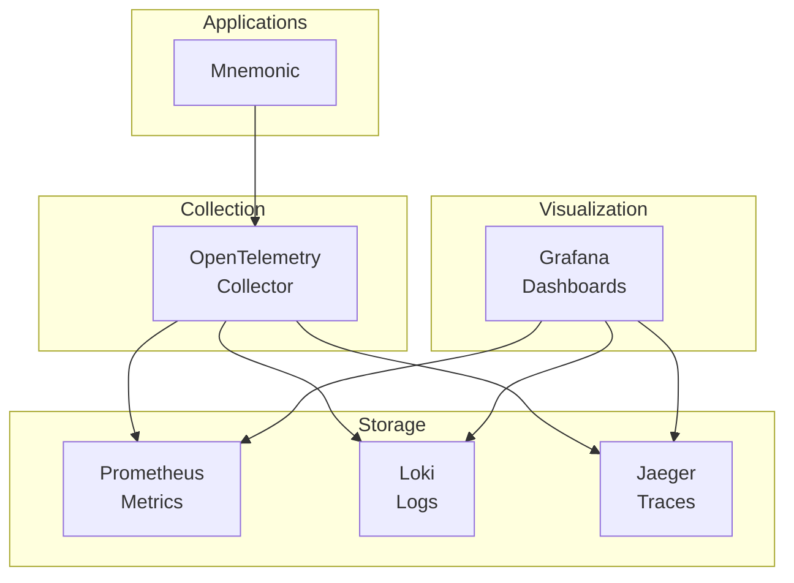
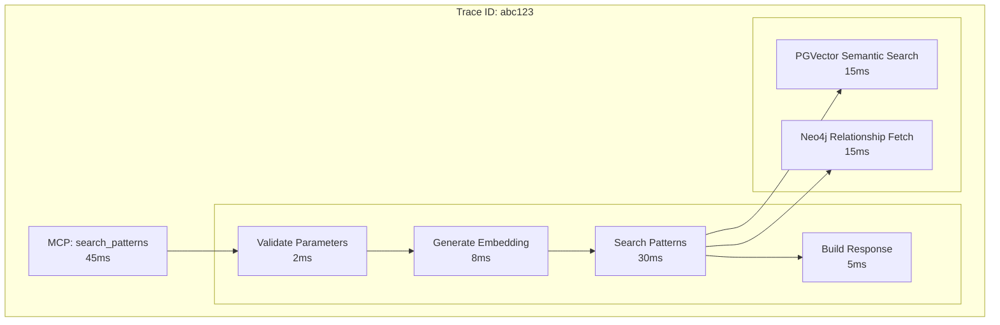
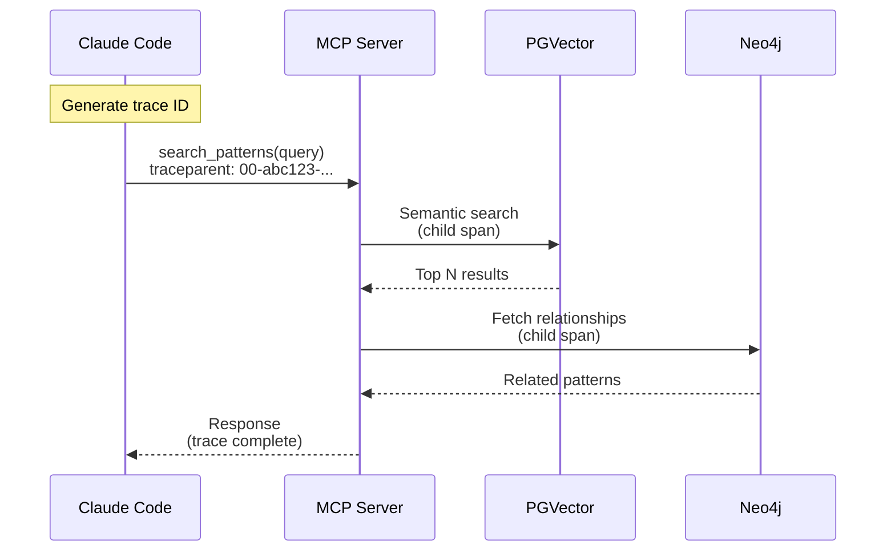

# Observability Architecture

[Back to Overview](00-overview.md) | [Back to Project README](../../README.md)

## Table of Contents

- [Overview](#overview)
- [Implementation Stages](#implementation-stages)
- [Observability Stack](#observability-stack)
- [Metrics (Prometheus)](#metrics-prometheus)
- [Logs (Loki)](#logs-loki)
- [Distributed Tracing (Jaeger)](#distributed-tracing-jaeger)
- [Dashboards (Grafana)](#dashboards-grafana)
- [SLOs (Service Level Objectives)](#slos-service-level-objectives)
- [Runbooks](#runbooks)
- [Key Takeaways](#key-takeaways)

## Overview

Observability enables understanding system behavior through external outputs. For Mnemonic, observability focuses on the server-side components (Mnemonic and its storage layer) since LLM execution happens locally on user workstations via Claude Code.

**Scope:**

| Component           | Observability Scope                        |
| ------------------- | ------------------------------------------ |
| Mnemonic            | Full observability (metrics, logs, traces) |
| Postgres + PGVector | Database metrics and query logging         |
| Neo4j               | Query metrics and performance              |

**Key Characteristic:** Mnemonic is a lightweight service (no LLM inference), so observability focuses on pattern search performance, MCP tool serving, admin API operations, and database health rather than compute-intensive operations.

## Implementation Stages

[Back to Table of Contents](#table-of-contents)

> **Note:** This document uses "Observability Stages" to describe the observability rollout milestones. These are independent of the main Mnemonic execution phases (Phase 1: MVP Local Deployment, Phase 2: Production Deployment) described in the [Architecture Overview](00-overview.md#phased-approach).

Observability is implemented in stages, starting with application instrumentation before building out the full observability stack.

### Observability Stage 1: Application Instrumentation (MVP)

MVP focuses on instrumenting Mnemonic to emit telemetry data via OpenTelemetry. This establishes the foundation for observability without requiring external infrastructure.

**In scope:**

- OpenTelemetry SDK integration in Mnemonic
- Structured logging with trace correlation
- Metrics emission (counters, histograms, gauges)
- Distributed tracing with span creation
- OTLP export configuration (exporters can be disabled or pointed to stdout/file for development)

**Why this first:** Proper instrumentation is the foundation. Once the application emits telemetry correctly, the collection and visualization infrastructure can be added without code changes.

### Observability Stage 2: Collection and Storage (Post-MVP)

After MVP, deploy the observability stack to collect and store telemetry data.

**In scope:**

- OpenTelemetry Collector deployment
- Prometheus for metrics storage
- Loki for log aggregation
- Jaeger for trace storage

### Observability Stage 3: Visualization and Operations (Post-MVP)

With collection in place, build operational tooling for monitoring and incident response.

**In scope:**

- Grafana dashboards (System Health, Routing, Database)
- Alert rules and routing (PagerDuty, Slack)
- Runbooks for each alert type
- SLO monitoring and error budgets

## Observability Stack

[Back to Table of Contents](#table-of-contents)

**Note:** This section describes the target architecture. MVP (Observability Stage 1) implements only the application instrumentation layer. Collection, storage, and visualization components are deployed in later stages.

The observability stack uses industry-standard open-source tools:



**Stack Components:**

| Component     | Purpose              | Why This Choice                                  |
| ------------- | -------------------- | ------------------------------------------------ |
| OpenTelemetry | Telemetry collection | Vendor-neutral standard, Go native support       |
| Prometheus    | Metrics storage      | Pull-based, excellent for container environments |
| Loki          | Log aggregation      | Label-based, integrates with Grafana             |
| Jaeger        | Distributed tracing  | OpenTelemetry native, good UI                    |
| Grafana       | Visualization        | Unified dashboards across all signals            |

## Metrics (Prometheus)

[Back to Table of Contents](#table-of-contents)

**Observability Stage 1 (MVP):** Mnemonic emits metrics via OpenTelemetry. **Stage 2+:** Prometheus scrapes and stores these metrics.

### Application Metrics

Mnemonic exposes metrics across several categories:

**Request metrics** - Track HTTP requests including:

- MCP tool invocations by tool name
- Admin API operations by endpoint and status code
- Request duration histograms (for percentile calculations)
- In-flight request count

**Pattern metrics** - Track pattern operations:

- Pattern search latency (semantic search via PGVector)
- Pattern query latency (Neo4j relationship traversal)
- Patterns returned per search request
- Pattern cache effectiveness

**Tooling metrics** - Track agent/skill/command operations:

- List operations by type (agents, skills, commands)
- Get operations by resource type
- Admin API write operations (create, update, delete)

**Database metrics** - Track storage layer health:

- Connection pool utilization
- Query latency by type
- Error rates by database

For implementation details including specific metric names and labels, see operations documentation (TBD).

### Alerting Strategy (Stage 3)

**Note:** Alerting is implemented in Observability Stage 3 after the observability stack is deployed.

We alert on conditions that require attention:

**Critical alerts** (immediate response required):

- Mnemonic unavailable (health check failing)
- High error rate (>5% of requests failing over 5 minutes)
- Database unreachable (Postgres or Neo4j connection failures)

**Warning alerts** (investigate soon):

- Elevated latency (P95 > 200ms for pattern searches)
- Connection pool saturation (>80% utilization)
- High cache miss rate (pattern search efficiency degraded)

**Alert routing:**

- Critical alerts: PagerDuty for on-call response
- Warning alerts: Slack notification to team channel

For alert rule definitions, see operations documentation (TBD).

## Logs (Loki)

[Back to Table of Contents](#table-of-contents)

**Observability Stage 1 (MVP):** Mnemonic emits structured logs with trace correlation. **Stage 2+:** Loki aggregates and indexes logs for querying.

### Structured Logging

All logs use structured JSON format for consistent parsing and querying. Every log entry includes:

**Standard fields:**

- Timestamp, log level, service name
- Trace and span IDs for correlation
- Human-readable message

**Context fields:**

- Request ID for request correlation
- Agent name (when routing decision made)
- Any relevant domain data

### What We Log

**Request events:**

- MCP tool invoked (tool name, parameters, request ID)
- Admin API operation (method, path, request ID)
- Pattern search executed (query, results count)
- Tooling operation executed (resource type, operation)
- Request completed (status, duration)

**System events:**

- Service started/stopped
- Configuration loaded
- Health check status changes
- Database connection events

**Error events:**

- Validation failures
- Database errors
- Unexpected exceptions

## Distributed Tracing (Jaeger)

[Back to Table of Contents](#table-of-contents)

**Observability Stage 1 (MVP):** Mnemonic creates spans and propagates trace context. **Stage 2+:** Jaeger collects and visualizes traces.

### Trace Structure

A routing request trace shows the journey through Mnemonic:



### Trace Propagation

Traces flow from CLI through Mnemonic:



**W3C Trace Context** headers propagate trace IDs across service boundaries.

### Sampling Strategy

For a lightweight service like Mnemonic, we can trace more aggressively:

**Always captured:**

- Errors - All failed requests for debugging
- Slow requests - Requests exceeding latency threshold (e.g., >100ms)

**Sampled:**

- Successful requests - 10-20% sampling for baseline understanding

This provides visibility without excessive storage costs.

For sampling configuration, see operations documentation (TBD).

## Dashboards (Grafana)

[Back to Table of Contents](#table-of-contents)

**Note:** Dashboards are implemented in Observability Stage 3 after the observability stack is deployed.

Grafana provides unified visualization across all telemetry signals.

### System Health Dashboard

Answers: "Is the system healthy right now?"

**What it shows:**

- Request throughput over time
- Error rate percentage
- Latency percentiles (P50, P95, P99)
- Service availability (up/down status)
- Database connection health

This is the first dashboard to check during incidents.

### Pattern Search Dashboard

Answers: "How is pattern search behaving?"

**What it shows:**

- Pattern searches over time (search volume)
- Top search queries (what users search for)
- Search result quality (patterns returned per query)
- Cache hit rates (are we efficiently caching?)
- Pattern search performance (semantic search latency)

This dashboard helps understand pattern usage and search optimization opportunities.

### Database Dashboard

Answers: "How are the storage backends performing?"

**What it shows:**

- Query latency by database (Postgres, PGVector, Neo4j)
- Connection pool utilization
- Query volume by type
- Error rates by database

This dashboard helps identify database bottlenecks.

For dashboard configuration and queries, see operations documentation (TBD).

## SLOs (Service Level Objectives)

[Back to Table of Contents](#table-of-contents)

**Note:** SLO monitoring requires the observability stack (Observability Stage 2+). The targets below define what we measure once infrastructure is in place.

### Mnemonic SLOs

For Mnemonic (a lightweight knowledge synchronization service):

**Availability SLO:** 99.9%

```text
successful requests / total requests >= 0.999
```

**Latency SLO:** 99% under 100ms

```text
requests completing < 100ms / total requests >= 0.99
```

Note: These are aggressive targets because Mnemonic does no LLM inference. Knowledge graph queries and MCP serving should be fast.

## Runbooks

[Back to Table of Contents](#table-of-contents)

**Note:** Runbooks are implemented in Observability Stage 3 alongside alerting.

Every alert links to a runbook. Mnemonic requires the following runbooks:

**Required runbooks:**

| Alert                | Runbook Focus                                  |
| -------------------- | ---------------------------------------------- |
| Mnemonic unavailable | Check container health, database connectivity  |
| High error rate      | Identify error types, check recent deployments |
| Elevated latency     | Check database performance, pattern cache      |
| Database unreachable | Connection strings, network, database health   |

Runbooks live in operations documentation and are linked directly from alert annotations.

For runbook templates and content, see operations documentation (TBD).

## Key Takeaways

[Back to Table of Contents](#table-of-contents)

- **Staged approach** - MVP instruments the application; observability stack and operational tooling come later
- **OpenTelemetry** - Standard collection layer for metrics, logs, and traces (MVP foundation)
- **Correlation** - Trace IDs connect signals for root cause analysis
- **Lightweight focus** - Mnemonic observability focuses on knowledge graph query performance and MCP serving efficiency, not LLM costs
- **SLOs matter** - Track what users care about (availability, latency)
- **Runbooks** - Every alert has documented recovery steps (Stage 3)

**Next:** Return to [Architecture Overview](00-overview.md)

---

Copyright (c) 2025 Jeremy K. Johnson. All rights reserved.
