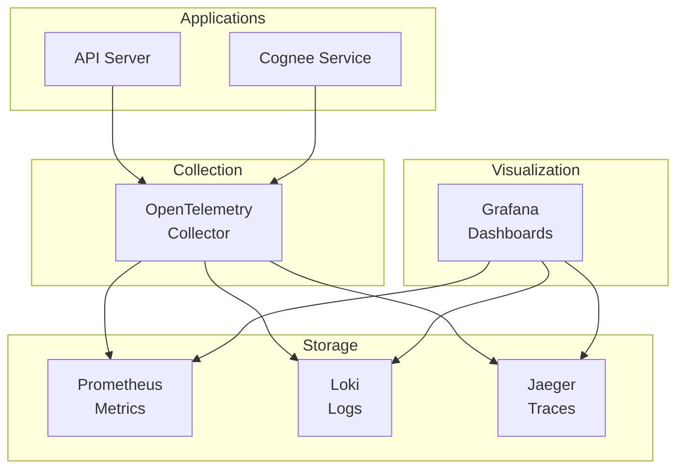

# Observability: See What's Happening

**Document:** Observability Architecture  
**Version:** 1.0  
**Last Updated:** December 22, 2025

You can't fix what you can't see. Let's talk about how we make the system observable.

## The Three Pillars

Observability is built on three types of data:

**Metrics** - Numbers over time (request rate, error rate, latency)  
**Logs** - Individual events (request received, error occurred)  
**Traces** - Request journey across services (API → Cognee → Neo4j)

All three tied together with OpenTelemetry so you can jump between them.

## Observability Stack

Here's what we're using:



## Metrics (Prometheus)

Metrics are numbers that change over time. Think: requests per second, error rate, CPU usage.

### What We Measure

**RED Metrics** (for requests):

- **Rate:** How many requests per second?
- **Errors:** How many are failing?
- **Duration:** How long do they take?

**USE Metrics** (for resources):

- **Utilization:** CPU at 70%
- **Saturation:** Queue has 10 items waiting
- **Errors:** Disk read errors

### Application Metrics

```prometheus
# HTTP requests
http_requests_total{method="POST", path="/execute", status="200"}
http_request_duration_seconds{method="POST", path="/execute"}

# gRPC calls
grpc_server_handled_total{service="cognee", method="SearchPatterns", code="OK"}
grpc_server_handling_seconds{service="cognee", method="SearchPatterns"}

# Business metrics
agent_executions_total{agent="go-software-agent", status="completed"}
agent_tokens_used_total{agent="go-software-agent", type="input"}
agent_cost_usd_total{agent="go-software-agent"}

# Pattern queries
pattern_queries_total{status="success"}
pattern_cache_hits_total
pattern_cache_misses_total
```

### Alerting

We alert on things that matter:

```yaml
# High error rate
alert: HighErrorRate
expr: |
  (sum(rate(http_requests_total{status=~"5.."}[5m]))
   / sum(rate(http_requests_total[5m]))) > 0.05
for: 5m
severity: critical

# API is down
alert: APIDown
expr: up{job="api-server"} == 0
for: 1m
severity: critical

# High latency
alert: HighLatency
expr: |
  histogram_quantile(0.95,
    rate(http_request_duration_seconds_bucket[5m])
  ) > 5
for: 5m
severity: warning
```

When alerts fire, they go to PagerDuty (critical) or Slack (warning).

## Logs (Loki)

Logs are individual events. They tell you what happened.

### Structured Logging

All logs are JSON for easy parsing:

```json
{
  "timestamp": "2024-12-19T10:30:00.123Z",
  "level": "info",
  "service": "api-server",
  "trace_id": "abc123",
  "span_id": "def456",
  "user_id": "user_123",
  "team_id": "team_456",
  "message": "Agent execution started",
  "agent": "go-software-agent",
  "execution_id": "exec_789"
}
```

**Log levels:**

- DEBUG: Detailed debugging
- INFO: Normal operations
- WARN: Something's weird but not broken
- ERROR: Something failed
- FATAL: System is going down

### What We Log

**Application events:**

- Request received
- Agent routed
- Pattern queried
- Execution completed
- Error occurred

**Security events:**

- Auth attempts (success/failure)
- Authorization decisions
- Rate limit hits
- API key changes

**System events:**

- Service started
- Config loaded
- Health check failed
- Connection pool exhausted

### Querying Logs

LogQL lets you search logs:

```logql
# All errors in last hour
{service="api-server"} |= "level=error" | json

# Specific user's activity
{service="api-server"} | json | user_id="user_123"

# Slow requests
{service="api-server"} | json | duration_ms > 1000

# Error rate
sum(rate({service="api-server"} |= "level=error" [5m]))
```

## Distributed Tracing (Jaeger)

Traces show how a request flows through the system.

### Trace Structure

A single agent execution might look like:

```text
Trace ID: abc123
  │
  ├─ Span: HTTP POST /execute (1200ms)
  │  ├─ Span: Authenticate (50ms)
  │  ├─ Span: Authorize (30ms)
  │  ├─ Span: Route to agent (20ms)
  │  └─ Span: Execute agent (1100ms)
  │     ├─ Span: Load agent definition (10ms)
  │     ├─ Span: Call Claude API (800ms)
  │     ├─ Span: Query Cognee (100ms)
  │     │  └─ Span: Neo4j query (80ms)
  │     └─ Span: Record usage (50ms)
  │        └─ Span: PostgreSQL insert (40ms)
```

Each span has:

- Operation name
- Start time and duration
- Tags (metadata)
- Logs (events within the span)
- Trace ID (links all spans together)

### Sampling

We don't trace every request (too expensive). We sample:

```yaml
# Always trace errors
- type: error
  sample_rate: 1.0  # 100%

# Trace 10% of successful requests
- type: success
  sample_rate: 0.1  # 10%

# Always trace slow requests
- type: slow
  threshold: 1000ms
  sample_rate: 1.0  # 100%
```

## Dashboards (Grafana)

Grafana ties everything together with dashboards.

### System Health Dashboard

Shows the health of the system:

**Panels:**

1. Request rate (last 1h)
2. Error rate % (current)
3. P95 latency (last 1h)
4. Service status (up/down)
5. Active connections
6. CPU/Memory usage

**Queries:**

```promql
# Request rate
sum(rate(http_requests_total[5m])) by (status)

# Error percentage
sum(rate(http_requests_total{status=~"5.."}[5m]))
/ sum(rate(http_requests_total[5m])) * 100

# P95 latency
histogram_quantile(0.95,
  sum(rate(http_request_duration_seconds_bucket[5m])) by (le)
)
```

### Business Dashboard

Shows product metrics:

**Panels:**

1. Executions per hour
2. Most used agents (bar chart)
3. Token usage over time
4. Cost per execution
5. Cache hit rate

**Example:**

```promql
# Executions by agent
sum(increase(agent_executions_total[1h])) by (agent)

# Total cost
sum(increase(agent_cost_usd_total[1h]))

# Cache hit rate
sum(rate(pattern_cache_hits_total[5m]))
/ (sum(rate(pattern_cache_hits_total[5m]))
   + sum(rate(pattern_cache_misses_total[5m]))) * 100
```

## Correlation: Jumping Between Signals

The power is in connecting metrics, logs, and traces.

### From Metrics to Traces

See latency spike in metrics → Click data point → See trace IDs → Jump to Jaeger

Prometheus supports exemplars (sample trace IDs attached to metrics):

```text
http_request_duration_seconds_bucket{le="1.0"} 42 # {trace_id="abc123"}
```

### From Logs to Traces

See error in logs → Click trace_id → Jump to full trace in Jaeger

All logs include trace_id and span_id:

```json
{
  "trace_id": "abc123",
  "span_id": "def456",
  "message": "Pattern query failed"
}
```

### From Traces to Logs

Looking at trace → See slow span → Click "View Logs" → Filter logs for that span

## SLOs (Service Level Objectives)

We track SLOs to know if we're meeting user expectations.

### Defining SLOs

**Availability SLO:** 99.9%

```text
successful requests / total requests >= 0.999
```

**Latency SLO:** 95% under 1s

```text
requests completing < 1s / total requests >= 0.95
```

**Error Rate SLO:** < 1%

```text
error requests / total requests < 0.01
```

### Error Budget

SLO of 99.9% = 0.1% errors allowed

If we get 1M requests/month:

- Error budget: 1,000 errors
- Budget remaining: 1,000 - errors_so_far
- Burn rate: How fast we're consuming budget

**When budget is low:**

- Freeze features, focus on reliability
- No risky deploys
- Fix bugs

**When budget is healthy:**

- Ship features
- Experiment
- Take calculated risks

## Performance Profiling

For deep dives into performance:

**CPU profiling:**

- What's using CPU?
- Which functions are hot?
- Where to optimize?

**Memory profiling:**

- Where are allocations happening?
- Memory leaks?
- GC pressure?

**Tools:**

- pprof (Go built-in)
- Pyroscope (continuous profiling)

## Cost Monitoring

Track cloud costs and API costs:

```prometheus
# Claude API costs
sum(increase(claude_cost_usd_total[1d])) by (team)

# Per-team spending
sum(increase(agent_cost_usd_total[1d])) by (team_id)

# Alert on unexpected costs
sum(increase(claude_cost_usd_total[1d])) > 100
```

## Runbooks

Every alert links to a runbook:

```yaml
alert: HighErrorRate
annotations:
  runbook_url: https://wiki.company.com/runbooks/high-error-rate
```

**Runbook template:**

```markdown
# High Error Rate Runbook

## Symptoms
Error rate > 5% for 5 minutes

## Investigation
1. Check Grafana dashboard
2. View recent logs: {service="api-server"} |= "error"
3. Check Jaeger for failed traces

## Common Causes
- Cognee service down
- Database connection pool exhausted
- Claude API rate limits

## Resolution
1. Check service health
2. Scale up if resource constrained
3. Restart if needed

## Escalation
If unresolved after 30 min, page on-call lead
```

## Key Takeaways

- **Three pillars** - Metrics, logs, traces all working together
- **OpenTelemetry** - Standard way to collect telemetry
- **Correlation** - Jump between signals with trace IDs
- **SLOs matter** - Track what users care about
- **Runbooks** - Every alert has recovery steps
- **Cost tracking** - Monitor spending in real-time

Next: Deployment architecture with Kubernetes and GitOps.

---

Copyright © 2025 Jeremy K. Johnson. All rights reserved.
