# Data Architecture

[Back to Overview](00-overview.md) | [Back to Project README](../../README.md)

## Table of Contents

- [Overview](#overview)
- [Database Technology Stack](#database-technology-stack)
  - [PostgreSQL](#postgresql)
  - [PGVector](#pgvector)
  - [Neo4j](#neo4j)
  - [Redis (Post-MVP)](#redis-post-mvp)
- [Data Model Design](#data-model-design)
  - [Entity Relationship Diagram](#entity-relationship-diagram)
  - [Agents](#agents)
  - [Patterns](#patterns)
  - [Routing Rules](#routing-rules)
  - [Enrichment Jobs](#enrichment-jobs)
- [Storage Architecture](#storage-architecture)
  - [PostgreSQL Schema](#postgresql-schema)
  - [PGVector Configuration](#pgvector-configuration)
  - [Neo4j Graph Model](#neo4j-graph-model)
  - [Redis Cache Patterns (Post-MVP)](#redis-cache-patterns-post-mvp)
- [Data Flow Patterns](#data-flow-patterns)
  - [Write Paths](#write-paths)
  - [Read Paths](#read-paths)
  - [Cache Invalidation](#cache-invalidation)
- [Data Lifecycle Management](#data-lifecycle-management)
  - [Data Retention Policies](#data-retention-policies)
  - [Archival Strategies](#archival-strategies)
  - [Cleanup Procedures](#cleanup-procedures)
- [Consistency and Integrity](#consistency-and-integrity)
  - [Transaction Handling](#transaction-handling)
  - [Cross-Database Consistency](#cross-database-consistency)
  - [Constraint Enforcement](#constraint-enforcement)
- [Security and Access Control](#security-and-access-control)
  - [Encryption at Rest](#encryption-at-rest)
  - [Access Patterns](#access-patterns)
  - [Audit Logging](#audit-logging)
- [Backup and Recovery](#backup-and-recovery)
  - [Backup Strategies](#backup-strategies)
  - [Recovery Procedures](#recovery-procedures)
  - [Point-in-Time Recovery](#point-in-time-recovery)
- [Migration Strategy](#migration-strategy)
  - [Schema Versioning](#schema-versioning)
  - [Forward-Compatible Migrations](#forward-compatible-migrations)
  - [Rollback Procedures](#rollback-procedures)
- [Performance Considerations](#performance-considerations)
  - [Index Strategies](#index-strategies)
  - [Query Optimization](#query-optimization)
  - [Connection Pool Configuration](#connection-pool-configuration)
- [Key Takeaways](#key-takeaways)

## Overview

[Back to Table of Contents](#table-of-contents)

> **Architecture Reference:** [System Architecture - Mnemonic](03-system-architecture.md#mnemonic) | [ADR-004: Unified Backend with REST API](02-architectural-decisions.md#adr-004-unified-backend-with-rest-api)

ACE uses a polyglot persistence strategy where each database technology is chosen for its strengths:

- **PostgreSQL** for relational data and ACID transactions
- **PGVector** for vector embeddings and semantic search
- **Neo4j** for knowledge graph relationships
- **Redis** for decision caching (Post-MVP, Kubernetes deployments only)

Mnemonic is stateless; all persistent state lives in these external databases. This separation enables horizontal scaling of Mnemonic instances while maintaining data consistency.

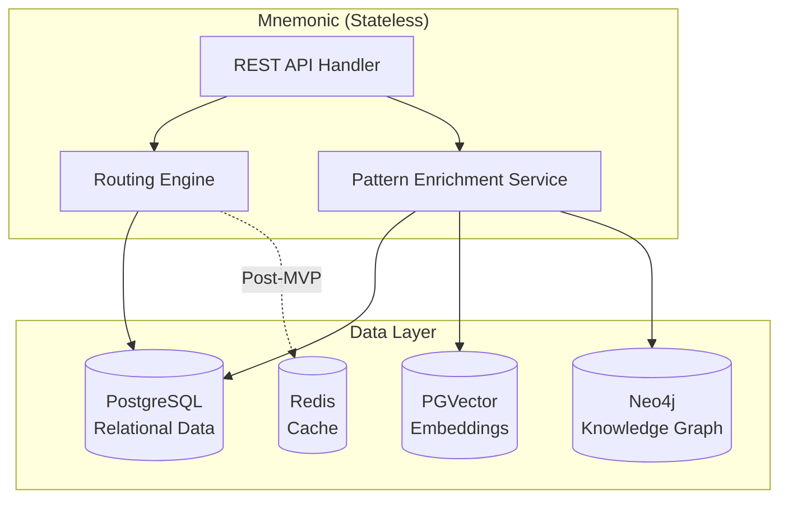

## Database Technology Stack

[Back to Table of Contents](#table-of-contents)

### PostgreSQL

**Purpose:** Primary relational database for structured data with ACID guarantees.

**Stores:**

- Agents (definitions, system prompts, allowed tools)
- Routing rules (rule definitions, match configurations)
- Patterns (metadata, content, tags, associations)
- Enrichment jobs (background processing queue)

**Why PostgreSQL:**

| Criterion | Rationale |
|-----------|-----------|
| ACID compliance | Critical for maintaining data integrity across entities |
| Mature ecosystem | Excellent Go driver support (pgx), migrations tooling |
| JSON support | JSONB for flexible match_config storage |
| Extensions | PGVector extension enables vector search without separate service |
| Operational maturity | Well-understood backup, recovery, and scaling patterns |

**Version Requirement:** PostgreSQL 15+ (for improved JSON path expressions and performance)

### PGVector

**Purpose:** Vector embeddings for semantic similarity search.

**Stores:**

- Pattern content embeddings (1536 dimensions, OpenAI text-embedding-3-small)
- Prompt embeddings for semantic routing (generated at query time)

**Why PGVector over Dedicated Vector DB:**

| Criterion | PGVector | Pinecone/Milvus |
|-----------|----------|-----------------|
| Operational complexity | Single database | Additional service |
| Cost | Included with Postgres | Separate billing |
| Transactional consistency | Same transaction as metadata | Eventual consistency |
| Scale requirements | Sufficient for expected pattern counts (<100K) | Better for millions+ |
| Query latency | <50ms for <10K vectors | <10ms at scale |

**Trade-off:** PGVector is simpler to operate but has higher latency at scale. This trade-off is acceptable for MVP pattern counts.

### Neo4j

**Purpose:** Knowledge graph for entity relationships and pattern connections.

**Stores:**

- Pattern-to-agent relationships (with relevance scores)
- Pattern-to-concept relationships (extracted entities)
- Pattern-to-pattern relationships (shared entities)
- Agent nodes (mirrored from Postgres for graph traversal)
- Concept nodes (extracted from pattern content)

**Why Neo4j:**

| Criterion | Rationale |
|-----------|-----------|
| Native graph model | Natural fit for relationship-heavy queries |
| Cypher query language | Expressive path traversal and pattern matching |
| Graph algorithms | Built-in similarity, centrality, community detection |
| Visualization | Neo4j Browser for debugging and exploration |

**Version Requirement:** Neo4j 5.x Community Edition

### Redis (Post-MVP)

**Purpose:** Fast caching layer for routing decisions and frequently accessed data.

**Will Store:**

- Routing rule cache (currently in-memory, needs distributed cache for multi-pod)
- Pattern query results (reduce database load)
- Authorization decision cache (when Phase 3 security enabled)

**Why Redis:**

- Sub-millisecond latency for cache hits
- Distributed cache enables stateless Mnemonic scaling
- Native TTL support for cache expiration
- Well-supported in Kubernetes environments

**Deployment Note:** Redis is only required in Kubernetes deployments with multiple Mnemonic pods. Single-pod deployments use in-memory caching.

## Data Model Design

[Back to Table of Contents](#table-of-contents)

### Entity Relationship Diagram

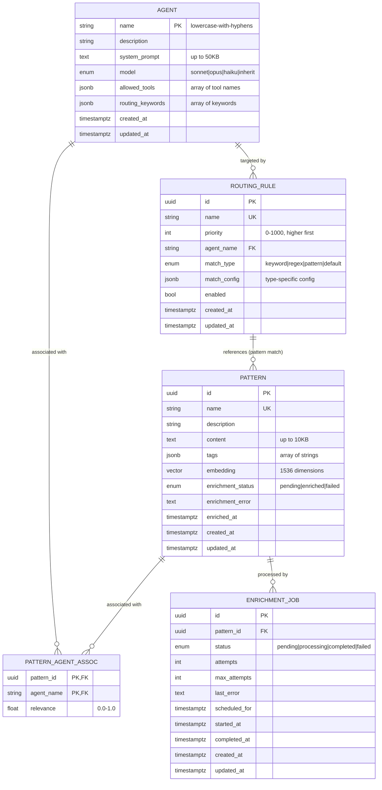

### Agents

Agents are the core execution targets for routing decisions.

**Key Design Decisions:**

| Decision | Rationale |
|----------|-----------|
| Name as primary key | Natural key, URL-friendly, prevents duplicate names |
| Name pattern: `^[a-z][a-z0-9-]*$` | URL-safe, consistent with Kubernetes naming conventions |
| system_prompt as TEXT | Large prompts (up to 50KB), not needed in list queries |
| JSONB for allowed_tools | Flexible array, supports pattern matching |
| JSONB for routing_keywords | Denormalized for fast keyword matching |

**Constraints:**

- Name is unique and immutable (updates via PUT require same name)
- Model must be one of: `sonnet`, `opus`, `haiku`, `inherit`
- Description max 500 chars, system_prompt max 50KB

### Patterns

Patterns are reusable context documents for prompt enrichment.

**Key Design Decisions:**

| Decision | Rationale |
|----------|-----------|
| UUID primary key | Patterns may be renamed, need stable reference |
| Separate embedding column | Enables efficient vector operations without content parsing |
| Enrichment status fields | Track async processing state |
| JSONB for tags | Flexible categorization, supports tag-based filtering |

**Enrichment States:**

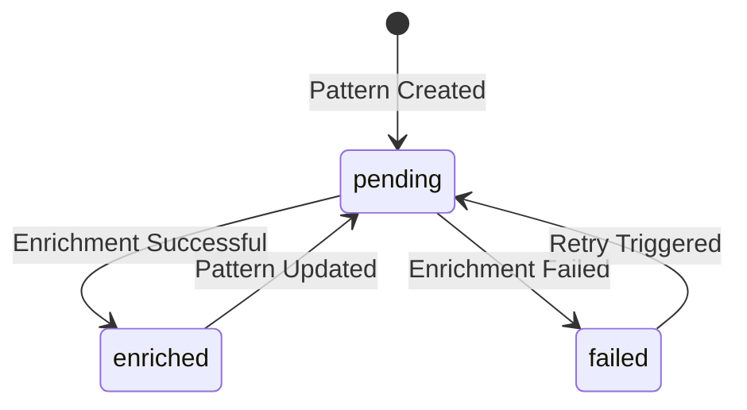

### Routing Rules

Routing rules define how prompts are matched to agents.

**Key Design Decisions:**

| Decision | Rationale |
|----------|-----------|
| UUID primary key | Rules may be renamed |
| Priority as integer | Simple ordering, ties broken by UUID |
| match_config as JSONB | Type-specific configuration without schema proliferation |
| Foreign key to agents.name | Ensures valid agent references |

**Match Configuration Schemas:**

```yaml
# Keyword match
match_config:
  keywords: ["go", "golang", "go function"]
  match_mode: "any"  # or "all"

# Regex match
match_config:
  pattern: "\\b(go|golang)\\b.*\\b(function|method)\\b"
  flags: "i"  # case-insensitive

# Pattern match (semantic)
match_config:
  pattern_ids:
    - "550e8400-e29b-41d4-a716-446655440001"
    - "550e8400-e29b-41d4-a716-446655440002"

# Default match (fallback)
match_config: {}
```

### Enrichment Jobs

Background processing queue for pattern enrichment.

**Key Design Decisions:**

| Decision | Rationale |
|----------|-----------|
| Postgres-backed queue | No external message broker required |
| `FOR UPDATE SKIP LOCKED` | Safe concurrent processing across pods |
| Retry with backoff | Handles transient API failures |
| Cascade delete on pattern | Orphan jobs automatically cleaned up |

## Storage Architecture

[Back to Table of Contents](#table-of-contents)

### PostgreSQL Schema

```sql
-- Enable required extensions
CREATE EXTENSION IF NOT EXISTS "uuid-ossp";
CREATE EXTENSION IF NOT EXISTS "vector";

-- Agents table
CREATE TABLE agents (
    name VARCHAR(64) PRIMARY KEY
        CHECK (name ~ '^[a-z][a-z0-9-]*$'),
    description VARCHAR(500) NOT NULL,
    system_prompt TEXT NOT NULL
        CHECK (length(system_prompt) <= 51200),
    model VARCHAR(20) NOT NULL
        CHECK (model IN ('sonnet', 'opus', 'haiku', 'inherit')),
    allowed_tools JSONB NOT NULL DEFAULT '[]'::jsonb,
    routing_keywords JSONB NOT NULL DEFAULT '[]'::jsonb,
    created_at TIMESTAMPTZ NOT NULL DEFAULT NOW(),
    updated_at TIMESTAMPTZ NOT NULL DEFAULT NOW()
);

-- Patterns table
CREATE TABLE patterns (
    id UUID PRIMARY KEY DEFAULT gen_random_uuid(),
    name VARCHAR(128) NOT NULL UNIQUE,
    description VARCHAR(500),
    content TEXT NOT NULL
        CHECK (length(content) <= 10240),
    tags JSONB NOT NULL DEFAULT '[]'::jsonb,
    embedding vector(1536),
    enrichment_status VARCHAR(20) NOT NULL DEFAULT 'pending'
        CHECK (enrichment_status IN ('pending', 'enriched', 'failed')),
    enrichment_error TEXT,
    enriched_at TIMESTAMPTZ,
    created_at TIMESTAMPTZ NOT NULL DEFAULT NOW(),
    updated_at TIMESTAMPTZ NOT NULL DEFAULT NOW()
);

-- Pattern-Agent associations (many-to-many with relevance)
CREATE TABLE pattern_agent_associations (
    pattern_id UUID NOT NULL REFERENCES patterns(id) ON DELETE CASCADE,
    agent_name VARCHAR(64) NOT NULL REFERENCES agents(name) ON DELETE CASCADE,
    relevance DOUBLE PRECISION NOT NULL
        CHECK (relevance >= 0 AND relevance <= 1),
    PRIMARY KEY (pattern_id, agent_name)
);

-- Routing rules table
CREATE TABLE routing_rules (
    id UUID PRIMARY KEY DEFAULT gen_random_uuid(),
    name VARCHAR(128) NOT NULL UNIQUE,
    priority INTEGER NOT NULL
        CHECK (priority >= 0 AND priority <= 1000),
    agent_name VARCHAR(64) NOT NULL REFERENCES agents(name) ON DELETE RESTRICT,
    match_type VARCHAR(20) NOT NULL
        CHECK (match_type IN ('keyword', 'regex', 'pattern', 'default')),
    match_config JSONB NOT NULL,
    enabled BOOLEAN NOT NULL DEFAULT true,
    created_at TIMESTAMPTZ NOT NULL DEFAULT NOW(),
    updated_at TIMESTAMPTZ NOT NULL DEFAULT NOW()
);

-- Enrichment jobs queue
CREATE TABLE enrichment_jobs (
    id UUID PRIMARY KEY DEFAULT gen_random_uuid(),
    pattern_id UUID NOT NULL REFERENCES patterns(id) ON DELETE CASCADE,
    status VARCHAR(20) NOT NULL DEFAULT 'pending'
        CHECK (status IN ('pending', 'processing', 'completed', 'failed')),
    attempts INTEGER NOT NULL DEFAULT 0,
    max_attempts INTEGER NOT NULL DEFAULT 3,
    last_error TEXT,
    scheduled_for TIMESTAMPTZ NOT NULL DEFAULT NOW(),
    started_at TIMESTAMPTZ,
    completed_at TIMESTAMPTZ,
    created_at TIMESTAMPTZ NOT NULL DEFAULT NOW(),
    updated_at TIMESTAMPTZ NOT NULL DEFAULT NOW()
);

-- Trigger for updated_at
CREATE OR REPLACE FUNCTION update_updated_at()
RETURNS TRIGGER AS $$
BEGIN
    NEW.updated_at = NOW();
    RETURN NEW;
END;
$$ LANGUAGE plpgsql;

CREATE TRIGGER agents_updated_at
    BEFORE UPDATE ON agents
    FOR EACH ROW EXECUTE FUNCTION update_updated_at();

CREATE TRIGGER patterns_updated_at
    BEFORE UPDATE ON patterns
    FOR EACH ROW EXECUTE FUNCTION update_updated_at();

CREATE TRIGGER routing_rules_updated_at
    BEFORE UPDATE ON routing_rules
    FOR EACH ROW EXECUTE FUNCTION update_updated_at();

CREATE TRIGGER enrichment_jobs_updated_at
    BEFORE UPDATE ON enrichment_jobs
    FOR EACH ROW EXECUTE FUNCTION update_updated_at();
```

### PGVector Configuration

**Index Selection by Pattern Count:**

| Pattern Count | Index Type | Configuration | Rationale |
|---------------|------------|---------------|-----------|
| < 1,000 | None | Exact search | Overhead of index not worth it |
| 1,000 - 100,000 | IVFFlat | lists = sqrt(N) | Good balance of speed and accuracy |
| > 100,000 | HNSW | m=16, ef_construction=64 | Faster queries, higher memory |

**Recommended Index (MVP scale):**

```sql
-- IVFFlat index for ~1,000-10,000 patterns
CREATE INDEX idx_patterns_embedding ON patterns
USING ivfflat (embedding vector_cosine_ops)
WITH (lists = 100);

-- Ensure only enriched patterns are searchable
CREATE INDEX idx_patterns_enriched ON patterns (enrichment_status)
WHERE enrichment_status = 'enriched';
```

**Similarity Search Query:**

```sql
-- Find similar patterns for a prompt embedding
SELECT id, name, content,
       1 - (embedding <=> $1::vector) AS similarity
FROM patterns
WHERE enrichment_status = 'enriched'
  AND 1 - (embedding <=> $1::vector) > $2  -- threshold
ORDER BY embedding <=> $1::vector
LIMIT $3;  -- max_patterns
```

### Neo4j Graph Model

```cypher
// Node labels and properties

// Pattern node (mirrored from Postgres)
(:Pattern {
    id: "uuid",          // Matches patterns.id in Postgres
    name: "string",
    description: "string"
})

// Agent node (mirrored from Postgres)
(:Agent {
    name: "string"       // Matches agents.name in Postgres
})

// Concept node (extracted during enrichment)
(:Concept {
    name: "string",      // Lowercase, normalized
    type: "string"       // technology|practice|domain
})

// Relationship types

// Pattern to Agent association
(:Pattern)-[:RELEVANT_FOR {
    relevance: 0.95      // Same as pattern_agent_associations.relevance
}]->(:Agent)

// Concept mentioned in Pattern
(:Concept)-[:MENTIONED_IN]->(:Pattern)

// Pattern to Pattern similarity (computed)
(:Pattern)-[:RELATES_TO {
    similarity: 0.85     // Computed from shared concepts
}]->(:Pattern)
```

**Constraints and Indexes:**

```cypher
// Uniqueness constraints
CREATE CONSTRAINT pattern_id_unique IF NOT EXISTS
FOR (p:Pattern) REQUIRE p.id IS UNIQUE;

CREATE CONSTRAINT agent_name_unique IF NOT EXISTS
FOR (a:Agent) REQUIRE a.name IS UNIQUE;

CREATE CONSTRAINT concept_name_unique IF NOT EXISTS
FOR (c:Concept) REQUIRE c.name IS UNIQUE;

// Lookup indexes
CREATE INDEX pattern_name_index IF NOT EXISTS
FOR (p:Pattern) ON (p.name);

CREATE INDEX concept_type_index IF NOT EXISTS
FOR (c:Concept) ON (c.type);
```

**Graph Data Flow:**

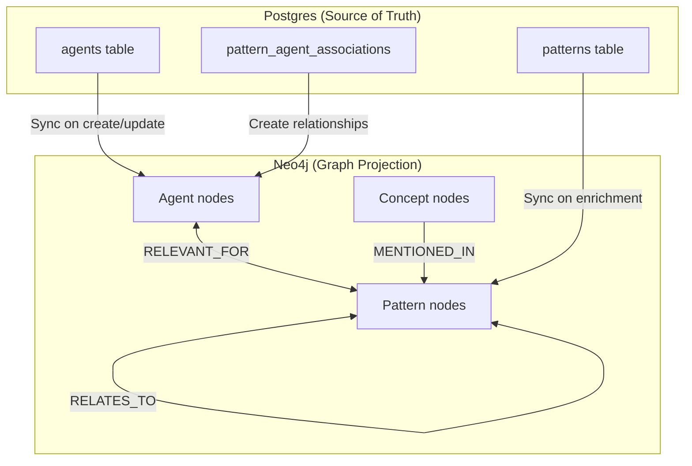

### Redis Cache Patterns (Post-MVP)

**Cache Key Conventions:**

```text
# Routing rules cache
mnemonic:routing:rules                    -> JSON array of all enabled rules

# Pattern query cache
mnemonic:patterns:agent:{agent_name}      -> JSON array of patterns for agent
mnemonic:patterns:embedding:{hash}        -> JSON array of similar patterns

# Authorization cache (Phase 3)
mnemonic:auth:decision:{user_id}:{action} -> "allow" | "deny"
```

**TTL Strategy:**

| Cache Type | TTL | Rationale |
|------------|-----|-----------|
| Routing rules | 5 minutes | Background refresh handles invalidation |
| Pattern queries | 1 hour | Patterns change infrequently |
| Auth decisions | 5 minutes | Balance freshness vs. latency |

## Data Flow Patterns

[Back to Table of Contents](#table-of-contents)

### Write Paths

#### Agent Create/Update

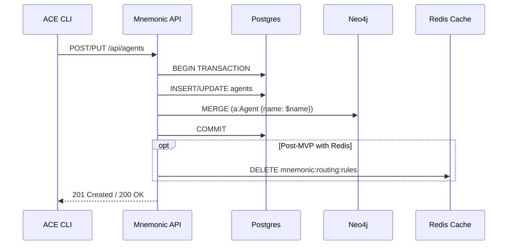

#### Pattern Create with Enrichment

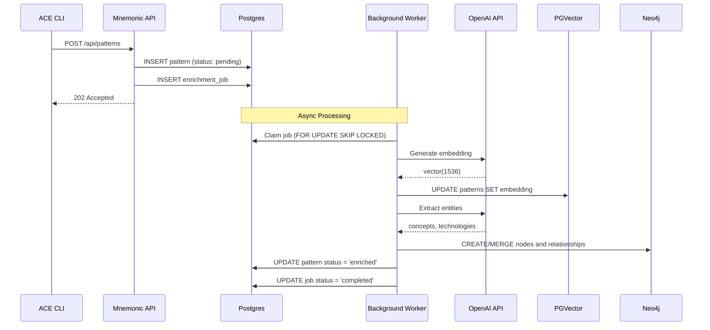

#### Routing Rule Create

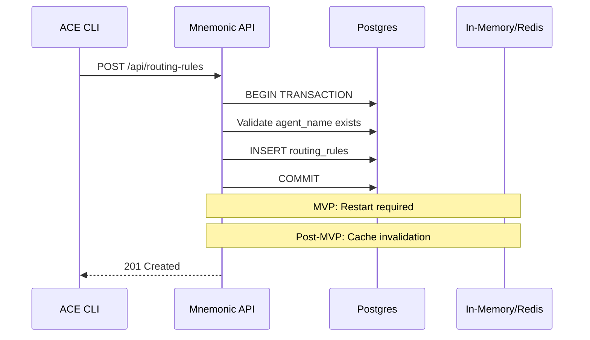

### Read Paths

#### Routing Decision

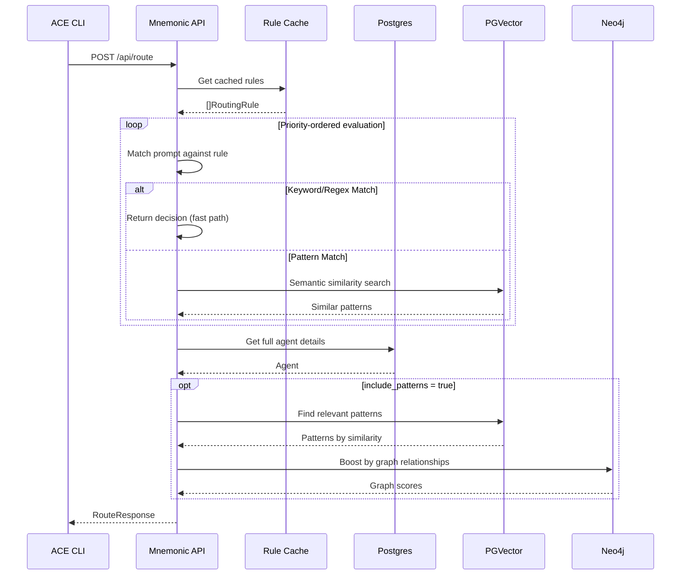

#### Pattern List with Search

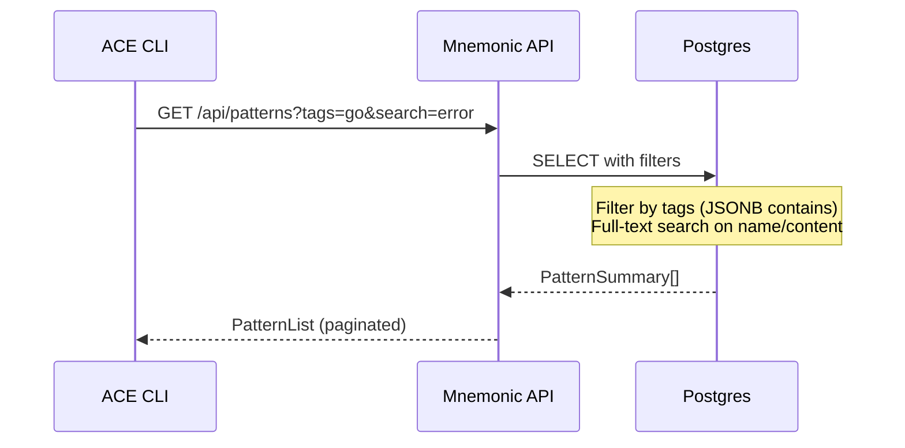

### Cache Invalidation

**MVP Strategy (In-Memory Cache):**

- Routing rules loaded at startup
- Service restart required to reload
- No cross-pod coordination needed (single pod)

**Post-MVP Strategy (Redis Cache):**

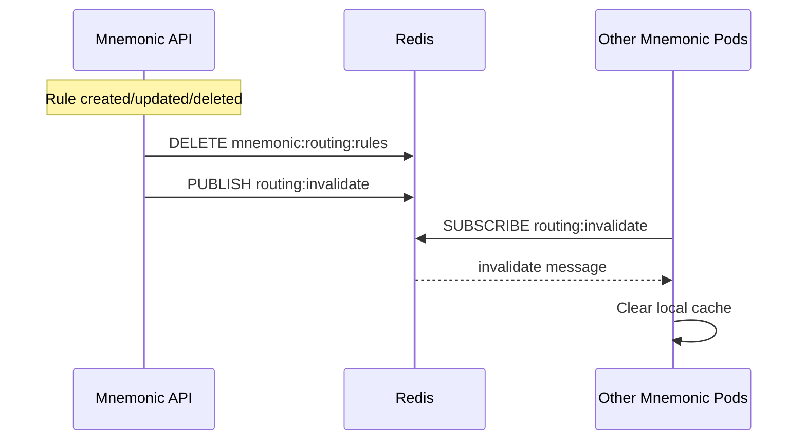

## Data Lifecycle Management

[Back to Table of Contents](#table-of-contents)

### Data Retention Policies

| Data Type | Retention | Rationale |
|-----------|-----------|-----------|
| Agents | Indefinite | Active configuration, rarely deleted |
| Patterns | Indefinite | Knowledge base grows over time |
| Routing Rules | Indefinite | Active configuration |
| Enrichment Jobs (completed) | 7 days | Debugging, can be recreated |
| Enrichment Jobs (failed) | 30 days | Root cause analysis |

### Archival Strategies

**Enrichment Jobs Cleanup:**

```sql
-- Archive completed jobs older than 7 days
DELETE FROM enrichment_jobs
WHERE status = 'completed'
  AND completed_at < NOW() - INTERVAL '7 days';

-- Keep failed jobs for 30 days
DELETE FROM enrichment_jobs
WHERE status = 'failed'
  AND updated_at < NOW() - INTERVAL '30 days';
```

**Pattern Versioning (Post-MVP):**

For audit requirements, implement a pattern_history table:

```sql
CREATE TABLE pattern_history (
    id UUID PRIMARY KEY DEFAULT gen_random_uuid(),
    pattern_id UUID NOT NULL,
    name VARCHAR(128) NOT NULL,
    content TEXT NOT NULL,
    changed_by VARCHAR(128),  -- X-User-ID header
    changed_at TIMESTAMPTZ NOT NULL DEFAULT NOW(),
    change_type VARCHAR(20) NOT NULL  -- 'create', 'update', 'delete'
);
```

### Cleanup Procedures

**Orphaned Graph Nodes:**

```cypher
// Remove Concept nodes with no relationships
MATCH (c:Concept)
WHERE NOT (c)-[:MENTIONED_IN]->()
DELETE c;

// Remove stale Pattern nodes not in Postgres
MATCH (p:Pattern)
WHERE NOT EXISTS {
    CALL {
        WITH p
        RETURN 1 WHERE p.id IN $postgres_pattern_ids
    }
}
DELETE p;
```

**Stale Embeddings:**

```sql
-- Clear embeddings for failed enrichment (allow retry)
UPDATE patterns
SET embedding = NULL,
    enrichment_status = 'pending',
    enrichment_error = NULL
WHERE enrichment_status = 'failed'
  AND updated_at < NOW() - INTERVAL '24 hours';
```

## Consistency and Integrity

[Back to Table of Contents](#table-of-contents)

### Transaction Handling

**Postgres Transactions:**

All write operations use explicit transactions with appropriate isolation. The general pattern:

1. Begin transaction with appropriate isolation level
2. Execute Postgres write operations
3. Attempt Neo4j sync (best-effort, log failures)
4. Commit transaction

**Isolation Levels:**

| Operation | Isolation Level | Rationale |
|-----------|-----------------|-----------|
| Read queries | Read Committed | Default, sufficient for reads |
| Write operations | Read Committed | Prevents dirty reads |
| Enrichment job claim | Serializable | Prevents race conditions |

### Cross-Database Consistency

Postgres is the source of truth. Neo4j contains a projection of relevant data for graph queries.

**Consistency Model:**

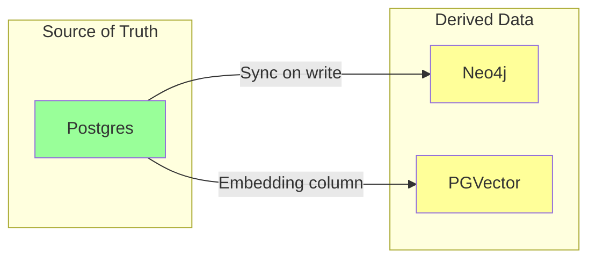

**Sync Failure Handling:**

1. Postgres write succeeds, Neo4j sync fails:
   - Log warning, continue
   - Background reconciliation job (Post-MVP)
   - Pattern still usable for keyword/regex routing

2. Enrichment fails after Postgres write:
   - Pattern exists but not searchable
   - Enrichment job tracks failure
   - Manual retry via admin API

### Constraint Enforcement

**Database-Level Constraints:**

```sql
-- Referential integrity
ALTER TABLE routing_rules
ADD CONSTRAINT fk_routing_rules_agent
FOREIGN KEY (agent_name) REFERENCES agents(name)
ON DELETE RESTRICT;  -- Prevent agent deletion if referenced

-- Business rules
ALTER TABLE routing_rules
ADD CONSTRAINT chk_match_config_valid
CHECK (
    (match_type = 'keyword' AND match_config ? 'keywords' AND match_config ? 'match_mode') OR
    (match_type = 'regex' AND match_config ? 'pattern') OR
    (match_type = 'pattern' AND match_config ? 'pattern_ids') OR
    (match_type = 'default')
);
```

**Application-Level Validation:**

- Match config structure validated before database insert
- Pattern IDs in pattern match config verified to exist
- Agent name pattern enforced (`^[a-z][a-z0-9-]*$`)

## Security and Access Control

[Back to Table of Contents](#table-of-contents)

> **Architecture Reference:** [Security Architecture](06-security-architecture.md)

### Encryption at Rest

| Database | Encryption Method | Configuration |
|----------|-------------------|---------------|
| PostgreSQL | Transparent Data Encryption (TDE) | Cloud provider managed or pgcrypto |
| Neo4j | Enterprise Edition encryption | Or encrypted volume mounts |
| Redis | At-rest encryption | Cloud provider managed |

**Volume-Level Encryption (Kubernetes):**

```yaml
# StorageClass with encryption
apiVersion: storage.k8s.io/v1
kind: StorageClass
metadata:
  name: encrypted-fast
provisioner: ebs.csi.aws.com
parameters:
  type: gp3
  encrypted: "true"
  kmsKeyId: arn:aws:kms:...
```

### Access Patterns

**Database Credentials:**

- Stored in Kubernetes Secrets or cloud secret managers
- Rotated on schedule (90 days recommended)
- Separate read/write users for principle of least privilege

**Connection Security:**

```yaml
# Mnemonic database configuration
database:
  postgres:
    sslmode: require
    sslrootcert: /etc/ssl/certs/rds-ca-cert.pem
  neo4j:
    encryption: true
    trust_strategy: TRUST_SYSTEM_CA_SIGNED_CERTIFICATES
```

### Audit Logging

**Database-Level Audit (PostgreSQL):**

```sql
-- Enable pgaudit extension
CREATE EXTENSION IF NOT EXISTS pgaudit;

-- Configure audit logging
ALTER SYSTEM SET pgaudit.log = 'write, ddl';
ALTER SYSTEM SET pgaudit.log_catalog = off;
SELECT pg_reload_conf();
```

**Application-Level Audit:**

All write operations log:

- User ID (from X-User-ID header)
- Team ID (from X-Team-ID header)
- Operation (create, update, delete)
- Resource type and identifier
- Timestamp
- Request ID (for correlation)

## Backup and Recovery

[Back to Table of Contents](#table-of-contents)

> **Note:** This section defines specifications for Post-MVP implementation. MVP operates without formal backup procedures. See [Deployment Architecture - Backup and Recovery](05-deployment-architecture.md#backup-and-recovery) for current status.

### Backup Strategies

| Database | Backup Type | Frequency | Retention |
|----------|-------------|-----------|-----------|
| PostgreSQL | Full snapshot | Daily | 30 days |
| PostgreSQL | WAL archiving | Continuous | 7 days |
| Neo4j | Online backup | Daily | 14 days |
| Redis | RDB snapshot | Hourly | 24 hours |

**PostgreSQL Backup (AWS RDS Example):**

```yaml
# RDS configuration
automated_backup_retention_period: 30
backup_window: "03:00-04:00"
maintenance_window: "sun:04:00-sun:05:00"
multi_az: true
storage_encrypted: true
```

**Neo4j Backup (Docker/Kubernetes):**

```bash
# Online backup to S3
neo4j-admin database backup \
    --database=neo4j \
    --to-path=/backup \
    --compress

aws s3 cp /backup/neo4j-*.backup s3://ace-backups/neo4j/
```

### Recovery Procedures

**PostgreSQL Point-in-Time Recovery:**

1. Identify target recovery time
2. Stop Mnemonic pods (prevent writes)
3. Restore from snapshot + WAL replay
4. Verify data integrity
5. Restart Mnemonic pods

**Neo4j Recovery:**

1. Stop Neo4j container
2. Restore backup to data directory
3. Start Neo4j container
4. Run consistency check
5. Reconcile with Postgres (if needed)

### Point-in-Time Recovery

**PostgreSQL PITR Configuration:**

```sql
-- Archive WAL to S3
archive_mode = on
archive_command = 'aws s3 cp %p s3://ace-wal-archive/%f'

-- Recovery configuration
restore_command = 'aws s3 cp s3://ace-wal-archive/%f %p'
recovery_target_time = '2024-01-15 14:30:00 UTC'
```

**Recovery Time Objectives:**

| Scenario | RTO | RPO |
|----------|-----|-----|
| Hardware failure (multi-AZ) | < 5 minutes | 0 (synchronous replication) |
| Data corruption | < 1 hour | Depends on detection time |
| Full disaster recovery | < 4 hours | < 1 hour (WAL archiving) |

## Migration Strategy

[Back to Table of Contents](#table-of-contents)

> **Architecture Reference:** [Deployment Architecture - Independent Deployment Pipelines](05-deployment-architecture.md#independent-deployment-pipelines)

### Schema Versioning

**Migration Tool:** golang-migrate

**Directory Structure:**

```text
src/
└── migrations/
    ├── postgres/
    │   ├── 001_create_agents.up.sql
    │   ├── 001_create_agents.down.sql
    │   ├── 002_create_patterns.up.sql
    │   ├── 002_create_patterns.down.sql
    │   └── ...
    └── neo4j/
        ├── 001_create_constraints.cypher
        └── 002_create_indexes.cypher
```

**Version Tracking:**

```sql
-- golang-migrate creates this automatically
CREATE TABLE schema_migrations (
    version BIGINT PRIMARY KEY,
    dirty BOOLEAN NOT NULL
);
```

### Forward-Compatible Migrations

**Migration Safety Rules:**

1. **Add columns as nullable or with defaults**

   ```sql
   -- Good: New column is nullable
   ALTER TABLE agents ADD COLUMN metadata JSONB;

   -- Good: New column has default
   ALTER TABLE patterns ADD COLUMN version INTEGER DEFAULT 1;
   ```

2. **Never rename columns directly**

   ```sql
   -- Bad: Breaks running application
   ALTER TABLE agents RENAME COLUMN name TO agent_name;

   -- Good: Add new column, migrate data, deprecate old
   ALTER TABLE agents ADD COLUMN agent_name VARCHAR(64);
   UPDATE agents SET agent_name = name;
   -- Later migration: DROP old column
   ```

3. **Add indexes concurrently**

   ```sql
   -- Good: Non-blocking index creation
   CREATE INDEX CONCURRENTLY idx_patterns_name ON patterns(name);
   ```

### Rollback Procedures

**Down Migration Example:**

```sql
-- 002_add_pattern_version.down.sql
ALTER TABLE patterns DROP COLUMN IF EXISTS version;
```

**Rollback Process:**

```bash
# Check current version
migrate -path src/migrations/postgres -database "$DB_URL" version

# Rollback one version
migrate -path src/migrations/postgres -database "$DB_URL" down 1

# Rollback to specific version
migrate -path src/migrations/postgres -database "$DB_URL" goto 5
```

**Rollback Safety:**

- Test rollback in staging before production
- Ensure down migrations are idempotent
- Data migrations may require manual intervention

## Performance Considerations

[Back to Table of Contents](#table-of-contents)

### Index Strategies

**PostgreSQL Indexes:**

```sql
-- Primary lookup indexes (created by primary key constraints)
-- agents(name), patterns(id), routing_rules(id)

-- Foreign key indexes (required for join performance)
CREATE INDEX idx_routing_rules_agent ON routing_rules(agent_name);
CREATE INDEX idx_pattern_associations_agent ON pattern_agent_associations(agent_name);
CREATE INDEX idx_pattern_associations_pattern ON pattern_agent_associations(pattern_id);
CREATE INDEX idx_enrichment_jobs_pattern ON enrichment_jobs(pattern_id);

-- Query optimization indexes
CREATE INDEX idx_routing_rules_enabled_priority
    ON routing_rules(priority DESC, id)
    WHERE enabled = true;

CREATE INDEX idx_patterns_enrichment_status
    ON patterns(enrichment_status)
    WHERE enrichment_status = 'enriched';

CREATE INDEX idx_enrichment_jobs_pending
    ON enrichment_jobs(scheduled_for)
    WHERE status = 'pending';

-- JSONB indexes for tag filtering
CREATE INDEX idx_patterns_tags ON patterns USING GIN (tags);

-- Full-text search index
CREATE INDEX idx_patterns_search ON patterns
    USING GIN (to_tsvector('english', name || ' ' || COALESCE(description, '')));
```

**Index Maintenance:**

```sql
-- Analyze tables for query planner
ANALYZE agents;
ANALYZE patterns;
ANALYZE routing_rules;

-- Reindex if bloat is detected
REINDEX INDEX CONCURRENTLY idx_patterns_embedding;
```

### Query Optimization

**Routing Query Optimization:**

```sql
-- Rules query: indexed scan, no table access needed
EXPLAIN ANALYZE
SELECT id, name, priority, agent_name, match_type, match_config, enabled
FROM routing_rules
WHERE enabled = true
ORDER BY priority DESC, id;

-- Expected: Index Scan using idx_routing_rules_enabled_priority
```

**Pattern Similarity Query:**

```sql
-- Use index for similarity search
SET ivfflat.probes = 10;  -- Increase for better recall

EXPLAIN ANALYZE
SELECT id, name, content, 1 - (embedding <=> $1::vector) AS similarity
FROM patterns
WHERE enrichment_status = 'enriched'
ORDER BY embedding <=> $1::vector
LIMIT 5;

-- Expected: Index Scan using idx_patterns_embedding
```

### Connection Pool Configuration

**PostgreSQL Connection Pool Settings:**

| Setting | Recommended Value | Description |
|---------|------------------|-------------|
| Max Connections | 25 | Maximum pool size based on expected concurrency |
| Min Connections | 5 | Keep-alive connections for baseline traffic |
| Max Connection Lifetime | 1 hour | Recycle connections to handle server-side limits |
| Max Idle Time | 30 minutes | Release idle connections to conserve resources |
| Health Check Period | 1 minute | Verify connection liveness |

**Neo4j Connection Pool Settings:**

| Setting | Recommended Value | Description |
|---------|------------------|-------------|
| Max Pool Size | 50 | Maximum concurrent connections |
| Max Connection Lifetime | 1 hour | Connection recycling period |
| Acquisition Timeout | 30 seconds | Maximum wait time for available connection |

**Pool Sizing Guidelines:**

| Deployment | Postgres Pool | Neo4j Pool | Rationale |
|------------|---------------|------------|-----------|
| Development | 5 | 10 | Minimal resources |
| Single Pod | 25 | 25 | Balanced for typical load |
| Multi-Pod (3) | 15 per pod | 15 per pod | Total 45, below database max |

## Key Takeaways

[Back to Table of Contents](#table-of-contents)

- **Polyglot persistence** - Each database chosen for specific strengths (Postgres for ACID, PGVector for vectors, Neo4j for graphs)
- **Postgres is source of truth** - All primary data lives in Postgres; other databases contain projections
- **Eventual consistency for graphs** - Neo4j sync is best-effort; failures logged and retried
- **Enrichment is asynchronous** - Pattern processing happens in background to avoid API latency
- **Stateless Mnemonic** - All state in external databases enables horizontal scaling
- **Forward-compatible migrations** - Schema changes designed for zero-downtime deployments
- **Defense in depth** - Constraints at database level, validation at application level

**Next:** Return to [Architecture Overview](00-overview.md)

---

See also:

- [System Architecture](03-system-architecture.md) for component details
- [Pattern Processing](../design/mnemonic_service/pattern-processing.md) for enrichment pipeline
- [Routing Engine](../design/mnemonic_service/routing-engine.md) for rule evaluation
- [Deployment Architecture](05-deployment-architecture.md) for scaling patterns
