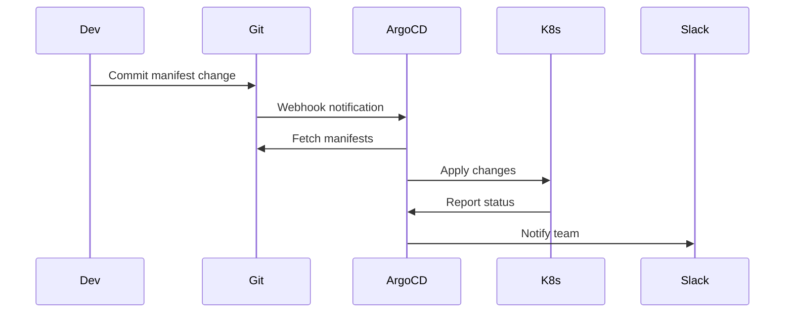

# Deployment on Kubernetes

**Document:** Deployment Architecture  
**Version:** 1.0  
**Last Updated:** December 22, 2025

We're deploying on Kubernetes with GitOps. Let's talk about how.

## Why Kubernetes

**Orchestration:** Automatically schedules containers, restarts failures, manages resources

**Scalability:** Add more pods when needed, remove when traffic drops

**Declarative:** Describe what you want, K8s makes it happen

**Standard:** Works on AWS, GCP, Azure, on-prem. Portable.

## Pod Structure

### API Server Pod

Three containers working together:

```yaml
# Simplified deployment
apiVersion: apps/v1
kind: Deployment
metadata:
  name: api-server
spec:
  replicas: 3
  template:
    spec:
      containers:
        # Envoy sidecar
        - name: envoy
          image: envoyproxy/envoy:v1.28
          ports:
            - containerPort: 8000 # External traffic
          resources:
            requests: { cpu: 200m, memory: 256Mi }
            limits: { cpu: 500m, memory: 512Mi }

        # OPA sidecar
        - name: opa
          image: openpolicyagent/opa:latest
          ports:
            - containerPort: 8181
          resources:
            requests: { cpu: 100m, memory: 128Mi }
            limits: { cpu: 200m, memory: 256Mi }

        # Application
        - name: api-server
          image: ace/api-server:1.0.0
          ports:
            - containerPort: 8080
          resources:
            requests: { cpu: 1000m, memory: 2Gi }
            limits: { cpu: 2000m, memory: 4Gi }
```

## Auto-Scaling

### Horizontal Pod Autoscaler

Scale based on CPU, memory, or custom metrics:

```yaml
apiVersion: autoscaling/v2
kind: HorizontalPodAutoscaler
metadata:
  name: api-server-hpa
spec:
  scaleTargetRef:
    name: api-server
  minReplicas: 3
  maxReplicas: 10
  metrics:
    - type: Resource
      resource:
        name: cpu
        target:
          averageUtilization: 70
```

**How it works:**

- CPU > 70% → Add pods
- CPU < 50% (after 5min) → Remove pods
- Never goes below 3 or above 10

## Health Checks

Three types of probes:

**Liveness:** Is the app running?

```yaml
livenessProbe:
  httpGet:
    path: /health
    port: 8080
  periodSeconds: 10
  failureThreshold: 3 # Restart after 3 failures
```

**Readiness:** Can it serve traffic?

```yaml
readinessProbe:
  httpGet:
    path: /ready
    port: 8080
  periodSeconds: 5
  failureThreshold: 3 # Remove from load balancer
```

**Startup:** Has it finished starting?

```yaml
startupProbe:
  httpGet:
    path: /startup
    port: 8080
  periodSeconds: 5
  failureThreshold: 30 # 150s max startup time
```

## Deployment Strategies

### Rolling Update (Default)

Replace pods gradually:

```text
Old v1.0: [Pod1] [Pod2] [Pod3]
          [Pod1] [Pod2] [Pod3] [Pod4-v1.1]  <- Add new
          [Pod1] [Pod2] [Pod4-v1.1]         <- Remove old
          [Pod1] [Pod4-v1.1] [Pod5-v1.1]
          [Pod4-v1.1] [Pod5-v1.1] [Pod6-v1.1]
New v1.1: [Pod4-v1.1] [Pod5-v1.1] [Pod6-v1.1]
```

Zero downtime, gradual transition.

### Blue-Green

Deploy new version completely, switch all at once:

```text
Blue (v1.0):  [Pod1] [Pod2] [Pod3] <- 100% traffic
Green (v1.1): [Pod4] [Pod5] [Pod6] <- 0% traffic, testing

[Switch DNS/Service]

Blue (v1.0):  [Pod1] [Pod2] [Pod3] <- 0% traffic, can rollback
Green (v1.1): [Pod4] [Pod5] [Pod6] <- 100% traffic
```

Instant switchover, easy rollback.

## GitOps with ArgoCD

Git is the source of truth:



**Benefits:**

- Git history = deployment history
- Rollback = `git revert`
- Audit trail built-in
- Declarative, reproducible

## Configuration Management

### ConfigMaps

Non-sensitive config:

```yaml
apiVersion: v1
kind: ConfigMap
metadata:
  name: api-config
data:
  LOG_LEVEL: "info"
  COGNEE_URL: "cognee-service:9000"
  REDIS_URL: "redis:6379"
```

### Secrets

Sensitive data:

```yaml
apiVersion: v1
kind: Secret
metadata:
  name: api-secrets
data:
  anthropic-api-key: <base64>
  database-password: <base64>
```

## Service Discovery

Services are discovered via DNS:

```yaml
apiVersion: v1
kind: Service
metadata:
  name: api-server
spec:
  selector:
    app: api-server
  ports:
    - port: 8080
```

Accessible at: `api-server.ace.svc.cluster.local`

K8s load balances across healthy pods automatically.

## Key Takeaways

- **Kubernetes orchestrates** - Manages containers at scale
- **Sidecars for infrastructure** - Envoy, OPA keep app clean
- **Auto-scaling** - HPA adjusts to load
- **GitOps deployment** - Git as source of truth
- **Health checks** - Automatic recovery from failures
- **Rolling updates** - Zero-downtime deploys

Next: How we scale the system.

---

Copyright © 2025 Jeremy K. Johnson. All rights reserved.
