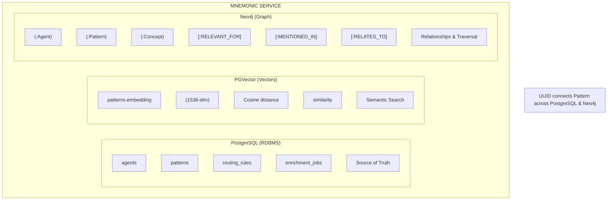
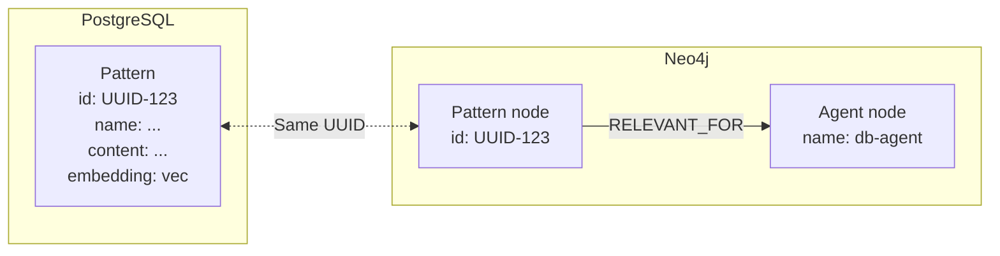
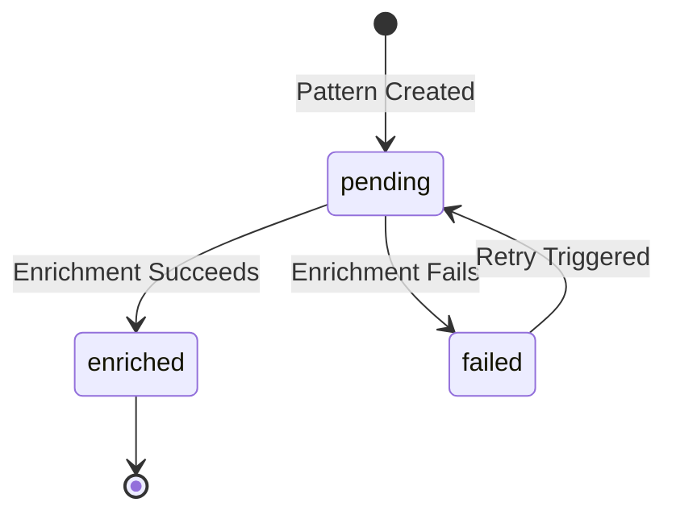
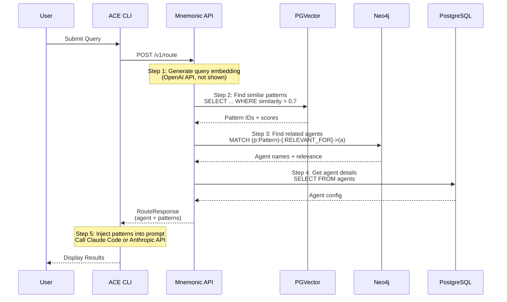

# Database Integration Flow

[Back to Overview](00-overview.md) | [Back to Data Architecture](08-data-architecture.md)

## Table of Contents

- [Overview](#overview)
- [The Three Storage Layers](#the-three-storage-layers)
- [Embeddings Explained](#embeddings-explained)
- [The Pattern UUID: The Universal Key](#the-pattern-uuid-the-universal-key)
- [Data Flow: Pattern Creation and Enrichment](#data-flow-pattern-creation-and-enrichment)
- [Query Flow: The Routing Pipeline](#query-flow-the-routing-pipeline)
- [Sequence Diagram](#sequence-diagram)
- [Summary Table](#summary-table)
- [Future: Visualization](#future-visualization-possibility)
- [Future: Admin Tooling](#future-admin-tooling)
- [Key Takeaways](#key-takeaways)

## Overview

Mnemonic uses a polyglot persistence strategy where three complementary databases work together to provide intelligent routing decisions. This document explains how data flows between PostgreSQL, PGVector, and Neo4j during pattern creation and query processing.

## The Three Storage Layers

Each database serves a distinct purpose in the Mnemonic architecture:

### PostgreSQL (RDBMS): Structured Data Storage

**Role:** Source of truth for all structured data with ACID transaction guarantees.

**Stores:**

- Agents (name, description, system_prompt, model, allowed_tools)
- Routing rules (priority, match_type, match_config)
- Patterns (name, content, tags, enrichment_status)
- Enrichment jobs (background processing queue)
- Pattern-Agent associations (with relevance scores)

**Why PostgreSQL:** Mature ecosystem, excellent Go driver support, JSONB for flexible storage, and transactional consistency across entities.

### PGVector: Semantic Similarity Search

**Role:** Enable semantic search through vector embeddings.

**Stores:**

- Pattern content embeddings (1536 dimensions, OpenAI text-embedding-3-small)
- Vector similarity indexes (IVFFlat or HNSW based on scale)

**Why PGVector:** Single database deployment (no separate vector service), transactional consistency with metadata, and sufficient performance for expected pattern counts.

### Neo4j: Relationship Traversal

**Role:** Knowledge graph for entity relationships and pattern connections.

**Stores:**

- Pattern nodes (mirrored from PostgreSQL with id, name, description)
- Agent nodes (mirrored from PostgreSQL with name)
- Concept nodes (extracted during enrichment: technology, practice, domain)
- Relationships:
  - `(:Pattern)-[:RELEVANT_FOR {relevance: 0.95}]->(:Agent)`
  - `(:Concept)-[:MENTIONED_IN]->(:Pattern)`
  - `(:Pattern)-[:RELATES_TO {similarity: 0.85}]->(:Pattern)`

**Why Neo4j:** Native graph model for relationship-heavy queries, expressive Cypher query language, and built-in graph algorithms.

### Diagram: Three Storage Layers



## Embeddings Explained

### What is an Embedding?

An embedding is a numeric representation of text that captures its semantic meaning. Think of it as a "fingerprint" that represents the concept and context of the content.

**Technical Details:**

- Generated by OpenAI's text-embedding-3-small model
- 1536 floating-point numbers per embedding
- Each dimension captures different aspects of meaning
- Similar concepts produce similar vector patterns

### Why 1536 Dimensions?

It's not a magic number. That's just what OpenAI's text-embedding-3-small model outputs. Different embedding models have different dimensions:

- OpenAI text-embedding-3-small: 1536
- OpenAI text-embedding-3-large: 3072
- Cohere embed-english-v3.0: 1024
- Sentence Transformers all-MiniLM-L6-v2: 384

The 1536 dimension size is a sweet spot balancing quality, cost, and performance for our use case.

### How Similarity Works: The Arrow Analogy

Think of embeddings like arrows pointing in a direction. Each arrow has 1536 components, but conceptually it's pointing somewhere in meaning-space.

When two pieces of text have similar meanings, their embeddings are like arrows pointing in roughly the same direction. When texts are unrelated, their arrows point in very different directions.

Cosine similarity measures the angle between these arrows:

- Small angle = Arrows point the same way = High similarity
- Large angle = Arrows point different directions = Low similarity

**Similarity Scores:**

- 1.0 = Identical direction (same meaning)
- 0.7-1.0 = Small angle (highly relevant, typical threshold for pattern matching)
- 0.5-0.7 = Medium angle (somewhat related)
- 0.0-0.5 = Large angle (unrelated or opposite meaning)

**Example:**

```text
Query: "Help me optimize this SQL query"
Embedding: [0.023, -0.145, 0.087, ..., 0.034] (1536 values)

Pattern 1: "Database query optimization techniques"
Embedding: [0.025, -0.142, 0.091, ..., 0.036] (1536 values)
Similarity: 0.94 (arrows pointing nearly the same direction)

Pattern 2: "Go error handling best practices"
Embedding: [-0.081, 0.234, -0.052, ..., -0.123] (1536 values)
Similarity: 0.31 (arrows pointing in different directions)
```

### Who Calculates What?

It's important to understand the division of responsibilities:

- **OpenAI API**: Generates the embedding (turns text into 1536 numbers)
- **PGVector**: Stores the embedding AND calculates similarity using the `<=>` operator
- **Mnemonic**: Orchestrates everything (calls APIs, queries databases, assembles responses)

Mnemonic never touches vector arithmetic directly. It just asks PGVector "which patterns are similar to this embedding?" and PGVector does the math.

### How IVFFlat Indexes Speed Things Up

When you have thousands of patterns, comparing against every single one is slow. That's where IVFFlat indexes come in.

**The Problem:**

Checking similarity against 10,000 patterns means 10,000 comparisons per query. As you add more patterns, queries get slower and slower.

**The Solution:**

IVFFlat uses k-means clustering to create "buckets" of similar patterns. Think of it like organizing a library into sections. When someone asks for a book about SQL, you don't search the entire library. You go to the database section first, then search there.

**How It Works:**

1. During index creation, k-means finds "centroids" (bucket centers)
2. Each pattern gets assigned to its nearest centroid
3. At query time:
   - Compare the query embedding to centroids first (fast)
   - Only search the nearest buckets (fast)
   - Skip distant buckets entirely (they won't be relevant)

**Configuration Trade-offs:**

- **lists**: Number of buckets (centroids)
  - More lists = faster search (fewer patterns per bucket)
  - Risk: If lists are too granular, you might miss relevant patterns
- **probes**: Number of buckets to search per query
  - More probes = more accurate (search more buckets)
  - More probes = slower (checking more patterns)

**Our Configuration:**

```text
lists = 100  (100 buckets of patterns)
probes = 10  (search 10 nearest buckets)
```

This means we search roughly 10% of patterns per query, dramatically improving performance while maintaining accuracy. The key insight is that relevant patterns cluster together in embedding space, so searching nearby buckets catches what we need.

## The Pattern UUID: The Universal Key

Every pattern has a UUID that serves as the universal identifier across both PostgreSQL and Neo4j. This UUID is the key that connects structured data, vector embeddings, and graph relationships.

### PostgreSQL Storage

```sql
-- patterns table
id: UUID (Primary Key)
name: VARCHAR(128)
description: VARCHAR(500)
content: TEXT (up to 10KB)
tags: JSONB
embedding: vector(1536)
enrichment_status: ENUM ('pending', 'enriched', 'failed')
enriched_at: TIMESTAMPTZ
```

**Example Row:**

```text
id: 550e8400-e29b-41d4-a716-446655440001
name: "sql-query-optimization"
content: "Use EXPLAIN ANALYZE to identify slow queries..."
embedding: vector(1536) [0.023, -0.145, ...]
enrichment_status: 'enriched'
```

### Neo4j Storage

```cypher
// Pattern node in Neo4j
(:Pattern {
  id: "550e8400-e29b-41d4-a716-446655440001",
  name: "sql-query-optimization",
  description: "Database query optimization techniques"
})
```

### Cross-Database Connections

The same UUID enables queries like:

1. Find patterns similar to query (PGVector search)
2. Use pattern UUIDs to look up graph relationships (Neo4j traversal)
3. Retrieve full pattern details (PostgreSQL lookup)



## Data Flow: Pattern Creation and Enrichment

Pattern enrichment is an asynchronous pipeline that transforms raw content into searchable, connected knowledge.

### Step-by-Step Flow

**Step 1: Pattern Created (PostgreSQL)**

```http
POST /v1/api/patterns
{
  "name": "sql-optimization",
  "content": "Use EXPLAIN ANALYZE to identify slow queries...",
  "tags": ["database", "performance"]
}
```

```sql
-- Postgres INSERT
INSERT INTO patterns (id, name, content, tags, enrichment_status)
VALUES (
  gen_random_uuid(),
  'sql-optimization',
  'Use EXPLAIN ANALYZE...',
  '["database", "performance"]'::jsonb,
  'pending'
);
-- id generated: 550e8400-e29b-41d4-a716-446655440001

-- Enrichment job created
INSERT INTO enrichment_jobs (pattern_id, status)
VALUES ('550e8400-e29b-41d4-a716-446655440001', 'pending');
```

**Step 2: Background Worker Claims Job**

```go
// Worker claims job atomically
SELECT id, pattern_id
FROM enrichment_jobs
WHERE status = 'pending'
  AND scheduled_for <= NOW()
ORDER BY scheduled_for
LIMIT 1
FOR UPDATE SKIP LOCKED;
```

**Step 3: Generate Embedding (OpenAI API)**

```go
// Call OpenAI embedding API
embedding := openai.CreateEmbedding(
  model: "text-embedding-3-small",
  input: pattern.Content,
)
// Returns: vector(1536) [0.023, -0.145, 0.087, ...]
```

**Step 4: Store Embedding (PGVector)**

```sql
UPDATE patterns
SET embedding = $1::vector,
    enrichment_status = 'enriched',
    enriched_at = NOW()
WHERE id = '550e8400-e29b-41d4-a716-446655440001';
```

**Step 5: Extract Concepts (LLM)**

```go
// LLM extracts entities and concepts from content
concepts := llm.ExtractConcepts(pattern.Content)
// Returns: [
//   {name: "sql", type: "technology"},
//   {name: "query-optimization", type: "practice"},
//   {name: "performance-tuning", type: "domain"}
// ]
```

**Step 6: Create Graph Nodes and Relationships (Neo4j)**

```cypher
// Create Pattern node
MERGE (p:Pattern {id: "550e8400-e29b-41d4-a716-446655440001"})
SET p.name = "sql-optimization",
    p.description = "Database query optimization"

// Create Concept nodes
MERGE (c1:Concept {name: "sql", type: "technology"})
MERGE (c2:Concept {name: "query-optimization", type: "practice"})

// Create relationships
MERGE (c1)-[:MENTIONED_IN]->(p)
MERGE (c2)-[:MENTIONED_IN]->(p)

// Link to relevant agents (if associations exist)
MATCH (a:Agent {name: "database-agent"})
MERGE (p)-[:RELEVANT_FOR {relevance: 0.95}]->(a)
```

**Step 7: Complete Enrichment Job**

```sql
UPDATE enrichment_jobs
SET status = 'completed',
    completed_at = NOW()
WHERE pattern_id = '550e8400-e29b-41d4-a716-446655440001';
```

### Enrichment State Transitions



## Query Flow: The Routing Pipeline

This is the core operation: turning a user query into an intelligent routing decision with relevant patterns.

### API Request

```http
POST /v1/api/route
Content-Type: application/json

{
  "query": "Help me optimize this SQL query",
  "context": {
    "current_file": "src/db/queries.go",
    "language": "sql"
  }
}
```

### Internal Processing Steps

**Step 1: Query Embedding (OpenAI)**

```go
// Generate embedding for user query
queryEmbedding := openai.CreateEmbedding(
  model: "text-embedding-3-small",
  input: "Help me optimize this SQL query",
)
// Returns: vector(1536)
```

**Step 2: Pattern Matching (PGVector Similarity Search)**

```sql
-- Find patterns semantically similar to query
SELECT
  id,
  name,
  content,
  1 - (embedding <=> $1::vector) AS similarity
FROM patterns
WHERE enrichment_status = 'enriched'
  AND 1 - (embedding <=> $1::vector) > 0.7  -- threshold
ORDER BY embedding <=> $1::vector
LIMIT 5;
```

**Results:**

```text
id: 550e8400-...001, name: sql-optimization, similarity: 0.94
id: 550e8400-...002, name: database-indexing, similarity: 0.82
id: 550e8400-...003, name: query-performance, similarity: 0.78
```

**Step 3: Graph Expansion (Neo4j)**

```cypher
// Find agents connected to these patterns
MATCH (p:Pattern)-[r:RELEVANT_FOR]->(a:Agent)
WHERE p.id IN [
  "550e8400-...001",
  "550e8400-...002",
  "550e8400-...003"
]
RETURN a.name,
       p.id,
       r.relevance
ORDER BY r.relevance DESC;
```

**Results:**

```text
agent: database-agent, pattern: 550e8400-...001, relevance: 0.95
agent: database-agent, pattern: 550e8400-...002, relevance: 0.88
agent: go-backend-agent, pattern: 550e8400-...003, relevance: 0.72
```

**Graph Boosting:**

```cypher
// Expand to related concepts for context
MATCH (p:Pattern)-[:RELEVANT_FOR]->(a:Agent)
WHERE p.id IN ["550e8400-...001"]
MATCH (c:Concept)-[:MENTIONED_IN]->(p)
RETURN c.name, c.type;
```

**Results:**

```text
concept: sql, type: technology
concept: query-optimization, type: practice
concept: performance-tuning, type: domain
```

**Step 4: Agent Lookup (PostgreSQL)**

```sql
-- Get full agent configuration
SELECT name, description, system_prompt, model, allowed_tools
FROM agents
WHERE name = 'database-agent';
```

**Result:**

```json
{
  "name": "database-agent",
  "description": "Specialist in database design and optimization",
  "system_prompt": "You are an expert database engineer...",
  "model": "sonnet",
  "allowed_tools": ["Read", "Write", "Bash", "Grep"]
}
```

**Step 5: Response Assembly**

```json
{
  "routing_decision": {
    "primary_agent": {
      "name": "database-agent",
      "confidence": 0.94,
      "system_prompt": "You are an expert database engineer...",
      "model": "sonnet",
      "allowed_tools": ["Read", "Write", "Bash", "Grep"]
    },
    "supporting_agents": [
      {
        "name": "go-backend-agent",
        "confidence": 0.72
      }
    ]
  },
  "relevant_patterns": [
    {
      "id": "550e8400-...001",
      "name": "sql-optimization",
      "content": "Use EXPLAIN ANALYZE to identify slow queries...",
      "similarity": 0.94,
      "relevance": 0.95
    },
    {
      "id": "550e8400-...002",
      "name": "database-indexing",
      "content": "B-tree indexes are optimal for equality and range queries...",
      "similarity": 0.82,
      "relevance": 0.88
    }
  ],
  "concepts": [
    { "name": "sql", "type": "technology" },
    { "name": "query-optimization", "type": "practice" }
  ]
}
```

### Back to ACE CLI

The ACE CLI receives this response and injects patterns into the agent's system prompt:

```text
Original system prompt:
"You are an expert database engineer..."

Enriched system prompt:
"You are an expert database engineer...

RELEVANT PATTERNS:
1. SQL Optimization (relevance: 0.95)
   Use EXPLAIN ANALYZE to identify slow queries...

2. Database Indexing (relevance: 0.88)
   B-tree indexes are optimal for equality and range queries...

USER QUERY: Help me optimize this SQL query
CONTEXT: current_file=src/db/queries.go, language=sql
"
```

Then calls Claude Code (Phase 1) or Anthropic API (Phase 2) with the enriched prompt.

## Sequence Diagram



## Summary Table

This table shows how each database contributes to the routing decision:

| Step | Database   | Question Asked                   | Query Type        | Returns                         |
| ---- | ---------- | -------------------------------- | ----------------- | ------------------------------- |
| 1    | PGVector   | "What knowledge is relevant?"    | Vector similarity | Pattern IDs + content + scores  |
| 2    | Neo4j      | "Which agents know this?"        | Graph traversal   | Agent names + relevance scores  |
| 3    | Neo4j      | "What related concepts exist?"   | Graph expansion   | Concept nodes and relationships |
| 4    | PostgreSQL | "How do I configure this agent?" | Relational lookup | Full agent configuration        |
| 5    | PostgreSQL | "Get full pattern details"       | Relational lookup | Pattern content and metadata    |

**Data Flow Pattern:**

1. PGVector narrows down relevant knowledge (semantic search)
2. Neo4j discovers connections and relationships (graph traversal)
3. PostgreSQL provides authoritative details (structured data lookup)

## Future Visualization Possibility

While not part of the MVP, there's an interesting opportunity to visualize the embedding space and cluster structure.

**The Idea:**

Use dimensionality reduction techniques (t-SNE, UMAP) to project the 1536-dimensional embeddings down to 3D space for interactive visualization.

**What You Could See:**

- Centroids as large spheres showing cluster centers
- Patterns as smaller points colored by agent associations
- Distance between points representing semantic similarity
- Cluster boundaries showing how IVFFlat organizes knowledge

**Potential Benefits:**

- Debug routing decisions (why did this pattern match?)
- Find knowledge gaps (sparse areas in the embedding space)
- Validate cluster configuration (are related patterns grouping together?)
- Visual exploration of the knowledge graph

**Tools:**

- TensorBoard Embedding Projector (3D visualization with metadata)
- Plotly (interactive 3D scatter plots)
- Three.js (custom WebGL visualizations)

This would be particularly useful for understanding and tuning the `lists` and `probes` parameters, or identifying when patterns are poorly distributed across clusters.

## Future: Admin Tooling

Managing patterns in production requires admin tools - you shouldn't need to run SQL or Cypher directly.

**Potential API endpoints:**

```text
DELETE /v1/admin/patterns/{id}     - Remove single pattern
POST   /v1/admin/patterns/prune    - Bulk cleanup (by age, tags, etc.)
GET    /v1/admin/patterns/orphans  - Find patterns with no agent associations
POST   /v1/admin/patterns/{id}/re-enrich - Re-trigger failed enrichment
```

**Potential CLI commands:**

```bash
mnemonic admin patterns delete <id>
mnemonic admin patterns prune --older-than 90d
mnemonic admin patterns list --status failed
mnemonic admin patterns re-enrich <id>
```

**Potential admin UI features:**

- Browse patterns with search/filter
- View enrichment status and errors
- Delete/archive outdated patterns
- Re-trigger enrichment for failed patterns
- View the 3D embedding visualization (see Future: Visualization)

This is a post-MVP feature. The database-level operations work; admin tooling adds a usability layer for operators.

## Key Takeaways

- **Three complementary databases** - Each chosen for specific strengths: PostgreSQL (ACID), PGVector (semantic search), Neo4j (relationships)
- **Pattern UUID is the universal key** - Same identifier connects data across PostgreSQL and Neo4j
- **Embeddings are like arrows in meaning-space** - Similar meanings point the same direction, cosine similarity measures the angle
- **IVFFlat indexes create smart buckets** - Search 10% of patterns by checking nearby clusters only
- **Division of responsibilities is clear** - OpenAI generates embeddings, PGVector calculates similarity, Mnemonic orchestrates
- **Enrichment is asynchronous** - Pattern processing happens in background jobs to avoid API latency
- **Routing is multi-stage** - PGVector finds similar patterns, Neo4j discovers agent connections, PostgreSQL provides details
- **PostgreSQL is source of truth** - Other databases contain projections and derived data
- **Graph relationships add context** - Neo4j expands beyond similarity to include explicit knowledge connections

**Next Steps:**

- Review [Data Architecture](08-data-architecture.md) for detailed schemas and configurations
- Review [Pattern Processing](../design/mnemonic_service/pattern-processing.md) for enrichment pipeline implementation
- Review [Routing Engine](../design/mnemonic_service/routing-engine.md) for routing algorithm details

---

See also:

- [System Architecture](03-system-architecture.md) for component overview
- [API Specification](../design/mnemonic_service/api-specification.md) for REST API details
- [Deployment Architecture](05-deployment-architecture.md) for scaling patterns
