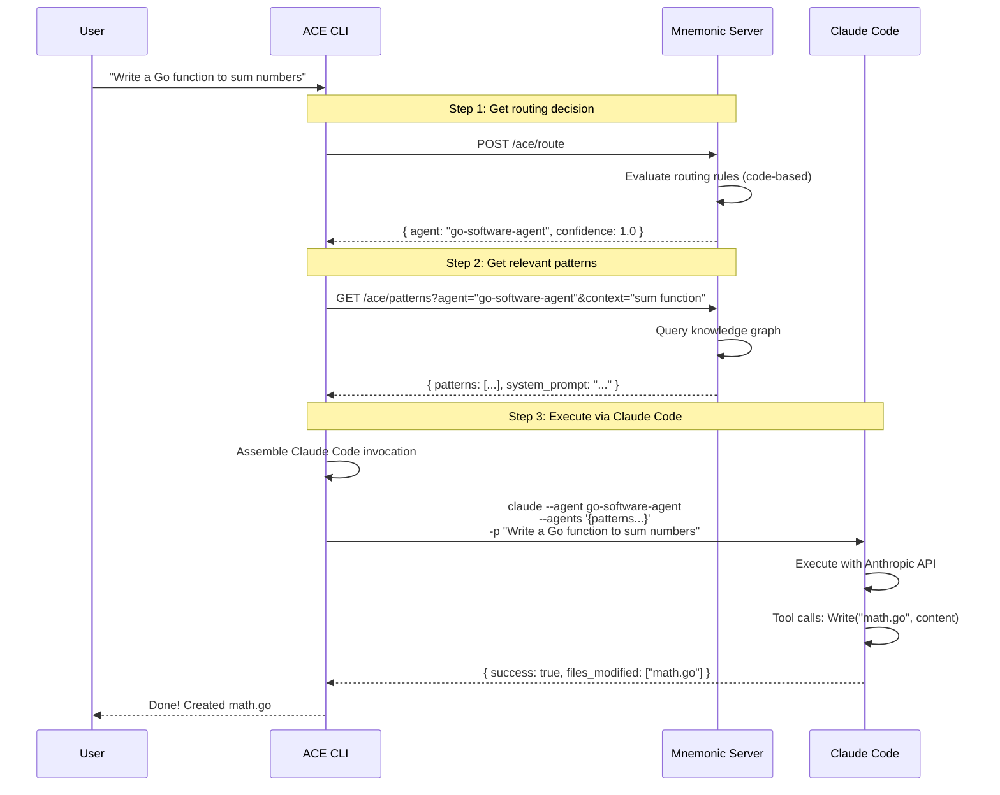
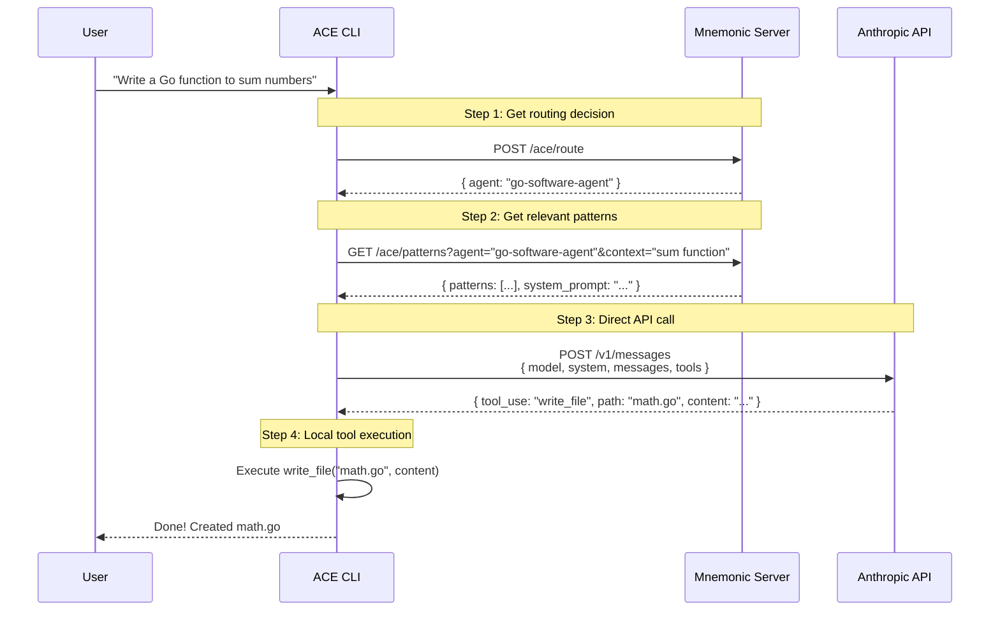

# ACE + Mnemonic Integration Concept

[Back to Overview](00-overview.md)

## Unified Architecture: Mnemonic as the Backend

In this model, Mnemonic serves as the single backend service with ACE-specific endpoints.
ACE CLI orchestrates calls to Mnemonic and Claude Code.

### Phase 1: With Claude Code

### Phase 2: Direct Anthropic API (Future)

## Mnemonic API Endpoints

### ACE-Specific Endpoints

| Endpoint | Purpose |
|----------|---------|
| `POST /ace/route` | Determine which agent handles a prompt |
| `GET /ace/patterns` | Retrieve patterns for a specific agent + context |
| `GET /ace/agents` | List available agents and their capabilities |
| `PUT /ace/rules` | Update routing rules (admin) |

### General Memory Endpoints (for other tools)

| Endpoint | Purpose |
|----------|---------|
| `POST /memory/store` | Store knowledge/patterns |
| `GET /memory/search` | Semantic search across knowledge |
| `GET /memory/graph` | Query knowledge graph relationships |

## What Lives Where

| Component | Location | Responsibility |
|-----------|----------|----------------|
| **Routing rules** | Mnemonic | Stored as queryable knowledge |
| **Patterns** | Mnemonic | Stored in knowledge graph |
| **Agent definitions** | Mnemonic | Stored as structured data |
| **Routing logic** | Mnemonic | Code-based evaluation |
| **Prompt assembly** | ACE CLI | Combines route + patterns + user prompt |
| **Claude Code invocation** | ACE CLI | Builds and executes command |
| **Tool execution** | ACE CLI / Claude Code | Local filesystem operations |

## Benefits of This Model

1. **Single backend**: Only Mnemonic to deploy/manage
2. **ACE CLI is lightweight**: Just orchestration, no server logic
3. **Mnemonic is reusable**: Other tools can use memory endpoints
4. **Clean separation**: Knowledge storage (Mnemonic) vs orchestration (CLI)
5. **Routing as data**: Rules stored alongside patterns, version controlled
