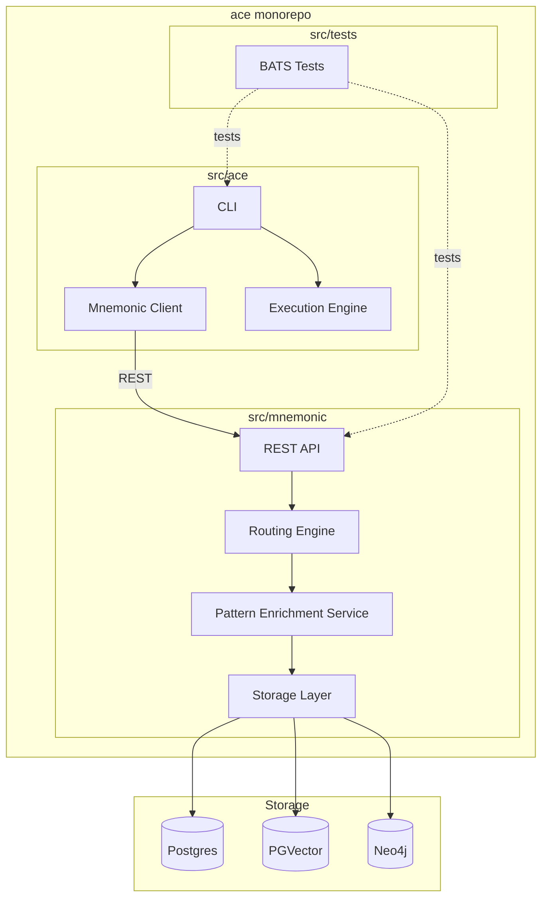
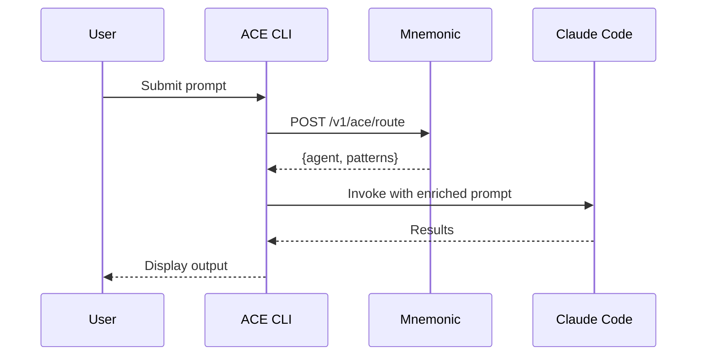

# ACE Project Structure

## Overview

ACE is a monorepo containing two separate Go modules:

1. **mnemonic** - Backend server providing routing and pattern retrieval via REST API
2. **ace** - CLI client that orchestrates routing decisions and Claude Code execution

The monorepo structure enables atomic commits across CLI and server, shared tooling, and simpler dependency management while allowing independent versioning of each module.

## Directory Layout

```text
ace/                              # Root of monorepo
├── src/
│   ├── ace/                      # ACE CLI (separate Go module)
│   │   ├── cmd/
│   │   │   └── ace/
│   │   │       └── main.go
│   │   ├── internal/
│   │   └── go.mod
│   ├── mnemonic/                 # Mnemonic server (separate Go module)
│   │   ├── cmd/
│   │   │   └── mnemonic/
│   │   │       └── main.go
│   │   ├── internal/
│   │   └── go.mod
│   └── tests/                    # BATS tests (shell script tests)
│       └── *.bats
├── api/
│   └── openapi/
├── docs/
│   ├── architecture/
│   └── design/
├── .github/
│   └── workflows/
│       ├── ace.yaml              # Triggered by src/ace/**
│       └── mnemonic.yaml         # Triggered by src/mnemonic/**
└── README.md
```

## Component Layout



## Mnemonic Binary

The Mnemonic server (`src/mnemonic`) provides routing and pattern retrieval for ACE. For MVP, Mnemonic serves only ACE (not a general-purpose memory service).

See [Communication Patterns](04-communication-patterns.md#rest-endpoints) for REST endpoint details.

**Storage Stack:**

- **Postgres** - Relational data (agents, routing rules, metadata)
- **PGVector** - Vector embeddings for semantic search
- **Neo4j** - Knowledge graph for pattern relationships

## ACE Binary

The ACE CLI (`src/ace`) orchestrates routing decisions and executes prompts via Claude Code.

**Responsibilities:**

- Connect to Mnemonic via REST
- Get routing decisions and patterns
- Invoke Claude Code (Phase 1) or Anthropic API (Phase 2)
- Handle local tool execution (Phase 2)

## Data Flow



## Monorepo Structure Benefits

| Benefit                    | Description                                                  |
| -------------------------- | ------------------------------------------------------------ |
| **Atomic changes**         | CLI and server changes committed together when needed        |
| **Shared tooling**         | Single linting, testing, and CI configuration                |
| **Independent modules**    | Separate go.mod per component enables independent versioning |
| **Independent CI/CD**      | GitHub Actions path filters trigger per-module pipelines     |
| **Independent releases**   | Each module can be versioned and released separately         |
| **Clear boundaries**       | Separate modules maintain strict separation of concerns      |
| **Standard Go layout**     | Each module follows standard cmd/, internal/ structure       |

## GitHub Actions Path Filtering

Each module has its own workflow triggered by path filters:

- **ace.yaml** - Triggered by changes to `src/ace/**`
- **mnemonic.yaml** - Triggered by changes to `src/mnemonic/**`

This enables independent CI/CD while keeping all code in one repository.
