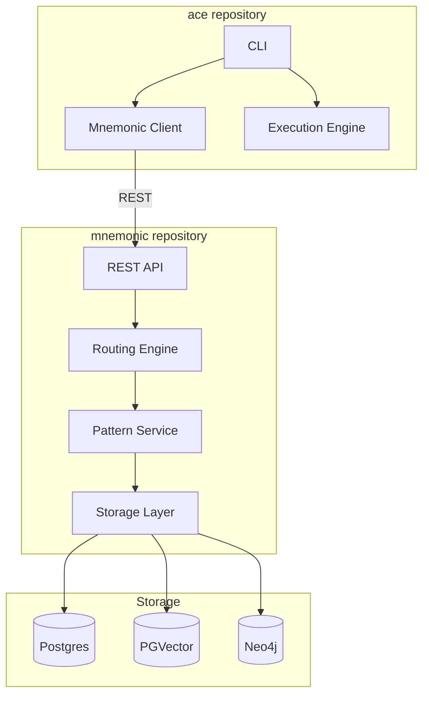
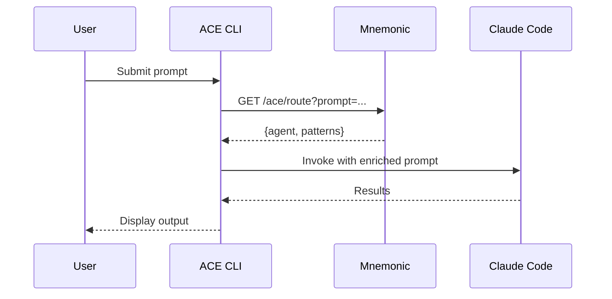

# ACE Project Structure

## Overview

ACE consists of two separate repositories:

1. **mnemonic** - Backend server providing routing and pattern retrieval via REST API
2. **ace** - CLI client that orchestrates routing decisions and Claude Code execution

Separate repositories allow independent release cycles - Mnemonic can be updated without rebuilding the CLI.

## Repository Layout

## mnemonic Repository

The Mnemonic server provides routing and pattern retrieval for ACE. For MVP, Mnemonic serves only ACE (not a general-purpose memory service).

See [Communication Patterns](04-communication-patterns.md#rest-endpoints) for REST endpoint details.

**Storage Stack:**

- **Postgres** - Relational data (agents, routing rules, metadata)
- **PGVector** - Vector embeddings for semantic search
- **Neo4j** - Knowledge graph for pattern relationships

## ace Repository

The ACE CLI orchestrates routing decisions and executes prompts via Claude Code.

**Responsibilities:**

- Connect to Mnemonic via REST
- Get routing decisions and patterns
- Invoke Claude Code (Phase 1) or Anthropic API (Phase 2)
- Handle local tool execution (Phase 2)

## Data Flow

## Benefits of Separate Repositories

| Benefit | Description |
|---------|-------------|
| **Independent releases** | Update Mnemonic without rebuilding CLI |
| **Clear boundaries** | Each repo has focused responsibility |
| **Flexible deployment** | Deploy Mnemonic centrally, distribute CLI independently |
| **Separate CI/CD** | Each repo has its own pipeline |
| **Team autonomy** | Different teams can own different repos |
