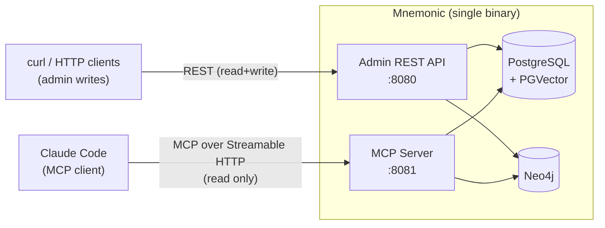
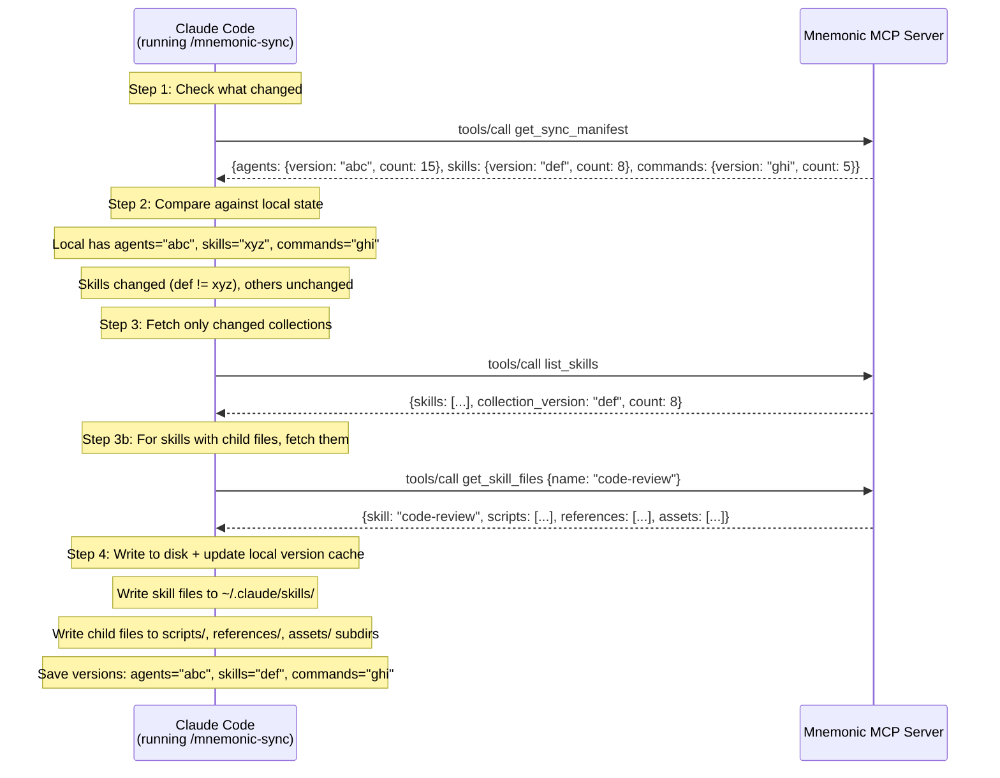

# Mnemonic Pivot API Specification (Revised)

**Date:** 2026-02-15
**Revision:** 5 (JSONB document model for entity tables; CRC64 change detection)
**Status:** Proposal
**Author:** API Architect
**References:**
- [Pivot Proposal](../plans/2026-02-14-mnemonic-pivot-knowledge-sync.md)
- [Architecture Review](../architecture/2026-02-15-pivot-review.md)
- [Go Architecture Plan](../plans/2026-02-15-go-architecture-plan.md)
- [Current OpenAPI Spec](../../api/openapi/mnemonic-v1.yaml)

---

## Table of Contents

- [1. API Surface](#1-api-surface)
- [2. Admin REST API](#2-admin-rest-api)
  - [2.1 Design Decisions](#21-design-decisions)
  - [2.2 Authentication](#22-authentication)
  - [2.3 Endpoint Summary](#23-endpoint-summary)
  - [2.4 Agents](#24-agents)
  - [2.5 Patterns](#25-patterns)
  - [2.6 Skills](#26-skills)
  - [2.6.1 Skill Files (Scripts, References, Assets)](#261-skill-files-scripts-references-assets)
  - [2.7 Commands](#27-commands)
  - [2.8 Operations](#28-operations)
  - [2.9 Removed Endpoints](#29-removed-endpoints)
- [3. MCP Tool Definitions](#3-mcp-tool-definitions)
  - [3.1 MCP over Streamable HTTP](#31-mcp-over-streamable-http)
  - [3.2 Tool Definitions](#32-tool-definitions)
  - [3.3 Tool: search_patterns](#33-tool-search_patterns)
  - [3.4 Tool: find_related_patterns](#34-tool-find_related_patterns)
  - [3.5 Tool: get_pattern](#35-tool-get_pattern)
  - [3.6 Tool: list_agents](#36-tool-list_agents)
  - [3.7 Tool: list_skills](#37-tool-list_skills)
  - [3.8 Tool: list_commands](#38-tool-list_commands)
  - [3.9 Tool: get_agent](#39-tool-get_agent)
  - [3.10 Tool: get_skill](#310-tool-get_skill)
  - [3.11 Tool: get_command](#311-tool-get_command)
  - [3.12 Tool: get_sync_manifest](#312-tool-get_sync_manifest)
  - [3.13 Tool: get_skill_files](#313-tool-get_skill_files)
- [4. Sync Protocol (MCP-based)](#4-sync-protocol-mcp-based)
  - [4.1 How Sync Works over MCP](#41-how-sync-works-over-mcp)
  - [4.2 Incremental Sync via Versioned Collections](#42-incremental-sync-via-versioned-collections)
  - [4.3 Deletion Handling](#43-deletion-handling)
  - [4.4 The mnemonic-sync Skill](#44-the-mnemonic-sync-skill)
- [5. Removed Endpoints](#5-removed-endpoints)
- [6. Request and Response Schemas](#6-request-and-response-schemas)
- [7. Error Handling](#7-error-handling)
- [8. Database Schema Notes](#8-database-schema-notes)
- [9. Open Questions and Deferred Decisions](#9-open-questions-and-deferred-decisions)

---

## 1. API Surface

Mnemonic is a single Go binary that exposes two protocols on separate ports:



| Aspect | Admin REST API | MCP Server |
|---|---|---|
| Port | `:8080` (configurable) | `:8081` (configurable) |
| Protocol | HTTP/1.1 REST | MCP over Streamable HTTP |
| Client | curl / any HTTP client | Claude Code (native MCP client) |
| Access | Read + Write | Read only |
| Purpose | Manage patterns, agents, skills, commands | Knowledge retrieval, semantic search, tooling sync |
| Auth (MVP) | API key | None (localhost only) |
| Auth (post-MVP) | OPA via Envoy | OPA via Envoy |

**Why two protocols on one server?**

Claude Code does not call REST endpoints. It connects to MCP servers natively. The MCP protocol gives Claude Code a tool-calling interface -- it discovers available tools, sends tool calls with typed parameters, and receives structured responses. This is a different interaction model from REST: there are no HTTP methods, no URL paths, no status codes. Tools are RPC-like calls with JSON Schema parameters and JSON responses.

For admin operations (creating agents, updating patterns, loading data), the owner uses `curl` or any HTTP client against the REST API. This is the natural fit: CRUD operations map to HTTP methods, and standard tooling works out of the box.

**No v2 versioning needed.** The previous specification designed a v1/v2 transition for agents because the read side and write side shared the same REST API. Now they are separate protocols. The REST API is consumed directly via HTTP clients for MVP, so backward compatibility is not a concern. The MCP side is a new protocol entirely.

---

## 2. Admin REST API

### 2.1 Design Decisions

**URL versioning prefix.** The REST API uses `/v1/api/` as the path prefix for all endpoints. The version prefix allows for future API evolution without breaking existing clients.

The operations endpoints use `/ops/` as a namespace separator for operational tooling (Prometheus scraper, load balancer health checks) that may not be the same HTTP client.

**Flat agent schema.** The Go architect recommended keeping the flat structure rather than nesting fields into a `definition` object. The admin API follows this recommendation. The mapping to Claude Code's agent format is handled by the sync layer (MCP tools), not the storage layer.

**`pattern_agent_associations` retained.** The Go architect's plan proposed dropping this table (migration 009). The owner's updated direction requires it for agent-scoped pattern filtering. The migration plan needs to be revised: skip migration 009, keep the association table, and keep the corresponding repository methods.

**Version prefix included.** The path structure uses `/v1/api/` prefix consistently across all endpoints to support future API evolution.

### 2.2 Authentication

**MVP:** API key passed in `Authorization: Bearer <key>` header. The server validates against a configured key (environment variable). A single shared key suffices for a single-user MVP.

**Post-MVP:** Envoy proxy handles authentication. OPA evaluates authorization policies. The server receives pre-validated identity in headers (`X-User-ID`, `X-Team-ID`, `X-User-Roles`). Admin role required for write operations.

### 2.3 Endpoint Summary

```
Agents:
  GET    /v1/api/agents              List agents
  POST   /v1/api/agents              Create agent
  GET    /v1/api/agents/{name}       Get agent
  PUT    /v1/api/agents/{name}       Update agent
  DELETE /v1/api/agents/{name}       Delete agent

Patterns:
  GET    /v1/api/patterns            List patterns (paginated, filterable)
  POST   /v1/api/patterns            Create pattern
  GET    /v1/api/patterns/{id}       Get pattern with graph context
  PUT    /v1/api/patterns/{id}       Update pattern
  DELETE /v1/api/patterns/{id}       Delete pattern
  GET    /v1/api/patterns/search     Semantic similarity search

Pattern-Agent Associations:
  PUT    /v1/api/patterns/{id}/agents                Set agent associations
  GET    /v1/api/patterns/{id}/agents                Get agent associations

Skills:
  GET    /v1/api/skills              List skills
  POST   /v1/api/skills              Create skill
  GET    /v1/api/skills/{name}       Get skill
  PUT    /v1/api/skills/{name}       Update skill
  DELETE /v1/api/skills/{name}       Delete skill

Skill Scripts:
  GET    /v1/api/skills/{name}/scripts              List scripts
  POST   /v1/api/skills/{name}/scripts              Upload script
  GET    /v1/api/skills/{name}/scripts/{filename}   Get script
  PUT    /v1/api/skills/{name}/scripts/{filename}   Replace script
  DELETE /v1/api/skills/{name}/scripts/{filename}    Delete script

Skill References:
  GET    /v1/api/skills/{name}/references              List references
  POST   /v1/api/skills/{name}/references              Upload reference
  GET    /v1/api/skills/{name}/references/{filename}   Get reference
  PUT    /v1/api/skills/{name}/references/{filename}   Replace reference
  DELETE /v1/api/skills/{name}/references/{filename}    Delete reference

Skill Assets:
  GET    /v1/api/skills/{name}/assets              List assets
  POST   /v1/api/skills/{name}/assets              Upload asset
  GET    /v1/api/skills/{name}/assets/{filename}   Get asset
  PUT    /v1/api/skills/{name}/assets/{filename}   Replace asset
  DELETE /v1/api/skills/{name}/assets/{filename}    Delete asset

Commands:
  GET    /v1/api/commands            List commands
  POST   /v1/api/commands            Create command
  GET    /v1/api/commands/{name}     Get command
  PUT    /v1/api/commands/{name}     Update command
  DELETE /v1/api/commands/{name}     Delete command

Operations:
  GET    /ops/health              Health check
  GET    /ops/version             Version info
  GET    /ops/metrics             Prometheus metrics
```

### Removed (return 410 Gone):

```
  POST   /v1/api/route
  GET    /v1/api/routing-rules
  POST   /v1/api/routing-rules
  GET    /v1/api/routing-rules/{id}
  PUT    /v1/api/routing-rules/{id}
  DELETE /v1/api/routing-rules/{id}
```

---

### 2.4 Agents

#### `GET /v1/api/agents` -- List agents

Returns all agent definitions. The default page size is 100 since the collection is small (tens of agents).

**Query parameters:**

| Parameter | Type | Default | Description |
|---|---|---|---|
| `limit` | integer | 100 | Maximum items per page (1-200) |
| `cursor` | string | null | Pagination cursor from a previous response |

**Response: 200 OK**

```json
{
  "data": [
    {
      "name": "go-software-engineer",
      "description": "Implements Go code: functions, packages, tests",
      "system_prompt": "You are an expert Go engineer...",
      "model": "sonnet",
      "allowed_tools": ["Read", "Write", "Edit", "Bash", "Glob", "Grep"],
      "version": "1.2.0",
      "created_at": "2026-01-15T10:30:00Z",
      "updated_at": "2026-02-10T14:00:00Z"
    }
  ],
  "pagination": {
    "limit": 100,
    "cursor": null,
    "next_cursor": null,
    "has_more": false
  }
}
```

---

#### `GET /v1/api/agents/{name}` -- Get agent

**Path parameters:**

| Parameter | Type | Constraints | Description |
|---|---|---|---|
| `name` | string | `^[a-z][a-z0-9-]*$`, max 64 chars | Agent identifier |

**Response: 200 OK**

```json
{
  "name": "go-software-engineer",
  "description": "Implements Go code: functions, packages, tests",
  "system_prompt": "You are an expert Go engineer...",
  "model": "sonnet",
  "allowed_tools": ["Read", "Write", "Edit", "Bash", "Glob", "Grep"],
  "version": "1.2.0",
  "created_at": "2026-01-15T10:30:00Z",
  "updated_at": "2026-02-10T14:00:00Z"
}
```

**Response: 404 Not Found**

```json
{
  "type": "https://mnemonic.example.com/problems/not-found",
  "title": "Not Found",
  "status": 404,
  "detail": "Agent with name 'unknown-agent' not found",
  "instance": "/v1/api/agents/unknown-agent",
  "traceId": "550e8400-e29b-41d4-a716-446655440000"
}
```

---

#### `POST /v1/api/agents` -- Create agent

**Request body:**

```json
{
  "name": "rust-software-engineer",
  "description": "Implements Rust code: crates, modules, tests",
  "system_prompt": "You are an expert Rust engineer...",
  "model": "sonnet",
  "allowed_tools": ["Read", "Write", "Edit", "Bash"],
  "version": "1.0.0"
}
```

**Field constraints:**

| Field | Type | Required | Constraints |
|---|---|---|---|
| `name` | string | yes | `^[a-z][a-z0-9-]*$`, 1-64 chars |
| `description` | string | yes | 1-500 chars |
| `system_prompt` | string | yes | 1-51200 chars (50KB) |
| `model` | string | yes | One of: `sonnet`, `opus`, `haiku` |
| `allowed_tools` | string[] | no | Max 50 items, defaults to `[]` |
| `version` | string | yes | 1-50 chars |

**Response: 201 Created**

```
Location: /v1/api/agents/rust-software-engineer
```

Returns the created agent object.

**Error responses:** 400 (validation), 401, 403, 409 (duplicate name), 500.

---

#### `PUT /v1/api/agents/{name}` -- Update agent

Full replacement. The `name` in the body must match the path parameter (or be omitted).

**Request body:** Same shape as POST.

**Response: 200 OK** with the updated agent.

**Error responses:** 400, 401, 403, 404, 500.

---

#### `DELETE /v1/api/agents/{name}` -- Delete agent

**Response: 204 No Content**

**Side effects:** Deletes associated `pattern_agent_associations` rows (CASCADE). Agents referenced by associations can still be deleted because the FK uses `ON DELETE CASCADE`.

**Error responses:** 401, 403, 404, 500.

---

### 2.5 Patterns

#### `GET /v1/api/patterns` -- List patterns

Returns paginated pattern summaries (without content). Supports filtering by tags and full-text search on name and description.

**Query parameters:**

| Parameter | Type | Default | Description |
|---|---|---|---|
| `limit` | integer | 20 | Maximum items per page (1-100) |
| `cursor` | string | null | Pagination cursor |
| `tags` | string | null | Comma-separated tags to filter by |
| `search` | string | null | Full-text search on name and description |

**Response: 200 OK**

```json
{
  "data": [
    {
      "id": "550e8400-e29b-41d4-a716-446655440001",
      "name": "go-error-handling",
      "description": "Best practices for error handling in Go",
      "tags": ["go", "errors", "best-practices"],
      "enrichment_status": "enriched",
      "created_at": "2026-01-10T08:00:00Z",
      "updated_at": "2026-01-10T08:00:00Z"
    }
  ],
  "pagination": {
    "limit": 20,
    "cursor": null,
    "next_cursor": "eyJpZCI6IjU1MGU4NDAw...",
    "has_more": true
  }
}
```

Note: the list endpoint returns summaries (no `content` field) because patterns can be large. Use `GET /api/patterns/{id}` to retrieve full content.

---

#### `GET /v1/api/patterns/search` -- Semantic search

Vector similarity search using PGVector embeddings. Distinct from the list endpoint: this returns ranked results with content and similarity scores.

**Query parameters:**

| Parameter | Type | Default | Constraints | Description |
|---|---|---|---|---|
| `q` | string | *(required)* | 1-1000 chars | Natural language query |
| `limit` | integer | 10 | 1-50 | Maximum results |
| `threshold` | number | 0.7 | 0.0-1.0 | Minimum similarity score |
| `tags` | string | null | Comma-separated | Filter by tags |
| `agent` | string | null | Agent name | Filter by agent association |

**Response: 200 OK**

```json
{
  "results": [
    {
      "id": "550e8400-e29b-41d4-a716-446655440001",
      "name": "go-error-handling",
      "description": "Best practices for error handling in Go",
      "content": "# Go Error Handling Pattern\n\n## Overview\n\nGo uses explicit error handling...",
      "tags": ["go", "errors", "best-practices"],
      "similarity": 0.92,
      "agent_associations": [
        {"agent_name": "go-software-engineer", "relevance": 0.95}
      ]
    }
  ],
  "metadata": {
    "query": "error handling in Go",
    "total_candidates": 47,
    "search_duration_ms": 23
  }
}
```

Only patterns with `enrichment_status: 'enriched'` appear in search results. Patterns that are pending or failed enrichment lack embeddings.

**Error responses:** 400 (missing `q`), 401, 500, 503 (PGVector unavailable).

---

#### `GET /v1/api/patterns/{id}` -- Get pattern

Returns a single pattern with full content and graph context from Neo4j.

**Path parameters:**

| Parameter | Type | Description |
|---|---|---|
| `id` | UUID | Pattern identifier |

**Response: 200 OK**

```json
{
  "id": "550e8400-e29b-41d4-a716-446655440001",
  "name": "go-error-handling",
  "description": "Best practices for error handling in Go",
  "content": "# Go Error Handling Pattern\n\n...",
  "tags": ["go", "errors", "best-practices"],
  "agent_associations": [
    {"agent_name": "go-software-engineer", "relevance": 0.95}
  ],
  "enrichment_status": "enriched",
  "enrichment_error": null,
  "enriched_at": "2026-01-10T08:05:00Z",
  "graph": {
    "related_patterns": [
      {
        "id": "550e8400-e29b-41d4-a716-446655440002",
        "name": "go-custom-error-types",
        "relationship": "RELATED_TO",
        "strength": 0.88
      }
    ],
    "concepts": [
      {
        "name": "error-wrapping",
        "description": "Wrapping errors with context using fmt.Errorf and %w"
      },
      {
        "name": "sentinel-errors",
        "description": "Package-level error variables for comparison"
      }
    ]
  },
  "created_at": "2026-01-10T08:00:00Z",
  "updated_at": "2026-01-10T08:00:00Z"
}
```

The `graph` field contains related patterns and extracted concepts from Neo4j. If enrichment has not yet run for this pattern (status is `pending`), the `graph` field is `null`.

---

#### `POST /v1/api/patterns` -- Create pattern

**Request body:**

```json
{
  "name": "go-error-handling",
  "description": "Best practices for error handling in Go",
  "content": "# Go Error Handling Pattern\n\n...",
  "tags": ["go", "errors", "best-practices"],
  "agent_associations": [
    {"agent_name": "go-software-engineer", "relevance": 0.95}
  ]
}
```

**Field constraints:**

| Field | Type | Required | Constraints |
|---|---|---|---|
| `name` | string | yes | `^[a-z][a-z0-9-]*$`, 1-255 chars |
| `description` | string | no | Max 500 chars |
| `content` | string | yes | 1-10240 chars (10KB) |
| `tags` | string[] | no | Max 20 items |
| `agent_associations` | array | no | See below |
| `agent_associations[].agent_name` | string | yes (if associations provided) | Must reference an existing agent |
| `agent_associations[].relevance` | number | no | 0.0-1.0, default 1.0 |

**Response: 202 Accepted** (enrichment is async)

```
Location: /v1/api/patterns/550e8400-e29b-41d4-a716-446655440001
```

Returns the created pattern with `enrichment_status: "pending"`.

---

#### `PUT /v1/api/patterns/{id}` -- Update pattern

Full replacement. Re-triggers enrichment if content changes.

**Response: 200 OK** with the updated pattern.

---

#### `DELETE /v1/api/patterns/{id}` -- Delete pattern

**Response: 204 No Content**

---

#### Pattern-Agent Associations

##### `PUT /v1/api/patterns/{id}/agents` -- Set agent associations

Replaces all agent associations for a pattern.

**Request body:**

```json
{
  "associations": [
    {"agent_name": "go-software-engineer", "relevance": 0.95},
    {"agent_name": "go-software-architect", "relevance": 0.80}
  ]
}
```

**Response: 200 OK** returns the updated associations.

##### `GET /v1/api/patterns/{id}/agents` -- Get agent associations

**Response: 200 OK**

```json
{
  "associations": [
    {"agent_name": "go-software-engineer", "relevance": 0.95},
    {"agent_name": "go-software-architect", "relevance": 0.80}
  ]
}
```

---

### 2.6 Skills

Skills now align with the [Agent Skills specification](https://agentskills.io/specification). A skill is a directory containing a required `SKILL.md` file and optional child directories for scripts, references, and assets.

The `name` field is tightened to 64 characters maximum, and `description` is now required (max 1024 characters). New optional fields from the spec: `license`, `compatibility`, `metadata`, and `allowed_tools`.

The `Skill` response object now includes a `files` summary with counts of scripts, references, and assets. See section 2.6.1 for the child resource endpoints.

#### `GET /v1/api/skills` -- List skills

Returns all skills with full content. Like agents, the sync use case requires full content to write to disk. The response now includes child resource counts in the `files` field.

**Query parameters:**

| Parameter | Type | Default | Description |
|---|---|---|---|
| `limit` | integer | 100 | Maximum items per page (1-200) |
| `cursor` | string | null | Pagination cursor |
| `tags` | string | null | Comma-separated tags to filter by |

**Response: 200 OK**

```json
{
  "data": [
    {
      "name": "mnemonic-sync",
      "description": "Synchronize agents, skills, and commands from Mnemonic",
      "content": "---\nname: mnemonic-sync\ndescription: Synchronize...\n---\n\nYou are synchronizing...",
      "tags": ["sync", "infrastructure"],
      "license": "MIT",
      "compatibility": null,
      "metadata": null,
      "allowed_tools": [],
      "version": "1.0.0",
      "files": {
        "scripts_count": 1,
        "references_count": 0,
        "assets_count": 0
      },
      "created_at": "2026-02-01T10:00:00Z",
      "updated_at": "2026-02-10T14:00:00Z"
    }
  ],
  "pagination": {
    "limit": 100,
    "cursor": null,
    "next_cursor": null,
    "has_more": false
  }
}
```

---

#### `GET /v1/api/skills/{name}` -- Get skill

**Path parameters:**

| Parameter | Type | Constraints |
|---|---|---|
| `name` | string | `^[a-z]([a-z0-9](-[a-z0-9])*)*$`, max 64 chars |

**Response: 200 OK**

```json
{
  "name": "mnemonic-sync",
  "description": "Synchronize agents, skills, and commands from Mnemonic",
  "content": "---\nname: mnemonic-sync\n...",
  "tags": ["sync", "infrastructure"],
  "license": "MIT",
  "compatibility": null,
  "metadata": null,
  "allowed_tools": [],
  "version": "1.0.0",
  "files": {
    "scripts_count": 1,
    "references_count": 0,
    "assets_count": 0
  },
  "created_at": "2026-02-01T10:00:00Z",
  "updated_at": "2026-02-10T14:00:00Z"
}
```

---

#### `POST /v1/api/skills` -- Create skill

**Field constraints:**

| Field | Type | Required | Constraints |
|---|---|---|---|
| `name` | string | yes | `^[a-z]([a-z0-9](-[a-z0-9])*)*$`, 1-64 chars |
| `description` | string | yes | 1-1024 chars |
| `content` | string | yes | 1-524288 chars (512KB) |
| `tags` | string[] | no | Max 20 items |
| `license` | string | no | Max 255 chars |
| `compatibility` | string | no | Max 500 chars |
| `metadata` | object | no | String keys and values |
| `allowed_tools` | string[] | no | Max 50 items |
| `version` | string | yes | 1-50 chars |

**Response: 201 Created**

```
Location: /v1/api/skills/code-review
```

---

#### `PUT /v1/api/skills/{name}` -- Update skill

Full replacement. `name` in body must match path parameter. `description` is now required in the update body.

**Response: 200 OK**

---

#### `DELETE /v1/api/skills/{name}` -- Delete skill

Deleting a skill also deletes all child files (scripts, references, assets) via `ON DELETE CASCADE`.

**Response: 204 No Content**

---

### 2.6.1 Skill Files (Scripts, References, Assets)

Each skill can contain three types of child files, matching the Agent Skills directory structure:

| Type | Directory | Purpose | Max Size | Max Count |
|---|---|---|---|---|
| Scripts | `scripts/` | Executable code (Python, Bash, JS) | 1 MB | 20 |
| References | `references/` | Additional documentation files | 1 MB | 50 |
| Assets | `assets/` | Static resources (templates, images, data) | 5 MB | 50 |

All three types share the same endpoint pattern and schema. The only differences are the URL path segment, size limit, and count limit.

#### File schema

Each file has these fields:

| Field | Type | Required on Create | Description |
|---|---|---|---|
| `filename` | string | yes | `^[a-zA-Z0-9][a-zA-Z0-9._-]*$`, max 255 chars |
| `content_type` | string | yes | MIME type (max 128 chars) |
| `content` | string | yes | File content (text or base64-encoded binary) |
| `encoding` | string | no | `utf-8` (default) or `base64` for binary files |
| `size` | integer | no (read-only) | File size in bytes |
| `created_at` | datetime | no (read-only) | Creation timestamp |
| `updated_at` | datetime | no (read-only) | Last update timestamp |

#### List files

`GET /v1/api/skills/{name}/scripts` (or `/references` or `/assets`)

Returns file metadata without content. Fetch individual files to retrieve content.

**Response: 200 OK**

```json
{
  "data": [
    {
      "filename": "extract.py",
      "content_type": "text/x-python",
      "size": 2048,
      "created_at": "2026-02-15T10:00:00Z",
      "updated_at": "2026-02-15T10:00:00Z"
    }
  ]
}
```

#### Upload file

`POST /v1/api/skills/{name}/scripts` (or `/references` or `/assets`)

**Request body:**

```json
{
  "filename": "extract.py",
  "content_type": "text/x-python",
  "content": "#!/usr/bin/env python3\nimport sys\n\ndef extract():\n    pass\n",
  "encoding": "utf-8"
}
```

**Response: 201 Created**

```
Location: /v1/api/skills/my-skill/scripts/extract.py
```

**Error responses:** 400 (validation), 401, 404 (skill not found), 409 (duplicate filename), 413 (file too large), 422 (count limit exceeded), 500.

#### Get file

`GET /v1/api/skills/{name}/scripts/{filename}`

Returns the file with content included.

**Response: 200 OK**

```json
{
  "filename": "extract.py",
  "content_type": "text/x-python",
  "content": "#!/usr/bin/env python3\nimport sys\n\ndef extract():\n    pass\n",
  "encoding": "utf-8",
  "size": 54,
  "created_at": "2026-02-15T10:00:00Z",
  "updated_at": "2026-02-15T10:00:00Z"
}
```

#### Replace file

`PUT /v1/api/skills/{name}/scripts/{filename}`

Full replacement of file content.

**Request body:**

```json
{
  "content_type": "text/x-python",
  "content": "#!/usr/bin/env python3\n\ndef extract(data):\n    return data\n",
  "encoding": "utf-8"
}
```

**Response: 200 OK** with the updated file.

#### Delete file

`DELETE /v1/api/skills/{name}/scripts/{filename}`

**Response: 204 No Content**

---

### 2.7 Commands

Commands follow the same pattern as skills with a smaller content limit.

#### `GET /v1/api/commands` -- List commands

Same structure as skills list.

#### `GET /v1/api/commands/{name}` -- Get command

Same structure as skill get.

#### `POST /v1/api/commands` -- Create command

**Field constraints:**

| Field | Type | Required | Constraints |
|---|---|---|---|
| `name` | string | yes | `^[a-z][a-z0-9-]*$`, 1-255 chars |
| `description` | string | no | Max 500 chars |
| `content` | string | yes | 1-51200 chars (50KB) |
| `tags` | string[] | no | Max 20 items |
| `version` | string | yes | 1-50 chars |

**Response: 201 Created**

#### `PUT /v1/api/commands/{name}` -- Update command

Full replacement. **Response: 200 OK**

#### `DELETE /v1/api/commands/{name}` -- Delete command

**Response: 204 No Content**

---

### 2.8 Operations

#### `GET /ops/health`

No authentication required. Returns component health status.

**Response: 200 OK**

```json
{
  "status": "healthy",
  "components": {
    "postgres": {"status": "healthy", "latency_ms": 2},
    "pgvector": {"status": "healthy"},
    "neo4j": {"status": "healthy", "latency_ms": 5}
  }
}
```

**Response: 503 Service Unavailable** if any component is unhealthy. All three components (PostgreSQL, PGVector, Neo4j) are required.

---

#### `GET /ops/version`

No authentication required.

**Response: 200 OK**

```json
{
  "version": "0.15.0",
  "commit": "a1b2c3d",
  "build_time": "2026-02-15T10:00:00Z",
  "go_version": "go1.23.0"
}
```

---

#### `GET /ops/metrics`

Prometheus metrics endpoint. No authentication required. Returns `text/plain` in Prometheus exposition format.

---

### 2.9 Removed Endpoints

The following endpoints return `410 Gone` with an RFC 7807 error body. These are registered under the old `/v1/api/` prefix to catch requests from any old client code.

| Endpoint | Former Purpose |
|---|---|
| `POST /v1/api/route` | Route prompt to agent |
| `GET /v1/api/routing-rules` | List routing rules |
| `POST /v1/api/routing-rules` | Create routing rule |
| `GET /v1/api/routing-rules/{id}` | Get routing rule |
| `PUT /v1/api/routing-rules/{id}` | Update routing rule |
| `DELETE /v1/api/routing-rules/{id}` | Delete routing rule |

**Response body:**

```json
{
  "type": "https://mnemonic.example.com/problems/gone",
  "title": "Gone",
  "status": 410,
  "detail": "The routing engine has been removed. See the pivot documentation for details.",
  "instance": "/v1/api/route",
  "traceId": "550e8400-e29b-41d4-a716-446655440000"
}
```

---

## 3. MCP Tool Definitions

### 3.1 MCP over Streamable HTTP

**What is MCP?** The Model Context Protocol (MCP) is a standard for connecting AI assistants to external tools and data. Claude Code supports MCP natively: you configure an MCP server in your Claude Code settings, and Claude Code discovers and calls the server's tools during conversation.

**Transport: Streamable HTTP.** MCP over Streamable HTTP uses a single HTTP endpoint that accepts JSON-RPC 2.0 messages. The client sends requests via `POST` to the server's MCP endpoint. The server responds with either a direct JSON-RPC response or a stream of Server-Sent Events (SSE) for long-running operations. This replaces the older stdio and SSE-only transports.

**How Claude Code connects:**

The user adds a server entry to their Claude Code MCP configuration (typically `~/.claude/mcp_servers.json` or the project-level `.mcp.json`):

```json
{
  "mcpServers": {
    "mnemonic": {
      "type": "streamable-http",
      "url": "http://localhost:8081/mcp"
    }
  }
}
```

Claude Code then:
1. Sends `initialize` to discover server capabilities
2. Sends `tools/list` to discover available tools
3. During conversation, sends `tools/call` with tool name and arguments
4. Receives tool results as structured content

**Wire format.** Every MCP message is a JSON-RPC 2.0 request/response pair. The transport is HTTP POST to a single endpoint (`/mcp`). Here is how a tool call looks on the wire:

**Request (Claude Code -> Mnemonic):**

```http
POST /mcp HTTP/1.1
Host: localhost:8081
Content-Type: application/json

{
  "jsonrpc": "2.0",
  "id": 1,
  "method": "tools/call",
  "params": {
    "name": "search_patterns",
    "arguments": {
      "query": "error handling in Go",
      "limit": 5
    }
  }
}
```

**Response (Mnemonic -> Claude Code):**

```http
HTTP/1.1 200 OK
Content-Type: application/json

{
  "jsonrpc": "2.0",
  "id": 1,
  "result": {
    "content": [
      {
        "type": "text",
        "text": "Found 2 patterns matching 'error handling in Go':\n\n1. **go-error-handling** (92% match)\n..."
      }
    ]
  }
}
```

The MCP SDK handles this wire format. The Go implementation uses the `mcp-go` library (or equivalent) to register tools with typed input schemas and handler functions. The developer writes handler functions; the SDK handles JSON-RPC framing, tool discovery, and session management.

---

### 3.2 Tool Definitions

Each tool is registered with the MCP server during initialization. The registration includes:
- **name**: Tool identifier (snake_case by convention)
- **description**: What the tool does (shown to Claude Code for tool selection)
- **inputSchema**: JSON Schema defining the parameters

The tools below are all read-only. The MCP server does not expose any write operations.

**Tool summary:**

| Tool | Purpose | Parameters |
|---|---|---|
| `search_patterns` | Semantic search for patterns | query, limit, threshold, tags, agent |
| `find_related_patterns` | Find patterns related via graph traversal | pattern_id, limit |
| `get_pattern` | Get pattern by ID with graph context | id |
| `list_agents` | List all agents (for sync) | -- |
| `list_skills` | List all skills (for sync) | -- |
| `list_commands` | List all commands (for sync) | -- |
| `get_agent` | Get agent by name | name |
| `get_skill` | Get skill by name | name |
| `get_command` | Get command by name | name |
| `get_sync_manifest` | Get collection versions for incremental sync | -- |
| `get_skill_files` | Get all files for a skill (for sync) | name, type |

---

### 3.3 Tool: `search_patterns`

Semantic similarity search across the pattern knowledge base. This is the primary tool for the `/recall` skill.

**Registration:**

```json
{
  "name": "search_patterns",
  "description": "Search the team's knowledge base for patterns matching a natural language query. Returns ranked results with content and similarity scores. Use this to find relevant engineering patterns, conventions, and best practices.",
  "inputSchema": {
    "type": "object",
    "properties": {
      "query": {
        "type": "string",
        "description": "Natural language search query (e.g., 'error handling in Go', 'database migration patterns')",
        "minLength": 1,
        "maxLength": 1000
      },
      "limit": {
        "type": "integer",
        "description": "Maximum number of results to return",
        "default": 10,
        "minimum": 1,
        "maximum": 50
      },
      "threshold": {
        "type": "number",
        "description": "Minimum similarity score (0.0 to 1.0). Higher values return fewer but more relevant results.",
        "default": 0.7,
        "minimum": 0.0,
        "maximum": 1.0
      },
      "tags": {
        "type": "array",
        "items": {"type": "string"},
        "description": "Filter results to patterns with these tags (e.g., ['go', 'errors'])"
      },
      "agent": {
        "type": "string",
        "description": "Filter results to patterns associated with this agent (e.g., 'go-software-engineer')"
      }
    },
    "required": ["query"]
  }
}
```

**Example call:**

```json
{
  "jsonrpc": "2.0",
  "id": 42,
  "method": "tools/call",
  "params": {
    "name": "search_patterns",
    "arguments": {
      "query": "error handling in Go",
      "limit": 5,
      "agent": "go-software-engineer"
    }
  }
}
```

**Example response:**

```json
{
  "jsonrpc": "2.0",
  "id": 42,
  "result": {
    "content": [
      {
        "type": "text",
        "text": "Found 2 patterns matching 'error handling in Go' (filtered by agent: go-software-engineer):\n\n---\n\n## go-error-handling (92% match)\n\n**Tags:** go, errors, best-practices\n\n# Go Error Handling Pattern\n\n## Overview\n\nGo uses explicit error handling with the error interface...\n\n---\n\n## go-custom-error-types (85% match)\n\n**Tags:** go, errors, domain-driven\n\n# Custom Error Types\n\nFor domain errors, define types that implement the error interface..."
      }
    ]
  }
}
```

**Design note:** MCP tool responses use a `content` array with `type: "text"` items. The response is formatted as markdown for readability in Claude Code's conversation context. The structured data (similarity scores, metadata) is embedded in the text rather than returned as separate JSON objects, because Claude Code consumes tool results as text content.

**When PGVector is unavailable:** Returns an error result:

```json
{
  "jsonrpc": "2.0",
  "id": 42,
  "result": {
    "content": [
      {
        "type": "text",
        "text": "Search is currently unavailable. The vector database is not reachable."
      }
    ],
    "isError": true
  }
}
```

---

### 3.4 Tool: `find_related_patterns`

Find patterns related to a given pattern through shared concepts and graph traversal.

**Registration:**

```json
{
  "name": "find_related_patterns",
  "description": "Find patterns related to a given pattern through shared concepts. Returns patterns connected via the knowledge graph.",
  "inputSchema": {
    "type": "object",
    "properties": {
      "pattern_id": {
        "type": "string",
        "description": "UUID of the source pattern",
        "format": "uuid"
      },
      "limit": {
        "type": "integer",
        "description": "Maximum number of related patterns to return",
        "default": 5,
        "minimum": 1,
        "maximum": 20
      }
    },
    "required": ["pattern_id"]
  }
}
```

**Example call:**

```json
{
  "jsonrpc": "2.0",
  "id": 50,
  "method": "tools/call",
  "params": {
    "name": "find_related_patterns",
    "arguments": {
      "pattern_id": "550e8400-e29b-41d4-a716-446655440001",
      "limit": 5
    }
  }
}
```

**Example response:**

```json
{
  "jsonrpc": "2.0",
  "id": 50,
  "result": {
    "content": [
      {
        "type": "text",
        "text": "Found 3 patterns related to 'go-error-handling' via shared concepts:\n\n---\n\n## go-custom-error-types (strength: 0.88)\n\n**Shared concepts:** error-wrapping, sentinel-errors\n\n# Custom Error Types\n\nFor domain errors, define types that implement the error interface...\n\n---\n\n## go-context-errors (strength: 0.75)\n\n**Shared concepts:** error-wrapping\n\n# Context-Aware Errors\n\nUse context to add request-scoped information to errors..."
      }
    ]
  }
}
```

---

### 3.5 Tool: `get_pattern`

Retrieve a single pattern by ID with graph context from Neo4j.

**Registration:**

```json
{
  "name": "get_pattern",
  "description": "Get a specific pattern by its ID. Includes related patterns and concepts from the knowledge graph.",
  "inputSchema": {
    "type": "object",
    "properties": {
      "id": {
        "type": "string",
        "description": "Pattern UUID",
        "format": "uuid"
      }
    },
    "required": ["id"]
  }
}
```

**Example response:**

```json
{
  "jsonrpc": "2.0",
  "id": 43,
  "result": {
    "content": [
      {
        "type": "text",
        "text": "## go-error-handling\n\n**ID:** 550e8400-e29b-41d4-a716-446655440001\n**Tags:** go, errors, best-practices\n**Enrichment:** enriched (2026-01-10T08:05:00Z)\n\n# Go Error Handling Pattern\n\n## Overview\n\nGo uses explicit error handling...\n\n---\n\n### Related Patterns\n\n- **go-custom-error-types** (RELATED_TO, strength: 0.88)\n\n### Extracted Concepts\n\n- **error-wrapping**: Wrapping errors with context using fmt.Errorf and %w\n- **sentinel-errors**: Package-level error variables for comparison"
      }
    ]
  }
}
```

If the pattern has not yet been enriched (status is `pending`), the response includes the pattern content but omits the "Related Patterns" and "Extracted Concepts" sections.

---

### 3.6 Tool: `list_agents`

Returns all agent definitions. Used by the sync skill to fetch the full agent inventory.

**Registration:**

```json
{
  "name": "list_agents",
  "description": "List all agent definitions stored in Mnemonic. Returns the complete definition for each agent (name, description, system prompt, model, tools, version). Used for tooling synchronization.",
  "inputSchema": {
    "type": "object",
    "properties": {},
    "required": []
  }
}
```

No parameters. Returns the full collection.

**Example response:**

```json
{
  "jsonrpc": "2.0",
  "id": 44,
  "result": {
    "content": [
      {
        "type": "text",
        "text": "{\"agents\":[{\"name\":\"go-software-engineer\",\"description\":\"Implements Go code: functions, packages, tests\",\"system_prompt\":\"You are an expert Go engineer...\",\"model\":\"sonnet\",\"allowed_tools\":[\"Read\",\"Write\",\"Edit\",\"Bash\",\"Glob\",\"Grep\"],\"version\":\"1.2.0\",\"updated_at\":\"2026-02-10T14:00:00Z\"},{\"name\":\"solutions-architect\",\"description\":\"Provides high-level architecture recommendations\",\"system_prompt\":\"You are a solutions architect...\",\"model\":\"opus\",\"allowed_tools\":[\"Read\",\"Glob\",\"Grep\"],\"version\":\"1.0.0\",\"updated_at\":\"2026-02-01T10:00:00Z\"}],\"collection_version\":\"abc123def456\",\"count\":2}"
      }
    ]
  }
}
```

**Design note:** Sync tools return JSON as the text content (not formatted markdown). The sync skill parses this JSON programmatically to write files to disk. The `collection_version` field is a hash of the collection state, used for incremental sync (see Section 4.2).

---

### 3.7 Tool: `list_skills`

Returns all skill definitions including child resource counts. The `files` field on each skill reports how many scripts, references, and assets it contains.

**Registration:**

```json
{
  "name": "list_skills",
  "description": "List all skill definitions stored in Mnemonic. Returns the complete definition for each skill (name, description, content, tags, version) with child file counts. Used for tooling synchronization.",
  "inputSchema": {
    "type": "object",
    "properties": {},
    "required": []
  }
}
```

**Example response:**

```json
{
  "jsonrpc": "2.0",
  "id": 45,
  "result": {
    "content": [
      {
        "type": "text",
        "text": "{\"skills\":[{\"name\":\"mnemonic-sync\",\"description\":\"Synchronize agents, skills, and commands from Mnemonic\",\"content\":\"---\\nname: mnemonic-sync\\n...\",\"tags\":[\"sync\",\"infrastructure\"],\"version\":\"1.0.0\",\"files\":{\"scripts_count\":1,\"references_count\":0,\"assets_count\":0},\"updated_at\":\"2026-02-10T14:00:00Z\"}],\"collection_version\":\"def456ghi789\",\"count\":1}"
      }
    ]
  }
}
```

---

### 3.8 Tool: `list_commands`

Returns all command definitions. Same structure as `list_agents`.

**Registration:**

```json
{
  "name": "list_commands",
  "description": "List all command definitions stored in Mnemonic. Returns the complete definition for each command (name, description, content, tags, version). Used for tooling synchronization.",
  "inputSchema": {
    "type": "object",
    "properties": {},
    "required": []
  }
}
```

Response format follows the same pattern as `list_agents` and `list_skills`, with `commands`, `collection_version`, and `count` fields.

---

### 3.9 Tool: `get_agent`

Get a single agent by name.

**Registration:**

```json
{
  "name": "get_agent",
  "description": "Get an agent definition by name. Returns the complete definition including system prompt and allowed tools.",
  "inputSchema": {
    "type": "object",
    "properties": {
      "name": {
        "type": "string",
        "description": "Agent name (e.g., 'go-software-engineer')",
        "pattern": "^[a-z][a-z0-9-]*$"
      }
    },
    "required": ["name"]
  }
}
```

**Example response:**

```json
{
  "jsonrpc": "2.0",
  "id": 46,
  "result": {
    "content": [
      {
        "type": "text",
        "text": "{\"name\":\"go-software-engineer\",\"description\":\"Implements Go code: functions, packages, tests\",\"system_prompt\":\"You are an expert Go engineer...\",\"model\":\"sonnet\",\"allowed_tools\":[\"Read\",\"Write\",\"Edit\",\"Bash\",\"Glob\",\"Grep\"],\"version\":\"1.2.0\",\"created_at\":\"2026-01-15T10:30:00Z\",\"updated_at\":\"2026-02-10T14:00:00Z\"}"
      }
    ]
  }
}
```

**Not found:**

```json
{
  "jsonrpc": "2.0",
  "id": 46,
  "result": {
    "content": [
      {
        "type": "text",
        "text": "Agent 'unknown-agent' not found."
      }
    ],
    "isError": true
  }
}
```

---

### 3.10 Tool: `get_skill`

Get a single skill by name. Same pattern as `get_agent`.

**Registration:**

```json
{
  "name": "get_skill",
  "description": "Get a skill definition by name. Returns the complete skill content.",
  "inputSchema": {
    "type": "object",
    "properties": {
      "name": {
        "type": "string",
        "description": "Skill name (e.g., 'mnemonic-sync')",
        "pattern": "^[a-z][a-z0-9-]*$"
      }
    },
    "required": ["name"]
  }
}
```

---

### 3.11 Tool: `get_command`

Get a single command by name. Same pattern as `get_agent`.

**Registration:**

```json
{
  "name": "get_command",
  "description": "Get a command definition by name. Returns the complete command content.",
  "inputSchema": {
    "type": "object",
    "properties": {
      "name": {
        "type": "string",
        "description": "Command name (e.g., 'prime')",
        "pattern": "^[a-z][a-z0-9-]*$"
      }
    },
    "required": ["name"]
  }
}
```

---

### 3.12 Tool: `get_sync_manifest`

Returns version hashes for all collections. The sync skill uses this to determine which collections have changed before fetching full data.

**Registration:**

```json
{
  "name": "get_sync_manifest",
  "description": "Get the current version hash and item count for each collection (agents, skills, commands). Used to check if a sync is needed before fetching full data.",
  "inputSchema": {
    "type": "object",
    "properties": {},
    "required": []
  }
}
```

**Example response:**

```json
{
  "jsonrpc": "2.0",
  "id": 47,
  "result": {
    "content": [
      {
        "type": "text",
        "text": "{\"agents\":{\"collection_version\":\"abc123def456\",\"count\":15,\"latest_update\":\"2026-02-10T14:00:00Z\"},\"skills\":{\"collection_version\":\"def456ghi789\",\"count\":8,\"latest_update\":\"2026-02-08T12:00:00Z\"},\"commands\":{\"collection_version\":\"ghi789jkl012\",\"count\":5,\"latest_update\":\"2026-02-05T10:00:00Z\"}}"
      }
    ]
  }
}
```

---

### 3.13 Tool: `get_skill_files`

Retrieves all files (scripts, references, assets) for a skill, with content included. Designed for the sync use case: after `list_skills` reports that a skill has child files, the sync skill calls `get_skill_files` to fetch their content for writing to disk.

**Registration:**

```json
{
  "name": "get_skill_files",
  "description": "Get all files (scripts, references, assets) for a skill. Returns file content for sync. Use the type parameter to filter by file type.",
  "inputSchema": {
    "type": "object",
    "properties": {
      "name": {
        "type": "string",
        "description": "Skill name (e.g., 'mnemonic-sync')",
        "pattern": "^[a-z]([a-z0-9](-[a-z0-9])*)*$"
      },
      "type": {
        "type": "string",
        "description": "Filter by file type. Defaults to all.",
        "enum": ["scripts", "references", "assets", "all"],
        "default": "all"
      }
    },
    "required": ["name"]
  }
}
```

**Example call:**

```json
{
  "jsonrpc": "2.0",
  "id": 48,
  "method": "tools/call",
  "params": {
    "name": "get_skill_files",
    "arguments": {
      "name": "code-review",
      "type": "all"
    }
  }
}
```

**Example response:**

```json
{
  "jsonrpc": "2.0",
  "id": 48,
  "result": {
    "content": [
      {
        "type": "text",
        "text": "{\"skill\":\"code-review\",\"scripts\":[{\"filename\":\"lint.sh\",\"content_type\":\"text/x-shellscript\",\"content\":\"#!/bin/bash\\nset -euo pipefail\\n...\",\"encoding\":\"utf-8\",\"size\":512}],\"references\":[{\"filename\":\"style-guide.md\",\"content_type\":\"text/markdown\",\"content\":\"# Style Guide\\n\\n...\",\"encoding\":\"utf-8\",\"size\":2048}],\"assets\":[],\"total_files\":2}"
      }
    ]
  }
}
```

**Not found:**

```json
{
  "jsonrpc": "2.0",
  "id": 48,
  "result": {
    "content": [
      {
        "type": "text",
        "text": "Skill 'unknown-skill' not found."
      }
    ],
    "isError": true
  }
}
```

---

## 4. Sync Protocol (MCP-based)

### 4.1 How Sync Works over MCP

The previous specification used ETag/If-None-Match HTTP headers for change detection. That approach assumed REST clients. With MCP, there are no HTTP headers -- just tool calls and responses.

The sync protocol now works through tool calls:



### 4.2 Incremental Sync via Versioned Collections

**Collection version hash.** Each `list_*` tool response includes a `collection_version` field. This is a SHA-256 hash of the collection's state, computed from: `SHA-256(count || max(updated_at) || min(created_at))`, hex-encoded and truncated to 12 characters.

**Local version cache.** The sync skill maintains a version cache file at `~/.claude/.mnemonic-sync-state.json`:

```json
{
  "server_url": "http://localhost:8081/mcp",
  "last_sync": "2026-02-15T10:30:00Z",
  "versions": {
    "agents": "abc123def456",
    "skills": "def456ghi789",
    "commands": "ghi789jkl012"
  },
  "inventories": {
    "agents": ["go-software-engineer", "solutions-architect", "go-software-architect"],
    "skills": ["mnemonic-sync", "recall", "remember"],
    "commands": ["prime", "review"]
  }
}
```

**Sync algorithm:**

1. Call `get_sync_manifest` to get current collection versions
2. Compare each collection version against the local cache
3. For each changed collection:
   a. Call the corresponding `list_*` tool
   b. Parse the JSON response
   c. Write each item to disk (`~/.claude/agents/`, `~/.claude/skills/`, `~/.claude/commands/`)
   d. Update the local version cache and inventory
4. For unchanged collections: skip (no network call)

This minimizes data transfer. If only skills changed, only `get_sync_manifest` (lightweight) and `list_skills` (full payload) are called. Agents and commands are not fetched.

### 4.3 Deletion Handling

**Reconciliation-based deletion.** The sync skill compares the server's inventory against local files and deletes anything that is no longer on the server.

The `list_*` responses include all items in the collection. The sync skill:

1. Reads the list of names from the `list_*` response
2. Lists local files in the corresponding `~/.claude/` directory
3. Deletes any local file whose name is not in the server response
4. Records the new inventory in `~/.claude/.mnemonic-sync-state.json`

**Why not tombstones?** Tombstone records require schema changes and garbage collection. The sync skill already fetches the full collection (these are small: tens of items). Comparing server names against local files is simpler and works correctly even if the client missed several sync cycles.

**Safety:** The sync skill only deletes files that match the naming convention (`^[a-z][a-z0-9-]*\.md$`). Files that do not match (e.g., `README.md`, `.gitkeep`) are left untouched. The skill also logs every deletion for auditability.

### 4.4 The `mnemonic-sync` Skill

With MCP, the sync skill no longer invokes an external script. It calls MCP tools directly within the Claude Code conversation.

**Revised skill definition:**

```markdown
---
name: mnemonic-sync
description: Synchronize agents, skills, and commands from Mnemonic
---

You are synchronizing Claude Code configurations from the team's Mnemonic server.

## Steps

1. **Check for changes.** Call the `get_sync_manifest` MCP tool (from the mnemonic server).
   Read the local sync state from `~/.claude/.mnemonic-sync-state.json`.
   Compare collection versions. Report which collections have changed.

2. **Fetch changed collections.** For each collection where the version
   differs from the local cache, call the corresponding list tool:
   - `list_agents` for agents
   - `list_skills` for skills
   - `list_commands` for commands

3. **Write to disk.** For each item in a changed collection:
   - Agents: write to `~/.claude/agents/{name}.md`
   - Skills: write to `~/.claude/skills/{name}/instructions.md`
     (create the directory if it does not exist)
   - Commands: write to `~/.claude/commands/{name}.md`

3b. **Fetch and write child files.** For each skill where
   `files.scripts_count + files.references_count + files.assets_count > 0`,
   call `get_skill_files` with the skill name. Write the returned
   files to the skill directory:
   - Scripts: `~/.claude/skills/{name}/scripts/{filename}`
   - References: `~/.claude/skills/{name}/references/{filename}`
   - Assets: `~/.claude/skills/{name}/assets/{filename}`
   Create subdirectories as needed. For skills where the counts
   are all zero, skip the `get_skill_files` call.

4. **Handle deletions.** For each changed collection, compare the
   server inventory against local files. Delete any local file
   whose name is not in the server response. Only delete files
   matching the naming convention. Log every deletion.

5. **Update local state.** Write the new collection versions and
   inventories to `~/.claude/.mnemonic-sync-state.json`.

6. **Report results.** Tell the user:
   - How many items were created, updated, deleted, and unchanged
     for each collection
   - Which specific items changed (list names)
   - The timestamp of the sync

## First-time sync

If `~/.claude/.mnemonic-sync-state.json` does not exist, treat
all collections as changed and fetch everything. Create the state
file after the first successful sync.

## Error handling

If a tool call fails, report the error and continue with other
collections. A partial sync is better than no sync. Do not update
the version cache for a collection that failed to sync.
```

---

## 5. Removed Endpoints

The routing endpoints return `410 Gone` on the admin REST API side. The MCP side never had routing endpoints, so no removal is needed there.

See [Section 2.9](#29-removed-endpoints) for the full list and response format.

---

## 6. Request and Response Schemas

### Agent schema (admin REST)

```yaml
Agent:
  type: object
  required: [name, description, system_prompt, model, version, created_at, updated_at]
  properties:
    name:
      type: string
      pattern: ^[a-z][a-z0-9-]*$
      minLength: 1
      maxLength: 64
    description:
      type: string
      minLength: 1
      maxLength: 500
    system_prompt:
      type: string
      minLength: 1
      maxLength: 51200
    model:
      type: string
      enum: [sonnet, opus, haiku]
    allowed_tools:
      type: array
      maxItems: 50
      items:
        type: string
      default: []
    version:
      type: string
      minLength: 1
      maxLength: 50
    created_at:
      type: string
      format: date-time
      readOnly: true
    updated_at:
      type: string
      format: date-time
      readOnly: true

AgentCreate:
  type: object
  required: [name, description, system_prompt, model, version]
  properties:
    name:
      type: string
      pattern: ^[a-z][a-z0-9-]*$
      minLength: 1
      maxLength: 64
    description:
      type: string
      minLength: 1
      maxLength: 500
    system_prompt:
      type: string
      minLength: 1
      maxLength: 51200
    model:
      type: string
      enum: [sonnet, opus, haiku]
    allowed_tools:
      type: array
      maxItems: 50
      items:
        type: string
      default: []
    version:
      type: string
      minLength: 1
      maxLength: 50
```

### Pattern schema (admin REST)

```yaml
Pattern:
  type: object
  required: [id, name, content, enrichment_status, created_at, updated_at]
  properties:
    id:
      type: string
      format: uuid
      readOnly: true
    name:
      type: string
      pattern: ^[a-z][a-z0-9-]*$
      minLength: 1
      maxLength: 255
    description:
      type: [string, "null"]
      maxLength: 500
    content:
      type: string
      minLength: 1
      maxLength: 10240
    tags:
      type: array
      maxItems: 20
      items:
        type: string
      default: []
    agent_associations:
      type: array
      items:
        $ref: '#/components/schemas/AgentAssociation'
    enrichment_status:
      type: string
      enum: [pending, enriched, failed]
      readOnly: true
    enrichment_error:
      type: [string, "null"]
      readOnly: true
    enriched_at:
      type: [string, "null"]
      format: date-time
      readOnly: true
    graph:
      description: Related patterns and extracted concepts from Neo4j. Null if enrichment has not run.
      oneOf:
        - $ref: '#/components/schemas/GraphContext'
        - type: "null"
      readOnly: true
    created_at:
      type: string
      format: date-time
      readOnly: true
    updated_at:
      type: string
      format: date-time
      readOnly: true
```

### Skill schema

Aligned with the [Agent Skills specification](https://agentskills.io/specification). The `name` field is tightened to 64 chars with a stricter pattern, `description` is now required (max 1024 chars), and four new optional fields are added: `license`, `compatibility`, `metadata`, and `allowed_tools`.

```yaml
Skill:
  type: object
  required: [name, description, content, version, created_at, updated_at]
  properties:
    name:
      type: string
      pattern: ^[a-z]([a-z0-9](-[a-z0-9])*)*$
      minLength: 1
      maxLength: 64
    description:
      type: string
      minLength: 1
      maxLength: 1024
    content:
      type: string
      minLength: 1
      maxLength: 524288
    tags:
      type: array
      maxItems: 20
      items:
        type: string
      default: []
    license:
      type: [string, "null"]
      maxLength: 255
    compatibility:
      type: [string, "null"]
      maxLength: 500
    metadata:
      type: [object, "null"]
      additionalProperties:
        type: string
    allowed_tools:
      type: array
      maxItems: 50
      items:
        type: string
      default: []
    version:
      type: string
      minLength: 1
      maxLength: 50
    files:
      type: object
      readOnly: true
      properties:
        scripts_count:
          type: integer
        references_count:
          type: integer
        assets_count:
          type: integer
    created_at:
      type: string
      format: date-time
      readOnly: true
    updated_at:
      type: string
      format: date-time
      readOnly: true

SkillCreate:
  type: object
  required: [name, description, content, version]
  properties:
    name:
      type: string
      pattern: ^[a-z]([a-z0-9](-[a-z0-9])*)*$
      minLength: 1
      maxLength: 64
    description:
      type: string
      minLength: 1
      maxLength: 1024
    content:
      type: string
      minLength: 1
      maxLength: 524288
    tags:
      type: array
      maxItems: 20
      items:
        type: string
      default: []
    license:
      type: string
      maxLength: 255
    compatibility:
      type: string
      maxLength: 500
    metadata:
      type: object
      additionalProperties:
        type: string
    allowed_tools:
      type: array
      maxItems: 50
      items:
        type: string
      default: []
    version:
      type: string
      minLength: 1
      maxLength: 50
```

### Skill file schema

Shared across scripts, references, and assets. See section 2.6.1 for size and count limits per type.

```yaml
SkillFile:
  type: object
  required: [filename, content_type, size, created_at, updated_at]
  properties:
    filename:
      type: string
      pattern: ^[a-zA-Z0-9][a-zA-Z0-9._-]*$
      maxLength: 255
    content_type:
      type: string
      maxLength: 128
    content:
      type: string
      description: Text files as UTF-8, binary files as base64
    encoding:
      type: string
      enum: [utf-8, base64]
      default: utf-8
    size:
      type: integer
      readOnly: true
    created_at:
      type: string
      format: date-time
      readOnly: true
    updated_at:
      type: string
      format: date-time
      readOnly: true
```

### Command schema

```yaml
Command:
  type: object
  required: [name, content, version, created_at, updated_at]
  properties:
    name:
      type: string
      pattern: ^[a-z][a-z0-9-]*$
      minLength: 1
      maxLength: 255
    description:
      type: [string, "null"]
      maxLength: 500
    content:
      type: string
      minLength: 1
      maxLength: 51200
    tags:
      type: array
      maxItems: 20
      items:
        type: string
      default: []
    version:
      type: string
      minLength: 1
      maxLength: 50
    created_at:
      type: string
      format: date-time
      readOnly: true
    updated_at:
      type: string
      format: date-time
      readOnly: true

CommandCreate:
  type: object
  required: [name, content, version]
  properties:
    name:
      type: string
      pattern: ^[a-z][a-z0-9-]*$
      minLength: 1
      maxLength: 255
    description:
      type: string
      maxLength: 500
    content:
      type: string
      minLength: 1
      maxLength: 51200
    tags:
      type: array
      maxItems: 20
      items:
        type: string
      default: []
    version:
      type: string
      minLength: 1
      maxLength: 50
```

### Search result schema

```yaml
PatternSearchResult:
  type: object
  required: [id, name, content, similarity]
  properties:
    id:
      type: string
      format: uuid
    name:
      type: string
    description:
      type: [string, "null"]
    content:
      type: string
    tags:
      type: array
      items:
        type: string
    similarity:
      type: number
      format: double
      minimum: 0.0
      maximum: 1.0
    agent_associations:
      type: array
      items:
        $ref: '#/components/schemas/AgentAssociation'

AgentAssociation:
  type: object
  required: [agent_name]
  properties:
    agent_name:
      type: string
    relevance:
      type: number
      format: double
      minimum: 0.0
      maximum: 1.0
      default: 1.0

PatternSearchResponse:
  type: object
  required: [results, metadata]
  properties:
    results:
      type: array
      items:
        $ref: '#/components/schemas/PatternSearchResult'
    metadata:
      type: object
      required: [query, total_candidates, search_duration_ms]
      properties:
        query:
          type: string
        total_candidates:
          type: integer
        search_duration_ms:
          type: integer
```

### Graph context schema

```yaml
GraphContext:
  type: object
  properties:
    related_patterns:
      type: array
      items:
        type: object
        required: [id, name, relationship, strength]
        properties:
          id:
            type: string
            format: uuid
          name:
            type: string
          relationship:
            type: string
          strength:
            type: number
            format: double
            minimum: 0.0
            maximum: 1.0
    concepts:
      type: array
      items:
        type: object
        required: [name]
        properties:
          name:
            type: string
          description:
            type: string
```

### Sync status schema (MCP response payload)

```yaml
SyncStatus:
  type: object
  required: [agents, skills, commands]
  properties:
    agents:
      $ref: '#/components/schemas/CollectionStatus'
    skills:
      $ref: '#/components/schemas/CollectionStatus'
    commands:
      $ref: '#/components/schemas/CollectionStatus'

CollectionStatus:
  type: object
  required: [collection_version, count, latest_update]
  properties:
    collection_version:
      type: string
      description: SHA-256 hash of (count || max(updated_at) || min(created_at)), truncated to 12 hex chars
    count:
      type: integer
    latest_update:
      type: string
      format: date-time
```

---

## 7. Error Handling

### Admin REST API errors

All errors follow RFC 7807 (Problem Details for HTTP APIs) with `application/problem+json` content type. No changes to the existing error schema. Every response includes an `X-Request-ID` correlation header.

**Error types:**

| Error Type URI | Status | When |
|---|---|---|
| `https://mnemonic.example.com/problems/validation-error` | 400 | Request body fails validation |
| `https://mnemonic.example.com/problems/unauthorized` | 401 | Missing or invalid API key |
| `https://mnemonic.example.com/problems/forbidden` | 403 | Insufficient permissions (post-MVP) |
| `https://mnemonic.example.com/problems/not-found` | 404 | Resource does not exist |
| `https://mnemonic.example.com/problems/conflict` | 409 | Duplicate name on create |
| `https://mnemonic.example.com/problems/gone` | 410 | Request to a removed routing endpoint |
| `https://mnemonic.example.com/problems/content-too-large` | 413 | File exceeds maximum size for its type |
| `https://mnemonic.example.com/problems/limit-exceeded` | 422 | Collection limit exceeded (e.g., max files per skill) |
| `https://mnemonic.example.com/problems/internal-error` | 500 | Unexpected server error |
| `https://mnemonic.example.com/problems/service-unavailable` | 503 | PGVector or database unavailable |

**Field error codes:**

| Code | Description |
|---|---|
| `REQUIRED` | Required field is missing |
| `INVALID_FORMAT` | Field does not match expected format/pattern |
| `TOO_LONG` | Field exceeds maximum length |
| `TOO_SHORT` | Field is below minimum length |
| `INVALID_VALUE` | Field value is not in the allowed set |
| `CONTENT_TOO_LARGE` | Content exceeds maximum length for this resource type |
| `NOT_UNIQUE` | Value conflicts with an existing resource |

**Example validation error:**

```json
{
  "type": "https://mnemonic.example.com/problems/validation-error",
  "title": "Validation Error",
  "status": 400,
  "detail": "The request body contains invalid fields",
  "instance": "/v1/api/agents",
  "traceId": "550e8400-e29b-41d4-a716-446655440000",
  "errors": [
    {
      "field": "name",
      "code": "INVALID_FORMAT",
      "message": "Name must match pattern ^[a-z][a-z0-9-]*$"
    },
    {
      "field": "system_prompt",
      "code": "REQUIRED",
      "message": "System prompt is required"
    }
  ]
}
```

### MCP tool errors

MCP tools do not use HTTP status codes. Errors are returned in the tool result with `isError: true`:

```json
{
  "jsonrpc": "2.0",
  "id": 1,
  "result": {
    "content": [
      {
        "type": "text",
        "text": "Error: Agent 'unknown-agent' not found."
      }
    ],
    "isError": true
  }
}
```

For transport-level errors (server unreachable, malformed JSON-RPC), the MCP SDK returns a JSON-RPC error response:

```json
{
  "jsonrpc": "2.0",
  "id": 1,
  "error": {
    "code": -32603,
    "message": "Internal error: database connection failed"
  }
}
```

Standard JSON-RPC error codes:

| Code | Meaning |
|---|---|
| -32700 | Parse error (malformed JSON) |
| -32600 | Invalid request |
| -32601 | Method not found |
| -32602 | Invalid params |
| -32603 | Internal error |

---

## 8. Database Schema Notes

This section documents schema expectations for the implementation team. It does not define migrations (the data architect and data engineer own those) but clarifies what the API specification requires.

### Why JSONB document model

Agents, skills, and commands are markdown documents synced to disk. The Agent Skills specification is still evolving, and individual columns for every field would require a new migration each time a field is added or removed. The JSONB `definition` column absorbs schema evolution without DDL changes.

All document tables follow a common shape: `id` (UUID PK), `name` (unique lookup key), `definition` (JSONB document holding the entity's fields), `crc64` (checksum for change detection), `created_at`, and `updated_at`. The CRC64 checksum is computed over the serialized `definition` content and enables the sync protocol to detect changes without comparing full documents.

The `patterns` and `pattern_agent_associations` tables are not affected. They retain their relational schema because patterns have embeddings, enrichment status, and graph relationships that benefit from individual columns.

### Revised migration plan

The Go architecture plan proposed migration 009 to drop `pattern_agent_associations`. That migration should be **skipped**. The owner has directed that `pattern_agent_associations` is kept for agent-scoped pattern filtering.

**Updated migration sequence:**

```
008_drop_routing_rules.sql              -- Drop routing_rules table
009_migrate_agents_to_jsonb.sql         -- Migrate agents to JSONB document model + CRC64
010_create_skills.sql                   -- Create skills table (JSONB model)
011_create_commands.sql                 -- Create commands table (JSONB model)
012_create_skill_files.sql              -- Create skill_files table
```

**What changed from the Go architecture plan:**

1. `pattern_agent_associations` table is **retained** (no migration to drop it)
2. Migration 009 now transforms agents from individual columns to JSONB document model instead of merely adding a version column
3. The pattern repository keeps `SetAgentAssociations`, `GetAgentAssociations`, and related methods

### Agents table

Migration 009 transforms agents from individual columns to the JSONB document model:

```sql
-- Migration 009 transforms agents from individual columns to JSONB document model
-- After migration:
-- agents (id UUID PK, name VARCHAR(64) UNIQUE, definition JSONB, crc64 BIGINT, created_at, updated_at)
```

The `definition` JSONB contains: `description`, `system_prompt`, `model`, `allowed_tools`, `version`. The `routing_keywords` column is not migrated (deprecated pre-pivot field).

### Skills table

```sql
CREATE TABLE IF NOT EXISTS skills (
    id          UUID PRIMARY KEY DEFAULT gen_random_uuid(),
    name        VARCHAR(64) UNIQUE NOT NULL,
    definition  JSONB NOT NULL,
    crc64       BIGINT NOT NULL,
    created_at  TIMESTAMPTZ NOT NULL DEFAULT NOW(),
    updated_at  TIMESTAMPTZ NOT NULL DEFAULT NOW(),

    CONSTRAINT skills_name_format
        CHECK (name ~ '^[a-z]([a-z0-9](-[a-z0-9])*)*$')
);

CREATE INDEX idx_skills_definition ON skills USING GIN (definition);
```

Primary key is `id` (UUID). Skills have a unique `name` constraint for lookup. The sync client writes files named `{name}/instructions.md`, but the database uses UUID as the primary key for consistency with other tables.

The `definition` JSONB contains:

```json
{
  "description": "...",
  "content": "...",
  "tags": [...],
  "license": "...",
  "compatibility": "...",
  "metadata": {...},
  "allowed_tools": [...],
  "version": "..."
}
```

### Commands table

```sql
CREATE TABLE IF NOT EXISTS commands (
    id          UUID PRIMARY KEY DEFAULT gen_random_uuid(),
    name        VARCHAR(255) UNIQUE NOT NULL,
    definition  JSONB NOT NULL,
    crc64       BIGINT NOT NULL,
    created_at  TIMESTAMPTZ NOT NULL DEFAULT NOW(),
    updated_at  TIMESTAMPTZ NOT NULL DEFAULT NOW(),

    CONSTRAINT commands_name_format
        CHECK (name ~ '^[a-z][a-z0-9-]*$')
);

CREATE INDEX idx_commands_definition ON commands USING GIN (definition);
```

### Skill files table

Stores child resources (scripts, references, assets) for skills. Each file belongs to one skill and one type. The unique constraint on `(skill_id, file_type, filename)` prevents duplicate filenames within the same type for a skill.

```sql
CREATE TABLE IF NOT EXISTS skill_files (
    id          UUID PRIMARY KEY DEFAULT gen_random_uuid(),
    skill_id    UUID NOT NULL REFERENCES skills(id) ON DELETE CASCADE,
    file_type   VARCHAR(20) NOT NULL CHECK (file_type IN ('script', 'reference', 'asset')),
    filename    VARCHAR(255) NOT NULL,
    document    JSONB NOT NULL,
    crc64       BIGINT NOT NULL,
    created_at  TIMESTAMPTZ NOT NULL DEFAULT NOW(),
    updated_at  TIMESTAMPTZ NOT NULL DEFAULT NOW(),

    CONSTRAINT skill_files_unique_name UNIQUE (skill_id, file_type, filename),
    CONSTRAINT skill_files_filename_format CHECK (filename ~ '^[a-zA-Z0-9][a-zA-Z0-9._-]*$')
);

CREATE INDEX idx_skill_files_skill_id ON skill_files(skill_id);
CREATE INDEX idx_skill_files_type ON skill_files(skill_id, file_type);
```

**Size limits enforced at the application layer** (not in CHECK constraints, since document sizes are validated before insertion):

| Type | Max File Size | Max Files per Skill |
|---|---|---|
| script | 1 MB (1048576 bytes) | 20 |
| reference | 1 MB (1048576 bytes) | 50 |
| asset | 5 MB (5242880 bytes) | 50 |

### Timestamp management

The `updated_at` column is set by the application, not by a database trigger. The `update_updated_at()` trigger function from migration 001 is not applied to the new tables.

---

## 9. Open Questions and Deferred Decisions

### Addressed by this specification

| Question | Resolution |
|---|---|
| API surface split | Admin REST for curl/HTTP writes, MCP for Claude Code reads |
| API versioning | No version prefix needed; REST API consumed directly for MVP |
| Sync protocol over MCP | Collection version hashes replace ETags; `get_sync_manifest` tool replaces conditional requests |
| Deletion handling | Reconciliation-based: compare server inventory against local files |
| `pattern_agent_associations` | Retained per owner direction; migration 009 from the Go plan is dropped |
| Agent schema format | Flat wire format in API responses; storage uses JSONB `definition` column internally |
| MCP tool design | Read-only tools with JSON Schema parameters and structured text responses |
| Neo4j requirement | Neo4j is a required dependency; graph context is always included in pattern retrieval |

### Deferred to post-MVP

| Question | Rationale |
|---|---|
| MCP authentication | MVP runs on localhost. Post-MVP: OPA via Envoy on the MCP port. |
| Optimistic concurrency (`If-Match` / ETag on single resources) | Single-admin MVP does not need concurrent edit protection. |
| Rate limiting | Enforcement deferred. Response format defined (429 with `Retry-After`). |
| MCP resource subscriptions | MCP supports `resources/subscribe` for push-based updates. The sync skill currently uses pull-based polling. Push-based sync is a post-MVP optimization. |
| Offline caching | Client-side concern. The sync skill could cache the last response for offline use. |

### Open questions requiring team input

1. **Semver enforcement on `version`:** Should the API validate semver format, or accept any string up to 50 chars? Strict validation catches errors early but may be too prescriptive.

2. **Agent definition validation:** Should the API validate `system_prompt` content beyond length? (e.g., valid UTF-8, no null bytes). A bad `PUT /api/agents` could break every team member's agent on next sync.

3. **MCP server port configuration:** The spec uses `:8081` for MCP. Should this be configurable independently of the REST port? The single-binary approach needs both ports configurable.

4. **Collection version stability:** The `collection_version` hash uses `SHA-256(count || max(updated_at) || min(created_at))`. If two items have the same `created_at` and `updated_at` but different content, the hash is the same. Should we include a content hash? For the expected collection sizes (tens of items), the risk of hash collision is negligible.

5. **MCP tool response format for sync:** The list tools return JSON as the text content (for programmatic parsing by the sync skill). An alternative is to use MCP's resource primitives instead of tools. Tools were chosen because they are better supported in Claude Code today, but resources might be a cleaner fit for the "fetch all agents" use case.

---

## Appendix A: Architecture Comparison (Previous vs. Revised)

| Aspect | Previous Specification (Rev 2) | This Revision (Rev 3) |
|---|---|---|
| Server model | "Two logical services" in one binary | One server, two protocol listeners |
| API surface | Admin REST + MCP (framed as separate services) | Admin REST + MCP (framed as one API surface) |
| Write client | "Mnemonic CLI" (dedicated Go binary) | curl / any HTTP client |
| Read client | Claude Code (MCP) | Claude Code (MCP) |
| Bulk import | `POST /api/seed` endpoint | Standard CRUD endpoints via curl |
| Neo4j | Optional, disabled via config | Required dependency |
| `get_pattern` graph context | Toggle via `include_graph` parameter | Always included |
| Health check (Neo4j) | Reports `disabled` if not configured | Always required; unhealthy = 503 |

## Appendix B: Endpoint-to-Handler Mapping

For the Go implementation team:

| Endpoint Group | Handler Package | Notes |
|---|---|---|
| `/api/agents/*` | `internal/handlers/agents/` | Rewrite stubs to working handlers |
| `/api/patterns/*` | `internal/handlers/patterns/` | Rewrite stubs; add search handler |
| `/api/skills/*` | `internal/handlers/skills/` | New package |
| `/api/skills/*/scripts/*` | `internal/handlers/skillfiles/` | New package for child resources |
| `/api/skills/*/references/*` | `internal/handlers/skillfiles/` | Shares handler with scripts/assets |
| `/api/skills/*/assets/*` | `internal/handlers/skillfiles/` | Shares handler with scripts/references |
| `/api/commands/*` | `internal/handlers/commands/` | New package |
| `/v1/api/route` | `internal/handlers/gone/` | 410 Gone handler |
| `/v1/api/routing-rules/*` | `internal/handlers/gone/` | 410 Gone handler |
| `/ops/*` | `internal/handlers/operations/` | Unchanged |

| MCP Tool | Handler Location | Notes |
|---|---|---|
| `search_patterns` | `internal/mcp/tools/search.go` | New package tree |
| `get_pattern` | `internal/mcp/tools/patterns.go` | |
| `find_related_patterns` | `internal/mcp/tools/patterns.go` | |
| `list_agents` | `internal/mcp/tools/agents.go` | |
| `list_skills` | `internal/mcp/tools/skills.go` | |
| `list_commands` | `internal/mcp/tools/commands.go` | |
| `get_agent` | `internal/mcp/tools/agents.go` | |
| `get_skill` | `internal/mcp/tools/skills.go` | |
| `get_command` | `internal/mcp/tools/commands.go` | |
| `get_sync_manifest` | `internal/mcp/tools/sync.go` | |
| `get_skill_files` | `internal/mcp/tools/skills.go` | New tool for child file sync |

## Appendix C: MCP Server Configuration Example

How a team member configures Claude Code to connect to Mnemonic:

**Project-level `.mcp.json` (committed to repo):**

```json
{
  "mcpServers": {
    "mnemonic": {
      "type": "streamable-http",
      "url": "http://localhost:8081/mcp"
    }
  }
}
```

**User-level `~/.claude/mcp_servers.json` (for non-localhost deployments):**

```json
{
  "mcpServers": {
    "mnemonic": {
      "type": "streamable-http",
      "url": "https://mnemonic.internal.example.com/mcp",
      "headers": {
        "Authorization": "Bearer <api-key>"
      }
    }
  }
}
```

After adding the configuration, Claude Code discovers Mnemonic's tools on the next conversation start. The user can then run `/mnemonic-sync` (which calls the MCP tools) or ask Claude Code to search patterns (which triggers `search_patterns`).
