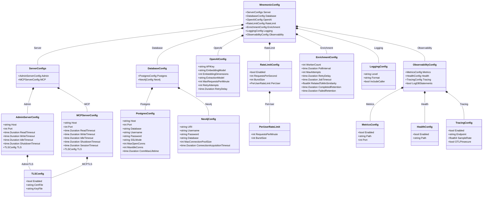

# Mnemonic Server Configuration

[Back to Architecture Overview](../../architecture/README.md) | [Back to Project README](../../../README.md)

## Table of Contents

- [Overview](#overview)
- [Configuration Loading Order](#configuration-loading-order)
  - [Precedence Rules](#precedence-rules)
  - [Loading Behavior](#loading-behavior)
- [Configuration File](#configuration-file)
- [Environment Variables](#environment-variables)
- [OpenTelemetry Standard Variables](#opentelemetry-standard-variables)
- [otelx Dependency](#otelx-dependency)
- [Configuration Reference](#configuration-reference)
- [Environment Variable Naming Conventions](#environment-variable-naming-conventions)
- [File Discovery Order](#file-discovery-order)
- [Viper Initialization](#viper-initialization)
- [Security Considerations](#security-considerations)
  - [Secrets Handling](#secrets-handling)
  - [Environment Variable Security](#environment-variable-security)
  - [Configuration Validation](#configuration-validation)
  - [Embedding Dimension Validation](#embedding-dimension-validation)
- [Configuration Model](#configuration-model)
  - [Go Struct Definitions](#go-struct-definitions)
  - [Class Diagram](#class-diagram)
- [References](#references)

## Overview

[Table of Contents](#table-of-contents)

> **Architecture Reference:** [System Architecture - Component Breakdown](../../architecture/02-system-architecture.md#component-breakdown) | [Deployment Architecture - Component Deployment](../../architecture/06-deployment-architecture.md#component-deployment)

> **Note:** MVP-1 runs as a single deployable process. The dual-server configuration (separate admin and MCP listeners) is retained for future decomposition into independent deployables.

The Mnemonic server uses a layered configuration system built on [`github.com/spf13/viper`](https://github.com/spf13/viper). Viper provides unified support for multiple configuration sources with well-defined precedence. This design enables:

- **Sensible defaults**: Work out of the box with minimal configuration (via `viper.SetDefault()`)
- **File-based configuration**: Persistent settings in YAML format (via `viper.ReadInConfig()`)
- **Environment overrides**: Container and CI/CD friendly (via `viper.AutomaticEnv()` with the `MNEMONIC_` prefix)

| Component | Config Prefix | Config File                 | Primary Use Case           |
| --------- | ------------- | --------------------------- | -------------------------- |
| Mnemonic  | `MNEMONIC_`   | `/etc/mnemonic/config.yaml` | Server deployment settings |

Admin operations use curl or similar HTTP clients against the REST API. No separate CLI is planned for MVP.

## Configuration Loading Order

[Table of Contents](#table-of-contents)

### Precedence Rules

Configuration values are loaded in the following order, with later sources overriding earlier ones:

```text
1. Compiled defaults (lowest priority)
2. Configuration file
3. Environment variables (highest priority)
```


### Loading Behavior

Viper's `MergeInConfig()` is NOT used. Configuration is loaded with `ReadInConfig()`, which replaces the entire file layer. Environment variables are bound via `AutomaticEnv()` with prefix replacement, so that `MNEMONIC_SERVER_ADMIN_PORT` maps to the Viper key `server.admin.port`.

**Merge vs Replace**:

- Scalar values (strings, numbers, booleans): Later sources replace earlier values
- Arrays: Later sources replace entire array (no merging)
- Maps/Objects: Keys are merged; later sources override individual keys

## Configuration File

[Table of Contents](#table-of-contents)

> **Architecture Reference:** [System Architecture - Mnemonic](../../architecture/02-system-architecture.md#mnemonic) | [Deployment Architecture - Mnemonic](../../architecture/06-deployment-architecture.md#mnemonic)

The Mnemonic server reads configuration from YAML files.

**Default location**: `/etc/mnemonic/config.yaml` (production) or `./config.yaml` (development)

```yaml
# Mnemonic server configuration file
# /etc/mnemonic/config.yaml

# HTTP server settings (post-pivot: two listeners)
server:
  # REST Admin API listener
  admin:
    host: 0.0.0.0
    port: 8080
    read_timeout: 30s
    write_timeout: 30s
    idle_timeout: 120s
    shutdown_timeout: 5s

    # TLS configuration (optional, typically handled by reverse proxy)
    tls:
      enabled: false
      cert_file: ""
      key_file: ""

  # MCP endpoint listener (Streamable HTTP)
  mcp:
    host: 0.0.0.0
    port: 8081
    read_timeout: 30s
    write_timeout: 120s # Longer for SSE streaming
    idle_timeout: 120s
    shutdown_timeout: 5s
    session_timeout: 30m # MCP session timeout

    # TLS configuration (optional, typically handled by reverse proxy)
    tls:
      enabled: false
      cert_file: ""
      key_file: ""

# Database connections
database:
  postgres:
    host: localhost
    port: 5432
    database: mnemonic
    username: mnemonic
    # password should be set via MNEMONIC_DATABASE_POSTGRES_PASSWORD
    password: ""
    ssl_mode: prefer
    max_open_conns: 25
    max_idle_conns: 5
    conn_max_lifetime: 5m
    # Post-MVP: when running multiple Mnemonic instances, ensure
    # N x max_open_conns does not exceed the database connection limit.

  # Neo4j is REQUIRED (post-pivot: no longer optional)
  neo4j:
    uri: bolt://localhost:7687
    username: neo4j
    # password should be set via MNEMONIC_DATABASE_NEO4J_PASSWORD
    password: ""
    database: neo4j
    max_connection_pool_size: 50
    connection_acquisition_timeout: 60s

# External services
openai:
  # API key should be set via MNEMONIC_OPENAI_API_KEY
  api_key: ""
  embedding_model: text-embedding-3-small
  embedding_dimensions: 1536
  extraction_model: gpt-4o-mini
  max_requests_per_minute: 500
  retry_attempts: 3
  retry_delay: 1s

# Rate limiting
# NOTE: Post-MVP feature - Server-side rate limiting will be available in a later phase
rate_limit:
  enabled: false
  requests_per_second: 100
  burst_size: 200

  # Per-user rate limits
  per_user:
    requests_per_minute: 60
    burst_size: 10

# Enrichment worker
enrichment:
  # Number of concurrent workers
  worker_count: 2

  # How often to poll for new jobs
  poll_interval: 5s

  # Maximum retry attempts for failed jobs
  max_attempts: 3

  # Delay between retry attempts
  retry_delay: 30s

  # Job timeout (stuck jobs are reclaimed after this duration)
  job_timeout: 5m

  # Minimum similarity for creating RELATED_TO edges (0.0-1.0)
  related_to_min_similarity: 0.3

  # Retention periods for completed/failed enrichment jobs
  completed_retention: 168h # 7 days
  failed_retention: 720h # 30 days

# Logging
logging:
  # Log level: debug, info, warn, error
  level: info

  # Log format: json, text
  format: json

  # Include caller information
  include_caller: false

# Observability
observability:
  log_db_statements: false
  metrics:
    enabled: true
    path: /metrics
    port: 9090

  health:
    enabled: true
    path: /health

  tracing:
    enabled: false
    endpoint: ""
    sample_rate: 0.1
    otlp_insecure: true
```

## Environment Variables

[Table of Contents](#table-of-contents)

All Mnemonic configuration options can be set via environment variables using the `MNEMONIC_` prefix.

```bash
# Server (post-pivot: two listeners)
export MNEMONIC_SERVER_ADMIN_HOST="0.0.0.0"
export MNEMONIC_SERVER_ADMIN_PORT="8080"
export MNEMONIC_SERVER_MCP_HOST="0.0.0.0"
export MNEMONIC_SERVER_MCP_PORT="8081"
export MNEMONIC_SERVER_MCP_SESSION_TIMEOUT="30m"

# Database credentials (recommended for secrets)
export MNEMONIC_DATABASE_POSTGRES_PASSWORD="secret"
export MNEMONIC_DATABASE_NEO4J_PASSWORD="secret"

# OpenAI (required)
export MNEMONIC_OPENAI_API_KEY="sk-..."

# Rate limiting
export MNEMONIC_RATE_LIMIT_ENABLED="false"
export MNEMONIC_RATE_LIMIT_REQUESTS_PER_SECOND="100"

# Logging
export MNEMONIC_LOGGING_LEVEL="debug"
```

## OpenTelemetry Standard Variables

[Table of Contents](#table-of-contents)

In addition to `MNEMONIC_` prefixed variables, Mnemonic respects standard OpenTelemetry environment variables for tracing configuration:

| Variable                      | Description                         | Example          |
| ----------------------------- | ----------------------------------- | ---------------- |
| `OTEL_EXPORTER_OTLP_ENDPOINT` | OTLP collector endpoint             | `localhost:4317` |
| `OTEL_EXPORTER_OTLP_INSECURE` | Use insecure connection             | `true`           |
| `OTEL_SERVICE_NAME`           | Service name (overridden by config) | `mnemonic`       |

These variables are used by the otelx library and take precedence when set.

## otelx Dependency

[Table of Contents](#table-of-contents)

Mnemonic uses the `github.com/twistingmercury/otelx` package (v1.0.0) to simplify OpenTelemetry integration. This library provides:

- **Unified initialization**: Single `Initialize()` call for logging, metrics, and tracing
- **Zerolog-based structured logging**: With automatic trace correlation (trace_id, span_id in log entries)
- **Prometheus metrics exporter**: Exposes metrics on a configurable port and path
- **OTLP gRPC trace exporter**: Sends traces to an OpenTelemetry collector
- **Gin middleware**: Request logging with automatic trace context propagation

The otelx package handles the complexity of OpenTelemetry SDK setup, allowing Mnemonic to focus on emitting telemetry rather than configuring exporters. For detailed implementation patterns using otelx, see [Observability Implementation Design](observability-implementation.md).

## Configuration Reference

[Table of Contents](#table-of-contents)

| Setting                                         | Type     | Default                  | Environment Variable                                     | Description                                                                                 |
| ----------------------------------------------- | -------- | ------------------------ | -------------------------------------------------------- | ------------------------------------------------------------------------------------------- |
| `server.admin.host`                             | string   | `0.0.0.0`                | `MNEMONIC_SERVER_ADMIN_HOST`                             | Admin API listen address                                                                    |
| `server.admin.port`                             | int      | `8080`                   | `MNEMONIC_SERVER_ADMIN_PORT`                             | Admin API listen port                                                                       |
| `server.admin.read_timeout`                     | duration | `30s`                    | `MNEMONIC_SERVER_ADMIN_READ_TIMEOUT`                     | Admin API read timeout                                                                      |
| `server.admin.write_timeout`                    | duration | `30s`                    | `MNEMONIC_SERVER_ADMIN_WRITE_TIMEOUT`                    | Admin API write timeout                                                                     |
| `server.admin.idle_timeout`                     | duration | `120s`                   | `MNEMONIC_SERVER_ADMIN_IDLE_TIMEOUT`                     | Admin API idle timeout                                                                      |
| `server.admin.shutdown_timeout`                 | duration | `5s`                     | `MNEMONIC_SERVER_ADMIN_SHUTDOWN_TIMEOUT`                 | Admin API graceful shutdown timeout                                                         |
| `server.admin.tls.enabled`                      | bool     | `false`                  | `MNEMONIC_SERVER_ADMIN_TLS_ENABLED`                      | Enable TLS for Admin API                                                                    |
| `server.admin.tls.cert_file`                    | string   | `""`                     | `MNEMONIC_SERVER_ADMIN_TLS_CERT_FILE`                    | Admin API TLS certificate path                                                              |
| `server.admin.tls.key_file`                     | string   | `""`                     | `MNEMONIC_SERVER_ADMIN_TLS_KEY_FILE`                     | Admin API TLS key path                                                                      |
| `server.mcp.host`                               | string   | `0.0.0.0`                | `MNEMONIC_SERVER_MCP_HOST`                               | MCP endpoint listen address                                                                 |
| `server.mcp.port`                               | int      | `8081`                   | `MNEMONIC_SERVER_MCP_PORT`                               | MCP endpoint listen port                                                                    |
| `server.mcp.read_timeout`                       | duration | `30s`                    | `MNEMONIC_SERVER_MCP_READ_TIMEOUT`                       | MCP endpoint read timeout                                                                   |
| `server.mcp.write_timeout`                      | duration | `120s`                   | `MNEMONIC_SERVER_MCP_WRITE_TIMEOUT`                      | MCP endpoint write timeout (longer for SSE streaming)                                       |
| `server.mcp.idle_timeout`                       | duration | `120s`                   | `MNEMONIC_SERVER_MCP_IDLE_TIMEOUT`                       | MCP endpoint idle timeout                                                                   |
| `server.mcp.shutdown_timeout`                   | duration | `5s`                     | `MNEMONIC_SERVER_MCP_SHUTDOWN_TIMEOUT`                   | MCP endpoint graceful shutdown timeout                                                      |
| `server.mcp.session_timeout`                    | duration | `30m`                    | `MNEMONIC_SERVER_MCP_SESSION_TIMEOUT`                    | MCP session timeout                                                                         |
| `server.mcp.tls.enabled`                        | bool     | `false`                  | `MNEMONIC_SERVER_MCP_TLS_ENABLED`                        | Enable TLS for MCP endpoint                                                                 |
| `server.mcp.tls.cert_file`                      | string   | `""`                     | `MNEMONIC_SERVER_MCP_TLS_CERT_FILE`                      | MCP endpoint TLS certificate path                                                           |
| `server.mcp.tls.key_file`                       | string   | `""`                     | `MNEMONIC_SERVER_MCP_TLS_KEY_FILE`                       | MCP endpoint TLS key path                                                                   |
| `database.postgres.host`                        | string   | `localhost`              | `MNEMONIC_DATABASE_POSTGRES_HOST`                        | PostgreSQL host                                                                             |
| `database.postgres.port`                        | int      | `5432`                   | `MNEMONIC_DATABASE_POSTGRES_PORT`                        | PostgreSQL port                                                                             |
| `database.postgres.database`                    | string   | `mnemonic`               | `MNEMONIC_DATABASE_POSTGRES_DATABASE`                    | Database name                                                                               |
| `database.postgres.username`                    | string   | `mnemonic`               | `MNEMONIC_DATABASE_POSTGRES_USERNAME`                    | Database username                                                                           |
| `database.postgres.password`                    | string   | `""`                     | `MNEMONIC_DATABASE_POSTGRES_PASSWORD`                    | Database password                                                                           |
| `database.postgres.ssl_mode`                    | string   | `prefer`                 | `MNEMONIC_DATABASE_POSTGRES_SSL_MODE`                    | SSL mode                                                                                    |
| `database.postgres.max_open_conns`              | int      | `25`                     | `MNEMONIC_DATABASE_POSTGRES_MAX_OPEN_CONNS`              | Max open connections                                                                        |
| `database.postgres.max_idle_conns`              | int      | `5`                      | `MNEMONIC_DATABASE_POSTGRES_MAX_IDLE_CONNS`              | Max idle connections                                                                        |
| `database.postgres.conn_max_lifetime`           | duration | `5m`                     | `MNEMONIC_DATABASE_POSTGRES_CONN_MAX_LIFETIME`           | Connection max lifetime                                                                     |
| `database.neo4j.uri`                            | string   | `bolt://localhost:7687`  | `MNEMONIC_DATABASE_NEO4J_URI`                            | Neo4j URI                                                                                   |
| `database.neo4j.username`                       | string   | `neo4j`                  | `MNEMONIC_DATABASE_NEO4J_USERNAME`                       | Neo4j username                                                                              |
| `database.neo4j.password`                       | string   | `""`                     | `MNEMONIC_DATABASE_NEO4J_PASSWORD`                       | Neo4j password                                                                              |
| `database.neo4j.database`                       | string   | `neo4j`                  | `MNEMONIC_DATABASE_NEO4J_DATABASE`                       | Neo4j database                                                                              |
| `database.neo4j.max_connection_pool_size`       | int      | `50`                     | `MNEMONIC_DATABASE_NEO4J_MAX_CONNECTION_POOL_SIZE`       | Neo4j max connection pool size                                                              |
| `database.neo4j.connection_acquisition_timeout` | duration | `60s`                    | `MNEMONIC_DATABASE_NEO4J_CONNECTION_ACQUISITION_TIMEOUT` | Neo4j connection acquisition timeout                                                        |
| `openai.api_key`                                | string   | `""`                     | `MNEMONIC_OPENAI_API_KEY`                                | OpenAI API key                                                                              |
| `openai.embedding_model`                        | string   | `text-embedding-3-small` | `MNEMONIC_OPENAI_EMBEDDING_MODEL`                        | Embedding model                                                                             |
| `openai.embedding_dimensions`                   | int      | `1536`                   | `MNEMONIC_OPENAI_EMBEDDING_DIMENSIONS`                   | Embedding dimensions                                                                        |
| `openai.extraction_model`                       | string   | `gpt-4o-mini`            | `MNEMONIC_OPENAI_EXTRACTION_MODEL`                       | Entity extraction model                                                                     |
| `rate_limit.enabled`                            | bool     | `false`                  | `MNEMONIC_RATE_LIMIT_ENABLED`                            | Enable rate limiting (Post-MVP)                                                             |
| `rate_limit.requests_per_second`                | int      | `100`                    | `MNEMONIC_RATE_LIMIT_REQUESTS_PER_SECOND`                | Global RPS limit (Post-MVP)                                                                 |
| `rate_limit.burst_size`                         | int      | `200`                    | `MNEMONIC_RATE_LIMIT_BURST_SIZE`                         | Burst size (Post-MVP)                                                                       |
| `rate_limit.per_user.requests_per_minute`       | int      | `60`                     | `MNEMONIC_RATE_LIMIT_PER_USER_REQUESTS_PER_MINUTE`       | Per-user RPM (Post-MVP)                                                                     |
| `rate_limit.per_user.burst_size`                | int      | `10`                     | `MNEMONIC_RATE_LIMIT_PER_USER_BURST_SIZE`                | Per-user burst size (Post-MVP)                                                              |
| `enrichment.worker_count`                       | int      | `2`                      | `MNEMONIC_ENRICHMENT_WORKER_COUNT`                       | Concurrent workers                                                                          |
| `enrichment.poll_interval`                      | duration | `5s`                     | `MNEMONIC_ENRICHMENT_POLL_INTERVAL`                      | Job poll interval                                                                           |
| `enrichment.max_attempts`                       | int      | `3`                      | `MNEMONIC_ENRICHMENT_MAX_ATTEMPTS`                       | Max retry attempts                                                                          |
| `enrichment.retry_delay`                        | duration | `30s`                    | `MNEMONIC_ENRICHMENT_RETRY_DELAY`                        | Delay between retry attempts for failed enrichment jobs                                     |
| `enrichment.job_timeout`                        | duration | `5m`                     | `MNEMONIC_ENRICHMENT_JOB_TIMEOUT`                        | Maximum time for a single enrichment job; stuck jobs are reclaimed after this duration      |
| `enrichment.related_to_min_similarity`          | float    | `0.3`                    | `MNEMONIC_ENRICHMENT_RELATED_TO_MIN_SIMILARITY`          | Minimum concept-overlap similarity (0.0-1.0) for creating RELATED_TO edges between patterns |
| `enrichment.completed_retention`                | duration | `168h`                   | `MNEMONIC_ENRICHMENT_COMPLETED_RETENTION`                | Retention period for completed enrichment jobs (default 7 days); older jobs are deleted     |
| `enrichment.failed_retention`                   | duration | `720h`                   | `MNEMONIC_ENRICHMENT_FAILED_RETENTION`                   | Retention period for failed enrichment jobs (default 30 days); older jobs are deleted       |
| `observability.log_db_statements`               | bool     | `false`                  | `MNEMONIC_OBSERVABILITY_LOG_DB_STATEMENTS`               | Log SQL/Cypher queries at DEBUG level                                                       |
| `logging.level`                                 | string   | `info`                   | `MNEMONIC_LOGGING_LEVEL`                                 | Log level                                                                                   |
| `logging.format`                                | string   | `json`                   | `MNEMONIC_LOGGING_FORMAT`                                | Log format                                                                                  |
| `observability.metrics.enabled`                 | bool     | `true`                   | `MNEMONIC_OBSERVABILITY_METRICS_ENABLED`                 | Enable metrics                                                                              |
| `observability.metrics.path`                    | string   | `/metrics`               | `MNEMONIC_OBSERVABILITY_METRICS_PATH`                    | Metrics endpoint path                                                                       |
| `observability.metrics.port`                    | int      | `9090`                   | `MNEMONIC_OBSERVABILITY_METRICS_PORT`                    | Metrics server port                                                                         |
| `observability.health.enabled`                  | bool     | `true`                   | `MNEMONIC_OBSERVABILITY_HEALTH_ENABLED`                  | Enable health check                                                                         |
| `observability.health.path`                     | string   | `/health`                | `MNEMONIC_OBSERVABILITY_HEALTH_PATH`                     | Health check endpoint path                                                                  |
| `observability.tracing.enabled`                 | bool     | `false`                  | `MNEMONIC_OBSERVABILITY_TRACING_ENABLED`                 | Enable distributed tracing                                                                  |
| `observability.tracing.endpoint`                | string   | `""`                     | `MNEMONIC_OBSERVABILITY_TRACING_ENDPOINT`                | OTLP collector endpoint                                                                     |
| `observability.tracing.otlp_insecure`           | bool     | `true`                   | `MNEMONIC_OBSERVABILITY_TRACING_OTLP_INSECURE`           | Use insecure OTLP connection (local development only; production should use TLS)            |

> **Pending Implementation:** The following configuration fields are designed but not yet implemented in code: `enrichment.related_to_min_similarity`, `enrichment.completed_retention`, `enrichment.failed_retention`, and `observability.log_db_statements`. The Go struct definitions and Viper defaults include these fields, but the application code does not yet read or act on them. They will be wired during implementation of the enrichment worker and database instrumentation.

## Environment Variable Naming Conventions

[Table of Contents](#table-of-contents)

All Mnemonic environment variables use the `MNEMONIC_` prefix with the following conventions:

| Convention   | Example                    |
| ------------ | -------------------------- |
| Prefix       | `MNEMONIC_`                |
| Separator    | `_` (underscore)           |
| Case         | SCREAMING_SNAKE_CASE       |
| Nested paths | Flattened with underscores |

**Examples**:

| YAML Path                    | Environment Variable                  |
| ---------------------------- | ------------------------------------- |
| `server.admin.port`          | `MNEMONIC_SERVER_ADMIN_PORT`          |
| `server.mcp.port`            | `MNEMONIC_SERVER_MCP_PORT`            |
| `database.postgres.password` | `MNEMONIC_DATABASE_POSTGRES_PASSWORD` |
| `openai.api_key`             | `MNEMONIC_OPENAI_API_KEY`             |

**Special Cases**:

- Boolean values: `true`, `false`, `1`, `0`, `yes`, `no` (case-insensitive)
- Duration values: Go duration format (`30s`, `5m`, `1h`)

## File Discovery Order

[Table of Contents](#table-of-contents)

Configuration files are searched in the following order:

```text
1. --config flag (if provided)
2. $MNEMONIC_CONFIG_FILE (if set)
3. /etc/mnemonic/config.yaml (production)
4. ./config.yaml (development)
```

## Viper Initialization

[Table of Contents](#table-of-contents)

The following shows the Viper initialization pattern used by Mnemonic. All config structs use `mapstructure` tags (not `yaml`, `json`, or `env` tags) because Viper's `Unmarshal()` delegates to the `mapstructure` library.

```go
package config

import (
    "fmt"
    "strings"

    "github.com/spf13/viper"
)

// Load reads configuration from defaults, file, and environment variables.
// It returns a fully populated MnemonicConfig or an error.
func Load(configPath string) (*MnemonicConfig, error) {
    v := viper.New()

    // 1. Compiled defaults (lowest priority)
    setDefaults(v)

    // 2. Configuration file
    if configPath != "" {
        v.SetConfigFile(configPath)
    } else {
        // File discovery order
        v.SetConfigName("config")
        v.SetConfigType("yaml")
        v.AddConfigPath("/etc/mnemonic") // production
        v.AddConfigPath(".")              // development
    }

    if err := v.ReadInConfig(); err != nil {
        if _, ok := err.(viper.ConfigFileNotFoundError); !ok {
            return nil, fmt.Errorf("reading config file: %w", err)
        }
        // Config file not found is acceptable; defaults + env vars are sufficient
    }

    // 3. Environment variables (highest priority)
    v.SetEnvPrefix("MNEMONIC")
    v.SetEnvKeyReplacer(strings.NewReplacer(".", "_"))
    v.AutomaticEnv()

    // Unmarshal into config struct (uses mapstructure tags)
    var cfg MnemonicConfig
    if err := v.Unmarshal(&cfg); err != nil {
        return nil, fmt.Errorf("unmarshaling config: %w", err)
    }

    return &cfg, nil
}

func setDefaults(v *viper.Viper) {
    // Server defaults
    v.SetDefault("server.admin.host", "0.0.0.0")
    v.SetDefault("server.admin.port", 8080)
    v.SetDefault("server.admin.read_timeout", "30s")
    v.SetDefault("server.admin.write_timeout", "30s")
    v.SetDefault("server.admin.idle_timeout", "120s")
    v.SetDefault("server.admin.shutdown_timeout", "5s")

    v.SetDefault("server.mcp.host", "0.0.0.0")
    v.SetDefault("server.mcp.port", 8081)
    v.SetDefault("server.mcp.read_timeout", "30s")
    v.SetDefault("server.mcp.write_timeout", "120s")
    v.SetDefault("server.mcp.idle_timeout", "120s")
    v.SetDefault("server.mcp.shutdown_timeout", "5s")
    v.SetDefault("server.mcp.session_timeout", "30m")

    // Database defaults
    v.SetDefault("database.postgres.host", "localhost")
    v.SetDefault("database.postgres.port", 5432)
    v.SetDefault("database.postgres.database", "mnemonic")
    v.SetDefault("database.postgres.username", "mnemonic")
    v.SetDefault("database.postgres.ssl_mode", "prefer")
    v.SetDefault("database.postgres.max_open_conns", 25)
    v.SetDefault("database.postgres.max_idle_conns", 5)
    v.SetDefault("database.postgres.conn_max_lifetime", "5m")

    v.SetDefault("database.neo4j.uri", "bolt://localhost:7687")
    v.SetDefault("database.neo4j.username", "neo4j")
    v.SetDefault("database.neo4j.database", "neo4j")
    v.SetDefault("database.neo4j.max_connection_pool_size", 50)
    v.SetDefault("database.neo4j.connection_acquisition_timeout", "60s")

    // OpenAI defaults
    v.SetDefault("openai.embedding_model", "text-embedding-3-small")
    v.SetDefault("openai.embedding_dimensions", 1536)
    v.SetDefault("openai.extraction_model", "gpt-4o-mini")
    v.SetDefault("openai.max_requests_per_minute", 500)
    v.SetDefault("openai.retry_attempts", 3)
    v.SetDefault("openai.retry_delay", "1s")

    // Enrichment defaults
    v.SetDefault("enrichment.worker_count", 2)
    v.SetDefault("enrichment.poll_interval", "5s")
    v.SetDefault("enrichment.max_attempts", 3)
    v.SetDefault("enrichment.retry_delay", "30s")
    v.SetDefault("enrichment.job_timeout", "5m")
    v.SetDefault("enrichment.related_to_min_similarity", 0.3)
    v.SetDefault("enrichment.completed_retention", "168h")
    v.SetDefault("enrichment.failed_retention", "720h")

    // Logging defaults
    v.SetDefault("logging.level", "info")
    v.SetDefault("logging.format", "json")
    v.SetDefault("logging.include_caller", false)

    // Observability defaults
    v.SetDefault("observability.metrics.enabled", true)
    v.SetDefault("observability.metrics.path", "/metrics")
    v.SetDefault("observability.metrics.port", 9090)
    v.SetDefault("observability.health.enabled", true)
    v.SetDefault("observability.health.path", "/health")
    v.SetDefault("observability.tracing.enabled", false)
    v.SetDefault("observability.tracing.sample_rate", 0.1)
    v.SetDefault("observability.tracing.otlp_insecure", true)
    v.SetDefault("observability.log_db_statements", false)
}
```

**Key Viper details:**

- `SetEnvPrefix("MNEMONIC")` causes all env var lookups to be prefixed with `MNEMONIC_`
- `SetEnvKeyReplacer(strings.NewReplacer(".", "_"))` maps nested keys (e.g., `server.admin.port`) to env vars (e.g., `MNEMONIC_SERVER_ADMIN_PORT`)
- `AutomaticEnv()` enables automatic binding of all Viper keys to their corresponding env vars
- `Unmarshal(&cfg)` uses the `mapstructure` library under the hood, so config structs MUST use `mapstructure:"..."` tags (not `yaml` or `json` tags)

## Security Considerations

[Table of Contents](#table-of-contents)

> **Architecture Reference:** [Security Architecture - Token Storage](../../architecture/01-security-architecture.md#token-storage) | [Communication Patterns - Security Considerations](../../architecture/03-communication-patterns.md#security-considerations)

### Secrets Handling

**Never store secrets in configuration files.** Use environment variables or secret management systems.

| Secret             | Storage Method                         |
| ------------------ | -------------------------------------- |
| Database passwords | Environment variable or secret manager |
| OpenAI API key     | Environment variable or secret manager |
| TLS private keys   | File with restricted permissions       |

**Recommended patterns**:

```yaml
# Bad: Secret in config file
database:
  postgres:
    password: my-secret-password

# Good: Reference environment variable
database:
  postgres:
    password: ""  # Set via MNEMONIC_DATABASE_POSTGRES_PASSWORD
```

```bash
# Set secrets via environment
export MNEMONIC_DATABASE_POSTGRES_PASSWORD="secure-password"
export MNEMONIC_OPENAI_API_KEY="sk-openai-key"
```

**Secret management integrations** (Post-MVP; see [Deployment Architecture](../architecture/06-deployment-architecture.md)):

- AWS Secrets Manager
- HashiCorp Vault
- Kubernetes Secrets

### Environment Variable Security

**Best practices**:

1. **Container deployments**: Use secrets management

   ```yaml
   # Kubernetes secret
   apiVersion: v1
   kind: Secret
   metadata:
     name: mnemonic-secrets
   type: Opaque
   stringData:
     postgres-password: "secure-password"
     openai-api-key: "sk-..."
   ```

   ```yaml
   # Pod environment from secret
   env:
     - name: MNEMONIC_DATABASE_POSTGRES_PASSWORD
       valueFrom:
         secretKeyRef:
           name: mnemonic-secrets
           key: postgres-password
   ```

2. **CI/CD pipelines**: Use pipeline secret variables, not hardcoded values

### Configuration Validation

Mnemonic validates configuration on startup:

**Validation checks**:

| Check                           | Description                   |
| ------------------------------- | ----------------------------- |
| Required fields present         | Essential fields must exist   |
| Port in valid range             | 1-65535                       |
| Duration format valid           | Timeouts must be parseable    |
| File paths exist (if specified) | TLS cert/key files must exist |
| Database connection works       | Connection test at startup    |
| API key format valid            | Basic format validation       |

**Error behavior**:

- Invalid configuration: Exit with error, detailed message
- Missing required secrets: Exit with error listing missing values
- Warning-level issues: Log warning, continue startup

```text
# Example validation error
Error: configuration validation failed:
  - server.port: must be between 1 and 65535, got 0
  - database.postgres.password: required but not set (use MNEMONIC_DATABASE_POSTGRES_PASSWORD)
  - openai.api_key: required but not set (use MNEMONIC_OPENAI_API_KEY)
```

### Embedding Dimension Validation

**Warning**: The `openai.embedding_dimensions` configuration must match the PGVector column schema. Mismatched dimensions will cause runtime failures during pattern enrichment.

**Startup validation**: Mnemonic validates at startup that the configured `embedding_dimensions` matches the PGVector `embedding` column dimensions. If they do not match, Mnemonic logs a fatal error and refuses to start:

```text
# Example dimension mismatch error
FATAL: embedding dimension mismatch: config specifies 3072 dimensions but PGVector column is defined as vector(1536)
```

**Failure mode without validation**: If dimension validation were skipped, the system would fail at runtime with cryptic Postgres errors when attempting to store embeddings:

```text
ERROR: expected 1536 dimensions, not 3072 (SQLSTATE XX000)
```

This error occurs during pattern enrichment, making it difficult to diagnose as a configuration issue.

**Schema migration required**: Changing the `embedding_dimensions` setting (for example, when switching from `text-embedding-ada-002` with 1536 dimensions to `text-embedding-3-large` with 3072 dimensions) requires a database schema migration:

1. Update the PGVector column definition to match the new dimensions
2. Re-generate embeddings for all existing patterns
3. Rebuild vector indexes

See [Pattern Processing - PGVector Configuration](pattern-processing.md#pgvector-configuration) for the schema definition and index configuration details.

**Common embedding model dimensions**:

| Model                    | Dimensions |
| ------------------------ | ---------- |
| `text-embedding-ada-002` | 1536       |
| `text-embedding-3-small` | 1536       |
| `text-embedding-3-large` | 3072       |

## Configuration Model

[Table of Contents](#table-of-contents)

The following Go struct definitions and class diagram show the configuration structure used by the Mnemonic server. All structs use `mapstructure` tags for Viper compatibility. This model is loaded from YAML files and environment variables using the precedence rules described above.

### Go Struct Definitions

```go
package config

import "time"

// MnemonicConfig is the top-level configuration struct.
// Viper unmarshals YAML keys and env vars into this struct via mapstructure tags.
type MnemonicConfig struct {
    Server        ServerConfigs      `mapstructure:"server"`
    Database      DatabaseConfig     `mapstructure:"database"`
    OpenAI        OpenAIConfig       `mapstructure:"openai"`
    RateLimit     RateLimitConfig    `mapstructure:"rate_limit"`
    Enrichment    EnrichmentConfig   `mapstructure:"enrichment"`
    Logging       LoggingConfig      `mapstructure:"logging"`
    Observability ObservabilityConfig `mapstructure:"observability"`
}

type ServerConfigs struct {
    Admin AdminServerConfig `mapstructure:"admin"`
    MCP   MCPServerConfig   `mapstructure:"mcp"`
}

type AdminServerConfig struct {
    Host            string        `mapstructure:"host"`
    Port            int           `mapstructure:"port"`
    ReadTimeout     time.Duration `mapstructure:"read_timeout"`
    WriteTimeout    time.Duration `mapstructure:"write_timeout"`
    IdleTimeout     time.Duration `mapstructure:"idle_timeout"`
    ShutdownTimeout time.Duration `mapstructure:"shutdown_timeout"`
    TLS             TLSConfig     `mapstructure:"tls"`
}

type MCPServerConfig struct {
    Host            string        `mapstructure:"host"`
    Port            int           `mapstructure:"port"`
    ReadTimeout     time.Duration `mapstructure:"read_timeout"`
    WriteTimeout    time.Duration `mapstructure:"write_timeout"`
    IdleTimeout     time.Duration `mapstructure:"idle_timeout"`
    ShutdownTimeout time.Duration `mapstructure:"shutdown_timeout"`
    SessionTimeout  time.Duration `mapstructure:"session_timeout"`
    TLS             TLSConfig     `mapstructure:"tls"`
}

type TLSConfig struct {
    Enabled  bool   `mapstructure:"enabled"`
    CertFile string `mapstructure:"cert_file"`
    KeyFile  string `mapstructure:"key_file"`
}

type DatabaseConfig struct {
    Postgres PostgresConfig `mapstructure:"postgres"`
    Neo4j    Neo4jConfig    `mapstructure:"neo4j"`
}

// PostgresConfig defines PostgreSQL connection parameters.
// Matches the struct in data-storage.md Connection Configuration.
type PostgresConfig struct {
    Host            string        `mapstructure:"host"`
    Port            int           `mapstructure:"port"`
    Database        string        `mapstructure:"database"`
    Username        string        `mapstructure:"username"`
    Password        string        `mapstructure:"password"`
    SSLMode         string        `mapstructure:"ssl_mode"`
    MaxOpenConns    int           `mapstructure:"max_open_conns"`
    MaxIdleConns    int           `mapstructure:"max_idle_conns"`
    ConnMaxLifetime time.Duration `mapstructure:"conn_max_lifetime"`
}

// Neo4jConfig defines Neo4j connection parameters.
// Matches the struct in data-storage.md Connection Configuration.
type Neo4jConfig struct {
    URI                          string        `mapstructure:"uri"`
    Username                     string        `mapstructure:"username"`
    Password                     string        `mapstructure:"password"`
    Database                     string        `mapstructure:"database"`
    MaxConnectionPoolSize        int           `mapstructure:"max_connection_pool_size"`
    ConnectionAcquisitionTimeout time.Duration `mapstructure:"connection_acquisition_timeout"`
}

type OpenAIConfig struct {
    APIKey              string        `mapstructure:"api_key"`
    EmbeddingModel      string        `mapstructure:"embedding_model"`
    EmbeddingDimensions int           `mapstructure:"embedding_dimensions"`
    ExtractionModel     string        `mapstructure:"extraction_model"`
    MaxRequestsPerMinute int          `mapstructure:"max_requests_per_minute"`
    RetryAttempts       int           `mapstructure:"retry_attempts"`
    RetryDelay          time.Duration `mapstructure:"retry_delay"`
}

type RateLimitConfig struct {
    Enabled           bool             `mapstructure:"enabled"`
    RequestsPerSecond int              `mapstructure:"requests_per_second"`
    BurstSize         int              `mapstructure:"burst_size"`
    PerUser           PerUserRateLimit `mapstructure:"per_user"`
}

type PerUserRateLimit struct {
    RequestsPerMinute int `mapstructure:"requests_per_minute"`
    BurstSize         int `mapstructure:"burst_size"`
}

type EnrichmentConfig struct {
    WorkerCount            int           `mapstructure:"worker_count"`
    PollInterval           time.Duration `mapstructure:"poll_interval"`
    MaxAttempts            int           `mapstructure:"max_attempts"`
    RetryDelay             time.Duration `mapstructure:"retry_delay"`
    JobTimeout             time.Duration `mapstructure:"job_timeout"`
    RelatedToMinSimilarity float64       `mapstructure:"related_to_min_similarity"`
    CompletedRetention     time.Duration `mapstructure:"completed_retention"`  // Default: 7d (168h)
    FailedRetention        time.Duration `mapstructure:"failed_retention"`     // Default: 30d (720h)
}

type LoggingConfig struct {
    Level         string `mapstructure:"level"`
    Format        string `mapstructure:"format"`
    IncludeCaller bool   `mapstructure:"include_caller"`
}

type ObservabilityConfig struct {
    Metrics         MetricsConfig `mapstructure:"metrics"`
    Health          HealthConfig  `mapstructure:"health"`
    Tracing         TracingConfig `mapstructure:"tracing"`
    LogDBStatements bool          `mapstructure:"log_db_statements"`
}

type MetricsConfig struct {
    Enabled bool   `mapstructure:"enabled"`
    Path    string `mapstructure:"path"`
    Port    int    `mapstructure:"port"`
}

type HealthConfig struct {
    Enabled bool   `mapstructure:"enabled"`
    Path    string `mapstructure:"path"`
}

type TracingConfig struct {
    Enabled      bool    `mapstructure:"enabled"`
    Endpoint     string  `mapstructure:"endpoint"`
    SampleRate   float64 `mapstructure:"sample_rate"`
    OTLPInsecure bool    `mapstructure:"otlp_insecure"`
}
```

### Class Diagram



## References

[Table of Contents](#table-of-contents)

- [Architecture Overview](../../architecture/README.md) - System context
- [System Architecture](../../architecture/02-system-architecture.md) - Component layout
- [Deployment Architecture](../../architecture/06-deployment-architecture.md) - Deployment environments
- [Pattern Processing](pattern-processing.md) - OpenAI configuration for enrichment
- [Observability Implementation](observability-implementation.md) - otelx integration details
- [Viper](https://github.com/spf13/viper) - Configuration library used by Mnemonic
- [Data Storage - Connection Configuration](data-storage.md#connection-configuration) - PostgresConfig and Neo4jConfig struct definitions
