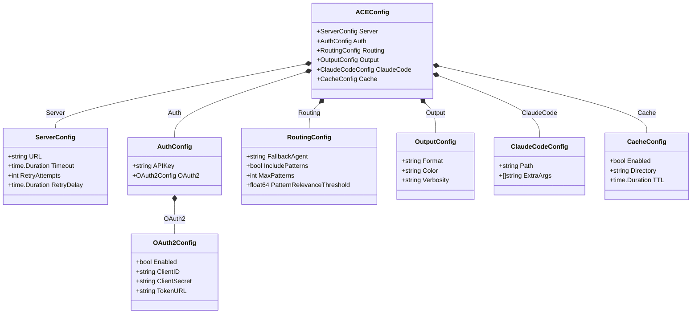

# Configuration

[Back to Architecture Overview](../architecture/00-overview.md) | [Back to System Architecture](../architecture/03-system-architecture.md)

## Table of Contents

- [Overview](#overview)
- [Configuration Loading Order](#configuration-loading-order)
  - [Precedence Rules](#precedence-rules)
  - [Loading Behavior](#loading-behavior)
- [ACE CLI Configuration](#ace-cli-configuration)
  - [Configuration File](#configuration-file)
  - [Environment Variables](#environment-variables)
  - [Command-Line Flags](#command-line-flags)
  - [Configuration Reference](#ace-cli-configuration-reference)
- [Mnemonic Server Configuration](#mnemonic-server-configuration)
  - [Configuration File](#mnemonic-configuration-file)
  - [Environment Variables](#mnemonic-environment-variables)
  - [Configuration Reference](#mnemonic-configuration-reference)
- [Environment Variable Naming Conventions](#environment-variable-naming-conventions)
  - [ACE CLI Variables](#ace-cli-variables)
  - [Mnemonic Server Variables](#mnemonic-server-variables)
- [YAML Configuration Format](#yaml-configuration-format)
  - [XDG Base Directory Paths](#xdg-base-directory-paths)
  - [File Discovery Order](#file-discovery-order)
  - [Platform-Specific Paths](#platform-specific-paths)
- [Security Considerations](#security-considerations)
  - [Secrets Handling](#secrets-handling)
  - [File Permissions](#file-permissions)
  - [Environment Variable Security](#environment-variable-security)
  - [Configuration Validation](#configuration-validation)
- [Configuration Models](#configuration-models)
  - [ACE CLI Configuration Model](#ace-cli-configuration-model)
  - [Mnemonic Server Configuration Model](#mnemonic-server-configuration-model)
- [References](#references)

## Overview

[↑ Table of Contents](#table-of-contents)

ACE and Mnemonic use a layered configuration system that supports multiple sources with well-defined precedence. This design enables:

- **Sensible defaults**: Work out of the box with minimal configuration
- **File-based configuration**: Persistent settings in YAML format
- **Environment overrides**: Container and CI/CD friendly
- **Command-line flags**: Per-invocation overrides for debugging and scripting

| Component | Config Prefix | Config File | Primary Use Case |
| --------- | ------------- | ----------- | ---------------- |
| ACE CLI | `ACE_` | `~/.config/ace/config.yaml` | User workstation settings |
| Mnemonic | `MNEMONIC_` | `/etc/mnemonic/config.yaml` | Server deployment settings |

## Configuration Loading Order

[↑ Table of Contents](#table-of-contents)

### Precedence Rules

Configuration values are loaded in the following order, with later sources overriding earlier ones:

```text
1. Compiled defaults (lowest priority)
2. Configuration file
3. Environment variables
4. Command-line flags (highest priority)
```


### Loading Behavior

**Merge vs Replace**:

- Scalar values (strings, numbers, booleans): Later sources replace earlier values
- Arrays: Later sources replace entire array (no merging)
- Maps/Objects: Keys are merged; later sources override individual keys

**Example**:

```yaml
# Config file
routing:
  timeout: 30s
  fallback_agent: general-agent
```

```bash
# Environment variable overrides only timeout
export ACE_ROUTING_TIMEOUT=60s
```

```text
# Result
routing:
  timeout: 60s                    # From environment
  fallback_agent: general-agent   # From config file
```

## ACE CLI Configuration

[↑ Table of Contents](#table-of-contents)

### Configuration File

The ACE CLI reads configuration from YAML files in XDG-compliant locations.

**Default location**: `~/.config/ace/config.yaml`

```yaml
# ACE CLI configuration file
# ~/.config/ace/config.yaml

# Mnemonic server connection
server:
  url: https://mnemonic.example.com
  timeout: 30s
  retry_attempts: 3
  retry_delay: 1s

# Authentication
auth:
  # API key for Mnemonic authentication
  # Prefer ACE_AUTH_API_KEY environment variable for secrets
  api_key: ""

  # OAuth2 configuration (alternative to API key)
  # NOTE: Post-MVP feature - OAuth2 authentication will be available in a later phase
  oauth2:
    enabled: false
    client_id: ""
    # client_secret should be set via ACE_AUTH_OAUTH2_CLIENT_SECRET
    token_url: ""

# Routing preferences
routing:
  # Default agent when routing fails or is unavailable
  fallback_agent: general-agent

  # Include patterns in routing response
  include_patterns: true

  # Maximum patterns to retrieve
  max_patterns: 5

  # Minimum relevance score for patterns (0.0 to 1.0)
  pattern_relevance_threshold: 0.7

# Output formatting
output:
  # Output format: text, json, yaml
  format: text

  # Enable colored output (auto-detected if not set)
  color: auto

  # Verbosity level: quiet, normal, verbose, debug
  verbosity: normal

# Claude Code integration (Phase 1)
claude_code:
  # Path to Claude Code binary (auto-detected if not set)
  path: ""

  # Additional arguments to pass to Claude Code
  extra_args: []

# Local cache settings
cache:
  # Enable local caching of routing decisions
  enabled: true

  # Cache directory (uses XDG cache dir if not set)
  directory: ""

  # Cache TTL for routing decisions
  ttl: 5m
```

### Environment Variables

All ACE CLI configuration options can be set via environment variables using the `ACE_` prefix.

```bash
# Server connection
export ACE_SERVER_URL="https://mnemonic.example.com"
export ACE_SERVER_TIMEOUT="30s"

# Authentication (recommended for secrets)
export ACE_AUTH_API_KEY="sk-..."

# Routing
export ACE_ROUTING_FALLBACK_AGENT="general-agent"
export ACE_ROUTING_INCLUDE_PATTERNS="true"

# Output
export ACE_OUTPUT_FORMAT="json"
export ACE_OUTPUT_VERBOSITY="debug"
```

### Command-Line Flags

Common configuration options are available as command-line flags:

```bash
# Server connection
ace --server-url https://mnemonic.example.com
ace --timeout 60s

# Output control
ace --format json
ace --quiet
ace --verbose
ace --debug

# Routing overrides
ace --agent go-software-agent  # Force specific agent
ace --no-patterns              # Disable pattern retrieval

# Configuration file
ace --config /path/to/config.yaml
```

### ACE CLI Configuration Reference

| Setting | Type | Default | Environment Variable | CLI Flag | Description |
| ------- | ---- | ------- | -------------------- | -------- | ----------- |
| `server.url` | string | `http://localhost:8080` | `ACE_SERVER_URL` | `--server-url` | Mnemonic server URL |
| `server.timeout` | duration | `30s` | `ACE_SERVER_TIMEOUT` | `--timeout` | Request timeout |
| `server.retry_attempts` | int | `3` | `ACE_SERVER_RETRY_ATTEMPTS` | - | Max retry attempts |
| `server.retry_delay` | duration | `1s` | `ACE_SERVER_RETRY_DELAY` | - | Delay between retries |
| `auth.api_key` | string | `""` | `ACE_AUTH_API_KEY` | - | API key for authentication |
| `auth.oauth2.enabled` | bool | `false` | `ACE_AUTH_OAUTH2_ENABLED` | - | Enable OAuth2 (Post-MVP) |
| `auth.oauth2.client_id` | string | `""` | `ACE_AUTH_OAUTH2_CLIENT_ID` | - | OAuth2 client ID (Post-MVP) |
| `auth.oauth2.client_secret` | string | `""` | `ACE_AUTH_OAUTH2_CLIENT_SECRET` | - | OAuth2 client secret (Post-MVP) |
| `auth.oauth2.token_url` | string | `""` | `ACE_AUTH_OAUTH2_TOKEN_URL` | - | OAuth2 token endpoint (Post-MVP) |
| `routing.fallback_agent` | string | `general-agent` | `ACE_ROUTING_FALLBACK_AGENT` | `--fallback-agent` | Fallback agent name |
| `routing.include_patterns` | bool | `true` | `ACE_ROUTING_INCLUDE_PATTERNS` | `--no-patterns` | Include patterns |
| `routing.max_patterns` | int | `5` | `ACE_ROUTING_MAX_PATTERNS` | `--max-patterns` | Max patterns to retrieve |
| `routing.pattern_relevance_threshold` | float | `0.7` | `ACE_ROUTING_PATTERN_RELEVANCE_THRESHOLD` | - | Min relevance score |
| `output.format` | string | `text` | `ACE_OUTPUT_FORMAT` | `--format` | Output format |
| `output.color` | string | `auto` | `ACE_OUTPUT_COLOR` | `--color`, `--no-color` | Color output |
| `output.verbosity` | string | `normal` | `ACE_OUTPUT_VERBOSITY` | `--quiet`, `--verbose`, `--debug` | Verbosity level |
| `claude_code.path` | string | auto-detect | `ACE_CLAUDE_CODE_PATH` | `--claude-code-path` | Claude Code binary path |
| `claude_code.extra_args` | []string | `[]` | `ACE_CLAUDE_CODE_EXTRA_ARGS` | - | Extra Claude Code args |
| `cache.enabled` | bool | `true` | `ACE_CACHE_ENABLED` | `--no-cache` | Enable local cache |
| `cache.directory` | string | XDG cache | `ACE_CACHE_DIRECTORY` | - | Cache directory |
| `cache.ttl` | duration | `5m` | `ACE_CACHE_TTL` | - | Cache TTL |

## Mnemonic Server Configuration

[↑ Table of Contents](#table-of-contents)

### Mnemonic Configuration File

The Mnemonic server reads configuration from YAML files.

**Default location**: `/etc/mnemonic/config.yaml` (production) or `./config.yaml` (development)

```yaml
# Mnemonic server configuration file
# /etc/mnemonic/config.yaml

# HTTP server settings
server:
  host: 0.0.0.0
  port: 8080
  read_timeout: 30s
  write_timeout: 30s
  idle_timeout: 120s

  # TLS configuration (optional, typically handled by reverse proxy)
  tls:
    enabled: false
    cert_file: ""
    key_file: ""

# Database connections
database:
  postgres:
    host: localhost
    port: 5432
    database: mnemonic
    username: mnemonic
    # password should be set via MNEMONIC_DATABASE_POSTGRES_PASSWORD
    password: ""
    ssl_mode: prefer
    max_open_conns: 25
    max_idle_conns: 5
    conn_max_lifetime: 5m

  neo4j:
    uri: bolt://localhost:7687
    username: neo4j
    # password should be set via MNEMONIC_DATABASE_NEO4J_PASSWORD
    password: ""
    database: neo4j
    max_connection_pool_size: 50
    connection_acquisition_timeout: 60s

# External services
openai:
  # API key should be set via MNEMONIC_OPENAI_API_KEY
  api_key: ""
  embedding_model: text-embedding-3-small
  embedding_dimensions: 1536
  extraction_model: gpt-4o-mini
  max_requests_per_minute: 500
  retry_attempts: 3
  retry_delay: 1s

# Rate limiting
# NOTE: Post-MVP feature - Server-side rate limiting will be available in a later phase
rate_limit:
  enabled: true
  requests_per_second: 100
  burst_size: 200

  # Per-user rate limits
  per_user:
    requests_per_minute: 60
    burst_size: 10

# Routing engine
routing:
  cache:
    refresh_ttl: 5m
    startup_timeout: 30s

  # Default agent when no rules match
  default_agent: general-agent

# Enrichment worker
enrichment:
  # Number of concurrent workers
  worker_count: 2

  # How often to poll for new jobs
  poll_interval: 5s

  # Maximum retry attempts for failed jobs
  max_attempts: 3

  # Delay between retry attempts
  retry_delay: 30s

  # Job timeout (stuck jobs are reclaimed after this duration)
  job_timeout: 5m

# Logging
logging:
  # Log level: debug, info, warn, error
  level: info

  # Log format: json, text
  format: json

  # Include caller information
  include_caller: false

# Observability
observability:
  metrics:
    enabled: true
    path: /metrics
    port: 9090

  health:
    enabled: true
    path: /ops/health

  tracing:
    enabled: false
    endpoint: ""
    sample_rate: 0.1
    otlp_insecure: true
```

### Mnemonic Environment Variables

All Mnemonic configuration options can be set via environment variables using the `MNEMONIC_` prefix.

```bash
# Server
export MNEMONIC_SERVER_HOST="0.0.0.0"
export MNEMONIC_SERVER_PORT="8080"

# Database credentials (recommended for secrets)
export MNEMONIC_DATABASE_POSTGRES_PASSWORD="secret"
export MNEMONIC_DATABASE_NEO4J_PASSWORD="secret"

# OpenAI (required)
export MNEMONIC_OPENAI_API_KEY="sk-..."

# Rate limiting
export MNEMONIC_RATE_LIMIT_ENABLED="true"
export MNEMONIC_RATE_LIMIT_REQUESTS_PER_SECOND="100"

# Logging
export MNEMONIC_LOGGING_LEVEL="debug"
```

### OpenTelemetry Standard Variables

In addition to `MNEMONIC_` prefixed variables, Mnemonic respects standard OpenTelemetry environment variables for tracing configuration:

| Variable | Description | Example |
|----------|-------------|---------|
| `OTEL_EXPORTER_OTLP_ENDPOINT` | OTLP collector endpoint | `localhost:4317` |
| `OTEL_EXPORTER_OTLP_INSECURE` | Use insecure connection | `true` |
| `OTEL_SERVICE_NAME` | Service name (overridden by config) | `mnemonic` |

These variables are used by the otelx library and take precedence when set.

### Mnemonic Configuration Reference

| Setting | Type | Default | Environment Variable | Description |
| ------- | ---- | ------- | -------------------- | ----------- |
| `server.host` | string | `0.0.0.0` | `MNEMONIC_SERVER_HOST` | Listen address |
| `server.port` | int | `8080` | `MNEMONIC_SERVER_PORT` | Listen port |
| `server.read_timeout` | duration | `30s` | `MNEMONIC_SERVER_READ_TIMEOUT` | HTTP read timeout |
| `server.write_timeout` | duration | `30s` | `MNEMONIC_SERVER_WRITE_TIMEOUT` | HTTP write timeout |
| `server.idle_timeout` | duration | `120s` | `MNEMONIC_SERVER_IDLE_TIMEOUT` | HTTP idle timeout |
| `server.tls.enabled` | bool | `false` | `MNEMONIC_SERVER_TLS_ENABLED` | Enable TLS |
| `server.tls.cert_file` | string | `""` | `MNEMONIC_SERVER_TLS_CERT_FILE` | TLS certificate path |
| `server.tls.key_file` | string | `""` | `MNEMONIC_SERVER_TLS_KEY_FILE` | TLS key path |
| `database.postgres.host` | string | `localhost` | `MNEMONIC_DATABASE_POSTGRES_HOST` | PostgreSQL host |
| `database.postgres.port` | int | `5432` | `MNEMONIC_DATABASE_POSTGRES_PORT` | PostgreSQL port |
| `database.postgres.database` | string | `mnemonic` | `MNEMONIC_DATABASE_POSTGRES_DATABASE` | Database name |
| `database.postgres.username` | string | `mnemonic` | `MNEMONIC_DATABASE_POSTGRES_USERNAME` | Database username |
| `database.postgres.password` | string | `""` | `MNEMONIC_DATABASE_POSTGRES_PASSWORD` | Database password |
| `database.postgres.ssl_mode` | string | `prefer` | `MNEMONIC_DATABASE_POSTGRES_SSL_MODE` | SSL mode |
| `database.postgres.max_open_conns` | int | `25` | `MNEMONIC_DATABASE_POSTGRES_MAX_OPEN_CONNS` | Max open connections |
| `database.postgres.max_idle_conns` | int | `5` | `MNEMONIC_DATABASE_POSTGRES_MAX_IDLE_CONNS` | Max idle connections |
| `database.postgres.conn_max_lifetime` | duration | `5m` | `MNEMONIC_DATABASE_POSTGRES_CONN_MAX_LIFETIME` | Connection max lifetime |
| `database.neo4j.uri` | string | `bolt://localhost:7687` | `MNEMONIC_DATABASE_NEO4J_URI` | Neo4j URI |
| `database.neo4j.username` | string | `neo4j` | `MNEMONIC_DATABASE_NEO4J_USERNAME` | Neo4j username |
| `database.neo4j.password` | string | `""` | `MNEMONIC_DATABASE_NEO4J_PASSWORD` | Neo4j password |
| `database.neo4j.database` | string | `neo4j` | `MNEMONIC_DATABASE_NEO4J_DATABASE` | Neo4j database |
| `openai.api_key` | string | `""` | `MNEMONIC_OPENAI_API_KEY` | OpenAI API key |
| `openai.embedding_model` | string | `text-embedding-3-small` | `MNEMONIC_OPENAI_EMBEDDING_MODEL` | Embedding model |
| `openai.embedding_dimensions` | int | `1536` | `MNEMONIC_OPENAI_EMBEDDING_DIMENSIONS` | Embedding dimensions |
| `openai.extraction_model` | string | `gpt-4o-mini` | `MNEMONIC_OPENAI_EXTRACTION_MODEL` | Entity extraction model |
| `rate_limit.enabled` | bool | `true` | `MNEMONIC_RATE_LIMIT_ENABLED` | Enable rate limiting (Post-MVP) |
| `rate_limit.requests_per_second` | int | `100` | `MNEMONIC_RATE_LIMIT_REQUESTS_PER_SECOND` | Global RPS limit (Post-MVP) |
| `rate_limit.burst_size` | int | `200` | `MNEMONIC_RATE_LIMIT_BURST_SIZE` | Burst size (Post-MVP) |
| `rate_limit.per_user.requests_per_minute` | int | `60` | `MNEMONIC_RATE_LIMIT_PER_USER_REQUESTS_PER_MINUTE` | Per-user RPM (Post-MVP) |
| `routing.cache.refresh_ttl` | duration | `5m` | `MNEMONIC_ROUTING_CACHE_REFRESH_TTL` | Cache refresh interval |
| `routing.default_agent` | string | `general-agent` | `MNEMONIC_ROUTING_DEFAULT_AGENT` | Default fallback agent |
| `enrichment.worker_count` | int | `2` | `MNEMONIC_ENRICHMENT_WORKER_COUNT` | Concurrent workers |
| `enrichment.poll_interval` | duration | `5s` | `MNEMONIC_ENRICHMENT_POLL_INTERVAL` | Job poll interval |
| `enrichment.max_attempts` | int | `3` | `MNEMONIC_ENRICHMENT_MAX_ATTEMPTS` | Max retry attempts |
| `logging.level` | string | `info` | `MNEMONIC_LOGGING_LEVEL` | Log level |
| `logging.format` | string | `json` | `MNEMONIC_LOGGING_FORMAT` | Log format |
| `observability.metrics.enabled` | bool | `true` | `MNEMONIC_OBSERVABILITY_METRICS_ENABLED` | Enable metrics |
| `observability.metrics.path` | string | `/metrics` | `MNEMONIC_OBSERVABILITY_METRICS_PATH` | Metrics endpoint path |
| `observability.metrics.port` | int | `9090` | `MNEMONIC_OBSERVABILITY_METRICS_PORT` | Metrics server port |
| `observability.health.enabled` | bool | `true` | `MNEMONIC_OBSERVABILITY_HEALTH_ENABLED` | Enable health check |
| `observability.tracing.enabled` | bool | `false` | `MNEMONIC_OBSERVABILITY_TRACING_ENABLED` | Enable distributed tracing |
| `observability.tracing.endpoint` | string | `""` | `MNEMONIC_OBSERVABILITY_TRACING_ENDPOINT` | OTLP collector endpoint |
| `observability.tracing.otlp_insecure` | bool | `true` | `MNEMONIC_OBSERVABILITY_TRACING_OTLP_INSECURE` | Use insecure OTLP connection |

## Environment Variable Naming Conventions

[↑ Table of Contents](#table-of-contents)

### ACE CLI Variables

All ACE CLI environment variables use the `ACE_` prefix with the following conventions:

| Convention | Example |
| ---------- | ------- |
| Prefix | `ACE_` |
| Separator | `_` (underscore) |
| Case | SCREAMING_SNAKE_CASE |
| Nested paths | Flattened with underscores |

**Examples**:

| YAML Path | Environment Variable |
| --------- | -------------------- |
| `server.url` | `ACE_SERVER_URL` |
| `auth.oauth2.client_id` | `ACE_AUTH_OAUTH2_CLIENT_ID` |
| `routing.max_patterns` | `ACE_ROUTING_MAX_PATTERNS` |

### Mnemonic Server Variables

All Mnemonic environment variables use the `MNEMONIC_` prefix with the same conventions:

| Convention | Example |
| ---------- | ------- |
| Prefix | `MNEMONIC_` |
| Separator | `_` (underscore) |
| Case | SCREAMING_SNAKE_CASE |
| Nested paths | Flattened with underscores |

**Examples**:

| YAML Path | Environment Variable |
| --------- | -------------------- |
| `server.port` | `MNEMONIC_SERVER_PORT` |
| `database.postgres.password` | `MNEMONIC_DATABASE_POSTGRES_PASSWORD` |
| `openai.api_key` | `MNEMONIC_OPENAI_API_KEY` |

**Special Cases**:

- Boolean values: `true`, `false`, `1`, `0`, `yes`, `no` (case-insensitive)
- Duration values: Go duration format (`30s`, `5m`, `1h`)
- Array values: Comma-separated (`ACE_CLAUDE_CODE_EXTRA_ARGS="--arg1,--arg2"`)

## YAML Configuration Format

[↑ Table of Contents](#table-of-contents)

### XDG Base Directory Paths

ACE CLI follows the [XDG Base Directory Specification](https://specifications.freedesktop.org/basedir-spec/basedir-spec-latest.html) for configuration file locations.

| Directory | Environment Variable | Default (Linux/macOS) | Purpose |
| --------- | -------------------- | --------------------- | ------- |
| Config | `XDG_CONFIG_HOME` | `~/.config` | Configuration files |
| Data | `XDG_DATA_HOME` | `~/.local/share` | Persistent data |
| Cache | `XDG_CACHE_HOME` | `~/.cache` | Non-essential cache |
| State | `XDG_STATE_HOME` | `~/.local/state` | Persistent state |

**ACE-specific paths**:

| Purpose | Path |
| ------- | ---- |
| Config file | `$XDG_CONFIG_HOME/ace/config.yaml` |
| Cache directory | `$XDG_CACHE_HOME/ace/` |
| Log files | `$XDG_STATE_HOME/ace/logs/` |

### File Discovery Order

Configuration files are searched in the following order:

**ACE CLI**:

```text
1. --config flag (if provided)
2. $ACE_CONFIG_FILE (if set)
3. $XDG_CONFIG_HOME/ace/config.yaml
4. ~/.config/ace/config.yaml (fallback if XDG not set)
5. ~/.ace/config.yaml (legacy location)
```

**Mnemonic Server**:

```text
1. --config flag (if provided)
2. $MNEMONIC_CONFIG_FILE (if set)
3. /etc/mnemonic/config.yaml (production)
4. ./config.yaml (development)
```

### Platform-Specific Paths

| Platform | Config Home | Example Path |
| -------- | ----------- | ------------ |
| Linux | `~/.config` | `~/.config/ace/config.yaml` |
| macOS | `~/.config` | `~/.config/ace/config.yaml` |
| Windows | `%APPDATA%` | `C:\Users\<user>\AppData\Roaming\ace\config.yaml` |

**Note**: On macOS, `~/Library/Application Support` is also supported as an alternative to `~/.config` for better native integration:

```text
1. $XDG_CONFIG_HOME/ace/config.yaml
2. ~/.config/ace/config.yaml
3. ~/Library/Application Support/ace/config.yaml
```

## Security Considerations

[↑ Table of Contents](#table-of-contents)

### Secrets Handling

**Never store secrets in configuration files.** Use environment variables or secret management systems.

| Secret | Storage Method |
| ------ | -------------- |
| API keys | Environment variable |
| Database passwords | Environment variable or secret manager |
| OAuth2 client secrets | Environment variable or secret manager |
| TLS private keys | File with restricted permissions |

**Recommended patterns**:

```yaml
# Bad: Secret in config file
auth:
  api_key: sk-1234567890abcdef

# Good: Reference environment variable
auth:
  api_key: ""  # Set via ACE_AUTH_API_KEY
```

```bash
# Set secrets via environment
export ACE_AUTH_API_KEY="sk-1234567890abcdef"
export MNEMONIC_DATABASE_POSTGRES_PASSWORD="secure-password"
export MNEMONIC_OPENAI_API_KEY="sk-openai-key"
```

**Secret management integrations** (future):

- AWS Secrets Manager
- HashiCorp Vault
- Kubernetes Secrets

### File Permissions

Configuration files should have restricted permissions to prevent unauthorized access.

**Recommended permissions**:

| File | Permissions | Rationale |
| ---- | ----------- | --------- |
| Config file | `0600` (`-rw-------`) | Contains non-secret but sensitive settings |
| Config directory | `0700` (`drwx------`) | Prevent listing of config files |
| Cache directory | `0700` (`drwx------`) | May contain cached tokens |

**Validation on startup**:

```go
// ACE CLI validates config file permissions
func validateConfigPermissions(path string) error {
    info, err := os.Stat(path)
    if err != nil {
        return err
    }

    mode := info.Mode().Perm()
    if mode&0077 != 0 {
        return fmt.Errorf(
            "config file %s has insecure permissions %o; expected 0600",
            path, mode,
        )
    }
    return nil
}
```

**Warning behavior**:

- ACE CLI warns if config file permissions are too open (e.g., `0644`)
- Use `--insecure-config` flag to suppress warning (not recommended)

### Environment Variable Security

**Best practices**:

1. **Avoid secrets in shell history**: Use `.env` files or secret managers

   ```bash
   # Bad: Secret visible in shell history
   export ACE_AUTH_API_KEY="sk-secret"

   # Better: Load from file
   export ACE_AUTH_API_KEY=$(cat ~/.secrets/ace-api-key)

   # Best: Use direnv or similar
   # .envrc (not committed to git)
   export ACE_AUTH_API_KEY="sk-secret"
   ```

2. **Container deployments**: Use secrets management

   ```yaml
   # Kubernetes secret
   apiVersion: v1
   kind: Secret
   metadata:
     name: mnemonic-secrets
   type: Opaque
   stringData:
     postgres-password: "secure-password"
     openai-api-key: "sk-..."
   ```

   ```yaml
   # Pod environment from secret
   env:
     - name: MNEMONIC_DATABASE_POSTGRES_PASSWORD
       valueFrom:
         secretKeyRef:
           name: mnemonic-secrets
           key: postgres-password
   ```

3. **CI/CD pipelines**: Use pipeline secret variables, not hardcoded values

### Configuration Validation

Both ACE CLI and Mnemonic validate configuration on startup:

**Validation checks**:

| Check | ACE CLI | Mnemonic |
| ----- | ------- | -------- |
| Required fields present | Yes | Yes |
| URL format valid | Yes | Yes |
| Port in valid range | - | Yes |
| Duration format valid | Yes | Yes |
| File paths exist (if specified) | Yes | Yes |
| Database connection works | - | Yes |
| API key format valid | Yes | Yes |

**Error behavior**:

- Invalid configuration: Exit with error, detailed message
- Missing required secrets: Exit with error listing missing values
- Warning-level issues: Log warning, continue startup

```text
# Example validation error
Error: configuration validation failed:
  - server.url: invalid URL format "not-a-url"
  - auth.api_key: required but not set (use ACE_AUTH_API_KEY)
  - routing.max_patterns: must be positive, got -1
```

## Configuration Models

[↑ Table of Contents](#table-of-contents)

The following class diagrams show the configuration structures used by the ACE CLI and Mnemonic server. These models are loaded from YAML files, environment variables, and command-line flags using the precedence rules described above.

### ACE CLI Configuration Model



### Mnemonic Server Configuration Model

```mermaid
classDiagram
    class MnemonicConfig {
        +MnemonicServerConfig Server
        +DatabaseConfig Database
        +OpenAIConfig OpenAI
        +RateLimitConfig RateLimit
        +MnemonicRoutingConfig Routing
        +EnrichmentConfig Enrichment
        +LoggingConfig Logging
        +ObservabilityConfig Observability
    }

    class MnemonicServerConfig {
        +string Host
        +int Port
        +time.Duration ReadTimeout
        +time.Duration WriteTimeout
        +time.Duration IdleTimeout
        +TLSConfig TLS
    }

    class TLSConfig {
        +bool Enabled
        +string CertFile
        +string KeyFile
    }

    class DatabaseConfig {
        +PostgresConfig Postgres
        +Neo4jConfig Neo4j
    }

    class PostgresConfig {
        +string Host
        +int Port
        +string Database
        +string Username
        +string Password
        +string SSLMode
        +int MaxOpenConns
        +int MaxIdleConns
        +time.Duration ConnMaxLifetime
    }

    class Neo4jConfig {
        +string URI
        +string Username
        +string Password
        +string Database
        +int MaxConnectionPoolSize
        +time.Duration ConnectionAcquisitionTimeout
    }

    class OpenAIConfig {
        +string APIKey
        +string EmbeddingModel
        +int EmbeddingDimensions
        +string ExtractionModel
        +int MaxRequestsPerMinute
        +int RetryAttempts
        +time.Duration RetryDelay
    }

    class RateLimitConfig {
        +bool Enabled
        +int RequestsPerSecond
        +int BurstSize
        +PerUserRateLimit PerUser
    }

    class PerUserRateLimit {
        +int RequestsPerMinute
        +int BurstSize
    }

    class MnemonicRoutingConfig {
        +RoutingCacheConfig Cache
        +string DefaultAgent
    }

    class RoutingCacheConfig {
        +time.Duration RefreshTTL
        +time.Duration StartupTimeout
    }

    class EnrichmentConfig {
        +int WorkerCount
        +time.Duration PollInterval
        +int MaxAttempts
        +time.Duration RetryDelay
        +time.Duration JobTimeout
    }

    class LoggingConfig {
        +string Level
        +string Format
        +bool IncludeCaller
    }

    class ObservabilityConfig {
        +MetricsConfig Metrics
        +HealthConfig Health
        +TracingConfig Tracing
    }

    class MetricsConfig {
        +bool Enabled
        +string Path
        +int Port
    }

    class HealthConfig {
        +bool Enabled
        +string Path
    }

    class TracingConfig {
        +bool Enabled
        +string Endpoint
        +float64 SampleRate
        +bool OTLPInsecure
    }

    MnemonicConfig *-- MnemonicServerConfig : Server
    MnemonicConfig *-- DatabaseConfig : Database
    MnemonicConfig *-- OpenAIConfig : OpenAI
    MnemonicConfig *-- RateLimitConfig : RateLimit
    MnemonicConfig *-- MnemonicRoutingConfig : Routing
    MnemonicConfig *-- EnrichmentConfig : Enrichment
    MnemonicConfig *-- LoggingConfig : Logging
    MnemonicConfig *-- ObservabilityConfig : Observability
    MnemonicServerConfig *-- TLSConfig : TLS
    DatabaseConfig *-- PostgresConfig : Postgres
    DatabaseConfig *-- Neo4jConfig : Neo4j
    RateLimitConfig *-- PerUserRateLimit : PerUser
    MnemonicRoutingConfig *-- RoutingCacheConfig : Cache
    ObservabilityConfig *-- MetricsConfig : Metrics
    ObservabilityConfig *-- HealthConfig : Health
    ObservabilityConfig *-- TracingConfig : Tracing
```



## References

[↑ Table of Contents](#table-of-contents)

- [Architecture Overview](../architecture/00-overview.md) - System context
- [System Architecture](../architecture/03-system-architecture.md) - Component layout
- [Deployment Architecture](../architecture/05-deployment-architecture.md) - Deployment environments
- [Pattern Processing](pattern-processing.md) - OpenAI configuration for enrichment
- [Routing Engine](routing-engine.md) - Routing cache configuration
- [XDG Base Directory Specification](https://specifications.freedesktop.org/basedir-spec/basedir-spec-latest.html)
- [Viper Configuration Library](https://github.com/spf13/viper) - Go configuration management
