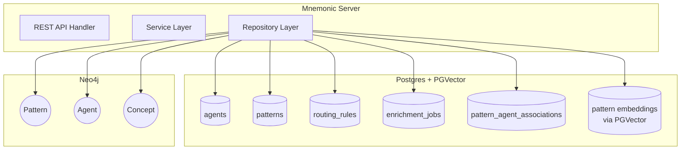
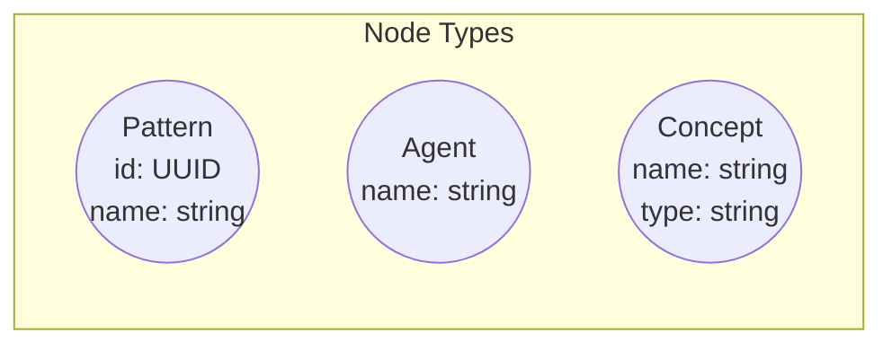
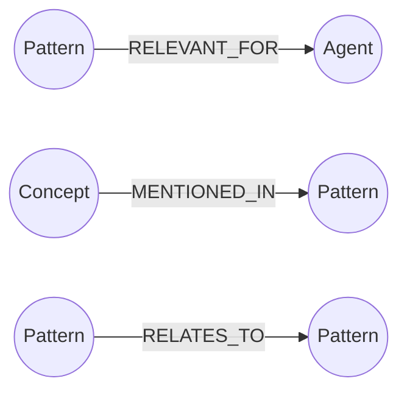
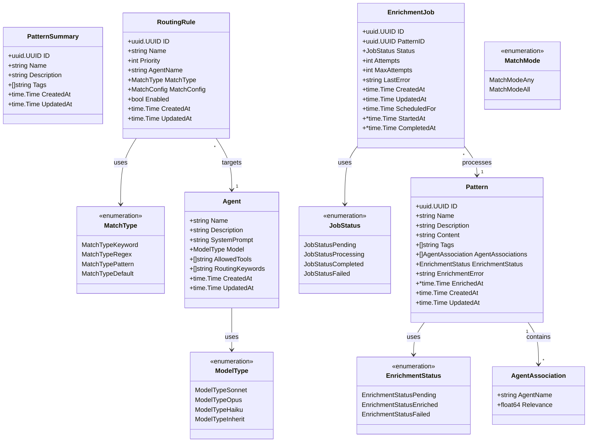
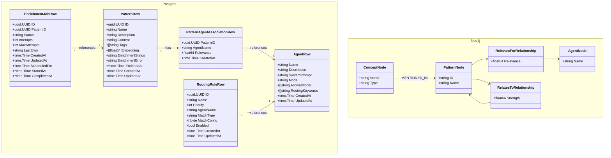
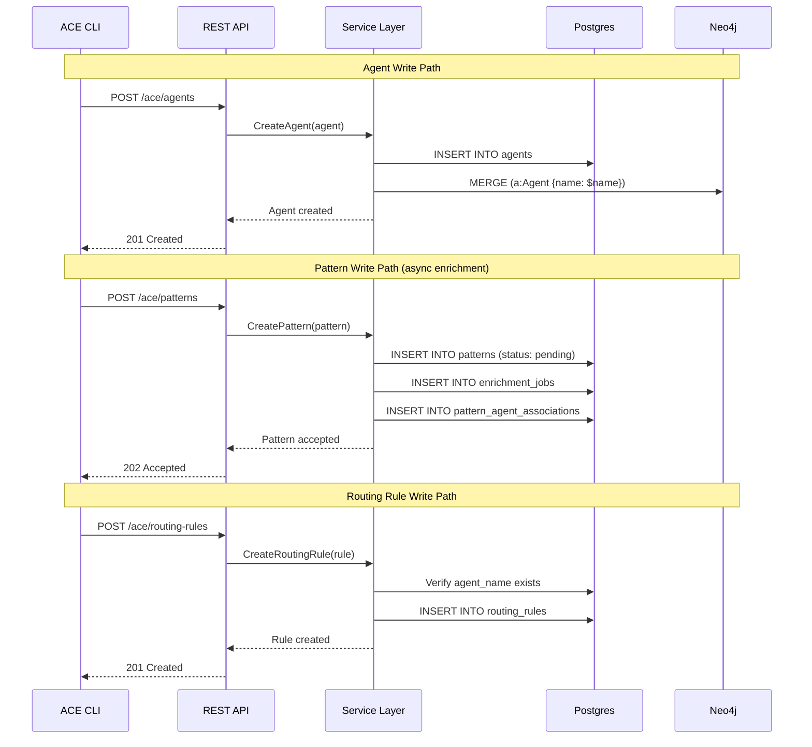
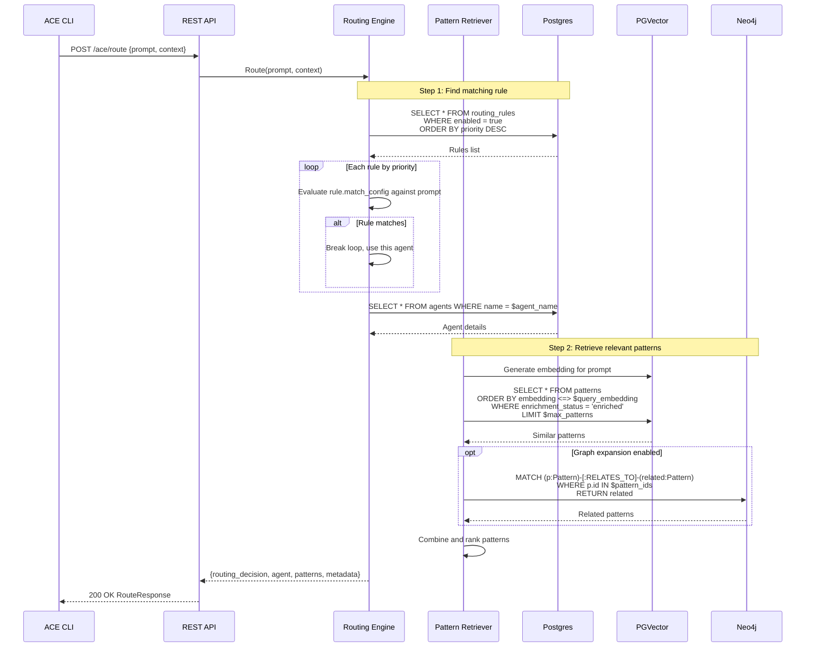
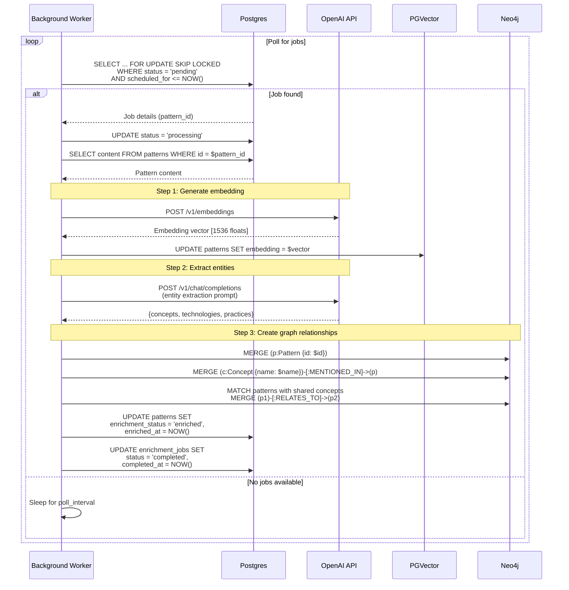

# Data Models

[Back to Architecture Overview](../architecture/00-overview.md) | [Back to System Architecture](../architecture/03-system-architecture.md)

## Table of Contents

- [Overview](#overview)
- [Storage Architecture](#storage-architecture)
- [Postgres Schemas](#postgres-schemas)
  - [agents](#agents)
  - [patterns](#patterns)
  - [routing_rules](#routing_rules)
  - [enrichment_jobs](#enrichment_jobs)
  - [pattern_agent_associations](#pattern_agent_associations)
- [Neo4j Graph Model](#neo4j-graph-model)
  - [Node Types](#node-types)
  - [Relationship Types](#relationship-types)
  - [Schema Constraints](#schema-constraints)
- [Entity Models](#entity-models)
  - [Domain Models](#domain-models)
  - [Repository Models](#repository-models)
  - [API Models](#api-models)
- [Data Flow Diagrams](#data-flow-diagrams)
  - [Write Path](#write-path)
  - [Query Path](#query-path)
  - [Enrichment Path](#enrichment-path)
- [References](#references)

## Overview

[↑ Table of Contents](#table-of-contents)

ACE uses a polyglot persistence strategy with three storage systems:

| Storage    | Purpose                                      | Data Types                     |
| ---------- | -------------------------------------------- | ------------------------------ |
| Postgres   | Primary relational storage                   | Agents, patterns, routing rules |
| PGVector   | Vector embeddings (Postgres extension)       | Pattern embeddings             |
| Neo4j      | Knowledge graph relationships                | Pattern-agent-concept links    |

This document defines the entity schemas, Go struct mappings, and data flow patterns for Mnemonic's storage layer.

## Storage Architecture

[↑ Table of Contents](#table-of-contents)



## Postgres Schemas

[↑ Table of Contents](#table-of-contents)

### agents

Stores agent definitions including system prompts and routing keywords.

```sql
CREATE TABLE agents (
    name VARCHAR(64) PRIMARY KEY,
    description VARCHAR(500) NOT NULL,
    system_prompt TEXT NOT NULL,
    model VARCHAR(20) NOT NULL,
    allowed_tools TEXT[] DEFAULT '{}',
    routing_keywords TEXT[] DEFAULT '{}',
    created_at TIMESTAMP WITH TIME ZONE DEFAULT NOW(),
    updated_at TIMESTAMP WITH TIME ZONE DEFAULT NOW(),

    CONSTRAINT agents_name_format CHECK (name ~ '^[a-z][a-z0-9-]*$'),
    CONSTRAINT agents_model_enum CHECK (model IN ('sonnet', 'opus', 'haiku', 'inherit')),
    CONSTRAINT agents_system_prompt_length CHECK (LENGTH(system_prompt) <= 51200)
);

CREATE INDEX idx_agents_model ON agents (model);
CREATE INDEX idx_agents_updated_at ON agents (updated_at DESC);
```

**Field Descriptions:**

| Field            | Type                     | Description                                        |
| ---------------- | ------------------------ | -------------------------------------------------- |
| `name`           | VARCHAR(64)              | Unique identifier (lowercase, hyphens allowed)     |
| `description`    | VARCHAR(500)             | Human-readable agent description                   |
| `system_prompt`  | TEXT                     | Full system prompt (up to 50KB)                    |
| `model`          | VARCHAR(20)              | Claude model: sonnet, opus, haiku, inherit         |
| `allowed_tools`  | TEXT[]                   | Tool names the agent can use                       |
| `routing_keywords` | TEXT[]                 | Keywords that trigger routing to this agent        |
| `created_at`     | TIMESTAMP WITH TIME ZONE | Creation timestamp                                 |
| `updated_at`     | TIMESTAMP WITH TIME ZONE | Last update timestamp                              |

### patterns

Stores pattern definitions with embedded vectors for similarity search.

```sql
CREATE TABLE patterns (
    id UUID PRIMARY KEY DEFAULT gen_random_uuid(),
    name VARCHAR(128) NOT NULL UNIQUE,
    description VARCHAR(500),
    content TEXT NOT NULL,
    tags TEXT[] DEFAULT '{}',
    embedding vector(1536),
    enrichment_status VARCHAR(20) DEFAULT 'pending',
    enrichment_error TEXT,
    enriched_at TIMESTAMP WITH TIME ZONE,
    created_at TIMESTAMP WITH TIME ZONE DEFAULT NOW(),
    updated_at TIMESTAMP WITH TIME ZONE DEFAULT NOW(),

    CONSTRAINT patterns_content_length CHECK (LENGTH(content) <= 10240),
    CONSTRAINT patterns_enrichment_status_enum CHECK (
        enrichment_status IN ('pending', 'enriched', 'failed')
    )
);

CREATE INDEX idx_patterns_name ON patterns (name);
CREATE INDEX idx_patterns_tags ON patterns USING GIN (tags);
CREATE INDEX idx_patterns_enrichment_status ON patterns (enrichment_status);
CREATE INDEX idx_patterns_updated_at ON patterns (updated_at DESC);

-- Vector index for similarity search (IVFFlat for ~1000 patterns)
CREATE INDEX idx_patterns_embedding ON patterns
USING ivfflat (embedding vector_cosine_ops)
WITH (lists = 100);

-- For larger collections (10K+), use HNSW instead:
-- CREATE INDEX idx_patterns_embedding ON patterns
-- USING hnsw (embedding vector_cosine_ops)
-- WITH (m = 16, ef_construction = 64);
```

**Field Descriptions:**

| Field               | Type                     | Description                                     |
| ------------------- | ------------------------ | ----------------------------------------------- |
| `id`                | UUID                     | Primary key                                     |
| `name`              | VARCHAR(128)             | Unique pattern name                             |
| `description`       | VARCHAR(500)             | Optional short description                      |
| `content`           | TEXT                     | Markdown content (up to 10KB)                   |
| `tags`              | TEXT[]                   | Categorization tags                             |
| `embedding`         | vector(1536)             | OpenAI embedding vector                         |
| `enrichment_status` | VARCHAR(20)              | pending, enriched, or failed                    |
| `enrichment_error`  | TEXT                     | Error message if enrichment failed              |
| `enriched_at`       | TIMESTAMP WITH TIME ZONE | Last successful enrichment timestamp            |
| `created_at`        | TIMESTAMP WITH TIME ZONE | Creation timestamp                              |
| `updated_at`        | TIMESTAMP WITH TIME ZONE | Last update timestamp                           |

### routing_rules

Stores routing rules that determine agent selection based on prompt matching.

```sql
CREATE TABLE routing_rules (
    id UUID PRIMARY KEY DEFAULT gen_random_uuid(),
    name VARCHAR(128) NOT NULL UNIQUE,
    priority INTEGER NOT NULL DEFAULT 0,
    agent_name VARCHAR(64) NOT NULL REFERENCES agents(name) ON DELETE RESTRICT,
    match_type VARCHAR(20) NOT NULL,
    match_config JSONB NOT NULL,
    enabled BOOLEAN DEFAULT true,
    created_at TIMESTAMP WITH TIME ZONE DEFAULT NOW(),
    updated_at TIMESTAMP WITH TIME ZONE DEFAULT NOW(),

    CONSTRAINT routing_rules_priority_range CHECK (priority >= 0 AND priority <= 1000),
    CONSTRAINT routing_rules_match_type_enum CHECK (
        match_type IN ('keyword', 'regex', 'pattern', 'default')
    )
);

CREATE INDEX idx_routing_rules_priority ON routing_rules (priority DESC) WHERE enabled = true;
CREATE INDEX idx_routing_rules_agent_name ON routing_rules (agent_name);
CREATE INDEX idx_routing_rules_match_type ON routing_rules (match_type);
```

**Field Descriptions:**

| Field          | Type         | Description                                          |
| -------------- | ------------ | ---------------------------------------------------- |
| `id`           | UUID         | Primary key                                          |
| `name`         | VARCHAR(128) | Human-readable rule name                             |
| `priority`     | INTEGER      | Evaluation order (0-1000, higher first)              |
| `agent_name`   | VARCHAR(64)  | Target agent when rule matches (FK to agents)        |
| `match_type`   | VARCHAR(20)  | keyword, regex, pattern, or default                  |
| `match_config` | JSONB        | Type-specific configuration (see below)              |
| `enabled`      | BOOLEAN      | Whether rule is active                               |
| `created_at`   | TIMESTAMP    | Creation timestamp                                   |
| `updated_at`   | TIMESTAMP    | Last update timestamp                                |

**match_config Structures by match_type:**

```jsonc
// keyword match_type
{
  "keywords": ["go", "golang", "go function"],
  "match_mode": "any"  // or "all"
}

// regex match_type
{
  "pattern": "\\b(go|golang)\\b.*\\b(function|method)\\b",
  "flags": "i"  // optional, e.g., case-insensitive
}

// pattern match_type
{
  "pattern_ids": ["uuid-1", "uuid-2"]
}

// default match_type
{}  // empty config, always matches as fallback
```

### enrichment_jobs

Postgres-backed job queue for asynchronous pattern enrichment processing.

```sql
CREATE TABLE enrichment_jobs (
    id UUID PRIMARY KEY DEFAULT gen_random_uuid(),
    pattern_id UUID NOT NULL REFERENCES patterns(id) ON DELETE CASCADE,
    status VARCHAR(20) NOT NULL DEFAULT 'pending',
    attempts INTEGER NOT NULL DEFAULT 0,
    max_attempts INTEGER NOT NULL DEFAULT 3,
    last_error TEXT,
    created_at TIMESTAMP WITH TIME ZONE DEFAULT NOW(),
    updated_at TIMESTAMP WITH TIME ZONE DEFAULT NOW(),
    scheduled_for TIMESTAMP WITH TIME ZONE DEFAULT NOW(),
    started_at TIMESTAMP WITH TIME ZONE,
    completed_at TIMESTAMP WITH TIME ZONE,

    CONSTRAINT enrichment_jobs_status_enum CHECK (
        status IN ('pending', 'processing', 'completed', 'failed')
    )
);

-- Index for worker polling (only pending jobs that are due)
CREATE INDEX idx_enrichment_jobs_pending ON enrichment_jobs (scheduled_for)
    WHERE status = 'pending';

-- Index for finding jobs by pattern
CREATE INDEX idx_enrichment_jobs_pattern_id ON enrichment_jobs (pattern_id);
```

**Field Descriptions:**

| Field           | Type                     | Description                               |
| --------------- | ------------------------ | ----------------------------------------- |
| `id`            | UUID                     | Primary key                               |
| `pattern_id`    | UUID                     | Pattern to enrich (FK to patterns)        |
| `status`        | VARCHAR(20)              | pending, processing, completed, failed    |
| `attempts`      | INTEGER                  | Number of processing attempts             |
| `max_attempts`  | INTEGER                  | Maximum retry attempts (default: 3)       |
| `last_error`    | TEXT                     | Error message from last failed attempt    |
| `created_at`    | TIMESTAMP WITH TIME ZONE | Job creation timestamp                    |
| `updated_at`    | TIMESTAMP WITH TIME ZONE | Last status update timestamp              |
| `scheduled_for` | TIMESTAMP WITH TIME ZONE | When job should be processed              |
| `started_at`    | TIMESTAMP WITH TIME ZONE | When processing started                   |
| `completed_at`  | TIMESTAMP WITH TIME ZONE | When processing completed                 |

### pattern_agent_associations

Junction table linking patterns to agents with relevance scores.

```sql
CREATE TABLE pattern_agent_associations (
    pattern_id UUID NOT NULL REFERENCES patterns(id) ON DELETE CASCADE,
    agent_name VARCHAR(64) NOT NULL REFERENCES agents(name) ON DELETE CASCADE,
    relevance DOUBLE PRECISION NOT NULL DEFAULT 1.0,
    created_at TIMESTAMP WITH TIME ZONE DEFAULT NOW(),

    PRIMARY KEY (pattern_id, agent_name),
    CONSTRAINT pattern_agent_associations_relevance_range CHECK (
        relevance >= 0.0 AND relevance <= 1.0
    )
);

CREATE INDEX idx_pattern_agent_associations_agent ON pattern_agent_associations (agent_name);
CREATE INDEX idx_pattern_agent_associations_relevance ON pattern_agent_associations (relevance DESC);
```

**Field Descriptions:**

| Field        | Type             | Description                                |
| ------------ | ---------------- | ------------------------------------------ |
| `pattern_id` | UUID             | Pattern FK (part of composite PK)          |
| `agent_name` | VARCHAR(64)      | Agent FK (part of composite PK)            |
| `relevance`  | DOUBLE PRECISION | Relevance score from 0.0 to 1.0            |
| `created_at` | TIMESTAMP        | Association creation timestamp             |

## Neo4j Graph Model

[↑ Table of Contents](#table-of-contents)

Neo4j stores relationship data for pattern discovery and knowledge graph traversal.

### Node Types



#### Pattern Node

Represents a pattern document from the patterns table.

```cypher
(:Pattern {
    id: "uuid-string",          // Matches patterns.id
    name: "go-error-handling"   // Matches patterns.name
})
```

#### Agent Node

Represents an agent definition from the agents table.

```cypher
(:Agent {
    name: "go-software-agent"   // Matches agents.name (primary key)
})
```

#### Concept Node

Represents an extracted entity/concept from pattern content.

```cypher
(:Concept {
    name: "error handling",     // Normalized concept name
    type: "practice"            // concepts, technologies, or practices
})
```

### Relationship Types



#### RELEVANT_FOR

Links a pattern to an agent with a relevance score.

```cypher
(p:Pattern)-[:RELEVANT_FOR {relevance: 0.95}]->(a:Agent)
```

| Property    | Type  | Description                           |
| ----------- | ----- | ------------------------------------- |
| `relevance` | float | Relevance score 0.0-1.0               |

#### MENTIONED_IN

Links a concept extracted from pattern content to the pattern.

```cypher
(c:Concept)-[:MENTIONED_IN]->(p:Pattern)
```

No additional properties; existence indicates the relationship.

#### RELATES_TO

Links patterns that share common concepts or are semantically related.

```cypher
(p1:Pattern)-[:RELATES_TO {strength: 0.8}]->(p2:Pattern)
```

| Property   | Type  | Description                                |
| ---------- | ----- | ------------------------------------------ |
| `strength` | float | Relationship strength based on shared concepts |

### Schema Constraints

```cypher
// Unique constraints
CREATE CONSTRAINT pattern_id IF NOT EXISTS
FOR (p:Pattern) REQUIRE p.id IS UNIQUE;

CREATE CONSTRAINT agent_name IF NOT EXISTS
FOR (a:Agent) REQUIRE a.name IS UNIQUE;

CREATE CONSTRAINT concept_name IF NOT EXISTS
FOR (c:Concept) REQUIRE c.name IS UNIQUE;

// Indexes for common queries
CREATE INDEX pattern_name IF NOT EXISTS
FOR (p:Pattern) ON (p.name);

CREATE INDEX concept_type IF NOT EXISTS
FOR (c:Concept) ON (c.type);
```

## Entity Models

[↑ Table of Contents](#table-of-contents)

### Domain Models

Core business entities used throughout the service layer.



### Repository Models

Database-specific types for the repository layer.



### API Models

Request/response types aligned with the OpenAPI specification.

```mermaid
classDiagram
    direction TB

    namespace RequestResponse {
        class RouteRequest {
            +string Prompt
            +RouteContext Context
            +RouteOptions Options
        }

        class RouteContext {
            +string WorkingDirectory
            +[]string FileTypes
            +[]string RecentAgents
        }

        class RouteOptions {
            +bool IncludePatterns
            +int MaxPatterns
            +float64 PatternRelevanceThreshold
        }

        class RouteResponse {
            +RoutingDecision Routing
            +Agent Agent
            +[]RoutePatternResult Patterns
            +RouteMetadata Metadata
        }

        class RoutingDecision {
            +string AgentName
            +float64 Confidence
            +string Method
            +[]string MatchedKeywords
            +string Reasoning
        }

        class RoutePatternResult {
            +string Name
            +string Content
            +float64 RelevanceScore
            +[]string Tags
        }

        class RouteMetadata {
            +int RoutingDurationMs
            +int PatternRetrievalDurationMs
            +int TotalPatternsConsidered
        }
    }

    namespace EntityRepresentations {
        class Agent {
            +string Name
            +string Description
            +string SystemPrompt
            +string Model
            +[]string AllowedTools
            +[]string RoutingKeywords
            +time.Time CreatedAt
            +time.Time UpdatedAt
        }

        class AgentSummary {
            +string Name
            +string Description
            +string Model
            +time.Time CreatedAt
            +time.Time UpdatedAt
        }

        class Pattern {
            +uuid.UUID ID
            +string Name
            +string Description
            +string Content
            +[]string Tags
            +[]AgentAssociation AgentAssociations
            +time.Time CreatedAt
            +time.Time UpdatedAt
        }

        class AgentAssociation {
            +string AgentName
            +float64 Relevance
        }
    }

    namespace Supporting {
        class Pagination {
            +int Limit
            +string Cursor
            +string NextCursor
            +bool HasMore
        }

        class ErrorResponse {
            +string Type
            +string Title
            +int Status
            +string Detail
            +string Instance
            +string TraceID
            +[]FieldError Errors
        }

        class FieldError {
            +string Field
            +string Code
            +string Message
        }
    }

    RouteRequest --> RouteContext : contains
    RouteRequest --> RouteOptions : contains
    RouteResponse --> RoutingDecision : contains
    RouteResponse --> Agent : contains
    RouteResponse --> RoutePatternResult : contains
    RouteResponse --> RouteMetadata : contains
    Pattern "1" --> "*" AgentAssociation : contains
    ErrorResponse "1" --> "*" FieldError : contains
```



## Data Flow Diagrams

[↑ Table of Contents](#table-of-contents)

### Write Path

Data flow when creating or updating agents, patterns, and routing rules.



### Query Path

Data flow for the primary routing endpoint.



### Enrichment Path

Background job processing for pattern enrichment.



## References

[↑ Table of Contents](#table-of-contents)

- [OpenAPI Specification](../../api/openapi/mnemonic-v1.yaml) - Source of truth for API schemas
- [Pattern Processing](pattern-processing.md) - Enrichment pipeline details
- [API Specification](api-specification.md) - REST API design decisions
- [System Architecture](../architecture/03-system-architecture.md) - Storage stack overview
- [PGVector Documentation](https://github.com/pgvector/pgvector) - Vector similarity search
- [Neo4j Cypher Manual](https://neo4j.com/docs/cypher-manual/) - Graph query language
