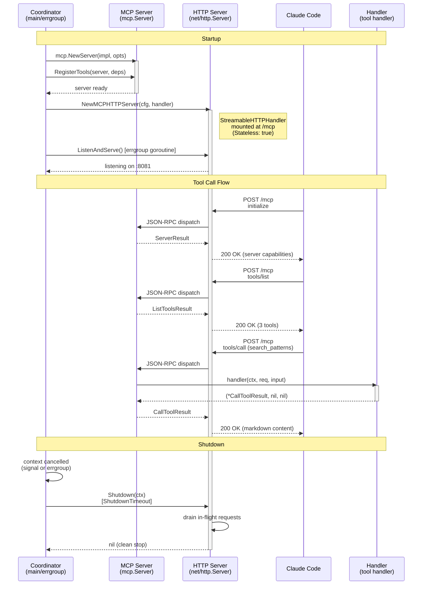

# MCP Server Implementation Design

[Back to Architecture Overview](../architecture/README.md) | [Back to Project README](../../README.md)

## Table of Contents

- [Overview](#overview)
- [Server Setup](#server-setup)
  - [MCP Server Creation](#mcp-server-creation)
  - [Streamable HTTP Handler](#streamable-http-handler)
  - [HTTP Server Lifecycle](#http-server-lifecycle)
  - [Server Lifecycle Diagram](#server-lifecycle-diagram)
- [Tool Registration](#tool-registration)
- [Tool Handler Signatures](#tool-handler-signatures)
  - [search_patterns](#search_patterns)
  - [find_related_patterns](#find_related_patterns)
  - [get_pattern](#get_pattern)
- [Error Handling](#error-handling)
  - [SDK Error Wrapping](#sdk-error-wrapping)
  - [Application Error Types](#application-error-types)
  - [Transport-Level Errors](#transport-level-errors)
- [Observability Integration](#observability-integration)
  - [Receiving Middleware](#receiving-middleware)
  - [Tracing](#tracing)
  - [Metrics](#metrics)
  - [Logging](#logging)
- [Package Structure](#package-structure)
- [Design Decisions](#design-decisions)
- [Architecture References](#architecture-references)

## Overview

> **Architecture Reference:** [System Architecture - Mnemonic Server](../architecture/02-system-architecture.md#mnemonic-server) | [MCP Tools](../architecture/08-mcp-tools.md) | [Communication Patterns - Claude Code to MCP Server](../architecture/03-communication-patterns.md#claude-code-to-mcp-server-communication)

Mnemonic exposes 3 read-only pattern search tools over the Model Context Protocol (MCP). The MCP server listens on port 8081 via Streamable HTTP and serves JSON-RPC 2.0 requests. Claude Code discovers tools via `tools/list` and invokes them via `tools/call`.

All 3 tools are stateless: each invocation is a standalone request/response with no session state carried between calls. The tools return markdown-formatted text content.

**SDK:** `github.com/modelcontextprotocol/go-sdk/mcp` v1.3.1

**Scope:** There are only 3 MCP tools, all for pattern search. Tooling synchronization (agents and skills) uses the REST API, not MCP. This document covers the complete MCP tool surface.

**Tools:**

| Tool                    | Purpose                                                 | Databases Queried |
| ----------------------- | ------------------------------------------------------- | ----------------- |
| `search_patterns`       | Chunk-level semantic search over team knowledge patterns | PGVector (MVP); + Neo4j (post-MVP) |
| `find_related_patterns` | Graph traversal from a given pattern                    | Neo4j             |
| `get_pattern`           | Single pattern retrieval by UUID                        | Postgres + Neo4j  |

## Server Setup

### MCP Server Creation

Create the MCP server with Mnemonic's implementation metadata. The version string comes from the existing `internal/version` package. Pass a `SchemaCache` instance to avoid repeated reflection on tool input structs across invocations.

```go
import (
    "github.com/modelcontextprotocol/go-sdk/mcp"
    "github.com/twistingmercury/mnemonic/internal/version"
)

server := mcp.NewServer(&mcp.Implementation{
    Name:    "mnemonic",
    Version: version.Version(),
}, &mcp.ServerOptions{
    SchemaCache: mcp.NewSchemaCache(),
})
```

The `SchemaCache` field accepts a `*mcp.SchemaCache` pointer. `NewSchemaCache()` creates a new cache instance that stores JSON Schemas inferred from handler input structs via reflection. Without a cache, the SDK re-reflects on every `tools/list` call. Since Mnemonic's tool schemas are static (registered once at startup), caching is safe and avoids redundant work. The cache is concurrent-safe and unbounded, but for a fixed set of 3 tools the memory footprint is negligible.

After creation, tools are registered on this server instance (see [Tool Registration](#tool-registration)).

### Streamable HTTP Handler

Wrap the MCP server in a `StreamableHTTPHandler`, which implements `http.Handler` and serves JSON-RPC 2.0 over HTTP POST at `/mcp`. Enable `Stateless` mode because all 3 pattern search tools are stateless -- no session state is carried between calls.

```go
handler := mcp.NewStreamableHTTPHandler(func(r *http.Request) *mcp.Server {
    return server
}, &mcp.StreamableHTTPOptions{
    Stateless: true,
})
```

The factory function receives each incoming HTTP request and returns the server to handle it. Since Mnemonic uses a single shared server instance (stateless tools, no per-session state), the factory always returns the same server.

Setting `Stateless: true` tells the SDK to skip session creation and tracking. Each request is handled independently without allocating session state. This matches the tool semantics (every invocation is a standalone request/response) and eliminates the session lifecycle overhead that would otherwise require `session_count` and `active_sessions` metrics.

**Note:** The `MCPServerConfig.SessionTimeout` field (from the [configuration design](configuration.md)) is not used in stateless mode. It exists in the config struct for future use if session-based features (e.g., streaming subscriptions) are added post-MVP.

### HTTP Server Lifecycle

Mount the `StreamableHTTPHandler` on a `net/http.Server` using the existing `MCPServerConfig`.

```go
import (
    "fmt"
    "net/http"

    "github.com/twistingmercury/mnemonic/internal/config"
)

// NewMCPHTTPServer creates the net/http.Server for the MCP endpoint.
// The caller is responsible for starting and stopping the server
// (typically via errgroup).
func NewMCPHTTPServer(cfg config.MCPServerConfig, mcpHandler http.Handler) *http.Server {
    mux := http.NewServeMux()
    mux.Handle("/mcp", mcpHandler)

    return &http.Server{
        Addr:         fmt.Sprintf("%s:%d", cfg.Host, cfg.Port),
        Handler:      mux,
        ReadTimeout:  cfg.ReadTimeout,
        WriteTimeout: cfg.WriteTimeout,
        IdleTimeout:  cfg.IdleTimeout,
    }
}
```

The returned `*http.Server` exposes `ListenAndServe()` and `Shutdown(ctx)` for the server lifecycle coordinator to call. The coordinator (using `errgroup.WithContext`) starts the MCP server alongside the Admin API server and handles graceful shutdown with `cfg.ShutdownTimeout`.

**Interface to errgroup:** The MCP server package does not manage the errgroup itself. It provides:

1. `NewMCPHTTPServer` -- returns a configured `*http.Server`
2. The caller starts it via `srv.ListenAndServe()` in an errgroup goroutine
3. The caller stops it via `srv.Shutdown(ctx)` when the context is cancelled

### Server Lifecycle Diagram



## Tool Registration

All 3 tools are registered on the server after creation. Each call to `mcp.AddTool` associates a `mcp.Tool` definition with a typed handler function. The SDK infers `InputSchema` from the handler's input struct via `jsonschema` struct tags.

```go
// RegisterTools registers all 3 pattern search tools on the MCP server.
// The deps parameter provides access to services and repositories
// needed by tool handlers. Its concrete type will be determined by
// the service layer design.
func RegisterTools(server *mcp.Server, deps ToolDependencies) {
    mcp.AddTool(server, searchPatternsTool, handleSearchPatterns(deps))
    mcp.AddTool(server, findRelatedPatternsTool, handleFindRelatedPatterns(deps))
    mcp.AddTool(server, getPatternTool, handleGetPattern(deps))
}
```

Tool definitions:

```go
var searchPatternsTool = &mcp.Tool{
    Name:        "search_patterns",
    Description: "Semantic search over team knowledge patterns. Returns pattern chunks ranked by vector similarity. Supports filtering by language, domain, tags, and agent. Only enriched patterns appear in results.",
}

var findRelatedPatternsTool = &mcp.Tool{
    Name:        "find_related_patterns",
    Description: "Find patterns related to a given pattern via the knowledge graph. Traverses RELATED_TO edges in Neo4j and returns patterns ranked by concept overlap strength.",
}

var getPatternTool = &mcp.Tool{
    Name:        "get_pattern",
    Description: "Retrieve a specific pattern by ID. Returns full pattern content, metadata, related patterns, and extracted concepts. Graph relationships are omitted when enrichment is still pending.",
}
```

## Tool Handler Signatures

Each handler follows the SDK's `ToolHandlerFor[In, Out]` generic signature with 3 return values:

```go
func(ctx context.Context, req *mcp.CallToolRequest, input In) (*mcp.CallToolResult, Out, error)
```

Where `In` is the handler's input struct and `Out` is the structured output type. For tools returning only text content (no structured output beyond the `CallToolResult`), `Out` is `any` and the value is `nil`.

The SDK validates the incoming JSON against the schema inferred from `In` before calling the handler. If validation fails, the SDK returns a JSON-RPC `-32602 Invalid params` error without invoking the handler.

When the handler returns a non-nil error, the SDK wraps it as `isError: true` in the tool result (see [Error Handling](#error-handling)).

When the handler returns `nil` error, it must return a `*mcp.CallToolResult` with text content containing the markdown response. The second return value (`Out`) is always `nil` for these text-only tools.

**Dependency injection:** Each handler is created via a closure that captures `ToolDependencies`. See [service-layer.md#tooldependencies-mcp-facade](service-layer.md#tooldependencies-mcp-facade) for the full interface definition and concrete implementation.

**`jsonschema` struct tag convention:** The SDK uses `github.com/google/jsonschema-go` for schema inference. The `jsonschema` tag value is interpreted as the field's **description** string in its entirety -- it does not support comma-separated directives like `required` or `description=`. Required/optional status is controlled by the `json` tag:

- Fields **without** `omitempty` on the `json` tag are **required** in the inferred schema.
- Fields **with** `omitempty` on the `json` tag are **optional** in the inferred schema.

### search_patterns

**Input struct:**

```go
// SearchPatternsInput defines the parameters for the search_patterns tool.
// The SDK infers InputSchema from jsonschema struct tags.
//
// Required vs optional:
//   - Query: required (no omitempty)
//   - All other fields: optional (omitempty)
//
// Pointer types (*int, *float64) distinguish "omitted" from "explicit zero":
//   - nil means the caller did not provide the field (apply default)
//   - non-nil zero means the caller explicitly set the value to 0
type SearchPatternsInput struct {
    Query     string    `json:"query"                jsonschema:"Natural language search query"`
    Limit     *int      `json:"limit,omitempty"      jsonschema:"Maximum number of results to return (default 10, max 50)"`
    Threshold *float64  `json:"threshold,omitempty"   jsonschema:"Minimum cosine similarity score 0.0-1.0 (default 0.7)"`
    Tags      []string  `json:"tags,omitempty"        jsonschema:"Conjunctive (AND) filter by tag. Pattern must contain ALL specified tags (SQL: tags @> $tags::jsonb)."`
    Agent     string    `json:"agent,omitempty"       jsonschema:"Filter results by agent association"`
    Language  string    `json:"language,omitempty"    jsonschema:"Filter by programming language (go, python, typescript, shell, sql, agnostic)"`
    Domain    string    `json:"domain,omitempty"      jsonschema:"Filter by domain (backend, api-design, testing, frontend, infrastructure, data, agnostic)"`
}
```

**Handler:**

```go
// handleSearchPatterns returns a handler for the search_patterns tool.
func handleSearchPatterns(deps ToolDependencies) func(ctx context.Context, req *mcp.CallToolRequest, input SearchPatternsInput) (*mcp.CallToolResult, any, error) {
    return func(ctx context.Context, req *mcp.CallToolRequest, input SearchPatternsInput) (*mcp.CallToolResult, any, error) {
        // 1. Apply defaults: limit=10 if nil, threshold=0.7 if nil
        // 2. Validate constraints: limit 1-50, threshold 0.0-1.0
        // 3. Generate query embedding via OpenAI
        // 4. If Agent is set, resolve to pattern IDs:
        //    a. Look up the agent by name to get agent_id
        //    b. Query pattern_agent_associations for (agent_id) -> []pattern_id
        //    c. Pass the resulting PatternIDs to SimilarityOptions.PatternIDs
        //       (this pre-filters the PGVector search to agent-scoped patterns)
        // 5. Filter by Language/Domain if set
        // 6. Chunk-level PGVector cosine similarity search via FindSimilar():
        //    - Searches pattern_chunks.embedding (not patterns.embedding)
        //    - SimilarityOptions.Tags uses conjunctive (AND) filtering
        //      (SQL: tags @> $tags::jsonb -- pattern must contain ALL specified tags)
        //    - SimilarityOptions.PatternIDs restricts to agent-associated patterns (step 4)
        // 7. Format results as markdown (ChunkMatch results with section_title)
        // 8. Return *mcp.CallToolResult with text content, nil, nil
        // Post-MVP: add Neo4j graph score blending
        //
        // On error: return nil, nil, err (SDK sets isError: true)
    }
}
```

**Markdown response format:**

> **Score format note:** `search_patterns` displays similarity as a percentage (e.g., "92% match") because it reflects a single vector similarity score that is intuitive as a percentage. `find_related_patterns` uses a decimal (e.g., "similarity: 0.85") because the score represents computed concept-overlap strength, where the raw value is more meaningful to the caller. `get_pattern` uses the same decimal format as `find_related_patterns` for consistency in its related patterns list.

```text
Found N chunks matching 'query' (filtered by agent: X):

---

## pattern-name › Section Title (92% match)

**Tags:** go, errors, best-practices
**Language:** go | **Domain:** backend

Chunk content here...

---

## another-pattern › Another Section (85% match)

**Tags:** go, testing
**Language:** go | **Domain:** backend

Chunk content here...
```

When no results match, the response is:

```text
No patterns found matching 'query'.
```

### find_related_patterns

**Input struct:**

```go
// FindRelatedPatternsInput defines the parameters for the find_related_patterns tool.
type FindRelatedPatternsInput struct {
    PatternID string `json:"pattern_id"          jsonschema:"UUID of the pattern to find relations for"`
    Limit     *int   `json:"limit,omitempty"     jsonschema:"Maximum number of related patterns to return (default 5, max 20)"`
}
```

**Handler:**

```go
// handleFindRelatedPatterns returns a handler for the find_related_patterns tool.
func handleFindRelatedPatterns(deps ToolDependencies) func(ctx context.Context, req *mcp.CallToolRequest, input FindRelatedPatternsInput) (*mcp.CallToolResult, any, error) {
    return func(ctx context.Context, req *mcp.CallToolRequest, input FindRelatedPatternsInput) (*mcp.CallToolResult, any, error) {
        // 1. Parse and validate pattern_id as UUID
        // 2. Apply default: limit=5 if nil
        // 3. Validate constraints: limit 1-20
        // 4. Traverse RELATED_TO edges in Neo4j from the source pattern
        // 5. Order results by similarity descending
        // 6. For each related pattern, include relationship type, similarity, shared concepts
        // 7. Format results as markdown
        // 8. Return *mcp.CallToolResult with text content, nil, nil
        //
        // On not found: return nil, nil, fmt.Errorf("%w: %s", ErrPatternNotFound, input.PatternID)
        // On error: return nil, nil, err
    }
}
```

**Markdown response format:**

```text
Found N patterns related to 'source-pattern-name':

---

## related-pattern-name (similarity: 0.85)

**Relationship:** RELATED_TO
**Shared concepts:** error handling, retry logic

Full pattern content here...

---

## another-related (similarity: 0.72)

**Relationship:** RELATED_TO
**Shared concepts:** observability

Full pattern content here...
```

When the source pattern has no relationships:

```text
No related patterns found for 'source-pattern-name'.
```

### get_pattern

**Input struct:**

```go
// GetPatternInput defines the parameters for the get_pattern tool.
type GetPatternInput struct {
    ID string `json:"id" jsonschema:"Pattern UUID to fetch"`
}
```

**Handler:**

```go
// handleGetPattern returns a handler for the get_pattern tool.
func handleGetPattern(deps ToolDependencies) func(ctx context.Context, req *mcp.CallToolRequest, input GetPatternInput) (*mcp.CallToolResult, any, error) {
    return func(ctx context.Context, req *mcp.CallToolRequest, input GetPatternInput) (*mcp.CallToolResult, any, error) {
        // 1. Parse and validate id as UUID
        // 2. Query Postgres for pattern content and metadata
        // 3. Query Neo4j for graph relationships and extracted concepts
        //    (omit graph section if enrichment is still pending)
        // 4. Format as markdown with full content, metadata, relationships, concepts
        // 5. Return *mcp.CallToolResult with text content, nil, nil
        //
        // On not found: return nil, nil, fmt.Errorf("%w: %s", ErrPatternNotFound, input.ID)
        // On error: return nil, nil, err
    }
}
```

**Markdown response format:**

```text
## pattern-name

**ID:** 550e8400-e29b-41d4-a716-446655440001
**Tags:** go, errors, best-practices
**Enrichment:** enriched (2025-01-10T08:05:00Z)

## Content

Full pattern content here...

### Related Patterns

- **related-pattern-name** (RELATED_TO, similarity: 0.85)
- **another-related** (RELATED_TO, similarity: 0.72)

### Extracted Concepts

- **error-wrapping**: Wrapping errors with context using fmt.Errorf and %w
- **sentinel-errors**: Package-level error variables for comparison
```

When enrichment is pending, the "Related Patterns" and "Extracted Concepts" sections are omitted and the enrichment line reads `**Enrichment:** pending`.

When enrichment has failed, the graph sections are also omitted and the enrichment line includes the error message:

```text
## pattern-name

**ID:** 550e8400-e29b-41d4-a716-446655440001
**Tags:** go, errors
**Enrichment:** failed -- embedding generation timed out after 30s

## Content

Full pattern content here...
```

## Error Handling

### SDK Error Wrapping

When a handler returns a non-nil error, the SDK wraps it automatically:

1. The SDK creates a `CallToolResult` with `IsError: true`
2. The error message is included as text content
3. The JSON-RPC response is a normal 200 with the error flag in the result

This means handlers signal application-level errors by returning Go errors. The handler does not need to construct `CallToolResult` manually for error cases.

```go
// Handler returns a regular Go error -- SDK wraps it as isError: true
return nil, nil, fmt.Errorf("pattern %s not found", id)

// SDK produces:
// {"content": [{"type": "text", "text": "pattern abc-123 not found"}], "isError": true}
```

**Important distinction:** The SDK treats regular Go `error` values and `*jsonrpc.Error` values differently:

- **Regular `error`**: The SDK wraps it as an application-level error (`isError: true` in the tool result, HTTP 200). This is the correct path for not-found, invalid input, and service-unavailable conditions.
- **`*jsonrpc.Error`**: If a handler returns a `*jsonrpc.Error` (from `github.com/modelcontextprotocol/go-sdk/jsonrpc`), the SDK propagates it as a **protocol-level** JSON-RPC error response instead of wrapping it in a tool result. Handlers should never return `*jsonrpc.Error` -- those codes are reserved for the SDK's own transport-level error handling.

### Application Error Types

Define sentinel errors in the mcpserver package for the 3 application-level error patterns from [08-mcp-tools.md](../architecture/08-mcp-tools.md#application-level-errors):

```go
package mcpserver

import "errors"

// ErrPatternNotFound is returned when a pattern ID does not exist.
// Applies to: get_pattern, find_related_patterns.
var ErrPatternNotFound = errors.New("pattern not found")

// ErrInvalidInput is returned when handler-level validation fails
// (constraints the SDK schema validation does not catch, such as
// limit exceeding maximum or threshold out of range).
// Applies to: all 3 tools.
var ErrInvalidInput = errors.New("invalid input")

// ErrServiceUnavailable is returned when a backend database
// (Postgres, Neo4j) is unreachable.
// Applies to: all 3 tools.
var ErrServiceUnavailable = errors.New("service unavailable")
```

Handlers wrap these sentinels with context:

```go
// Not found
return nil, nil, fmt.Errorf("%w: %s", ErrPatternNotFound, id)

// Invalid input
return nil, nil, fmt.Errorf("%w: limit must be between 1 and 50, got %d", ErrInvalidInput, input.Limit)

// Service unavailable
return nil, nil, fmt.Errorf("%w: postgres connection failed: %v", ErrServiceUnavailable, err)
```

Callers can use `errors.Is` to distinguish error types if needed (for example, in observability to set different span status codes or metric labels).

### Transport-Level Errors

Transport-level errors are handled by the MCP SDK and the HTTP server, not by tool handlers. These use standard JSON-RPC 2.0 error codes as documented in [08-mcp-tools.md](../architecture/08-mcp-tools.md#transport-level-errors):

| Code   | Meaning          | Handled By |
| ------ | ---------------- | ---------- |
| -32700 | Parse error      | SDK        |
| -32600 | Invalid request  | SDK        |
| -32601 | Method not found | SDK        |
| -32602 | Invalid params   | SDK        |
| -32603 | Internal error   | SDK        |

No custom implementation is needed for transport-level errors.

## Observability Integration

> **Architecture Reference:** [Observability Implementation](observability-implementation.md) | [Observability Architecture](../architecture/07-observability-architecture.md)

### Receiving Middleware

The SDK supports `AddReceivingMiddleware` for cross-cutting concerns applied to every incoming JSON-RPC method call before it reaches the default handler. Use this for request-scoped tracing and metrics setup instead of duplicating instrumentation in each handler.

The SDK's middleware types are:

```go
// MethodHandler handles MCP messages.
type MethodHandler func(ctx context.Context, method string, req mcp.Request) (mcp.Result, error)

// Middleware wraps a MethodHandler.
type Middleware func(mcp.MethodHandler) mcp.MethodHandler
```

`AddReceivingMiddleware` accepts one or more `Middleware` functions. Each wraps the inner `MethodHandler`, forming a chain. The `method` parameter is the JSON-RPC method string (e.g., `"tools/call"`, `"tools/list"`, `"initialize"`). To extract the specific tool name for a `tools/call` request, inspect the request parameters.

```go
// NewLoggingMiddleware creates MCP receiving middleware that adds tracing and metrics.
// Logger and metrics registry are injected as constructor parameters.
func NewLoggingMiddleware(logger zerolog.Logger, mcpMetrics *metrics.MCP, tracer trace.Tracer) mcp.Middleware {
    return func(next mcp.MethodHandler) mcp.MethodHandler {
        return func(ctx context.Context, method string, req mcp.Request) (mcp.Result, error) {
            // Determine the span name. For tools/call, extract the tool name
            // from the request params; for other methods, use the method string.
            spanName := method
            if method == "tools/call" {
                if ctr, ok := req.GetParams().(*mcp.CallToolParamsRaw); ok {
                    spanName = fmt.Sprintf("mcp.%s", ctr.Name)
                }
            }

            // Start trace span
            ctx, span := tracer.Start(ctx, spanName)
            defer span.End()

            // Record start time for metrics
            start := time.Now()

            // Call next handler in chain
            result, err := next(ctx, method, req)

            // Record metrics (only for tool invocations)
            if method == "tools/call" {
                duration := float64(time.Since(start).Milliseconds())
                toolName := strings.TrimPrefix(spanName, "mcp.")
                mcpMetrics.RecordToolInvocation(ctx, toolName, duration)
            }

            if err != nil {
                span.SetStatus(codes.Error, err.Error())
            }

            return result, err
        }
    }
}

// Usage:
server.AddReceivingMiddleware(NewLoggingMiddleware(logger, metricsRegistry.MCP, tracer))
```

This centralizes tracing and metrics so individual tool handlers do not need boilerplate instrumentation code. Tool handlers still log domain-specific fields (query preview, pattern ID, result count) directly.

**Note:** The `req.GetParams()` call returns the params as an `mcp.Params` interface. For `tools/call`, the concrete type is `*mcp.CallToolParamsRaw` which has a `Name` field containing the tool name. Middleware receives all method calls (not just tool calls), so the `method == "tools/call"` guard is needed to avoid casting errors on other methods like `initialize` or `tools/list`.

### Tracing

The MCP server operates over plain `net/http`, not Gin, so the otelgin middleware does not apply. Cross-cutting trace spans are created by the receiving middleware (see above). Tool handlers add domain-specific span attributes and create child spans for database operations.

Span naming follows the convention from the [observability design](observability-implementation.md#span-naming-conventions):

| Tool                    | Span Name                   | Attributes                   |
| ----------------------- | --------------------------- | ---------------------------- |
| `search_patterns`       | `mcp.search_patterns`       | `tool.name`, `query.preview` |
| `find_related_patterns` | `mcp.find_related_patterns` | `tool.name`, `pattern.id`    |
| `get_pattern`           | `mcp.get_pattern`           | `tool.name`, `pattern.id`    |

Child spans follow the conventions for database operations (`postgres.query`, `pgvector.search`, `neo4j.query`).

**Trace context flow:** The MCP SDK's `StreamableHTTPHandler` receives the HTTP request and calls the tool handler with a `context.Context`. If the incoming HTTP request carries W3C Trace Context headers (`traceparent`, `tracestate`), the SDK or an outer HTTP middleware can propagate them into the context. The tool handler creates child spans from this context, linking MCP tool traces to any parent trace from the caller.

For MVP (localhost, no upstream trace context), tool handler spans are trace roots.

### Metrics

The MCP metrics instruments are already defined in `internal/metrics/mcp.go` per the [observability design](observability-implementation.md#mcp-server-metrics). The receiving middleware records metrics for every tool invocation (see [Receiving Middleware](#receiving-middleware)).

The relevant metrics:

| Metric                          | Type      | Description                    |
| ------------------------------- | --------- | ------------------------------ |
| `mnemonic.mcp.tool_invocations` | Counter   | Number of MCP tool invocations |
| `mnemonic.mcp.tool_duration`    | Histogram | Tool invocation duration (ms)  |

Session metrics (`session_count`, `active_sessions`) are defined in the `internal/metrics/mcp.go` metrics registry but are not recorded in stateless mode. The instruments exist so they do not need to be added later if session-based features are introduced post-MVP, but in the current stateless configuration they remain at zero.

### Logging

Tool handlers use the zerolog logger injected at construction time. Since the MCP server uses `net/http` (not Gin), the otelx Gin logging middleware does not apply. Instead, handlers log directly:

```go
// logger is injected into the handler struct or closure at construction time
logger.Info().
    Str("tool", "search_patterns").
    Str("query_preview", truncate(input.Query, 100)).
    Msg("mcp tool invoked")
```

Log events for MCP tool calls:

| Event          | Level | Fields                                  |
| -------------- | ----- | --------------------------------------- |
| Tool invoked   | Info  | `tool`, `query_preview` or `pattern_id` |
| Tool completed | Info  | `tool`, `duration_ms`, `result_count`   |
| Tool error     | Error | `tool`, `error`, `duration_ms`          |

## Package Structure

MCP server code lives in `internal/mcpserver/` (not `internal/mcp/`). The package name `mcpserver` avoids colliding with the SDK's `mcp` package, which would otherwise require import aliases in every file.

Filesystem paths relative to the repository root:

```text
src/mnemonic/internal/mcpserver/
    server.go       -- NewMCPServer, NewMCPHTTPServer, RegisterTools
    tools.go        -- Tool definitions (mcp.Tool vars)
    handlers.go     -- Handler functions for all 3 tools
    input.go        -- Input structs (SearchPatternsInput, etc.)
    errors.go       -- Sentinel errors (ErrPatternNotFound, etc.)
    deps.go         -- ToolDependencies interface
    middleware.go   -- Receiving middleware (tracing, metrics)
```

**File responsibilities:**

| File            | Contents                                                                                               |
| --------------- | ------------------------------------------------------------------------------------------------------ |
| `server.go`     | `NewMCPServer` (creates `mcp.Server`), `NewMCPHTTPServer` (creates `net/http.Server`), `RegisterTools` |
| `tools.go`      | `searchPatternsTool`, `findRelatedPatternsTool`, `getPatternTool` variable definitions                 |
| `handlers.go`   | `handleSearchPatterns`, `handleFindRelatedPatterns`, `handleGetPattern` closures                       |
| `input.go`      | `SearchPatternsInput`, `FindRelatedPatternsInput`, `GetPatternInput` structs                           |
| `errors.go`     | `ErrPatternNotFound`, `ErrInvalidInput`, `ErrServiceUnavailable` sentinels                             |
| `deps.go`       | `ToolDependencies` interface definition                                                                |
| `middleware.go`  | `AddObservabilityMiddleware` -- receiving middleware for tracing and metrics                            |

## Design Decisions

### Explicit InputSchema for richer validation (deferred)

The SDK infers `InputSchema` from Go struct tags via `github.com/google/jsonschema-go`. This inferred schema does not support `minimum`, `maximum`, `maxLength`, or `pattern` constraints. In theory, providing an explicit `InputSchema` as `json.RawMessage` on the `Tool` struct would let the SDK validate these constraints before calling the handler.

This is deferred for MVP because:

1. Handler-level validation already covers these constraints (limit range, threshold range, UUID format).
2. The SDK's schema validation rejects structurally invalid JSON (wrong types, missing required fields), which catches the most common errors.
3. The remaining constraints (numeric ranges, string patterns) produce clear error messages from handler-level validation that are more descriptive than generic schema violation errors.
4. Adding explicit schemas means maintaining JSON Schema alongside Go struct tags, creating a sync risk.

If Claude Code or other MCP clients benefit from richer schema introspection (e.g., to show parameter constraints in tool discovery), explicit schemas can be added later by setting `Tool.InputSchema` to a `json.RawMessage`.

## Architecture References

- [MCP Tools](../architecture/08-mcp-tools.md) -- authoritative tool definitions, parameters, response formats, error handling
- [System Architecture](../architecture/02-system-architecture.md) -- component breakdown and data flow
- [Communication Patterns](../architecture/03-communication-patterns.md) -- MCP protocol overview and request flow
- [Configuration Design](configuration.md) -- `MCPServerConfig` struct and defaults
- [Observability Implementation](observability-implementation.md) -- span naming conventions, MCP metrics, structured logging

---

Copyright (c) 2025 Jeremy K. Johnson. All rights reserved.
