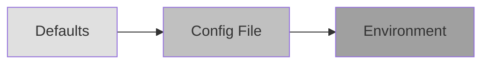

# Mnemonic Server Configuration

[Back to Architecture Overview](../../architecture/00-overview.md) | [Back to Project README](../../../README.md)

## Table of Contents

- [Overview](#overview)
- [Configuration Loading Order](#configuration-loading-order)
  - [Precedence Rules](#precedence-rules)
  - [Loading Behavior](#loading-behavior)
- [Configuration File](#configuration-file)
- [Environment Variables](#environment-variables)
- [OpenTelemetry Standard Variables](#opentelemetry-standard-variables)
- [otelx Dependency](#otelx-dependency)
- [Configuration Reference](#configuration-reference)
- [Environment Variable Naming Conventions](#environment-variable-naming-conventions)
- [File Discovery Order](#file-discovery-order)
- [Security Considerations](#security-considerations)
  - [Secrets Handling](#secrets-handling)
  - [Environment Variable Security](#environment-variable-security)
  - [Configuration Validation](#configuration-validation)
  - [Embedding Dimension Validation](#embedding-dimension-validation)
- [Configuration Model](#configuration-model)
- [References](#references)

## Overview

[Table of Contents](#table-of-contents)

> **Architecture Reference:** [System Architecture - Component Breakdown](../../architecture/03-system-architecture.md#component-breakdown) | [Deployment Architecture - Component Deployment](../../architecture/05-deployment-architecture.md#component-deployment)

The Mnemonic server uses a layered configuration system that supports multiple sources with well-defined precedence. This design enables:

- **Sensible defaults**: Work out of the box with minimal configuration
- **File-based configuration**: Persistent settings in YAML format
- **Environment overrides**: Container and CI/CD friendly

| Component | Config Prefix | Config File                 | Primary Use Case           |
| --------- | ------------- | --------------------------- | -------------------------- |
| Mnemonic  | `MNEMONIC_`   | `/etc/mnemonic/config.yaml` | Server deployment settings |

For ACE CLI configuration, see [ACE CLI Configuration](../ace_cli/configuration.md).

## Configuration Loading Order

[Table of Contents](#table-of-contents)

### Precedence Rules

Configuration values are loaded in the following order, with later sources overriding earlier ones:

```text
1. Compiled defaults (lowest priority)
2. Configuration file
3. Environment variables (highest priority)
```



### Loading Behavior

**Merge vs Replace**:

- Scalar values (strings, numbers, booleans): Later sources replace earlier values
- Arrays: Later sources replace entire array (no merging)
- Maps/Objects: Keys are merged; later sources override individual keys

## Configuration File

[Table of Contents](#table-of-contents)

> **Architecture Reference:** [System Architecture - Mnemonic](../../architecture/03-system-architecture.md#mnemonic) | [Deployment Architecture - Mnemonic](../../architecture/05-deployment-architecture.md#mnemonic)

The Mnemonic server reads configuration from YAML files.

**Default location**: `/etc/mnemonic/config.yaml` (production) or `./config.yaml` (development)

```yaml
# Mnemonic server configuration file
# /etc/mnemonic/config.yaml

# HTTP server settings
server:
  host: 0.0.0.0
  port: 8080
  read_timeout: 30s
  write_timeout: 30s
  idle_timeout: 120s

  # TLS configuration (optional, typically handled by reverse proxy)
  tls:
    enabled: false
    cert_file: ""
    key_file: ""

# Database connections
database:
  postgres:
    host: localhost
    port: 5432
    database: mnemonic
    username: mnemonic
    # password should be set via MNEMONIC_DATABASE_POSTGRES_PASSWORD
    password: ""
    ssl_mode: prefer
    max_open_conns: 25
    max_idle_conns: 5
    conn_max_lifetime: 5m

  neo4j:
    uri: bolt://localhost:7687
    username: neo4j
    # password should be set via MNEMONIC_DATABASE_NEO4J_PASSWORD
    password: ""
    database: neo4j
    max_connection_pool_size: 50
    connection_acquisition_timeout: 60s

# External services
openai:
  # API key should be set via MNEMONIC_OPENAI_API_KEY
  api_key: ""
  embedding_model: text-embedding-3-small
  embedding_dimensions: 1536
  extraction_model: gpt-4o-mini
  max_requests_per_minute: 500
  retry_attempts: 3
  retry_delay: 1s

# Rate limiting
# NOTE: Post-MVP feature - Server-side rate limiting will be available in a later phase
rate_limit:
  enabled: false
  requests_per_second: 100
  burst_size: 200

  # Per-user rate limits
  per_user:
    requests_per_minute: 60
    burst_size: 10

# Routing engine
routing:
  cache:
    # NOTE: This is SERVER-SIDE caching within Mnemonic. It determines how often
    # Mnemonic refreshes its internal rule cache from the database. This is different
    # from ACE CLI's cache.ttl (CLIENT-SIDE), which controls how long the CLI caches
    # routing decisions before re-querying Mnemonic.
    #
    # MVP LIMITATION: These settings exist for forward compatibility but are IGNORED
    # in MVP. Rules are loaded once at startup and cached indefinitely. Restart the
    # service to reload rules after database changes. Background refresh is Post-MVP.
    refresh_ttl: 5m       # IGNORED IN MVP: How often Mnemonic refreshes rules from database
    startup_timeout: 30s  # IGNORED IN MVP: Timeout for initial cache load

  # Default agent when no rules match
  default_agent: general-agent

# Enrichment worker
enrichment:
  # Number of concurrent workers
  worker_count: 2

  # How often to poll for new jobs
  poll_interval: 5s

  # Maximum retry attempts for failed jobs
  max_attempts: 3

  # Delay between retry attempts
  retry_delay: 30s

  # Job timeout (stuck jobs are reclaimed after this duration)
  job_timeout: 5m

# Logging
logging:
  # Log level: debug, info, warn, error
  level: info

  # Log format: json, text
  format: json

  # Include caller information
  include_caller: false

# Observability
observability:
  metrics:
    enabled: true
    path: /metrics
    port: 9090

  health:
    enabled: true
    path: /health

  tracing:
    enabled: false
    endpoint: ""
    sample_rate: 0.1
    otlp_insecure: true
```

## Environment Variables

[Table of Contents](#table-of-contents)

All Mnemonic configuration options can be set via environment variables using the `MNEMONIC_` prefix.

```bash
# Server
export MNEMONIC_SERVER_HOST="0.0.0.0"
export MNEMONIC_SERVER_PORT="8080"

# Database credentials (recommended for secrets)
export MNEMONIC_DATABASE_POSTGRES_PASSWORD="secret"
export MNEMONIC_DATABASE_NEO4J_PASSWORD="secret"

# OpenAI (required)
export MNEMONIC_OPENAI_API_KEY="sk-..."

# Rate limiting
export MNEMONIC_RATE_LIMIT_ENABLED="false"
export MNEMONIC_RATE_LIMIT_REQUESTS_PER_SECOND="100"

# Logging
export MNEMONIC_LOGGING_LEVEL="debug"
```

## OpenTelemetry Standard Variables

[Table of Contents](#table-of-contents)

In addition to `MNEMONIC_` prefixed variables, Mnemonic respects standard OpenTelemetry environment variables for tracing configuration:

| Variable                      | Description                         | Example          |
| ----------------------------- | ----------------------------------- | ---------------- |
| `OTEL_EXPORTER_OTLP_ENDPOINT` | OTLP collector endpoint             | `localhost:4317` |
| `OTEL_EXPORTER_OTLP_INSECURE` | Use insecure connection             | `true`           |
| `OTEL_SERVICE_NAME`           | Service name (overridden by config) | `mnemonic`       |

These variables are used by the otelx library and take precedence when set.

## otelx Dependency

[Table of Contents](#table-of-contents)

Mnemonic uses the `github.com/twistingmercury/otelx` package (v1.0.0) to simplify OpenTelemetry integration. This library provides:

- **Unified initialization**: Single `Initialize()` call for logging, metrics, and tracing
- **Zerolog-based structured logging**: With automatic trace correlation (trace_id, span_id in log entries)
- **Prometheus metrics exporter**: Exposes metrics on a configurable port and path
- **OTLP gRPC trace exporter**: Sends traces to an OpenTelemetry collector
- **Gin middleware**: Request logging with automatic trace context propagation

The otelx package handles the complexity of OpenTelemetry SDK setup, allowing Mnemonic to focus on emitting telemetry rather than configuring exporters. For detailed implementation patterns using otelx, see [Observability Implementation Design](observability-implementation.md).

## Configuration Reference

[Table of Contents](#table-of-contents)

| Setting                                   | Type     | Default                  | Environment Variable                               | Description                                                                      |
| ----------------------------------------- | -------- | ------------------------ | -------------------------------------------------- | -------------------------------------------------------------------------------- |
| `server.host`                             | string   | `0.0.0.0`                | `MNEMONIC_SERVER_HOST`                             | Listen address                                                                   |
| `server.port`                             | int      | `8080`                   | `MNEMONIC_SERVER_PORT`                             | Listen port                                                                      |
| `server.read_timeout`                     | duration | `30s`                    | `MNEMONIC_SERVER_READ_TIMEOUT`                     | HTTP read timeout                                                                |
| `server.write_timeout`                    | duration | `30s`                    | `MNEMONIC_SERVER_WRITE_TIMEOUT`                    | HTTP write timeout                                                               |
| `server.idle_timeout`                     | duration | `120s`                   | `MNEMONIC_SERVER_IDLE_TIMEOUT`                     | HTTP idle timeout                                                                |
| `server.tls.enabled`                      | bool     | `false`                  | `MNEMONIC_SERVER_TLS_ENABLED`                      | Enable TLS                                                                       |
| `server.tls.cert_file`                    | string   | `""`                     | `MNEMONIC_SERVER_TLS_CERT_FILE`                    | TLS certificate path                                                             |
| `server.tls.key_file`                     | string   | `""`                     | `MNEMONIC_SERVER_TLS_KEY_FILE`                     | TLS key path                                                                     |
| `database.postgres.host`                  | string   | `localhost`              | `MNEMONIC_DATABASE_POSTGRES_HOST`                  | PostgreSQL host                                                                  |
| `database.postgres.port`                  | int      | `5432`                   | `MNEMONIC_DATABASE_POSTGRES_PORT`                  | PostgreSQL port                                                                  |
| `database.postgres.database`              | string   | `mnemonic`               | `MNEMONIC_DATABASE_POSTGRES_DATABASE`              | Database name                                                                    |
| `database.postgres.username`              | string   | `mnemonic`               | `MNEMONIC_DATABASE_POSTGRES_USERNAME`              | Database username                                                                |
| `database.postgres.password`              | string   | `""`                     | `MNEMONIC_DATABASE_POSTGRES_PASSWORD`              | Database password                                                                |
| `database.postgres.ssl_mode`              | string   | `prefer`                 | `MNEMONIC_DATABASE_POSTGRES_SSL_MODE`              | SSL mode                                                                         |
| `database.postgres.max_open_conns`        | int      | `25`                     | `MNEMONIC_DATABASE_POSTGRES_MAX_OPEN_CONNS`        | Max open connections                                                             |
| `database.postgres.max_idle_conns`        | int      | `5`                      | `MNEMONIC_DATABASE_POSTGRES_MAX_IDLE_CONNS`        | Max idle connections                                                             |
| `database.postgres.conn_max_lifetime`     | duration | `5m`                     | `MNEMONIC_DATABASE_POSTGRES_CONN_MAX_LIFETIME`     | Connection max lifetime                                                          |
| `database.neo4j.uri`                      | string   | `bolt://localhost:7687`  | `MNEMONIC_DATABASE_NEO4J_URI`                      | Neo4j URI                                                                        |
| `database.neo4j.username`                 | string   | `neo4j`                  | `MNEMONIC_DATABASE_NEO4J_USERNAME`                 | Neo4j username                                                                   |
| `database.neo4j.password`                 | string   | `""`                     | `MNEMONIC_DATABASE_NEO4J_PASSWORD`                 | Neo4j password                                                                   |
| `database.neo4j.database`                 | string   | `neo4j`                  | `MNEMONIC_DATABASE_NEO4J_DATABASE`                 | Neo4j database                                                                   |
| `openai.api_key`                          | string   | `""`                     | `MNEMONIC_OPENAI_API_KEY`                          | OpenAI API key                                                                   |
| `openai.embedding_model`                  | string   | `text-embedding-3-small` | `MNEMONIC_OPENAI_EMBEDDING_MODEL`                  | Embedding model                                                                  |
| `openai.embedding_dimensions`             | int      | `1536`                   | `MNEMONIC_OPENAI_EMBEDDING_DIMENSIONS`             | Embedding dimensions                                                             |
| `openai.extraction_model`                 | string   | `gpt-4o-mini`            | `MNEMONIC_OPENAI_EXTRACTION_MODEL`                 | Entity extraction model                                                          |
| `rate_limit.enabled`                      | bool     | `false`                  | `MNEMONIC_RATE_LIMIT_ENABLED`                      | Enable rate limiting (Post-MVP)                                                  |
| `rate_limit.requests_per_second`          | int      | `100`                    | `MNEMONIC_RATE_LIMIT_REQUESTS_PER_SECOND`          | Global RPS limit (Post-MVP)                                                      |
| `rate_limit.burst_size`                   | int      | `200`                    | `MNEMONIC_RATE_LIMIT_BURST_SIZE`                   | Burst size (Post-MVP)                                                            |
| `rate_limit.per_user.requests_per_minute` | int      | `60`                     | `MNEMONIC_RATE_LIMIT_PER_USER_REQUESTS_PER_MINUTE` | Per-user RPM (Post-MVP)                                                          |
| `routing.cache.refresh_ttl`               | duration | `5m`                     | `MNEMONIC_ROUTING_CACHE_REFRESH_TTL`               | Server-side cache TTL (how often Mnemonic refreshes rules from database; Post-MVP: not used in MVP; rules loaded once at startup) |
| `routing.default_agent`                   | string   | `general-agent`          | `MNEMONIC_ROUTING_DEFAULT_AGENT`                   | Default fallback agent                                                           |
| `enrichment.worker_count`                 | int      | `2`                      | `MNEMONIC_ENRICHMENT_WORKER_COUNT`                 | Concurrent workers                                                               |
| `enrichment.poll_interval`                | duration | `5s`                     | `MNEMONIC_ENRICHMENT_POLL_INTERVAL`                | Job poll interval                                                                |
| `enrichment.max_attempts`                 | int      | `3`                      | `MNEMONIC_ENRICHMENT_MAX_ATTEMPTS`                 | Max retry attempts                                                               |
| `logging.level`                           | string   | `info`                   | `MNEMONIC_LOGGING_LEVEL`                           | Log level                                                                        |
| `logging.format`                          | string   | `json`                   | `MNEMONIC_LOGGING_FORMAT`                          | Log format                                                                       |
| `observability.metrics.enabled`           | bool     | `true`                   | `MNEMONIC_OBSERVABILITY_METRICS_ENABLED`           | Enable metrics                                                                   |
| `observability.metrics.path`              | string   | `/metrics`               | `MNEMONIC_OBSERVABILITY_METRICS_PATH`              | Metrics endpoint path                                                            |
| `observability.metrics.port`              | int      | `9090`                   | `MNEMONIC_OBSERVABILITY_METRICS_PORT`              | Metrics server port                                                              |
| `observability.health.enabled`            | bool     | `true`                   | `MNEMONIC_OBSERVABILITY_HEALTH_ENABLED`            | Enable health check                                                              |
| `observability.health.path`               | string   | `/health`                | `MNEMONIC_OBSERVABILITY_HEALTH_PATH`               | Health check endpoint path                                                       |
| `observability.tracing.enabled`           | bool     | `false`                  | `MNEMONIC_OBSERVABILITY_TRACING_ENABLED`           | Enable distributed tracing                                                       |
| `observability.tracing.endpoint`          | string   | `""`                     | `MNEMONIC_OBSERVABILITY_TRACING_ENDPOINT`          | OTLP collector endpoint                                                          |
| `observability.tracing.otlp_insecure`     | bool     | `false`                  | `MNEMONIC_OBSERVABILITY_TRACING_OTLP_INSECURE`     | Use insecure OTLP connection (local development only; production should use TLS) |

## Environment Variable Naming Conventions

[Table of Contents](#table-of-contents)

All Mnemonic environment variables use the `MNEMONIC_` prefix with the following conventions:

| Convention   | Example                    |
| ------------ | -------------------------- |
| Prefix       | `MNEMONIC_`                |
| Separator    | `_` (underscore)           |
| Case         | SCREAMING_SNAKE_CASE       |
| Nested paths | Flattened with underscores |

**Examples**:

| YAML Path                    | Environment Variable                  |
| ---------------------------- | ------------------------------------- |
| `server.port`                | `MNEMONIC_SERVER_PORT`                |
| `database.postgres.password` | `MNEMONIC_DATABASE_POSTGRES_PASSWORD` |
| `openai.api_key`             | `MNEMONIC_OPENAI_API_KEY`             |

**Special Cases**:

- Boolean values: `true`, `false`, `1`, `0`, `yes`, `no` (case-insensitive)
- Duration values: Go duration format (`30s`, `5m`, `1h`)

## File Discovery Order

[Table of Contents](#table-of-contents)

Configuration files are searched in the following order:

```text
1. --config flag (if provided)
2. $MNEMONIC_CONFIG_FILE (if set)
3. /etc/mnemonic/config.yaml (production)
4. ./config.yaml (development)
```

## Security Considerations

[Table of Contents](#table-of-contents)

> **Architecture Reference:** [Security Architecture - Token Storage](../../architecture/06-security-architecture.md#token-storage) | [Communication Patterns - Security Considerations](../../architecture/04-communication-patterns.md#security-considerations)

### Secrets Handling

**Never store secrets in configuration files.** Use environment variables or secret management systems.

| Secret             | Storage Method                         |
| ------------------ | -------------------------------------- |
| Database passwords | Environment variable or secret manager |
| OpenAI API key     | Environment variable or secret manager |
| TLS private keys   | File with restricted permissions       |

**Recommended patterns**:

```yaml
# Bad: Secret in config file
database:
  postgres:
    password: my-secret-password

# Good: Reference environment variable
database:
  postgres:
    password: ""  # Set via MNEMONIC_DATABASE_POSTGRES_PASSWORD
```

```bash
# Set secrets via environment
export MNEMONIC_DATABASE_POSTGRES_PASSWORD="secure-password"
export MNEMONIC_OPENAI_API_KEY="sk-openai-key"
```

**Secret management integrations** (future):

- AWS Secrets Manager
- HashiCorp Vault
- Kubernetes Secrets

### Environment Variable Security

**Best practices**:

1. **Container deployments**: Use secrets management

   ```yaml
   # Kubernetes secret
   apiVersion: v1
   kind: Secret
   metadata:
     name: mnemonic-secrets
   type: Opaque
   stringData:
     postgres-password: "secure-password"
     openai-api-key: "sk-..."
   ```

   ```yaml
   # Pod environment from secret
   env:
     - name: MNEMONIC_DATABASE_POSTGRES_PASSWORD
       valueFrom:
         secretKeyRef:
           name: mnemonic-secrets
           key: postgres-password
   ```

2. **CI/CD pipelines**: Use pipeline secret variables, not hardcoded values

### Configuration Validation

Mnemonic validates configuration on startup:

**Validation checks**:

| Check                           | Description                     |
| ------------------------------- | ------------------------------- |
| Required fields present         | Essential fields must exist     |
| Port in valid range             | 1-65535                         |
| Duration format valid           | Timeouts must be parseable      |
| File paths exist (if specified) | TLS cert/key files must exist   |
| Database connection works       | Connection test at startup      |
| API key format valid            | Basic format validation         |

**Error behavior**:

- Invalid configuration: Exit with error, detailed message
- Missing required secrets: Exit with error listing missing values
- Warning-level issues: Log warning, continue startup

```text
# Example validation error
Error: configuration validation failed:
  - server.port: must be between 1 and 65535, got 0
  - database.postgres.password: required but not set (use MNEMONIC_DATABASE_POSTGRES_PASSWORD)
  - openai.api_key: required but not set (use MNEMONIC_OPENAI_API_KEY)
```

### Embedding Dimension Validation

**Warning**: The `openai.embedding_dimensions` configuration must match the PGVector column schema. Mismatched dimensions will cause runtime failures during pattern enrichment.

**Startup validation**: Mnemonic validates at startup that the configured `embedding_dimensions` matches the PGVector `embedding` column dimensions. If they do not match, Mnemonic logs a fatal error and refuses to start:

```text
# Example dimension mismatch error
FATAL: embedding dimension mismatch: config specifies 3072 dimensions but PGVector column is defined as vector(1536)
```

**Failure mode without validation**: If dimension validation were skipped, the system would fail at runtime with cryptic Postgres errors when attempting to store embeddings:

```text
ERROR: expected 1536 dimensions, not 3072 (SQLSTATE XX000)
```

This error occurs during pattern enrichment, making it difficult to diagnose as a configuration issue.

**Schema migration required**: Changing the `embedding_dimensions` setting (for example, when switching from `text-embedding-ada-002` with 1536 dimensions to `text-embedding-3-large` with 3072 dimensions) requires a database schema migration:

1. Update the PGVector column definition to match the new dimensions
2. Re-generate embeddings for all existing patterns
3. Rebuild vector indexes

See [Pattern Processing - PGVector Configuration](pattern-processing.md#pgvector-configuration) for the schema definition and index configuration details.

**Common embedding model dimensions**:

| Model                     | Dimensions |
| ------------------------- | ---------- |
| `text-embedding-ada-002`  | 1536       |
| `text-embedding-3-small`  | 1536       |
| `text-embedding-3-large`  | 3072       |

## Configuration Model

[Table of Contents](#table-of-contents)

The following class diagram shows the configuration structure used by the Mnemonic server. This model is loaded from YAML files and environment variables using the precedence rules described above.

```mermaid
classDiagram
    class MnemonicConfig {
        +MnemonicServerConfig Server
        +DatabaseConfig Database
        +OpenAIConfig OpenAI
        +RateLimitConfig RateLimit
        +MnemonicRoutingConfig Routing
        +EnrichmentConfig Enrichment
        +LoggingConfig Logging
        +ObservabilityConfig Observability
    }

    class MnemonicServerConfig {
        +string Host
        +int Port
        +time.Duration ReadTimeout
        +time.Duration WriteTimeout
        +time.Duration IdleTimeout
        +TLSConfig TLS
    }

    class TLSConfig {
        +bool Enabled
        +string CertFile
        +string KeyFile
    }

    class DatabaseConfig {
        +PostgresConfig Postgres
        +Neo4jConfig Neo4j
    }

    class PostgresConfig {
        +string Host
        +int Port
        +string Database
        +string Username
        +string Password
        +string SSLMode
        +int MaxOpenConns
        +int MaxIdleConns
        +time.Duration ConnMaxLifetime
    }

    class Neo4jConfig {
        +string URI
        +string Username
        +string Password
        +string Database
        +int MaxConnectionPoolSize
        +time.Duration ConnectionAcquisitionTimeout
    }

    class OpenAIConfig {
        +string APIKey
        +string EmbeddingModel
        +int EmbeddingDimensions
        +string ExtractionModel
        +int MaxRequestsPerMinute
        +int RetryAttempts
        +time.Duration RetryDelay
    }

    class RateLimitConfig {
        +bool Enabled
        +int RequestsPerSecond
        +int BurstSize
        +PerUserRateLimit PerUser
    }

    class PerUserRateLimit {
        +int RequestsPerMinute
        +int BurstSize
    }

    class MnemonicRoutingConfig {
        +RoutingCacheConfig Cache
        +string DefaultAgent
    }

    class RoutingCacheConfig {
        +time.Duration RefreshTTL
        +time.Duration StartupTimeout
    }

    class EnrichmentConfig {
        +int WorkerCount
        +time.Duration PollInterval
        +int MaxAttempts
        +time.Duration RetryDelay
        +time.Duration JobTimeout
    }

    class LoggingConfig {
        +string Level
        +string Format
        +bool IncludeCaller
    }

    class ObservabilityConfig {
        +MetricsConfig Metrics
        +HealthConfig Health
        +TracingConfig Tracing
    }

    class MetricsConfig {
        +bool Enabled
        +string Path
        +int Port
    }

    class HealthConfig {
        +bool Enabled
        +string Path
    }

    class TracingConfig {
        +bool Enabled
        +string Endpoint
        +float64 SampleRate
        +bool OTLPInsecure
    }

    MnemonicConfig *-- MnemonicServerConfig : Server
    MnemonicConfig *-- DatabaseConfig : Database
    MnemonicConfig *-- OpenAIConfig : OpenAI
    MnemonicConfig *-- RateLimitConfig : RateLimit
    MnemonicConfig *-- MnemonicRoutingConfig : Routing
    MnemonicConfig *-- EnrichmentConfig : Enrichment
    MnemonicConfig *-- LoggingConfig : Logging
    MnemonicConfig *-- ObservabilityConfig : Observability
    MnemonicServerConfig *-- TLSConfig : TLS
    DatabaseConfig *-- PostgresConfig : Postgres
    DatabaseConfig *-- Neo4jConfig : Neo4j
    RateLimitConfig *-- PerUserRateLimit : PerUser
    MnemonicRoutingConfig *-- RoutingCacheConfig : Cache
    ObservabilityConfig *-- MetricsConfig : Metrics
    ObservabilityConfig *-- HealthConfig : Health
    ObservabilityConfig *-- TracingConfig : Tracing
```



## References

[Table of Contents](#table-of-contents)

- [Architecture Overview](../../architecture/00-overview.md) - System context
- [System Architecture](../../architecture/03-system-architecture.md) - Component layout
- [Deployment Architecture](../../architecture/05-deployment-architecture.md) - Deployment environments
- [ACE CLI Configuration](../ace_cli/configuration.md) - Client-side configuration
- [Pattern Processing](pattern-processing.md) - OpenAI configuration for enrichment
- [Routing Engine](routing-engine.md) - Routing cache configuration
- [Observability Implementation](observability-implementation.md) - otelx integration details
