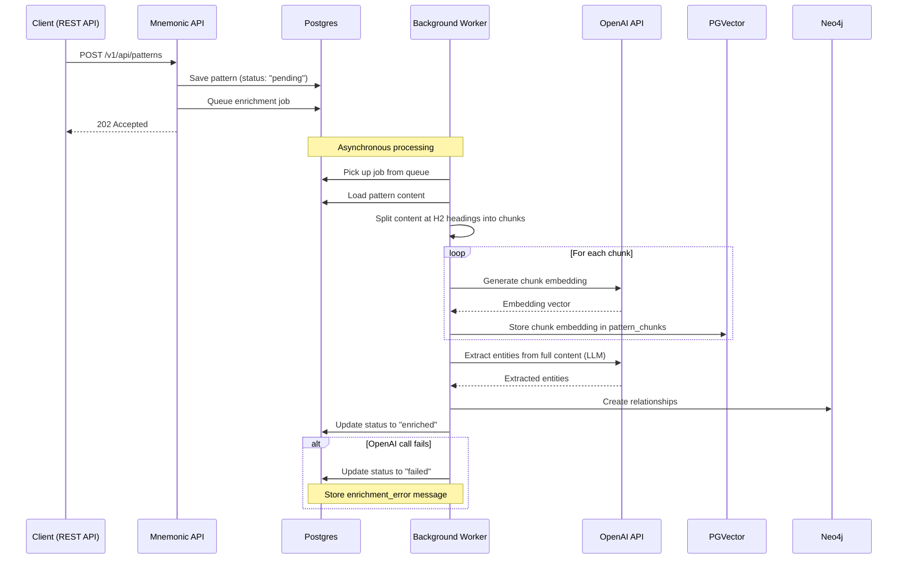
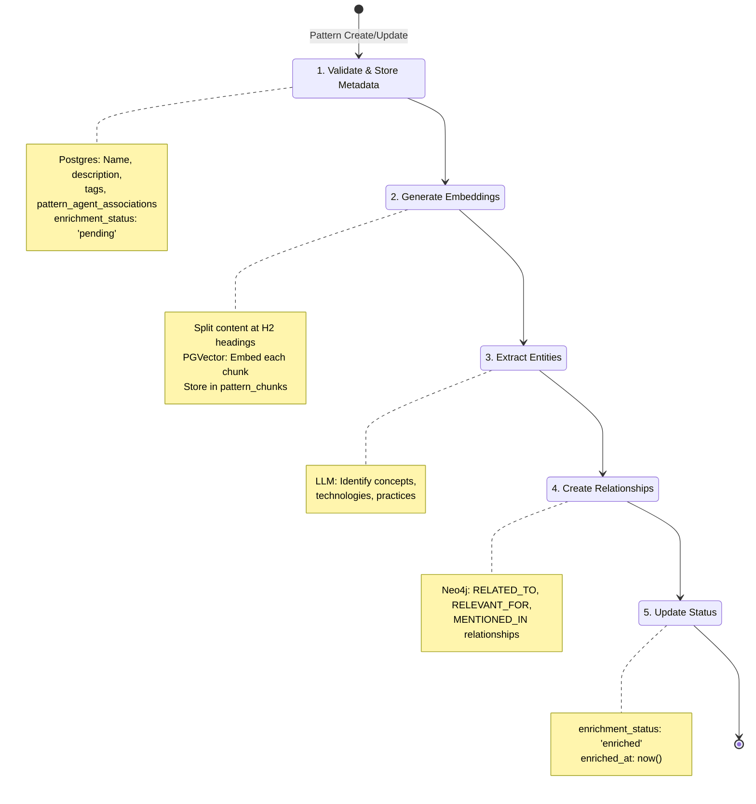
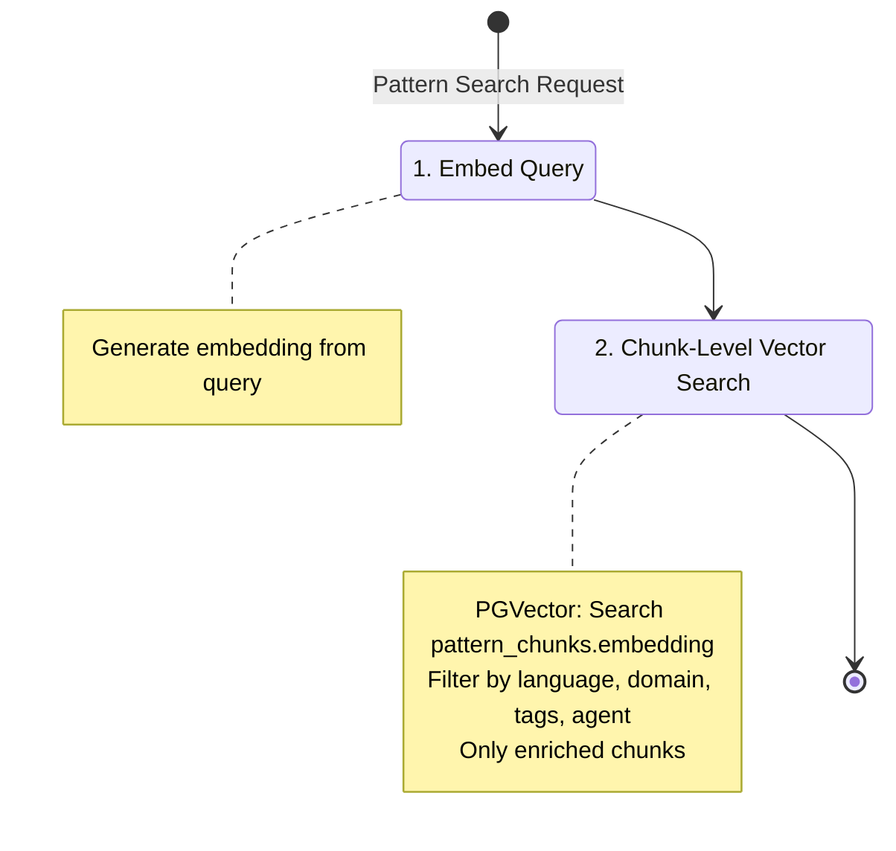
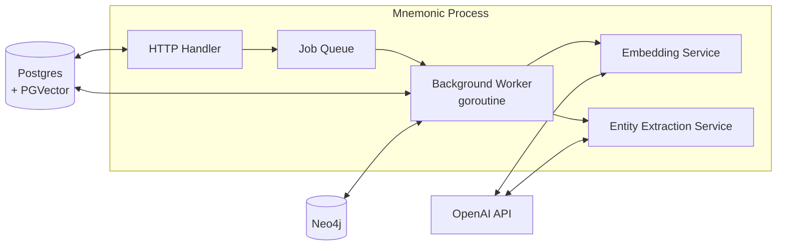
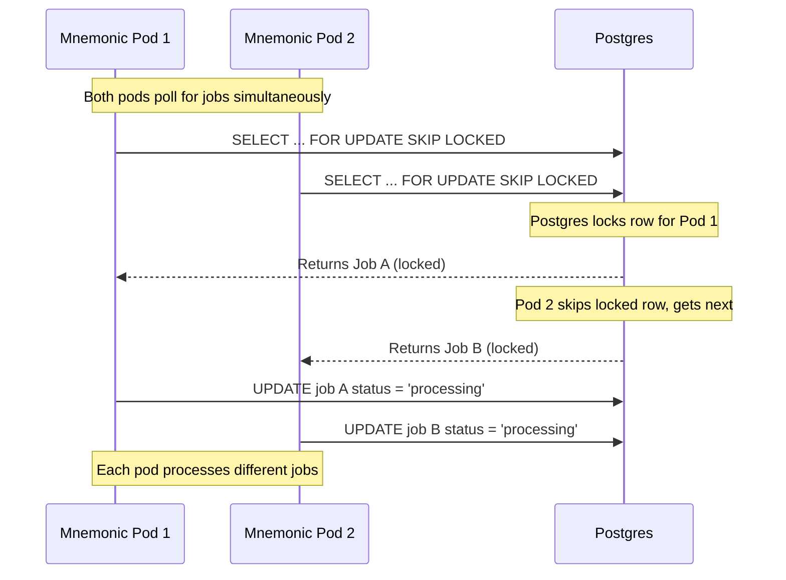
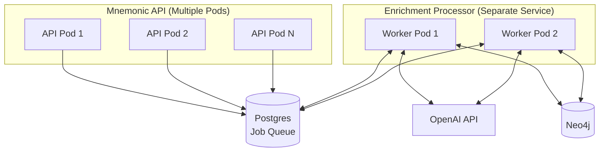

# Pattern Enrichment

[Back to Architecture Overview](../../architecture/README.md) | [Back to Project README](../../../README.md)

## Overview

> **Architecture Reference:** [System Architecture - Mnemonic](../../architecture/02-system-architecture.md#mnemonic) | [ADR-004: Unified Backend with REST API](../../architecture/00-architectural-decisions.md#adr-004-unified-backend-with-rest-api)

Pattern enrichment transforms raw pattern content into searchable, interconnected knowledge. When a pattern is created or updated, Mnemonic automatically enriches it to enable:

1. **Semantic search** - Find patterns by meaning, not just keywords via the MCP `search_patterns` tool and Admin API search endpoint
2. **Relationship discovery** - Connect related patterns and agents via knowledge graph

Enrichment data feeds all three MCP tools: `search_patterns` (semantic search), `find_related_patterns` (graph traversal), and `get_pattern` (full pattern with graph context).

This design is inspired by Cognee's cognify pipeline (chunk, classify, extract, integrate, summarize) but adapted for Mnemonic's simpler use case: patterns are already curated documents, not raw data requiring extensive preprocessing.

**Note:** Following the architectural pivot (see [2026-02-14-mnemonic-pivot-knowledge-sync.md](../plans/2026-02-14-mnemonic-pivot-knowledge-sync.md)), enriched patterns are consumed by the MCP server's search tools and the Admin API search endpoint, not by a routing engine.

## Enrichment Model

> **Architecture Reference:** [Communication Patterns - Response Structure](../../architecture/03-communication-patterns.md#response-structure)

Patterns include enrichment status fields to track processing state:

```yaml
Pattern:
  type: object
  properties:
    # ... existing fields (id, name, description, content, tags, etc.)

    # Enrichment status fields
    enrichment_status:
      type: string
      enum: [pending, enriched, failed]
      description: Aggregate enrichment state across all chunks
    enrichment_error:
      type: string
      description: Error message if enrichment_status is "failed"
    enriched_at:
      type: string
      format: date-time
      description: Timestamp of last successful enrichment
```

`enrichment_status` on the pattern reflects aggregate chunk status: the pattern is `enriched` when ALL its `pattern_chunks` rows have `enrichment_status = 'enriched'`. It is `failed` if any chunk failed. The `enrichment_jobs` table has a separate status field with an additional `processing` state (`pending`, `processing`, `completed`, `failed`). The `processing` state exists only on jobs, not on patterns.

Each `pattern_chunks` row also has its own `enrichment_status`, `enrichment_error`, and `enriched_at` fields tracking the per-chunk embedding state.

## Automatic Enrichment Flow

> **Architecture Reference:** [System Architecture - Data Flow](../../architecture/02-system-architecture.md#data-flow)

Enrichment is triggered automatically when a pattern is created or updated. The API responds immediately while enrichment processes asynchronously in the background.



Key characteristics:

- **Automatic**: Users do not invoke enrichment separately; it triggers on create/update
- **Non-blocking**: API returns 202 Accepted immediately; enrichment happens asynchronously
- **Status tracking**: Pattern's `enrichment_status` field reflects current state
- **Idempotent**: Re-enrichment on update replaces previous enrichment data

**Why 202 Accepted instead of 201 Created?** The pattern resource is accepted for processing but not immediately usable. Patterns with `enrichment_status: 'pending'` are excluded from search results until enrichment completes. HTTP 202 accurately signals that the request was accepted but processing is not yet complete.

## Enrichment Pipeline

> **Architecture Reference:** [System Architecture - Mnemonic](../../architecture/02-system-architecture.md#mnemonic) | [Concept](../mnemonic-concept.md)

### Write-time Enrichment

When a pattern is created or updated via `POST/PUT /v1/api/patterns`:



#### Step 1: Validate and Store Metadata

Store pattern metadata in Postgres:

- `id` (UUID, generated)
- `name`, `description`, `content`
- `tags` (array)
- `entity_type`, `language`, `domain`, `version`, `related_patterns`
- `pattern_agent_associations` (join table: `pattern_id UUID`, `agent_id UUID`, `relevance double precision`)
- `enrichment_status` (initially "pending")
- `enrichment_error` (null initially)
- `enriched_at` (null initially)
- `created_at`, `updated_at`

#### Step 2: Generate Embeddings

Content is split at H2 headings into chunks. Each chunk receives its own embedding stored as a row in `pattern_chunks`. Splitting enables precise section-level search results. If a pattern has no H2 headings, it is stored as a single chunk.

```go
// Pseudocode
chunks := splitAtH2Headings(pattern.Content)
for i, chunk := range chunks {
    embedding := embeddingModel.Embed(chunk.Content)
    chunkRepo.Create(ctx, PatternChunk{
        PatternID:    pattern.ID,
        SectionTitle: chunk.Title,
        ChunkIndex:   i,
        Content:      chunk.Content,
        Embedding:    embedding,
    })
}
```

##### Enriched Text Format for Embeddings

When generating embeddings during enrichment, each chunk is prefixed with metadata before being sent to the embedding model. This enrichment happens at embedding time only and does not modify the stored chunk content.

**Format:**

```
{pattern.Name} | {tags joined by ", "} | {chunk.SectionTitle}

{chunk.Content}
```

**Example:**

```
Go Error Handling | go, patterns, error-handling | Recovery Strategies

When an operation fails, consider whether retry logic is appropriate...
```

This enriched format is sent to the embedding model to generate the vector. The query text submitted by users, by contrast, is embedded as-is without metadata enrichment. This asymmetry (rich document vectors, plain query vectors) is intentional and standard practice in information retrieval: document vectors benefit from contextual metadata, while user queries remain simple and natural.

**Operational Constraint — Format Changes Require Re-enrichment:**

If this enriched text format ever changes, ALL existing chunk embeddings in the database become semantically stale relative to new ones. A format change requires a complete re-enrichment pass over all pattern chunks to regenerate their vectors. This is a breaking change at the data level and should be approached as a major version upgrade for the enrichment pipeline.

Examples that would require re-enrichment:
- Adding new metadata fields to the prefix (e.g., domain, language)
- Changing the delimiter or separator format
- Removing existing fields from the prefix
- Modifying the order of prefix fields

Plan accordingly if enrichment format changes are needed.

#### Step 3: Extract Entities

Use an LLM to extract structured information from the pattern content:

```json
{
  "concepts": ["error handling", "retry logic", "exponential backoff"],
  "technologies": ["Go", "context package"],
  "practices": ["defensive programming", "graceful degradation"]
}
```

These categories map to Concept nodes with `type` = `"domain"`, `"technology"`, and `"practice"` respectively. Concept names are normalized to lowercase before storage.

This LLM call adds 1-5 seconds of processing time per pattern, which is why enrichment runs asynchronously.

#### Step 4: Create Relationships

Store relationships in Neo4j:

The following runs as a transaction during enrichment:

```cypher
// Step 1: Create/update pattern node with full properties
MERGE (p:Pattern {id: $patternId})
ON CREATE SET p.name = $name, p.description = $description, p.createdAt = datetime()
ON MATCH SET p.name = $name, p.description = $description, p.updatedAt = datetime()

// Step 2: Remove old RELEVANT_FOR relationships
MATCH (p:Pattern {id: $patternId})-[r:RELEVANT_FOR]->()
DELETE r

// Step 3: Create new RELEVANT_FOR relationships
UNWIND $associations AS assoc
MATCH (p:Pattern {id: $patternId})
MATCH (a:Agent {name: assoc.agentName})
CREATE (p)-[:RELEVANT_FOR {relevance: assoc.relevance}]->(a)

// Step 4: Remove old MENTIONED_IN relationships for this pattern
MATCH (:Concept)-[r:MENTIONED_IN]->(:Pattern {id: $patternId})
DELETE r

// Step 5: Create concepts and MENTIONED_IN relationships
UNWIND $concepts AS concept
MERGE (c:Concept {name: concept.name})
ON CREATE SET c.type = concept.type, c.createdAt = datetime()
WITH c
MATCH (p:Pattern {id: $patternId})
CREATE (c)-[:MENTIONED_IN]->(p)

// Step 6: Delete old RELATED_TO edges for this pattern
MATCH (p:Pattern {id: $patternId})-[r:RELATED_TO]-()
DELETE r
```

### RELATED_TO Edge Computation

RELATED_TO is a symmetric relationship. Edges are created in one direction only, and queries use direction-agnostic traversal (`MATCH (a)-[:RELATED_TO]-(b)`, no arrow). This is the standard Neo4j pattern for symmetric relationships.

After concept extraction and MENTIONED_IN edge creation, the enrichment pipeline
computes direct RELATED_TO edges between patterns:

1. For each newly enriched pattern, query Neo4j for other patterns that share
   concepts (via MENTIONED_IN traversal)
2. Compute a similarity score (0.0-1.0) based on concept overlap only:

   ```text
   similarity = sharedConcepts / max(totalConceptsA, totalConceptsB)
   ```

3. Create RELATED_TO edges between pattern pairs with the computed similarity score
4. Edges below a minimum threshold (default 0.3) are not created; the threshold
   is configurable via `enrichment.related_to_min_similarity` (see [configuration.md](configuration.md))

This step runs as part of the asynchronous enrichment pipeline, after embedding
generation and concept extraction.

#### Step 5: Update Status

On successful completion:

```sql
UPDATE patterns
SET enrichment_status = 'enriched',
    enriched_at = NOW(),
    enrichment_error = NULL
WHERE id = $patternId;
```

On failure:

```sql
UPDATE patterns
SET enrichment_status = 'failed',
    enrichment_error = $errorMessage
WHERE id = $patternId;
```

### Query-time Processing

When patterns are retrieved via MCP `search_patterns` tool or Admin API `GET /v1/api/patterns/search`:



Note: Query-time search queries `pattern_chunks.embedding` and returns `ChunkMatch` results. Each result includes `section_title`, `chunk_index`, and parent pattern metadata (`pattern_name`, `entity_type`, `language`, `domain`, `tags`). Only chunks with `enrichment_status = 'enriched'` appear in results.

Graph traversal to expand and re-rank results via Neo4j is a post-MVP enhancement (see Relevance Scoring below).

#### Relevance Scoring

**MVP**: `search_patterns` ranks results by vector similarity only (PGVector cosine similarity). This is the similarity score returned in results.

**Post-MVP Enhancement**: Blended scoring combining vector similarity with graph context:

```text
relevance = (0.7 × vector_similarity) + (0.3 × graph_score)
```

Where `graph_score` would consider direct agent association relevance, hop distance from matched patterns, and shared concept count. The algorithm for computing `graph_score` will be designed when this enhancement is prioritized.

## Enrichment Worker Deployment

> **Architecture Reference:** [Deployment Architecture - Component Deployment](../../architecture/06-deployment-architecture.md#component-deployment) | [Deployment Architecture - Scaling Considerations](../../architecture/06-deployment-architecture.md#scaling-considerations)

### In-Process Background Worker

The enrichment worker runs as a background goroutine within the same Mnemonic process:



**Why in-process?**

- **Low volume expected**: Pattern creates/updates are infrequent (not hundreds per day)
- **Simpler deployment**: Single container, no external message broker
- **Postgres-backed queue**: Job queue persists in Postgres for reliability
- **Easy to migrate**: Can extract to separate service later if needed

### Job Queue Design

Use a Postgres-backed job queue (no external message broker required):

```sql
CREATE TABLE enrichment_jobs (
    id UUID PRIMARY KEY DEFAULT gen_random_uuid(),
    pattern_id UUID REFERENCES patterns(id) ON DELETE CASCADE,     -- nullable
    chunk_id UUID REFERENCES pattern_chunks(id) ON DELETE CASCADE, -- nullable
    status VARCHAR(20) NOT NULL DEFAULT 'pending',  -- pending, processing, completed, failed
    attempts INTEGER NOT NULL DEFAULT 0,
    max_attempts INTEGER NOT NULL DEFAULT 3,
    last_error TEXT,
    created_at TIMESTAMP WITH TIME ZONE DEFAULT NOW(),
    updated_at TIMESTAMP WITH TIME ZONE DEFAULT NOW(),
    scheduled_for TIMESTAMP WITH TIME ZONE DEFAULT NOW(),
    started_at TIMESTAMP WITH TIME ZONE,
    completed_at TIMESTAMP WITH TIME ZONE
);

CREATE INDEX idx_enrichment_jobs_pending ON enrichment_jobs (scheduled_for)
    WHERE status = 'pending';
CREATE INDEX idx_enrichment_jobs_pattern ON enrichment_jobs (pattern_id);
CREATE INDEX idx_enrichment_jobs_processing ON enrichment_jobs (started_at)
    WHERE status = 'processing';
CREATE UNIQUE INDEX idx_enrichment_jobs_unique_pending ON enrichment_jobs (pattern_id)
    WHERE status IN ('pending', 'processing');
```

Worker polling:

```sql
-- Claim next available job (with row-level locking)
UPDATE enrichment_jobs
SET status = 'processing',
    started_at = NOW(),
    attempts = attempts + 1
WHERE id = (
    SELECT id FROM enrichment_jobs
    WHERE status = 'pending'
      AND scheduled_for <= NOW()
      AND attempts < max_attempts
    ORDER BY scheduled_for
    FOR UPDATE SKIP LOCKED
    LIMIT 1
)
RETURNING *;
```

### Scaling and Concurrency

When running multiple Mnemonic instances (pods), all instances can safely process enrichment jobs concurrently without duplicate processing. This is achieved through Postgres row-level locking.

#### How Multi-Pod Job Claiming Works



#### The FOR UPDATE SKIP LOCKED Guarantee

The key SQL construct that prevents duplicate processing:

```sql
SELECT id FROM enrichment_jobs
WHERE status = 'pending'
  AND scheduled_for <= NOW()
  AND attempts < max_attempts
ORDER BY scheduled_for
FOR UPDATE SKIP LOCKED  -- Critical: skips rows locked by other transactions
LIMIT 1
```

**What `FOR UPDATE SKIP LOCKED` does:**

| Behavior      | Description                                                              |
| ------------- | ------------------------------------------------------------------------ |
| `FOR UPDATE`  | Locks the selected row for the duration of the transaction               |
| `SKIP LOCKED` | If another transaction holds a lock on a row, skip it instead of waiting |

This means:

- **No duplicate processing**: Two pods cannot claim the same job
- **No blocking**: Pods don't wait on each other; they grab different jobs
- **No external coordination**: No distributed locks, Redis, or Zookeeper needed
- **Automatic failover**: If a pod crashes mid-processing, the job remains in "processing" state and can be reclaimed after timeout

#### Job Timeout and Recovery

To handle crashed workers, implement a job timeout mechanism:

```sql
-- Reclaim stale jobs (stuck in "processing" for too long)
UPDATE enrichment_jobs
SET status = 'pending',
    scheduled_for = NOW() + INTERVAL '30 seconds'
WHERE status = 'processing'
  AND started_at < NOW() - INTERVAL '5 minutes'
  AND attempts < max_attempts;
```

Run this query periodically (e.g., every minute) to recover jobs from crashed workers.

#### Horizontal Scaling Behavior

| Pods   | Behavior                                       |
| ------ | ---------------------------------------------- |
| 1 pod  | Default 2 workers process jobs concurrently    |
| 2 pods | Jobs distributed automatically; ~2x throughput |
| N pods | Jobs distributed across N pods; ~Nx throughput |

**Note**: Throughput scales linearly until limited by:

- OpenAI API rate limits (shared across all pods)
- Postgres connection pool exhaustion
- Neo4j write capacity

### Future Scaling: Dedicated Enrichment Processor

For larger deployments or separation of concerns, the enrichment worker can be extracted to a dedicated service:



**Why consider a dedicated enrichment processor?**

| Benefit                    | Description                                                             |
| -------------------------- | ----------------------------------------------------------------------- |
| **Separation of concerns** | API handles requests; processor handles background work                 |
| **Independent scaling**    | Scale API pods for request volume; scale workers for enrichment backlog |
| **Resource isolation**     | LLM calls don't compete with API request handling                       |
| **Deployment flexibility** | Update enrichment logic without redeploying API                         |
| **Cost optimization**      | Run workers on cheaper/burstable instances                              |

**When to migrate to dedicated processor:**

- Enrichment backlog consistently grows (processing can't keep up)
- API latency affected by enrichment worker resource usage
- Need to scale enrichment independently from API
- Want to deploy enrichment changes without API downtime

**Migration path:**

1. Extract worker code to separate Go binary (same codebase, different main)
2. Deploy as separate container/service
3. Remove in-process worker from API pods
4. Scale worker pods based on queue depth
5. Consider Redis or SQS if Postgres queue becomes bottleneck

## External Service Dependencies

> **Architecture Reference:** [Requirements - Non-Goals](../mnemonic-requirements.md#non-goals) | [System Architecture - Boundary Definitions](../../architecture/02-system-architecture.md#boundary-definitions)

Pattern enrichment requires external API calls for embedding generation and entity extraction.

### OpenAI API (Embeddings)

Embedding generation requires the OpenAI API:

| Requirement        | Details                                                   |
| ------------------ | --------------------------------------------------------- |
| **Service**        | OpenAI API                                                |
| **Endpoint**       | `https://api.openai.com/v1/embeddings`                    |
| **Model**          | `text-embedding-3-small`                                  |
| **Dimensions**     | 1536 (must match PGVector column configuration)           |
| **Authentication** | API key required                                          |
| **Cost**           | ~$0.0001 per pattern (~$0.00002 per 1K tokens)            |
| **Rate limits**    | 3,000 RPM / 1,000,000 TPM (tier 1), higher for paid tiers |

**Why OpenAI?**

- Industry-standard embedding quality
- Simple API integration
- Predictable costs at scale
- No infrastructure to maintain

Additional embedding providers (Azure OpenAI, self-hosted models) can be added post-MVP if needed.

### OpenAI API (Entity Extraction)

Entity extraction uses the OpenAI API:

| Requirement        | Details                                               |
| ------------------ | ----------------------------------------------------- |
| **Service**        | OpenAI API                                            |
| **Endpoint**       | `https://api.openai.com/v1/chat/completions`          |
| **Model**          | `gpt-4o-mini`                                         |
| **Authentication** | API key required (same key used for embeddings)       |
| **Cost**           | ~$0.01-0.05 per pattern                               |
| **Rate limits**    | 500 RPM / 200,000 TPM (tier 1), higher for paid tiers |

Additional LLM providers (Anthropic, Azure OpenAI) can be added post-MVP if needed.

## Configuration Requirements

> **Architecture Reference:** [Deployment Architecture - Operational Considerations](../../architecture/06-deployment-architecture.md#operational-considerations)

### Required Environment Variables

```bash
# Required for embedding generation and entity extraction
MNEMONIC_OPENAI_API_KEY=sk-...
```

### Application Configuration

Configuration follows the patterns established in [configuration.md](configuration.md).

```yaml
openai:
  # API key should be set via MNEMONIC_OPENAI_API_KEY
  api_key: ""

  # Embedding configuration
  embedding_model: text-embedding-3-small
  embedding_dimensions: 1536 # Must match PGVector column size

  # Entity extraction configuration
  extraction_model: gpt-4o-mini

  # Rate limiting (recommended)
  max_requests_per_minute: 500
  retry_attempts: 3
  retry_delay: 1s

# Enrichment worker configuration
enrichment:
  worker_count: 2 # Number of concurrent workers (goroutines)
  poll_interval: 5s # How often to check for new jobs
  max_attempts: 3 # Retry attempts before marking as failed
  retry_delay: 30s # Delay between retry attempts
  job_timeout: 5m  # Maximum time for a single enrichment job

# Neo4j configuration (required)
neo4j:
  uri: bolt://localhost:7687
  username: neo4j
  # password should be set via MNEMONIC_DATABASE_NEO4J_PASSWORD
  password: ""
  database: neo4j
```

Changing the embedding model requires re-embedding all existing patterns - the dimensions must match across all stored vectors. Additional embedding providers can be supported post-MVP if needed.

## Cost and Latency

### Per-Pattern Processing

| Operation             | Time      | Cost            |
| --------------------- | --------- | --------------- |
| Embedding generation  | 100-200ms | ~$0.0001        |
| Entity extraction     | 1-5s      | ~$0.01-0.05     |
| Neo4j writes          | 50-100ms  | N/A             |
| **Total per pattern** | **1-5s**  | **~$0.01-0.05** |

The 1-5 second processing time per pattern reinforces why enrichment runs asynchronously. Users should not wait for this during API calls.

### Projected Monthly Costs

| Patterns/month | Embedding Cost | LLM Cost | Total    |
| -------------- | -------------- | -------- | -------- |
| 100            | $0.01          | $1-5     | $1-5     |
| 1,000          | $0.10          | $10-50   | $10-50   |
| 10,000         | $1.00          | $100-500 | $100-500 |

Query embeddings also incur costs (~$0.0001 per query). For high-volume query scenarios, consider caching strategies.

### Rate Limit Considerations

OpenAI enforces rate limits that affect burst processing:

- **Tier 1 (default)**: 3,000 requests/minute, 1M tokens/minute
- **Tier 2+**: Higher limits available with usage history

For bulk pattern imports, implement:

- Request queuing with backoff
- Batch processing with delays
- Rate limit monitoring and alerting

## Deployment Requirements

> **Architecture Reference:** [Deployment Architecture - Infrastructure Requirements](../../architecture/06-deployment-architecture.md#infrastructure-requirements) | [Deployment Architecture - Deployment Topology](../../architecture/06-deployment-architecture.md#deployment-topology)
>
> **Observability Reference:** [Enrichment Worker Observability](observability-implementation.md#enrichment-worker-observability) — metrics, tracing spans, and structured logging for the enrichment pipeline

### Infrastructure Checklist

Before deploying pattern enrichment, verify:

- [ ] OpenAI API key provisioned and tested
- [ ] API key stored securely (secrets manager, not in code)
- [ ] Environment variables configured in deployment
- [ ] Rate limits appropriate for expected load
- [ ] Cost monitoring/alerting configured
- [ ] Network egress to `api.openai.com` allowed
- [ ] PGVector dimensions match configured embedding dimensions (1536)
- [ ] Enrichment job table created in Postgres
- [ ] Neo4j instance provisioned and accessible
- [ ] Neo4j credentials configured

### Failure Modes

| Failure                 | Impact                                 | Mitigation                        |
| ----------------------- | -------------------------------------- | --------------------------------- |
| Invalid/missing API key | All enrichment jobs fail               | Startup validation, health checks |
| Rate limit exceeded     | Temporary failures, 429 responses      | Exponential backoff, queuing      |
| OpenAI outage           | Embedding/extraction unavailable       | Circuit breaker, queue for retry  |
| Neo4j unavailable       | Relationship storage fails             | Circuit breaker, queue for retry  |
| Dimension mismatch      | Vectors unusable for similarity search | Validate config at startup        |
| Network blocked         | Cannot reach external APIs             | Verify egress rules               |
| Worker crash            | Jobs stuck in "processing"             | Job timeout, automatic requeuing  |

### Health Check Endpoint

The pattern service should expose a health check that validates enrichment capability:

```go
// Health check should verify:
// 1. OpenAI API key is configured
// 2. OpenAI API is reachable (optional: test calls)
// 3. PGVector is available with correct dimensions
// 4. Neo4j is available and accessible
// 5. Enrichment worker is running
// 6. Job queue is accessible
```

## Internal Dependencies

> **Architecture Reference:** [System Architecture - Mnemonic](../../architecture/02-system-architecture.md#mnemonic)

### PGVector Configuration

Vector embeddings are stored in `pattern_chunks.embedding`, not `patterns.embedding`. The `patterns` table no longer has an `embedding` column.

```sql
-- Recommended index for chunk-level search
CREATE INDEX ON pattern_chunks
USING ivfflat (embedding vector_cosine_ops)
WITH (lists = 100);

-- For larger collections (10K+), consider HNSW
CREATE INDEX ON pattern_chunks
USING hnsw (embedding vector_cosine_ops)
WITH (m = 16, ef_construction = 64);
```

The vector column must be configured for the same dimensions as the embedding model:

```sql
-- Must match embedding.dimensions in config (default: 1536)
-- Column lives in pattern_chunks, not patterns
ALTER TABLE pattern_chunks ADD COLUMN embedding vector(1536);
```

### Neo4j Schema

```cypher
// Create constraints for pattern nodes
CREATE CONSTRAINT pattern_id IF NOT EXISTS
FOR (p:Pattern) REQUIRE p.id IS UNIQUE;

// Create constraints for agent nodes
CREATE CONSTRAINT agent_name IF NOT EXISTS
FOR (a:Agent) REQUIRE a.name IS UNIQUE;

// Create constraints for concept nodes
CREATE CONSTRAINT concept_name IF NOT EXISTS
FOR (c:Concept) REQUIRE c.name IS UNIQUE;

// Create indexes for common queries
CREATE INDEX pattern_name IF NOT EXISTS
FOR (p:Pattern) ON (p.name);

// Full-text indexes for search
CREATE FULLTEXT INDEX pattern_content_fulltext IF NOT EXISTS
FOR (p:Pattern) ON EACH [p.name, p.description];

CREATE FULLTEXT INDEX concept_name_fulltext IF NOT EXISTS
FOR (c:Concept) ON EACH [c.name];

// Property index for concept type filtering
CREATE INDEX concept_type_index IF NOT EXISTS
FOR (c:Concept) ON (c.type);
```

### Entity Extraction Prompt

```text
Extract key concepts from this pattern document.

Return JSON with:
- concepts: General programming concepts
- technologies: Languages, frameworks, tools
- practices: Best practices, patterns, methodologies

Pattern content:
{content}
```

## References

- [Architecture Overview](../../architecture/README.md)
- [System Architecture](../../architecture/02-system-architecture.md) - Storage stack details
- [Mnemonic OpenAPI Spec](../../../api/openapi/mnemonic-v1.yaml) - Full API definition
