# Routing Engine

[Back to Architecture Overview](../architecture/00-overview.md) | [Back to System Architecture](../architecture/03-system-architecture.md)

## Table of Contents

- [Overview](#overview)
- [Design Principles](#design-principles)
- [Interface Definitions](#interface-definitions)
  - [Router Interface](#router-interface)
  - [RuleMatcher Interface](#rulematcher-interface)
  - [RoutingDecision Type](#routingdecision-type)
  - [Supporting Types](#supporting-types)
  - [Complete Type Relationships](#complete-type-relationships)
- [Rule Loading and Caching](#rule-loading-and-caching)
  - [Cache Architecture](#cache-architecture)
  - [Cache Invalidation](#cache-invalidation)
  - [Startup Behavior](#startup-behavior)
- [Priority-Ordered Evaluation](#priority-ordered-evaluation)
  - [Evaluation Algorithm](#evaluation-algorithm)
  - [Short-Circuit Behavior](#short-circuit-behavior)
  - [Tie-Breaking Rules](#tie-breaking-rules)
- [Match Type Implementations](#match-type-implementations)
  - [Keyword Matcher](#keyword-matcher)
  - [Regex Matcher](#regex-matcher)
  - [Pattern Matcher (Semantic)](#pattern-matcher-semantic)
  - [Default Matcher](#default-matcher)
- [Confidence Scoring](#confidence-scoring)
  - [Scoring Logic by Match Type](#scoring-logic-by-match-type)
  - [Score Normalization](#score-normalization)
  - [Reasoning Generation](#reasoning-generation)
- [Performance Considerations](#performance-considerations)
  - [Latency Targets](#latency-targets)
  - [Optimization Strategies](#optimization-strategies)
  - [Benchmarking Guidelines](#benchmarking-guidelines)
- [Error Handling](#error-handling)
- [References](#references)

## Overview

[↑ Table of Contents](#table-of-contents)

The routing engine is the core component within Mnemonic that determines which agent should handle a given prompt. As defined in [ADR-002](../architecture/02-architectural-decisions.md#adr-002-routing-location), routing logic lives server-side in Mnemonic, providing team-wide consistency and centralized management.

Key characteristics:

- **Deterministic**: Routing is code-based, not LLM-driven (per architecture requirements)
- **Priority-ordered**: Rules are evaluated in priority order (highest first)
- **Configurable**: Rules are stored in the database and managed via REST API
- **Fast**: Routing decisions must be made quickly (target: <50ms)

The routing engine implements the logic described in the [OpenAPI specification](/api/openapi/mnemonic-v1.yaml) for the `POST /v1/ace/route` endpoint.

## Design Principles

[↑ Table of Contents](#table-of-contents)

1. **Determinism over intelligence**: The routing engine uses explicit rules, not LLM inference. This ensures predictable, auditable, and fast routing decisions.

2. **Fail-safe defaults**: If no rules match, a default agent handles the request. The system never fails to route.

3. **Separation of concerns**: The router evaluates rules; matchers implement match logic; the repository handles persistence.

4. **Testability**: All components use interfaces for dependency injection and easy mocking.

5. **Observability**: Every routing decision includes reasoning and metadata for debugging.

## Interface Definitions

[↑ Table of Contents](#table-of-contents)

### Router Interface

The `Router` interface defines the primary routing contract. It evaluates the prompt against all enabled routing rules in priority order and returns the first match.

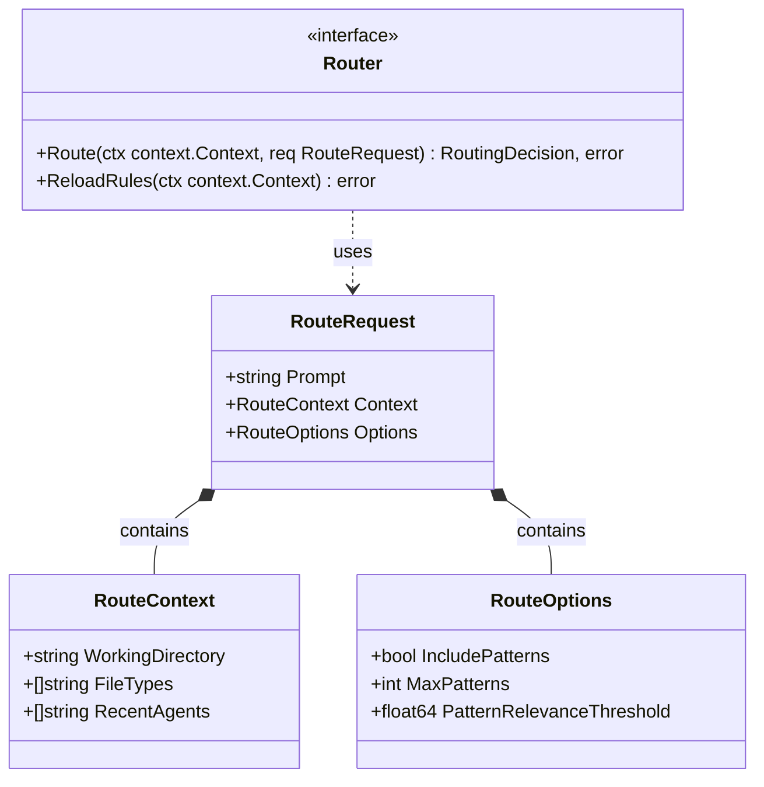
```mermaid
classDiagram
    class Router {
        <<interface>>
        +Route(ctx context.Context, req RouteRequest) RoutingDecision, error
        +ReloadRules(ctx context.Context) error
    }

    class RouteRequest {
        +string Prompt
        +RouteContext Context
        +RouteOptions Options
    }

    class RouteContext {
        +string WorkingDirectory
        +[]string FileTypes
        +[]string RecentAgents
    }

    class RouteOptions {
        +bool IncludePatterns
        +int MaxPatterns
        +float64 PatternRelevanceThreshold
    }

    Router ..> RouteRequest : uses
    RouteRequest *-- RouteContext : contains
    RouteRequest *-- RouteOptions : contains
```

**Router.Route behavior:**

- Evaluates rules in descending priority order
- Returns immediately when a rule matches (short-circuit evaluation)
- If no rules match, returns a default routing decision using the configured default agent

**Router.ReloadRules behavior:**

- Forces the router to refresh its cached rules from the database
- Called when rules are modified via the admin API

### RuleMatcher Interface

Each match type implements the `RuleMatcher` interface. Different implementations handle keyword, regex, pattern, and default matching.

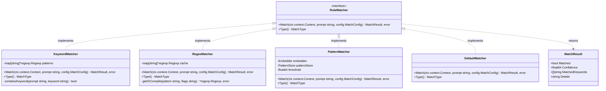
```mermaid
classDiagram
    class RuleMatcher {
        <<interface>>
        +Match(ctx context.Context, prompt string, config MatchConfig) MatchResult, error
        +Type() MatchType
    }

    class MatchResult {
        +bool Matched
        +float64 Confidence
        +[]string MatchedKeywords
        +string Details
    }

    class KeywordMatcher {
        -map[string]*regexp.Regexp patterns
        +Match(ctx context.Context, prompt string, config MatchConfig) MatchResult, error
        +Type() MatchType
        -containsKeyword(prompt string, keyword string) bool
    }

    class RegexMatcher {
        -map[string]*regexp.Regexp cache
        +Match(ctx context.Context, prompt string, config MatchConfig) MatchResult, error
        +Type() MatchType
        -getOrCompile(pattern string, flags string) *regexp.Regexp, error
    }

    class PatternMatcher {
        -Embedder embedder
        -PatternStore patternStore
        -float64 threshold
        +Match(ctx context.Context, prompt string, config MatchConfig) MatchResult, error
        +Type() MatchType
    }

    class DefaultMatcher {
        +Match(ctx context.Context, prompt string, config MatchConfig) MatchResult, error
        +Type() MatchType
    }

    RuleMatcher <|.. KeywordMatcher : implements
    RuleMatcher <|.. RegexMatcher : implements
    RuleMatcher <|.. PatternMatcher : implements
    RuleMatcher <|.. DefaultMatcher : implements
    RuleMatcher ..> MatchResult : returns
```

**MatchResult fields:**

| Field             | Type       | Description                                                           |
| ----------------- | ---------- | --------------------------------------------------------------------- |
| `Matched`         | bool       | Whether the rule matched the prompt                                   |
| `Confidence`      | float64    | Score from 0.0 to 1.0 indicating match strength                       |
| `MatchedKeywords` | []string   | Keywords that triggered a keyword match (empty for other match types) |
| `Details`         | string     | Additional match information for logging                              |

### RoutingDecision Type

The `RoutingDecision` struct contains the result of routing evaluation and maps to the RoutingDecision schema in the OpenAPI spec.

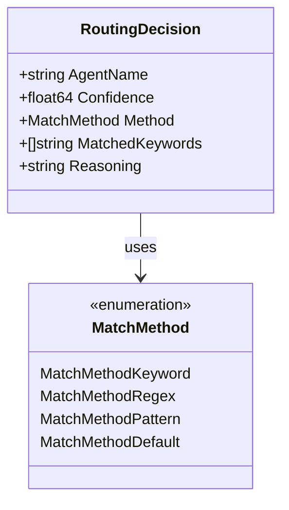
```mermaid
classDiagram
    class RoutingDecision {
        +string AgentName
        +float64 Confidence
        +MatchMethod Method
        +[]string MatchedKeywords
        +string Reasoning
    }

    class MatchMethod {
        <<enumeration>>
        MatchMethodKeyword
        MatchMethodRegex
        MatchMethodPattern
        MatchMethodDefault
    }

    RoutingDecision --> MatchMethod : uses
```

**RoutingDecision fields:**

| Field             | Type        | Description                                                         |
| ----------------- | ----------- | ------------------------------------------------------------------- |
| `AgentName`       | string      | Identifier of the selected agent                                    |
| `Confidence`      | float64     | Routing confidence (0.0-1.0, where 1.0 = deterministic match)       |
| `Method`          | MatchMethod | Which type of matching triggered the route                          |
| `MatchedKeywords` | []string    | Keywords that triggered the route (only for MatchMethodKeyword)     |
| `Reasoning`       | string      | Human-readable explanation of why this agent was selected           |

### Supporting Types

The following types support the routing engine's rule evaluation system.

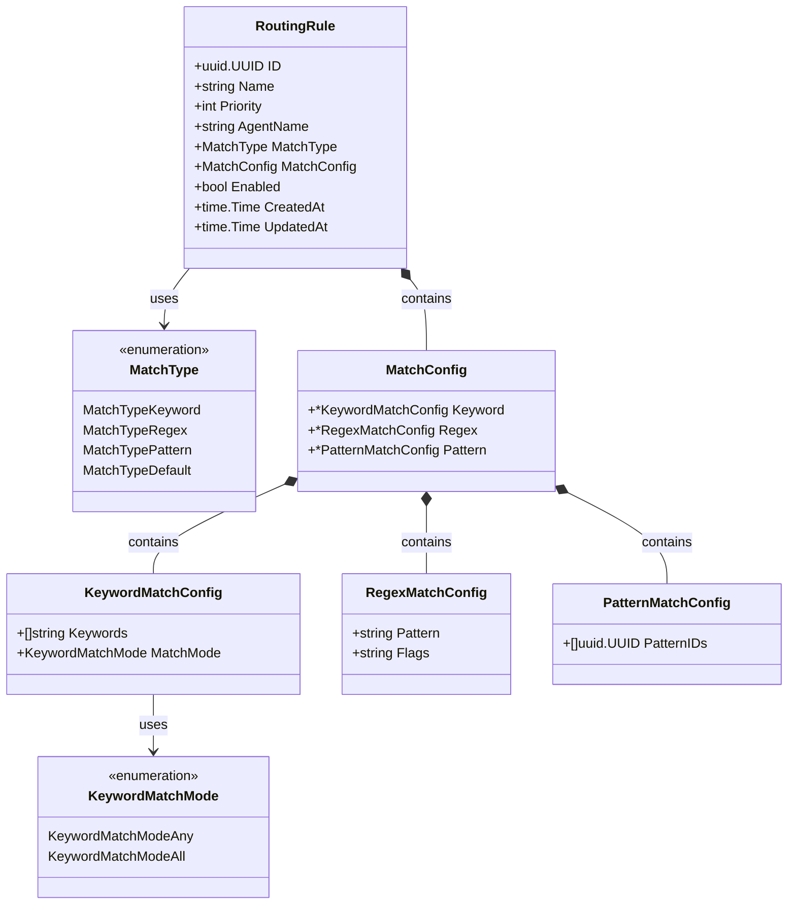
```mermaid
classDiagram
    class MatchType {
        <<enumeration>>
        MatchTypeKeyword
        MatchTypeRegex
        MatchTypePattern
        MatchTypeDefault
    }

    class RoutingRule {
        +uuid.UUID ID
        +string Name
        +int Priority
        +string AgentName
        +MatchType MatchType
        +MatchConfig MatchConfig
        +bool Enabled
        +time.Time CreatedAt
        +time.Time UpdatedAt
    }

    class MatchConfig {
        +*KeywordMatchConfig Keyword
        +*RegexMatchConfig Regex
        +*PatternMatchConfig Pattern
    }

    class KeywordMatchConfig {
        +[]string Keywords
        +KeywordMatchMode MatchMode
    }

    class KeywordMatchMode {
        <<enumeration>>
        KeywordMatchModeAny
        KeywordMatchModeAll
    }

    class RegexMatchConfig {
        +string Pattern
        +string Flags
    }

    class PatternMatchConfig {
        +[]uuid.UUID PatternIDs
    }

    RoutingRule --> MatchType : uses
    RoutingRule *-- MatchConfig : contains
    MatchConfig *-- KeywordMatchConfig : contains
    MatchConfig *-- RegexMatchConfig : contains
    MatchConfig *-- PatternMatchConfig : contains
    KeywordMatchConfig --> KeywordMatchMode : uses
```

**MatchConfig union semantics:**

Only one field is populated based on the `MatchType`:

- `MatchType: keyword` -> `MatchConfig.Keyword` is populated
- `MatchType: regex` -> `MatchConfig.Regex` is populated
- `MatchType: pattern` -> `MatchConfig.Pattern` is populated
- `MatchType: default` -> No configuration needed (empty config)

### Complete Type Relationships

The following diagram shows the complete relationship between all routing engine types:

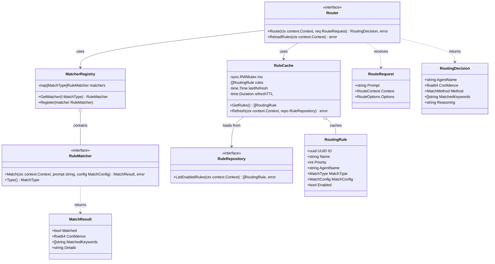
```mermaid
classDiagram
    direction TB

    class Router {
        <<interface>>
        +Route(ctx context.Context, req RouteRequest) RoutingDecision, error
        +ReloadRules(ctx context.Context) error
    }

    class RuleCache {
        -sync.RWMutex mu
        -[]RoutingRule rules
        -time.Time lastRefresh
        -time.Duration refreshTTL
        +GetRules() []RoutingRule
        +Refresh(ctx context.Context, repo RuleRepository) error
    }

    class MatcherRegistry {
        -map[MatchType]RuleMatcher matchers
        +GetMatcher(t MatchType) RuleMatcher
        +Register(matcher RuleMatcher)
    }

    class RuleMatcher {
        <<interface>>
        +Match(ctx context.Context, prompt string, config MatchConfig) MatchResult, error
        +Type() MatchType
    }

    class RuleRepository {
        <<interface>>
        +ListEnabledRules(ctx context.Context) []RoutingRule, error
    }

    class RouteRequest {
        +string Prompt
        +RouteContext Context
        +RouteOptions Options
    }

    class RoutingDecision {
        +string AgentName
        +float64 Confidence
        +MatchMethod Method
        +[]string MatchedKeywords
        +string Reasoning
    }

    class RoutingRule {
        +uuid.UUID ID
        +string Name
        +int Priority
        +string AgentName
        +MatchType MatchType
        +MatchConfig MatchConfig
        +bool Enabled
    }

    class MatchResult {
        +bool Matched
        +float64 Confidence
        +[]string MatchedKeywords
        +string Details
    }

    Router --> RuleCache : uses
    Router --> MatcherRegistry : uses
    Router ..> RouteRequest : receives
    Router ..> RoutingDecision : returns
    RuleCache --> RuleRepository : loads from
    RuleCache o-- RoutingRule : caches
    MatcherRegistry o-- RuleMatcher : contains
    RuleMatcher ..> MatchResult : returns
```

## Rule Loading and Caching

[↑ Table of Contents](#table-of-contents)

### Cache Architecture

The routing engine maintains an in-memory cache of enabled routing rules to minimize database queries during routing decisions.

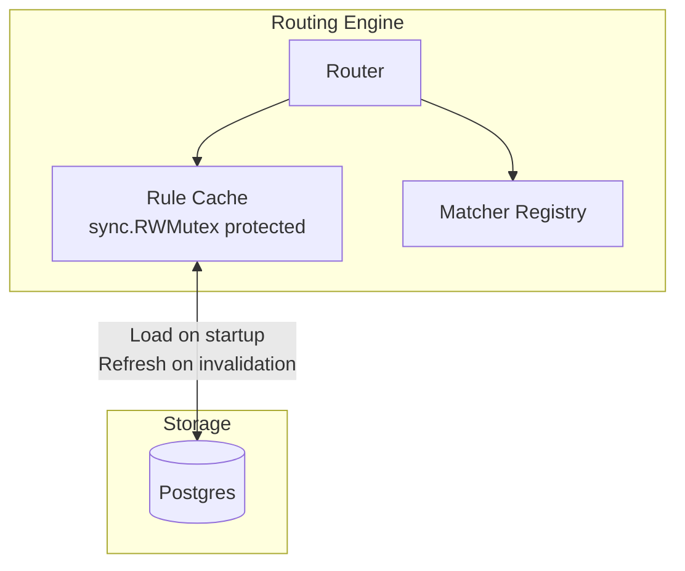
```mermaid
flowchart TD
    subgraph "Routing Engine"
        ROUTER[Router]
        CACHE[Rule Cache<br/>sync.RWMutex protected]
        MATCHERS[Matcher Registry]
    end

    subgraph "Storage"
        PG[(Postgres)]
    end

    ROUTER --> CACHE
    ROUTER --> MATCHERS
    CACHE <-->|"Load on startup<br/>Refresh on invalidation"| PG
```

**RuleCache behavior:**

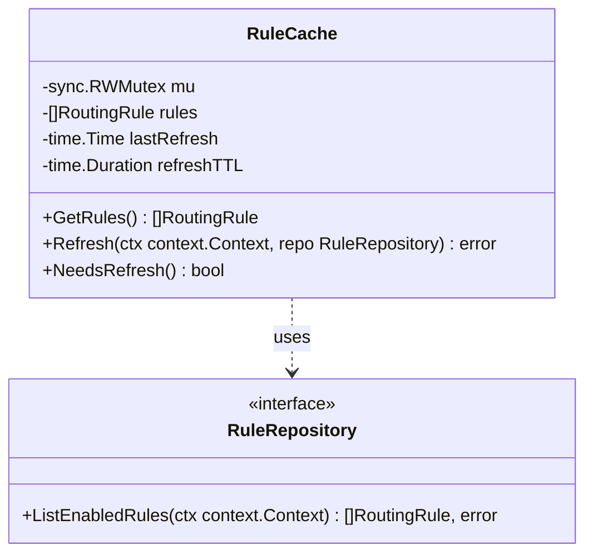
```mermaid
classDiagram
    class RuleCache {
        -sync.RWMutex mu
        -[]RoutingRule rules
        -time.Time lastRefresh
        -time.Duration refreshTTL
        +GetRules() []RoutingRule
        +Refresh(ctx context.Context, repo RuleRepository) error
        +NeedsRefresh() bool
    }

    class RuleRepository {
        <<interface>>
        +ListEnabledRules(ctx context.Context) []RoutingRule, error
    }

    RuleCache ..> RuleRepository : uses
```

**GetRules behavior:**

- Returns a copy of cached rules (prevents mutation)
- Rules are pre-sorted by priority (highest first)
- Thread-safe via RWMutex read lock

**Refresh behavior:**

- Loads rules from the database via repository
- Sorts rules by priority descending
- Updates cache with write lock
- Records refresh timestamp

### Cache Invalidation

Cache invalidation occurs in two scenarios:

1. **Explicit invalidation**: When routing rules are created, updated, or deleted via the admin API, the cache is explicitly invalidated.

2. **Background refresh**: A background goroutine periodically refreshes the cache to catch any missed invalidations or external database changes.

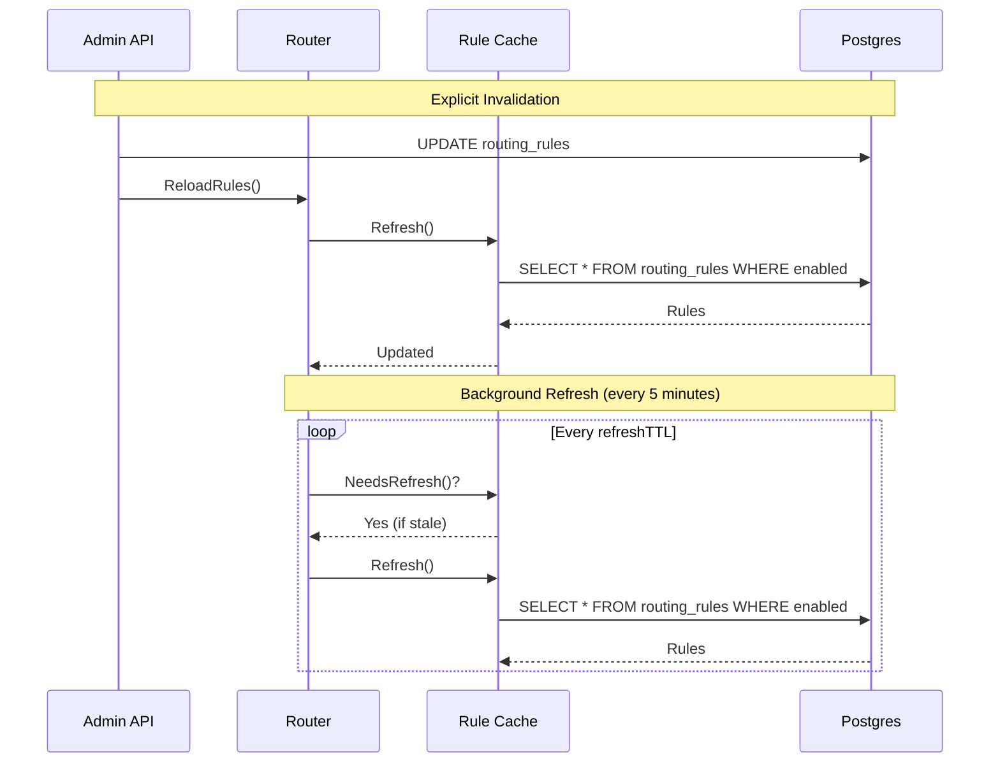
```mermaid
sequenceDiagram
    participant Admin as Admin API
    participant Router as Router
    participant Cache as Rule Cache
    participant PG as Postgres

    Note over Admin,PG: Explicit Invalidation
    Admin->>PG: UPDATE routing_rules
    Admin->>Router: ReloadRules()
    Router->>Cache: Refresh()
    Cache->>PG: SELECT * FROM routing_rules WHERE enabled
    PG-->>Cache: Rules
    Cache-->>Router: Updated

    Note over Router,PG: Background Refresh (every 5 minutes)
    loop Every refreshTTL
        Router->>Cache: NeedsRefresh()?
        Cache-->>Router: Yes (if stale)
        Router->>Cache: Refresh()
        Cache->>PG: SELECT * FROM routing_rules WHERE enabled
        PG-->>Cache: Rules
    end
```

**Configuration:**

| Setting            | Default | Description                               |
| ------------------ | ------- | ----------------------------------------- |
| `refresh_ttl`      | 5m      | Background refresh interval               |
| `startup_timeout`  | 30s     | Max time to wait for initial rule load    |

### Startup Behavior

On startup, the routing engine must successfully load rules before accepting requests.

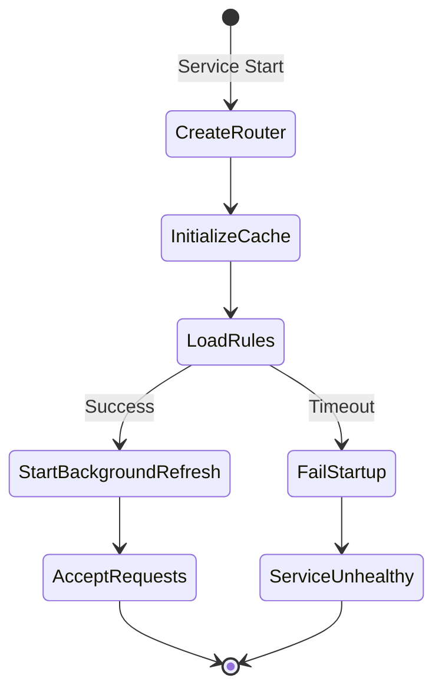
```mermaid
stateDiagram-v2
    [*] --> CreateRouter: Service Start
    CreateRouter --> InitializeCache
    InitializeCache --> LoadRules

    state LoadRules <<choice>>
    LoadRules --> StartBackgroundRefresh: Success
    LoadRules --> FailStartup: Timeout

    StartBackgroundRefresh --> AcceptRequests
    AcceptRequests --> [*]

    FailStartup --> ServiceUnhealthy
    ServiceUnhealthy --> [*]
```

**Startup failure behavior:**

- If rules cannot be loaded within the startup timeout, the service fails to start
- This prevents routing requests with stale or missing rules
- Health checks report unhealthy until rules are loaded

## Priority-Ordered Evaluation

[↑ Table of Contents](#table-of-contents)

### Evaluation Algorithm

Rules are evaluated in descending priority order. The first rule that matches determines the routing decision.

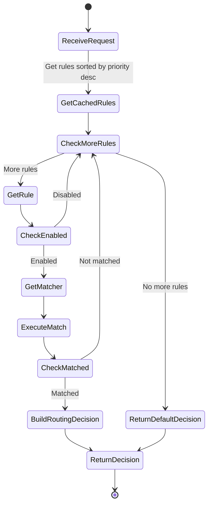
```mermaid
stateDiagram-v2
    [*] --> ReceiveRequest
    ReceiveRequest --> GetCachedRules: Get rules sorted by priority desc
    GetCachedRules --> CheckMoreRules

    state CheckMoreRules <<choice>>
    CheckMoreRules --> GetRule: More rules
    CheckMoreRules --> ReturnDefaultDecision: No more rules

    GetRule --> CheckEnabled

    state CheckEnabled <<choice>>
    CheckEnabled --> GetMatcher: Enabled
    CheckEnabled --> CheckMoreRules: Disabled

    GetMatcher --> ExecuteMatch
    ExecuteMatch --> CheckMatched

    state CheckMatched <<choice>>
    CheckMatched --> BuildRoutingDecision: Matched
    CheckMatched --> CheckMoreRules: Not matched

    BuildRoutingDecision --> ReturnDecision
    ReturnDefaultDecision --> ReturnDecision
    ReturnDecision --> [*]
```

**Algorithm pseudocode:**

1. Retrieve pre-sorted rules from cache
2. Normalize the prompt (lowercase, trim whitespace)
3. For each rule in priority order:
   - Skip if rule is disabled
   - Get the appropriate matcher for the rule's match type
   - Execute the match operation
   - If match result is true, build and return RoutingDecision
4. If no rules matched, return default routing decision

### Short-Circuit Behavior

The router uses short-circuit evaluation for performance:

1. **First match wins**: Once a rule matches, evaluation stops immediately
2. **Priority ordering**: Higher priority rules are evaluated first
3. **Skip disabled**: Disabled rules are skipped without evaluation

This design ensures that high-priority rules are always considered first, and adding lower-priority fallback rules does not impact performance of primary routing paths.

### Tie-Breaking Rules

When multiple rules have the same priority, the following tie-breakers apply:

| Order | Criterion      | Rationale                               |
| ----- | -------------- | --------------------------------------- |
| 1     | Match type     | keyword > regex > pattern > default     |
| 2     | Creation time  | Older rules take precedence             |

Match type ordering reflects specificity: keyword matches are most explicit, while pattern matches are more fuzzy.

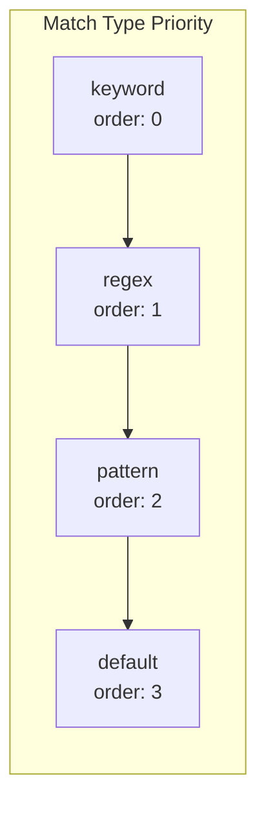
```mermaid
flowchart LR
    subgraph "Match Type Priority"
        K[keyword<br/>order: 0] --> R[regex<br/>order: 1]
        R --> P[pattern<br/>order: 2]
        P --> D[default<br/>order: 3]
    end
```

## Match Type Implementations

[↑ Table of Contents](#table-of-contents)

### Keyword Matcher

The keyword matcher checks if configured keywords appear in the prompt.

**Matching behavior:**

- Case-insensitive matching
- Word boundary awareness (prevents "go" matching "mango")
- Supports single words and multi-word phrases
- Two modes: `any` (OR) and `all` (AND)

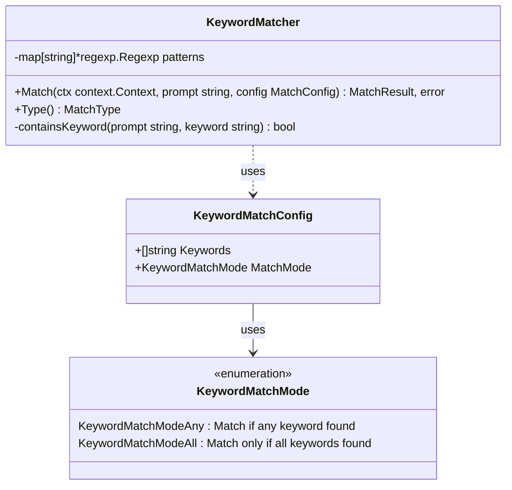
```mermaid
classDiagram
    class KeywordMatcher {
        -map[string]*regexp.Regexp patterns
        +Match(ctx context.Context, prompt string, config MatchConfig) MatchResult, error
        +Type() MatchType
        -containsKeyword(prompt string, keyword string) bool
    }

    class KeywordMatchConfig {
        +[]string Keywords
        +KeywordMatchMode MatchMode
    }

    class KeywordMatchMode {
        <<enumeration>>
        KeywordMatchModeAny : Match if any keyword found
        KeywordMatchModeAll : Match only if all keywords found
    }

    KeywordMatcher ..> KeywordMatchConfig : uses
    KeywordMatchConfig --> KeywordMatchMode : uses
```

**Match algorithm:**

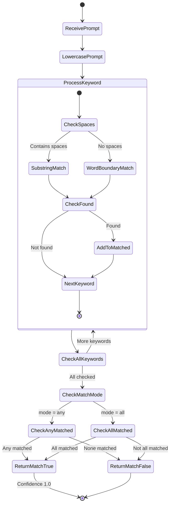
```mermaid
stateDiagram-v2
    [*] --> ReceivePrompt
    ReceivePrompt --> LowercasePrompt
    LowercasePrompt --> ProcessKeyword

    state ProcessKeyword {
        [*] --> CheckSpaces

        state CheckSpaces <<choice>>
        CheckSpaces --> SubstringMatch: Contains spaces
        CheckSpaces --> WordBoundaryMatch: No spaces

        SubstringMatch --> CheckFound
        WordBoundaryMatch --> CheckFound

        state CheckFound <<choice>>
        CheckFound --> AddToMatched: Found
        CheckFound --> NextKeyword: Not found

        AddToMatched --> NextKeyword
        NextKeyword --> [*]
    }

    ProcessKeyword --> CheckAllKeywords

    state CheckAllKeywords <<choice>>
    CheckAllKeywords --> ProcessKeyword: More keywords
    CheckAllKeywords --> CheckMatchMode: All checked

    state CheckMatchMode <<choice>>
    CheckMatchMode --> CheckAnyMatched: mode = any
    CheckMatchMode --> CheckAllMatched: mode = all

    state CheckAnyMatched <<choice>>
    CheckAnyMatched --> ReturnMatchTrue: Any matched
    CheckAnyMatched --> ReturnMatchFalse: None matched

    state CheckAllMatched <<choice>>
    CheckAllMatched --> ReturnMatchTrue: All matched
    CheckAllMatched --> ReturnMatchFalse: Not all matched

    ReturnMatchTrue --> [*]: Confidence 1.0
    ReturnMatchFalse --> [*]
```

**Example rule:**

```json
{
  "name": "go-keyword-match",
  "priority": 100,
  "agent_name": "go-software-agent",
  "match_type": "keyword",
  "match_config": {
    "keywords": ["go", "golang", "go function", "go package"],
    "match_mode": "any"
  }
}
```

### Regex Matcher

The regex matcher evaluates prompts against a regular expression pattern.

**Matching behavior:**

- Compiled regex patterns are cached for performance
- Supports standard Go regex syntax
- Optional flags: `i` (case-insensitive)
- Matches anywhere in the prompt (not anchored)

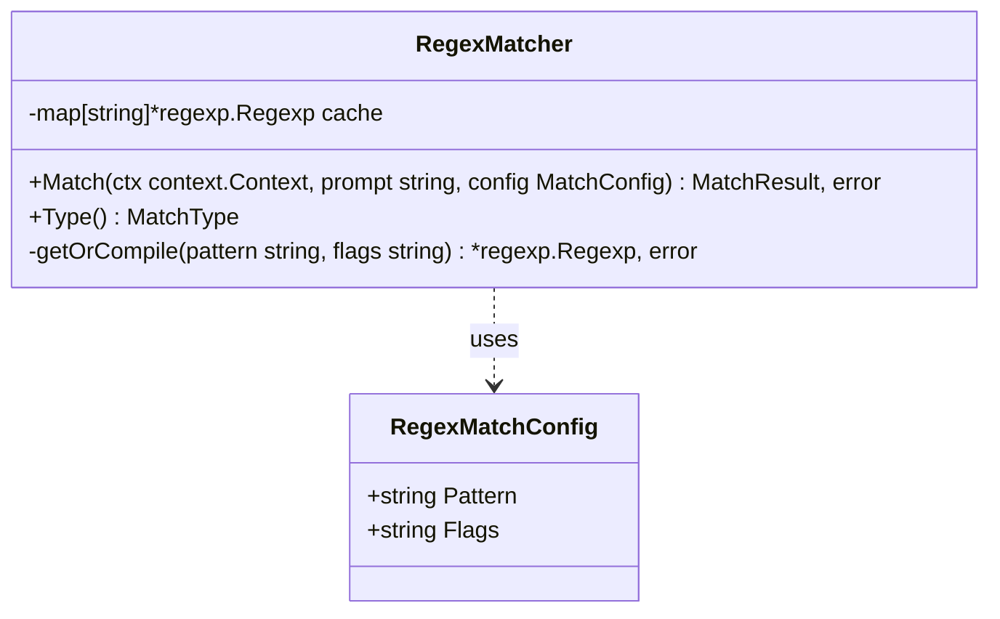
```mermaid
classDiagram
    class RegexMatcher {
        -map[string]*regexp.Regexp cache
        +Match(ctx context.Context, prompt string, config MatchConfig) MatchResult, error
        +Type() MatchType
        -getOrCompile(pattern string, flags string) *regexp.Regexp, error
    }

    class RegexMatchConfig {
        +string Pattern
        +string Flags
    }

    RegexMatcher ..> RegexMatchConfig : uses
```

**Match algorithm:**

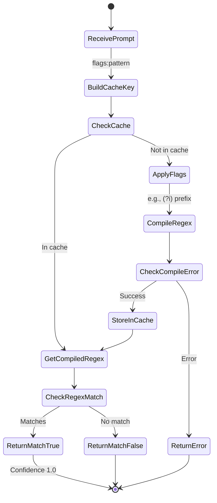
```mermaid
stateDiagram-v2
    [*] --> ReceivePrompt
    ReceivePrompt --> BuildCacheKey: flags:pattern
    BuildCacheKey --> CheckCache

    state CheckCache <<choice>>
    CheckCache --> GetCompiledRegex: In cache
    CheckCache --> ApplyFlags: Not in cache

    ApplyFlags --> CompileRegex: e.g., (?i) prefix
    CompileRegex --> CheckCompileError

    state CheckCompileError <<choice>>
    CheckCompileError --> ReturnError: Error
    CheckCompileError --> StoreInCache: Success

    StoreInCache --> GetCompiledRegex
    GetCompiledRegex --> CheckRegexMatch

    state CheckRegexMatch <<choice>>
    CheckRegexMatch --> ReturnMatchTrue: Matches
    CheckRegexMatch --> ReturnMatchFalse: No match

    ReturnMatchTrue --> [*]: Confidence 1.0
    ReturnMatchFalse --> [*]
    ReturnError --> [*]
```

**Example rule:**

```json
{
  "name": "go-function-regex",
  "priority": 90,
  "agent_name": "go-software-agent",
  "match_type": "regex",
  "match_config": {
    "pattern": "\\b(go|golang)\\b.*\\b(function|method|struct)\\b",
    "flags": "i"
  }
}
```

### Pattern Matcher (Semantic)

The pattern matcher uses semantic similarity to match prompts against stored patterns. This is the only non-deterministic match type, using vector embeddings for similarity.

**Matching behavior:**

- Generates an embedding for the prompt
- Compares against embeddings of configured patterns
- Returns a match if similarity exceeds threshold
- Confidence reflects the similarity score

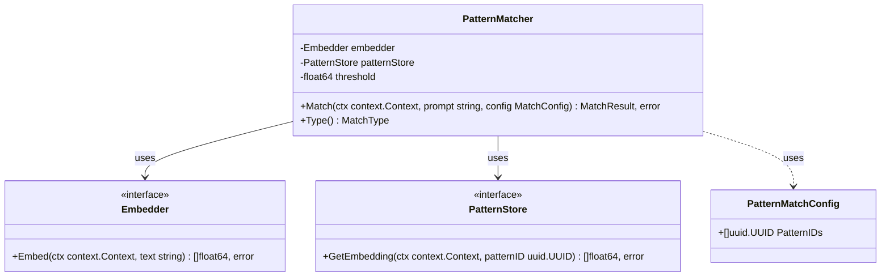
```mermaid
classDiagram
    class PatternMatcher {
        -Embedder embedder
        -PatternStore patternStore
        -float64 threshold
        +Match(ctx context.Context, prompt string, config MatchConfig) MatchResult, error
        +Type() MatchType
    }

    class Embedder {
        <<interface>>
        +Embed(ctx context.Context, text string) []float64, error
    }

    class PatternStore {
        <<interface>>
        +GetEmbedding(ctx context.Context, patternID uuid.UUID) []float64, error
    }

    class PatternMatchConfig {
        +[]uuid.UUID PatternIDs
    }

    PatternMatcher --> Embedder : uses
    PatternMatcher --> PatternStore : uses
    PatternMatcher ..> PatternMatchConfig : uses
```

**Match algorithm:**

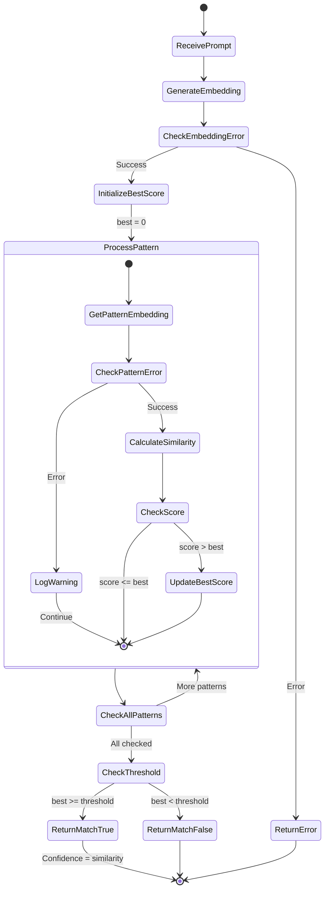
```mermaid
stateDiagram-v2
    [*] --> ReceivePrompt
    ReceivePrompt --> GenerateEmbedding
    GenerateEmbedding --> CheckEmbeddingError

    state CheckEmbeddingError <<choice>>
    CheckEmbeddingError --> ReturnError: Error
    CheckEmbeddingError --> InitializeBestScore: Success

    InitializeBestScore --> ProcessPattern: best = 0

    state ProcessPattern {
        [*] --> GetPatternEmbedding
        GetPatternEmbedding --> CheckPatternError

        state CheckPatternError <<choice>>
        CheckPatternError --> LogWarning: Error
        CheckPatternError --> CalculateSimilarity: Success

        LogWarning --> [*]: Continue
        CalculateSimilarity --> CheckScore

        state CheckScore <<choice>>
        CheckScore --> UpdateBestScore: score > best
        CheckScore --> [*]: score <= best

        UpdateBestScore --> [*]
    }

    ProcessPattern --> CheckAllPatterns

    state CheckAllPatterns <<choice>>
    CheckAllPatterns --> ProcessPattern: More patterns
    CheckAllPatterns --> CheckThreshold: All checked

    state CheckThreshold <<choice>>
    CheckThreshold --> ReturnMatchTrue: best >= threshold
    CheckThreshold --> ReturnMatchFalse: best < threshold

    ReturnMatchTrue --> [*]: Confidence = similarity
    ReturnMatchFalse --> [*]
    ReturnError --> [*]
```

**Example rule:**

```json
{
  "name": "error-handling-pattern",
  "priority": 50,
  "agent_name": "go-software-agent",
  "match_type": "pattern",
  "match_config": {
    "pattern_ids": [
      "550e8400-e29b-41d4-a716-446655440001",
      "550e8400-e29b-41d4-a716-446655440002"
    ]
  }
}
```

**Performance note:** Pattern matching requires embedding generation, which adds latency. Use pattern match rules at lower priorities than keyword/regex rules.

### Default Matcher

The default matcher always matches and serves as a fallback when no other rules match.

**Matching behavior:**

- Always returns `Matched: true`
- Confidence is set to a baseline value (0.5)
- Should have the lowest priority (typically 0)
- Only one default rule should be active

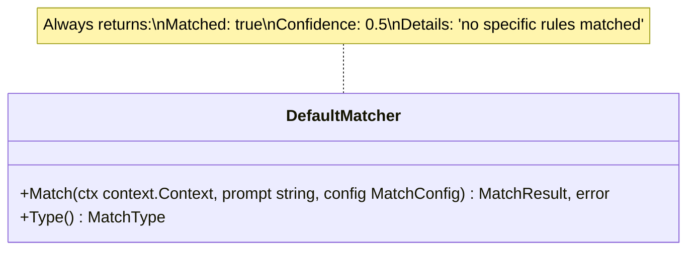
```mermaid
classDiagram
    class DefaultMatcher {
        +Match(ctx context.Context, prompt string, config MatchConfig) MatchResult, error
        +Type() MatchType
    }

    note for DefaultMatcher "Always returns:\nMatched: true\nConfidence: 0.5\nDetails: 'no specific rules matched'"
```

**Example rule:**

```json
{
  "name": "default-fallback",
  "priority": 0,
  "agent_name": "general-agent",
  "match_type": "default",
  "match_config": {}
}
```

## Confidence Scoring

[↑ Table of Contents](#table-of-contents)

### Scoring Logic by Match Type

| Match Type | Confidence Score | Rationale                        |
| ---------- | ---------------- | -------------------------------- |
| keyword    | 1.0              | Explicit keyword match           |
| regex      | 1.0              | Explicit pattern match           |
| pattern    | 0.0 - 1.0        | Cosine similarity score          |
| default    | 0.5              | Baseline for fallback            |

Deterministic match types (keyword, regex) always return 1.0 confidence because the match is binary - either the pattern matches or it does not.

Pattern matching returns the actual similarity score, allowing downstream systems to understand match quality.

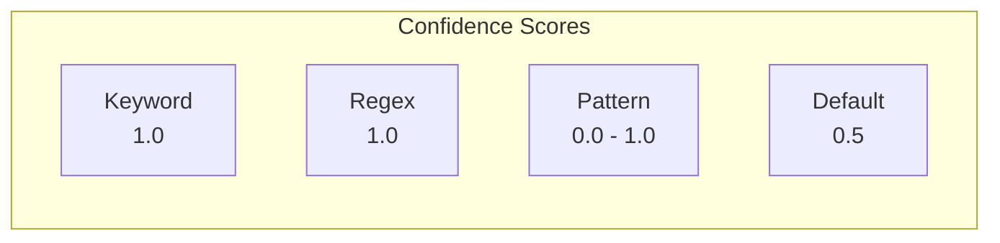
```mermaid
flowchart LR
    subgraph "Confidence Scores"
        K[Keyword<br/>1.0]
        R[Regex<br/>1.0]
        P[Pattern<br/>0.0 - 1.0]
        D[Default<br/>0.5]
    end
```

### Score Normalization

All confidence scores are normalized to the range [0.0, 1.0]:

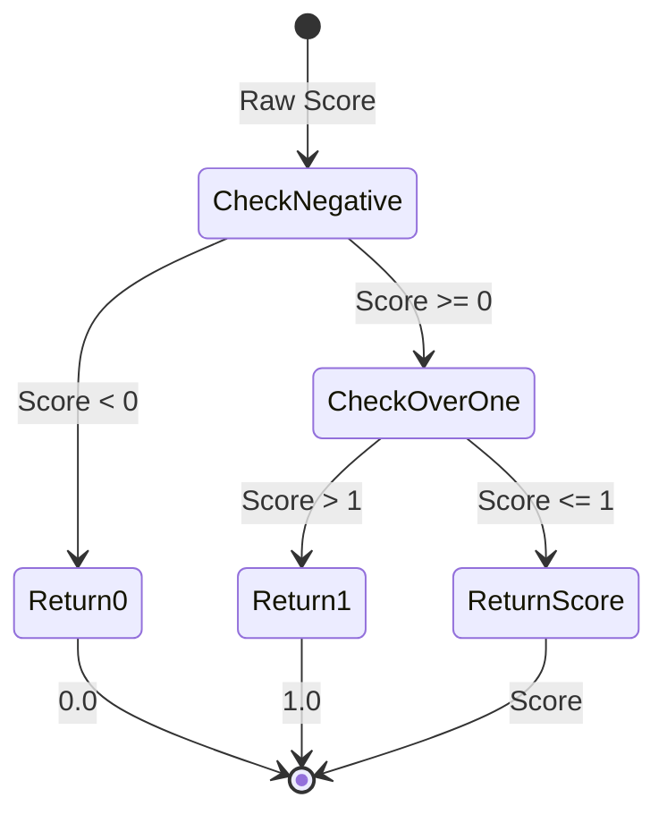
```mermaid
stateDiagram-v2
    [*] --> CheckNegative: Raw Score

    state CheckNegative <<choice>>
    CheckNegative --> Return0: Score < 0
    CheckNegative --> CheckOverOne: Score >= 0

    state CheckOverOne <<choice>>
    CheckOverOne --> Return1: Score > 1
    CheckOverOne --> ReturnScore: Score <= 1

    Return0 --> [*]: 0.0
    Return1 --> [*]: 1.0
    ReturnScore --> [*]: Score
```

### Reasoning Generation

Every routing decision includes a human-readable reasoning string based on the match type:

| Match Type | Reasoning Format                                     |
| ---------- | ---------------------------------------------------- |
| keyword    | `"Matched keywords: go, function"`                   |
| regex      | `"Matched regex pattern: \b(go\|golang)\b"`           |
| pattern    | `"Semantic match with confidence 87%"`               |
| default    | `"No specific rules matched; using default agent"`   |

## Performance Considerations

[↑ Table of Contents](#table-of-contents)

### Latency Targets

| Operation                     | Target   | Maximum |
| ----------------------------- | -------- | ------- |
| Rule evaluation (cache hit)   | < 10ms   | 50ms    |
| Full route request            | < 50ms   | 200ms   |
| Pattern match (with embedding)| < 500ms  | 2s      |

The routing engine is on the critical path for every ACE request. Latency directly impacts user experience.

### Optimization Strategies

**1. Pre-sorted rule cache**

Rules are sorted by priority when loaded into the cache, not during each routing request:

```mermaid
flowchart LR
    subgraph "Good: Sort Once"
        A[Cache Refresh] --> B[Load Rules]
        B --> C[Sort by Priority]
        C --> D[Store in Cache]
    end

    subgraph "Bad: Sort Every Request"
        E[Route Request] --> F[Get Rules]
        F --> G[Sort by Priority]
        G --> H[Evaluate]
    end
```

**2. Compiled regex caching**

Regex patterns are compiled once and stored in a sync.Map to avoid recompilation overhead.

**3. Prompt normalization**

Prompts are normalized (lowercase, trim whitespace) once at the start of routing, not for each rule evaluation.

**4. Short-circuit evaluation**

Stop evaluating rules as soon as a match is found.

**5. Defer expensive operations**

Pattern matching (which requires embedding) should have lower priority than keyword/regex rules:

| Priority | Match Type | Rationale                           |
| -------- | ---------- | ----------------------------------- |
| 100+     | keyword    | Fast, explicit matches first        |
| 50-99    | regex      | Fast, pattern-based matches second  |
| 1-49     | pattern    | Slow, semantic matches last         |
| 0        | default    | Fallback only                       |

### Benchmarking Guidelines

Benchmark targets for the routing engine:

| Scenario                       | Target Latency |
| ------------------------------ | -------------- |
| 100 rules, keyword match       | < 1ms          |
| 100 rules, no match (full scan)| < 5ms          |
| 100 rules, pattern match       | < 500ms        |

## Error Handling

[↑ Table of Contents](#table-of-contents)

The routing engine handles errors gracefully to ensure requests are never dropped:

| Error Scenario              | Behavior                              |
| --------------------------- | ------------------------------------- |
| Invalid regex pattern       | Skip rule, log warning, continue      |
| Pattern embedding fails     | Skip rule, log error, continue        |
| All rules fail              | Return default agent                  |
| Cache refresh fails         | Use stale cache, log error            |
| Unknown match type          | Skip rule, log warning                |

```mermaid
stateDiagram-v2
    [*] --> EvaluateRule
    EvaluateRule --> CheckError

    state CheckError <<choice>>
    CheckError --> CheckMatched: No error
    CheckError --> LogError: Error

    state CheckMatched <<choice>>
    CheckMatched --> ReturnDecision: Matched
    CheckMatched --> NextRule: Not matched

    LogError --> NextRule
    NextRule --> CheckMoreRules

    state CheckMoreRules <<choice>>
    CheckMoreRules --> EvaluateRule: More rules
    CheckMoreRules --> ReturnDefaultDecision: No more rules

    ReturnDecision --> [*]
    ReturnDefaultDecision --> [*]
```

**Key principle:** The router should never fail to return a routing decision. If all rules fail or error, the default agent handles the request.

## References

[↑ Table of Contents](#table-of-contents)

- [OpenAPI Specification](/api/openapi/mnemonic-v1.yaml) - RoutingRule, MatchType, RoutingDecision schemas
- [System Architecture](../architecture/03-system-architecture.md) - Mnemonic component overview
- [Communication Patterns](../architecture/04-communication-patterns.md) - REST endpoint patterns
- [Architectural Decisions](../architecture/02-architectural-decisions.md) - ADR-002: Routing Location
- [Pattern Processing](pattern-processing.md) - Pattern enrichment and embedding
- [Data Models](data-models.md) - Database schemas and Go struct definitions
