# Routing Engine

[Back to Architecture Overview](../../architecture/00-overview.md) | [Back to Project README](../../../README.md)

## Table of Contents

- [Overview](#overview)
- [Design Principles](#design-principles)
- [Interface Definitions](#interface-definitions)
  - [Evaluator Interface](#evaluator-interface)
  - [RuleMatcher Interface](#rulematcher-interface)
  - [Decision Type](#decision-type)
  - [Supporting Types](#supporting-types)
  - [Complete Type Relationships](#complete-type-relationships)
- [Rule Loading and Caching](#rule-loading-and-caching)
  - [Cache Architecture](#cache-architecture)
  - [Startup Behavior](#startup-behavior)
  - [Rule Reloading (Post-MVP)](#rule-reloading-post-mvp)
- [Priority-Ordered Evaluation](#priority-ordered-evaluation)
  - [Evaluation Algorithm](#evaluation-algorithm)
  - [Short-Circuit Behavior](#short-circuit-behavior)
  - [Tie-Breaking Rules](#tie-breaking-rules)
- [Match Type Implementations](#match-type-implementations)
  - [Keyword Matcher](#keyword-matcher)
  - [Regex Matcher](#regex-matcher)
  - [Pattern Matcher (Semantic)](#pattern-matcher-semantic)
  - [Default Matcher](#default-matcher)
- [Confidence Scoring](#confidence-scoring)
  - [Scoring Logic by Match Type](#scoring-logic-by-match-type)
  - [Score Normalization](#score-normalization)
  - [Reasoning Generation](#reasoning-generation)
- [Performance Considerations](#performance-considerations)
  - [Latency Targets](#latency-targets)
  - [Optimization Strategies](#optimization-strategies)
  - [Benchmarking Guidelines](#benchmarking-guidelines)
- [Error Handling](#error-handling)
- [References](#references)

## Overview

[↑ Table of Contents](#table-of-contents)

> **Architecture Reference:** [ADR-002: Routing Location](../../architecture/02-architectural-decisions.md#adr-002-routing-location) | [System Architecture - Mnemonic](../../architecture/03-system-architecture.md#mnemonic) | [Overview - Key Principles](../../architecture/00-overview.md#key-principles)

The routing engine is the core component within Mnemonic that determines which agent should handle a given prompt. As defined in [ADR-002](../../architecture/02-architectural-decisions.md#adr-002-routing-location), routing logic lives server-side in Mnemonic, providing team-wide consistency and centralized management.

Key characteristics:

- **Deterministic**: Routing is code-based, not LLM-driven (per architecture requirements)
- **Priority-ordered**: Rules are evaluated in priority order (highest first)
- **Configurable**: Rules are stored in the database and managed via REST API
- **Fast**: Routing decisions must be made quickly (target: <50ms for deterministic rules; see [Latency Targets](#latency-targets) for tiered SLOs)

The routing engine implements the logic described in the [OpenAPI specification](../../../api/openapi/mnemonic-v1.yaml) for the `POST /v1/api/route` endpoint.

## Design Principles

[↑ Table of Contents](#table-of-contents)

> **Architecture Reference:** [Overview - Key Principles](../../architecture/00-overview.md#key-principles) | [Architectural Decisions](../../architecture/02-architectural-decisions.md)

1. **Determinism over intelligence**: The routing engine uses explicit rules, not LLM inference. This ensures predictable, auditable, and fast routing decisions.

2. **Fail-safe defaults**: If no rules match, a default agent handles the request. The system never fails to route.

3. **Separation of concerns**: The router evaluates rules; matchers implement match logic; the repository handles persistence.

4. **Testability**: All components use interfaces for dependency injection and easy mocking.

5. **Observability**: Every routing decision includes reasoning and metadata for debugging.

## Interface Definitions

[↑ Table of Contents](#table-of-contents)

> **Architecture Reference:** [Communication Patterns - CLI to Mnemonic Communication](../../architecture/04-communication-patterns.md#cli-to-mnemonic-communication) | [Communication Patterns - Response Structure](../../architecture/04-communication-patterns.md#response-structure)

### Evaluator Interface

The `Evaluator` interface defines the primary routing contract. It evaluates the prompt against all enabled routing rules in priority order and returns the first match.

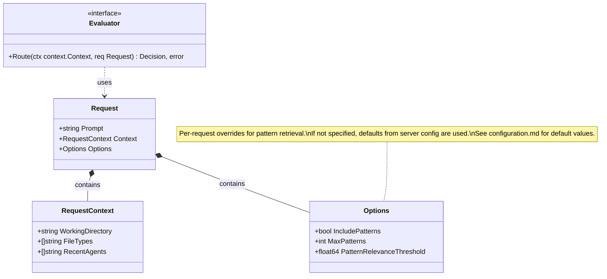

**Options precedence:** The `Options` fields (`IncludePatterns`, `MaxPatterns`, `PatternRelevanceThreshold`) allow per-request overrides of the server-side default values. If these fields are not specified in a request, the Mnemonic server configuration defaults are used.

**Evaluator.Route behavior:**

- Evaluates rules in descending priority order
- Returns immediately when a rule matches (short-circuit evaluation)
- If no rules match, returns a default routing decision using the configured default agent

### RuleMatcher Interface

Each match type implements the `RuleMatcher` interface. Different implementations handle keyword, regex, pattern, and default matching.

Note: `MatchConfig` is an interface implemented by concrete types (`KeywordMatchConfig`, `RegexMatchConfig`, `PatternMatchConfig`, `DefaultMatchConfig`), not a union struct.

```mermaid
classDiagram
    class RuleMatcher {
        <<interface>>
        +Match(ctx context.Context, prompt string, config MatchConfig) MatchResult, error
        +Type() MatchType
        +Close()
    }

    class MatchResult {
        +bool Matched
        +float64 Confidence
        +[]string MatchedKeywords
        +string Details
    }

    class KeywordMatcher {
        -map[string]*cachedPattern patterns
        -time.Duration ttl
        -chan struct{} done
        +Match(ctx context.Context, prompt string, config MatchConfig) MatchResult, error
        +Type() MatchType
        +Close()
        -containsKeyword(prompt string, keyword string) (bool, error)
        -matchWordBoundary(prompt string, keyword string) (bool, error)
        -getOrCompilePattern(keyword string) (*regexp.Regexp, error)
        -cleanExpiredPatterns()
        -cleanupLoop(interval time.Duration)
    }

    class RegexMatcher {
        -map[string]*cachedPattern cache
        -time.Duration ttl
        -chan struct{} done
        +Match(ctx context.Context, prompt string, config MatchConfig) MatchResult, error
        +Type() MatchType
        +Close()
        -getOrCompile(pattern string, flags string) (*regexp.Regexp, error)
        -cleanExpiredPatterns()
        -cleanupLoop(interval time.Duration)
    }

    class PatternMatcher {
        -Embedder embedder
        -PatternStore patternStore
        -float64 threshold
        +Match(ctx context.Context, prompt string, config MatchConfig) MatchResult, error
        +Type() MatchType
    }

    class DefaultMatcher {
        +Match(ctx context.Context, prompt string, config MatchConfig) MatchResult, error
        +Type() MatchType
    }

    RuleMatcher <|.. KeywordMatcher : implements
    RuleMatcher <|.. RegexMatcher : implements
    RuleMatcher <|.. PatternMatcher : implements
    RuleMatcher <|.. DefaultMatcher : implements
    RuleMatcher ..> MatchResult : returns
```

**MatchResult fields:**

| Field             | Type     | Description                                                           |
| ----------------- | -------- | --------------------------------------------------------------------- |
| `Matched`         | bool     | Whether the rule matched the prompt                                   |
| `Confidence`      | float64  | Score from 0.0 to 1.0 indicating match strength                       |
| `MatchedKeywords` | []string | Keywords that triggered a keyword match (empty for other match types) |
| `Details`         | string   | Additional match information for logging                              |

### Decision Type

The `Decision` struct contains the result of routing evaluation and maps to the RoutingDecision schema in the OpenAPI spec.

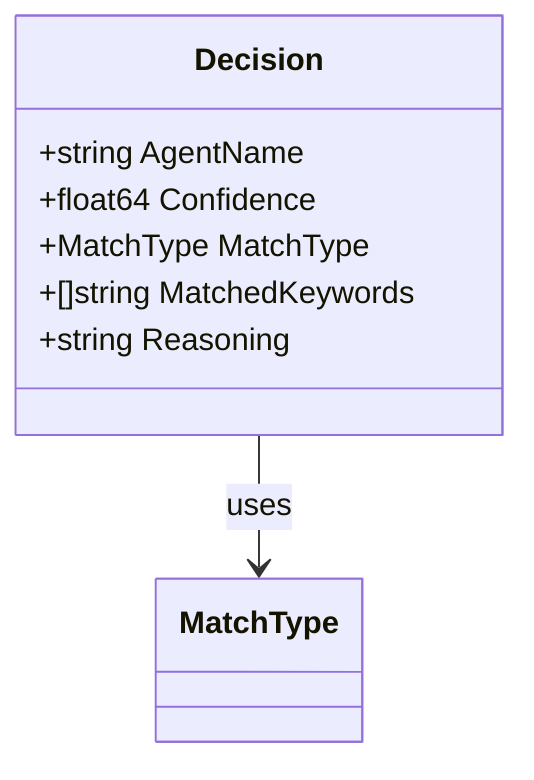

**Decision fields:**

| Field             | Type      | Description                                                     |
| ----------------- | --------- | --------------------------------------------------------------- |
| `AgentName`       | string    | Identifier of the selected agent                                |
| `Confidence`      | float64   | Routing confidence (0.0-1.0, where 1.0 = deterministic match)   |
| `MatchType`       | MatchType | Which type of matching triggered the route                      |
| `MatchedKeywords` | []string  | Keywords that triggered the route (only for MatchTypeKeyword)   |
| `Reasoning`       | string    | Human-readable explanation of why this agent was selected       |

### Supporting Types

The following types support the routing engine's rule evaluation system.

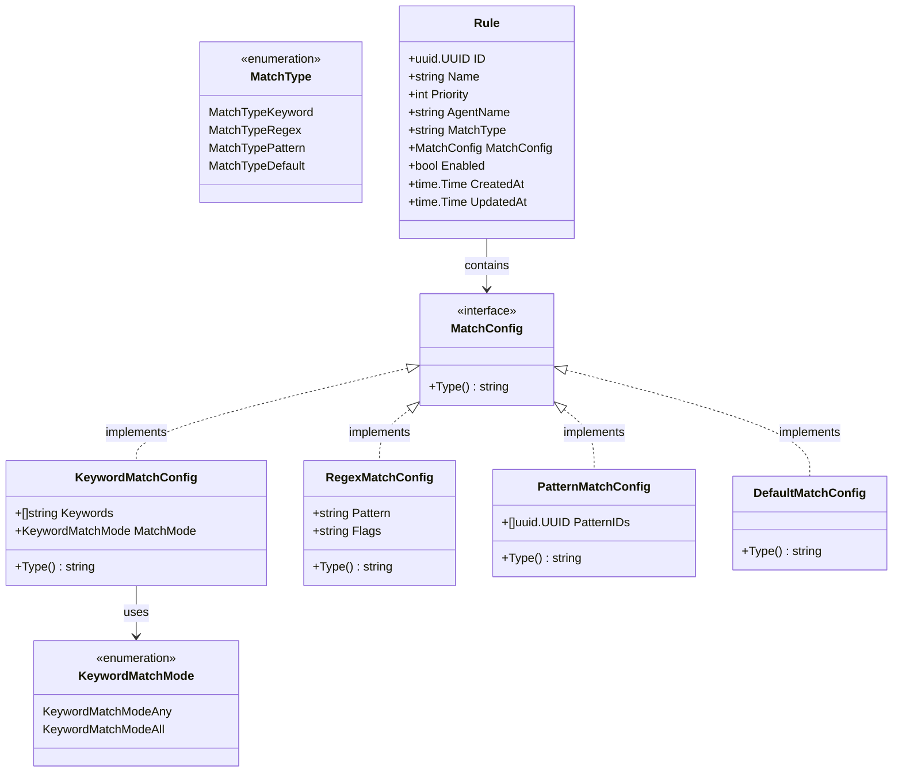

**MatchConfig interface semantics:**

`MatchConfig` is an interface with concrete implementations:

- `MatchType: keyword` -> `KeywordMatchConfig` implements MatchConfig
- `MatchType: regex` -> `RegexMatchConfig` implements MatchConfig
- `MatchType: pattern` -> `PatternMatchConfig` implements MatchConfig
- `MatchType: default` -> `DefaultMatchConfig` implements MatchConfig

Note: `Rule.MatchType` is stored as a plain `string` in the database. The routing engine explicitly converts it to the typed `MatchType` constant during evaluation: `matchType := MatchType(rule.MatchType)`.

### Complete Type Relationships

The following diagram shows the complete relationship between all routing engine types:

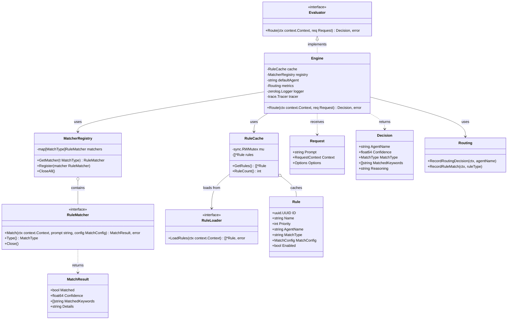

## Rule Loading and Caching

[↑ Table of Contents](#table-of-contents)

> **Architecture Reference:** [System Architecture - Mnemonic](../../architecture/03-system-architecture.md#mnemonic) | [Deployment Architecture - Operational Considerations](../../architecture/05-deployment-architecture.md#operational-considerations)

### Cache Architecture

The routing engine maintains an in-memory cache of enabled routing rules to minimize database queries during routing decisions.

> **MVP Note:** The MVP design uses a simplified cache that loads rules once at startup. Restart the service to reload rules if they change. Background refresh with automatic rule reloading is a Post-MVP feature for multi-user/cloud deployments.

```mermaid
flowchart TD
    subgraph "Routing Engine"
        ENGINE[Engine]
        CACHE[Rule Cache<br/>sync.RWMutex protected]
        MATCHERS[Matcher Registry]
    end

    subgraph "Storage"
        PG[(Postgres)]
    end

    ENGINE --> CACHE
    ENGINE --> MATCHERS
    CACHE <--|"Load on startup"| PG
```

**RuleCache implementation (MVP):**

```go
type RuleCache struct {
    rules []*routingrule.Rule
    mu    sync.RWMutex
}

func NewRuleCache(ctx context.Context, loader RuleLoader) (*RuleCache, error) {
    rules, err := loader.LoadRules(ctx)
    if err != nil {
        return nil, fmt.Errorf("failed to load rules at startup: %w", err)
    }

    // Sort rules: priority descending, then ID ascending for tie-breaking.
    sort.Slice(rules, func(i, j int) bool {
        if rules[i].Priority != rules[j].Priority {
            return rules[i].Priority > rules[j].Priority
        }
        return rules[i].ID.String() < rules[j].ID.String()
    })

    return &RuleCache{rules: rules}, nil
}

func (c *RuleCache) GetRules() []*routingrule.Rule {
    c.mu.RLock()
    defer c.mu.RUnlock()

    // Return a shallow copy to prevent external mutation of the slice.
    result := make([]*routingrule.Rule, len(c.rules))
    copy(result, c.rules)
    return result
}
```

**GetRules behavior:**

- Returns a shallow copy of cached rules (prevents external mutation of the slice)
- Rules are pre-sorted by priority DESC, then by Rule ID ASC (lexicographic)
- The RWMutex ensures safe concurrent access from multiple routing requests
- The shallow copy shares underlying Rule structs with the cache, which is safe because all MatchConfig implementations are value types with immutable fields

### Startup Behavior

On startup, the routing engine must successfully load rules before accepting requests. The MVP uses a fail-fast approach.

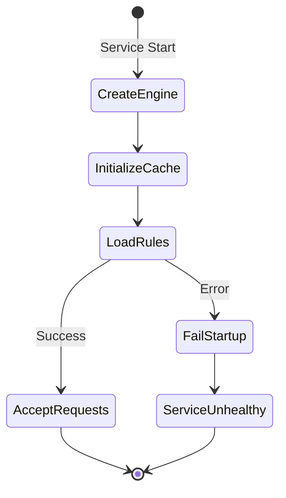

**Startup failure behavior (MVP):**

- If rules cannot be loaded, the service fails to start immediately (fail-fast)
- This prevents routing requests with missing rules
- Health checks report unhealthy until rules are loaded

**Reloading rules (MVP):**

- Restart the service to reload rules from the database
- There is no runtime rule refresh in the MVP

### Rule Reloading (Post-MVP)

> **Post-MVP Feature:** The following capabilities are planned for future releases to support multi-user and cloud deployments.

**Planned features:**

- Background refresh via ticker with configurable `refresh_interval`
- Explicit cache invalidation when rules are modified via admin API
- Graceful degradation for refresh failures (use stale cache)
- `Engine.ReloadRules(ctx context.Context) error` method for on-demand refresh
- Configurable `startup_timeout` for initial rule load

**Planned configuration:**

| Setting           | Default | Description                            |
| ----------------- | ------- | -------------------------------------- |
| `refresh_interval`| 5m      | Background refresh interval            |
| `startup_timeout` | 30s     | Max time to wait for initial rule load |

These features enable rule changes to propagate without service restarts, which is important for:

- Multi-user environments where different teams manage rules
- Cloud deployments with automated rule updates
- High-availability scenarios where restarts are undesirable

## Priority-Ordered Evaluation

[↑ Table of Contents](#table-of-contents)

> **Architecture Reference:** [System Architecture - Data Flow](../../architecture/03-system-architecture.md#data-flow) | [Requirements - Goals](../../architecture/01-requirements.md#goals)

### Evaluation Algorithm

Rules are evaluated in a deterministic order: descending by priority, then ascending by Rule ID (lexicographic). The first rule that matches determines the routing decision.

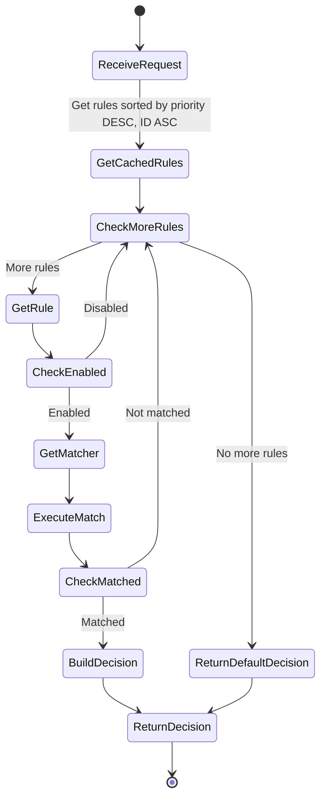

**Algorithm pseudocode:**

1. Retrieve pre-sorted rules from cache
2. Normalize the prompt (trim whitespace only; matchers handle case-folding)
3. For each rule in priority order:
   - Skip if rule is disabled
   - Get the appropriate matcher for the rule's match type
   - Execute the match operation
   - If match result is true, build and return Decision
4. If no rules matched, return default decision

**Note on prompt normalization:** The routing engine performs minimal normalization (trim whitespace only). Case-folding is the responsibility of individual matchers. For example, the keyword matcher lowercases both prompt and keywords internally, while the regex matcher uses the `i` flag for case-insensitive matching.

### Short-Circuit Behavior

The routing engine uses short-circuit evaluation for performance:

1. **First match wins**: Once a rule matches, evaluation stops immediately
2. **Priority ordering**: Higher priority rules are evaluated first
3. **Skip disabled**: Disabled rules are skipped without evaluation

This design ensures that high-priority rules are always considered first, and adding lower-priority fallback rules does not impact performance of primary routing paths.

### Tie-Breaking Rules

When multiple rules have the same priority, ties are broken deterministically using the Rule ID:

| Order | Criterion | Rationale                                   |
| ----- | --------- | ------------------------------------------- |
| 1     | Priority  | Explicit operator control                   |
| 2     | Rule ID   | Deterministic fallback (lexicographic sort) |

**Best Practice:** Assign unique priorities to rules whenever possible. This gives operators explicit control over evaluation order and makes rule behavior easier to understand and debug. Rule ID tie-breaking exists as a deterministic fallback, not as a primary ordering mechanism.

## Match Type Implementations

[↑ Table of Contents](#table-of-contents)

> **Architecture Reference:** [Communication Patterns - Request Flow](../../architecture/04-communication-patterns.md#request-flow)

### Keyword Matcher

The keyword matcher checks if configured keywords appear in the prompt.

**Matching behavior:**

- Case-insensitive matching
- Word boundary awareness (prevents "go" matching "mango")
- Supports single words and multi-word phrases
- Two modes: `any` (OR) and `all` (AND)
- Uses sliding TTL cache for compiled regex patterns to balance performance and memory
- Falls back to substring matching for keywords containing non-word characters (e.g., "c++", "func()")

```mermaid
classDiagram
    class KeywordMatcher {
        -map[string]*cachedPattern patterns
        -time.Duration ttl
        -chan struct{} done
        +Match(ctx context.Context, prompt string, config MatchConfig) MatchResult, error
        +Type() MatchType
        +Close()
        -containsKeyword(prompt string, keyword string) (bool, error)
        -matchWordBoundary(prompt string, keyword string) (bool, error)
        -getOrCompilePattern(keyword string) (*regexp.Regexp, error)
        -cleanExpiredPatterns()
        -cleanupLoop(interval time.Duration)
    }

    class KeywordMatchConfig {
        +[]string Keywords
        +MatchMode MatchMode
    }

    class MatchMode {
        <<enumeration>>
        MatchModeAny : Match if any keyword found
        MatchModeAll : Match only if all keywords found
    }

    KeywordMatcher ..> KeywordMatchConfig : uses
    KeywordMatchConfig --> MatchMode : uses
```

**Match algorithm:**

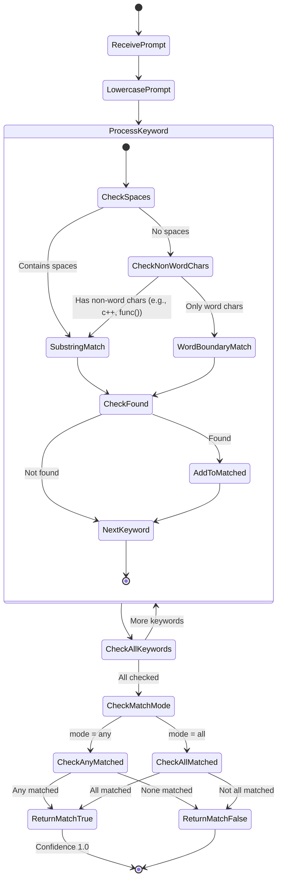

**Example rule:**

```json
{
  "name": "go-keyword-match",
  "priority": 100,
  "agent_name": "go-software-agent",
  "match_type": "keyword",
  "match_config": {
    "keywords": ["go", "golang", "go function", "go package"],
    "match_mode": "any"
  }
}
```

### Regex Matcher

The regex matcher evaluates prompts against a regular expression pattern.

**Matching behavior:**

- Compiled regex patterns are cached for performance with sliding TTL
- Background cleanup goroutine removes expired patterns to manage memory
- Supports standard Go regex syntax
- Optional flags: `i` (case-insensitive)
- Unknown flags are rejected with a clear error message
- Matches anywhere in the prompt (not anchored)
- Prompt normalization (trim whitespace) is performed by the engine; case-folding is controlled by regex flags

```mermaid
classDiagram
    class RegexMatcher {
        -map[string]*cachedPattern cache
        -time.Duration ttl
        -chan struct{} done
        +Match(ctx context.Context, prompt string, config MatchConfig) MatchResult, error
        +Type() MatchType
        +Close()
        -getOrCompile(pattern string, flags string) (*regexp.Regexp, error)
        -cleanExpiredPatterns()
        -cleanupLoop(interval time.Duration)
    }

    class RegexMatchConfig {
        +string Pattern
        +string Flags
    }

    RegexMatcher ..> RegexMatchConfig : uses
```

**Match algorithm:**

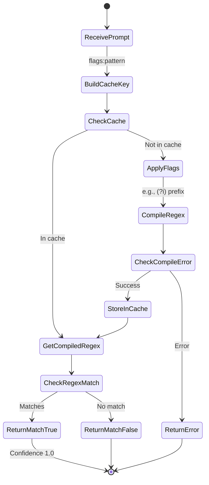

**Example rule:**

```json
{
  "name": "go-function-regex",
  "priority": 90,
  "agent_name": "go-software-agent",
  "match_type": "regex",
  "match_config": {
    "pattern": "\\b(go|golang)\\b.*\\b(function|method|struct)\\b",
    "flags": "i"
  }
}
```

### Pattern Matcher (Semantic)

The pattern matcher uses semantic similarity to match prompts against stored patterns. This is the only non-deterministic match type, using vector embeddings for similarity.

**Matching behavior:**

- Generates an embedding for the prompt
- Compares against embeddings of configured patterns
- Returns a match if similarity exceeds threshold
- Confidence reflects the similarity score

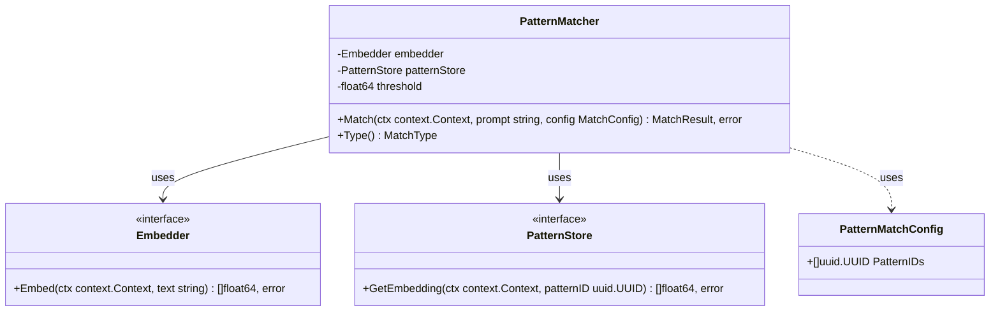

**Match algorithm:**

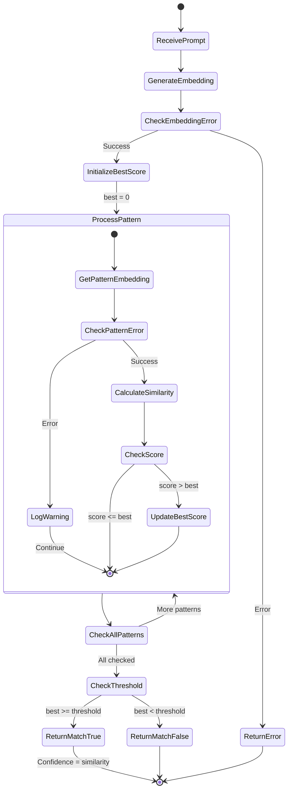

**Example rule:**

```json
{
  "name": "error-handling-pattern",
  "priority": 50,
  "agent_name": "go-software-agent",
  "match_type": "pattern",
  "match_config": {
    "pattern_ids": [
      "550e8400-e29b-41d4-a716-446655440001",
      "550e8400-e29b-41d4-a716-446655440002"
    ]
  }
}
```

**Performance note:** Pattern matching requires embedding generation, which adds latency. Use pattern match rules at lower priorities than keyword/regex rules.

### Default Matcher

The default matcher always matches and serves as a fallback when no other rules match.

**Matching behavior:**

- Always returns `Matched: true`
- Confidence is set to a baseline value (0.5)
- Should have the lowest priority (typically 0)
- Only one default rule should be active

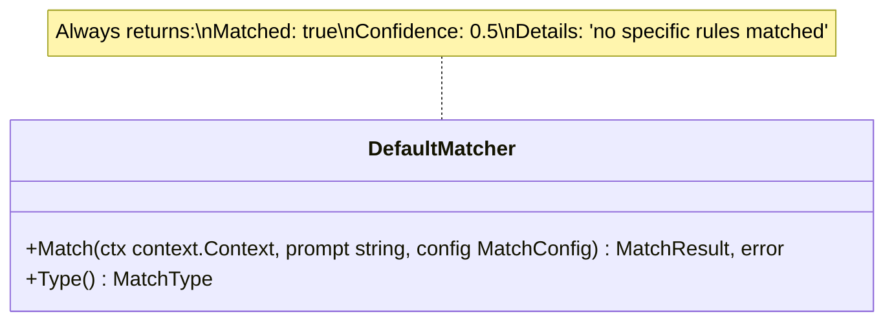

**Example rule:**

```json
{
  "name": "default-fallback",
  "priority": 0,
  "agent_name": "general-agent",
  "match_type": "default",
  "match_config": {}
}
```

## Confidence Scoring

[↑ Table of Contents](#table-of-contents)

> **Architecture Reference:** [Communication Patterns - Response Structure](../../architecture/04-communication-patterns.md#response-structure)

### Scoring Logic by Match Type

| Match Type | Confidence Score | Rationale               |
| ---------- | ---------------- | ----------------------- |
| keyword    | 1.0              | Explicit keyword match  |
| regex      | 1.0              | Explicit pattern match  |
| pattern    | 0.0 - 1.0        | Cosine similarity score |
| default    | 0.5              | Baseline for fallback   |

Deterministic match types (keyword, regex) always return 1.0 confidence because the match is binary - either the pattern matches or it does not.

Pattern matching returns the actual cosine similarity score, allowing downstream systems to understand match quality.

> **Note:** Routing uses simple cosine similarity for fast rule matching. For richer relevance scoring during pattern search and retrieval, the Pattern Processing system uses a combined formula that incorporates graph context. See [Pattern Processing - Relevance Scoring](pattern-processing.md#relevance-scoring) for details.

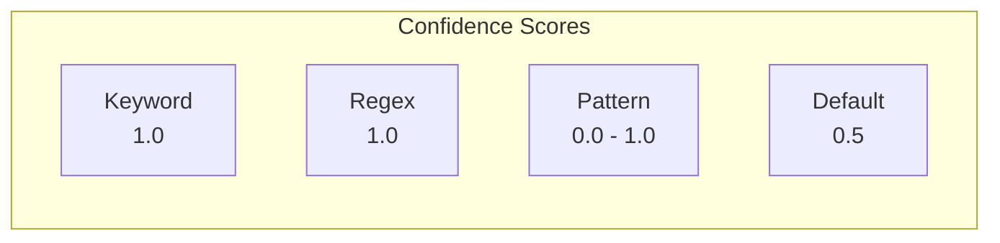

### Score Normalization

All confidence scores are normalized to the range [0.0, 1.0]:

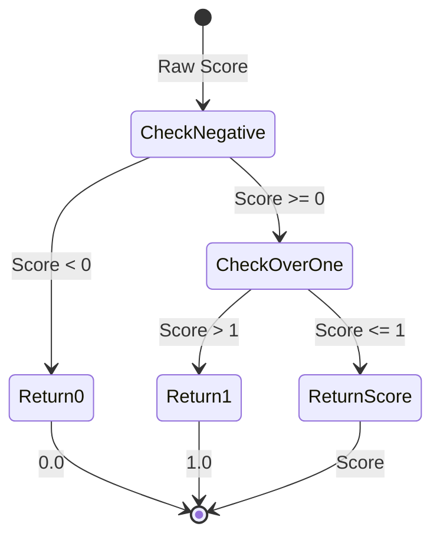

### Reasoning Generation

Every routing decision includes a human-readable reasoning string based on the match type:

| Match Type | Reasoning Format                                   |
| ---------- | -------------------------------------------------- |
| keyword    | `"Matched keywords: go, function"`                 |
| regex      | `"Matched regex pattern: \b(go\|golang)\b"`        |
| pattern    | `"Semantic match with confidence 87%"`             |
| default    | `"No specific rules matched; using default agent"` |

## Performance Considerations

[↑ Table of Contents](#table-of-contents)

> **Architecture Reference:** [Requirements - Quality Attributes](../../architecture/01-requirements.md#quality-attributes) | [Communication Patterns - Timeout Handling](../../architecture/04-communication-patterns.md#timeout-handling)

### Latency Targets

The routing engine uses a **tiered latency model** because different match types have fundamentally different computational costs:

- **Keyword/Regex matching** is deterministic and fast (string operations only)
- **Pattern matching** requires embedding generation and vector similarity search, which involves external API calls or model inference

This is why the Design Principles section references "<50ms" while pattern matching allows up to 2 seconds - these are separate tiers, not contradictory targets.

**Tiered SLO Table:**

| Match Type | P50 | P95 | P99 (Max) | Notes |
| --- | --- | --- | --- | --- |
| Keyword | <5ms | <20ms | <50ms | String matching only |
| Regex | <5ms | <20ms | <50ms | Compiled regex, cached |
| Pattern (semantic) | <300ms | <800ms | <2s | Embedding generation + vector search |
| Default | <1ms | <5ms | <10ms | No-op, always matches |

**Operation-Level Targets:**

| Operation                      | Target  | Maximum | Applies To |
| ------------------------------ | ------- | ------- | ---------- |
| Rule evaluation (cache hit)    | < 10ms  | 50ms    | Keyword, Regex, Default |
| Full route request (deterministic) | < 50ms  | 200ms   | When pattern rules not triggered |
| Full route request (with pattern fallback) | < 500ms | 2s      | When pattern matching required |

**Why Pattern Matching is Slower:**

1. **Embedding generation**: The prompt must be converted to a vector embedding, typically requiring an API call to an embedding service or local model inference
2. **Vector similarity search**: The prompt embedding is compared against stored pattern embeddings using cosine similarity
3. **Multiple pattern comparisons**: A single pattern rule may reference multiple pattern IDs, each requiring similarity calculation

**Priority Ordering Ensures Fast Paths First:**

The [Optimization Strategies](#optimization-strategies) section explains that keyword and regex rules should have higher priority than pattern rules. This ensures:

- Most requests are routed via fast deterministic rules (<50ms)
- Pattern matching only runs as a fallback when deterministic rules do not match
- Users experience fast routing for common cases while still having semantic flexibility for edge cases

The routing engine is on the critical path for every ACE request. Latency directly impacts user experience.

### Optimization Strategies

**1. Pre-sorted rule cache**

Rules are sorted by priority when loaded into the cache, not during each routing request:

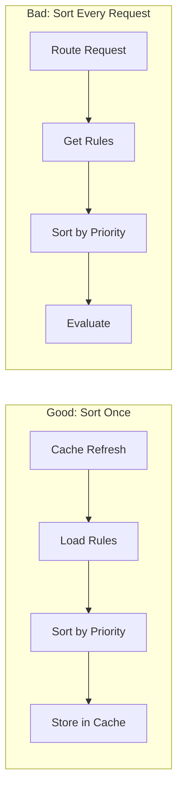

**2. Compiled regex caching**

Regex patterns are compiled once and stored in a sync.Map to avoid recompilation overhead.

**3. Prompt normalization**

Prompts are normalized (lowercase, trim whitespace) once at the start of routing, not for each rule evaluation.

**4. Short-circuit evaluation**

Stop evaluating rules as soon as a match is found.

**5. Defer expensive operations**

Pattern matching (which requires embedding) should have lower priority than keyword/regex rules:

| Priority | Match Type | Rationale                          |
| -------- | ---------- | ---------------------------------- |
| 100+     | keyword    | Fast, explicit matches first       |
| 50-99    | regex      | Fast, pattern-based matches second |
| 1-49     | pattern    | Slow, semantic matches last        |
| 0        | default    | Fallback only                      |

### Benchmarking Guidelines

Benchmark targets for the routing engine:

| Scenario                        | Target Latency |
| ------------------------------- | -------------- |
| 100 rules, keyword match        | < 1ms          |
| 100 rules, no match (full scan) | < 5ms          |
| 100 rules, pattern match        | < 500ms        |

## Error Handling

[↑ Table of Contents](#table-of-contents)

> **Architecture Reference:** [Communication Patterns - Error Handling](../../architecture/04-communication-patterns.md#error-handling) | [Communication Patterns - Fallback Behavior](../../architecture/04-communication-patterns.md#fallback-behavior)

The routing engine handles errors gracefully to ensure requests are never dropped:

**MVP error handling:**

| Error Scenario          | Behavior                         |
| ----------------------- | -------------------------------- |
| Invalid regex pattern   | Skip rule, log warning, continue |
| Pattern embedding fails | Skip rule, log error, continue   |
| All rules fail          | Return default agent             |
| Unknown match type      | Skip rule, log warning           |
| Startup rule load fails | Service fails to start (fail-fast) |

**Post-MVP error handling:**

| Error Scenario          | Behavior                         |
| ----------------------- | -------------------------------- |
| Cache refresh fails     | Use stale cache, log error       |

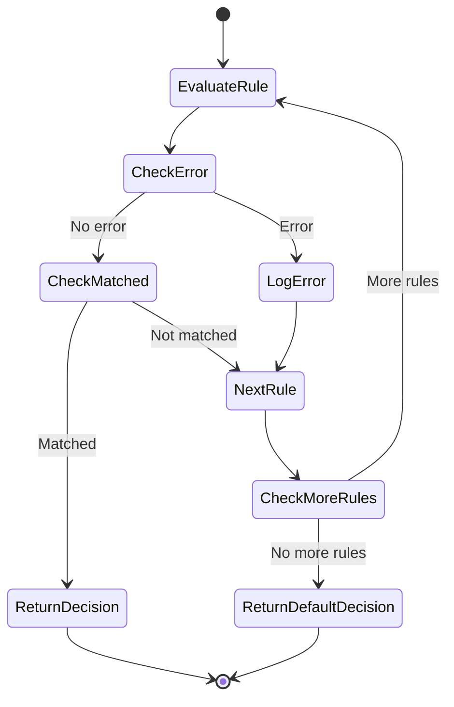

**Key principle:** The routing engine should never fail to return a routing decision. If all rules fail or error, the default agent handles the request.

## References

[↑ Table of Contents](#table-of-contents)

- [OpenAPI Specification](../../../api/openapi/mnemonic-v1.yaml) - Rule (RoutingRule), MatchType, Decision (RoutingDecision) schemas
- [System Architecture](../../architecture/03-system-architecture.md) - Mnemonic component overview
- [Communication Patterns](../../architecture/04-communication-patterns.md) - REST endpoint patterns
- [Architectural Decisions](../../architecture/02-architectural-decisions.md) - ADR-002: Routing Location
- [Pattern Processing](pattern-processing.md) - Pattern enrichment and embedding
- [Configuration](configuration.md) - Server configuration including routing settings
