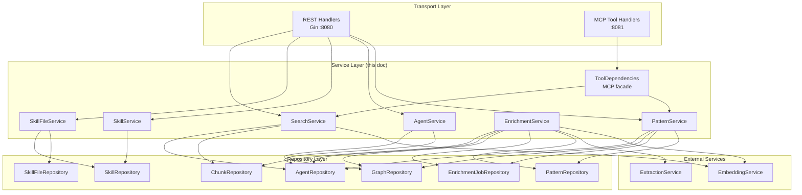
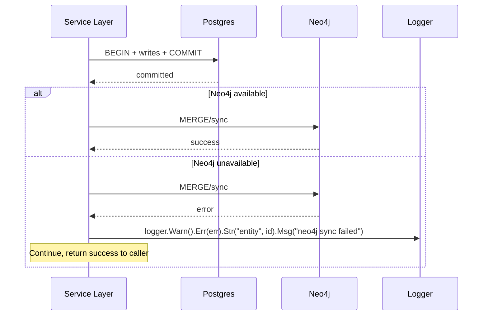

# Service Layer Design

[Back to Architecture Overview](../architecture/README.md) | [Back to Project README](../../README.md)

## Table of Contents

- [Overview](#overview)
- [Package Layout](#package-layout)
- [External Service Interfaces](#external-service-interfaces)
  - [EmbeddingService](#embeddingservice)
  - [ExtractionService](#extractionservice)
- [Domain Service Interfaces](#domain-service-interfaces)
  - [PatternService](#patternservice)
  - [AgentService](#agentservice)
  - [SkillService](#skillservice)
  - [SkillFileService](#skillfileservice)
  - [EnrichmentService](#enrichmentservice)
  - [SearchService](#searchservice)
- [ToolDependencies: MCP Facade](#tooldependencies-mcp-facade)
  - [Interface Definition](#interface-definition)
  - [Concrete Implementation](#concrete-implementation)
  - [MCP Handler Wiring](#mcp-handler-wiring)
- [Resolving the find_related_patterns Data Gap](#resolving-the-find_related_patterns-data-gap)
  - [Updated GraphRepository Interface](#updated-graphrepository-interface)
  - [Updated Cypher Query](#updated-cypher-query)
  - [Service Layer Mapping](#service-layer-mapping)
- [Transaction Boundaries](#transaction-boundaries)
  - [Pattern Create](#pattern-create)
  - [Pattern Update with Content Change](#pattern-update-with-content-change)
  - [Pattern Update without Content Change](#pattern-update-without-content-change)
  - [Agent Create and Update](#agent-create-and-update)
  - [Agent Delete](#agent-delete)
  - [Pattern-Agent Associations](#pattern-agent-associations)
  - [Pattern Delete](#pattern-delete)
  - [Transaction Helper](#transaction-helper)
- [Cross-Database Coordination](#cross-database-coordination)
  - [Coordination Pattern](#coordination-pattern)
  - [Failure Scenarios](#failure-scenarios)
  - [Neo4j Sync Helper](#neo4j-sync-helper)
- [Error Mapping](#error-mapping)
  - [Service-Level Sentinel Errors](#service-level-sentinel-errors)
  - [REST Error Mapping](#rest-error-mapping)
  - [MCP Error Mapping](#mcp-error-mapping)
  - [Mapping Implementation](#mapping-implementation)
- [Agent Filter for search_patterns](#agent-filter-for-search_patterns)
- [Enrichment Job Lifecycle](#enrichment-job-lifecycle)
  - [Pipeline Steps](#pipeline-steps)
  - [RELATED_TO Edge Computation](#related_to-edge-computation)
  - [Enrichment Service Interface Usage](#enrichment-service-interface-usage)
- [Cursor-Based Pagination](#cursor-based-pagination)
  - [Cursor Encoding](#cursor-encoding)
  - [Handler-Layer Responsibility](#handler-layer-responsibility)
  - [Service Layer Contract](#service-layer-contract)
- [Dependency Wiring](#dependency-wiring)
- [Required Changes to data-storage.md](#required-changes-to-data-storagemd)
- [Required Changes to configuration.md](#required-changes-to-configurationmd)
- [Key Takeaways](#key-takeaways)
- [References](#references)

## Overview

[Table of Contents](#table-of-contents)

> **Architecture Reference:** [System Architecture - Mnemonic Server](../architecture/02-system-architecture.md#mnemonic-server) | [Data Architecture - Data Flow Patterns](../architecture/04-data-architecture.md#data-flow-patterns)

The service layer sits between the transport handlers (REST and MCP) and the data repositories. It is responsible for:

- **Business logic** -- validation beyond what the database enforces, CRC64 computation, timestamp management
- **Multi-store coordination** -- orchestrating writes across Postgres and Neo4j within a defined consistency model
- **Enrichment orchestration** -- creating enrichment jobs when patterns change, running the enrichment pipeline
- **Query composition** -- combining data from multiple repositories to fulfill a single request (e.g., `get_pattern` reads from Postgres and Neo4j)
- **Error translation** -- mapping repository-level errors to service-level errors that handlers can translate to HTTP/MCP responses

The service layer does NOT:

- Parse HTTP requests or MCP tool inputs (that is the handler layer)
- Format HTTP responses or MCP markdown output (that is the handler layer)
- Manage database connections or transactions directly (it uses repository interfaces with injected `DBTX`)
- Run the enrichment worker goroutine lifecycle (that is a separate design concern)



## Package Layout

[Table of Contents](#table-of-contents)

Service interfaces and implementations live under `internal/service/`. Each domain gets its own sub-package to keep repository type imports unambiguous.

**Note:** All paths shown in this document are filesystem paths relative to the repository root (`src/mnemonic/`).

```text
src/mnemonic/internal/service/
    agent/
        service.go          -- AgentService interface + agentService struct
    pattern/
        service.go          -- PatternService interface + patternService struct
    skill/
        service.go          -- SkillService interface + skillService struct
    skillfile/
        service.go          -- SkillFileService interface + skillFileService struct
    enrichment/
        service.go          -- EnrichmentService interface + enrichmentService struct
    search/
        service.go          -- SearchService interface + searchService struct
    openai/
        embedding.go        -- EmbeddingService interface + openaiEmbedding struct
        extraction.go       -- ExtractionService interface + openaiExtraction struct
```

The `internal/mcpserver/deps.go` file defines the `ToolDependencies` interface. Its concrete implementation (`toolDeps` struct) lives in the same package and composes service interfaces.

## External Service Interfaces

[Table of Contents](#table-of-contents)

> **Architecture Reference:** [Pattern Processing - External Service Dependencies](pattern-processing.md#external-service-dependencies) | [Configuration - OpenAI](configuration.md#configuration-file)

External AI service calls are abstracted behind interfaces so they can be mocked in tests and swapped for different providers post-MVP.

### EmbeddingService

```go
// Package: internal/service/openai

// EmbeddingService generates vector embeddings from text.
// MVP implementation calls OpenAI text-embedding-3-small.
type EmbeddingService interface {
    // Embed generates a vector embedding for the given text.
    // Returns a float32 slice of length matching the configured dimensions (1536).
    // Returns ErrEmbeddingFailed if the API call fails after retries.
    Embed(ctx context.Context, text string) ([]float32, error)
}

var ErrEmbeddingFailed = errors.New("embedding generation failed")
```

The concrete implementation uses the OpenAI embeddings API with the model and dimensions from `config.OpenAIConfig`. It handles retries internally per `OpenAIConfig.RetryAttempts` and `RetryDelay`.

### ExtractionService

```go
// Package: internal/service/openai

// Concept represents an entity extracted from pattern content.
type Concept struct {
    Name string // Normalized to lowercase
    Type string // "technology", "practice", or "domain"
}

// ExtractionService extracts structured concepts from text using an LLM.
// MVP implementation calls OpenAI gpt-4o-mini chat completions.
type ExtractionService interface {
    // Extract identifies concepts, technologies, and practices in the text.
    // Returns a slice of Concept with normalized lowercase names.
    // Returns ErrExtractionFailed if the API call fails after retries.
    Extract(ctx context.Context, text string) ([]Concept, error)
}

var ErrExtractionFailed = errors.New("concept extraction failed")
```

The concrete implementation sends the pattern content to OpenAI with the entity extraction prompt from [Pattern Processing - Entity Extraction Prompt](pattern-processing.md#entity-extraction-prompt). It parses the structured JSON response into `[]Concept`.

## Domain Service Interfaces

[Table of Contents](#table-of-contents)

Each domain service defines the operations that handlers call. Service methods accept and return domain types, not HTTP request/response types.

### PatternService

```go
// Package: internal/service/pattern

import (
    "context"
    "time"

    "github.com/google/uuid"
    patternrepo "github.com/twistingmercury/mnemonic/internal/repository/pattern"
    enrichmentrepo "github.com/twistingmercury/mnemonic/internal/repository/enrichmentjob"
    graphrepo "github.com/twistingmercury/mnemonic/internal/repository/graph"
)

// PatternService manages pattern lifecycle including enrichment orchestration.
type PatternService interface {
    // Create stores a new pattern and queues an enrichment job.
    // Both operations execute in a single Postgres transaction.
    // Returns the created pattern (enrichment_status: pending).
    Create(ctx context.Context, input CreateInput) (*patternrepo.Pattern, error)

    // Get retrieves a pattern by ID. Returns ErrNotFound if not found.
    Get(ctx context.Context, id uuid.UUID) (*patternrepo.Pattern, error)

    // GetWithGraph retrieves a pattern by ID with graph context from Neo4j.
    // Returns (pattern, graphContext, error). graphContext is nil if enrichment
    // is not complete or if Neo4j is unavailable.
    GetWithGraph(ctx context.Context, id uuid.UUID) (*patternrepo.Pattern, *GraphContext, error)

    // Update replaces a pattern. If content changed, resets enrichment status
    // to pending and queues a new enrichment job (same transaction).
    // Returns the updated pattern.
    Update(ctx context.Context, id uuid.UUID, input UpdateInput) (*patternrepo.Pattern, error)

    // Delete removes a pattern by ID. Cascade deletes handle associations
    // and enrichment jobs in Postgres. Best-effort cleanup in Neo4j.
    Delete(ctx context.Context, id uuid.UUID) error

    // List retrieves patterns with filtering and pagination.
    List(ctx context.Context, filter patternrepo.Filter, opts ListOptions) ([]*patternrepo.Pattern, int64, error)

    // SetAgentAssociations replaces all agent associations for a pattern.
    // Executes in a single Postgres transaction. Best-effort Neo4j sync.
    SetAgentAssociations(ctx context.Context, patternID uuid.UUID, associations []AssociationInput) error

    // GetAgentAssociations retrieves all agent associations for a pattern.
    GetAgentAssociations(ctx context.Context, patternID uuid.UUID) ([]patternrepo.AgentAssociation, error)
}

// CreateInput contains the fields needed to create a pattern.
type CreateInput struct {
    Name              string
    Description       *string
    Content           string
    Tags              []string
    AgentAssociations []AssociationInput
    EntityType        string   // kebab-case, e.g. "best-practice"
    Language          string   // go, agnostic, shell, python, typescript, sql
    Domain            string   // backend, api-design, testing, frontend, infrastructure, data, agnostic
    Version           *string
    RelatedPatterns   []string // pattern names or IDs
}

// UpdateInput contains the fields for replacing a pattern.
type UpdateInput struct {
    Name              string
    Description       *string
    Content           string
    Tags              []string
    AgentAssociations []AssociationInput
    EntityType        string
    Language          string
    Domain            string
    Version           *string
    RelatedPatterns   []string
}

// AssociationInput represents an agent association in API input.
type AssociationInput struct {
    AgentName string
    Relevance float64
}

// GraphContext holds Neo4j graph data for a single pattern.
// Used by GetWithGraph and the get_pattern MCP tool.
type GraphContext struct {
    RelatedPatterns []RelatedPatternResult
    Concepts        []ConceptResult
}

// RelatedPatternResult is a pattern found via graph traversal.
// The Similarity field uses "similarity" as the canonical service-layer term (consistent
// with MCP tools and 08-mcp-tools.md). The REST handler maps Similarity to "strength"
// in JSON responses to match the OpenAPI GraphContext schema.
// Note: SharedConcepts is available for MCP tools (find_related_patterns
// includes shared concepts in its markdown response) but is omitted from
// REST serialization — the OpenAPI GraphContext.related_patterns items have
// only id, name, relationship, and strength.
type RelatedPatternResult struct {
    ID             uuid.UUID
    Name           string
    Relationship   string   // Edge type, e.g. "RELATED_TO"
    Similarity     float64  // Concept-overlap score (0.0-1.0)
    SharedConcepts []string
}

// ConceptResult is an extracted concept for display.
// Note: Type is used internally and by MCP tools but is not exposed in the
// REST API. The OpenAPI GraphContext.concepts schema has only name and
// description. The REST handler omits Type during serialization.
type ConceptResult struct {
    Name        string
    Type        string
    Description string // From Concept node properties, if available
}

// ListOptions for service-layer pagination.
type ListOptions struct {
    Offset int
    Limit  int
}
```

**Handler Composition Patterns:**

The REST handler for `GET /v1/api/patterns/{id}` composes the full `Pattern` response by calling two service methods:

1. `PatternService.GetWithGraph(ctx, id)` -- retrieves the pattern with graph context (related patterns, concepts)
2. `PatternService.GetAgentAssociations(ctx, id)` -- retrieves agent associations

The handler merges these into the OpenAPI `Pattern` schema which includes both `graph` and `agent_associations` fields. This composition is a handler-layer concern; the service layer intentionally keeps these as separate methods to support different callers (MCP `get_pattern` only needs `GetWithGraph`; the associations endpoint only needs `GetAgentAssociations`).

**REST serialization notes for `GraphContext`:**

When serializing `RelatedPatternResult` to the OpenAPI `GraphContext.related_patterns` schema, the handler maps `Similarity` (float64) to `strength` (the OpenAPI field name) and omits `SharedConcepts` (not in the OpenAPI schema). When serializing `ConceptResult`, the handler omits `Type` (OpenAPI `GraphContext.concepts` has only `name` and `description`).

**Pattern-to-PatternSummary projection for list endpoints:**

The `List` method returns full `*patternrepo.Pattern` objects. The REST handler for `GET /v1/api/patterns` is responsible for projecting these to the OpenAPI `PatternSummary` schema (which excludes `content` and `graph`). This is acceptable for MVP; a dedicated `ListSummaries` repository method could be added later for performance if content loading becomes a bottleneck.

**Pattern create returns 202 Accepted:**

The `Create` method returns the created pattern with `enrichment_status: pending`. The REST handler returns HTTP 202 Accepted (not 201 Created) to signal that enrichment is still in progress. This status code choice is a handler-layer responsibility, not a service-layer concern.

### AgentService

```go
// Package: internal/service/agent

import (
    "context"

    agentrepo "github.com/twistingmercury/mnemonic/internal/repository/agent"
)

// AgentService manages agent lifecycle with Neo4j synchronization.
//
// Name-to-UUID resolution: The REST API accepts agent names. AgentService
// resolves names to UUIDs internally. The pattern_agent_associations table
// stores agent_id (UUID FK to agents.id), not the name.
type AgentService interface {
    // Create stores a new agent in Postgres and syncs to Neo4j (best-effort).
    // The service computes crc64 from the definition before storage.
    Create(ctx context.Context, input CreateInput) (*agentrepo.Agent, error)

    // Get retrieves an agent by name. Returns ErrNotFound if not found.
    Get(ctx context.Context, name string) (*agentrepo.Agent, error)

    // Update replaces an agent definition. Computes new crc64, sets updated_at,
    // then best-effort syncs to Neo4j.
    Update(ctx context.Context, name string, input UpdateInput) (*agentrepo.Agent, error)

    // Delete removes an agent from Postgres (CASCADE removes associations)
    // and best-effort deletes from Neo4j.
    Delete(ctx context.Context, name string) error

    // List retrieves agents with pagination.
    List(ctx context.Context, opts ListOptions) ([]*agentrepo.Agent, int64, error)

    // GetManifest returns sync manifest entries for all agents.
    GetManifest(ctx context.Context) ([]agentrepo.ManifestEntry, error)
}

// CreateInput contains fields for creating an agent.
// The service marshals these flat fields into the repository's definition
// JSONB column: it constructs a JSON object with description, system_prompt,
// model, allowed_tools, and version, then computes crc64 from the serialized
// JSONB before passing the Agent struct to AgentRepository.Create.
type CreateInput struct {
    Name         string
    Description  string
    SystemPrompt string
    Model        string
    AllowedTools []string
    Version      string
}

// UpdateInput contains fields for updating an agent.
type UpdateInput struct {
    Description  string
    SystemPrompt string
    Model        string
    AllowedTools []string
    Version      string
}

// ListOptions for service-layer pagination.
type ListOptions struct {
    Offset int
    Limit  int
}
```

### SkillService

```go
// Package: internal/service/skill

import (
    "context"

    "github.com/google/uuid"
    skillrepo "github.com/twistingmercury/mnemonic/internal/repository/skill"
)

// SkillService manages skill lifecycle.
// Skills are Postgres-only (no Neo4j sync).
type SkillService interface {
    // Create stores a new skill. Computes crc64 from the definition.
    Create(ctx context.Context, input CreateInput) (*skillrepo.Skill, error)

    // GetByName retrieves a skill by name. Returns ErrNotFound if not found.
    GetByName(ctx context.Context, name string) (*skillrepo.Skill, error)

    // GetByID retrieves a skill by UUID. Returns ErrNotFound if not found.
    GetByID(ctx context.Context, id uuid.UUID) (*skillrepo.Skill, error)

    // Update replaces a skill definition. Computes new crc64, sets updated_at.
    // Internally resolves name -> ID via SkillRepository.GetByName, then calls
    // SkillRepository.Update with the resolved ID.
    Update(ctx context.Context, name string, input UpdateInput) (*skillrepo.Skill, error)

    // Delete removes a skill by name. CASCADE deletes skill_files.
    // Internally resolves name -> ID via SkillRepository.GetByName, then calls
    // SkillRepository.Delete with the resolved ID.
    Delete(ctx context.Context, name string) error

    // List retrieves skills with pagination.
    List(ctx context.Context, opts ListOptions) ([]*skillrepo.Skill, int64, error)

    // GetManifest returns sync manifest entries for all skills.
    GetManifest(ctx context.Context) ([]skillrepo.ManifestEntry, error)
}

// CreateInput contains fields for creating a skill.
type CreateInput struct {
    Name         string
    Description  string
    Content      string
    Tags         []string
    License      *string
    Compatibility *string
    Metadata     map[string]string
    AllowedTools []string
    Version      string
}

// UpdateInput contains fields for updating a skill.
type UpdateInput struct {
    Description  string
    Content      string
    Tags         []string
    License      *string
    Compatibility *string
    Metadata     map[string]string
    AllowedTools []string
    Version      string
}

// ListOptions for service-layer pagination.
type ListOptions struct {
    Offset int
    Limit  int
}
```

### SkillFileService

```go
// Package: internal/service/skillfile

import (
    "context"

    "github.com/google/uuid"
    skillfilerepo "github.com/twistingmercury/mnemonic/internal/repository/skillfile"
)

// SkillFileService manages child files belonging to skills.
// Postgres-only (no Neo4j).
//
// SkillFileService depends on both SkillFileRepository and SkillRepository.
// The SkillRepository dependency is required for name-to-ID resolution:
// the service interface accepts skill names (from URL path parameters) but
// SkillFileRepository methods operate on skill UUIDs. Each method below
// internally calls SkillRepository.GetByName to resolve the skill name to
// its UUID before delegating to SkillFileRepository.
type SkillFileService interface {
    // Create stores a new file for a skill. Resolves skillName -> skillID,
    // validates that the parent skill exists. Computes crc64 from the document.
    Create(ctx context.Context, skillName string, fileType string, input CreateInput) (*skillfilerepo.SkillFile, error)

    // Get retrieves a file by (skill_name, file_type, filename).
    // Resolves skillName -> skillID, then calls SkillFileRepository.GetByKey.
    Get(ctx context.Context, skillName string, fileType string, filename string) (*skillfilerepo.SkillFile, error)

    // Update replaces a file's content. Resolves skillName -> skillID.
    // Computes new crc64, sets updated_at.
    Update(ctx context.Context, skillName string, fileType string, filename string, input UpdateInput) (*skillfilerepo.SkillFile, error)

    // Delete removes a file. Resolves skillName -> skillID, then calls
    // SkillFileRepository.GetByKey to resolve the file ID before deletion.
    Delete(ctx context.Context, skillName string, fileType string, filename string) error

    // ListBySkill retrieves all files for a skill, optionally filtered by type.
    // Resolves skillName -> skillID.
    ListBySkill(ctx context.Context, skillName string, fileType *string) ([]*skillfilerepo.SkillFile, error)
}

// CreateInput contains fields for creating a skill file.
type CreateInput struct {
    Filename    string
    ContentType string
    Content     string
    Encoding    string // "utf-8" or "base64"
}

// UpdateInput contains fields for updating a skill file.
type UpdateInput struct {
    ContentType string
    Content     string
    Encoding    string
}
```

### EnrichmentService

```go
// Package: internal/service/enrichment

import (
    "context"

    "github.com/google/uuid"
    enrichmentrepo "github.com/twistingmercury/mnemonic/internal/repository/enrichmentjob"
)

// EnrichmentService is the worker-facing interface for processing enrichment jobs.
// The enrichment worker goroutine calls these methods; REST/MCP handlers do not.
//
// Note: The concrete implementation imports patternrepo, graphrepo, agentrepo,
// and openai packages. These are omitted from the interface definition because
// no interface method signature references types from those packages.
type EnrichmentService interface {
    // ClaimNextJob atomically claims the next pending enrichment job.
    // Returns nil if no jobs are available.
    ClaimNextJob(ctx context.Context) (*enrichmentrepo.Job, error)

    // ProcessJob runs the full enrichment pipeline for a claimed job:
    //   1. Load pattern from Postgres
    //   2. Split content at H2 headings into chunks
    //   3. For each chunk: generate embedding, store in pattern_chunks
    //   4. Extract concepts from full content via ExtractionService
    //   5. Sync pattern node to Neo4j
    //   6. Sync concepts and MENTIONED_IN edges to Neo4j
    //   7. Compute and create RELATED_TO edges
    //   8. Mark job completed and pattern enriched
    //
    // On failure at any step, marks job as failed with error detail.
    // If retries remain, schedules the job for later retry.
    //
    // Return value semantics: ProcessJob returns nil when a job fails at a
    // pipeline step but is successfully marked as failed in the database.
    // It returns a non-nil error only for unrecoverable system errors
    // (e.g., failure to mark the job as failed, failure to update enrichment
    // status). The caller should log non-nil errors at Error level since they
    // indicate the job is in an inconsistent state.
    ProcessJob(ctx context.Context, job *enrichmentrepo.Job) error

    // ReclaimStaleJobs resets jobs stuck in processing state back to pending.
    // Called periodically by the worker lifecycle manager.
    ReclaimStaleJobs(ctx context.Context) (int64, error)

    // CleanupCompletedJobs removes completed jobs older than the retention period.
    CleanupCompletedJobs(ctx context.Context) (int64, error)

    // CleanupFailedJobs removes failed jobs older than the retention period.
    CleanupFailedJobs(ctx context.Context) (int64, error)
}
```

### SearchService

```go
// Package: internal/service/search

import (
    "context"

    "github.com/google/uuid"
)

// SearchService handles semantic search over patterns.
// Both the REST search endpoint and the MCP search_patterns tool use this service.
type SearchService interface {
    // SearchPatterns generates a query embedding and performs vector similarity
    // search. If agentName is non-empty, pre-filters to patterns associated
    // with that agent.
    //
    // Steps:
    //   1. Generate embedding from query text via EmbeddingService
    //   2. If agentName is set, resolve agent -> pattern IDs
    //   3. Call ChunkRepository.FindSimilar with options (searches pattern_chunks)
    //   4. Return ChunkMatch results with similarity scores and search metadata
    //
    // The returned SearchResult includes metadata (query echo, total candidates
    // evaluated, search duration) required by the OpenAPI PatternSearchResponse.
    SearchPatterns(ctx context.Context, opts SearchOptions) (*SearchResult, error)
}

// ChunkMatch is a single chunk-level search result.
// Returned by chunk-level vector search (pattern_chunks table).
type ChunkMatch struct {
    PatternID    uuid.UUID
    PatternName  string
    EntityType   string
    Language     string
    Domain       string
    Tags         []string
    SectionTitle string
    ChunkIndex   int
    Content      string
    Similarity   float64
}

// SearchResult wraps similarity search matches with metadata required by
// the OpenAPI PatternSearchResponse schema.
type SearchResult struct {
    Matches          []*ChunkMatch // chunk-level hits (was []*patternrepo.Match)
    Query            string        // Echo of the original query text
    TotalCandidates  int           // Total chunks evaluated (before threshold filtering)
    SearchDurationMs int64         // Wall-clock search time in milliseconds
}

// SearchOptions defines the parameters for a semantic search.
type SearchOptions struct {
    Query     string   // Natural language query text
    Limit     int      // Max results (default 10, max 50)
    Threshold float64  // Min similarity (default 0.7)
    Tags      []string // Conjunctive tag filter
    AgentName string   // Optional agent name filter
    Language  string   // Optional language filter (go, python, typescript, shell, sql, agnostic)
    Domain    string   // Optional domain filter (backend, api-design, testing, frontend, infrastructure, data, agnostic)
}
```

## ToolDependencies: MCP Facade

[Table of Contents](#table-of-contents)

> **Architecture Reference:** [MCP Server Design - Tool Handler Signatures](mcp-server.md#tool-handler-signatures)

The MCP server's `ToolDependencies` interface provides a narrow facade over the service layer. MCP handlers call these methods; the facade delegates to the appropriate service.

**Dependency note:** The MCP server implementation requires `github.com/modelcontextprotocol/go-sdk` (v1.3.1+) to be added to `go.mod` during implementation. See [MCP Server Design](mcp-server.md) for SDK version and usage details.

### Interface Definition

```go
// Package: internal/mcpserver

import (
    "context"

    "github.com/google/uuid"
    patternrepo "github.com/twistingmercury/mnemonic/internal/repository/pattern"
    patternsvc "github.com/twistingmercury/mnemonic/internal/service/pattern"
    searchsvc "github.com/twistingmercury/mnemonic/internal/service/search"
)

// ToolDependencies defines the interface that MCP tool handlers require.
// Each method maps to one MCP tool's core operation.
type ToolDependencies interface {
    // SearchPatterns performs semantic search. Used by the search_patterns tool.
    SearchPatterns(ctx context.Context, opts searchsvc.SearchOptions) (*searchsvc.SearchResult, error)

    // FindRelatedPatterns finds patterns related through shared concepts.
    // Used by the find_related_patterns tool.
    // Returns enriched results with similarity scores and concept names.
    FindRelatedPatterns(ctx context.Context, patternID uuid.UUID, limit int) ([]patternsvc.RelatedPatternResult, error)

    // GetPatternWithGraph retrieves a pattern with its Neo4j graph context.
    // Used by the get_pattern tool.
    GetPatternWithGraph(ctx context.Context, id uuid.UUID) (*patternrepo.Pattern, *patternsvc.GraphContext, error)
}
```

### Concrete Implementation

The `PatternService` exposes a `FindRelated` method that wraps the graph query. Rather than exposing all of `GraphRepository` through the facade, the `ToolDependencies` facade delegates to `PatternService.FindRelated`:

```go
// Added to PatternService interface (in addition to the methods listed above):

    // FindRelated finds patterns related to the given pattern via the knowledge graph.
    // Returns enriched results including similarity scores and shared concept names.
    // Returns ErrNotFound if the source pattern does not exist.
    FindRelated(ctx context.Context, patternID uuid.UUID, limit int) ([]RelatedPatternResult, error)
```

```go
// Package: internal/mcpserver

// toolDeps implements ToolDependencies by delegating to service interfaces.
type toolDeps struct {
    search  searchsvc.SearchService
    pattern patternsvc.PatternService
}

// NewToolDependencies creates a ToolDependencies backed by the given services.
func NewToolDependencies(
    search searchsvc.SearchService,
    pattern patternsvc.PatternService,
) ToolDependencies {
    return &toolDeps{
        search:  search,
        pattern: pattern,
    }
}

func (t *toolDeps) SearchPatterns(ctx context.Context, opts searchsvc.SearchOptions) (*searchsvc.SearchResult, error) {
    return t.search.SearchPatterns(ctx, opts)
}

func (t *toolDeps) FindRelatedPatterns(ctx context.Context, patternID uuid.UUID, limit int) ([]patternsvc.RelatedPatternResult, error) {
    return t.pattern.FindRelated(ctx, patternID, limit)
}

func (t *toolDeps) GetPatternWithGraph(ctx context.Context, id uuid.UUID) (*patternrepo.Pattern, *patternsvc.GraphContext, error) {
    return t.pattern.GetWithGraph(ctx, id)
}
```

### MCP Handler Wiring

The `RegisterTools` function in `internal/mcpserver/server.go` receives a `ToolDependencies` value. Each handler closure captures this value:

```go
func RegisterTools(server *mcp.Server, deps ToolDependencies) {
    mcp.AddTool(server, searchPatternsTool, handleSearchPatterns(deps))
    mcp.AddTool(server, findRelatedPatternsTool, handleFindRelatedPatterns(deps))
    mcp.AddTool(server, getPatternTool, handleGetPattern(deps))
}
```

Handlers call `deps.SearchPatterns(...)`, `deps.FindRelatedPatterns(...)`, or `deps.GetPatternWithGraph(...)` and format the results as markdown text content.

## Resolving the find_related_patterns Data Gap

[Table of Contents](#table-of-contents)

> **Architecture Reference:** [Data Storage - GraphRepository](data-storage.md#graphrepository) | [MCP Server - find_related_patterns](mcp-server.md#find_related_patterns)

The current `GraphRepository.FindRelatedPatterns` returns `RelatedPattern{ID, Name, SharedConcepts int}`. The MCP `find_related_patterns` response requires `similarity float64` and `[]string` shared concept names. This section defines how to resolve that gap.

### Updated GraphRepository Interface

The `RelatedPattern` struct in `internal/repository/graph/` is updated to include the missing fields:

```go
// Package: internal/repository/graph

// RelatedPattern represents a pattern found through graph traversal.
// Updated to include similarity and shared concept names for the MCP tool.
type RelatedPattern struct {
    ID               uuid.UUID
    Name             string
    SharedConcepts   int      // Count of shared concepts
    Similarity       float64  // Computed similarity score (0.0-1.0)
    ConceptNames     []string // Names of the shared concepts
}
```

### Updated Cypher Query

The existing `FindRelatedPatterns` query is updated to compute similarity and collect concept names in a single graph traversal:

```cypher
// Find related patterns with similarity score and concept names
MATCH (p1:Pattern {id: $patternId})<-[:MENTIONED_IN]-(c:Concept)-[:MENTIONED_IN]->(p2:Pattern)
WHERE p1 <> p2
WITH p2, collect(c.name) AS conceptNames, count(c) AS sharedCount

// Compute concept overlap similarity:
// similarity = sharedConcepts / max(totalConceptsA, totalConceptsB)
OPTIONAL MATCH (p1:Pattern {id: $patternId})<-[:MENTIONED_IN]-(c1:Concept)
WITH p2, conceptNames, sharedCount, count(DISTINCT c1) AS totalA
OPTIONAL MATCH (c2:Concept)-[:MENTIONED_IN]->(p2)
WITH p2, conceptNames, sharedCount, totalA, count(DISTINCT c2) AS totalB

WITH p2, conceptNames, sharedCount,
     CASE WHEN totalA > totalB THEN totalA ELSE totalB END AS maxTotal
WITH p2, conceptNames, sharedCount,
     CASE WHEN maxTotal = 0 THEN 0.0
          ELSE toFloat(sharedCount) / toFloat(maxTotal)
     END AS similarity

ORDER BY similarity DESC
LIMIT $limit
RETURN p2.id AS id, p2.name AS name, sharedCount AS sharedConcepts,
       similarity, conceptNames
```

**Alternative approach (simpler, slightly less efficient):** If the similarity is already stored on `RELATED_TO` edges (computed during enrichment), the query can use those pre-computed values:

```cypher
// Use pre-computed RELATED_TO edges with similarity scores
MATCH (p1:Pattern {id: $patternId})-[r:RELATED_TO]-(p2:Pattern)
WITH p2, r.similarity AS similarity

// Also collect shared concept names
OPTIONAL MATCH (p1:Pattern {id: $patternId})<-[:MENTIONED_IN]-(c:Concept)-[:MENTIONED_IN]->(p2)
WITH p2, similarity, collect(c.name) AS conceptNames, count(c) AS sharedConcepts

ORDER BY similarity DESC
LIMIT $limit
RETURN p2.id AS id, p2.name AS name, sharedConcepts, similarity, conceptNames
```

**Decision:** Use the second approach (pre-computed RELATED_TO edges) for MVP. The enrichment pipeline already computes and stores similarity on `RELATED_TO` edges. This avoids recomputing similarity at query time and is consistent with the enrichment design in [Pattern Processing - RELATED_TO Edge Computation](pattern-processing.md#related_to-edge-computation).

### Service Layer Mapping

The `PatternService.FindRelated` method calls `GraphRepository.FindRelatedPatterns` and maps the results:

```go
func (s *patternService) FindRelated(ctx context.Context, patternID uuid.UUID, limit int) ([]RelatedPatternResult, error) {
    // Verify pattern exists in Postgres
    _, err := s.patternRepo.Get(ctx, patternID)
    if err != nil {
        return nil, err // Propagates ErrNotFound
    }

    // Query Neo4j for related patterns
    related, err := s.graphRepo.FindRelatedPatterns(ctx, patternID, limit)
    if err != nil {
        return nil, fmt.Errorf("graph query failed: %w", err)
    }

    results := make([]RelatedPatternResult, len(related))
    for i, r := range related {
        results[i] = RelatedPatternResult{
            ID:             r.ID,
            Name:           r.Name,
            Relationship:   "RELATED_TO",
            Similarity:     r.Similarity,
            SharedConcepts: r.ConceptNames,
        }
    }
    return results, nil
}
```

## Transaction Boundaries

[Table of Contents](#table-of-contents)

> **Architecture Reference:** [Data Architecture - Transaction Handling](../architecture/04-data-architecture.md#transaction-handling) | [Data Architecture - Cross-Database Consistency](../architecture/04-data-architecture.md#cross-database-consistency)

This section specifies which operations are atomic and how they compose.

### Pattern Create

A single Postgres transaction ensures the pattern and its enrichment job are created atomically:

```
BEGIN
  1. INSERT INTO patterns (name, description, content, tags, enrichment_status='pending')
  2. INSERT INTO enrichment_jobs (pattern_id, status='pending')
  3. If agent_associations provided:
     Resolve each agent name to UUID via agentRepo.Get(ctx, name) before this step.
     INSERT INTO pattern_agent_associations (pattern_id, agent_id, relevance)
COMMIT

After commit (best-effort, not in transaction):
  4. Neo4j: For each agent association, ensure Agent node exists (MERGE)
```

If the INSERT fails (e.g., duplicate name), the entire transaction rolls back. No enrichment job is created for a pattern that does not exist.

### Pattern Update with Content Change

When the content changes, enrichment must be re-run:

```
BEGIN
  1. UPDATE patterns SET name, description, content, tags,
     enrichment_status='pending', enrichment_error=NULL, enriched_at=NULL,
     updated_at=now()
  2. INSERT INTO enrichment_jobs (pattern_id, status='pending')
     -- The unique partial index prevents duplicates if a pending/processing job
     -- already exists. Handle the conflict:
     ON CONFLICT DO NOTHING (or check first)
  3. DELETE FROM pattern_agent_associations WHERE pattern_id = $id
  4. Resolve each agent name in AgentAssociations to UUID via agentRepo.Get(ctx, name) before this step.
     INSERT INTO pattern_agent_associations (new associations)
COMMIT

After commit (best-effort):
  5. Neo4j: Update agent associations
```

### Pattern Update without Content Change

When only metadata changes (name, description, tags, associations) but content is unchanged, enrichment is NOT re-triggered:

```
BEGIN
  1. UPDATE patterns SET name, description, tags, updated_at=now()
     (enrichment_status, enrichment_error, enriched_at unchanged)
  2. DELETE FROM pattern_agent_associations WHERE pattern_id = $id
  3. INSERT INTO pattern_agent_associations (new associations)
COMMIT

After commit (best-effort):
  4. Neo4j: Update pattern node properties and agent associations
```

**Detecting content change:** The service compares the new content string against the existing pattern's content. If they differ, the update follows the "with content change" path.

### Agent Create and Update

```
BEGIN
  1. INSERT/UPDATE agents (name, definition JSONB, crc64, updated_at)
COMMIT

After commit (best-effort):
  2. Neo4j: MERGE (a:Agent {name: $name}) SET a.updatedAt = datetime()
```

### Agent Delete

```
BEGIN
  1. DELETE FROM agents WHERE name = $name
     (CASCADE removes pattern_agent_associations rows)
COMMIT

After commit (best-effort):
  2. Neo4j: MATCH (a:Agent {name: $name}) DETACH DELETE a
```

### Pattern-Agent Associations

When associations are set via the dedicated endpoint (`PUT /v1/api/patterns/{id}/agents`):

```
BEGIN
  1. Verify pattern exists (SELECT 1 FROM patterns WHERE id = $id)
  2. For each association, verify agent exists (SELECT id FROM agents WHERE name = $name)
  3. DELETE FROM pattern_agent_associations WHERE pattern_id = $id
  4. INSERT INTO pattern_agent_associations (pattern_id, agent_id, relevance)
COMMIT

After commit (best-effort):
  5. Neo4j: Remove old RELEVANT_FOR edges, create new ones
```

### Pattern Delete

```
BEGIN
  1. DELETE FROM patterns WHERE id = $id
     (CASCADE removes pattern_agent_associations and enrichment_jobs)
COMMIT

After commit (best-effort):
  2. Neo4j: MATCH (p:Pattern {id: $id}) DETACH DELETE p
  3. Neo4j: Cleanup orphaned Concept nodes (MATCH (c:Concept) WHERE NOT (c)-[:MENTIONED_IN]->() DELETE c)
```

### Transaction Helper

The service layer uses a transaction helper to execute multiple repository calls within a single Postgres transaction. The `DBTX` interface from the repository layer supports this:

```go
// txFunc executes fn within a Postgres transaction.
// If fn returns an error, the transaction is rolled back.
// If fn returns nil, the transaction is committed.
func (s *patternService) txFunc(ctx context.Context, fn func(tx pgx.Tx) error) error {
    tx, err := s.pool.Begin(ctx)
    if err != nil {
        return fmt.Errorf("begin transaction: %w", err)
    }
    defer tx.Rollback(ctx) // no-op after commit

    if err := fn(tx); err != nil {
        return err
    }

    return tx.Commit(ctx)
}
```

Repository methods accept the `DBTX` interface (which both `*pgxpool.Pool` and `pgx.Tx` satisfy), so the same repository instance can operate inside or outside a transaction.

## Cross-Database Coordination

[Table of Contents](#table-of-contents)

> **Architecture Reference:** [Data Architecture - Cross-Database Consistency](../architecture/04-data-architecture.md#cross-database-consistency)

Mnemonic uses Postgres and Neo4j. They cannot share a transaction. The coordination pattern is:

### Coordination Pattern

1. **Postgres is source of truth.** Commit Postgres first.
2. **Neo4j sync is best-effort for synchronous API operations.** When a REST or MCP handler writes to Postgres (e.g., pattern CRUD, agent CRUD), Neo4j sync is fire-and-forget after the Postgres commit succeeds. If Neo4j fails, log the error but do not roll back the Postgres commit.
3. **Neo4j failures are never fatal to synchronous API responses.** The REST handler returns success based on the Postgres commit. The MCP handler degrades gracefully (omits graph data).

> **Note:** This best-effort principle applies only to the synchronous API path (REST and MCP handlers). The enrichment pipeline has different semantics -- see [Enrichment Job Lifecycle](#enrichment-job-lifecycle) where Neo4j failures are intentionally fatal to the job.



### Failure Scenarios

| Scenario | Postgres | Neo4j | Outcome |
|----------|----------|-------|---------|
| Both succeed | Committed | Synced | Normal operation |
| Postgres fails | Rolled back | Not attempted | Error returned to caller |
| Postgres succeeds, Neo4j fails | Committed | Stale | Log warning, return success |
| Neo4j slow (timeout) | Committed | Unknown | Log warning, return success |

### Neo4j Sync Helper

Services use a helper to perform best-effort Neo4j operations with error logging:

```go
// syncNeo4j runs fn as a best-effort Neo4j operation.
// Errors are logged but not returned to the caller.
// The ctx parameter is omitted from the signature because the closure
// captures ctx from the calling scope.
func (s *patternService) syncNeo4j(entityDesc string, fn func() error) {
    if err := fn(); err != nil {
        s.logger.Warn().
            Err(err).
            Str("entity", entityDesc).
            Msg("neo4j sync failed")
    }
}

// Usage:
s.syncNeo4j(fmt.Sprintf("agent:%s", name), func() error {
    return s.graphRepo.SyncAgent(ctx, name)
})
```

## Error Mapping

[Table of Contents](#table-of-contents)

### Service-Level Sentinel Errors

The service layer defines its own sentinel errors in a shared package. These are independent of repository-level errors and transport-level errors.

**Note:** MVP has no authentication middleware. Post-MVP, authentication and authorization will be handled externally by Envoy and OPA before requests reach the application. Service methods do not define sentinel errors for 401/403.

```go
// Package: internal/service/errors.go (or internal/service/errs/errs.go)

package service

import "errors"

var (
    // ErrNotFound indicates the requested entity does not exist.
    ErrNotFound = errors.New("not found")

    // ErrConflict indicates a uniqueness constraint violation (duplicate name).
    ErrConflict = errors.New("conflict")

    // ErrInvalidInput indicates the input failed business rule validation.
    ErrInvalidInput = errors.New("invalid input")

    // ErrServiceUnavailable indicates a backend dependency is unreachable.
    ErrServiceUnavailable = errors.New("service unavailable")
)
```

Service implementations wrap these sentinels with context:

```go
// Repository error -> service error translation
func (s *agentService) Get(ctx context.Context, name string) (*agentrepo.Agent, error) {
    agent, err := s.repo.Get(ctx, name)
    if err != nil {
        if errors.Is(err, agentrepo.ErrNotFound) {
            return nil, fmt.Errorf("%w: agent %q", service.ErrNotFound, name)
        }
        return nil, fmt.Errorf("get agent: %w", err)
    }
    return agent, nil
}
```

### REST Error Mapping

REST handlers map service errors to HTTP status codes and RFC 7807 Problem Details:

| Service Error | HTTP Status | Problem Type URI |
|---------------|-------------|------------------|
| `service.ErrNotFound` | 404 Not Found | `https://mnemonic.example.com/problems/not-found` |
| `service.ErrConflict` | 409 Conflict | `https://mnemonic.example.com/problems/conflict` |
| `service.ErrInvalidInput` | 400 Bad Request | `https://mnemonic.example.com/problems/validation-error` |
| `service.ErrServiceUnavailable` | 503 Service Unavailable | `https://mnemonic.example.com/problems/service-unavailable` |
| Any other error | 500 Internal Server Error | `https://mnemonic.example.com/problems/internal-error` |

### MCP Error Mapping

MCP handlers map service errors to the sentinel errors defined in `internal/mcpserver/errors.go`:

| Service Error | MCP Sentinel | SDK Behavior |
|---------------|-------------|--------------|
| `service.ErrNotFound` | `mcpserver.ErrPatternNotFound` | `isError: true` in tool result |
| `service.ErrInvalidInput` | `mcpserver.ErrInvalidInput` | `isError: true` in tool result |
| `service.ErrServiceUnavailable` | `mcpserver.ErrServiceUnavailable` | `isError: true` in tool result |
| Any other error | Returned as-is | `isError: true` in tool result |

### Mapping Implementation

```go
// REST handler example (in internal/handlers/)
func (h *agentHandler) GetAgent(c *gin.Context) {
    name := c.Param("name")
    agent, err := h.agentSvc.Get(c.Request.Context(), name)
    if err != nil {
        h.handleError(c, err)
        return
    }
    c.JSON(http.StatusOK, agent)
}

func (h *agentHandler) handleError(c *gin.Context, err error) {
    switch {
    case errors.Is(err, service.ErrNotFound):
        c.JSON(http.StatusNotFound, problemDetail(404, "Not Found", err.Error()))
    case errors.Is(err, service.ErrConflict):
        c.JSON(http.StatusConflict, problemDetail(409, "Conflict", err.Error()))
    case errors.Is(err, service.ErrInvalidInput):
        c.JSON(http.StatusBadRequest, problemDetail(400, "Validation Error", err.Error()))
    case errors.Is(err, service.ErrServiceUnavailable):
        c.JSON(http.StatusServiceUnavailable, problemDetail(503, "Service Unavailable", err.Error()))
    default:
        c.JSON(http.StatusInternalServerError, problemDetail(500, "Internal Error", "an unexpected error occurred"))
    }
}
```

```go
// MCP handler example (in internal/mcpserver/)
func handleGetPattern(deps ToolDependencies) func(ctx context.Context, req *mcp.CallToolRequest, input GetPatternInput) (*mcp.CallToolResult, any, error) {
    return func(ctx context.Context, req *mcp.CallToolRequest, input GetPatternInput) (*mcp.CallToolResult, any, error) {
        id, err := uuid.Parse(input.ID)
        if err != nil {
            return nil, nil, fmt.Errorf("%w: invalid UUID %q", ErrInvalidInput, input.ID)
        }

        pattern, graphCtx, err := deps.GetPatternWithGraph(ctx, id)
        if err != nil {
            if errors.Is(err, service.ErrNotFound) {
                return nil, nil, fmt.Errorf("%w: %s", ErrPatternNotFound, input.ID)
            }
            return nil, nil, fmt.Errorf("%w: %v", ErrServiceUnavailable, err)
        }

        markdown := formatPatternMarkdown(pattern, graphCtx)
        return &mcp.CallToolResult{
            Content: []mcp.Content{mcp.TextContent{Text: markdown}},
        }, nil, nil
    }
}
```

## Agent Filter for search_patterns

[Table of Contents](#table-of-contents)

> **Architecture Reference:** [Data Architecture - Similarity Search with Agent Filter](../architecture/04-data-architecture.md#pgvector-configuration) | [MCP Server - search_patterns](mcp-server.md#search_patterns)

The `search_patterns` tool (and the REST `GET /v1/api/patterns/search` endpoint) supports an optional `agent` parameter to restrict results to patterns associated with a specific agent.

The pre-filter mechanism is implemented in `SearchService.SearchPatterns`:

```go
func (s *searchService) SearchPatterns(ctx context.Context, opts SearchOptions) (*SearchResult, error) {
    start := time.Now()

    // 1. Generate query embedding
    embedding, err := s.embeddingSvc.Embed(ctx, opts.Query)
    if err != nil {
        return nil, fmt.Errorf("%w: %v", service.ErrServiceUnavailable, err)
    }

    // 2. Build similarity options
    simOpts := patternrepo.SimilarityOptions{
        MinSimilarity: opts.Threshold,
        MaxResults:    opts.Limit,
        Tags:          opts.Tags,
    }

    // 3. If agent name provided, resolve to pattern IDs
    if opts.AgentName != "" {
        // a. Look up agent by name -> get agent_id
        agent, err := s.agentRepo.Get(ctx, opts.AgentName)
        if err != nil {
            if errors.Is(err, agentrepo.ErrNotFound) {
                // Unknown agent: return empty results (not an error)
                return &SearchResult{
                    Matches:          []*patternrepo.Match{},
                    Query:            opts.Query,
                    TotalCandidates:  0,
                    SearchDurationMs: time.Since(start).Milliseconds(),
                }, nil
            }
            return nil, fmt.Errorf("resolve agent: %w", err)
        }

        // b. Query pattern_agent_associations for agent_id -> []pattern_id
        //    This uses the idx_pattern_agent_assoc_agent index.
        patternIDs, err := s.patternRepo.GetPatternIDsByAgent(ctx, agent.ID)
        if err != nil {
            return nil, fmt.Errorf("get agent patterns: %w", err)
        }

        // c. No associated patterns: return empty results
        if len(patternIDs) == 0 {
            return &SearchResult{
                Matches:          []*patternrepo.Match{},
                Query:            opts.Query,
                TotalCandidates:  0,
                SearchDurationMs: time.Since(start).Milliseconds(),
            }, nil
        }

        // d. Pass PatternIDs to SimilarityOptions for pre-filtering
        simOpts.PatternIDs = patternIDs
    }

    // 4. PGVector cosine similarity search
    matches, err := s.patternRepo.FindSimilar(ctx, embedding, simOpts)
    if err != nil {
        return nil, err
    }

    return &SearchResult{
        Matches:          matches,
        Query:            opts.Query,
        TotalCandidates:  len(matches), // MVP: equals result count; post-MVP: repo returns total evaluated
        SearchDurationMs: time.Since(start).Milliseconds(),
    }, nil
}
```

**Note:** The `PatternRepository` needs a `GetPatternIDsByAgent` method (or the service can use the existing association query). This can be implemented as:

```go
// Added to PatternRepository (or as a query on the association table):
// GetPatternIDsByAgent returns all pattern IDs associated with the given agent.
GetPatternIDsByAgent(ctx context.Context, agentID uuid.UUID) ([]uuid.UUID, error)
```

The SQL is straightforward:

```sql
SELECT pattern_id FROM pattern_agent_associations WHERE agent_id = $1;
```

## Enrichment Job Lifecycle

[Table of Contents](#table-of-contents)

> **Architecture Reference:** [Pattern Processing - Enrichment Pipeline](pattern-processing.md#enrichment-pipeline) | [Data Storage - EnrichmentJob Repository](data-storage.md#enrichmentjob-repository)

The `EnrichmentService.ProcessJob` method executes the full enrichment pipeline for a single job.

> **Neo4j failures are fatal in this context.** Unlike the synchronous API path where Neo4j sync is best-effort (see [Cross-Database Coordination](#cross-database-coordination)), the enrichment pipeline *requires* Neo4j to build the knowledge graph. If a Neo4j operation fails during enrichment, the job is marked as failed and scheduled for retry (if attempts remain). This is intentional: a pattern cannot be considered "enriched" unless its graph nodes, concept edges, and RELATED_TO relationships are successfully persisted in Neo4j.

### Pipeline Steps

```mermaid
stateDiagram-v2
    [*] --> LoadPattern: Job claimed

    state "1. Load Pattern" as LoadPattern
    note right of LoadPattern: PatternRepository.Get(job.PatternID)

    LoadPattern --> GenerateEmbedding

    state "2. Generate Embedding" as GenerateEmbedding
    note right of GenerateEmbedding: EmbeddingService.Embed(pattern.Content)

    GenerateEmbedding --> StoreEmbedding

    state "3. Store Embedding" as StoreEmbedding
    note right of StoreEmbedding: PatternRepository.UpdateEmbedding(id, embedding)

    StoreEmbedding --> ExtractConcepts

    state "4. Extract Concepts" as ExtractConcepts
    note right of ExtractConcepts: ExtractionService.Extract(pattern.Content)

    ExtractConcepts --> SyncToNeo4j

    state "5. Sync Pattern + Concepts to Neo4j" as SyncToNeo4j
    note right of SyncToNeo4j: GraphRepository.SyncPattern + SyncConcepts

    SyncToNeo4j --> SyncAssociations

    state "6. Sync Agent Associations to Neo4j" as SyncAssociations
    note right of SyncAssociations: GraphRepository.SetPatternAgentRelevance

    SyncAssociations --> ComputeRelatedTo

    state "7. Compute RELATED_TO" as ComputeRelatedTo
    note right of ComputeRelatedTo: Shared-concept similarity<br/>Create RELATED_TO edges

    ComputeRelatedTo --> MarkComplete

    state "8. Mark Complete" as MarkComplete
    note right of MarkComplete: Job status: completed<br/>Pattern status: enriched

    MarkComplete --> [*]

    LoadPattern --> MarkFailed: Error
    GenerateEmbedding --> MarkFailed: Error
    StoreEmbedding --> MarkFailed: Error
    ExtractConcepts --> MarkFailed: Error
    SyncToNeo4j --> MarkFailed: Error
    SyncAssociations --> MarkFailed: Error
    ComputeRelatedTo --> MarkFailed: Error

    state "Mark Failed" as MarkFailed
    note right of MarkFailed: Job status: failed<br/>Pattern status: failed<br/>Schedule retry if attempts < max
    MarkFailed --> [*]
```

```go
func (s *enrichmentService) ProcessJob(ctx context.Context, job *enrichmentrepo.Job) error {
    // 1. Load pattern from Postgres
    pattern, err := s.patternRepo.Get(ctx, job.PatternID)
    if err != nil {
        return s.failJob(ctx, job, fmt.Errorf("load pattern: %w", err))
    }

    // 2. Generate embedding via OpenAI
    embedding, err := s.embeddingSvc.Embed(ctx, pattern.Content)
    if err != nil {
        return s.failJob(ctx, job, fmt.Errorf("generate embedding: %w", err))
    }

    // 3. Store embedding in Postgres
    if err := s.patternRepo.UpdateEmbedding(ctx, pattern.ID, embedding); err != nil {
        return s.failJob(ctx, job, fmt.Errorf("store embedding: %w", err))
    }

    // 4. Extract concepts via OpenAI
    concepts, err := s.extractionSvc.Extract(ctx, pattern.Content)
    if err != nil {
        return s.failJob(ctx, job, fmt.Errorf("extract concepts: %w", err))
    }

    // 5. Sync pattern node and concepts to Neo4j
    graphPattern := &graphrepo.GraphPattern{
        ID:          pattern.ID,
        Name:        pattern.Name,
        Description: pattern.Description,
    }
    if err := s.graphRepo.SyncPattern(ctx, graphPattern); err != nil {
        return s.failJob(ctx, job, fmt.Errorf("sync pattern to neo4j: %w", err))
    }

    // Explicit mapping between openai.Concept and graphrepo.Concept is intentional
    // Go style -- the types are structurally similar but belong to different packages
    // with different responsibilities (extraction vs. graph storage).
    graphConcepts := make([]graphrepo.Concept, len(concepts))
    for i, c := range concepts {
        graphConcepts[i] = graphrepo.Concept{Name: c.Name, Type: c.Type}
    }
    if err := s.graphRepo.SyncConcepts(ctx, pattern.ID, graphConcepts); err != nil {
        return s.failJob(ctx, job, fmt.Errorf("sync concepts to neo4j: %w", err))
    }

    // 6. Sync agent associations to Neo4j
    // patternrepo.AgentAssociation has AgentID (UUID), but Neo4j Agent nodes
    // are keyed by name. Resolve agent names via agentRepo before syncing.
    associations, err := s.patternRepo.GetAgentAssociations(ctx, pattern.ID)
    if err != nil {
        return s.failJob(ctx, job, fmt.Errorf("get agent associations: %w", err))
    }
    graphAssocs := make([]graphrepo.AgentAssociation, 0, len(associations))
    for _, a := range associations {
        agent, err := s.agentRepo.GetByID(ctx, a.AgentID)
        if err != nil {
            s.logger.Warn().Err(err).Str("agent_id", a.AgentID.String()).Msg("skip association: agent not found")
            continue
        }
        graphAssocs = append(graphAssocs, graphrepo.AgentAssociation{
            AgentName: agent.Name,
            Relevance: a.Relevance,
        })
    }
    if err := s.graphRepo.SetPatternAgentRelevance(ctx, pattern.ID, graphAssocs); err != nil {
        return s.failJob(ctx, job, fmt.Errorf("sync associations to neo4j: %w", err))
    }

    // 7. Compute RELATED_TO edges (see next section)
    if err := s.computeRelatedTo(ctx, pattern.ID); err != nil {
        return s.failJob(ctx, job, fmt.Errorf("compute related_to: %w", err))
    }

    // 8. Mark job completed, pattern enriched
    if err := s.jobRepo.MarkCompleted(ctx, job.ID); err != nil {
        return fmt.Errorf("mark job completed: %w", err)
    }
    if err := s.patternRepo.UpdateEnrichmentStatus(ctx, pattern.ID, "enriched", nil); err != nil {
        return fmt.Errorf("update enrichment status: %w", err)
    }

    return nil
}

func (s *enrichmentService) failJob(ctx context.Context, job *enrichmentrepo.Job, cause error) error {
    retryDelay := s.cfg.RetryDelay
    if err := s.jobRepo.MarkFailed(ctx, job.ID, cause, retryDelay); err != nil {
        s.logger.Error().Err(err).Str("job_id", job.ID.String()).Msg("failed to mark job as failed")
        return fmt.Errorf("mark job failed: %w (original cause: %v)", err, cause)
    }
    if err := s.patternRepo.UpdateEnrichmentStatus(ctx, job.PatternID, "failed", cause); err != nil {
        s.logger.Error().Err(err).Str("pattern_id", job.PatternID.String()).Msg("failed to update pattern enrichment status")
        return fmt.Errorf("update enrichment status: %w (original cause: %v)", err, cause)
    }
    // Job successfully marked as failed — this is a handled pipeline failure.
    // Return nil so the caller treats this as a normal (non-error) outcome.
    // The cause is already persisted in the enrichment_jobs.last_error column.
    return nil
}
```

### RELATED_TO Edge Computation

After concepts are synced, the enrichment service computes RELATED_TO edges between the newly enriched pattern and other patterns that share concepts:

```go
func (s *enrichmentService) computeRelatedTo(ctx context.Context, patternID uuid.UUID) error {
    // This Cypher query finds other patterns sharing concepts with the newly
    // enriched pattern, computes similarity, and creates/updates RELATED_TO edges.
    // Edges below the minimum threshold are not created.
    //
    // The query is implemented in GraphRepository as a dedicated method.
    return s.graphRepo.ComputeRelatedToEdges(ctx, patternID, s.cfg.RelatedToMinSimilarity)
}
```

This requires adding a method to `GraphRepository`:

```go
// Added to GraphRepository:

    // ComputeRelatedToEdges computes and creates RELATED_TO edges between
    // the given pattern and other patterns sharing concepts. Existing
    // RELATED_TO edges for this pattern are deleted first, then recomputed.
    // Only edges with similarity >= minSimilarity are created.
    ComputeRelatedToEdges(ctx context.Context, patternID uuid.UUID, minSimilarity float64) error
```

### Enrichment Service Interface Usage

The enrichment worker goroutine calls these methods in a loop:

```go
// Pseudocode for the worker loop (lifecycle managed elsewhere)
for {
    job, err := enrichmentSvc.ClaimNextJob(ctx)
    if err != nil { /* handle */ }
    if job == nil {
        // No pending jobs, sleep for poll interval
        time.Sleep(cfg.PollInterval)
        continue
    }

    if err := enrichmentSvc.ProcessJob(ctx, job); err != nil {
        logger.Error().Err(err).Str("job_id", job.ID.String()).Msg("enrichment failed")
        // Non-nil error means ProcessJob could not mark the job as failed.
        // The job may be in an inconsistent state and requires manual inspection.
    }
}
```

## Cursor-Based Pagination

[Table of Contents](#table-of-contents)

> **Architecture Reference:** [OpenAPI Spec - Pagination](../../api/openapi/mnemonic-v1.yaml)

The OpenAPI spec defines cursor-based pagination with opaque base64 cursors. The repository layer uses `ListOptions{Offset, Limit}`. The translation between wire cursors and repository offsets lives in the **handler layer**, not the service layer.

### Cursor Encoding

The cursor is an opaque base64-encoded string. For MVP, the cursor encodes a simple offset:

```go
// Package: internal/handlers (or internal/pagination)

import "encoding/base64"

// Cursor encodes pagination state as an opaque string.
// MVP implementation: base64-encoded JSON with offset.
type CursorPayload struct {
    Offset int `json:"o"`
}

// EncodeCursor creates an opaque cursor from an offset.
func EncodeCursor(offset int) string {
    data, _ := json.Marshal(CursorPayload{Offset: offset})
    return base64.URLEncoding.EncodeToString(data)
}

// DecodeCursor extracts the offset from an opaque cursor.
// Returns 0 for empty/invalid cursors (first page).
func DecodeCursor(cursor string) int {
    if cursor == "" {
        return 0
    }
    data, err := base64.URLEncoding.DecodeString(cursor)
    if err != nil {
        return 0
    }
    var payload CursorPayload
    if err := json.Unmarshal(data, &payload); err != nil {
        return 0
    }
    return payload.Offset
}
```

### Handler-Layer Responsibility

The REST handler decodes the cursor, calls the service with `ListOptions`, and encodes the next cursor:

```go
func (h *patternHandler) ListPatterns(c *gin.Context) {
    limit := parseIntDefault(c.Query("limit"), 20)
    offset := DecodeCursor(c.Query("cursor"))

    // Service receives offset/limit, not cursors
    patterns, total, err := h.patternSvc.List(c.Request.Context(), filter, service.ListOptions{
        Offset: offset,
        Limit:  limit + 1, // Fetch one extra to detect has_more
    })
    if err != nil { /* handle */ }

    hasMore := len(patterns) > limit
    if hasMore {
        patterns = patterns[:limit] // Trim the extra
    }

    var nextCursor *string
    if hasMore {
        nc := EncodeCursor(offset + limit)
        nextCursor = &nc
    }

    c.JSON(http.StatusOK, PatternListResponse{
        Data: patterns,
        Pagination: Pagination{
            Limit:      limit,
            Cursor:     c.Query("cursor"),
            NextCursor: nextCursor,
            HasMore:    hasMore,
        },
    })
}
```

### Service Layer Contract

The service layer knows nothing about cursors. It accepts `ListOptions{Offset, Limit}` and returns items plus a total count:

```go
func (s *patternService) List(ctx context.Context, filter patternrepo.Filter, opts ListOptions) ([]*patternrepo.Pattern, int64, error) {
    return s.patternRepo.List(ctx, filter, patternrepo.ListOptions{
        Offset: opts.Offset,
        Limit:  opts.Limit,
    })
}
```

## Dependency Wiring

[Table of Contents](#table-of-contents)

All services are created in `cmd/main/main.go` (or a dedicated `wire.go` / `deps.go` file) during server startup. Dependencies are injected via constructor functions.

```go
// Pseudocode for wiring in main.go

// Repositories (depend on database connections)
agentRepo := agentpgx.New(pgPool)
patternRepo := patternpgx.New(pgPool)
skillRepo := skillpgx.New(pgPool)
skillFileRepo := skillfilepgx.New(pgPool)
enrichmentJobRepo := enrichmentpgx.New(pgPool)
graphRepo := graphneo4j.New(neo4jDriver)

// External services (depend on config)
embeddingSvc := openaisvc.NewEmbeddingService(cfg.OpenAI)
extractionSvc := openaisvc.NewExtractionService(cfg.OpenAI)

// Domain services (depend on repositories + external services)
agentSvc := agentsvc.New(agentRepo, graphRepo, logger)
patternSvc := patternsvc.New(patternRepo, enrichmentJobRepo, graphRepo, agentRepo, pgPool, logger)
skillSvc := skillsvc.New(skillRepo, logger)
skillFileSvc := skillfilesvc.New(skillFileRepo, skillRepo, logger)
searchSvc := searchsvc.New(embeddingSvc, patternRepo, agentRepo, logger)
enrichmentSvc := enrichmentsvc.New(
    enrichmentJobRepo, patternRepo, agentRepo, graphRepo,
    embeddingSvc, extractionSvc,
    cfg.Enrichment, logger,
)

// MCP facade
toolDeps := mcpserver.NewToolDependencies(searchSvc, patternSvc)

// REST handlers
agentHandler := handlers.NewAgentHandler(agentSvc)
patternHandler := handlers.NewPatternHandler(patternSvc, searchSvc)
skillHandler := handlers.NewSkillHandler(skillSvc)
skillFileHandler := handlers.NewSkillFileHandler(skillFileSvc)

// MCP server
mcpSrv := mcpserver.NewMCPServer(cfg.Server.MCP, toolDeps)
```

## Required Changes to data-storage.md

[Table of Contents](#table-of-contents)

The service layer design introduces requirements that are not yet reflected in the [Data Storage](data-storage.md) document. These changes should be applied to data-storage.md before or during implementation.

### 1. New PatternRepository Method: GetPatternIDsByAgent

The `SearchService` agent pre-filter (see [Agent Filter for search_patterns](#agent-filter-for-search_patterns)) requires a method to resolve an agent ID to the set of associated pattern IDs:

```go
// Added to PatternRepository interface:

    // GetPatternIDsByAgent returns all pattern IDs associated with the given agent.
    // Used by SearchService for agent-scoped similarity search pre-filtering.
    GetPatternIDsByAgent(ctx context.Context, agentID uuid.UUID) ([]uuid.UUID, error)
```

SQL:

```sql
SELECT pattern_id FROM pattern_agent_associations WHERE agent_id = $1;
```

### 2. New GraphRepository Method: ComputeRelatedToEdges

The enrichment pipeline (see [RELATED_TO Edge Computation](#related_to-edge-computation)) requires a method to compute and create RELATED_TO edges:

```go
// Added to GraphRepository interface:

    // ComputeRelatedToEdges computes and creates RELATED_TO edges between
    // the given pattern and other patterns sharing concepts. Existing
    // RELATED_TO edges for this pattern are deleted first, then recomputed.
    // Only edges with similarity >= minSimilarity are created.
    ComputeRelatedToEdges(ctx context.Context, patternID uuid.UUID, minSimilarity float64) error
```

### 3. Updated RelatedPattern Struct

The current `RelatedPattern` struct in `internal/repository/graph/` has only `ID`, `Name`, `SharedConcepts int`. It needs `Similarity float64` and `ConceptNames []string` fields to support the MCP `find_related_patterns` response format:

```go
// Updated RelatedPattern struct (replaces SharedConcepts int):
type RelatedPattern struct {
    ID             uuid.UUID
    Name           string
    SharedConcepts int      // Count of shared concepts (retained for backward compat)
    Similarity     float64  // Pre-computed similarity score from RELATED_TO edge (0.0-1.0)
    ConceptNames   []string // Names of the shared concepts
}
```

### 4. Add `AgentAssociation` Type to GraphRepository

The `SetPatternAgentRelevance` method accepts `[]AgentAssociation` but the type is not defined in the GraphRepository section. The Cypher query for `SetPatternAgentRelevance` matches Agent nodes by `name` (not UUID), so the graph repo type uses `AgentName`:

```go
// AgentAssociation represents an agent relevance pair for graph sync.
// Uses AgentName (not AgentID) because Neo4j Agent nodes are keyed by name.
type AgentAssociation struct {
    AgentName string
    Relevance float64
}
```

### 5. Update `FindRelatedPatterns` Query

The `FindRelatedPatterns` Cypher query must be updated to return similarity and concept names. The query uses pre-computed RELATED_TO edges (created during enrichment) and collects shared concept names:

```cypher
// Updated FindRelatedPatterns query using pre-computed RELATED_TO edges
MATCH (p1:Pattern {id: $patternId})-[r:RELATED_TO]-(p2:Pattern)
WITH p2, r.similarity AS similarity

// Collect shared concept names
OPTIONAL MATCH (p1:Pattern {id: $patternId})<-[:MENTIONED_IN]-(c:Concept)-[:MENTIONED_IN]->(p2)
WITH p2, similarity, collect(c.name) AS conceptNames, count(c) AS sharedConcepts

ORDER BY similarity DESC
LIMIT $limit
RETURN p2.id AS id, p2.name AS name, sharedConcepts, similarity, conceptNames
```

## Required Changes to configuration.md

[Table of Contents](#table-of-contents)

The following four locations in [configuration.md](configuration.md) need updates to support the `CleanupCompletedJobs` and `CleanupFailedJobs` methods on `EnrichmentService`:

1. **`EnrichmentConfig` struct** — add retention fields
2. **YAML config example** — add default values
3. **`setDefaults` function** — register Viper defaults for the new keys
4. **Configuration Reference table** — document the new fields

The suggested additions:

```go
type EnrichmentConfig struct {
    // ... existing fields ...
    CompletedRetention time.Duration `mapstructure:"completed_retention"` // Default: 7d (168h)
    FailedRetention    time.Duration `mapstructure:"failed_retention"`    // Default: 30d (720h)
}
```

The corresponding YAML config defaults:

```yaml
enrichment:
  # ... existing fields ...
  completed_retention: 168h   # 7 days
  failed_retention: 720h      # 30 days
```

The `setDefaults` function needs corresponding entries:

```go
viper.SetDefault("enrichment.completed_retention", "168h")
viper.SetDefault("enrichment.failed_retention", "720h")
```

The Configuration Reference table needs two new rows for `enrichment.completed_retention` and `enrichment.failed_retention` with their types, defaults, and descriptions.

## Key Takeaways

[Table of Contents](#table-of-contents)

- **Service layer owns business logic.** Handlers parse requests and format responses. Repositories execute queries. The service layer coordinates between them.
- **Postgres is always committed first.** Neo4j sync is best-effort with error logging. No distributed transactions.
- **ToolDependencies is a thin facade.** It delegates to `SearchService` and `PatternService`. MCP handlers never import repository packages directly.
- **The find_related_patterns data gap is resolved by updating the Cypher query** to use pre-computed RELATED_TO edges and collect concept names. The `GraphRepository.RelatedPattern` struct gains `Similarity float64` and `ConceptNames []string` fields.
- **Cursor pagination is a handler concern.** The service layer uses `offset + limit`. Handlers encode/decode opaque base64 cursors.
- **Error mapping is a two-stage process.** Repository errors are translated to service-level sentinels (`service.ErrNotFound`). Handlers translate service errors to HTTP status codes or MCP error types.
- **Each domain gets its own service package** to avoid import collisions with per-package repository types.
- **The enrichment pipeline is a sequence of service + repository calls** orchestrated by `EnrichmentService.ProcessJob`. The worker goroutine lifecycle is a separate concern.

## References

[Table of Contents](#table-of-contents)

**Architecture Documents:**

- [System Architecture](../architecture/02-system-architecture.md) - Component overview and data flow
- [Data Architecture](../architecture/04-data-architecture.md) - Data model, transaction handling, cross-database consistency

**Design Documents:**

- [Data Storage](data-storage.md) - Repository interfaces, struct definitions, SQL/Cypher queries
- [MCP Server](mcp-server.md) - MCP tool handlers and ToolDependencies placeholder
- [Pattern Processing](pattern-processing.md) - Enrichment pipeline steps and OpenAI integration
- [Configuration](configuration.md) - Server configuration including OpenAI and enrichment settings
- [API Specification](../../api/openapi/mnemonic-v1.yaml) - REST API contract

---

Copyright (c) 2025 Jeremy K. Johnson. All rights reserved.
