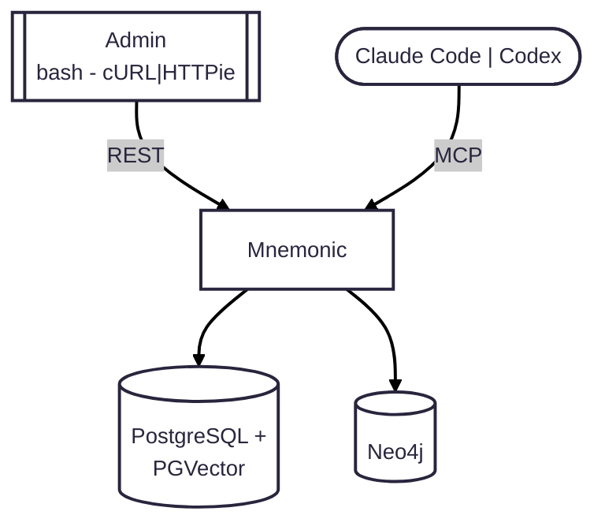

# MVP 1

Iteration 1 establishes the local baseline:

1. Run a single local Mnemonic service with MCP search and Admin API endpoints.
2. Use local PostgreSQL + PGVector and Neo4j as the initial data stores.
3. Validate end-to-end read/write behavior with manual API and MCP calls.

