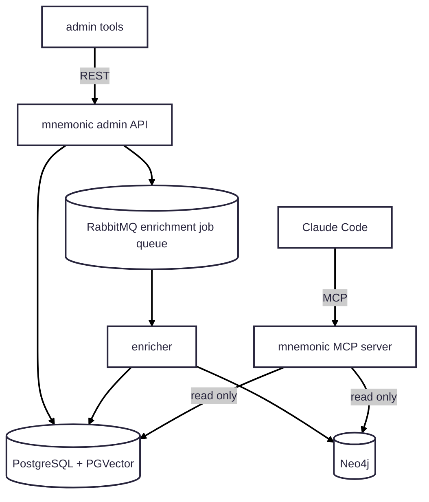

# MVP 2

Iteration 2 decomposes the local runtime and introduces async enrichment:

1. Split MCP server, Admin API, and enricher into separate local services.
2. Add RabbitMQ for enrichment jobs published by the Admin API.
3. Keep MCP read-only and verify enrichment updates PostgreSQL + PGVector and Neo4j.

