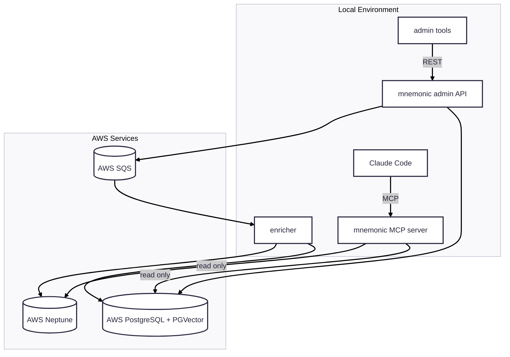

# MVP 3

Iteration 3 moves stateful infrastructure to managed AWS services while keeping application runtime local:

1. Replace local PostgreSQL + PGVector with AWS PostgreSQL + PGVector.
2. Replace local Neo4j with AWS Neptune.
3. Replace local RabbitMQ with AWS SQS, while MCP server, Admin API, and enricher remain local.

